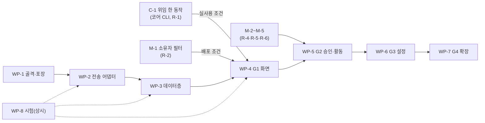

> **사본** — Terra 저장소 `docs/implementation/terra-agent-gui-plan.md`(v0.2.0, 2026-10-11 갱신 — 결정 Q-1~Q-5 확정 반영)를 modules만 보는 세션이 읽도록 옮긴 스냅샷이다. **진행 표(§4.1·§5.2의 상태 열)는 이 사본에서 갱신한다** — 단계가 끝날 때 원본을 이 사본에 맞춘다. 그 밖의 고칠 것은 원본을 고친다. 본문의 `[[링크]]`와 `docs/…` 경로는 Terra 저장소 기준이다.

# Terra Agent GUI — 구현 인수: 시연 화면과 모듈의 격차·남은 일

> [!IMPORTANT] GUI 구현 세션이 이어받는 문서다
> **무엇이 정해졌고, 무엇이 막혔고, 어디서부터 짓는지**를 적는다. 앞의 두 절(§1·§2)만 읽어도 지금 위치를 알 수 있다.
> 구현할 때는 §3(시연 → 실제 API 대응표)과 §5(작업 묶음)를 곁에 둔다.
> 필요 기능·안전 불변식·결정의 정본은 [[docs/modules/terra-agent/design/terra-agent-gui-requirements|요구 문서]]이고, 이 문서는 그것을 되풀이하지 않고 **구현에 필요한 격차와 순서**만 담는다.
> 코드는 바꾸지 않았다. 사실은 소스·계약을 직접 읽거나 시험으로 재현한 것(`[V]`)이고, 읽지 못한 것은 추정(`[I]`)으로 표시했다.

## 0. 이 문서의 자리

| 이 문서가 소유하는 것 | 소유하지 않는 것 |
| --- | --- |
| 시연 화면(`c378a12`)과 `io.terra.agent` 0.1.0의 격차 — 디자인이 못 미치는 곳, 모듈이 못 주는 곳 (§2~§4) | 필요 기능표·안전 불변식 22개·결정 11개 → [[docs/modules/terra-agent/design/terra-agent-gui-requirements\|요구 문서]] |
| 구현 작업 묶음(WP-1~8)과 모듈·코어 쪽 작업 묶음(M-1~8·C-1), 순서와 끝났다고 말하는 조건 (§5) | 에이전트의 권한·승인 모델 → [[docs/modules/terra-agent/design/terra-agent-design\|Terra Agent 설계]] |
| 시연 → 실제 API 대응표(§3), 포장 규약(§5.1), 시험 계획(§5.3) | 색·글자·간격 같은 시각 설계 → 디자인 파일(`web/design/`)과 [[docs/modules/terra-gui/design/unified-gui-ux/terra-gui-visual-design-brief\|시각 디자인 브리프]] |
| 진행 표(§4.1·§5.2의 상태 열) — 구현 세션이 갱신한다 | 모듈·코어 변경의 구현 자체 |

**사본** — modules만 보는 세션을 위해 modules `common/io.terra.agent/web/design/terra-agent-gui-plan.md`에 같은 내용의 사본을 둔다(요구 문서 사본과 같은 방식). 원본은 Terra의 이 파일이다. 진행 표(상태 열)는 **구현이 일어나는 저장소의 사본**에서 갱신하고, 단계가 끝날 때 원본을 사본에 맞춘다 — 둘이 어긋나면 상태 열은 사본이 최신이다.

## 1. 한눈에

### 1.1 지금 있는 것

| 대상 | 지금 | 근거 |
| --- | --- | --- |
| 모듈 `io.terra.agent` | 0.1.0 · `contributions`는 `cli`뿐(**GUI 없음**) · operation 19 · CLI 명령 18 · 세션 상태 7 · entry 12 · 오류 코드 15. 소스·계약·매니페스트가 요구 문서의 측정 시점(modules `69cea20`)과 같다 — `git diff` 0줄. Go 파일 21개(시험 8개 포함) | `[V]` `module.json` · `contracts/api/terra-api.json` · `src/` |
| 시연 화면 | modules 브랜치 `design/agent-gui-dc22-29`의 `c378a12` — `AgentGUI.dc.html` 815줄(보드 8장) · `AgentGUILive.dc.html` 833줄(동작하는 화면). **PR이 없고** `main`(`09add6b`)보다 1커밋 앞선다(충돌 없음). 예시 데이터를 `setTimeout`으로 흉내 낸 시뮬레이션이다 | `[V]` |
| 앱(구현) | **없음** — `web/package.json`도 `ui/`도 없다. 있는 것은 `web/design/`(디자인 파일 2 · 요구 문서 사본 · 지도 이미지)뿐이다 | `[V]` |
| 코어(Terra) | main `7077867`. 에이전트에 걸린 코드(`terra-cli`·`terra-gateway-service`·`terra-agent-core`·`webAppBridge.ts`·`auth`)가 `3dd67c1` 이후 0줄 바뀌었다 — CLI에 `--hand-over`가 없고, 코어 GUI 계정 탭(코어 표 26번, P3)도 없다 | `[V]` `git diff --stat 3dd67c1 origin/main` |
| 요구 문서 | R-1~R-17은 **모두 미구현**, 결정 D-1~D-11은 대부분 대기, 디자인 대조 DC-1~DC-30 | [[docs/modules/terra-agent/design/terra-agent-gui-requirements\|요구 문서]] §10·§12·§13 |

### 1.2 단계별로 — 지을 수 있나, 쓸 수 있나

| 단계 | UI를 지을 수 있나 | 실제로 쓸 수 있나 | 선행 |
| :---: | --- | --- | --- |
| G0 | — (화면 없음) | — | C-1(R-1) · M-1(R-2) · R-3 결정 · R-17 문서 정리 |
| G1 대화 최소(`plan`) | **예.** 모듈 변경 없이 시작한다 — 가짜 Gateway·모듈로 세우고 시험한다 | C-1 뒤 — 지금은 위임 자격을 맡길 길이 없다(요구 §8.1) | M-1 전에는 **배포하지 않는다**(D-6) |
| G2 승인(`ask`·`auto`) | 카드의 틀은 지을 수 있다 | M-2·M-3·M-4 뒤 — 승인 카드의 계약 사실·마감 시각이 없다 | 모듈(R-4·R-5·R-6) |
| G3 설정 | 화면 6 | R-9~R-11 일부 | 모듈·코어 |
| G4 확장 | 무인·원격·검색 | R-12~R-16 | 모듈·코어 |

### 1.3 가장 먼저 알아야 할 함정 열세 가지

| # | 함정 | 대처 | 근거 |
| :---: | --- | --- | --- |
| 1 | `.dc.html`은 그대로 못 싣는다 — 디자인 도구용이다(인라인 `<script>`, `dc.js` 런타임, `{{…}}` 문법). 앱 자산의 CSP는 `script-src 'self'`라 인라인 스크립트가 막힌다 | 번들로 다시 쓴다. 마크업·CSS·접근성 속성은 옮긴다. `style-src`는 인라인을 허용하고 `font-src`는 `'self' data:`, `connect-src`는 `'self'`다 | `[V]` `gui_apps.go:458` |
| 2 | `ui/`는 **빌드 산출물**이다 — 소스는 `web/`, 결과는 `../ui`. 커밋하지 않는다 | `.gitignore`에 `/ui/`를 더한다(에이전트 모듈에는 아직 없다 — node-gui가 그렇게 한다). `package-lock.json`이 없으면 CI가 실패하고, 브라우저가 필요한 시험은 `test`가 아닌 이름(예 `e2e`)으로 둔다 | `[V]` `tools/web-workspace.mjs` · `build-web.mjs` · `test-web.mjs` |
| 3 | **스트림이 없다** — 브리지는 응답 한 번뿐이다 | 폴링: `messages.list?after_seq`를 `running`이면 1초, 승인 대기·유휴면 5초마다 | 요구 §2.3 |
| 4 | 모듈이 재시작하면 `done`·`cancelled`·`failed`가 아닌 **모든 세션이 `archived`** 가 된다(`idle`이던 것도) | `archived`·`done`을 종료로 다루고 입력을 잠근다. 시연의 "종료됨"은 `failed`·`cancelled`만 가른다 → GAP-1 | `[V]` `session.go:564-566` |
| 5 | `last_error`는 **영어 문장**이다(`stopped: this turn ran past its limit of 900s`). 코드(`TIME_LIMIT`)는 기록의 `error` 줄에만 있다 | 머리 칩의 코드는 기록에서 읽는다. 목록 행에서는 코드를 알 수 없다 → GAP-7 | `[V]` `loop.go:282·313·411` |
| 6 | `y`·`n`·`yes`·`no`·`approve`·`deny`(+id)는 **승인 답으로 읽힌다** — 승인 대기가 있으면 일반 글로 보내도 가장 오래된 대기 승인에 답한다 | 보내기 직전 `sessions.get`으로 `pending_approvals`가 비었는지 본다. 폴링 지연 사이에 "y"를 보내면 승인이 된다 | `[V]` `loop.go:603` · `api.go:597` |
| 7 | 만료된 승인 카드는 **entry가 아니다** | 파생한다(§3.2) | `[V]` `loop.go:536-580` |
| 8 | `messages.list`는 `limit`을 안 주면 500줄에서 끊긴다 | `after_seq`로 쪽을 넘긴다 | `[V]` `api.go:548-564` |
| 9 | `session_id`는 **앱이 만든다** — 새 세션 버튼 한 번에 id 하나. 같은 id로 다시 부르면 `created:false`로 답한다(멱등) | 패턴 `^[a-zA-Z0-9][a-zA-Z0-9._-]{0,127}$`. 시연의 `sess-0414`는 모양 예시일 뿐이다 | `[V]` `api.go:483-500` · `session.go:416` |
| 10 | **기존 계정은 `agent.use`가 없을 수 있다** — 새 계정만 기본으로 받는다(소급하지 않았다). 없으면 모든 호출이 403 `MODULE_PERMISSION_DENIED`다(권한 부족과 reach 밖이 같은 문구) | `status.get`만 권한 없이 된다 — 준비 상태 1단계로 쓴다. 시연에 이 상태가 없다 → GAP-2 | `[V]` `products/tree/master/src/terra_master/auth/service.go:675-707` |
| 11 | 승인은 `approvals.post`로만 답한다(I8) | 채팅 입력의 승인 경로를 쓰지 않는다 | 요구 I8 |
| 12 | 재시도 never 넷(`messages.post`·`approvals.post`·`runs.post`·`mcp.put`)은 자동 재전송 금지(I17) | 응답을 못 받았으면 `messages.list`로 확인하고 사람이 다시 누르게 한다 | 요구 I17 |
| 13 | 앱을 **셸 밖에서** 열 수 있다 — 런처가 `/api/v1/gui/apps/<id>/files/<entry>`를 새 탭으로 연다. 그때는 브리지가 없다 | **지원하지 않는다 — Q-1 확정(2026-10-11).** 브리지가 없으면 "셸 안에서 여세요"를 보인다 | `[V]` `launcher.js:385-392` |

### 1.4 시작하는 순서

1. **WP-1**(골격·포장)과 **M-1**(소유자 필터)은 서로 기다리지 않는다 — 같은 날 시작한다. M-1은 modules 저장소의 별도 PR이다.
2. WP-2(전송 어댑터)에서 가짜 전송을 먼저 세운다 — 이후 모든 시험이 이것으로 돈다.
3. G1 화면(WP-4)을 지을 때 §2.2의 GAP-1~4를 같이 반영한다 — 디자인 파일을 기다리지 않는다.
4. C-1(위임 맡기기)은 코어 저장소 일이라 이 세션 밖이다. 서기 전까지 앱은 "제안 · 아직 없음"을 보이고, 실사용 시험은 C-1 뒤로 미룬다. 그 전의 시험은 가짜 전송과 가짜 Gateway·모듈로 한다.

## 2. 시연 화면(`c378a12`) 검증 결과

### 2.1 DC-22~29 — 요구 문서 §13이 지적한 것

앞선 판(`73db596`)에서 열려 있던 여덟 가지를 새 판이 다뤘다. 같은 점검에 새 점검 넷을 더해 35개를 돌렸고, 낡은 기대치 둘(탭이 생겨 실패한 세션이 "종료됨"으로 옮겨진 것)만 시험 쪽을 고쳐 **35개가 모두 통과**했다. 초점·대비·폴백은 따로 쟀다.

| DC | 판정 | 확인한 것 | 남은 것 |
| :---: | :---: | --- | --- |
| DC-22 입력창 | 고쳐짐 | 한글 조합 중 Enter 무시(`isComposing`·`keyCode 229`), `<textarea>`, Shift+Enter는 줄바꿈, 20001자면 글자 수가 `err` 색(rgb(255,93,93)·굵게)이 되고 보내기가 꺼지며 Enter도 무시된다 | 높이가 32px로 고정 → GAP-3 |
| DC-23 대화 스크롤 | **부분** | `overflow-y:auto` — 1014px 내용이 646px 영역에서 스크롤되고 오래된 줄에 닿는다. 맨 아래에서는 새 차례를 따라간다(끝과 6px) | 올려 읽는 중 새 차례가 오면 읽던 줄이 밀린다 → GAP-4 |
| DC-24 문서 규칙 | 고쳐짐 | "이전에 거부한 같은 호출 N회"(I18), `idle` 옆 마지막 오류 칩(I20) | 칩의 값을 시연은 `error` 줄에서 얻는다 → GAP-7 |
| DC-25 무인 게이트 | 고쳐짐 | 자격이 무인이고 사전 승인 목록이 있을 때만 `unattended` 선택이 켜진다. 아니면 비활성 + `CREDENTIAL_NOT_UNATTENDED` 안내, 자격 카드에 "무인"·"사전 승인" 필드 | — |
| DC-26 차례 줄 | 고쳐짐 | "모델 호출 N회 · 세션 누적 … 토큰" — 호출은 차례 몫(2·2), 토큰은 누적(11.2k → 22.4k)임을 밝혔다 | — |
| DC-27 연결·접근성 | 고쳐짐 | 탭이 `role=tablist`·`role=tab`으로 실제 목록을 가른다, 입력칸 `aria-label`, 대화 영역 `role=log`·`aria-live=polite`·`tabindex=0`, 확인창 `role=dialog`·`aria-modal`. 설정·창 제어는 연결하는 대신 `aria-disabled`·`aria-hidden`과 "이 시연에서는 연결하지 않았습니다"로 밝혔다 | 종료 판정이 `failed`·`cancelled`뿐 → GAP-1 |
| DC-28 키보드 초점 | 고쳐짐 | 탭 정지점 11곳이 모두 `:focus-visible`이고 2px 안쪽 고리(`#b9aeff`, offset −3px)가 보인다. 입력칸은 상자 전체에 `:focus-within` 고리, 탭은 버튼이다. 고리 바깥 화소 대신 안쪽 변화 화소로 쟀다 — 318~1296(입력칸 36770). 앞선 판은 `.sess.on` 64 → 0, `.opt` 505 → 0 | 주 버튼 위 고리의 대비는 재지 않았다 |
| DC-29 글자 대비 | 고쳐짐 | 글자 75개의 최저 대비가 뒤 배경 검정·회색·흰색에서 5.88·5.85·5.46으로 모두 4.5:1 이상이다(앞선 판은 5.05·3.94·2.99, 미달 0·1·2개). `prefers-reduced-transparency`·`prefers-contrast:more`에서는 창이 단색(`#13161b`)·흐림 없음·카드 불투명이 되고 대비는 6.06(뒤와 무관), `forced-colors`는 시스템 색으로 떨어진다 | 폴백 규칙의 `.glass`는 DOM에 없는 클래스이고, 카드는 폴백에서도 `backdrop-filter` 선언이 남는다(불투명이라 눈에 안 보인다) |

### 2.2 시연이 아직 못 미치는 것 — GAP

"누가"는 고칠 수 있는 쪽이다. 디자인 = 디자인 파일(`web/design/`)을 고칠 일, 구현 = 앱을 지을 때 처리할 일이다.

| GAP | 미흡한 것 | 근거 | 누가 | 단계 |
| :---: | --- | --- | :---: | :---: |
| GAP-1 | **종료 판정이 둘뿐이다.** 시연의 `isEnded`는 `failed`·`cancelled`만 본다. `archived`(모듈 재시작 뒤 `idle` 포함)와 `done`이 "내 세션"에 남고 입력이 켜지며, 보내면 409 `SESSION_FINISHED`다. 정적 보드 ⑥은 `archived`를 그린다 | `[V]` Live 769·783 · `session.go:564` | 디자인 · 구현 | G1 |
| GAP-2 | **"권한 없음" 상태가 없다.** 기존 계정은 `agent.use`를 소급 받지 않았다 → 403 `MODULE_PERMISSION_DENIED`. 준비 상태·배너·오류 사전 어디에도 없다 | `[V]` `auth/service.go:675-682` | 디자인 · 구현 | G1 |
| GAP-3 | **입력칸이 늘어나지 않는다**(DC-30). 5줄을 쓰면 `scrollHeight` 112인데 높이는 32px로 고정이고 `max-height:120px`만 선언돼 있다 | `[V]` 시험 | 디자인 | G1 |
| GAP-4 | **올려 읽는 중 읽던 줄이 밀린다**(DC-23 잔여). 스크롤 위치가 바닥 기준(−350)으로 고정이라 새 차례(331px)만큼 위로 밀려 한 차례에 화면 밖으로 나간다 | `[V]` 시험 · Live CSS 359~360 | 디자인 · 구현 | G1 |
| GAP-5 | **승인 카드의 재료가 하드코딩이다.** "계약이 말하는 것" 6칸과 "모델이 말하는 것"이 고정 문자열이다. R-4 전에는 "계약 사실을 읽지 못했다" 모양이 필요한데 디자인에 없다(DC-9 잔여) | `[V]` Live 500~501 · `session.go:147` | 디자인(모양 한 장) · 모듈(M-2) | G2 |
| GAP-6 | `accepted-job` **칩의 출처가 없다.** Live가 `call` 줄에 박아 넣는데 실제 `call` entry에는 결과 방식이 없다(R-5) | `[V]` Live 750 · `loop.go:482-525` | 모듈 · 코어(M-5) | G2 |
| GAP-7 | **머리 칩의 오류 코드를 목록에서 못 읽는다.** `last_error`가 영어 문장이다(함정 5) | `[V]` `loop.go:282·313·411` | 구현 · 모듈 제안(M-6) | G1 |
| GAP-8 | **모델 이름을 구조로 못 읽는다.** 시연은 `claude-opus-5`를 박아 넣는다. 실제 `model` 줄은 `note` 한 줄(`anthropic/claude-opus-5 · 12345 B · 2 tool result(s) carried`)뿐이고 스냅샷 `model`은 열 때 값이다 | `[V]` `loop.go:329` | 모듈 제안(M-7) | G1 |
| GAP-9 | **새 세션 폼이 모자란다.** Live에는 자율성 4종·가짜 MCP 토글 하나·한도 문구뿐이다. `topic`·`simulate`·한도 셋(`max_steps`·`max_seconds`·`token_budget`)·provider·MCP 다중 선택이 없다. 정적 보드 ⑤에는 있다 | `[V]` Live 522~538 · `api.go:400` | 구현(보드 ⑤ 기준) | G1 `plan` · G2 |
| GAP-10 | **움직이는 시연이 없는 화면** — 준비 상태(고정 "준비됨"), 위임 안내, 설정, 자격 거두기 3단계(DC-20). 정적 보드 ③·④·⑧이 정본이다 | `[V]` Live 440 | 구현 | G1 · G3 |
| GAP-11 | 승인 카드의 **시간 초과·무응답 거부·취소**는 entry가 아니다 — 파생 규칙이 필요하다(§3.2) | `[V]` `loop.go:404-415·536-580` | 구현 | G2 |
| GAP-12 | **카운트다운이 270초 고정**이다. R-6(`expires_ms`) 전에는 근사뿐이다 — 마지막 `user` 줄 시각 + `max_seconds`와 `approval` 줄 시각 + 30분 중 작은 값. "틀릴 수 있음"을 표시한다 | `[V]` Live 664 · `loop.go:28` | 모듈(M-3) | G2 |
| GAP-13 | 헤더의 **대상 노드 이름**(`tree-home`)의 출처가 정해지지 않았다. `status.get`에 노드 이름이 없고 브리지는 `/api/v1`을 못 부른다 | `[V]` `api.go:172` · `webAppBridge.ts` | 결정 | G1 |
| GAP-14 | 우측의 **"모듈 상태 io.terra.chat Stopped" 카드**는 출처 없는 시연 전용 예시다 | `[V]` Live 549 | 구현(생략) | — |
| GAP-15 | **접근성 규칙이 문서에 없다.** 요구 §6.5에 없고 DC-27은 "구현 전에 정한다"고 했다. Q-2 확정(2026-10-11)으로 요구 §6.5에 규칙을 더했다 → **해소** | 요구 §13.4 DC-27 | 해소 — 요구 §6.5 | G1 |

## 3. 시연 → 실제 API 대응표

시연의 상태 모양은 `AgentGUILive.dc.html`의 `state`·`renderVals()`이고, 실제 모양은 모듈의 응답이다.

### 3.1 세션과 화면 값

| 시연 | 실제 | 비고 |
| --- | --- | --- |
| `id`와 `sid` 둘 | `session_id` 하나 | 앱이 만들고 멱등이다(함정 9) |
| `title` | `topic?` | 선택이고 길이 강제가 없다. 비면 첫 `user` 줄의 앞부분이나 `session_id` |
| `status` 5종 | `state` 7종 | `done`·`archived` 추가(GAP-1) |
| `time` 상대 표기("방금") | `updated_ms`·`created_ms` | 상대 시각은 앱이 계산한다 |
| `turnCalls`(그 차례의 호출) | 마지막 `user` 줄 이후 `model` 줄의 수 | `steps`는 세션 누적이다(요구 §14.3 ①) |
| `inTok`·`outTok`·`cache` | `usage.input_tokens`·`output_tokens`·`cache_read_tokens`(+`cache_write_tokens`) | 세션 누적이고 차례별 값은 없다 |
| `kb`(나간 양) | 모든 `model` 줄의 `sent_bytes` 합 | 시연은 호출마다 12.4 KB 고정 |
| 머리 `lastErr`(코드) | 마지막 `error` 줄의 `error_code` | 스냅샷 `last_error`는 영어 문장(GAP-7) |
| 우측 "소유자 alice" | 스냅샷 `owner` | 합성 principal일 수 있다(요구 §9) |
| 우측 "모델 claude-opus-5 · 열 때 값" | 스냅샷 `model`은 열 때 값, 최근 값은 최신 `model` 줄의 `note` 문자열 | 구조 필드 없음(GAP-8) |
| 한도 "24 · 900초 · 무제한" | `max_steps` · `max_seconds` · `token_budget?` | 열 때 고정. **요청한 값이 아니라 응답의 값**을 보인다 |
| `cred.unattended`·`cred.pre` | `credentials.get`의 `unattended`·`pre_approved[]` | `pre_approved`는 비면 **키가 없다** — 없음을 빈 목록으로 읽는다 |
| 우측 권한 칩·reach·"7h 03m" | `credentials.get`의 `permissions[]`·`reach`·`expires_at`(+`expired`) | 값은 읽는 시점의 만료만 안다(폐기는 모른다) |
| 준비 상태 세 칸(고정 "준비됨") | 합성 — `status.get`(모듈, `delegate_door`) · `models.list`(기본 provider `registered`) · `credentials.get`(`registered`·`expired`) + 권한 없음(GAP-2) | 요구 §6.2의 순서를 따른다 |
| 인박스 | `sessions.list`의 `pending_approvals[]` 모음 | **R-2 전에는 남의 것이 섞여 온다** — 앱이 `owner`로 거르되 노출은 막지 못한다 |
| "새 세션 열기" 자율성 4종 | `sessions.post.autonomy` | 열 때 고정 · 기본 `plan`(D-7). G1에서는 `plan`만 켠다 |

### 3.2 entry 대응과 승인 카드 합성

| 시연 `kind` | 실제 entry | 합성·주의 |
| --- | --- | --- |
| `user` | `user` | 본인은 `author == owner` |
| `assistant` | `assistant` | 응답 전체가 한 번에 온다(토큰 스트리밍 없음) |
| `model` | `model` | `#n`은 차례 안의 순번(앱 계산). KB는 `sent_bytes` ÷ 1024. `note`는 영어 문자열 |
| `call`(ok·refused) | `call` | `status` ∈ `ok`·`refused`·`error`, `decision` ∈ `run`·`confirm`·`plan`·`refuse`. `refused`는 오류가 아니다(`plan`의 제안이거나 거절) |
| `call`(planned) | **`planned`** | 시연은 `call`에 합친다. 실제는 다른 `kind`다 — "호출 예정 (시뮬레이션) — 실행되지 않았다" |
| `call`(accepted) | 없음 | 결과 방식 `accepted-job`은 entry에 없다(GAP-6, R-5). 계약을 읽을 수 없는 브리지에서는 알 수 없다 |
| (시연에 없음) | `external` | `server`·`result_bytes`. "Gateway 감사에 없다"를 줄에 그대로 보인다 |
| `card` | `approval` + 스냅샷 `pending_approvals[]` + `approved`/`denied` | 아래 상태표 |
| `done` | `done` | `note`는 `N turn(s) · X in / Y out tokens`(영어, 세션 누적) — **파싱하지 않는다**. 호출 수는 `model` 줄에서, 토큰은 `usage`에서 |
| `error` | `error` | `text`는 영어, 코드는 `error_code`. 코드 사전으로 푼다(요구 §6.4) |
| `cancelled` | `cancelled` | 종료 상태에도 줄이 또 쌓인다(상태 가드 없음) — 종료 상태에서는 취소 버튼을 숨긴다 |

승인 카드는 `approval` 줄의 `request_id`로 세운다. 카드의 상태는 이렇게 판정한다.

| 카드 상태 | 판정 규칙 |
| --- | --- |
| 대기 | `approval` 줄이 있고 스냅샷 `pending_approvals`에 같은 `request_id`가 있다 — **이때만** 승인·거부를 켠다(I9) |
| 승인함 | 같은 `request_id`의 `approved` 줄 |
| 거부함 | 같은 `request_id`의 `denied` 줄이고 `note`가 `no answer within …`이 아니다 |
| 무응답 거부 | `denied` 줄의 `note`가 `no answer within 30m0s` — 한 차례 시간이 30분보다 클 때만 생긴다 |
| 시간 초과 | `approval` 줄 뒤에 `approved`·`denied`가 없고 `pending_approvals`에도 없고, 뒤이어 `error`(`TIME_LIMIT`)가 있다 — 기본 한도(900초)에서는 이쪽이다 |
| 취소됨 | 위와 같은데 뒤이은 것이 `cancelled` 줄 |
| 이미 처리됨 | `approvals.post`가 404 `APPROVAL_NOT_FOUND`를 줬다 — 크게 띄우지 않고 세션을 새로 읽는다 |

### 3.3 시연에 박혀 있는 값 → 구현의 출처

| 시연의 값 | 출처 |
| --- | --- |
| 헤더 `io.terra.agent 0.1.0` | `status.get`의 `version` |
| 헤더 `tree-home` | 미정(GAP-13) |
| 승인 카드 "계약이 말하는 것"(위험·확인·부작용·재시도·결과·대상) | M-2 이후 `pending_approvals`의 계약 사실. 그 전에는 "계약 사실을 읽지 못했다" + `judgement` 문장 |
| "모델이 말하는 것" | `pending_approvals[].reason` — 모델의 주장이고 근거가 아니다 |
| 카운트다운 270초 | M-3 이후 `expires_ms`. 그 전에는 근사(GAP-12) |
| 추천 칩 둘("chat 모듈이 죽었어…") | 시연 전용 예시 — 구현은 빈 세션 안내 문구로 대신한다(결정) |
| "모듈 상태 io.terra.chat Stopped" | 시연 전용(GAP-14) |

## 4. 모듈·코어 쪽 격차

요구 문서 §10의 R-1~R-17을 지금 소스에서 다시 읽었다 — R-1~R-11·R-13·R-14는 해당 줄을 직접 열었고, R-12·R-15·R-16은 코드가 측정 시점과 같다는 것으로 갈음했다. 소스·계약·매니페스트가 측정 시점과 같으므로(`git diff` 0줄) 이전의 `[V]`는 그대로 서 있다. 이번에 **더 좁혀진 것**은 표의 끝 열에 적었다.

| R | 지금(소스) | 앱이 그 사이에 할 일 | 어디서 | 단계 | 더 좁혀진 것 |
| :---: | --- | --- | --- | :---: | --- |
| R-1 | CLI에 `--hand-over`가 없다. `grant` 응답의 `token`은 `***`다. 코어 GUI 계정 탭(표 26)은 P3로 미구현 | "제안 · 아직 없음" 안내(보드 ③) · `credentials.get`으로 사실만 | 코어 `terra-cli`(H-1) → 코어 GUI(H-2) | G1 | — |
| R-2 | `sessionList`(`api.go:536`)·`list()`(`session.go:475`)에 소유자 필터가 없다 | `owner`로 거른다(노출은 못 막는다) → **배포 보류**(D-6) | 모듈 | G1 | 핸들러가 `r`을 안 받는다 — 시그니처부터 바꾼다(M-1) |
| R-3 | `principal()`(`api.go:143`)이 `X-Terra-Principal`만 읽는다 | 브리지로 부른다(I-1) — 모듈 변경 없음 | 결정(D-2) + 모듈 | G1 | — |
| R-4 | `approvalRequest`(`session.go:147`)에는 `request_id`·`operation_id`·`reason`·`judgement`·`input`·`created_ms`뿐이다 | "계약 사실을 읽지 못했다" 모양 + `judgement` | **모듈만** | G2 | `approver`(`loop.go:536`)가 받는 `ApprovalRequest`에 계약 전체(`Operation`)가 이미 있다 — 코어 변경이 필요 없다(M-2) |
| R-5 | `entry`(`session.go:90`)에 입력·이유·결과 요약·`output.mode`가 없다 | 접힌 상세에서 빈 칸을 숨긴다 | 모듈 + 코어 | G2 | 이유·판정 근거는 `agentcore.Record`에 **이미 있는데** `recorder`(`loop.go:482`)가 옮기지 않는다 — 모듈만으로 된다(M-4). 입력·결과 요약·`output.mode`는 `Record`에 없어 코어 확장이 따른다(M-5) |
| R-6 | `approvalRequest`에 마감 시각이 없다 | 근사(GAP-12) | **모듈만** | G2 | `approver`가 대기 시작 시각과 `approvalTimeout`(`loop.go:28`)·컨텍스트 남은 시간을 쥐고 있다(M-3) |
| R-7 | `messageStream`(`api.go:621`)에 `id:`·재개가 없고, 구독자 버퍼(64)가 차면 줄이 조용히 누락된다(`session.go:225`) | 폴링 전송이면 해당 없음. 토큰 전송일 때 이음새 절차(요구 §5.3) | 모듈 | G2 | — |
| R-8 | 상태 변화는 디스크의 `meta` 줄로만 남고 entry나 스트림 이벤트가 없다(`session.go:247`). `sessionList`에 `since`·쪽이 없다 | `sessions.get` 폴링 | 모듈 | G3 | — |
| R-9 | `modelPut`(`api.go:267`)이 공급자 이름(`anthropic`만 안다)과 키 길이(8자 이상)만 본다. `base_url`은 검증이 없고 결과가 노드 전역이다 | 저장 확인에 노드 전역을 쓴다(보드 ④) | 모듈 · 코어 | G3 | — |
| R-10 | `credentialGet`(`api.go:241`)은 로컬 만료만 안다 | "만료 시각 전 — 폐기 여부는 확인하지 못함" | 모듈 · 코어 | G3 | — |
| R-11 | `modelPut`이 키를 제공자에 시험하지 않는다. 틀린 키는 첫 메시지에서 세션을 `failed`로 만든다 | 저장 확인에 "키를 시험하지 않는다"를 쓴다(보드 ④) | 모듈 | G3 | — |
| R-12 | `mcpPut`(`api.go:324`)은 등록하면서 실제로 실행한다 — 미리보기가 없다 | 앱에 등록 화면을 두지 않는다(D-4) | 모듈 | G4 | — |
| R-13 | 세션 삭제 핸들러가 없고 `load()`(`session.go:515`)가 시작 때 전부 올린다 | 종료됨 탭만 | 모듈 | G4 | — |
| R-14 | `cancel`(`loop.go:226`)은 종료 상태를 만든다. 모델 호출 실패는 `failed`(`loop.go:343`)로 끝난다 | 새 세션 안내 | 모듈 | G4 | — |
| R-15 | Gateway 감사 조회 API가 없다 | "trace id: …" 복사 | 코어 | G4 | — |
| R-16 | 원격 노드 operation 호출 도구가 없다(A6의 남은 절반) | 화면 8은 G4 | 코어 | G4 | — |
| R-17 | 요구 §14.3의 불일치 16건이 모두 그대로다(소스 0줄 변경) | 화면은 소스를 정본으로 따른다 | 문서 | G1 | — |

### 4.1 모듈·코어 작업 묶음

G1을 안전하게 열고 G2를 여는 **최소 묶음**이다. 모듈 변경은 응답 모양을 바꾸므로 계약(`contracts/api/terra-api.json`)의 출력 스키마·예시와 `contract_map_test.go`를 함께 본다. 모듈 CI의 `validate`(`validate-modules.mjs`·`check-schema-drift.mjs`)가 이를 잡을 수 있다 `[I]` — 실행하지 않았다.

| 묶음 | 하는 일 | 위치(`common/io.terra.agent/src/`) | 끝났다고 말하는 조건 | 단계 | 상태 |
| :---: | --- | --- | --- | :---: | :---: |
| M-1 | `sessions.list`를 호출자의 `owner`로 거른다 | `api.go:536` `sessionList`(`r`을 받아 `principal()`) · `session.go:475` `list(owner)` | `api_test.go`: 남의 세션이 목록·응답(`topic`·`answer`·`pending_approvals.input`)에 없다. CLI `terra agent list`도 본인 것만 본다 — 의도한 변화다 | G1 배포 조건 | 미착수 |
| M-2 | `pending_approvals`에 계약 사실을 싣는다 — `risk`·`confirmation.mode`·`idempotency.mode`·`retry.mode`·`sideEffects`·`output.mode`·요구 권한 | `loop.go:536` `approver`(`request.Operation` 사용) · `session.go:147` · `:203` 스냅샷 | 계약 값 그대로이고, 계약이 적지 않은 칸은 "없음"이 아니라 "적지 않음"으로 구분된다(DC-17). 시험 추가 | G2 | 미착수 |
| M-3 | `pending_approvals`에 `expires_ms`를 싣는다 | `loop.go:536` · `:28` | `min(30분, 남은 max_seconds)`와 같다. 시험 추가 | G2 | 미착수 |
| M-4 | `call`·`planned` entry에 `reason`·`judgement`를 옮긴다 | `loop.go:482` `recorder` · `session.go:90` `entry` | 승인 없이 실행된 호출에도 모델의 이유가 남는다. 비밀은 가린다(I1) | G2 | 미착수 |
| M-5 | 입력(가림 규칙 포함)·결과 요약·`output.mode`를 `call` entry에 싣는다 | 코어 `terra-agent-core/record.go`의 `Record` 확장 + `recorder` | "접수 ≠ 완료"를 줄에서 가른다(DC-18) | G2 | 미착수 |
| M-6 | 스냅샷에 `last_error_code`를 더한다 (선택, GAP-7) | `loop.go:282·313·411` · `session.go:118` | 목록 행에서도 코드가 보인다 | G1 | 미착수 |
| M-7 | `model` entry에 `provider`·`model`을 더한다 (선택, GAP-8) | `loop.go:329` | 앱이 `note`를 파싱하지 않는다 | G1 | 미착수 |
| M-8 | 스트림 `id:`·재개(R-7), 상태 변화 알림(R-8) | `api.go:621` · `session.go:247` | 토큰 전송을 쓸 때만 필요 | G2~G3 | 미착수 |
| C-1 | 위임 발급과 맡기기를 한 동작으로(R-1, H-1) | 코어 `products/common/apps/terra-cli` | 사람이 토큰을 보지 않고 `credentials.get`이 `registered:true`를 답한다 | G1 사용 조건 | 미착수 |

## 5. 구현 작업 묶음

### 5.1 포장 규약과 제약 — 확인된 사실

| 항목 | 규칙 | 근거 |
| --- | --- | --- |
| 웹 모듈의 정의 | `web/package.json`이 있는 모듈이다. 소스는 `web/`, 빌드 결과는 `../ui`(Vite `outDir`)다 | `[V]` `tools/web-workspace.mjs` |
| 포장 | `terra module pack`의 허용 목록은 `contracts`·`ui`·`bin`·`config`·`scene`이다 — `web/`(`web/design/` 포함)은 출하되지 않는다 | `[V]` 같은 파일 머리말 |
| 잠금 파일 | `package-lock.json`이 있어야 한다(`npm ci`). 없으면 CI가 실패한다 | `[V]` `installDependencies` |
| 스크립트 | `scripts.build` 필수. `scripts.test`가 없으면 경고(조용히 통과하지 않는다). 브라우저가 필요한 시험은 `test`가 아닌 이름으로 둔다 — CI 러너에 브라우저가 없다 | `[V]` `build-web.mjs` · `test-web.mjs` |
| 빌드 뒤 검사 | 매니페스트의 static 앱 `entry`가 있어야 하고 자리 표시자("웹 빌드가 아직 없습니다")가 아니어야 한다. `terra module pack`은 이를 보지 않는다 | `[V]` `appEntryProblems` |
| 매니페스트 | `contributions.gui.apps[]`에 `id`·`name`·`mode:"static"`·`entry:"ui/index.html"`·`isolation:"sandboxed"`·`permissions:["agent.use"]`. 기존 `cli`는 그대로 둔다. 서버는 `route`를 `/apps/<id>`로, `isolation`을 `sandboxed`로 고정한다. 앱 `id`는 모듈 id와 같게 하거나 `.web`을 붙인다(둘 다 선례가 있다) | `[V]` `gui_apps.go:12-18` · `io.terra.nodetalk/module.json` · `lab.stellaxia.node-gui/module.json` |
| `.gitignore` | `/ui/`를 더한다. 에이전트 모듈에는 `bin/`과 `src/` 산출물뿐이다 | `[V]` 두 `.gitignore` |
| 앱 자산 CSP | `default-src 'self'; script-src 'self'; style-src 'self' 'unsafe-inline'; img-src 'self' data:; font-src 'self' data:; connect-src 'self'; object-src 'none'; base-uri 'self'; frame-ancestors <셸>` | `[V]` `gui_apps.go:458-460` |
| 빌드 설정 | `base:'./'`와 hash 라우팅은 바꾸지 않는다. 토큰은 메모리에만 둔다 | `[V]` [[docs/guides/module-web-screen-guide\|웹 화면 가이드]] §2·§4 |
| 브리지(앱 쪽) | `hello` → `ready`(`permissions`) → `request`/`response`. 참조 구현은 `io.terra.webapp-host/ui/launcher.js`(핸드셰이크 912행, 요청 채널 330~400행) | `[V]` |
| 브리지(셸 쪽) | 경로는 `/api/modules/`·`/api/nodes/`만, 메서드 다섯 가지, 선언 권한이 비면 `BRIDGE_NO_PERMISSIONS`, 응답은 `{ok,status,data}` 한 번이다 | `[V]` `webAppBridge.ts` |
| 앱 열기 | 런처 "Terra Apps"(`io.terra.webapp-host`, 정적 앱, 권한 선언 없음)가 `/api/v1/gui/apps`를 읽어 셸에 `terra.webapp.mountApp`을 보낸다. 셸 밖에서는 `/api/v1/gui/apps/<id>/files/<entry>`를 새 탭으로 연다 | `[V]` `launcher.js:354·385-392·711` — 실행 시험은 하지 않았다 |
| CI | `validate`(매니페스트·계약 일치) → `web`(`build-web.mjs`·`test-web.mjs`) → `pack`(Terra와 함께) | `[V]` `.github/workflows/ci.yml` |

### 5.2 앱 작업 묶음

상태 열은 구현 세션이 갱신한다(미착수 · 진행 · 끝남).

| 묶음 | 하는 일 | 선행 | 끝났다고 말하는 조건 | 단계 | 상태 |
| :---: | --- | --- | --- | :---: | :---: |
| WP-1 | **골격·포장** — `web/`에 Vite + TypeScript + Vitest 골격(`terra module new --web`이 굽는 모양), `package.json`(`build`·`test`·`e2e`)·`package-lock.json`, `.gitignore`에 `/ui/`, `module.json`에 `contributions.gui.apps[]`. `web/design/`은 건드리지 않는다 | — | `node tools/build-web.mjs --module io.terra.agent`가 자리 표시자 아닌 `ui/index.html`을 만들고, `node tools/test-web.mjs`·`node tools/validate-modules.mjs`가 통과한다 | G1 | 미착수 |
| WP-2 | **전송 어댑터** — `AgentTransport` 하나, 구현 셋: 브리지·가짜(시험·시연)·토큰(개발용 `VITE_TERRA_DEV_TOKEN`). 오류 봉투 정규화, 재시도 never 넷 가드, 15~20초 시간 제한 처리, 폴링 스케줄(`running` 1초 · 대기·유휴 5초 · 숨겨진 탭은 늦춘다) | WP-1 | Vitest: 브리지 응답·오류 매핑·재시도 가드·스케줄. 화면 코드는 어느 전송인지 모른다 | G1 | 미착수 |
| WP-3 | **데이터층** — 세션·기록 저장소(`seq` 이음새: `after_seq` 쪽 넘김, 중복 버림, 구멍이면 다시 읽기), 파생 값(차례 호출 수·나간 바이트·마지막 오류 코드·승인 카드 합성(§3.2)), 소유자 필터(R-2 전 임시), 상태→화면 규칙(요구 §6.1), 오류 코드 사전(요구 §6.4 + `MODULE_PERMISSION_DENIED`), 준비 상태 합성(요구 §6.2 + 권한 없음) | WP-2 | Vitest: 이음새(중복·구멍·재개), 카드 합성 일곱 상태, 상태 규칙 7종, 사전이 계약 오류 15개와 Gateway 오류 8개를 모두 덮는다 | G1 | 미착수 |
| WP-4 | **G1 화면** — 화면 1·2·3·7: 준비 상태 · 세션 목록(탭 "내 세션"/"종료됨" — 종료 = `done`·`cancelled`·`failed`·`archived`) · 열기(`plan`만, 멱등 id) · 대화(줄 종류 12종) · 입력(IME·20000자·Shift+Enter·자동 높이) · 취소(확인) · 위임 안내("제안 · 아직 없음"). GAP-1~4·7~9를 반영한다 | WP-3 | e2e(가짜 Gateway): §5.3의 G1 몫 점검이 앱에서도 통과하고, 폴링에서 줄이 빠지거나 겹치지 않는다 | G1 | 미착수 |
| WP-5 | **G2 화면** — 화면 4·5: 승인 카드·인박스·활동(`call`·`planned`·`external` 줄). `ask`·`auto` 세션을 연다. 거부 기억 표식(I18) | WP-4 · M-2 · M-3 · M-4 | 카드가 계약 사실과 모델의 주장을 갈라 보인다. 같은 승인을 두 번 눌러도 한 번만 처리된다. 모델·외부 텍스트의 HTML 삽입 시험이 통과한다 | G2 | 미착수 |
| WP-6 | **G3 화면** — 화면 6: 모델 등록·교체·삭제(마스킹 입력, 노드 전역 확인), 자격 상태·거두기 3단계(DC-20), MCP 목록(읽기), 한도 기본값 | WP-5 | 키가 다시 보이지 않는다. 노드 전역 확인이 서 있다. 자격 만료·폐기 안내가 요구 §6.2를 따른다 | G3 | 미착수 |
| WP-7 | **G4** — 무인 세션(사전 승인 선택), 화면 8(원격 노드), 검색·삭제·보존 | WP-6 · R-12~R-16 | 각 항목이 요구 변경과 함께 닫힌다 | G4 | 미착수 |
| WP-8 | **시험(상시)** — §5.3. 시연 점검 하네스는 modules `common/io.terra.agent/web/design/checks/`(Q-5) | WP-2부터 | 묶음마다 해당 시험이 같은 PR에 들어간다 | 상시 | 미착수 |

### 5.3 시험 계획

| 층 | 무엇을 | 어떻게 돌리나 | 근거 |
| --- | --- | --- | --- |
| 순수 논리 | 이음새 병합, 상태→화면 규칙, 오류 사전, 승인 카드 합성(§3.2), 재시도 가드, 폴링 스케줄, 파생 값 | Vitest — `npm test`. CI `web` 잡이 돈다 | 요구 §11 |
| 브라우저(e2e) | 가짜 Gateway·모듈(operation 19건 흉내)을 세우고 앱을 띄워 아래 점검을 돌린다 | Playwright — `npm run e2e`. CI 러너에 브라우저가 없어 `test`로 두지 않는다 | `[V]` `test-web.mjs` |
| 접근성·초점·대비 | 탭 순서의 모든 정지점이 `:focus-visible`이고 안쪽 고리가 보인다 · 글자 대비 4.5:1 이상(뒤 배경 검정·회색·흰색) · `prefers-reduced-transparency`·`prefers-contrast:more`·`forced-colors`에서 단색으로 떨어진다 | e2e + CDP `Emulation.setEmulatedMedia`(`prefers-reduced-transparency`는 CDP로만 켠다) | §2.1의 측정 방법 |
| 실 모듈 스모크 | 실제 `io.terra.agent`(가짜 모델 서버)에 앱을 붙여 열기 → 말하기 → 승인 한 판 | 수동 또는 별도 잡. 실 Anthropic 호출은 시험에 쓰지 않는다 | 요구 §11 |

이식할 점검 — 시연에서 35개를 돌려 모두 통과했다. 앱에서도 같은 묶음을 e2e로 돌린다. 시험 코드는 이 저장소가 아니라 modules `common/io.terra.agent/web/design/checks/`에 있다(Q-5 확정, 2026-10-11) — 실행법과 실행 결과는 그 폴더의 `README.md`가 적는다. 앱의 e2e가 서면 그쪽으로 옮긴다.

| 묶음 | 본 것 |
| --- | --- |
| 불러오기 | 콘솔 오류·페이지 오류·실패한 요청·4xx가 없다 |
| 승인 한 판 | `ask` 세션에 글 → `running`(입력 잠김) → `waiting-approval`(카드·인박스·머리 칩·입력 잠김) → 카운트다운 → 승인 → `accepted-job` "접수 ≠ 완료" → `idle`. 두 번 불러도 한 번, 실제 더블클릭도 한 번 |
| 거부·시간 초과·취소 | `TERRA_APPROVAL_DENIED` 줄 · `TIME_LIMIT`(`denied` 줄 없음, 카드 "시간 초과", 입력 복귀) · 확인창과 취소 뒤 20초 동안 줄이 늘지 않음, 대기 카드 "취소됨" |
| 자율성 | `plan`은 제안만, `ask`·`auto`는 위험한 호출을 묻고, `unattended`는 묻지 않고 거절한다 |
| 무인 | 무인 + 외부 MCP 충돌 배너와 "세션 열기" 꺼짐 · 무인 자격이 아니면 `unattended`가 꺼진다(DC-25) |
| 입력 | 공백만은 못 보냄 · HTML과 `{{…}}`가 글자로 나옴 · 연타해도 한 번 · 조합 중 Enter 무시 · Shift+Enter 줄바꿈 · 20001자 차단 |
| 인박스·종료·규칙 | 다른 세션의 대기 승인이 인박스에 뜨고 열린다 · `failed` 읽기 전용 · I18 표식 · I20 마지막 오류 · 차례 줄(호출은 차례 몫, 토큰은 누적) |
| 스크롤·접근성 | 긴 기록이 스크롤되고 새 줄이 맨 아래에서 따라간다(GAP-4까지) · 이름 있는 입력 · `role=log`·`role=dialog` · 탭 |
| 초점·대비·폴백 | 위 표 |

## 6. 결정 대기

요구 문서 §12의 D-1~D-11 가운데 구현에 걸리는 것의 지금 상태다.

| 결정 | 지금 | 구현이 기다리는가 |
| :---: | --- | --- |
| D-1 배치 | 권고 A(일반 `static` 앱 + 브리지). 앱 쪽 프로토콜의 참조 구현이 있다(§5.1) | 어댑터로 감싸므로 기다리지 않는다 |
| D-2 신원 키 | 권고 I-1(브리지). 토큰 전송을 쓰면 I-2가 필수 | 브리지로 가는 한 기다리지 않는다 |
| D-3 위임 자리 | 권고 H-1 → H-2. C-1이 선다 | 실사용 조건 |
| D-4 MCP 등록 자리 | CLI 우선 | 앱에 두지 않는다 |
| D-6 `sessions.list` 수정 전 배포 | 보류 | **배포 조건**(M-1) |
| D-7 기본 자율성 | `plan` 고정 — 시연도 그렇게 한다 | — |
| D-8 앱을 여는 길 | **소스로 확인했다** — 런처의 `mountApp`(셸 안), 직접 열람(새 탭). 실행 시험은 하지 않았다(§5.1) | 사용자 확인 |
| D-10 테마 | 어두운 유리 한 벌. 폴백(단색)이 들어와 글자 대비 위험이 줄었다. 재질은 디자인이 멈춘 뒤 정한다 | 기다리지 않는다 — 시연이 이미 `--f-*` 변수로 쓰므로 토큰으로 분리해 옮긴다 |
| D-11 글꼴 | 시연의 스택 맨 앞이 `Pretendard Variable`·`Pretendard`·`Inter`이고 글꼴 파일은 없다. CSP `font-src 'self' data:`라 쓰려면 앱에 싣는다(OFL 고지·용량) | **WP-4가 끝나기 전** — 싣든지 스택에서 뺀다 |

이 문서가 올린 질문 Q-1~Q-5를 사용자가 **2026-10-11에 권고(기본값)대로 확정**했다. 아래 표의 "확정" 열이 그 결과이고, 구현은 이를 전제로 한다.

| # | 질문 | 권고 | 확정 |
| :---: | --- | --- | --- |
| Q-1 | 앱을 **셸 밖**(직접 열람)에서도 지원하나? 지원하면 로그인 방식·토큰 취급·신원(R-3)이 되살아난다 — 런처는 로그인 폼과 `authHeaders()`를 쓴다 | 지원하지 않는다. 브리지가 없으면 "셸 안에서 여세요"를 보인다 | **확정(2026-10-11, 권고대로)** — 셸 밖 직접 열람은 지원하지 않는다. 로그인 폼·`authHeaders()`·신원(R-3)은 이 작업에 들이지 않는다 |
| Q-2 | 요구 §6.5에 **접근성 규칙**을 더하나? 초안: 초점은 안쪽 2px 고리(`#b9aeff`, offset −3px)와 입력칸 `:focus-within` · 글자 대비 4.5:1(뒤 배경 검정·회색·흰색에서 센다) · `prefers-reduced-transparency`·`prefers-contrast:more`·`forced-colors`는 단색 폴백 · 대화 영역 `role=log`·확인창 `role=dialog` | 더한다(GAP-15) | **확정(2026-10-11, 권고대로)** — 요구 문서 §6.5에 접근성 규칙을 더했다(v0.7.0). GAP-15 해소 |
| Q-3 | 모듈 응답 확장(M-2~M-7)을 이 GUI 작업의 범위에 넣나? 계약이 바뀌므로 모듈 버전을 올린다 | 넣는다 — G2의 전제다. 버전은 `0.2.0` | **확정(2026-10-11, 권고대로)** — M-2~M-7이 이 작업의 범위이고 모듈 버전은 `0.2.0`이다(§4.1) |
| Q-4 | 앱 `id`를 모듈 id(`io.terra.agent`)로 하나, `.web`을 붙이나? | 모듈 id(요구 §2.4) | **확정(2026-10-11, 권고대로)** — 앱 `id`는 `io.terra.agent`이다(WP-1의 `contributions.gui.apps[]`) |
| Q-5 | 시연 점검 코드(Playwright 하네스)를 modules `web/design/`에 올리나? 디자인이 바뀔 때마다 같은 점검을 다시 돌려야 한다 | 올린다 — 구현 앱의 e2e가 서면 그쪽으로 옮긴다 | **확정(2026-10-11, 권고대로)** — modules `common/io.terra.agent/web/design/checks/`에 올렸다(§5.3, WP-8) |

## 7. 확인하지 못한 것

- 앱이 **실제 브리지·실제 모듈** 위에서 도는 것 — 시연은 시뮬레이션이다. 런처의 `mountApp` 흐름도 소스를 읽었을 뿐 실행하지 않았다.
- 한글 IME의 **실제 조합** — `keydown`에 `isComposing`을 실어 흉내 냈다.
- Windows·macOS와 Firefox·Safari — `corner-shape`·`clip-path: shape()`·`backdrop-filter`의 지원은 Linux의 Chromium 141 하나만 돌렸다.
- 주 버튼 위 초점 고리(`#b9aeff`)의 대비 — 재지 않았다.
- 유리의 **실기(GPU) 렌더링 비용** — 소프트웨어 렌더링의 상대 값뿐이다.
- 모듈 응답을 바꿨을 때 `check-schema-drift`·`contract_map_test.go`가 어디까지 잡는지 — 실행하지 않았다.
- `account` 자격이 `models.put`을 Gateway를 거쳐 확인 없이 부르는지(요구 §9.3) — 핸들러 수준만 재현했다.

## 8. 관련 문서

- [[docs/modules/terra-agent/design/terra-agent-gui-requirements|Terra Agent GUI 필요 기능표 — 대화·승인·위임·설정 화면]] — 필요 기능·안전 불변식·결정의 정본, 디자인 대조(§13)
- [[docs/modules/terra-agent/design/terra-agent-design|Terra Agent 설계 — 자연어 제어면과 MCP 확장]] — 권한·승인·위임의 원칙
- [[docs/modules/terra-agent/terra-agent-module-manual|Terra Agent 모듈 설명서]] — 유즈케이스·표면 레퍼런스
- [[docs/modules/terra-agent/design/io-terra-agent-module|io.terra.agent 모듈 — 모드 A 구현 노트]]
- [[docs/implementation/terra-agent-mcp-plan|Terra Agent · MCP 구현 계획]] — A0~A8(모듈 쪽 구현 이력)
- [[docs/guides/module-web-screen-guide|모듈 웹 화면 가이드]] — 웹 앱 빌드·토큰·스트림
- [[docs/modules/terra-webapp-host/design/terra-webapp-host-gui-app-design|Terra WebApp Host GUI 앱 플랫폼 설계]] — 브리지·앱 스코프 토큰
- [[docs/modules/terra-gui/design/unified-gui-ux/terra-gui-module-api|Terra 통합 GUI 모듈 API 목록]] — 이 모듈의 현재 계획("명령 폼으로 연다")

## 9. 관련 모듈

- [io.terra.agent](https://github.com/StellaxiaLab/modules/tree/main/common/io.terra.agent) — 이 화면이 부르는 모듈
- [AgentGUI.dc.html](https://github.com/StellaxiaLab/modules/blob/c378a1229ceca4464a6225bf477082a5a65f97bb/common/io.terra.agent/web/design/AgentGUI.dc.html) · [AgentGUILive.dc.html](https://github.com/StellaxiaLab/modules/blob/c378a1229ceca4464a6225bf477082a5a65f97bb/common/io.terra.agent/web/design/AgentGUILive.dc.html) — 이 문서가 검증한 시연 화면(브랜치 `design/agent-gui-dc22-29`의 `c378a12`)
- [io.terra.webapp-host](https://github.com/StellaxiaLab/modules/tree/main/common/io.terra.webapp-host) — 런처와 브리지 앱 쪽 참조 구현(`ui/launcher.js`)
- [io.terra.nodetalk](https://github.com/StellaxiaLab/modules/tree/main/common/io.terra.nodetalk) — 서비스 모듈이 자기 `ui/`를 싣는 선례
- [lab.stellaxia.node-gui](https://github.com/StellaxiaLab/modules/tree/main/common/lab.stellaxia.node-gui) — `web/` + `ui/`(빌드 산출물, 커밋하지 않음) 규약의 선례
- `products/common/apps/terra-gateway-service/gui_apps.go` — 앱 자산 서빙과 CSP
- `products/common/ui/terra-runtime-core/src/components/webAppBridge.ts` — 브리지(셸 쪽)
- `products/common/packages/terra-agent-core` — 승인 판정 `Decide`와 `Record`·`ApprovalRequest`

## 10. 관련 흐름

- [[docs/modules/terra-agent/terra-agent-module-manual|Terra Agent 모듈 설명서]] §3 — 자격을 세우는 길·모드 A의 한 차례·세션 상태 기계
- [[docs/modules/terra-gui/terra-module-web-frame-data-flow|Terra 모듈 프론트·백엔드 데이터 흐름]] — 앱에서 게이트웨이·모듈·코어까지
- [[docs/modules/terra-webapp-host/design/terra-window-app-launcher-design|Terra 창 모드 앱 런처 설계]] — 앱을 여는 길
