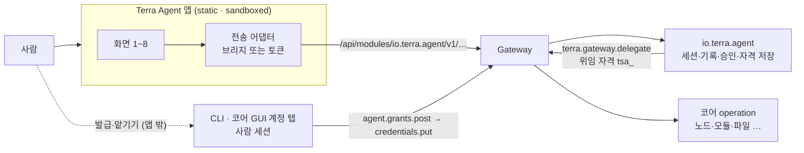
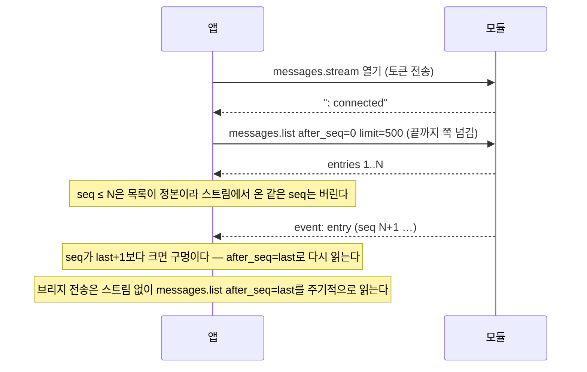
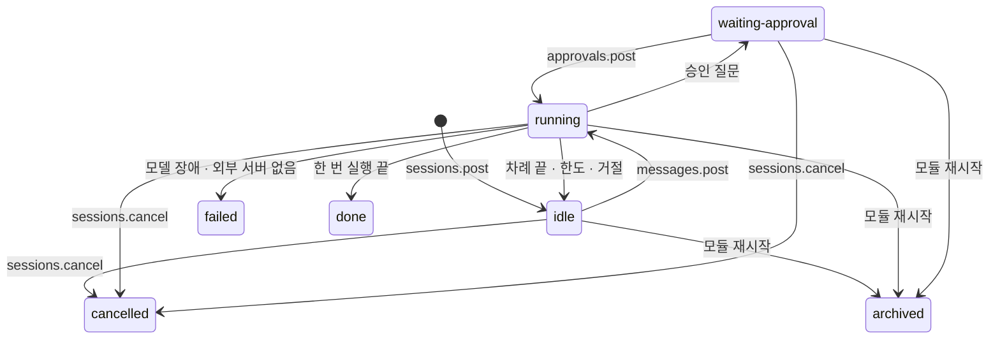
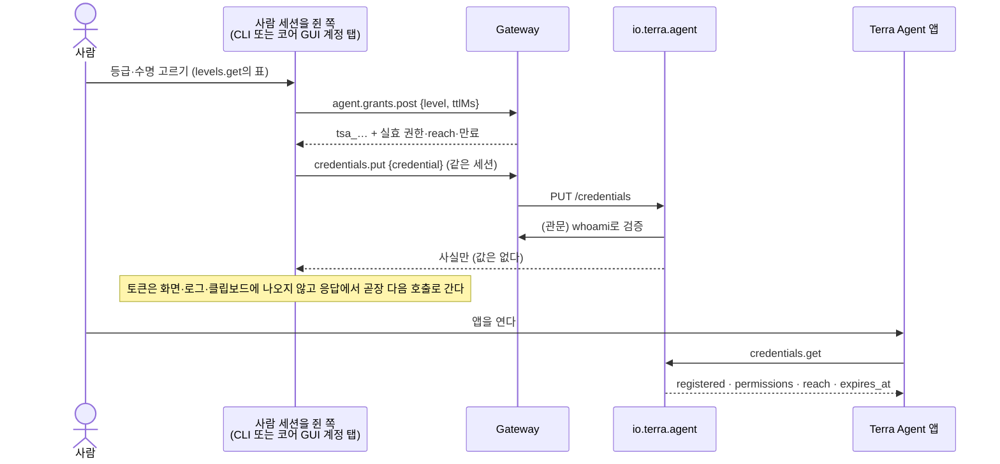

> **사본** — Terra 저장소 `docs/modules/terra-agent/design/terra-agent-gui-requirements.md`(v0.4.0, 커밋 `30a37f8`)를 modules만 보는 세션이 읽도록 옮긴 스냅샷이다. 고칠 때는 원본을 고친다. 본문의 `[[링크]]`와 `docs/…` 경로는 Terra 저장소 기준이다.

# Terra Agent GUI 필요 기능표 — 대화·승인·위임·설정 화면

> [!IMPORTANT] 이 문서는 Terra Agent GUI를 짓기 전에 풀어야 할 것과 지을 것의 목록이다
> Terra Agent(`io.terra.agent` 0.1.0)에는 GUI가 없다. 쓰는 길은 CLI 18개 명령, 터미널 대화방
> (`agent chat`), MCP 모드 B(`terra mcp serve`)뿐이다. 이 문서는 대화·승인·위임·설정을 화면으로 쓰려면
> **무엇이 있어야 하는지**를 적는다. 코드는 바꾸지 않았다.
>
> 사실은 소스·계약을 직접 읽거나 재현한 것(`[V]`)이고, 읽지 못한 것은 추정(`[I]`)으로 표시했다.
> §1.2의 막힌 것 넷은 GUI보다 먼저 풀어야 한다. 풀지 않고 지으면 화면은 서도 쓸 수 없거나,
> 쓸 수 있어도 안전하지 않다.

## 0. 이 문서의 자리

| 이 문서가 소유하는 것 | 소유하지 않는 것 |
| --- | --- |
| Terra Agent GUI가 해야 할 일 — 화면 묶음·operation·상태·안전 규칙 (§3~§7) | 에이전트의 권한·승인 모델 자체 → [[docs/modules/terra-agent/design/terra-agent-design\|Terra Agent 설계]] |
| GUI가 부딪히는 모듈·코어의 빈칸과 요구 변경 (§8~§10) | 그 변경의 구현 — 이 문서는 코드를 바꾸지 않는다 |
| 배치·위임·신원 세 갈림길의 선택지와 권고 (§2·§8·§9) | 코어 GUI의 계정 탭 설계 → [[docs/modules/terra-gui/design/unified-gui-ux/terra-gui-settings\|설정 목록]] §6 |
| 단계(G0~G4)와 완료 기준 (§11) | 색·글자·간격 같은 시각 설계 → [[docs/modules/terra-gui/design/unified-gui-ux/terra-gui-visual-design-brief\|시각 디자인 브리프]] |

## 1. 한눈에

### 1.1 지금 있는 것

| 항목 | 값 |
| --- | --- |
| GUI | **없음** — `module.json`의 `contributions`는 `cli` 하나다 |
| 쓰는 길 | CLI 18개 명령 · 터미널 대화방 `agent chat`(`kind:"session"`) · MCP 모드 B |
| 모듈 operation | 19건 — 읽기 8 · 쓰기 10 · 위험 1(`mcp.put`). 스트림은 `messages.stream` 하나다 |
| 권한 | `agent.use` 16건 · `agent.external` 2건(`mcp.put`·`mcp.delete`) · 선언 없음 1건(`status.get`) |
| 계약의 오류 코드 | 15개 |
| 모델 provider | `anthropic` 하나(기본 모델 `claude-opus-5`) |
| 화면 디자인 | **있다** — modules 저장소 `design/terra-agent-gui` 브랜치의 `AgentGUI.dc.html`(보드 8장: ①~④ 대화·승인·준비·설정, ⑤~⑧ 새 세션·종료·승인 상태·확인)과 동작하는 화면 `AgentGUILive.dc.html`. 이 문서와의 대조는 §13 — `0ae91c5`·`08a3914`·`e27d389` 세 판을 맞댔고 동작은 브라우저에서 돌려 확인했다(§13.6) |
| 기존 계획 | 모듈 API 목록의 우선순위 **P2 — "명령 폼으로 연다"**. 폼은 코어 표 21번의 렌더러가 서야 하는데 그 렌더러가 아직 없다(메뉴 구성도 §3 기준). 폼으로는 대화와 승인 카드를 그리지 못한다 |

### 1.2 막혀 있는 것 — GUI보다 먼저 풀어야 한다

| # | 막힌 것 | 증거 | 결과 | 풀 곳 |
| :---: | --- | --- | --- | --- |
| 1 | **위임 자격을 맡길 길이 없다** | `terra agent grant`가 출력 다섯 방식 모두에서 `token`을 가린다(재현, §8.1). 웹 앱은 발급할 수 없다 — 앱 토큰에는 사람의 Bearer가 없다. 코어 GUI의 발급 화면도 아직 없다(코어 표 26번, P3) | 매뉴얼의 주 흐름(grant → 응답의 자격 → `credential set`)이 CLI로 끝까지 가지 못하고, GUI도 대신하지 못한다. 자격이 없으면 세션이 돌지 못한다 | §8 |
| 2 | **한 사람이 두 사람이 된다** | 모듈은 `X-Terra-Principal`로 세션 소유자와 저장 자격을 키 잡는다. 앱 토큰으로 부르면 그 값이 `alice via <앱 id>`다 | 토큰으로 부르는 GUI와 CLI는 서로의 세션·자격·승인을 보지도 답하지도 못한다. 브리지로 부르면 `alice`로 와서 한 세계다 | §9 |
| 3 | **`sessions.list`가 남의 세션을 돌려준다** | `sessionList` 핸들러에 소유자 필터가 없다(`api.go:536`, `session.go:475`, 직접 읽음). 응답에 `topic`·`answer`·`pending_approvals.input`이 든다 | 화면이 걸러도 그 값은 이미 브라우저에 도착했다. 한 노드를 여럿이 쓰면 다른 사람의 대화가 샌다 | §10 R-2 |
| 4 | **승인·활동 화면의 재료가 모자란다** | `pending_approvals`에 위험·부작용 같은 계약 사실이 없다. `call` 줄에는 입력·이유·결과가 없다 | 사람이 무엇을 승인하는지 계약 사실로 볼 수 없다. 자동 실행된 호출의 인자는 어디에도 남지 않는다 | §6.3, §10 R-4·R-5 |

### 1.3 권고 한 장

| 갈림길 | 권고 | 이유 한 줄 | 절 |
| --- | --- | --- | :---: |
| 배치 | `io.terra.agent`에 **일반 `static` 앱**(`contributions.gui.apps[]`, `ui/`)을 싣는다 — `io.terra.nodetalk` 선례. 호출은 **전송 어댑터** 하나로 감싸 브리지(기본)와 토큰(개발·승급)에서 모두 돌게 한다 | 브리지로 부르면 모듈이 사람을 `alice`로 보아 CLI와 한 세계가 되고, 앱이 토큰을 쥐지 않는다. 대가는 스트림이 없다는 것이다(폴링으로 대신) | §2 |
| 앱 권한 | `agent.use` 하나만 선언한다. `agent.external`·`agent.grant`는 싣지 않는다 | 모델과 제3자의 텍스트를 그리는 화면이 노드에 명령을 등록할 수 있으면 렌더링 결함 하나가 원격 실행이 된다 | §2.4, §7 |
| 위임 | 발급과 맡기기는 **사람 세션을 쥔 쪽**(CLI → 코어 GUI 계정 탭)이 한 동작으로 한다. 앱은 상태·만료·거두기만 한다 | 앱은 발급할 수 없고, 토큰을 화면에 띄워서도 안 된다 | §8 |
| 신원 | 브리지로 부르는 동안은 모듈 변경이 없다. 토큰으로 부르려면 모듈의 키를 `X-Terra-Subject`로 옮기고 **같은 변경에서** 모델이 부르는 길을 사람 전용 표면에서 막는다 | 지금은 합성 principal이 모델의 자기 승인을 우연히 막고 있다 | §9 |
| 순서 | G0(선행 풀기) → G1(대화 최소) → G2(승인) → G3(설정) → G4(확장) | 승인 화면이 서기 전에는 읽기만 하는 `plan` 모드로만 연다 | §11 |

## 2. 화면이 서는 자리

### 2.1 앱이 서버를 부르는 방식 셋 — 확인된 사실

| 방식 | 앱이 받는 것 | SSE | 부를 수 있는 길 | 모듈이 보는 사람 | 근거 |
| --- | --- | :---: | --- | --- | --- |
| 일반 `static` 앱(셸 iframe) | 토큰이 없다. 부모 셸이 사용자 세션으로 **중개**하고 앱 선언 권한으로 좁힌다 | ✗ | `/api/modules/…`·`/api/nodes/…`만 | `alice` | WebApp Host 설계 §4.5, `webAppBridge.ts`의 `BRIDGE_PATH_PREFIXES` · 응답은 `terra.webapp.response` 한 번 |
| 창 모드 앱 | `tsa_` 토큰(URL fragment) | ✓ | 권한 교집합 안이면 제한 없음 | `alice via <앱 id>` | 같은 설계 §4.5.2 · `window-launch.ts` |
| Scene이 감싸는 embed 앱 | `tsa_` 토큰(15분, 80% 지점에 갱신) | ✓ | 같음 | `alice via <앱 id>` | 같은 설계 §5.4 · [[docs/guides/module-web-screen-guide\|모듈 웹 화면 가이드]] §4·§6.2 |

`[V]` 브리지가 스트림을 싣지 못한다는 것은 응답 형식(한 번의 메시지)과 경로 접두 목록을 소스에서 읽은 결론이다. 실제 스트림 시험은 하지 않았다.
`[V]` 앱 토큰에는 사람의 Bearer가 없다 — `scope_token.go`가 "앱 토큰은 절대 업스트림으로 전달되지 않는다 — BearerToken을 비운다"고 적고 그렇게 한다.

### 2.2 선택지

| 안 | 모양 | 장점 | 단점 | 판단 |
| :---: | --- | --- | --- | --- |
| A | 일반 `static` 앱 + 전송 어댑터(`io.terra.nodetalk` 선례) | Scene·branch 없이 모듈 안에서 끝난다. 사람이 `alice`로 보여 CLI와 한 세계다. 앱이 토큰을 쥐지 않는다 | 스트림이 없다(폴링). `/api/v1/*`를 못 부른다 — 카탈로그·whoami가 없으니 승인 카드의 계약 사실은 모듈이 줘야 한다(R-4) | **권고** |
| B | 얇은 Scene(`branch` 없음) + embed 앱 | 토큰으로 SSE·카탈로그·whoami를 직접 부른다 | 모듈이 사람을 `alice via …`로 보아 CLI와 세계가 갈린다(§9). 파일이 늘고, 여는 길이 불확실하다(§2.5) | 스트림·카탈로그가 실제로 막힐 때 승급한다 |
| C | B와 같되 `branch:"main"` | — | 진입점 후보가 된다. node-gui가 이미 main이라 main이 둘이 되어 CHOOSE 화면이 매번 뜬다([[docs/modules/terra-gui/design/terra-base-scene-branch-design\|base Scene 분기 설계]] §4) | ✗ |
| D | 모듈 명령 폼(코어 표 21번)만 | 새 앱이 없다 | 대화·승인 카드를 못 그린다. 렌더러가 아직 없다 | 설정류의 보조 |
| E | 계약 파생 대화방 렌더러 | 모듈마다 자동 | [[docs/modules/terra-gui/design/terra-module-gui-contribution-path-judgment\|모듈 GUI 기여 경로 판단]] §6.2가 대화방을 계약으로 파생되지 않는 화면으로 분류했다 | ✗ |

### 2.3 전송 어댑터

앱의 모든 호출은 `AgentTransport` 하나를 지난다. 화면 코드는 브리지인지 토큰인지 모른다.

| 전송 | 언제 | 요청 | 실시간 |
| --- | --- | --- | --- |
| 브리지 | 셸 안(기본) | `terra.webapp.request` → `terra.webapp.response` | `messages.list?after_seq`를 `running`이면 1초, 승인 대기나 유휴면 5초마다 읽는다 |
| 토큰 | `npm run dev`, 창 모드, embed로 승급했을 때 | `fetch` + `Authorization: Bearer tsa_…` | `messages.stream`(`fetch` 스트림 — `EventSource`는 헤더를 못 붙인다) + §5.3의 이음새 절차 |

두 전송에서 `seq`가 정본이다. 스트림은 지연을 줄일 뿐 빠진 줄을 메워 주지 않는다.

### 2.4 선언 모양과 권한

```jsonc
// module.json — 기존 contributions.cli는 그대로 두고 gui를 더한다
"contributions": {
  "gui": {
    "apps": [
      {
        "id": "io.terra.agent",
        "name": "Terra Agent",
        "mode": "static",
        "entry": "ui/index.html",
        "isolation": "sandboxed",
        "permissions": ["agent.use"]
      }
    ]
  }
}
```

- 권한은 `agent.use` 하나다. 브리지는 권한을 선언하지 않은 앱의 요청을 `BRIDGE_NO_PERMISSIONS`로 막고, 선언한 권한으로 요청을 좁힌다.
- `agent.external`은 싣지 않는다. `mcp.put`·`mcp.delete`는 이 앱 밖에서 한다(결정 D-4).
- 소스 형태는 고른다. `io.terra.nodetalk`은 빌드 없는 바닐라 `ui/`(JS 633줄)다. 에이전트 화면은 상태가 많아 가이드 템플릿의 Vite + TypeScript + Vitest를 권한다 `[I]`.
- 빌드 규칙은 가이드를 따른다 — `base:'./'`, hash 라우팅, 외부 origin·인라인 스크립트 금지(CSP), 토큰은 메모리에만([[docs/guides/module-web-screen-guide\|모듈 웹 화면 가이드]] §2·§4·§10).
- `module.json`의 `compatibility`는 지금 `linux`·`windows`다. 웹 앱이라 OS 제약이 늘지 않는다.

### 2.5 여는 길 — 확인하지 못한 것

- 모듈 API 목록은 일반 앱을 "런처·dock이 연다 — 코어 P0(`gui.apps.get`)가 이미 한다"고 적는다(§1).
- 그러나 통합 셸 8화면(런처 홈·앱 등)은 base 분기 설계로 없어졌고(§0-4), node-gui가 `/api/v1/gui/apps`를 읽어 모듈 목록에 `gui`·`ui` 표시를 붙이는 것까지만 확인했다. **사람이 일반 앱을 실제로 여는 현재 경로는 소스에서 확인하지 못했다** `[I]`.
- 그래서 결정 D-8로 올린다. 이 문서의 요구(§3~§7)는 앱이 어떻게 열리든 같다.

## 3. 작업과 화면 묶음

### 3.1 사람과 작업

| 사람 | 필요한 권한 | 하려는 일 | 매뉴얼 |
| --- | --- | --- | --- |
| 운영자 | `agent.use` · `agent.grant`(새 사용자는 기본으로 받는다) | 위임 발급·맡기기 · 모델 등록 · 읽기 조사(`plan`) · 시뮬레이션 · 대화하며 승인(`ask`) · 노드 조회 · 사후 검증 · 취소 | UC-01~05·07·10·11 |
| 관리자 | 위에 더해 `agent.unattended` · `agent.external` — 둘 다 명시 부여이고 기본이 아니다 | 무인 실행 · 외부 MCP 서버 등록 | UC-08·09 |
| 외부 MCP 호스트 | — | GUI 대상이 아니다(모드 B) | UC-06 |

| 작업 | 자율성·등급 | 화면이 먼저 보여야 할 것 |
| --- | --- | --- |
| 노드가 응답하지 않음 · 모듈이 Published가 안 됨 진단 | `plan` + `readonly` | 자격의 실효 `permissions`·`reach`, health·ready·status의 구분 |
| 죽은 모듈 재시작 | `ask` + `operate` | 계약 사실이 든 승인 카드 |
| 되돌릴 수 있는 쓰기의 반복 | `auto` + `operate` | `call` 줄, 확인·거절된 건 |
| 새벽 재시작 | `unattended` + 사전 승인 + 짧은 TTL | 사전 승인 목록·만료·"사람이 없다"는 사실 |
| fleet 설정 롤아웃 | — | **지금은 못 한다** — `node.config`가 등급 프리셋 밖이고, 원격 노드 operation 호출 도구가 없다([[docs/ideas/ai-pm-worker-fleet-ideas\|AI 분업 개발 아이디어]] N-4) |

### 3.2 화면 묶음

| 화면 | 하는 일 | 주 operation | 단계 |
| :---: | --- | --- | :---: |
| 1 준비 상태 | 모듈·모델·자격 세 칸을 한 줄로 판독하고 빠진 칸으로 안내한다 | `status.get` · `credentials.get` · `models.list` | G1 |
| 2 세션 | 목록·열기·상태·취소 | `sessions.list`·`post`·`get`·`cancel` | G1 |
| 3 대화 | 기록 읽기·말하기·실시간 | `messages.list`·`post`·`stream` | G1 |
| 4 승인 | 대기 승인 카드·답하기·세션을 가로지르는 승인 인박스 | `approvals.post` · `sessions.get`(pending) | G2 |
| 5 활동 | "실제로 일어난 일" — 호출·모델 호출·외부 호출·나간 바이트 | `messages.list`(entry) | G2 |
| 6 설정 | 모델·자격 상태·한도 기본값·MCP 목록 | `models.*` · `credentials.get`·`delete` · `mcp.list` | G3 |
| 7 위임 안내 | 맡기기 상태·만료·거두기, 발급 자리로 안내(발급은 앱 밖) | `credentials.get`·`delete` | G1(안내)·G3 |
| 8 원격 노드 | 대상 노드를 고르고 표시한다 | `agent.nodes.get`(코어) | G4 |

### 3.3 구성도



앱은 모듈의 REST 이름공간만 부른다. 모듈이 코어를 부를 때는 사람이 맡긴 위임 자격으로, 관문 `terra.gateway.delegate` 하나를 지난다.

## 4. 필요 기능표

경로는 모두 `/api/modules/io.terra.agent/v1` 아래다. 성격의 "비밀"은 요청이나 응답에 비밀이 든다는 뜻이다.

### 4.1 모듈 operation 19건

| 기능 | operation (`io.terra.agent.` 생략) | 권한 | 성격 | 화면에 필요한 것 | 단계 |
| --- | --- | --- | --- | --- | :---: |
| 모듈 상태 | `status.get` | 없음 | 읽기 | `status`·`version`·`sessions`(노드 전체, archived 포함)·`models_registered`·`delegate_door`. 사람별 자격·기본 provider·MCP 수는 없다. `degraded`는 계약에만 있고 코드는 `ok`만 낸다 | G1 |
| 자격 사실 | `credentials.get` | `agent.use` | 읽기 | `registered`, 있으면 `principal`·`delegate`·`permissions[]`·`reach`·`expires_at`·`expired`·`unattended`·`pre_approved[]`. **값은 없다.** 만료는 읽는 시점에 계산하고, 폐기는 모른다 | G1 |
| 자격 맡기기 | `credentials.put` | `agent.use` | 쓰기·비밀 | `credential`(`tsa_…`). 모듈이 Gateway `whoami`로 15초 안에 검증한 뒤 저장한다. 사용자 세션 토큰은 400. 사람마다 하나이고 재등록하면 교체된다. **이 호출은 §8에서 발급하는 쪽이 한다** — 앱의 붙여넣기 칸은 임시안 H-4뿐이다 | G1 |
| 자격 거두기 | `credentials.delete` | `agent.use` | 쓰기 | 확인 한 번. 열린 세션은 다음 호출부터 자격 없이 멈추고, **턴 도중이면 HTTP 오류 없이 `call` 줄에 `GATEWAY_UNREACHABLE`만 쌓인다**. 순서 안내: 세션 취소 → Gateway 폐기(사람 세션 쪽) → 삭제 | G3 |
| 모델 목록 | `models.list` | `agent.use` | 읽기 | `default`와 `providers[{provider,model,base_url,registered,default}]`. 키 값은 마스킹 일부도 없다 | G1 |
| 모델 등록 | `models.put` | `agent.use` | 쓰기·비밀·**노드 전역** | `api_key`(8자 이상)·`model?`·`base_url?`·`default?`. 마스킹 입력. 저장 확인에 "이 노드의 모든 사람에게 적용된다"를 쓴다. **키를 제공자에 시험하지 않는다** — 틀린 키는 첫 메시지에서 세션을 `failed`로 만든다 `[I]` | G3 |
| 모델 삭제 | `models.delete` | `agent.use` | 쓰기 | 노드 전역 확인. 기본 provider를 지우면 알파벳 첫 번째가 승계한다 | G3 |
| 세션 목록 | `sessions.list` | `agent.use` | 읽기 | 모든 소유자의 세션 전부를 `created_ms` 내림차순으로, 전체 스냅샷(`answer`·`pending_approvals.input` 포함)으로 준다. **소유자 필터와 페이지가 없다** → R-2. 화면은 `owner`로 걸러 쓰고 클라이언트에서 쪼갠다 | G1 |
| 세션 열기 | `sessions.post` | `agent.use` | 쓰기·멱등 | `session_id`는 **앱이 만들어 보낸다**(생략하면 호출마다 새 세션). 패턴 `^[a-zA-Z0-9][a-zA-Z0-9._-]{0,127}$`. 옵션(`autonomy`·`simulate`·`provider`·`mcp_servers`·한도)은 **열 때 고정**이고, 이미 있는 id면 무시되어 `created:false`로 온다 — 응답의 실제 값을 보인다 | G1 |
| 세션 조회 | `sessions.get` | `agent.use` | 읽기 | 스냅샷과 `pending_approvals[]`. **상태 확정은 이것으로 한다** — 스트림에는 상태 이벤트가 없다 | G1 |
| 세션 취소 | `sessions.cancel` | `agent.use` | 쓰기 | 되돌릴 수 없다(`cancelled`는 종료 상태). 상태 가드가 없어 종료된 세션에도 `cancelled` 줄이 또 쌓이니 종료 상태에서는 버튼을 숨긴다 | G1 |
| 기록 읽기 | `messages.list` | `agent.use` | 읽기 | `after_seq`·`limit`(기본 500). **`limit`를 안 주면 501번째 이후가 빠진다** — 끝까지 쪽을 넘겨 읽는다. `seq`는 1부터 연속이고 정본이다 | G1 |
| 말하기 | `messages.post` | `agent.use` | 쓰기·재시도 never | `text`는 20000자 이하. 턴을 비동기로 시작한다. 보낸 직후 몇 ms는 `state`가 아직 `idle`일 수 있다 `[I]`. 진행 중이면 409 `SESSION_BUSY`, 종료 상태면 409 `SESSION_FINISHED`, 승인 대기 중의 일반 글도 409 | G1 |
| 실시간 | `messages.stream` | `agent.use` | 읽기·스트림 | `event: entry` 한 종류. `id:`·재개·재생이 없다. 구독 이후 줄만 오고 구독자 버퍼(64)가 차면 **조용히 누락**된다. 세션이 끝나도 닫히지 않는다. 15초마다 `: keepalive`. 토큰 전송에서만 쓴다 | G1 |
| 한 번 실행 | `runs.post` | `agent.use` | 쓰기·동기 | **GUI에서는 쓰지 않는다.** 계약 시간 600초, Gateway의 일반 호출 한도는 15~20초라 중간에 끊긴다 `[I]`. 대화 세션으로 대신한다 | — |
| 승인 답 | `approvals.post` | `agent.use` | 쓰기·재시도 never | `request_id`·`deny?`. 한 번만 된다(두 번째는 404 `APPROVAL_NOT_FOUND`). **채팅 입력의 `approve`·`y`는 쓰지 않는다** — 가장 오래된 대기 승인에 답한다 | G2 |
| MCP 목록 | `mcp.list` | `agent.use` | 읽기 | 서버·명령·인자·env **이름**(값 없음)·도구(`read_only` 표시). 세션 삭제 경고의 재료가 된다 | G3 |
| MCP 등록 | `mcp.put` | **`agent.external`** | **위험**·`confirmation: required` | 이 앱에 두지 않는다(D-4). 등록은 이 노드에 명령 한 줄을 실행할 권한을 주는 일이다. 계약 시간이 35초라 Gateway 한도에 504를 맞을 수 있다 `[I]`. 재등록은 설정 전체를 교체하고 env 값을 되돌려 주지 않아 다시 입력해야 한다 | — |
| MCP 삭제 | `mcp.delete` | **`agent.external`** | 쓰기 | 이 앱에 두지 않는다(D-4). 지우면 그 서버를 쓰던 세션은 다음 메시지에서 `MCP_SERVER_UNKNOWN`으로 영구 `failed`가 된다 — `sessions.list`의 `mcp_servers`로 영향 세션을 먼저 보인다 | — |

### 4.2 화면이 쓰는 코어 operation

| 쓰는 것 | operation | 권한 | 누가 | 이유 |
| --- | --- | --- | --- | --- |
| 지금 누구인가 | `terra.gateway.agent.whoami.get` | 세션 | 토큰 전송 · 코어 GUI | `principal`·`permissions`·`reach`·`expiresAt`. 브리지는 `/api/v1`을 못 부르므로 사람 이름은 `sessions.post.viewer`로 대신한다 |
| 등급 목록 | `terra.gateway.agent.levels.get` | 세션 | 발급하는 쪽 | 5등급의 권한·reach·수명 상한은 서버가 안다. 화면에 하드코딩하지 않는다 |
| 위임 발급 | `terra.gateway.agent.grants.post` | 세션 · `agent.grant` | **발급하는 쪽만** | 위험. 앱은 부를 수 없다 |
| 위임 취소 | `terra.gateway.agent.grants.by-id.delete` | 세션 | 발급하는 쪽만 | `revoked:0`은 실패다(남의 것·만료·오입력을 구분하지 못한다). **내 자격 목록 API가 없다** |
| 부를 수 있는 노드 | `terra.gateway.agent.nodes.get` | 세션 · `node.read` | G4 | cluster 도달 범위 자격일 때만 뜻이 있다 |
| operation 한 건의 계약 | `terra.gateway.catalog.operations.by-id.get` | 공개 | 토큰 전송 | 위험·확인 모드·멱등·재시도·부작용·입력 스키마. 승인 카드의 재료. **브리지에서는 못 부른다** → R-4 |

### 4.3 호출 규약

- 길은 모듈 REST 이름공간 `/api/modules/io.terra.agent/v1/…`이다. 요청 본문은 1 MiB까지, 일반 호출은 15~20초(Broker 15초가 Gateway 20초보다 먼저)다. SSE만 시간 제한이 없다.
- 모듈은 본문을 엄격히 읽는다(`DisallowUnknownFields`). 모르는 필드는 400이다.
- Gateway는 입력을 계약 스키마로 검증하지 않는다 `[I]`. 길이·범위·열거는 화면이 강제한다 — `text` ≤ 20000, `max_steps` 1~100, `max_seconds` 1~7200, `api_key` ≥ 8, `session_id` 패턴.
- **재시도가 never인 넷**(`messages.post`·`approvals.post`·`runs.post`·`mcp.put`)은 자동으로 다시 보내지 않는다. 응답을 못 받았으면 `messages.list`로 결과를 확인한 뒤 사람이 다시 누르게 한다.
- 오류 봉투는 `{"error":{"code","message"}}`다. 메시지는 영어이고 CLI 안내 문구가 섞여 있다. 화면은 `code`로 자기 문구를 고르고 원문은 접어 둔다.

## 5. 데이터

### 5.1 세션 스냅샷

| 필드 | 뜻 | 화면 |
| --- | --- | --- |
| `session_id` · `topic?` | 식별자·제목(200자 이하 의도, 강제는 없음) | 목록·헤더 |
| `state` | §6.1의 7종 | 상태 칩 |
| `autonomy` | `plan`(기본)·`ask`·`auto`·`unattended` | 헤더 — **열 때 고정** |
| `simulate` | 참이면 호출 0, 판정만 `planned`로 남는다 | 헤더의 "실행 안 됨" 표지 |
| `provider` · `model` | open 때 값. 실제 턴은 등록된 최신 모델을 쓰므로 진짜 값은 `model` entry의 `note`에 있다 | 헤더 — 부정확할 수 있음을 표시 |
| `owner` | 소유자 principal(합성값일 수 있다, §9) | 필터 |
| `steps` | 누적 모델 호출 수 | 사용량 |
| `max_steps` · `max_seconds` · `token_budget?` | 기본 24(1~100) · 900(1~7200) · 무제한. **`max_steps`는 한 차례 상한이다**(§14.3 ①) | 헤더 |
| `usage` | `input_tokens`·`output_tokens`·`cache_read_tokens`·`cache_write_tokens` | 사용량 — 토큰만 보인다(I14) |
| `mcp_servers?` | 이 세션이 쓰는 외부 서버 | 헤더 |
| `answer?` · `last_error?` | 마지막 답·오류. 비어 있으면 `null`이 올 수 있다 | 목록 요약 |
| `pending_approvals[]` | `request_id`·`operation_id`·`reason?`·`judgement?`·`input?`·`created_ms` | 승인 카드 |
| `created_ms` · `updated_ms` | 시각 | 정렬 |

### 5.2 entry 12종과 그리는 법

모든 entry에 `seq`·`kind`·`author`·`author_label`·`time_ms`가 있다. 규칙은 **`text`가 있으면 발화, 없으면 사건**이다. 새 `kind`나 모르는 필드는 가운데 알림으로 그대로 보인다 — 못 읽는다고 버리지 않는다.

| kind | 누가 | 핵심 필드 | 그리는 법 |
| --- | --- | --- | --- |
| `user` | 사람 | `text` | 본인(`author == viewer`)은 오른쪽 말풍선 |
| `assistant` | 에이전트 | `text` | 왼쪽 말풍선. 응답 전체가 한 번에 온다(토큰 스트리밍 없음) — 진행 중에는 "생각 중"만 보인다 |
| `model` | `terra` | `sent_bytes`·`note` | 가운데 알림 "모델을 불렀습니다 — `note`". 합계를 "노드 밖으로 나간 양"으로 모은다 |
| `call` | 에이전트 | `subject`·`operation_id?`·`decision?`·`status`·`error_code?`·`trace_id?` | 알림 + 접힌 상세. `status:"refused"`는 오류가 아니다(`plan`의 제안이거나 거절) |
| `planned` | 에이전트 | `call`과 같되 `status:"planned"` | "호출 예정 (시뮬레이션) — **실행되지 않았다**" |
| `external` | 에이전트 | `server`·`result_bytes`·`decision`·`status` | "외부 도구 호출 — **Gateway 감사에 없다**"(`note`가 그렇게 적는다) |
| `approval` | `terra` | `request_id`·`operation_id`·`note`·`text` | 승인 카드(§6.3). `text`에는 CLI 안내 줄이 섞여 있어 그대로 쓰지 않는다 |
| `approved`·`denied` | `terra` | `request_id` | 카드의 결과로 합친다. 30분 무응답이면 `denied`(`note`: no answer within …) |
| `done` | `terra` | `note` | "차례가 끝났습니다 — 턴 수·누적 토큰". **성공을 뜻하지 않는다** |
| `error` | `terra` | `text`·`error_code` | 오류 말풍선. 코드는 §6.4 사전으로 푼다 |
| `cancelled` | `terra` | — | "세션이 취소되었습니다" |

### 5.3 이음새 절차 — 스트림과 목록을 잇는다

스트림은 구독 이후의 줄만 보내고 놓친 줄을 다시 주지 않는다. 터미널 대화방은 기록을 먼저 읽고 스트림을 나중에 열어 그 사이 줄을 놓치고, 기록을 `limit` 없이 읽어 501번째 이후를 잃는다 `[V]`. 화면은 이렇게 한다.



1. 스트림을 **먼저** 연다(브리지 전송이면 이 단계는 없다).
2. `messages.list`를 `after_seq` 쪽으로 끝까지 읽는다.
3. `seq`가 이미 본 값 이하면 버린다. 같은 `seq`의 중복은 있어도 된다 — `seq`로 한 번만 그린다.
4. `seq`가 `last+1`보다 크면 구멍이다. `after_seq=last`로 다시 읽는다.
5. 상태는 이벤트로 알 수 없다. `done`·`error`·`cancelled`·`approval` entry를 신호로 `sessions.get`을 불러 확정한다.
6. 원격 노드로 부르는 길은 스트림이 안 된다 — 폴링만 된다(계약 `messages.stream` 설명).

### 5.4 상한과 사용량

| 상한 | 기본 | 범위 | 걸리는 곳 |
| --- | --- | --- | --- |
| `max_steps` | 24 | 1~100 | **한 차례** 안의 모델 호출 수(`loop.go:321`). 문서는 세션 상한이라고 적는다 — §14.3 ① |
| `max_seconds` | 900 | 1~7200 | 한 차례의 벽시계. **승인 대기도 이 안에 든다** |
| `token_budget` | 무제한 | 1 이상 | 입력+출력 누적, 캐시 토큰 제외. 모델 호출 전과 도구 호출 후에 검사하므로 넘을 수 있다 |

비용은 **통화로 환산하지 않는다**. 설계가 토큰으로만 적기로 했다 — 저장소에 둔 단가표는 조용히 낡고 감사 성격의 표면에서 틀린 숫자는 없는 것보다 나쁘다(설계 §12.1). 합계는 `sessions.list`의 `usage`를 소유자 필터 뒤에 더한다.

## 6. 상태

### 6.1 세션 상태 7종



| 상태 | 입력창 | 버튼 | 표시 |
| --- | --- | --- | --- |
| `idle` | 켠다 | 취소 | 한도·거절로 멈췄다면 마지막 `error`를 상태 옆에 보인다(I20) |
| `running` | 끈다("모델이 답하는 중") | 취소 | 진행 표시. 승인이 오면 `waiting`으로 바뀐다 |
| `waiting-approval` | 끈다 | 승인 카드 · 취소 | **카드는 `pending_approvals`가 있을 때만 켠다.** 승인 질문이 시간 초과로 끝나도 상태가 `running`으로 돌아오지 않고 `waiting-approval`에 `pending_approvals`가 빈 채 모델이 도는 구간이 생긴다 |
| `done` | 끈다 | 새 세션 | 한 번 실행의 종료. 성공이 아니다 — `last_error`를 본다 |
| `cancelled` | 끈다 | 새 세션 | 종료 |
| `failed` | 끈다 | 새 세션 | 일시적 모델 장애(529 등)도 chat 세션을 영구 `failed`로 만든다 — 복구 operation이 없다(R-14). 사유를 보인다 |
| `archived` | 끈다 | 새 세션 | 모듈 재시작 뒤 남은 **기록뿐**이다. `done`·`cancelled`·`failed` 이외의 모든 상태에서 된다 |

### 6.2 준비 상태

`ready = delegate_door ∧ credentials.registered ∧ ¬expired ∧ 기본 provider가 registered`를 **클라이언트에서 합성한다**(`status.get`에는 사람별 자격도 기본 provider도 없다).

| 순서 | 검사 | 출처 | 아니면 | 화면이 할 일 |
| :---: | --- | --- | --- | --- |
| 1 | 모듈이 답한다 | `status.get` — 503 `MODULE_UNAVAILABLE`이면 모듈이 꺼져 있다 | 배너 "에이전트 모듈이 꺼져 있다" | 모듈 시작은 코어 GUI의 모듈 화면으로 안내 |
| 2 | 위임 관문이 있다 | `status.delegate_door` | "이 노드에는 위임 관문이 없다" | 읽기만 허용 |
| 3 | 모델이 등록됐다 | `models.list`의 기본 provider `registered` | 설정 화면으로 | 모델 등록(§4.1) |
| 4 | 자격이 맡겨졌다 | `credentials.get.registered` | 맡기기 안내(§8) | 발급 자리로 안내 |
| 5 | 자격이 만료되지 않았다 | `credentials.get.expired` | 다시 맡기기 안내 | 같음 |
| 6 | (알 수 없음) 폐기·Gateway 재시작 | 없다 — R-10 | 첫 호출이 실패하면 안내 | "만료 시각 전(폐기 여부는 확인하지 못함)"으로 적는다 |

Gateway가 재시작되면 scope token이 전부 사라진다(설계 D5). 모듈에 저장된 자격은 그것을 모른 채 남고, 죽은 `tsa_`는 anonymous로 취급되어 `MODULE_PERMISSION_DENIED`나 권한 없는 검색 결과로 나타난다 `[V]`.

### 6.3 승인 카드

사람이 "무엇을 승인하는지" 알 수 있어야 한다. 카드는 `pending_approvals[]`에서만 그린다.

```text
제목      무엇을 하려는가        operation id (+ 카탈로그의 제목)
계약이    risk · confirmation · sideEffects · idempotency · retry · output.mode
말하는 것  ← judgement(모듈이 계산한 근거) + 카탈로그. 못 읽었으면 "계약 사실을 읽지 못했다"
모델이    reason — 모델의 주장이다. 근거가 아니다. 계약 사실과 시각적으로 갈라 둔다
말하는 것
입력      input 원문(접기)
대상      이 Gateway의 노드 (원격 도구가 생기면 node id를 필수로)
마감      min(30분, 남은 한 차례 시간)의 카운트다운
행동      [승인] [거부] — approvals.post, 한 번만. 누르면 곧바로 비활성
표시      "이전에 거부한 같은 호출" · "승인해도 Gateway가 다시 판정한다"
```

- `output.mode`가 `accepted-job`이면 **접수가 완료가 아니다**. `call`의 `ok`도 접수일 수 있다.
- 승인 마감의 실효 값은 30분이 아니라 `min(30분, 남은 max_seconds)`다. 질문이 한 차례 마감에 걸리면 `denied` 줄 없이 `error TIME_LIMIT`만 남는다(§14.3 ②).
- 한 차례는 도구를 순차로 실행하므로 대기 승인은 최대 하나다 `[I]`. 화면은 목록으로 그리고, 인박스는 `sessions.list`의 `pending_approvals`로 모은다.
- 거부 기억이 없다 `[V]` — 거부된 같은 호출이 새 승인으로 다시 올 수 있다. 같은 세션에서 같은 `(operation_id, input)`이 거부 뒤 다시 오면 "이전에 거부함"을 붙인다(I18).
- `plan`의 제안과 `unattended`의 거절은 승인 질문이 아니다. 모델에게 `TERRA_APPROVAL_REQUIRED`가 가고 `call` 줄에 `decision`이 남을 뿐이다.

### 6.4 오류 코드 → 화면 행동

**모듈 HTTP 오류**(계약 15개 중 화면이 마주치는 것)

| 코드 | HTTP | 화면 행동 |
| --- | :---: | --- |
| `INVALID_REQUEST` | 400 | 폼 검증 문구, 원문은 접기. principal 누락이면 "Gateway를 거치지 않은 호출"(개발 환경) |
| `SESSION_NOT_OWNED` | 403 | 읽기 전용 표시. 남의 세션이거나 §9의 세계 분리다 |
| `CREDENTIAL_NOT_UNATTENDED` | 403 | 무인 옵션 비활성 + 발급 안내(무인 자격이 아니거나 사전 승인 목록이 비었다) |
| `CREDENTIAL_REJECTED` | 403 | 자격 맡기기 실패 — Gateway가 받지 않았다. 다시 발급 |
| `SESSION_NOT_FOUND` | 404 | 목록 새로 고침 |
| `APPROVAL_NOT_FOUND` | 404 | "이미 답했거나 만료됨" — 크게 띄우지 않고 세션을 새로 읽는다 |
| `MCP_SERVER_UNKNOWN` | 404 | 서버 목록 새로 고침 |
| `SESSION_BUSY` | 409 | 입력 비활성. 자동 재전송 금지 |
| `SESSION_FINISHED` | 409 | 읽기 전용 + 새 세션 |
| `CREDENTIAL_MISSING` | 409 | **온보딩·갱신 흐름**. 미등록과 만료는 같은 코드이고 메시지만 다르다 — `credentials.get.expired`로 가른다 |
| `MODEL_NOT_CONFIGURED` | 409 | 모델 등록 화면으로 |
| `MCP_UNATTENDED_CONFLICT` | 409 | 무인 + 외부 MCP 조합 차단 |
| `MCP_SERVER_FAILED` | 502 | 원문 표시(실행·악수·`tools/list` 실패) |
| `AGENT_UNAVAILABLE` | 503 | 배너 + 백오프(저장 실패·코어 면 없음·스트림 불가) |
| `MODEL_UNAVAILABLE` | 502 | HTTP로는 나오지 않는다. 기록의 `error`로만 온다 — 세션이 `failed`다 |

**Gateway·브리지 오류**: `MODULE_UNAVAILABLE`(503, 모듈 정지) · `MODULE_PERMISSION_DENIED`(403, 권한 부족과 reach 밖이 같은 문구 — `scopes`와 대조해 가른다) · `MODULE_INVOCATION_TIMEOUT`(504) · `UNAUTHORIZED`(401, 세션 끝) · `QUOTA_EXCEEDED`(429) · `REQUEST_TOO_LARGE`(413) · `SCOPE_TOKEN_DENIED`(403, 앱 토큰 발급 거절) · `BRIDGE_NO_PERMISSIONS`(403).

**기록의 `error` entry**

| 코드 | 상태가 되는 곳 | 뜻 |
| --- | --- | --- |
| `STEP_LIMIT` · `TIME_LIMIT` · `TOKEN_BUDGET` | `idle`(한 번 실행은 `done`) | 한도에 닿았다. **`failed`가 아니다** — 마지막 오류를 상태 옆에 보인다 |
| `MODEL_REFUSED` | `idle`/`done` | 모델이 계속하기를 거절했다. 다른 모델로 넘기지 않는다(설계 D13) |
| `MODEL_TRUNCATED` | `idle` | 모델 응답이 토큰 한도에서 잘렸다 |
| `MODEL_UNAVAILABLE` | `failed` | 모델 호출 실패 |
| `MCP_SERVER_UNKNOWN` | `failed` | 세션이 쓰던 외부 서버가 지워졌다 |

**`call`·`external`의 `error_code`**: `TERRA_APPROVAL_REQUIRED`(plan 제안·거절·무응답·시간 초과) · `TERRA_APPROVAL_DENIED` · `TERRA_STREAM_UNSUPPORTED` · `TERRA_RETRY_REFUSED`("사람이 실행 여부를 확인") · `TERRA_REACH_EXCEEDED` · `TERRA_EXTERNAL_FAILED` · `GATEWAY_UNREACHABLE`(턴 도중 자격 삭제·만료도 이렇게 보인다) · `HTTP_<n>` · Gateway 코드 그대로. 이 entry에는 오류 메시지 본문이 없다.

### 6.5 공통 화면 규칙

- 언어는 한국어다. 서버 문구는 영어이므로 `code` 사전을 두고 원문은 접는다.
- 라이트·다크는 OS(`prefers-color-scheme`)를 따른다. 모바일은 시각 브리프 초안이 범위 밖으로 둔다. **디자인은 어두운 유리 한 벌이다(처음엔 node-gui `SKIN.md`의 HUD, 그다음 Liquid Glass, 지금은 단색 면 flat) — 어느 쪽을 따를지는 결정 D-10이다(§13.4 DC-13).**
- 기록은 길어진다(상한·삭제가 없다). 가상 스크롤과 쪽 읽기를 쓴다.
- 모델과 외부 텍스트는 평문 또는 HTML 삽입이 없는 제한된 마크다운으로만 그린다. 링크는 자동으로 열지 않는다.
- 브라우저 저장소(`localStorage`)에는 탭·필터 같은 화면 선호만 둔다. 세션 내용과 자격은 두지 않는다.

## 7. 안전 불변식

강제 열의 **S**는 서버(모듈·코어·Gateway)가 이미 강제하는 것이고, **C**는 이 화면이 지켜야 하는 것이다. S로 막힌 것도 화면이 거짓말하지 않아야 한다.

| # | 규칙 | 강제 | 근거 |
| :---: | --- | :---: | --- |
| I1 | 저장된 위임 자격·모델 API key·외부 서버 env 값은 어떤 응답에도 없다. 화면은 입력 뒤 다시 보이지도, 복사하게 하지도, 로그·URL·DOM 속성·브라우저 저장소에 남기지도 않는다 | S+C | `credentials.get`·`models.list`·`mcp.list`가 값을 돌려주지 않는다(SEC-06) |
| I2 | 비밀은 URL·쿼리·명령줄이 아니라 요청 본문으로만 보낸다 | C | SEC-07 |
| I3 | 위임의 발급·취소는 사람 세션만 한다. 앱은 못 한다. 대리인은 `agent.grant`·`agent.external`을 갖지 못한다 | S | `agent_grant.go`, `DelegateNeverCarries`, SEC-12·16 |
| I4 | 등급보다 **실효** `permissions`·`reach`·`expiresAt`를 앞에 보인다. 기본은 가장 좁게(`readonly`·`plan`). 자격은 자동 연장하지 않는다 | C | 설계 §5.3·§17 |
| I5 | 승인 판정은 모듈의 `Decide` 한 벌이다. 화면은 다시 계산하지 않고 `judgement`·`decision`을 보일 뿐이다(두 번째 게이트 금지). "승인"은 "물어봤다"이지 권한이 아니다 — Gateway가 다시 판정하므로 승인 뒤에도 403이 날 수 있고 화면은 그렇게 말한다 | S+C | SEC-01, 설계 §6.4 |
| I6 | 물을 사람이 없으면 거절한다(`unattended`). 무인과 외부 MCP는 함께 못 쓴다. 화면은 조합을 막는다 | S+C | `MCP_UNATTENDED_CONFLICT`, 설계 §7.10 R5 |
| I7 | 모델·외부 텍스트는 **자료**다. 이스케이프하고, 링크를 자동으로 열지 않고, 승인 컨트롤을 그 텍스트 안에 그리지 않는다. 모델이 쓴 "승인하겠습니다"를 버튼처럼 보이게 그리지 않는다 | C | 설계 §3.3·§7.10 R2 |
| I8 | 승인은 `approvals.post`로만 답한다 | C | 채팅의 `approve`는 가장 오래된 대기 승인에 답한다(`api.go:597`) |
| I9 | 승인 컨트롤은 `pending_approvals`에 있을 때만 켠다. 한 번 누르면 곧바로 끈다. 두 번째 응답의 404는 정상이다 | C | `APPROVAL_NOT_FOUND` |
| I10 | 자율성·시뮬레이션·provider·MCP·한도는 열 때 고정이다. 올리려면 새 세션이다. 변경 컨트롤을 두지 않는다. 자격 교체는 열린 세션에 즉시 적용되니 경고한다 | S+C | `session.go:139`, `door.go:17` |
| I11 | 세션은 소유자만 쓴다. `sessions.list`가 미필터인 동안 화면이 `owner`로 걸러도 노출은 막지 못한다 | S(부분) | R-2 |
| I12 | 외부 도구 호출은 Gateway 감사에 없다. `external` 줄에 그 사실을 그대로 보인다 | C | 설계 §7.10 R8 |
| I13 | `simulate`는 호출이 0이다. `planned`는 "실행되지 않았다"를 모든 자리에 붙인다 | S+C | `planned` entry |
| I14 | 비용은 토큰으로만 보인다. 내장 단가표로 통화로 환산하지 않는다 | C | 설계 §12.1 |
| I15 | "민감 정보는 나가지 않는다"고 말하지 않는다. operation 출력은 필터 없이 모델과 provider로 간다(`dataClassification` 처리 0건). 대신 `model` 줄의 나간 바이트를 보인다 | C | 설계 §8, 불일치 §14.3 |
| I16 | 계약의 `confirmation: required`를 Gateway도 CLI도 사람 호출에 강제하지 않는다 `[V]`. 위험하거나 되돌릴 수 없는 사람의 동작(자격 거두기·모델 삭제·세션 취소·MCP 등록·삭제)은 화면이 확인 단계를 세운다 | C | `agent.go`에 확인 프롬프트가 없다 |
| I17 | 재시도 never 넷은 자동으로 다시 보내지 않는다. 불확실하면 `messages.list`로 확인한다 | C | 계약 `retry.mode` |
| I18 | 거부 기억이 없으니 같은 세션의 같은 `(operation_id, input)`이 거부 뒤 다시 오면 표시한다 | C | 승인 거부 기억 부재 `[V]` |
| I19 | 화면 선호만 브라우저에 둔다. 세션 내용·자격·API key는 두지 않는다 | C | I1 |
| I20 | `done`·`idle`을 성공으로 그리지 않는다. 한도·거절은 `error` 줄이고 상태는 `idle`/`done`이다 | C | §6.4 |
| I21 | 호출의 대상 노드를 화면에 고정 표기한다. 지금 모든 `call`은 "이 Gateway의 노드"다. 원격 도구가 생기면 node id를 승인 카드와 `call` 줄의 필수 필드로 올린다 | C | [[docs/ideas/ai-pm-worker-fleet-ideas\|AI 분업 개발 아이디어]] N-4 |
| I22 | 대화 앱의 토큰·선언 권한에 `agent.external`·`agent.grant`를 싣지 않는다 | C | §2.4 |

### 7.1 화면이 하면 안 되는 말

| 말 | 왜 | 대신 |
| --- | --- | --- |
| "감사로 확인됨" | Gateway 감사는 로그 한 줄이고 조회 API가 없다 | "trace id: …"를 복사할 수 있게 한다 |
| "안전하게 실행됨" · "민감 정보는 나가지 않음" | 출력 필터가 없다(I15) | 나간 바이트와 어느 operation이었는지 |
| "승인됨 = 실행됨" | Gateway가 다시 판정한다 | "승인됨 — Gateway 판정 대기" |
| "자격 유효" | 로컬 만료만 안다. 폐기·재시작은 모른다 | "만료 시각 전 — 폐기 여부는 확인하지 못함" |
| "완료" (`accepted-job`·`done`) | 접수이거나 한도 종료일 수 있다 | 마지막 `error`와 `output.mode`를 함께 |
| "$ 비용" | 단가표가 낡는다 | 토큰 |

## 8. 위임 — 자격을 맡기는 길

### 8.1 지금의 길과 막힌 곳

매뉴얼의 흐름은 이렇다(§3.1, UC-01): `terra agent levels` → `terra agent grant --level operate --ttl 8h` → **응답의 자격을** `terra agent credential set --token-stdin`으로 모듈에 맡긴다.

그런데 둘째와 셋째 사이에서 사람이 토큰을 볼 길이 없다 `[V]`.

- `Renderer.Emit`이 모든 출력에 `Redact`를 무조건 건다. 키 이름에 `token`·`secret`·`password`·`private_key`·`authorization`·`credential`이 들어 있으면 값을 `***`로 바꾼다(`output/renderer.go`).
- 다섯 방식으로 시험 서버에 `terra agent grant`를 돌렸다 — `--json`·`--format yaml`·`--format ndjson`은 `"token": "***"`, 기본 표는 `token` 열이 없고, `--quiet`은 아무것도 내지 않는다. **어느 방식에서도 값이 나오지 않았다.**
- 우회 길(`terra module call terra.gateway.agent.grants.post`, `terra api`)도 같은 `Emit`을 지난다고 읽었으나 따로 돌려 보지는 않았다 `[I]`.

그래서 CLI만으로는 매뉴얼의 주 흐름이 끝까지 가지 못한다. 문서 쪽 증거는 §14.3 ⑤다.

### 8.2 누가 발급할 수 있나 — 제약

| 제약 | 근거 |
| --- | --- |
| 발급은 사람 세션 Bearer + `agent.grant`다. `agent.grant`는 새 사용자에게 기본으로 주어진다(기존 계정에는 소급하지 않았다) | `agent_grant.go`, `auth/service.go` `DefaultPermissions` |
| 앱 토큰으로는 발급할 수 없다. 앱 토큰의 BearerToken이 비어 있다. 발급된 자격으로 다시 부르면 거절된다 | `scope_token.go`, `agent_grant.go` |
| 브리지는 `/api/modules/`·`/api/nodes/`만 중개한다. `/api/v1/agent/grants`는 길이 아니다 | `webAppBridge.ts` |
| 발급은 요청을 좁혀서 줄 수 있다. 교집합이 일부만 있으면 **조용히 좁혀 발급**하고, 비면 403 `AGENT_GRANT_DENIED`다. 초과 TTL은 깎인다. TTL을 비우면 **등급 상한**이 된다(설계의 "기본 1시간"이 아니다) | `agent_grant.go:293-309` |
| 무인 자격은 `agent.unattended`가 있어야 하고, TTL 기본 15분·최대 1시간, `preApprove`는 `unattended`와만 쓴다. 각 id는 카탈로그로 검증된다 | `agent_grant.go` |
| 모듈은 `tsa_` 접두의 자격만 받는다. 사용자 세션 토큰은 400이다 | `credentials.go` |

**이 설계의 결론: 앱은 발급하지 않는다.** 앱 JS가 발급 권한을 쥐면 선언한 권한으로 좁혀 둔 토큰이 사용자 전체 권한의 새 자격을 찍어 낼 수 있다. 플랫폼이 그 길을 막은 것은 의도다.

### 8.3 선택지

| 안 | 모양 | 장점 | 단점 | 판단 |
| :---: | --- | --- | --- | --- |
| H-1 | CLI에 **발급과 맡기기를 한 동작**으로 하는 길을 낸다(예: `terra agent grant … --hand-over`). CLI가 사람 세션으로 발급하고 곧바로 `credentials.put`을 부른다. 토큰은 출력되지 않는다 | 가장 작다. 매뉴얼의 흐름이 실제로 선다. 사람이 `alice`로 맡기므로 브리지 GUI와 한 세계다 | CLI 변경이다(이 문서는 코드를 바꾸지 않는다) | **먼저** |
| H-2 | 코어 GUI **설정 > 계정**의 "위임 자격"(코어 표 26번)에 "Terra Agent에 맡기기" 동작을 둔다. 카탈로그에서 `io.terra.agent.credentials.put`이 보일 때만 선다 | GUI가 발급·맡기기·취소를 한 자리에서 한다. 토큰이 화면에 안 나온다 | 코어 표 26번(P3)이 서야 한다 | **다음** |
| H-3 | 에이전트 앱이 직접 발급한다 | — | 플랫폼이 막았고 막는 것이 옳다(§8.2) | ✗ |
| H-4 | 발급 화면이 토큰을 **한 번만** 보여 주고 사람이 에이전트 앱의 쓰기 전용 칸에 붙여넣는다 | 코어 표 26번만 서면 된다 | 토큰이 화면과 클립보드에 나온다. 문서는 사람이 토큰을 보는 것을 금하지 않고(플러그인 README의 `export TERRA_AGENT_TOKEN`) argv·파일·배포물·프롬프트·응답에 다시 나오는 것을 금한다 | 임시 |
| H-5 | 모듈의 Scene Function이 `grants.post` → `credentials.put`을 잇는다 | 모듈 안에서 끝난다 | Function 그래프로 두 호출을 잇는 것과 토큰 값을 Store에 두지 않는 것이 맞물리는지 확인하지 못했다 `[I]`. 사용자 세션의 힘을 모듈이 낸 Scene이 쥔다 | 보류 |

권고 순서는 **H-1 → H-2**이고, H-4는 둘 다 없을 때의 임시다. 어느 안이든 앱은 `credentials.get`으로 사실만 읽고, 다시 맡기기·거두기를 안내한다.

### 8.4 흐름



### 8.5 발급하는 쪽 화면의 필수와 금지

**필수**

- 사람 세션으로 호출한다. 등급 표는 `agent.levels.get`에서 그린다.
- 응답의 `permissions`·`reach`·깎인 `ttlMs`·`expiresAt`를 **"받은 것"**으로 보인다. 요청한 등급보다 권한이 줄었으면(조용히 좁혀 발급되므로) 빠진 권한을 경고한다.
- `execute`·`account` 등급과 `--unattended`는 추가 확인을 세운다(설계 §5.5·§10.3이 요구하고 CLI는 아직 하지 않는다).
- TTL 칸은 짧은 값을 **제안**하되 미리 채우지 않는다. 비우면 등급 상한이 된다는 것을 쓴다.
- 무인은 `agent.unattended` 보유 여부를 먼저 보이고, `preApprove`는 카탈로그에서 고르게 한다.

**금지**

- 토큰을 표시·복사·URL·로그·DOM에 남기는 것(H-4의 한 번 보기 제외).
- 사용자 세션 토큰을 모듈에 넘기는 것.
- 등급 이름만 보이고 실효 권한을 숨기는 것.

### 8.6 거두기

`DELETE /api/v1/agent/grants/{agn_…}`는 사람 세션 쪽이 한다(`agent:`을 뗀 `delegate` 값이 id다). `revoked:0`은 실패로 읽는다 — 남의 것·만료·오입력을 구분하지 못한다. **내 자격 목록 API가 없다**(R-10). 모듈에 저장된 자격과 열린 세션은 그대로이므로 순서는 **세션 취소 → 폐기 → `credentials.delete`**다.

## 9. 신원 — 한 사람이 두 사람이 된다

### 9.1 사실

| 호출 방식 | `X-Terra-Principal` | `X-Terra-Subject` | 에이전트 모듈이 보는 소유자 |
| --- | --- | --- | --- |
| CLI(세션 Bearer) | `alice` | `alice` | `alice` |
| 브리지(셸이 사용자 세션으로 중개) | `alice` | `alice` | `alice` |
| 앱 토큰(embed·창 모드) | `alice via <앱 id>` | `alice` | `alice via <앱 id>` |
| 위임 자격(모델이 부르는 길) | `alice via agent:<세션>` | `alice` | `alice via agent:<세션>` |

- `[V]` 게이트웨이는 앱 토큰 분기에서만 `Principal: scoped.Principal + " via " + scoped.AppID`로 합성하고 `Subject`에 사람을 둔다(`scope_token.go`). 브리지의 `X-Terra-Scope-Permissions`는 권한을 좁힐 뿐 principal을 바꾸지 않는다(`caller.go`).
- `[V]` 모듈 호스트는 `X-Terra-Principal`을 감사용 합성값으로, `X-Terra-Subject`를 "사람별 데이터의 키"로 모듈에 넘긴다(`caller_headers.go`).
- `[V]` 에이전트 모듈은 `X-Terra-Principal`만 읽는다(`api.go:31`, `principal()`). 세션 소유자(`meta.Owner`)·저장 자격·승인 답 권한이 모두 그 값에 걸린다(`ownedSession`, `approvalPost`).
- 모듈 HTTP 계약과 웹 화면 가이드가 이미 "사람별 데이터는 `X-Terra-Subject`로 나눈다 — principal로 나누면 같은 사람이 앱마다 다른 사람이 된다"고 적는다. 모듈은 앱이 없던 때에 쓰여 그 규칙을 따르지 않는다.

### 9.2 결과

- 토큰으로 부르는 GUI에서 만든 세션은 `alice via <앱 id>`가 소유한다. CLI의 `alice`로는 그것을 보지도, 승인하지도, 이어 말하지도 못한다. 반대도 같다.
- 같은 사람이 다른 앱으로 부르면 또 다른 세계다.
- 자격도 같은 키로 저장된다 — H-1·H-2가 `alice`로 맡긴 자격은 토큰 전송의 GUI에서 보이지 않는다.
- **브리지로 부르면 이 문제가 없다.** 사람이 `alice`로 보이기 때문이다. 권고(§2)의 이유 하나가 이것이다.

### 9.3 키를 `Subject`로 옮길 때의 함정

`Subject`로 옮기면 한 사람이 한 세계가 된다. 그러나 지금은 합성 principal이 **우연히** 하나를 막고 있다.

- 위임 자격 `account`(L4)는 사용자 권한 전부에서 `agent.grant`·`agent.external`만 뺀 것이라 `agent.use`를 싣는다. 모델이 `terra_invoke`로 `io.terra.agent.approvals.post`를 부를 수 있는 길이 있는 것이다 `[I]`.
- 그 호출은 지금 `alice via agent:<세션>`으로 와서 세션 소유자 `alice`와 달라 403으로 끝난다 `[V: approvalPost]`. 에이전트 코어에는 자기 모듈 operation을 모델에게서 숨기는 곳이 없다 `[V]`.
- `Subject`로 키를 옮기면 이 호출이 소유자로 통과해 **모델이 사람의 승인을 스스로 누를 수 있다.**

그래서 신원 변경은 **한 묶음**이다. 키를 `Subject`로 옮기는 같은 변경에서, `X-Terra-Delegate`가 `agent:`로 시작하는 호출을 사람 전용 표면(`approvals.post`·`credentials.*`·`models.*`·`mcp.*`·`sessions.cancel`)에서 거절해야 한다. 같은 줄기의 확인이 하나 더 있다 — 같은 `account` 자격이 `auto`에서 `io.terra.agent.models.put`(노드 전역, `base_url` 교체 가능)을 확인 없이 부를 수 있다는 것이다. 핸들러가 합성 principal을 받아들이는 것은 재현했고 Gateway를 거친 호출은 추정이다 `[I]`. 둘 다 보안 검토가 따로 필요하다 → R-9.

### 9.4 선택지

| 안 | 모양 | 판단 |
| :---: | --- | --- |
| I-1 | 브리지로 부른다. 모듈 변경 없음 | **권고**(§2). 스트림이 없다는 대가가 있다 |
| I-2 | 토큰으로 부르고 모듈 키를 `Subject`로 옮기며 위임 자격 거절 규칙을 같은 변경에 넣는다 | 토큰 전송이 필요해지면 필수 |
| I-3 | 그대로 두고 GUI를 별개의 세계로 둔다 | 화면에 "이 화면에서 만든 세션만 보입니다(터미널 세션과 별개)"를 써야 한다. 권하지 않는다 |

## 10. 모듈·코어에 요구하는 변경

**종류**: 모듈 = StellaxiaLab/modules `common/io.terra.agent`, 코어 = Terra 저장소(Gateway·CLI·코어 GUI), 앱 = 이 GUI 안에서 해결, 결정 = §12에서 먼저 정한다.

| # | 요구 | 종류 | 왜 | 막는 단계 |
| :---: | --- | :---: | --- | :---: |
| R-1 | 위임을 **발급과 맡기기 한 동작**으로 한다(H-1 → H-2). 토큰은 출력하지 않는다 | 코어 | 지금은 자격을 맡길 길이 없다(§8.1) | G1 |
| R-2 | `sessions.list`를 소유자로 거른다. 남의 `topic`·`answer`·`pending_approvals.input`이 나가지 않게 한다 | 모듈 | 화면이 걸러도 노출은 이미 일어났다 | G1 |
| R-3 | 신원 키를 정한다(§9, D-2). 토큰 전송을 쓰면 `Subject` 이전과 위임 자격 거절 규칙을 한 변경으로 한다 | 결정 · 모듈 | 한 사람이 두 사람이 되고, 이전하면 모델의 자기 승인이 열린다 | G1 |
| R-4 | `pending_approvals`에 계약 사실의 스냅샷(`risk`·`confirmation`·`idempotency`·`retry`·`sideEffects`·`output.mode`·`scopes`)을 넣는다. 모듈은 승인 판정을 계산할 때 이미 이 값을 갖고 있다 | 모듈 | 브리지는 카탈로그를 못 읽는다. 승인 카드의 핵심 재료다 | G2 |
| R-5 | `call`·`planned` entry에 입력(비밀 가림 규칙 포함)·모델의 이유·결과 요약을 남긴다. 계약의 `output.mode`도 남겨 "접수 ≠ 완료"를 줄에서 가른다(DC-18) | 모듈 | 설계 §12는 입력이 남는다고 적지만 실제는 없다. 자동 실행된 호출의 인자가 어디에도 없다 | G2 |
| R-6 | 승인 마감 시각(`expires_ms`)을 `pending_approvals`에 넣는다. 실효 = `min(30분, 남은 max_seconds)` | 모듈 | 화면이 계산하면 틀린다 | G2 |
| R-7 | `messages.stream`에 `id:`와 재개(`after_seq`)를 넣는다 | 모듈 | 이음새 절차(§5.3)로 우회는 되지만 구독 사이의 누락을 서버가 막는 편이 낫다 | G2 |
| R-8 | 상태 변화를 알린다 — 상태 entry, 또는 `sessions.list`의 `since`·페이지 | 모듈 | 폴링 비용. 지금은 상태를 알려면 `sessions.get`을 불러야 한다 | G3 |
| R-9 | 모델 등록의 노드 전역 덮어쓰기를 보호한다(소유자·권한 분리, `base_url` 허용 검증). 위임 자격이 `agent.use`로 에이전트 모듈 자신의 표면을 부르는 길을 막는다 | 모듈 · 코어 | `agent.use`만 있으면 노드 전체의 모델 등록을 바꿀 수 있고 `base_url`은 검증이 없다. 보안 검토가 따로 필요하다 | G3 |
| R-10 | 자격의 **라이브 검증** operation(`whoami`로 확인)과 내 자격 목록 API | 모듈 · 코어 | `credentials.get`은 로컬 만료만 안다. 폐기·재시작은 모른다 | G3 |
| R-11 | 모델 키를 시험하는 길(`models.put`의 검증 또는 별도 operation) | 모듈 | 틀린 키는 첫 메시지에서 세션을 `failed`로 만든다 | G3 |
| R-12 | MCP 등록 미리보기(도구 목록만)와 `read_only` 부분 수정 | 모듈 | 지금은 등록 → 도구 확인 → 재등록 두 단계이고 재등록은 env를 다시 받는다 | G4 |
| R-13 | 세션 삭제·보존 기간·제목 변경 | 모듈 | 기록이 영구 보존되고 시작 때 전부 메모리로 올라온다 | G4 |
| R-14 | 턴만 멈추는 길(`cancel`은 종료 상태다), `failed` 복구(일시 모델 장애) | 모듈 | 일시 장애가 chat 세션을 영구 `failed`로 만든다 | G4 |
| R-15 | Gateway 감사 조회 API(`trace_id`로) | 코어 | 없으면 화면이 "감사로 확인됨"이라 말할 수 없다 | G4 |
| R-16 | 원격 노드 operation 호출 도구(A6의 남은 절반) | 코어 | 화면 8(원격 노드)의 전제다 | G4 |
| R-17 | §14.3의 문서·계약·소스 불일치를 정리한다 | 문서 | 화면이 어느 쪽을 믿을지 정해야 한다 | G1 |

앱 안에서 해결하는 것(종류 = 앱): 소유자 필터(R-2 전 임시), 페이지·가상 스크롤, `seq` 이음새, 확인 단계(I16), 거부 기억 표식(I18), 오류 코드 사전, 사용량 합계.

## 11. 단계와 완료 기준


| 단계 | 하는 것 | 하지 않는 것 | 완료 기준 |
| :---: | --- | --- | --- |
| G0 | R-1(맡기기 한 동작), R-2(소유자 필터), R-3(신원 결정), R-17(불일치 정리) | 화면 | 사람이 토큰을 보지 않고 자격을 맡긴다 — `credentials.get`이 `registered:true`를 답한다. 다른 사람의 세션이 `sessions.list`에 나오지 않는다(시험). 신원 키가 문서로 정해졌다 |
| G1 | 앱 골격(Vite·TS·Vitest), 전송 어댑터, 화면 1·2·3·7(안내), 세션 열기(`plan`만), 기록 읽기, 말하기, 취소 | 승인 카드 — `ask`·`auto`·`unattended` 세션을 열지 못하게 한다 | 새 세션을 열어 질문하면 답이 온다. 폴링과 스트림 두 전송에서 기록의 줄이 빠지거나 겹치지 않는다(`seq` 이음새 시험). 입력 비활성·오류 코드 사전이 §6.1·§6.4를 따른다 |
| G2 | R-4·R-5·R-6, 화면 4·5, 승인 카드, 승인 인박스, `ask`·`auto` 세션, 거부 기억 표식 | 무인 | 승인 카드가 계약 사실과 모델의 주장을 갈라 보인다. 승인은 `approvals.post`로만 간다. 같은 승인을 두 번 눌러도 한 번만 처리된다. 모델·외부 텍스트의 HTML 삽입 시험이 통과한다 |
| G3 | R-8~R-11, 화면 6, 모델 등록·교체·삭제, 자격 상태·거두기, MCP 목록(읽기), 한도 기본값 | MCP 등록·삭제(D-4) | 모델 등록에서 키가 다시 보이지 않는다. 노드 전역 확인이 서 있다. 자격 만료·폐기 안내가 §6.2를 따른다 |
| G4 | 무인 세션(사전 승인 선택), 화면 8(원격 노드), 검색·삭제·보존(R-12~R-16) | 첨부·토큰 스트리밍(모듈이 못 한다) | 각 항목이 요구 변경과 함께 닫힌다 |

**검증 방법**: 순수 논리(이음새 병합·상태→화면 규칙·오류 사전·승인 카드 모델·재시도 가드)는 Vitest로, 화면은 가짜 Gateway·모듈을 세워 Playwright(저장소의 Chromium)로 시험한다. 실 Anthropic 호출은 시험에 쓰지 않는다. 시험 수는 구현할 때 세어 적는다.

## 12. 먼저 풀어야 할 것

| # | 결정 | 선택지 | 권고 |
| :---: | --- | --- | --- |
| D-1 | 배치 | A 일반 `static` 앱(브리지) / B Scene + embed(토큰) | **A**. 스트림·카탈로그가 막히면 B로 승급(§2) |
| D-2 | 신원 키 | I-1 브리지 / I-2 `Subject` 이전 + 위임 자격 거절 / I-3 별개 세계 | **I-1**. 토큰 전송을 쓰면 I-2 필수(§9) |
| D-3 | 위임을 맡기는 자리 | H-1 CLI 한 동작 / H-2 코어 GUI 계정 탭 / H-4 임시 붙여넣기 | **H-1 → H-2**(§8) |
| D-4 | MCP 등록·삭제의 자리 | CLI에 둔다 / 코어 명령 폼(코어 표 21번) / `agent.external`만 선언한 두 번째 앱 | **CLI 우선**, 코어 명령 폼이 서면 그리로. 대화 앱에는 두지 않는다 |
| D-5 | 비용 표기 | 토큰만 / 사용자가 넣은 단가로 환산 | **토큰만**(설계 §12.1). 환산이 필요하면 사용자 입력 단가에 "내 추정"을 붙인다 |
| D-6 | `sessions.list` 수정 전 배포 | 배포 보류 / 필터링해서 배포 | **보류**. 걸러도 노출은 막지 못한다(R-2) |
| D-7 | 새 세션의 기본 자율성 | `plan` 고정 / 마지막 선택 기억 | **`plan` 고정**(설계 §6.2). 기억하면 `auto`가 기본이 될 수 있다 |
| D-8 | 일반 앱을 사람이 여는 길 | node-gui에서 열기 / 런처 / URL 직접 | **확인이 먼저**(§2.5). 이 문서가 확인하지 못했다 |
| D-9 | 문구 | 서버 문구를 그대로 / `code` 사전 + 원문 접기 | **사전 + 접기** |
| D-10 | 테마 | 어두운 한 벌(디자인) / OS 테마를 따름(§6.5) | **어두운 한 벌** — 처음 판은 node-gui `SKIN.md`의 HUD와 같은 화면 언어였으나 `08a3914`는 Liquid Glass, `e27d389`는 단색 면 flat으로 바뀌어 토큰이 달라졌다(DC-13). 에이전트 앱만 새 스타일로 갈지 SKIN 토큰으로 맞출지는 사용자가 정한다. 라이트가 필요해지면 그때 토큰을 바꾼다. §6.5를 그에 맞게 고쳤다 |
| D-11 | 글꼴 | 시스템 글꼴 + 이모지 서브셋(node-gui 방식) / 글꼴 파일을 앱에 싣는다 | **시스템 글꼴**. 싣는다면 라이선스(OFL) 고지와 용량을 따로 정한다. Google Fonts `<link>`는 CSP가 막는다(DC-12). `08a3914`가 이 권고대로 시스템 글꼴 스택으로 정리했고 이모지를 쓰지 않아 서브셋도 필요 없다. 다만 `e27d389`는 스택 맨 앞에 `Pretendard`·`Inter`를 두고 글꼴 파일은 싣지 않았다 — 쓰려면 앱에 싣는 쪽(OFL 고지·용량)으로 정하고, 싣지 않는다면 스택에서 뺀다 |

## 13. 디자인 대조

modules 저장소에 올라온 화면 디자인을 이 문서와 항목별로 맞대었다. 세 번 대조했다 — `0ae91c5`(보드 4장), `08a3914`(보드 8장), `e27d389`(보드 8장과 동작하는 화면 `AgentGUILive.dc.html`). 결론부터: 처음 지적한 열다섯 가운데 열둘과, 다시 찾은 여섯(DC-16~21)이 모두 고쳐졌다 — 디자인이 이 절을 그대로 따라 갔다. 동작하는 화면을 브라우저에서 돌려 보니 승인·거부·시간 초과·취소와 자율성 네 가지가 이 문서의 규칙대로 움직인다(§13.6). 남은 것은 동작하는 화면이 문서의 규칙을 덜 따른 곳 여섯(DC-22~27 — 입력창·스크롤·거부 표식·무인 게이트·토큰 줄·미연결 컨트롤)과 결정 둘(DC-13·14), 일부만 풀린 DC-9다. 승인 보드(②·⑦)는 모듈 쪽 요구 R-4(⑦은 R-5도)가 서야 짓는다.

### 13.1 대조한 것

| 항목 | 값 |
| --- | --- |
| 파일 | modules 저장소 `common/io.terra.agent/web/design/`의 `AgentGUI.dc.html`(보드)과 `AgentGUILive.dc.html`(동작하는 화면), `assets/map-sample.jpg`(530 KB, 바뀌지 않았다) |
| 처음 판 | 브랜치 `design/terra-agent-gui`의 [`0ae91c5`](https://github.com/StellaxiaLab/modules/blob/0ae91c51027cf23507824797f45fee0d126d29a6/common/io.terra.agent/web/design/AgentGUI.dc.html)(2026-10-06). 557줄 |
| 두 번째 판 | 같은 브랜치의 [`08a3914`](https://github.com/StellaxiaLab/modules/blob/08a39148505568cf34c59626a92bd6c8fbcce460/common/io.terra.agent/web/design/AgentGUI.dc.html)(2026-10-06). 691줄. 처음 판 위에 스타일 변경 셋(`7eddf62`·`499fbc5`·`3f73cf4`), 이 절을 반영한 `666e6b9`, `support.js` 경로를 고친 `08a3914`가 얹혔다 |
| 세 번째 판 | 같은 브랜치의 [`e27d389`](https://github.com/StellaxiaLab/modules/blob/e27d389797dedc776197b73c7d9870b5aee05a52/common/io.terra.agent/web/design/AgentGUI.dc.html)(2026-10-07 00:04 KST). `AgentGUI.dc.html` 782줄, [`AgentGUILive.dc.html`](https://github.com/StellaxiaLab/modules/blob/e27d389797dedc776197b73c7d9870b5aee05a52/common/io.terra.agent/web/design/AgentGUILive.dc.html) 758줄. 두 번째 판 뒤로 `c53a255` 내부 컴포넌트 스타일, `f76f87f` 보드 ⑨ 움직이는 화면(CSS 애니메이션 — `8180b23`이 `AgentGUILive`로 바꾸며 뺐다), `8180b23` 동작하는 화면, `737e70b` 모션, `4989bec` 빛 제거·flat 스타일·글꼴 교체와 "대조 DC-16~21 반영", `e27d389` squircle 모서리가 얹혔다. 디자인 브랜치는 계속 움직인다 — 이 절은 `e27d389`까지다 |
| 줄 번호 | 13.3과 13.4의 마지막 열은 `08a3914` 기준이다(DC-16~27과 13.6, 13.3의 끝 세 줄은 `e27d389` 기준 — `AgentGUI.dc.html`은 `<style>`이 길어져 같은 보드가 91줄 아래에 있다). 13.4의 앞쪽 다섯 열은 처음 지적이라 `0ae91c5` 기준 그대로 둔다. ⑤~⑧은 보드마다 본문이 한 줄이라 줄 번호가 그 한 줄을 가리킨다(`08a3914`: ⑤ 667 · ⑥ 671 · ⑦ 675 · ⑧ 679~680, `e27d389`: ⑤ 758 · ⑥ 762 · ⑦ 766 · ⑧ 770) |
| 보드 | ① 대화(G1, plan 모드) · ② 승인(G2) · ③ 준비·위임 안내(G1) · ④ 설정(G3) · ⑤ 새 세션 열기(G1 plan·G2) · ⑥ 종료·실패·시스템 배너(G1) · ⑦ 승인 카드의 상태·활동 줄(G2) · ⑧ 확인 단계(G1·G3). 보드는 1447×945이고 그 위에 1240×861 창이 뜬다. `AgentGUILive`는 같은 창에 세션 목록·대화·새 세션·확인창·인박스를 상태 기계로 돌린다(예시 데이터, 호출은 시뮬레이션) |
| 지도 이미지 | 노드 GUI 위에 창이 뜬 모습을 흉내 내는 배경 장식이다. 앱에는 들어가지 않는다 |
| 주석 칩 | 노란 `anno` 칩("열 때 고정 — 변경 컨트롤 없음" 같은 것)과 보드 제목표는 설명용이다. 앱에 넣지 않는다 |
| 방법 | 세 판 모두 파일을 끝까지 읽고 이 문서의 §4~§9·§12와 항목별로 맞댔다. 샘플 값은 소스와 계약으로 확인했다 — 등급 권한은 `agent_grant.go`, operation id·권한 id·위험·확인 모드·결과 방식은 Gateway·daemon 계약(`terra-api.json`), 오류 코드는 `loop.go`·`api.go`·코어 `tools.go`·`gateway.go`, 자율성별 판정은 코어 `approval.go`의 `Decide`. 동작은 §13.6 |
| 하지 않은 것 | 실제 모듈·Gateway에 연결된 앱이 아니라 시안이라 그 연결은 볼 수 없다(§13.6은 시안이 규칙대로 움직이는지다). `support.js`가 저장소에 없다 — 이 디자인은 `../support.js`로, node-gui의 `web/design/`은 대부분 `./support.js`로 부른다. 디자인 도구가 주입하는 것으로 보인다 `[I]` |
| 사본 | modules `common/io.terra.agent/web/design/terra-agent-gui-requirements.md`(브랜치 `design/terra-agent-gui`)는 modules만 보는 디자인 세션이 읽도록 옮긴 이 문서의 스냅샷이다. 고칠 때는 이 원본을 고치고 사본을 다시 올린다 |

### 13.2 보드별 판정

| 보드 | 이 문서와 맞는 정도 | 바로 쓸 수 있나(`e27d389`) | 남은 것(`e27d389`) | 두 번째 판(`08a3914`)에서 남았던 것 | 처음(`0ae91c5`)에 막던 것 |
| --- | --- | --- | --- | --- | --- |
| ① 대화 | 높다 | 쓸 수 있다 | 공통(DC-13·14) | 공통(DC-13·14) | DC-1·2·4·5·7 |
| ② 승인 | 높다 | R-4가 선 뒤 | DC-9(계약 사실을 읽지 못한 모양), R-4, 공통 | DC-9·17, R-4, 공통 | DC-1·2·3·5·7·9, R-4 |
| ③ 준비·위임 안내 | 높다 | 쓸 수 있다 — R-1 전에는 "제안 · 아직 없음"으로 표시했다 | 공통 | DC-16 | DC-8·10 |
| ④ 설정 | 높다 | 쓸 수 있다 | 공통 | DC-20, 공통 | DC-1·6·11·15 |
| ⑤ 새 세션 열기 | 높다 | 쓸 수 있다 | 공통 | DC-21 | — |
| ⑥ 종료·실패·시스템 배너 | 높다 | 쓸 수 있다 | 폴링 전송의 끊김 문구(13.5) | 폴링 전송의 끊김 문구(13.5) | — |
| ⑦ 승인 카드의 상태·활동 줄 | 높다 | R-4·R-5가 선 뒤 | R-4·R-5 | DC-18·19 | — |
| ⑧ 확인 단계 | 높다 | 쓸 수 있다 | 공통 | DC-20 | — |
| 동작하는 화면 | 높다 — 승인·거부·시간 초과·취소·자율성은 문서대로 움직인다 | DC-22~27을 고치면(구현의 출발점으로) | DC-22~27 | — | — |
| 여덟 보드 공통 | — | 결정 뒤 | DC-13·14 | DC-13·14 | DC-12·13·14 |

### 13.3 맞는 점

줄 번호는 `08a3914` 기준이다. 끝의 세 줄(`e27d389`로 표시)만 `e27d389` 기준이다.

| 요구 | 이 문서 | 디자인(보드 · 줄) |
| --- | --- | --- |
| 계약 사실과 모델의 주장을 갈라 보인다. 모델의 말은 "근거가 아닙니다" | §6.3 · I7 | ② 승인 카드의 두 칸(424~440) |
| 승인은 "물어봤다"이고 Gateway가 다시 판정한다 | I5 | ② 카드 아래 줄(447) |
| 승인 컨트롤은 대기가 있을 때만 켜고, 눌러도 한 번만 처리된다 | I9 | ② 입력창 문구(454~455) · 우측 카드(477) · ⑦ "누른 직후"(675) |
| 거부한 같은 호출을 표시한다 | I18 | ② "이전에 거부한 같은 호출 1회"(444) |
| `plan`의 제안은 "실행 안 됨" | §5.2 · I13 | ① 점선 줄(312) |
| 자율성은 열 때 고정, 변경 컨트롤이 없다 | I10 | ① 295·329·362 · ② 408·463 · ⑤ 667 |
| 대상 노드를 고정 표기한다 | I21 | 헤더 `tree-home` 칩(257) · ② "이 Gateway의 노드"(433) |
| 노드 밖으로 나간 양과 "필터 없이"를 보인다 | I15 | ① `model` 줄(304) · 우측 카드(343~347) |
| 비용은 토큰으로만 | I14 | ① 341 |
| "자격 유효"라 하지 않고 폐기 여부를 모른다고 쓴다 | §7.1 · §6.2 | ① 355 · ③ 561·564 · ④ 636 |
| 준비 상태 세 칸과 빠진 칸으로의 안내 | §6.2 | ① 266~271 · ③ 512~517·532~534 |
| 발급은 앱 밖이고 토큰 입력칸·표시가 없다 | §8 · I3 | ③ 537~551·주석 569 |
| 모델은 노드 전역, 키는 다시 보이지 않고 키를 시험하지 않는다 | §4.1 `models.put` · I1 | ④ 593·611·613 |
| 한도 기본값의 범위(24·900·무제한)와 "승인 대기 포함" | §5.4 | ④ 616~620 · ⑤ 667 |
| MCP는 읽기 전용이고 등록·삭제는 앱 밖 | D-4 · I22 | ④ 649~653 · ⑤ 667 · ⑧ 680 |
| 거두기는 세션 취소 → 폐기 → 삭제 순서 | §8.6 | ④ 637~646 · ⑧ 679 (버튼은 DC-20) |
| 세션 목록의 상태·자율성 칩, 승인 인박스 | §3.2 화면 2·4 | ① 276~281 · ② 386~388 |
| 한도·거절은 `failed`가 아니라 `idle`이고, `failed`는 복구가 없어 새 세션으로 간다 | §6.1 · §6.4 · I20 | ⑥ 우측 두 카드(671) |
| 종료된 세션은 읽기 전용이고 시스템 배너가 세션 위에 쌓인다 | §6.1 · §6.2 | ⑥ 671 |
| 무인은 외부 MCP와 함께 열 수 없고, 무인 자격이 아니면 칸이 꺼지고 발급 안내가 뜬다 | I6 · §6.4 | ⑤ 667 |
| 승인 카드의 나머지 상태 — 누른 직후·시간 초과·이미 처리됨(404)·대기 여럿. 한 차례 시간이 먼저 끝나면 `denied` 줄 없이 `TIME_LIMIT`만 남는다 | §6.3 · §14.3 ② | ⑦ 675 |
| `external` 줄은 "Gateway 감사에 없음", 승인은 "Gateway 판정 대기 · 실행됨이 아님"으로 쓰고, trace id를 복사하게 하며 "감사로 확인됨"이라 쓰지 않는다 | §5.2 · §7.1 · I12 · R-15 | ⑦ 675 |
| 되돌릴 수 없거나 위험한 사람의 동작에 확인 단계 — 세션 취소·자격 거두기·모델 삭제. MCP 등록·삭제는 앱에 없으니 확인창도 없다 | I16 · D-4 | ⑧ 679~680 |
| 모델 삭제는 노드 전역임을 말하고, 기본 모델 승계(알파벳 첫 번째)와 열린 세션이 다음 차례부터 바뀐다는 것을 알린다 | §4.1 `models.delete` | ⑧ 679 |
| 글꼴은 시스템 스택이고 파일에 외부 URL이 없다 | D-11 | 스타일 17·19 |
| 자율성 네 가지의 뜻이 판정표와 같다 — `auto`는 읽기와 되돌릴 수 있는 쓰기만 묻지 않고 위험한 호출은 여전히 묻는다, `unattended`는 읽기와 사전 승인한 호출만 실행한다 | `Decide`(`approval.go`) · D-7 | ⑤ 758 · 동작하는 화면 723·731 (`e27d389`) — 시험에서 새 `auto` 세션의 restart가 승인을 물었다 |
| 계약 사실 칸이 계약 값 그대로다 — `risk: dangerous`·`conditional`·"계약이 적지 않았다"·`멱등 none`·`accepted-job` | §6.3 · R-4 | ② 519~522 · 동작하는 화면 452 (`e27d389`) |
| 자격 거두기를 단계로 나눈다 — 세션 취소 → 폐기 명령 복사 → 사람이 폐기를 확인한 뒤 삭제 | §8.6 | ④ 736 · ⑧ 770 (`e27d389`) |

**디자인이 문서보다 나은 점** — 구현할 때 문구 사전의 출발점으로 쓴다: ③의 "시작하기 전에" 세 단계와 상태별 안내 문구 넷(미등록·만료됨·만료 시각 전·관문 없음), ②의 "이 승인이 하지 않는 것" 카드, 승인 인박스를 목록 위에 두는 자리, ⑥의 "한도·거절은 failed가 아니다" 대응표와 종료 상태 표, ⑦의 승인 카드 상태 넷, ⑧의 "왜 화면이 세우는가" 문구.

### 13.4 고쳐야 할 것

`DC-n`은 이 대조의 항목 번호다. 표의 앞쪽 다섯 열은 처음 대조(`0ae91c5`)의 지적이고 줄 번호도 그 커밋 기준이다. 마지막 열은 `08a3914`에서 다시 본 결과이고(줄 번호도 그 커밋 기준), `e27d389`에서 달라진 것(DC-9·12·13·14)만 그 열에 덧붙였다. DC-16~21은 `08a3914`에서 새로 찾은 것이고 마지막 열이 `e27d389`의 결과다. 처음 지적 열다섯 가운데 열둘과 DC-16~21 여섯이 모두 고쳐졌다(열여덟) — 디자인이 이 절을 그대로 따라 갔다. DC-9는 일부만 풀렸고 DC-13·14는 결정이 남았다. 동작하는 화면을 돌려 보며 새로 찾은 여섯(DC-22~27)은 이 절의 마지막 표다.

**샘플 값이 사실과 어긋난다**

| # | 보드 · 줄 | 디자인이 보이는 것 | 사실과 근거 | 고칠 것 | 다시 본 결과(`08a3914`) |
| --- | --- | --- | --- | --- | --- |
| DC-1 | ①②④ · 245, 376, 522 | 위임 자격 권한 칩이 `module.read`·`module.operate`·`agent.use` | 앞의 둘은 어느 계약에도 없는 이름이다(JSON 0건). 등급 프리셋의 권한은 `node.read`·`file.read`·`node.control`·`process.execute`·`relay.use`뿐이고 `operate`는 앞의 셋이다(`agent_grant.go`). `agent.use`는 `account`(L4)만 싣는다 — §9.3의 위험 지점이라 `operate` 자격에 있는 것이 정상으로 보이면 안 된다 | 실제 id로 바꾼다. 칩이 많으면 ②처럼 `+n`으로 접는다 | **고침** — ① 351 `node.read`·`file.read` · ② 483 `node.control` +2 · ④ 630 `node.read`·`file.read`·`node.control`. 모두 실제 id이고 `agent.use`는 없다. 다만 ①(만료 7h 12m)과 ②·④(7h 03m)는 같은 자격으로 읽히는데 권한 집합이 다르다 — 샘플 자격을 하나로 맞춘다 |
| DC-2 | ①② · 199, 205, 314 | `terra.gateway.nodes.by-id.status.get`, `terra.gateway.modules.by-id.restart.post` | 두 id는 계약 JSON 어디에도 없다(Terra 문서에도 0건). 재시작의 실제 id는 `terra.daemon.modules.by-module-id.restart.post`다. `terra.gateway.modules.get`은 있다 | 실제 id로 바꾼다. 샘플의 id는 구현자가 그대로 옮긴다 | **고침** — ① 306 `terra.gateway.agent.whoami.get` · 307 `terra.gateway.modules.get` · 312와 ② 421 `terra.daemon.modules.by-module-id.restart.post`. 셋 모두 계약에 있다(앞의 둘은 Gateway 계약, restart는 daemon 계약) |
| DC-3 | ② · 280, 315, 358, 364~365 | 승인 마감 `27:41`인데 같은 화면의 시간 막대는 900초 중 `10:30` 사용 | 승인 대기는 한 차례 시간 안에 든다. 남은 시간이 4:30이면 마감은 `min(30분 − 기다린 시간, 4:30)`이라 4:30을 넘을 수 없다(§6.3, §14.3 ②). 샘플이 그 함정을 그대로 밟았다 | 숫자를 맞춘다. 마감이 남은 시간과 같아지면 막대와 카운트다운을 같은 색(`warn` → `err`)으로 | **고침** — ② 마감 4:30(422)과 "마감 4:30 = 남은 시간"(465), 시간 막대 900초 중 10:30(471)과 풀이(472)가 서로 맞는다 |
| DC-4 | ① · 170, 186, 207~210 | 상태 `running`인데 "차례가 끝났습니다" 줄 뒤에 "모델이 답하는 중…" | `done` 줄 뒤의 상태는 `idle`이고 입력창이 켜진다. 새 차례가 돌고 있다면 그 앞에 새 `user` 줄이 있어야 한다(§6.1) | 둘 중 하나로 정한다 — 끝난 차례(`idle`, 입력창 켜짐)나 진행 중인 차례(`running`, `done` 줄 없음) | **고침** — ① 상태 `idle`(293)에 끝난 차례 줄(314)과 켜진 입력창(319)이 있고 진행 중 문구는 없다 |
| DC-5 | ①② · 232, 363 | "모델 호출 3 / 24" | `steps`는 세션 누적이고 24(`max_steps`)는 **한 차례** 상한이다(§5.4, §14.3 ①). 대화가 길어지면 24를 넘는다 | "이번 차례 3 / 24"로 쓴다. 값은 마지막 `user` 줄 이후의 `model` 줄 수다 | **고침** — "이번 차례 3 / 24"(338)와 풀이(341). ②도 같다(470) |
| DC-6 | ④ · 520, 526 | 자격 카드에 등급 칩 `operate`와 "만료까지 7h 03m / 8h" 막대 | `credentials.get`은 등급 이름·발급 시각·TTL을 주지 않는다 — `principal`·`delegate`·`permissions`·`reach`·`expires_at`·`expired`·`unattended`·`pre_approved`뿐이다(§4.1). 분모 8h를 만들 수 없다 | 등급 칩을 빼고 남은 시간만 보인다. 막대가 꼭 필요하면 모듈이 발급 시각을 내주도록 요구한다(아직 R-번호 없음 — 정해지면 §10에 올린다) | **고침** — ④ 자격 카드(627~636)에서 등급 칩과 분모 막대를 뺐다. `credentials.get`이 주는 필드(`permissions`·`reach`·`unattended`·`pre_approved`·`delegate`·`expires_at`)만 보인다 |
| DC-7 | ①② · 189, 226, 357 | 세션 헤더와 우측의 모델 `claude-opus-5` | 세션의 `model`은 열 때 값이다. 실제 턴은 등록된 최신 모델을 쓰므로 진짜 값은 `model` 줄의 `note`에 있다(§5.1) | 가장 최근 `model` 줄의 `note`로 보이거나 "열 때 값"을 붙인다 | **고침** — "열 때 값"(296·331·464)과 "최근 호출 … note"(332) |

**아직 없는 것이 있는 것처럼 보인다**

| # | 보드 · 줄 | 디자인이 보이는 것 | 사실과 근거 | 고칠 것 | 다시 본 결과(`08a3914`) |
| --- | --- | --- | --- | --- | --- |
| DC-8 | ③ · 434, 443 | 명령 `terra agent grant … --level operate --ttl 8h --hand-over`와 "토큰은 출력되지 않습니다" | `--hand-over`는 이 문서가 낸 제안(R-1·H-1)이고 CLI에 없다. 같은 카드가 "가장 좁은 등급과 짧은 수명부터"라고 하는데 예시는 `operate`·8h다(§8.5: TTL은 제안하되 미리 채우지 않는다) | R-1이 서기 전에는 "제안 — 아직 없다"로 표시하거나 이 보드를 R-1 뒤로 미룬다. 예시는 `--level readonly --ttl 1h` | **고침** — ③ 540 "제안 · 아직 없음" 칩, 541 예시 `--level readonly --ttl 1h`, 542 R-1·H-1 풀이. 오른쪽 카드(544~548)는 DC-16 |
| DC-9 | ② · 319~327 | "계약이 말하는 것" 칸 — 위험·확인·부작용·재시도·결과·대상 | 모듈이 이 값을 지금 주지 않는다 — `pending_approvals`에는 `judgement`·`reason`·`input`뿐이고(R-4), 브리지는 카탈로그를 못 읽는다(§2.1). 또 "위험: 쓰기 · operate"는 계약의 `risk`(read·write·dangerous·privileged)에 등급 이름을 섞었다 | 이 보드는 R-4 뒤에 짓는다(§11 G2). `위험`은 `risk` 값과 요구 권한(`node.control`)을 따로 쓴다. 값을 못 읽었을 때("계약 사실을 읽지 못했다", §6.3)의 모양도 한 장 더 필요하다 | **일부** — ② 428에서 `risk`와 요구 권한(`node.control`)을 따로 쓴다. 남은 것: 값이 계약과 다르다(DC-17), 계약 사실을 읽지 못했을 때의 모양이 없다, R-4 전제는 그대로다(제목표 370이 적었다) `e27d389`: 위험 칸이 `risk: dangerous`로 고쳐졌다(DC-17). 남은 것은 "계약 사실을 읽지 못했다" 모양과 R-4다 |
| DC-10 | ③ · 440 | "설정 열기" 버튼 | 브리지 메시지(`hello`·`request`·`openWindow`·`remote`·`mountApp`) 중 셸의 설정 화면을 여는 것이 있는지 확인하지 못했다 `[I]` | 확인 전에는 버튼 대신 경로 글("설정 › 계정 › 위임 자격")만 둔다 | **고침** — "설정 열기" 버튼이 없고 경로 글(547)만 있다 |
| DC-11 | ④ · 530 | 거두기 순서의 2단계 "Gateway 폐기"가 앱 안의 단계로 나온다 | 폐기는 사람 세션만 한다(§8.6, I3). 앱은 못 한다 | 2단계는 복사할 수 있는 명령으로 보인다 — `terra agent revoke <agn_…>`(id는 `credentials.get`의 `delegate`에서 `agent:`을 뗀 값). 앱의 버튼은 1·3단계만 맡는다 | **고침** — ④ 641~642가 2단계를 `터미널` 칩과 복사할 명령 `terra agent revoke agn_7f3a91c2`로 보이고, 앱 칩은 1·3단계(640·643)에만 달았다. 두 단계를 한 버튼에 묶은 것은 DC-20 |

**구현 제약과 결정**

| # | 보드 · 줄 | 디자인이 보이는 것 | 사실과 근거 | 고칠 것 | 다시 본 결과(`08a3914`) |
| --- | --- | --- | --- | --- | --- |
| DC-12 | 공통 · 11~12 | Google Fonts `<link>` | 앱은 외부 origin이 CSP에 막힌다(§2.4). node-gui는 같은 글꼴 이름에 이모지 서브셋만 자체 호스팅한다(`web/node.html`의 `@font-face`, `public/fonts/noto-emoji.woff2`) — 한글·라틴 글자는 시스템 글꼴로 나간다 `[I]` | `<link>`를 걷고 글꼴 스택을 시스템 글꼴로 둔다. 글꼴 파일을 싣는다면 라이선스와 용량을 정한다(D-11) | **고침** — Google Fonts `<link>`가 없고 글꼴이 시스템 스택이다(17·19: `system-ui`·`Noto Sans CJK KR`·`Malgun Gothic`·`Apple SD Gothic Neo`, 모노 `ui-monospace`·`DejaVu Sans Mono`·`Consolas`·`SF Mono`·`Menlo`). 파일에 외부 URL이 없다. D-11의 권고와 같다 `e27d389`: 스택 맨 앞이 `Pretendard Variable`·`Pretendard`·`Inter`로 바뀌었다(269). `@font-face`도 글꼴 파일도 없어 설치돼 있어야 쓰인다 — 이 시험 머신에서는 DejaVu Sans·WenQuanYi Zen Hei로 그려졌다. 쓰려면 앱에 싣는 결정이 필요하다(D-11) |
| DC-13 | 공통 · 14~21 | 어두운 유리 HUD 한 벌 | §6.5는 OS 테마(`prefers-color-scheme`)를 따른다고 적었다 — [[docs/modules/terra-gui/design/unified-gui-ux/terra-gui-visual-design-brief\|시각 디자인 브리프]] 초안 기준이다. node-gui의 [`SKIN.md`](https://github.com/StellaxiaLab/modules/blob/main/common/lab.stellaxia.node-gui/web/design/SKIN.md)가 같은 HUD를 정의한다 | 디자인을 따르는 쪽이 맞아 보인다. 결정 D-10이고 §6.5에 표시했다 | **달라졌다 — 결정 남음** — 스타일이 `SKIN.md`의 HUD에서 Liquid Glass로 바뀌었다(103~193). 같은 것: 어두운 유리 한 벌, 역할·상태 색, 글자색, 캡션, 선 아이콘. 다른 것: 테두리 없음, 모서리 30·22·알약(SKIN은 14·9·10), 주 버튼이 보라 그라디언트(SKIN은 `#ede9e1` 바탕), `info` 칩·말풍선·탭의 보라·청록 포인트, 웹폰트 없음(SKIN은 `Noto Sans KR`·`JetBrains Mono`). "node-gui와 같은 화면 언어"라는 D-10의 이유가 약해져 D-10을 고쳤다 `e27d389`: flat(266~302)으로 한 번 더 바뀌었다 — 단색 면이고 안쪽 반사·흐림·그라데이션이 없다(`backdrop-filter` 끔). 모서리는 squircle 34·26·20(`corner-shape: squircle`, Chromium 139 이상에서만 먹고 그 밖은 둥근 모서리로 떨어진다 `[I]`), 주 버튼 `#7563f2`, 사용자 말풍선 `#5a4fd0`. `SKIN.md`와 달라진 점(테두리 없음·모서리·주 버튼 색·글꼴)은 `08a3914`와 같고 유리 질감만 사라졌다 |
| DC-14 | 공통 · 151, 272, 399, 477 | 앱이 창 제어(최소화·최대화·닫기)와 `TERRA AGENT` 제목줄을 그린다 | 창을 셸이 그린다면 중복이다. 앱을 여는 길(D-8)이 아직 정해지지 않았다(§2.5) | D-8 뒤에 정한다. 제목줄을 셸에 맡기면 앱은 헤더(모듈 버전·대상 노드 칩)만 남긴다 | **그대로 — 결정 대기** — 창 제어와 `TERRA AGENT` 제목줄이 여덟 장 모두에 있다(254~258 외). ① 주석(361)이 "열기 방식(D-8) 뒤 확정"이라고 적었다 `e27d389`도 같다(346·466·594·671 외, 주석 452) |
| DC-15 | ④ · 491, 502 | `base url`이 평범한 선택 입력 | 프롬프트가 그 주소로 간다. `models.put`은 `base_url`을 검증하지 않고 결과가 노드 전역이다(R-9) | "고급"으로 접고 "이 주소로 프롬프트가 갑니다" 경고를 붙인다. 저장 확인에 값을 다시 보인다 | **고침** — ④ 609에서 "고급"으로 접고 "프롬프트 도착지" 칩을 달았다. 612가 프롬프트가 그 주소로 가고 서버가 주소를 검증하지 않으며 저장 확인에서 값을 다시 보인다고 적었다. 613은 키를 시험하지 않는다고 적었다 |

**다시 대조에서 새로 찾은 것 — 두 번째 판(`08a3914`)에서 찾았고 세 번째 판(`e27d389`)이 고쳤다**

| # | 보드 · 줄 | 디자인이 보이는 것 | 사실과 근거 | 고칠 것 | 다시 본 결과(`e27d389`) |
| --- | --- | --- | --- | --- | --- |
| DC-16 | ③ · 544~548 | 오른쪽 카드 "설정 › 계정 — 코어 GUI"가 "코어 GUI의 위임 자격에서 등급·수명을 고르고 'Terra Agent에 맡기기'를 누릅니다"라고 쓴다. 흐리게(`opacity .7`)만 했다 | 코어 GUI에 그 동작이 없다. H-2(제안)이고 카탈로그에서 `io.terra.agent.credentials.put`이 보일 때만 서는 동작이다(§8). 다른 문서에도 그 문구가 없다 `[V]`. 왼쪽 카드(터미널)는 "제안 · 아직 없음"을 달았는데 이쪽은 없다 | 같은 "제안 · 아직 없음" 칩을 단다. 동작 이름("Terra Agent에 맡기기")은 H-2가 선 뒤에 쓴다 | **고침** — ③ 오른쪽 카드에 "제안 · 아직 없음" 칩(636)을 달았고 "이 동작은 아직 없고, 선 뒤에 이름이 정해집니다"(637)로 바꿨다 |
| DC-17 | ② · 428~432 | "계약이 말하는 것" 칸의 값 — 위험 `risk: write`, 확인 `required`, 부작용 "모듈 프로세스가 재시작된다" | 이 호출(`terra.daemon.modules.by-module-id.restart.post`)의 daemon 계약은 `execution.risk: dangerous`, `execution.confirmation.mode: conditional`이다. 맞는 값: 요구 권한 `node.control`, 재시도 `never`·멱등 `none`, 결과 `accepted-job`. `sideEffects`는 이 계약에 없다 — daemon·Gateway 계약 129건 가운데 `sideEffects`를 적은 것은 0건이다. 사람을 부른 이유는 `risk=dangerous`다 — `Decide`는 `required`만 사람을 부르는 조건으로 읽고 `conditional`은 읽지 않는다(`approval.go`) | 위험을 `dangerous`로 쓴다(위험 색). 확인은 `conditional`과 계약 문구를 그대로 쓴다. 계약이 적지 않은 칸(부작용)은 "없음"이 아니라 "계약이 적지 않았다"로 쓴다. R-4 전에도 오는 `judgement`(`risk=dangerous`)를 위험 칸에 쓸 수 있다 | **고침** — ② 519~522와 동작하는 화면 452가 `risk: dangerous`(err 칩)·`conditional`·"계약이 적지 않았다"·`멱등 none`을 보인다. 요구 권한 `node.control`과 `accepted-job`은 처음부터 맞았다 |
| DC-18 | ⑦ · 675 | 호출 상세 카드가 `terra.gateway.modules.get`에 "결과 방식 `accepted-job` · 접수이지 완료가 아님"을 단다 | `terra.gateway.modules.get`의 `output.mode`는 `immediate`다(Gateway 계약). `accepted-job`은 restart 같은 비동기 호출의 값이다. 또 `call` entry에는 결과 방식이 없다 — `decision`·`status`·`error_code`·`trace_id`뿐이다(`loop.go:482`). `output.mode`는 계약의 값이라 브리지가 못 읽는다(§2.1) | 샘플을 restart 줄로 바꾸거나 `immediate`로 쓴다. 결과 방식 칸은 R-5에 `output.mode`를 더한 뒤에 그린다(§10 R-5에 적었다). 그 전에는 이 칸을 빼고 `decision`·`status`·오류 코드·trace id만 보인다 | **고침** — ⑦ 호출 상세 카드(766)에서 "결과 방식" 줄을 뺐다. `decision`·오류 코드·trace id만 남았다 |
| DC-19 | ⑦ · 675 | "시간 초과 → 거부" 카드가 원문 `no answer within 30m`을 보인다 | 원문은 Go의 `Duration.String()`이라 `no answer within 30m0s`다(`loop.go:563`). 또 기본 한도(900초)에서는 30분이 오기 전에 한 차례 시간이 끝나 `denied` 없이 `TIME_LIMIT`만 남는다(§14.3 ②). 이 카드는 한 차례 시간을 1800초보다 크게 둔 세션에서만 나온다 | 원문은 사전으로 풀고 접는다(D-9). 샘플은 `30m0s`로 쓴다. 기본 한도 세션에서는 만들 수 없는 상태라 시험은 한도를 올린 세션으로 한다 | **고침** — ⑦ 766이 `no answer within 30m0s`로 고쳤다 |
| DC-20 | ④ · 645 · ⑧ · 679 | 버튼 "1 · 3단계 진행…"(④)과 "세션 취소 후 자격 삭제"(⑧)가 세션 취소와 자격 삭제를 한 번에 한다 | §8.6의 순서는 세션 취소 → 폐기 → `credentials.delete`다. 삭제하면 앱은 폐기 명령에 쓰는 id(`credentials.get`의 `delegate`)를 잃고, 폐기는 사람 세션만 한다. 이 두 버튼은 폐기 전에 앱 쪽 흔적만 지우고 Gateway의 자격은 만료까지 살려 둘 수 있다. 내 자격 목록 API도 없다(R-10). DC-11의 "앱의 버튼은 1·3단계만 맡는다"가 이 묶음을 막지 못했다 | 1·3단계를 한 버튼에 묶지 않는다. 세션 취소 → 폐기 명령 복사 → 사람이 폐기를 마쳤다고 확인한 뒤에야 삭제를 풀고(앱은 폐기 여부를 모른다), 삭제한 뒤 결과 화면에 `terra agent revoke <id>`를 남기며 "Gateway 폐기는 아직입니다"라고 쓴다 | **고침** — ④ 736이 "1 · 세션 취소"·"2 · 폐기 명령 복사"·"3 · 자격 삭제"(흐리게)로 나눴다. ⑧ 770은 사람이 "폐기를 마쳤습니다"를 확인해야 삭제가 풀리고, 삭제한 뒤에도 "Gateway 폐기는 아직입니다"와 명령이 결과 화면에 남는다고 적었다. 버튼은 "닫기"·"폐기 명령 복사"·"세션 취소"다 |
| DC-21 | ⑤ · 667 | 자율성 설명 — `auto`는 "자격 범위 안에서 묻지 않고 한다", `unattended`는 "물을 사람이 없으니 거절한다" | 판정표(`approval.go`의 `Decide`)에서 `auto`는 읽기와 **되돌릴 수 있는 쓰기**만 묻지 않는다. `dangerous`·`privileged` 위험, `confirmation: required`, 되돌릴 수 없는 부작용, 반복하면 안 되는 쓰기(멱등 없음)는 `auto`에서도 묻는다. `unattended`는 읽기와 **사전 승인한 id**를 실행하고 나머지만 거절한다 | 문구를 판정표에 맞춘다 — `auto`: "읽기와 되돌릴 수 있는 쓰기는 묻지 않는다. 위험한 호출은 여전히 묻는다", `unattended`: "읽기와 사전 승인한 호출만 실행하고 나머지는 거절한다". 자율성은 열 때 고르는 안전 선택이라 이 문구가 곧 사용자의 기대가 된다 | **고침** — ⑤ 758이 `auto`: "읽기와 되돌릴 수 있는 쓰기는 묻지 않는다. 위험한 호출은 여전히 묻는다", `unattended`: "읽기와 사전 승인한 호출만 실행하고 나머지는 거절한다"로 바꿨다. 동작하는 화면 723·731도 같다 |

**동작하는 화면을 돌려 보며 찾은 것 — `e27d389`(§13.6)**

| # | 보드 · 줄 | 디자인이 보이는 것 | 사실과 근거 | 고칠 것 |
| --- | --- | --- | --- | --- |
| DC-22 | 동작하는 화면 · 467~468, 739 | 입력창 — 한 줄 `<input>`이고 Enter로 전송한다(`onKey`는 `e.key === 'Enter' && !e.shiftKey`만 본다). 글자 수 "0 / 20000"은 세기만 한다 | (a) 한글을 치다가 Enter로 조합을 끝내면 `keydown`이 `isComposing: true`로 오는데 `onKey`(739)가 이를 거르지 않아 조합 중에 전송된다(시험: `isComposing: true`인 Enter로 세션이 `running`이 됐다). (b) 계약 `messages.post`의 `text.maxLength`는 20000이고 모듈 코드는 강제하지 않는다(§14.3 ⑩). 시험에서 20001자가 "20001 / 20000"으로 보이는데 보내기가 켜져 있고 `maxlength`도 없다. (c) 한 줄 `<input>`이라 줄바꿈이 안 된다 — Shift+Enter 구분이 있어도 쓸 수 없다 | `isComposing`(또는 `keyCode 229`)이면 Enter를 무시한다. 입력창은 `<textarea>`로 하고 Shift+Enter를 줄바꿈으로 둔다. 20000자를 넘으면 글자 수를 `err` 색으로 바꾸고 보내기를 끈다(모듈은 막지 않는다) |
| DC-23 | 동작하는 화면 · CSS 69·317~318 | 대화 영역(`.msgs`)이 `overflow:hidden`이고 `column-reverse`로 아래에 붙는다 | 시험: 세 차례를 주고받으면 대화 높이 1014px가 영역 646px를 넘어 위쪽이 잘리고 올려 볼 스크롤이 없다. §6.5는 기록이 길어지니 가상 스크롤과 쪽 읽기를 쓴다고 했다 | `overflow-y:auto`로 하고 맨 아래에 있을 때만 새 줄을 따라 내려간다(올려 읽는 중이면 따라가지 않는다). 위로 올리면 앞 기록을 쪽으로 읽는다(§5.3) |
| DC-24 | 동작하는 화면 · 421~426, 445~460 | 문서 규칙 둘이 보이지 않는다 — 같은 호출을 거부한 뒤 다시 시키면 둘째 카드에 "이전에 거부한 같은 호출"(I18)이 없고, 시간 초과로 `idle`이 된 머리줄에는 `idle`만 보인다 | 시험으로 확인했다. 정적 보드 ②는 "이전에 거부한 같은 호출 1회"를, ⑥ 오른쪽은 "마지막 오류를 상태 옆에 보입니다"를 적었지만 움직이는 화면에는 둘 다 없다. §6.1 `idle` 행이 마지막 `error`를 상태 옆에 보이라고 한다(I20) | 카드에 I18 표식을, `idle` 칩 옆에 마지막 `error` 코드(`TIME_LIMIT` 등)를 단다. 움직이는 화면이 정적 보드보다 덜 보이면 구현자가 움직이는 쪽만 보고 지나친다 |
| DC-25 | 동작하는 화면 · 723, 483~486, 502 | `unattended`를 아무 때나 열 수 있고, 자격 카드(502)에는 `unattended`·사전 승인 필드가 없다 | 모듈은 자격이 무인이고 사전 승인 목록이 있어야 연다 — 아니면 403 `CREDENTIAL_NOT_UNATTENDED`(`loop.go`의 `allowsUnattended`, §6.4). 정적 보드 ⑤(758)와 ④의 자격 카드는 이 게이트와 두 필드를 보인다. 시험: 무인 자격 표시가 없는데도 "세션 열기"가 켜진다 | `credentials.get`의 `unattended`와 `pre_approved`가 비면 무인 칸을 끄고 발급 안내를 보인다. 시뮬레이션 한계로 둔다면 보드 제목표에 "무인 게이트는 시뮬레이션하지 않음"을 적는다 |
| DC-26 | 동작하는 화면 · 581 | "차례가 끝났습니다 · 모델 호출 2회 · 22.4k 토큰" — 호출 수는 그 차례 몫인데 토큰은 세션 누적이다 | 시험: 같은 일을 한 두 차례가 11.2k, 22.4k 토큰으로 나온다(`inTok`+`outTok`이 세션 합계). 모듈의 `usage`는 세션 누적이고 차례별 토큰은 entry에 없다(§14.3 ①·⑨) | 토큰을 빼거나 "세션 누적"을 붙인다. 차례별 토큰은 모듈이 내줄 때까지 보이지 않는다 |
| DC-27 | 동작하는 화면 · 388, 407, 414, 428, 467, 508 | 연결되지 않은 컨트롤과 접근성 — "종료됨" 탭(407)·"설정 · 모델 · 자격"(414)·창 제어(388)는 눌러도 아무 일이 없다. 입력칸에 이름이 없고(467), 새 줄을 알리는 영역이 없고(428), 확인창에 `role="dialog"`가 없다(508) | 시험: "종료됨"을 눌러도 목록이 바뀌지 않아 `failed`·`cancelled` 세션이 "내 세션"에 섞여 있다. 접근성 점검에서 이름 없는 입력 1, 라이브 영역 0, 대화 역할 0이고 `aria-` 속성은 SVG의 `aria-hidden` 하나뿐이다 | 구현은 탭을 상태로 가르고(종료 = `done`·`cancelled`·`failed`·`archived`), 입력칸에 이름을, 대화 목록에 `role="log"`를, 확인창에 `role="dialog"`·`aria-modal`을 단다. 이 문서 §6.5에는 접근성 규칙이 없으니 구현 전에 정한다 |

### 13.5 빠진 화면과 상태

처음 대조에서 디자인에 없던 화면과 상태다. 마지막 열이 `08a3914`에서 다시 본 결과이고, `e27d389`에서 달라진 것을 덧붙였다.

| 화면·상태 | 이 문서 | 단계 | 다시 본 결과(`08a3914`) |
| --- | --- | :---: | --- |
| **새 세션 열기** — 자율성 4종·시뮬레이션·한도·MCP 선택, 무인과 외부 MCP 조합 차단 | §4.1 `sessions.post` · I6 · I10 | G1(`plan`만)·G2 | **있다**(⑤ 667) — 자율성 4종·시뮬레이션·한도·MCP 선택과 무인 + 외부 MCP 차단. 자율성 문구는 DC-21. 무인이 아닌 자격일 때 꺼진 칸의 모양은 문구뿐이다 `e27d389`: 자율성 문구가 고쳐졌다(DC-21). 동작하는 화면이 새 세션을 실제로 열어 보인다 — 무인 게이트는 DC-25 |
| 종료·실패 — `failed`·`archived`·종료 세션의 읽기 전용과 새 세션, `error` 말풍선(STEP·TIME·TOKEN·REFUSED·TRUNCATED) | §6.1 · §6.4 · I20 | G1 | **있다**(⑥ 671) — `failed`·`archived`·읽기 전용·새 세션과 `MODEL_UNAVAILABLE` 말풍선. 한도·거절은 대응표로만 있고 말풍선은 없다 `e27d389`: 동작하는 화면이 `failed`를 읽기 전용으로 보인다(시험 통과). "종료됨" 탭은 안 바뀐다(DC-27) |
| 시스템 배너 — 모듈 정지, 자격 만료(세션 도중), 모델 미등록, 폴링·스트림 끊김 | §6.2 · §6.4 | G1 | **일부**(⑥ 671) — 자격 만료와 실시간 연결 끊김은 배너로 있고, 모듈 정지·모델 미등록·위임 관문 없음은 문구 한 줄이다. 브리지만 쓰는 배치(D-1 A)에는 스트림이 없으니 "실시간 연결"이 아니라 폴링 실패 문구가 필요하다 `e27d389`: 그대로다 |
| 확인 단계 — 세션 취소·자격 거두기·모델 삭제 | I16 | G1·G3 | **있다**(⑧ 679~680) — 세션 취소·자격 거두기·모델 삭제. 자격 거두기 버튼은 DC-20 `e27d389`: 자격 거두기가 단계로 나뉘었다(DC-20). 동작하는 화면에는 세션 취소 확인창이 있다 |
| 승인 카드의 나머지 상태 — 누른 뒤 비활성, 시간 초과로 거부, 이미 처리됨(404), 대기 여럿 | §6.3 · I9 | G2 | **있다**(⑦ 675) — 누른 직후·시간 초과·이미 처리됨(404)·대기 여럿. "계약 사실을 읽지 못했다" 모양은 아직 없다(DC-9) `e27d389`: 동작하는 화면이 누른 직후·승인·거부·시간 초과·취소를 움직여 보인다(§13.6) |
| 활동 — `external` 줄("감사에 없다"), 승인 결과 줄, 호출 상세를 펼친 모양, trace id 복사 | §5.2 · §7.1 · I12 | G2 | **있다**(⑦ 675) — `external` 줄, 승인 결과 줄, 호출 상세, trace id 복사. 결과 방식 칸은 DC-18 `e27d389`: 호출 상세에서 결과 방식 줄을 뺐다(DC-18) |
| 원격 노드 | §3.2 화면 8 | G4 — 이번 범위 밖 | 그대로 — G4, 이번 범위 밖 |

### 13.6 동작 확인

디자인이 "동작하는 화면"을 올려서 실제로 움직이는지 돌려 보았다. 이것은 **시안이 이 문서의 규칙대로 움직이는지**의 확인이다 — 실제 모듈·Gateway에 연결된 앱이 아니다(호출은 `setTimeout`으로 흉내 낸 시뮬레이션이고 이 노드의 값은 예시다).

| 항목 | 값 |
| --- | --- |
| 방법 | node-gui의 `web/src/runtime/dc.js`(디자인 캔버스 문법 `{{…}}`·`<sc-for>`·`<sc-if>`·`DCLogic`을 브라우저에서 돌리는 작은 런타임)로 두 파일을 `tools/gen-pages.py`와 같은 방식(헬멧 → 머리, 템플릿 → 본문, 스크립트 → 모듈)으로 페이지로 만들어 띄웠다. 디자인 파일은 고치지 않았다 |
| 환경 | Linux · Chromium 141 · Playwright 1.56.1(헤드리스). 시간은 가짜 시계로 감아 5~270초 기다림을 건너뛰었고, 실시간으로도 한 번 돌렸다 |
| 범위 | 점검 31개 — 통과 23, 실패 8. 실패한 것이 곧 DC-22~27이다. 통과로 적혔지만 문제를 보인 것이 둘 더 있다(한글 조합 중 Enter, 접근성) |
| 코드 | 시험 코드는 저장소에 넣지 않았다(작업 영역 밖). 디자인이 바뀌면 같은 점검을 다시 돌려야 하니 필요하면 modules `web/design/`에 올릴 수 있다 |

| 묶음 | 본 것 | 결과 |
| --- | --- | :---: |
| 불러오기 | 동작하는 화면이 콘솔 오류·페이지 오류·실패한 요청·4xx 없이 뜬다. 세션 셋 | 통과 |
| 승인 | `ask` 세션에 글을 보내면 `running`(입력 잠김) → 5초 뒤 `waiting-approval`(승인 카드·인박스·머리 칩·입력 잠김) → 카운트다운(10초 뒤 4:2x) → 승인 → `accepted-job` "접수 ≠ 완료" → `idle`. 승인을 두 번 불러도 접수는 한 번이고 실제 더블클릭도 한 번만 처리된다 | 통과 |
| 거부 | 거부 → `TERRA_APPROVAL_DENIED` 줄, 재시작 없음, 안내 글, `idle` | 통과 |
| 시간 초과 | 무응답 270초 → 마지막 1분에 `tick` → 카드 "시간 초과", `idle`, `TIME_LIMIT` 한 줄, `denied` 줄 없음, 입력 복귀(§6.3) | 통과 |
| 취소 | 실행 중·승인 대기 중 취소, 확인창, "그대로 두기", 취소 뒤 20초 동안 줄이 늘지 않음, 대기 카드가 "취소됨"으로 닫힘 | 통과 |
| 자율성 | 새 세션의 `plan`은 제안만("실행 안 됨"), `ask`·`auto`는 위험한 restart를 묻고, `unattended`는 묻지 않고 `TERRA_APPROVAL_REQUIRED`로 거절한다(`Decide`와 같다) | 통과 |
| 무인 + MCP | 충돌 배너 `MCP_UNATTENDED_CONFLICT`, "세션 열기" 꺼짐(눌러도 세션이 늘지 않음), 서버를 빼면 켜짐 | 통과 |
| 입력 안전 | 공백만은 못 보낸다. 글에 든 HTML과 `{{…}}`는 글자 그대로 나온다. 연타해도 한 번 | 통과 |
| 인박스 | 다른 세션의 대기 승인이 인박스에 뜨고 눌러서 그 세션이 열린다 | 통과 |
| 종료 세션 | `failed` 세션은 읽기 전용(입력 잠김·취소 숨김·"새 세션" 안내) | 통과 |
| 실시간 | 가짜 시계 없이 보낸 글에 5초쯤 뒤 승인 카드가 선다 | 통과 |
| 정적 보드 | 여덟 보드가 모두 그려지고 오류·외부 URL이 없으며 글자가 창 밖으로 나가지 않는다 | 통과 |
| 입력창 | 한글 조합 중 Enter가 전송한다 · 20001자가 보내진다 · 여러 줄이 안 된다 | 실패 — DC-22 |
| 대화 영역 | 3차례 뒤 위쪽이 잘리고 스크롤이 없다 | 실패 — DC-23 |
| 문서 규칙 | 거부 표식(I18)과 한도 멈춤 옆 마지막 오류(I20)가 없다 | 실패 — DC-24 |
| 무인 게이트 | 무인 자격이 아니어도 `unattended`를 연다 | 실패 — DC-25 |
| 차례 줄 | 호출은 차례 몫, 토큰은 세션 누적(11.2k → 22.4k) | 실패 — DC-26 |
| 연결·접근성 | "종료됨" 탭이 안 바뀐다. 이름 없는 입력 1·라이브 영역 0·dialog 역할 0 | 실패 — DC-27 |

환경에서 알아 둘 것:

- `corner-shape: squircle`은 Chromium 139 이상에서만 먹는다 `[I]`(이 시험은 141에서 돌아갔다). 그 밖의 엔진은 둥근 모서리로 떨어진다 — 깨지지는 않는다.
- 이 시험 머신에는 Pretendard·Inter가 없어 글자가 DejaVu Sans·WenQuanYi Zen Hei로 그려졌다. 시험 스크린샷의 글꼴은 설계 의도와 다르다.

## 14. 근거와 세는 법

### 14.1 표기

`[V]`는 소스·계약·설계 문서를 직접 읽었거나 시험으로 재현한 것이고, `[I]`는 읽지 못해 추정한 것이다. 열 제목의 **S**·**C**는 §7의 강제 위치다.

### 14.2 세는 법

| 값 | 세는 법 |
| --- | --- |
| operation 19건 | `contracts/api/terra-api.json`의 `operations`. 권한은 각 `security.permissions` — `agent.use` 16·`agent.external` 2·없음 1 |
| 위험 분포 | 같은 파일의 `execution.risk` — 읽기 8·쓰기 10·`dangerous` 1(`mcp.put`) |
| CLI 명령 18건 | `module.json`의 `contributions.cli.commands` |
| 오류 코드 15개 | 계약의 `errors` |
| entry 12종 | `user`·`assistant`·`model`·`call`·`external`·`planned`·`approval`·`approved`·`denied`·`done`·`cancelled`·`error` |
| 세션 상태 7종 | `session.go`의 상수 — `idle`·`running`·`waiting-approval`·`done`·`cancelled`·`failed`·`archived` |
| 등급 5개 | `agent_grant.go` — `readonly`(L0) · `operate`(L1) · `execute`(L2) · `fleet`(L3) · `account`(L4) |
| 디자인 대조(§13) | 샘플 값은 Gateway·daemon `terra-api.json`의 `operations`(55 + 74 = 129건)에서 `execution.risk`·`execution.confirmation.mode`·`output.mode`·`sideEffects`를, 소스에서 오류 코드와 `Decide`를 읽어 확인했다. 디자인 파일은 `grep`으로 줄 번호와 외부 URL(0건)·이모지(0건)를 셌다. 동작 확인(§13.6)은 node-gui `web/src/runtime/dc.js`로 두 파일을 Playwright 1.56.1·Chromium 141(Linux)에서 띄워 점검 31개를 돌렸다. 시험 코드는 이 저장소에 넣지 않았다 |
| 재현 | `terra agent grant`를 시험 서버에 대고 `--json`·기본 표·`--quiet`·`--format yaml`·`--format ndjson`으로 돌렸다. 시험 코드는 저장소 복사본(작업 영역 밖)에서만 썼고 이 저장소에는 넣지 않았다. 복사본의 `renderer.go`·`agent.go`·`module_call.go`는 이 저장소의 것과 같다 |
| 기준 소스 | Terra `products/common/{packages/terra-agent-core, apps/terra-gateway-service, apps/terra-cli}`, modules `common/io.terra.agent`와 `common/io.terra.nodetalk` |

### 14.3 문서·계약·소스 불일치

고치지 않고 적어 둔다. 어느 쪽을 정본으로 삼을지는 R-17에서 정한다.

| # | 어디 | 문서·계약이 말하는 것 | 소스가 하는 것 |
| :---: | --- | --- | --- |
| ① | `max_steps` — 계약·프롬프트·구현 노트·설계 §12.1 | 세션 누적 상한 | 한 차례마다 다시 센다(`loop.go:321`). `steps`는 누적이라 chat에서 `max_steps`를 넘을 수 있다 |
| ② | 승인 대기 시간 — 설계·매뉴얼 | 최대 30분 | `min(30분, 남은 max_seconds)`. 한 차례 마감에 걸리면 `denied` 없이 `TIME_LIMIT` |
| ③ | 상태도 — 매뉴얼 §3.6 | 한도 초과 → `failed`, `idle` → `archived` | 한도·거절은 `idle`/`done`. `archived`는 모듈이 재시작해 기록을 읽어 올 때 종료 상태 셋을 뺀 모든 상태에 붙는다(`session.go:560-567`) |
| ④ | 무인 결정표 — 설계 §6.3 | `dangerous` 등은 무인에서 "중단" | 사전 승인된 id는 어느 행이든 실행한다(`approval.go:143-148`) |
| ⑤ | 위임 흐름 — 매뉴얼 §3.1·UC-01 | `grant` 응답의 자격을 `credential set`에 넘긴다 | CLI가 `token`을 `***`로 가린다(§8.1) |
| ⑥ | 기록 — 설계 §12 | 각 호출의 operation id와 **입력** | `call` entry에 입력·이유·결과가 없다(`loop.go:482`) |
| ⑦ | `mcp.delete` 권한 — 구현 노트 | `mcp.put`만 `agent.external` | 계약은 `mcp.delete`도 `agent.external` |
| ⑧ | `status.status` | `degraded`가 있다 | 코드는 `ok`만 낸다 |
| ⑨ | `usage.model_calls` | 계약에 있다 | 코드의 `Usage`에 없다 — 화면은 `steps`를 쓴다 |
| ⑩ | 입력 제약 — 계약 | `messages.list.limit` 1~5000, `credential` 8자 이상, `topic` 200자 이하, `token_budget` ≥ 1 | 코드는 음이 아닌 정수(0이면 전체), `tsa_`+1자, 미강제, 미강제 |
| ⑪ | TTL 기본 — 설계 §5.6 | 기본 1시간 | 비우면 등급 상한(`agent_grant.go:293-309`) |
| ⑫ | `SESSION_FINISHED` 설명 | `failed`가 빠져 있다 | 코드는 `failed`도 거절한다 |
| ⑬ | 도달 불가한 선언 | HTTP `MODEL_UNAVAILABLE`, `runs.post`·`sessions.post`의 `CREDENTIAL_REJECTED` | 반환하는 곳이 없다 |
| ⑭ | 경로 — 설계·매뉴얼 | `module/common/io.terra.agent` | 모듈은 modules 저장소 `common/io.terra.agent`로 이주했다 |
| ⑮ | D11 — 설계 §16 | 브로커 확장을 권고한다 | 같은 문서 §11.4가 A3에서 판정을 Gateway에 두고 브로커는 건드리지 않기로 했다고 적는다 — §16이 낡았다 |
| ⑯ | `credentials.delete` 설명 | 다음 호출에서 자격 없음으로 멈춘다 | 턴 도중에는 오류 없이 `call` 줄의 `GATEWAY_UNREACHABLE`만 쌓인다 |

### 14.4 확인하지 못한 것

- 폐기된 `tsa_`에 실제 Gateway가 내는 오류 코드 — 모듈 시험은 가짜를 쓴다. `MODULE_PERMISSION_DENIED` 403일 것으로 읽었다 `[I]`.
- Gateway가 계약의 `timeoutMs`·`concurrency`·`confirmation`을 강제하는지 — 찾은 한 강제 코드가 없다.
- 일반 앱을 사람이 여는 현재 경로(§2.5).
- 브리지가 스트림을 못 싣는다는 것의 실제 시험(§2.1).
- Scene Function으로 `grants.post` → `credentials.put`을 잇는 것과 토큰 값 취급(H-5).
- `account` 자격이 `models.put`을 Gateway를 거쳐 확인 없이 부르는지(§9.3) — 핸들러 수준만 재현했다.
- 실제 Anthropic 호출과 모델 응답의 품질 — 이 문서의 범위가 아니다.
- 동작하는 화면(`AgentGUILive`)은 예시 데이터를 `setTimeout`으로 흉내 낸 시뮬레이션이다. 실제 모듈·Gateway에 연결된 앱은 아직 없다(G1 전). 브라우저 시험은 Linux의 Chromium 141 하나만 돌렸다 — Windows·macOS와 Firefox·Safari(`corner-shape: squircle` 지원은 확인하지 못했다 `[I]`)는 돌리지 않았다.
- 한글 IME는 `keydown`에 `isComposing`을 실어 흉내 냈을 뿐 실제 조합을 돌리지 않았다 `[I]`.
- 이 문서는 구현 인벤토리(`docs/reference/implemented-features.md`)를 고치지 않는다. 구현할 때 갱신한다.

## 15. 관련 문서

- [[docs/modules/terra-agent/design/terra-agent-design|Terra Agent 설계 — 자연어 제어면과 MCP 확장]] — 권한·승인·위임의 원칙(§3·§5·§6·§11.4·§12)
- [[docs/modules/terra-agent/terra-agent-module-manual|Terra Agent 모듈 설명서]] — 유즈케이스·요구사항·표면 레퍼런스
- [[docs/modules/terra-agent/design/io-terra-agent-module|io.terra.agent 모듈 — 모드 A 구현 노트]]
- [[docs/implementation/terra-agent-mcp-plan|Terra Agent · MCP — 전체 그림과 구현 계획]]
- [[docs/modules/terra-gui/design/unified-gui-ux/terra-gui-module-api|Terra 통합 GUI 모듈 API 목록]] — 이 모듈의 현재 계획("명령 폼으로 연다")
- [[docs/modules/terra-gui/design/unified-gui-ux/terra-gui-settings|Terra 통합 GUI 설정 목록]] — 계정 탭의 위임 자격(§6)
- [[docs/modules/terra-gui/design/unified-gui-ux/terra-gui-api-priority|Terra 통합 GUI 코어 API 목록과 구현 우선순위]] — 위임 operation 4건(표 26번)
- [[docs/modules/terra-gui/design/unified-gui-ux/terra-gui-session-model|Terra 통합 GUI 세션 모델]]
- [[docs/modules/terra-gui/design/unified-gui-ux/terra-gui-visual-design-brief|Terra 통합 GUI 시각 디자인 브리프]]
- [[docs/modules/terra-gui/design/terra-module-gui-contribution-path-judgment|모듈 GUI 기여 경로 판단]] — 대화방은 계약으로 파생되지 않는다(§6.2)
- [[docs/modules/terra-gui/design/terra-base-scene-branch-design|Terra base Scene 분기 설계]] — main·dev와 CHOOSE
- [[docs/modules/terra-webapp-host/design/terra-webapp-host-gui-app-design|Terra WebApp Host GUI 앱 플랫폼 설계]] — 브리지·앱 스코프 토큰
- [[docs/guides/module-web-screen-guide|모듈 웹 화면 가이드]] — 웹 앱 빌드·토큰·스트림
- [[docs/contracts/module-host-http-contract|모듈 측 HTTP 계약]] — `X-Terra-Subject`와 `X-Terra-Principal`
- [[docs/ideas/ai-pm-worker-fleet-ideas|AI 분업 개발 아이디어 정리]] — 에이전트 세션이 PM이 되면 이 화면이 그 관제면이다

## 16. 관련 모듈

- [io.terra.agent](https://github.com/StellaxiaLab/modules/tree/main/common/io.terra.agent) — 이 화면이 부르는 모듈
- [io.terra.nodetalk](https://github.com/StellaxiaLab/modules/tree/main/common/io.terra.nodetalk) — 서비스 모듈이 자기 `ui/` 앱을 싣는 선례(대화방)
- [io.terra.webapp-host](https://github.com/StellaxiaLab/modules/tree/main/common/io.terra.webapp-host) — 브리지 handshake의 참조 구현
- [lab.stellaxia.node-gui](https://github.com/StellaxiaLab/modules/tree/main/common/lab.stellaxia.node-gui) — main GUI. 앱 목록을 읽어 모듈에 `gui` 표시를 붙인다
- [AgentGUI.dc.html](https://github.com/StellaxiaLab/modules/blob/e27d389797dedc776197b73c7d9870b5aee05a52/common/io.terra.agent/web/design/AgentGUI.dc.html) · [AgentGUILive.dc.html](https://github.com/StellaxiaLab/modules/blob/e27d389797dedc776197b73c7d9870b5aee05a52/common/io.terra.agent/web/design/AgentGUILive.dc.html) — 이 문서와 세 번 대조한 화면 디자인과 동작하는 화면(브랜치 `design/terra-agent-gui`, §13). 두 번째 판은 [`08a3914`](https://github.com/StellaxiaLab/modules/blob/08a39148505568cf34c59626a92bd6c8fbcce460/common/io.terra.agent/web/design/AgentGUI.dc.html), 처음 판은 [`0ae91c5`](https://github.com/StellaxiaLab/modules/blob/0ae91c51027cf23507824797f45fee0d126d29a6/common/io.terra.agent/web/design/AgentGUI.dc.html)
- `products/common/packages/terra-agent-core` — 승인 판정 `Decide`, 메타도구
- `products/common/apps/terra-gateway-service/agent_grant.go` · `scope_token.go` — 위임 발급과 앱 토큰
- `products/common/apps/terra-cli/internal/app/agent.go` · `internal/output/renderer.go` — `terra agent` 명령과 출력 가림
- `products/common/ui/terra-runtime-core/src/components/webAppBridge.ts` — 브리지

## 17. 관련 흐름

- [[docs/modules/terra-agent/terra-agent-module-manual|Terra Agent 모듈 설명서]] §3 — 자격을 세우는 길·모드 A의 한 차례·세션 상태 기계
- [[docs/modules/terra-gui/terra-module-web-frame-data-flow|Terra 모듈 프론트·백엔드 데이터 흐름]] — 앱에서 게이트웨이·모듈·코어까지
- [[docs/modules/terra-webapp-host/design/terra-window-app-launcher-design|Terra 창 모드 앱 런처 설계]] — 앱을 여는 길(§2.5의 확인 대상)
