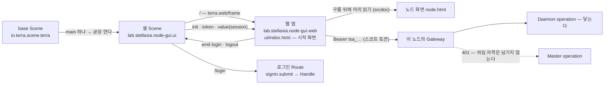

# Terra 노드 (`lab.stellaxia.node-gui`)

게임 GUI 형태의 Terra 노드 화면 — 시작 화면 · 육각 필드 맵 · 조타륜 · 노드 자원 · 연결(도로) · 오버헤드 패널 · 편집기 — 을
노드의 **main GUI**로 내는 모듈이다. base Scene(`io.terra.scene.terra`)은 main이 하나면 그것을 곧장 띄운다.

화면은 GUI 원본 저장소 [`StellaxiaLab/maingui`](https://github.com/StellaxiaLab/maingui) `4ec0685`(2026-10-06 — **ver.2 다크 글래스 디자인** · 사용자 관리 · 등록 상태 · 시작 화면 온보딩 · service 판 = 예시 데이터를 뺀 판 · Terra G0~G6 연동 · Terra 10/05 반영 · SVI 흐름도 · SVI 흐름 칸 · 맵 도로 애니메이션)를
바탕으로 한 **module 변형**이다(처음에는 `f24c3bc`, 그다음 `43a4e3a`에 맞췄다) — 같은 디자인 원본(`web/design/`) · 같은 생성 규칙이고, 갈림은 부트 프로필(`web/src/boot/module.js`)이다.
처음에는 압축 파일로 받은 `terra-node-gui` 1.0으로 만들었고, 그 뒤 maingui 저장소(자원 추가 · 수정 · 삭제 · 상태 화면 · 모듈 GUI 창이 더 있다)로 다시 맞췄다.
모듈이 더한 것은 다섯이다.

1. **얇은 셸 Scene** — `terra.web/frame` 하나와 로그인 Route 하나.
2. **frame 배선** — 웹이 Terra 셸 안에서 스코프 토큰으로 이 노드의 게이트웨이를 부른다. 시작 화면은 비밀번호를 받지 않고 셸의 로그인 카드를 부른다.
3. **실데이터 층** — 디자인 원본의 예시 데이터를 하나도 보이지 않게 지우고, 이 노드의 값으로만 채운다(`web/src/data/`).
4. **LayoutStore** — API에 자리가 없는 맵 배치 · 노드 모습 · 노드 자원 · 연결 · 메모를 이 브라우저에 노드 · 주체마다 두고, Terra 사용자 문서 저장소(C-1)에도 뒤따라 둔다(`web/src/store/layout.js` · `docs.js`) — 다른 기기 · 브라우저에서 같은 맵.
5. **웹 빌드 단계** — 이 저장소가 `web/`을 `ui/`로 굽는다([저장소 README](../../README.md)의 "웹 화면을 가진 모듈" 절).

남은 일 — 플랫폼 · 이 모듈 · GUI 원본(maingui) · 결정 — 은 [`web/docs/guides/implementation-backlog.md`](web/docs/guides/implementation-backlog.md).

가능성 판정과 그 근거(실측 · 플랫폼 공백 · 남은 결정)는 Terra의
`docs/reports/terra-node-gui-main-module-feasibility-2026-10-01.md`([Terra#106](https://github.com/StellaxiaLab/Terra/pull/106))에 있다.
이 모듈은 그 판정서 §6의 순서 중 **1~3과 P-4**를 구현한 것이다.

## 구성

```text
common/lab.stellaxia.node-gui/
├─ module.json                 kind=scene · gui.scenes(branch: main) · gui.apps(embed: scene)
├─ scene/                      셸 Scene — frame 하나와 로그인 Route
│  ├─ scene.json
│  ├─ contract/
│  │  ├─ functions/            signin.field · signin.submit · signout · login.open · login.close
│  │  └─ stores/               credentials(secret) · signin(view) · session(memory)
│  └─ surface/
│     └─ fragments/            main(terra.web/frame) · login
├─ web/                        화면 소스 — 포장되지 않는다 (README · docs/ 는 이 웹의 개발 문서)
│  ├─ src/                     화면(screens) · 런타임(runtime) · 부트 프로필(boot) · 연동 층(api) · 실데이터 층(data) · 저장(store) · 모델(model)
│  ├─ design/                  디자인 캔버스 원본 (*.dc.html) — 미리보기용 예시 데이터를 품고 있다
│  ├─ public/config.json       variant(module) · layoutStore · pollSec
│  ├─ tools/gen-pages.py       design → 화면 페이지 (module 변형 — 부트 프로필로 마운트 · 템플릿의 예시 글자 패치)
│  └─ tests/*.test.mjs         연동 층 · 실데이터 층 · 모듈 프로필 시험 (node:test — 브라우저 없이 돈다)
└─ ui/                         web/ 의 빌드 결과 — 커밋하지 않는다 (.gitignore)
```

[`docs/layout.md`](../../docs/layout.md)의 L-10(Scene 두 층)을 따르고, `web/` · `ui/`는 L-6 · L-8의
**웹 모듈** 절을 따른다 — `ui/`는 `bin/`처럼 빌드 산출물이다.

## 어떻게 맞물리나



| 자리 | 하는 일 |
| --- | --- |
| `contributions.gui.scenes[0]` | `branch: "main"`, `role: "application"`. base Scene은 main 1 · dev 0이면 이것을 곧장 연다 |
| `contributions.gui.apps[0]` | `mode: static` · `embed: "scene"` · `entry: ui/index.html`(시작 화면 — 세션이 있으면 노드 화면으로 내려간다). 게이트웨이가 앱별 origin(`app-….localhost`)에서 서빙한다. 권한 7개(`session.identity` · `node.read` · `node.control` · `file.read` · `file.write` · `process.execute` · `module.manage`) — 토큰에 실리는 것은 **사용자 권한 ∩ 이 목록**이다 |
| `node-gui.main` (`/`) | 루트가 `terra.web/frame` 하나다(Fragment 루트라 셸의 1120px 틀을 벗는다). `bind: session` → `terra.frame.value`, `on: login → node-gui.login.open · logout → node-gui.signout` |
| `node-gui.login` (`/login`) | 자격 로그인. **웹은 비밀번호를 보지 않는다.** 성공하면 `session`(memory)을 `signedIn`으로 쓰고 `/`로 돌아간다 — frame은 새 토큰과 값을 받는다 |
| `session` 스토어 | frame에 건네는 값(`state` · `principal`). 비밀번호를 든 `signin`(view)과 따로 둔 것은 그 값이 frame으로 나가지 않게 하려는 것이다 |

웹 쪽 배선(`frame-boot.js`가 첫 import로 `hello`를 보내는 이유, 노드 화면 · 보드를 `srcdoc`으로 여는 이유, 시작 화면이 비밀번호를 받지 않는 이유 등)은
[`web/docs/architecture.md`](web/docs/architecture.md) §7 · §8, [`web/docs/guides/module-profile.md`](web/docs/guides/module-profile.md), [`web/docs/api/frontend-api.md`](web/docs/api/frontend-api.md) §6.5.

## 무엇이 실데이터이고 무엇이 비어 있나

**예시 데이터는 화면 어디에도 나오지 않는다.** 디자인 원본(`web/design/*.dc.html`)은 미리보기를 위해 예시 세계를 품고 있지만,
페이지는 부트 프로필이 돌려준 화면 클래스(실데이터 층이 이어받은 것)를 마운트하고 그 클래스가 첫 렌더 전에 예시를 지운다. 자세한 것은
[`web/docs/api/real-data-layer.md`](web/docs/api/real-data-layer.md).

| 영역 | Terra 안에서 |
| --- | --- |
| 시작 화면 | frame 세션 — 로그인 전이면 [Terra 로그인](셸의 로그인 카드), 토큰이 있으면 주체 이름(whoami)을 보이고 곧장 노드 화면으로 |
| 맵 | 처음 맵은 **이 노드**(`terra.daemon.node.get`)의 맵. 부모 tree 는 등록 정보의 Master 주소(`tree · 호스트:포트`), 그 아래 노드는 `GET /api/v1/agent/nodes`(오프라인 노드는 건물에 정지 이벤트) |
| 맵 배치 · 노드 모습 · 노드 자원 · 연결(도로) · 표시 설정 · 메모 | LayoutStore — 이 브라우저(앱 origin)에 노드 · 주체마다 + 사용자 문서 `app:lab.stellaxia.node-gui.web/layout/<node_id>`(새 쪽이 이긴다 · 겹쳐 쓰면 한 번 알린다). 처음엔 비어 있다. 설치한 자원의 상태 · 모니터링 값은 원본 앱 목록에서(닫혀 있어도) |
| 세션 띠 · 유틸 카드 · 창 요약 · 속성 창 | 로그인한 사람(frame 값) · 토큰 권한 · 모듈 · 터널 · WireGuard · 설정 키 수 · 장치 · 공유 폴더 개수 — 진짜 값, 없으면 `—` |
| 알림 | 이 노드의 Daemon 작업(`terra.daemon.tasks.get`) — 실시간 이벤트(`terra.daemon.events.get` SSE)의 신호마다, 이벤트가 없으면 `pollSec`(기본 10초)마다. 새로 생기거나 상태가 바뀐 것 |
| 조타륜 앱 — I/O 장치 · 공유 폴더 · 파일 전송 · 서비스 터널 · WireGuard · 자원 선언 · 작업 · 모듈 | **실데이터와 실제 동작.** 작업은 Daemon 작업, 모듈 수명은 Daemon 경로(`node.control`). 장치 손 등록(카메라 주소) · 파일 올리기(↑ 올리기 → 조각 · SHA-256) · 받기(브라우저 저장) · 끊긴 뒤 이어서(같은 파일을 다시 올리면 서버가 받은 곳부터 · 다시 받으면 이 브라우저에 둔 조각부터 · 멈춘 전송의 카드) · 모듈 로그(상태 화면 출력 칸) |
| 자원 추가 · 수정 · 삭제(앱 전체 화면 · 상태 화면) | 실제 서버가 받는 본문으로 부른다 — 폴더(만들기 · 빈 파일 · 이름 바꾸기 · 지우기) · 장치(별명 · 승인 · 켜기 · 잊기 · 스캔) · 작업(실행 · 취소) · 전송(포기 · 중단해 둔 것의 치우기) · 모듈 설정(모듈이 선언한 칸 — 바뀐 키만 · 저장은 `module.manage`★). 서버에 길이 없으면 **항목을 지어 넣지 않고** 그렇다고 말한다 |
| 상태 화면 · 모듈 GUI 창 | 원본 앱 목록의 그 항목 · 이 노드의 권한 / 설치된 GUI 앱(`/api/v1/gui/apps`). 다른 모듈의 앱은 이 창에 띄울 수 없다고 적는다(frame은 자기 모듈의 앱만) |
| 조타륜 앱 — SVI 자원 · 허가 | Master operation — **읽기는 위임 입구로 닿는다**(Terra ADR-GW-003 1차): 자원 · 허가 · 열린 핸들 · 바인딩 목록. tree 에서는 operation id 로, leaf 에서는 `/api/upstream/…` 경로로 부른다(`src/api/master-delegated.js`). SVI 자원 앱 창은 흐름도(maingui A-28) · 상태 화면의 흐름 칸 · 맵의 흐르는 도로(MD-24) — 흐름 이벤트(SSE)는 2차라 열리지 않아 흐름 칸 · 도로는 움직이지 않는다(예시 흐름도 돌지 않는다). 허가 만들기 · 연결(bind)은 쓰기라 `DELEGATION_NOT_OPEN`으로 잠긴다 |
| 폴더 보관함 | Terra 저장소 = 이 노드의 공유 폴더(`io.terra.file`). 폴더 탐색기 = 이 노드의 로컬 최상위 루트(`local-fs` — 닫힌 폴더는 🔒), 파일 · 폴더는 그 노드의 바탕화면에 연다(`desktop.open` — 그 컴퓨터에서 볼 때만). 메모는 LayoutStore(브라우저 + 사용자 문서) |
| 네트워크 보드 | 로컬 WireGuard · 로컬 서비스 터널은 실데이터. 사설망(네트워크 · 노드 × 네트워크 · 배포) · 연결 진단(라우트 그래프 · 쌍의 후보 · probe 기록) · 라우팅(정책 · 세션) · 조작 이력은 **Master 읽기**로 진짜 값(위임 입구 1차 — tree 는 op id, leaf 는 `/api/upstream`, `src/data/network-master.js`). 보기만 한다 — 조정 · 계획 · 철회 · probe 실행 · 정책 저장 · 세션 닫기는 Master 쓰기(2차), 연결 그룹은 1차에 들지 않는다. 닿지 않으면 "닿지 않음" |
| 설정 보드 | 로컬 노드 135키(값 · 소유 · 반영 · 설치값 차이)와 저장, 계정(whoami), 로컬 자원. 클러스터 · 서버 탭은 Master — "닿지 않음" |
| 다른 노드 | 노드 주소 호출(Terra B-1)로 그 노드의 Daemon — I/O 장치 · 모듈(로그 포함) · 작업 · 선언 · 터널 · WireGuard. 그 노드 카탈로그로 누르기 전에 잠근다(로컬 전용은 잠김). 공유 폴더 · 전송 · 올리기 · 받기는 원격 모듈 경로(`/api/nodes/{node_id}/modules/io.terra.file/…`) |
| 다른 tree | 비어 있다 — 연결 목록을 둘 곳 · 가는 길이 없다 |
| 편집기에서 내보낸 도로 · 건물 | 이 브라우저(`localStorage`) — 노드 화면이 바로 받아 다시 굽는다 · 사용자 문서 `assets`로 뒤따라 |
| 로그인 전 · 토큰을 잃었을 때 | **빈 세계**(`이 노드` 한 칸 · `로그인 전`). 띠가 *"Terra에 로그인하지 않았습니다 — 로그인하면 이 노드의 데이터가 보입니다"* 와 [로그인]을 보인다 |

앱 스코프 토큰은 Bearer를 싣지 않는다 — **설계상 경계**다. Terra ADR-GW-003(아래 Q-2) 이후 게이트웨이는 앱 토큰을
Master의 **위임 입구**로 보내고, Master는 그 입구에 연 op(1차: 읽기 28)만 받는다. 이 모듈은 그 셋을 이렇게 읽는다:

| Master 의 답 | 화면 |
| --- | --- |
| 열린 읽기 — 200 | 그대로 쓴다. tree 게이트웨이는 카탈로그에 `terra.master.*`가 있어 operation id 로, leaf 게이트웨이는 카탈로그에 없어 `/api/upstream/…` 경로로 부른다(`src/api/client.js` `invokeUpstream` · 표는 Terra 계약에서 만든 `src/api/master-delegated.js`) |
| 열지 않은 op — 403 `DELEGATION_NOT_OPEN` | 그 op 하나만 "쓸 수 없다". leaf 에서는 표에 없는 op(쓰기 · 관리 · 흐름)를 부르지 않고 누르기 전에 잠근다 |
| 위임 입구가 없는 예전 Terra — 401 | "로그인 필요"가 아니라 "쓸 수 없다"로 바꾸고 그 뒤로 Master 를 부르지 않는다 |
| leaf 에 상위 Master 가 없다 — `/api/upstream` 501 | "상위 Master 가 없다" · 그 뒤로 경로로 부르지 않는다 |

> [!NOTE] Q-2는 Terra가 정했다 (2026-10-07, [Terra ADR-GW-003](https://github.com/StellaxiaLab/Terra/blob/main/docs/architecture/ADR-GW-003-master-operation-access-for-app-tokens.md) · [Terra#136](https://github.com/StellaxiaLab/Terra/pull/136))
> 앱 스코프 토큰은 **세션 id 위임 입구**로 Master operation에 닿는다 — 게이트웨이가 Core peer 자격 + 세션 id로 기존 Master 라우트를 부르고, Master가 그 사람의 세션을 복원해 권한을 좁힌다. Bearer는 여전히 나가지 않는다.
> 1차는 **읽기만 · 앱 토큰만 · 관리자 동작 제외**, tree · leaf 둘 다. 쓰기 · 관리자 · Master 이벤트(SSE)는 2차다.
> **Terra 구현이 들어왔다**([Terra#143](https://github.com/StellaxiaLab/Terra/pull/143) · 2026-10-09 main). 이 모듈은 tree · leaf 둘 다에서 1차 읽기를 부른다 — 위 표.

## 남은 결정 — 이번 구현이 고른 기본값

판정서 §7의 결정 가운데 **Q-1은 확정됐다**(아래 표). 나머지는 아직 사람이 내리지 않았고, 이 모듈은 **되돌리기 쉬운 쪽**을 골라 두었다.

| | 질문 | 이번 기본값 | 바꾸려면 |
| --- | --- | --- | --- |
| **Q-1** | 어떻게 나가나 (접두사) | **확정(2026-10-06) — 이 저장소의 릴리스로 나가고 코어에는 동봉하지 않는다.** `lab.stellaxia.*` 그대로, 개명 · `bundled-modules.json` 선언 없음. 설치는 설치기가 이 저장소 릴리스의 `.tmod`를 원격에서 가져와 깐다(설치기는 구현 중). 그 뒤의 변경 · 설치 · 업그레이드는 `.tmod`를 직접 받아 깔거나 tree 레지스트리(`pack` → `publish`)를 거친다 | 제품 동봉으로 가면 `io.terra.*`로 개명하고 코어 `bundled-modules.json`에 선언한다 — 되돌릴 때의 길이다 |
| **Q-2** | Master 데이터를 웹에 어떻게 건네나 | **확정(2026-10-07) — (나) Core peer 중계를 넓힌다.** [Terra ADR-GW-003](https://github.com/StellaxiaLab/Terra/blob/main/docs/architecture/ADR-GW-003-master-operation-access-for-app-tokens.md): 세션 id 위임 입구, 1차는 읽기만 · 앱만 · 관리자 제외. **Terra 구현은 [Terra#143](https://github.com/StellaxiaLab/Terra/pull/143)(1차 읽기 28 경로, main 병합).** 모듈은 열린 Master op 를 그대로 부르고(leaf 는 `/api/upstream` 경로), 열리지 않은 op 의 403 `DELEGATION_NOT_OPEN` 은 그 op 하나만 "쓸 수 없다"로 읽는다(`src/api/client.js`, Master 전체를 막는 것은 예전 Terra 의 401 뿐) — "쓸 수 없다" | 쓰기 · 관리자 · SSE는 ADR의 2차 결정을 기다린다. (가) Scene 중계는 쓰지 않는다 |
| **Q-3** | 메모 · 설계도 · 맵 배치를 어디에 두나 | **이 브라우저 + Terra 사용자 문서 저장소**(C-1 — Terra G0~G6이 열었다). 브라우저(LayoutStore · `localStorage`, 노드 · 주체마다)에 바로, 사용자 문서(`app:<앱 id>` 이름공간 — 앱 토큰이면 고정)에 뒤따라. `kind`는 `scene` 그대로 — 모듈 백엔드가 필요 없다 | `config.json` `layoutStore: local`(브라우저에만) · `none`(저장 안 함) — 백로그 Q-14 |
| **Q-4** | 보드를 어떻게 여나 | **`srcdoc`** — 판정서의 (가) · (나) · (다) 어느 것도 아닌 넷째 길. 프로토타입의 iframe 구조를 그대로 두고, 같은 앱의 페이지를 받아 `srcdoc`으로 넣는다. `srcdoc` 문서는 부모의 origin · CSP를 이어받아 `frame-ancestors` 검사를 타지 않는다 | (가) 한 문서 안에 마운트 · (다) 플랫폼 `frame-ancestors`에 `'self'`(P-3) |
| **Q-5** | 여러 tree 전환 | **(가) 뺀다** — tree 목록은 비어 있고, 다른 tree로 가려 하면 *"다른 tree로는 이 화면이 닿지 않는다"* | (나) 셸 수준의 기능으로 따로 설계한다 |
| **Q-6** | 폰트 | **(나) 시스템 글꼴** — Google Fonts를 뺐다(CSP `font-src 'self' data:`). 글꼴 스택의 `Noto Sans KR` → `system-ui` … 로 떨어진다 | (가) 서브셋을 `web/public/`에 넣어 번들 |

새 GUI를 올리며 생긴 결정 **Q-7~Q-13**(시작 화면을 entry로 · Terra 안 로그인 모양 · 연동 층 일원화 · `node.config`★ · 디자인 노트 페이지 ·
maingui를 따라가는 방법 · "삭제"의 뜻)은 [`web/docs/guides/implementation-backlog.md`](web/docs/guides/implementation-backlog.md) §4.

> [!NOTE] `branch`는 처음부터 `main`이다 — 판정서 §6과 다른 점
> 판정서 §6은 `branch: "dev"`로 시작해 마지막 단계에서 `main`으로 올리자고 적었다. 예시 데이터뿐인 화면이 설치만으로
> 노드의 main 자리를 차지하지 않게 하려는 순서였다. 이 모듈은 처음부터 `main`으로 간다.
>
> - 그 순서가 기다리던 것 중 1~3단계(frame · 로컬 실데이터)와 P-4(웹 빌드 단계)가 이 모듈과 함께 들어왔다. Q-1은
>   확정됐다 — 코어가 동봉하지 않으므로 **설치 자체가 운영자(또는 설치기)의 선택**이다. 설치기가 이 모듈을 깔아 주지 않으면 새 노드는 `MAIN_NOT_FOUND`로 시작하니, 설치기 쪽에서 챙겨야 하는 일이다.
> - base는 main을 조용히 갈아치우지 않는다 — main이 이미 있으면 둘이 되어 고르는 화면(CHOOSE)이 뜬다. 그리고 오늘
>   코어는 main을 동봉하지 않아 새 노드가 `MAIN_NOT_FOUND`로 시작한다. `dev`로 두면 이 모듈은 그 오류 화면의 dev
>   버튼으로만 열린다(Terra `docs/modules/terra-gui/design/terra-base-scene-branch-design.md` §4의 표).
> - 시험 설치에서 main 자리를 비워 두고 싶으면 `contributions.gui.scenes[0].branch`를 `"dev"`로 바꾼다.

## 개발

```bash
# Linux — 이 모듈의 web/ 에서. Windows(PowerShell)·macOS 도 같은 명령이다
cd common/lab.stellaxia.node-gui/web
npm ci
npm run dev          # http://localhost:5173 — 단독 실행, 데이터 없음(빈 세계)
npm test             # 연동 층 · 실데이터 층 · 모듈 프로필 · 추가 · 수정 · 삭제 · 이벤트 · 손 동작 시험 (100개)
npm run build        # ../ui/ 를 새로 쓴다
```

```bash
# 저장소 루트에서 — CI 와 릴리스가 부르는 것과 같다
npm run build:web -- --module lab.stellaxia.node-gui
npm run test:web -- --module lab.stellaxia.node-gui
terra module pack common/lab.stellaxia.node-gui --out /tmp/node-gui.tmod
```

화면을 바꾸려면 `web/design/*.dc.html`을 고치고 `npm run gen`(python3) — `web/src/screens/*.js`는 생성물이라
덮어쓰인다. 생성기(`web/tools/gen-pages.py`, module 변형)는 Google Fonts 링크를 빼고, 모듈 스크립트의 **첫 import**로
`frame-boot.js`를 넣고, 페이지가 **부트 프로필(`prep`)이 돌려준 클래스를 마운트**하게 하고, 템플릿에 박힌 예시 글자(세션 띠의 `admin · 21:40`,
`예시 데이터` 배지, 보드의 "시연" 스위치)를 바인딩으로 바꾸고, 시작 화면의 아이디 · 비밀번호 판을 [Terra 로그인]으로 바꾸고,
보드 iframe을 `data-board`로 · 화면 무대를 창 크기로 둔다. 모두 Terra 안에서 필요한 것이라 손으로 고친 페이지가
생성으로 되돌아가지 않게 생성기에 들어 있다. 원본이 바뀌어 패치 대상이 사라지면 생성이 멈춘다.
GUI 원본 저장소(maingui)에서 원본을 가져오는 순서는 [`web/docs/guides/module-profile.md`](web/docs/guides/module-profile.md) §8.

> [!WARNING] `terra module pack` 은 `ui/` 를 보지 않는다
> `ui/`가 없어도, `terra module new --web`의 자리 표시자만 있어도 `VERIFIED true`로 포장되고 설치하면 빈 화면이
> 뜬다(실측 — 아래 표). 손으로 포장할 때는 `npm run build:web`을 먼저 돌린다. 저장소의 `npm run pack`(CI ·
> 릴리스 경로)은 이 경우를 막는다.

## 검증

### leaf 화면의 Master 읽기 — 위임 입구 1차 (2026-10-09 · Terra ADR-GW-003)

Terra가 앱 토큰의 Master 위임 입구를 열었다([Terra#143](https://github.com/StellaxiaLab/Terra/pull/143)). tree 게이트웨이는 카탈로그에 Master op 가 있어 바뀐 것이 없고, leaf 게이트웨이는 카탈로그에 `terra.master.*`가 없어 경로로 부른다.

- **표** — `src/api/master-delegated.js`: Terra 계약에서 `security.authentication`에 `delegated-session`이 있는 op(28 · 모두 GET) → `[method, path]`. `web/tools/gen-master-delegated.mjs --terra <Terra>`로 만든다 · CI(Pack against Terra)가 `--check`로 대조한다.
- **부르기** — 위임 자격이고 카탈로그를 받았는데 그 op 가 없으면, 표에 있는 것은 `/api/upstream/v1/…`(`{name}` 자리 채움 · 나머지는 query), 없는 것은 부르지 않고 `DELEGATION_NOT_OPEN`.
- **잠금 · API 줄** — `reaches(client, op)`(카탈로그 또는 경로)로 본다: 상태 화면 자물쇠(`lockFor`) · 폼의 API 줄 ⚠ · 노드 관리의 이유(`masterWhy`) · SVI 연결 맞추기(`link-sync`) · 적용(`link-apply`) · 핸들 보기 폴링(`svi-live`).
- 시험: `tests/api.test.mjs`에 8개(경로 · 경로 자리 · 쓰기는 안 부름 · 501 · 401 · 403 · tree · 사용자 자격 그대로 · 표 규칙 · 계약 대조는 `TERRA_CHECKOUT`이 있을 때) · 전체 205 통과(1 건너뜀) · `build-web` 통과. **진짜 leaf 스택 실측은 아직이다.**
- 남은 것: 네트워크 · 설정 보드의 Master 읽기(사설망 · 라우팅 · 조작 이력 · 클러스터 탭)는 클라이언트로는 닿지만 보드가 아직 부르지 않는다. 쓰기 · 관리자 · SSE는 ADR의 2차.

### maingui 8af1b0c 따라가기 — UP-32 MD-41 (2026-10-09)

이 모듈이 MD-34에서 생성기 패치로 들고 있던 UP-32(실행 중인 작업 카드에도 `출력` · `다시`는 두 번 누르기)가 원본에 올라갔다([maingui#7](https://github.com/StellaxiaLab/maingui/pull/7)).
`design/Artboard-qcfu.dc.html`에 그 커밋의 UP-32 네 줄을 받았다 — 나머지 디자인 파일은 이미 같았다. 이 저장소가 디자인 원본에 직접 넣은 UP-22 · MD-35(입출력 설정 창)는 그대로 둔다.

- 생성기의 UP-32 패치를 걷었다. 출력 단추의 권한만 모듈 전용 패치로 남는다 — 이 노드의 출력은 Daemon이 `process.execute`로 준다(원본은 Master 작업을 `node.read`로 읽는다).
- 생성된 카드 줄은 전과 같다. 원본 화면이 `job:rerun`을 겨누는 줄이 더해졌지만, 연동 층(`wire.js` `confirm`)이 먼저 받으므로 동작은 같다.
- 시험: 단위 198 · 연기 통과.

### 작업 출력 · 다시 실행 — MD-34 (2026-10-07 · Terra PF-7)

Terra가 명령 작업의 출력과 다시 실행을 열었다([Terra#140](https://github.com/StellaxiaLab/Terra/pull/140) · [Terra#144](https://github.com/StellaxiaLab/Terra/pull/144)). 조타륜 명령 · 작업 앱이 그 길을 쓴다 — [`web/docs/api/real-data-layer.md`](web/docs/api/real-data-layer.md) §2.10.

- **출력** — `terra.daemon.tasks.by-task-id.output.get`(`process.execute`)을 상태 화면의 출력 칸에. 다른 노드도 노드 주소 호출로 읽는다. 이 노드에서 실행 중인 작업이면 출력 SSE(`output.events.get`)로 이어 받는다.
- **다시** — 두 번 눌러 `tasks.by-task-id.rerun.post {task_id, confirmed: true}`. 이 노드에서 시작한 끝난 작업만 — Master가 보낸 작업은 부르지 않고 이유를 보인다.
- **카드** — 실행 중에도 `출력`, 다시는 `정말 다시`. 생성기 `MODULE_JS`의 둘째 패치다(원본에 올릴 것 UP-32).
- 시험: `tests/taskout.test.mjs` 5개 · 전체 196 통과 · `npm run build` 통과. 앱 토큰으로 진짜 스택 실측(2026-10-09, Terra main `1e13d75`) — `web/tools/live-taskout.mjs` 15개 통과([`real-data-layer.md`](web/docs/api/real-data-layer.md) §5.7). 브라우저 화면은 단위 · 연기 시험으로 본다.

### maingui 4ec0685 따라가기 — 사용자 관리 · 등록 상태 · 온보딩 MD-26 (2026-10-06, 0.4.1)

원본이 `a884226` 뒤로 시작 화면(O-1 · O-2 · O-5 · O-7)과 설정 화면(사용자 관리 M-1 · 첫 실행 마무리 O-3 · 이 노드의 등록 상태 O-6)을 더했다.
`design/Intro.dc.html` · `design/Settings.dc.html`을 그 커밋 그대로 복사하고 다시 만들었다 — 모듈용 치환 패치는 그대로 맞았다.

- **사용자 관리(M-1)** — Master operation(`terra.master.admin.users.*`)이라 앱 토큰으로는 닿지 않는다(Q-2). ADR-GW-003의 1차에서도 관리자 동작은 열리지 않는다. 새 설정 디자인은 예시 사용자(`minji` 등)를 상태에 품고 있어서 **비우고** `usersState: 'error'`("Master에 닿지 않았거나…")로 둔다. 예시 동작(`userApi` — 화면 안에서만 사용자를 늘린다)은 "Master operation — 이 화면에서는 닿지 않는다"로 바꿨다.
- **이 노드의 등록 상태(O-6)** — Daemon operation(`terra.daemon.enrollment.status.get`, `node.read`)이라 **진짜 값**을 읽는다. 못 받으면(tree만 · 길 없음) 말없이 "없음". `ENROLLMENT` · `USERS` operation 선언은 `src/api/operations.js`에 들어왔다.
- **알림 글자색** — 원본이 `wire.js`의 상태 글줄 색을 다크 글래스 팔레트로 옮겼다(`#d33d52→#ff6b81` · `#1f7a4d→#4ade80` · `#a65f00→#fbbf24` · `#2563eb→#60a5fa` · `#5b6472→#8b95a6`). 모듈의 같은 자리(`wire.js` · `data/alarms.js` · `data/node-live.js` 상수 · 설정 · 네트워크의 토스트)에 같은 값을 적용했다. 배지 배경(`model/badges.js`)과 로그인 띠(`api/frame-session.js`)는 원본도 그대로라 손대지 않았다.
- **싣지 않은 것** — 시작 화면의 등록 단계 표시 · 복사 명령(O-5 · O-7)과 첫 실행 마무리의 서비스 판 동작은 모듈이 로그인 박스를 통째로 바꾸므로(Terra 셸이 로그인을 받는다) 화면에 나오지 않는다.

### maingui a884226 따라가기 — ver.2 다크 글래스 디자인 MD-25 (2026-10-06, 0.4.0)

원본이 화면 전체를 ver.2 다크 글래스로 다시 입혔다(30커밋 — 노드 화면의 서랍 · 세션 띠 · 인스펙터 · 창 불투명도, 편집기 5종 · 설정 · 네트워크 · 시작 화면).
`design/`을 그 커밋 그대로 복사하고 다시 만들었다. 모듈이 손댄 곳은 셋이다.

- `tools/gen-pages.py`의 `MODULE_TPL` 치환 8건을 ver.2 마크업에 맞춰 다시 썼다(세션 띠 · 예시 배지 · 시연 스위치 · 상태 시연 select · 권한 줄 · 시작 화면 v0.2 줄). 시작 화면의 Terra 로그인 박스도 다크 색으로 바꿨다.
- 이모지 글꼴(`public/fonts/noto-emoji.woff2` — 단색 선 글꼴, OFL)을 원본처럼 저장소에서 서빙한다. CDN을 부르지 않으므로 `font-src 'self'` CSP와 맞는다.
- 연기 시험(`tests/smoke.mjs`)의 두 조작을 ver.2에 맞췄다 — 전체 화면에서 맵으로는 세션 띠의 `[맵]` 버튼, 보관함 알약은 오른쪽 끝을 누른다.

원본이 더한 **노드 등록 코드**(A-19 — 미등록 leaf 등록 화면 · tree 노드 상태 창의 코드 발급)는 이 모듈에 싣지 않는다. 등록 화면은 시작 화면의 로그인 박스를 통째로 바꾸는 모듈 프로필에서 빠졌고(셸이 로그인을 받는다), 발급은 Master operation(쓰기)이라 앱 토큰으로는 "쓸 수 없다"(Q-2)로 보인다 — ADR-GW-003의 1차(읽기만)에도 들지 않는다. `ENROLL` operation 선언만 `src/api/operations.js`에 들어와 있다.

### maingui 43a4e3a 따라가기 — SVI 흐름 칸 · 맵 도로 MD-24 (2026-10-05)

원본의 `07d5739`(이 모듈이 올린 UP-1 · 2 · 3 · 10 · 12 · 15 · 18 · 19 · 21 · 24)와 `85e28ee`(A-28 흐름 칸 · 맵 도로 애니메이션)를 따라갔다.
`design/Artboard-qcfu.dc.html` · `design/Intro.dc.html`을 그 커밋 그대로 복사하고 다시 만들었다 — 자세히는
[`web/docs/guides/implementation-backlog.md`](web/docs/guides/implementation-backlog.md) MD-24.

| 항목 | 결과 |
| --- | --- |
| 흐름 칸 | 상태 화면(SVI 자원) 아래 — 상태 · QoS · seq · fps · 받은 양 · 버린 프레임, `schema_ref`별 본문(글자 · hex · 그림 최신 1장 · 메타), ⏸ 멈춤 · 🧹 지우기 · ⏹ 닫기 · ⬇ 저장. `src/api/svi-stream.js`는 원본 그대로, `src/api/svi-live.js`는 이 모듈의 `openEvents`(op를 opts로) · `HELM_APPS.svi.events`에 맞췄다 |
| 맵 도로 | 열린 핸들이 흐르는 SVI 자원의 연결에 움직이는 점선 + fps (`prefers-reduced-motion`이면 멈춘 선) |
| 열기 · 닫기 | 열기는 stream 엔드포인트가 `subscribe`를 열면 `subscribe`, 아니면 `read`(`sviOpenOp`). 전에는 열기 본문이 비었고, 닫기는 카드 id(자원)를 `handle_id`로 실었다 — 열린 핸들로 고쳤다 |
| 원본에 올라간 패치 | 시작 화면 알약의 누름 끄기(UP-15)는 생성기 패치를 걷었다 — 원본에 있다. 메모 경로 글(UP-18)은 원본이 `memos/`를 쓰게 돼 `메모/`로 바꾸는 규칙을 넓혔다 |
| 앱 토큰 | SVI는 Master op다 — 목록 · 핸들은 위임 입구 1차(Terra ADR-GW-003)로 닿지만 흐름 이벤트(SSE)는 2차라 구독을 하나도 열지 않는다. 진짜 Terra 스택에서는 아직 돌려 보지 않았다 |
| 시험 | `npm test` 126(흐름 칸 · 열기/닫기 본문 · StreamView 새로) · `test:smoke`(SVI 자원 앱 — 흐름 칸 · 도로에 예시 없음) · `validate` · `build:web` · `test:web` 통과 · 페이지 오류 0 |

### maingui 1aa6340 따라가기 — SVI 흐름도 MD-23 (2026-10-05, 0.3.0 · Terra main `3195421`)

같은 스택에 이 모듈을 다시 깔고 앱 전체 화면에서 SVI 자원 앱과 네트워크 화면을 열었다. 화면이 부른 operation을 모두 적어 견줬다 —
자세히는 [`web/docs/api/real-data-layer.md`](web/docs/api/real-data-layer.md) §5.6.

| 항목 | 진짜 스택에서 |
| --- | --- |
| SVI 자원 앱 | 흐름도(제공 · 자원 · 엔드포인트 · 쓰는 쪽) · `▦ 카드로` · 흐름 이벤트 칸 `열린 핸들이 없다` — 빈 흐름도. 머리 줄의 `쓸 수 없다 · 이 노드의 게이트웨이에 없다`가 10초 뒤에도 남았다(고치기 전에는 2.6초 뒤 지워졌다) |
| 예시 · 부른 것 | 10초 동안 흐름 이벤트 0 · `svi`가 들어간 operation 0(카탈로그에 없는 Master op는 부르지 않는다) · Master 네트워크 읽기 0 |
| 네트워크 화면 | 보드의 사설망 · 진단 · mesh 묶음이 `Master operation — 이 화면에서 닿지 않음` |
| 흐름도의 진짜 모양 | Master 계약 모양의 가짜 서버로 — 엔드포인트 · 열린 핸들 · 바인딩 · 허가 · 흐름 이벤트 SSE(`sviflow.test.mjs`). 허가 · 바인딩 어댑터를 Master의 답 모양으로 고쳤다 |
| 시험 | `npm test` 124 · `test:smoke`(SVI 자원 앱 — 잠김 · 빈 흐름도 · 카드 보기) · `validate` · `test:web` 통과 · 페이지 오류 0 |

### maingui e669c03 따라가기 — 모듈 설정 폼 MD-22 (2026-10-05, 0.3.0 · Terra main `3195421`)

스택을 Terra main(모듈 설정 op 셋)으로 다시 빌드하고, `configuration.schema`를 선언한 시험 모듈(scratchpad)을 깔았다. 관리자에게 `module.manage`★를 따로 주고
앱 전체 화면에서 그 모듈의 `✎`를 눌렀다 — 자세히는 [`web/docs/api/real-data-layer.md`](web/docs/api/real-data-layer.md) §5.5.

| 항목 | 진짜 스택에서 |
| --- | --- |
| 폼 | `⚙ 설정 · 모듈` · 칸 다섯(글 · 고르기 · 수 `기본 50` · 비밀 · 예/아니오) · API 줄 초록 |
| 거절 · 저장 | `poll_ms` 5 → `설정 값이 스키마를 어긴다 — poll_ms — must be at least 10` · 120 저장 → `revision 1` · 비밀은 `set: true`만 |
| 다시 열기 · 겹침 · 비우기 | 저장된 값 · 비밀 칸 `설정됨 — 비워 두면 그대로` · 다른 쪽이 먼저 고치면 `다른 화면이 먼저 설정을 바꿨다` · 비우면 기본값으로(`unset`) |
| 설정 없는 모듈 · 권한 | `Terra File`은 `설정을 선언하지 않은 모듈이다` · `module.manage`가 없으면 값은 보이고 저장은 `🔒 … 볼 수만 있다` |
| MD-21 다시 | Terra main 스택에서도 올리기 · 받기 · 멈춘 카드 · 중단 · 치우기가 31%부터 이어졌다 |
| 시험 | `npm test` 116 · `test:smoke` · `validate` · `test:web` 통과 · 페이지 오류 0 |

### 끊긴 뒤 이어서 — MD-21 (2026-10-05, 0.3.0 · io.terra.file 0.2.1)

같은 스택에 io.terra.file 0.2.1과 이 모듈을 깔고, leaf UI 셸 안에서 4 MB 파일(조각 16개)을 주고받다가 **페이지를 떠나** 끊은 뒤 다시 로그인해 이었다.
내용은 SHA-256으로 견줬다 — 자세히는 [`web/docs/api/real-data-layer.md`](web/docs/api/real-data-layer.md) §5.4.

| 항목 | 진짜 스택에서 |
| --- | --- |
| 올리기 | 31%에서 끊김 → 같은 파일을 다시 `↑ 올리기` → `31%부터 이어서` · 조각 11개만 더 보냈다 · 내용이 같다 |
| 받기 | 31%에서 끊김 → 이 브라우저 IndexedDB에 1310720 B → 다시 `받기` → `31%부터 이어서` · 내용이 같다 · 앞선 받기는 닫혔다 |
| 멈춘 카드 | 15초 뒤 `어긋남` · `멈췄다 · 31%에서 보내던 화면이 닫혔다` · [이어서 · 중단] → 이름이 다른 같은 파일로 이었다 |
| 중단 · 치우기 | 중단 → `중단됨` · `31% 남겨 둠` · 부분 파일 1310720 B → 같은 파일 다시 올리기로 이었다. 치우기 → 카드 · 기록 · 부분 파일이 모두 사라졌다 |
| io.terra.file 0.2.1 | 0.2.0은 invoke로 보낸 중단의 `keep_partial`을 듣지 않았다(`kept_partial: false` · 기록 404 · 부분 파일 없음) → 0.2.1은 `kept_partial: true` · 기록 200 · 부분 파일 남음 |
| 시험 | `npm test` 111 · `test:smoke`(진짜 IndexedDB 포함) · io.terra.file `go test`(고치기 전 코드로는 새 시험이 실패) · `validate` · `test:web` · `test:scenes` 통과 · 페이지 오류 0 |

### Terra G0~G6 연동 — MD-11 · MD-12 · MD-15~MD-19 (2026-10-05, 0.3.0)

Terra(main + [Terra#118](https://github.com/StellaxiaLab/Terra/pull/118))로 빌드한 스택에 이 모듈 0.3.0과 modules main의 `io.terra.file` · `io.terra.io-inventory` 0.2.0을 깔고,
이 모듈 앱 토큰으로 Chromium(Playwright)에서 돌렸다. 결과는 관리자 토큰으로 서버에 직접 물어 견줬다 — 자세히는 [`web/docs/api/real-data-layer.md`](web/docs/api/real-data-layer.md) §5.3.

| 항목 | 진짜 스택에서 |
| --- | --- |
| MD-11 실시간 이벤트 | SSE `open` · 네트워크 카드 `실시간`. 장치를 손 등록하자 `terra.io.devices.changed` → I/O 앱만 다시 받았다 |
| MD-18 장치 손 등록 | I/O 앱 폼(이름 · 주소) `rtsp://…` → Daemon `adapter_id: manual.rtsp` · `kind: camera` |
| MD-12 다른 노드 | 그 노드 카탈로그 49개 · `io.devices.get` · 모듈 로그 중계 200 · 로컬 전용(`local-fs`)은 부르지 않고 잠금 |
| MD-20 다른 노드의 공유 폴더 | 모듈 코드를 앱 토큰으로 진짜 게이트웨이에 — 목록 · 400 KB 올리기 · 받기(내용 같음) · 지우기가 모두 원격 모듈 경로로 |
| MD-16 로그 · 탐색기 · 열기 | 모듈 로그 → 상태 화면 출력 칸 · 로컬 루트(`root` · `home🔒`) → `etc` 153개 · 열기 → 이 컨테이너엔 바탕화면이 없다는 글(503) |
| MD-17 올리기 · 받기 | `↑ 올리기` 단추 → 파일 고르기 → 300 KB(조각 둘) 검사 통과 · 서버 크기 같음 → 폴더 앱 `받기` → 내려받은 내용이 같다 |
| MD-15 사용자 문서 | `app:lab.stellaxia.node-gui.web/layout/<node_id>` · **새 브라우저**(빈 저장소)에서 같은 표지 · 메모 · 겹쳐 쓰면 409 한 번 알림 |
| MD-19 디자인 | `design/`이 maingui `2ced429`와 파일 단위로 같다 · 페이지 오류 0 |
| 시험 | `npm test` 100 · `test:smoke` · `validate` · `test:web` 통과 |

### 구현해야 할 것 — MD-4 · MD-5 · MD-8 (2026-10-05)

| 항목 | 진짜 스택에서 |
| --- | --- |
| MD-5 자기 칸 | 이 노드 칸을 고르면 캡슐(이름 · 로고)이 뜬다 — 연결은 원본 규칙(공유 · 내보내기)대로 |
| MD-4 저장본의 `node_id` | 저장본에 `nodeIds: { stack-leaf-01: node_… }`. 이름이 바뀐 노드 · 같은 이름을 얻은 다른 노드는 시험(`tests/module.test.mjs`)으로 본다 |
| MD-8 로그아웃 | 세션 띠의 [로그아웃] → 시작 화면이 노드 화면을 걷고 판으로(누름은 판이 받는다) → [Terra 로그인] → 같은 맵으로 다시 내려간다 |
| 시험 | `npm test` 80 · `test:smoke` · `validate` · `test:web` · `test:scenes` 44 통과 · 예시 표식 0건 |

### maingui 기준 — 추가 · 수정 · 삭제 · 상태 화면 · 모듈 GUI 창 (2026-10-04)

maingui `f24c3bc`에 맞춘 0.2.0을 같은 스택에 깔고, 화면을 사람처럼 눌러(`＋ 추가` · `✎` · `🗑` · 폼 칸 · 저장) 돌린 뒤 관리자 토큰으로 서버에 직접 물어 견줬다.

| 단계 | 관찰 |
| --- | --- |
| 공유 폴더 | 폴더 · 빈 파일 만들기 → 디스크에 생김 · 이름 바꾸기 → 바뀜 · 두 번 눌러 지우기 → 사라짐(서버 목록이 처음과 같아졌다) · 공유 폴더 맨 위 칸에서는 부르지 않고 이유 |
| I/O 장치 | 폼에서 이름 · 승인 → Daemon 별명 `E2E 마이크` · `approved` · 종류는 못 바꾼다고 말한다 · 추가 = 스캔 |
| 명령 · 작업 | 앱 바 `+ 실행` → 폼 → `echo e2e-crud` → 새 Daemon 작업 `succeeded` |
| 터널 · 모듈 | Master op 은 leaf 게이트웨이에 없다고 폼 · API 줄(⚠)에 적는다 · 모듈 설치는 폼을 열지 않는다 · 이 모듈의 GUI 창은 "지금 보고 있는 이 화면" |
| 상태 화면 · 오버헤드 패널 | 자원 · 노드 칸의 진짜 값 · `로그인됨 — 이 화면의 세션` · 패널 접힘이 새로 고침 뒤에도 남는다 |
| 예시 표식 · 콘솔 | **0건** · 콘솔 오류는 셸의 `/api/product/session` 404뿐 |
| 찾아 고친 것 | 시작 화면의 아래 두 알약이 내려간 뒤에도 노드 화면 아래 누름을 가로챘다(폼 저장 단추가 눌리지 않음) — 원본에도 있다(백로그 UP-15) |
| `npm test` · `test:smoke` · `validate` · `test:web` · `test:scenes` | 76 통과 · 연기 시험 통과 · 오류 0 · 통과 · 44 통과 |

원본의 추가 · 수정 · 삭제 대응(`HELM_CRUD`)은 본문 일부가 실제 서버와 달라(폴더 `root` · 선언 모양 · 터널 · 피어 회수 · Master POST의 `node_id`)
모듈은 서버 코드로 확인한 본문으로 옮겼다 — [`web/docs/api/real-data-layer.md`](web/docs/api/real-data-layer.md) §2.4 · 백로그 UP-12 · UP-13.

### 새 GUI — 진짜 스택 (2026-10-04)

같은 스택에 0.2.0(앱 entry = 시작 화면)을 `terra module install --dev --force`로 깔고 Chromium(Playwright)으로 돌렸다.
모든 frame(시작 화면 · 노드 화면 srcdoc · 보드 srcdoc)의 보이는 글자에서 예시 표식을 찾았다.

| 단계 | 관찰 |
| --- | --- |
| 시작 화면 — 로그인 전 | "Terra에 로그인하지 않았다" · [Terra 로그인] · **비밀번호 칸 없음** |
| [Terra 로그인] → 셸 로그인 카드 | frame 다시 띄움 → "admin@stack.local(으)로 들어가는 중…" → 구름 → 미리 읽은 노드 화면(srcdoc) |
| 노드 자원 · 연결 | I/O 장치 둘을 필드에 설치 → 조타륜을 닫아도 모니터링 값이 원본 목록과 이어진다 · 연결하기가 빈 필드에 돌길을 깐다(노드 자신의 칸은 지나지 않는다) |
| 도로 편집기 · 보드 | 보드(srcdoc)로 뜨고 내보내기를 노드 화면이 받는다 · 네트워크 · 설정 · 건물 편집기 — CSP 거절 0 |
| 다시 열기 | 셸 새로 고침 → 다시 로그인 → 자원 · 연결 · 도로 · 메모 · 표지가 되살아난다(LayoutStore) |
| 창 크기 · 로그아웃 | 1800×1050에서 꽉 찬다 · 로그아웃 → 빈 세계, 저장본은 그대로 |
| 예시 표식 · 콘솔 | **0건** · 콘솔 오류는 셸의 `/api/product/session` 404뿐 |
| `npm test` · `test:smoke` · `validate` · `test:web` · `test:scenes` | 53 통과 · 연기 시험 통과 · 오류 0 · 통과 · 44 통과 |

### 실데이터 — 진짜 스택 (2026-10-03)

진짜 Master · Daemon(등록) · 게이트웨이 · `io.terra.file` · `io.terra.io-inventory` · leaf UI 셸(Vite) 위에 포장물을
`terra module install --dev --force`로 깔고 Chromium(Playwright)으로 돌렸다. 화면에 보이는 글자 전체(보드 iframe 포함)에서
예전 예시 표식 60여 개(노드 이름 · 장치 · 메모 · 알림 · IP · `21:40` · `예시 데이터` · `시연` …)를 찾았다.

| 단계 | 관찰 |
| --- | --- |
| 15개 상태 — 로그인 전 · 로그인 · 조타륜 10앱 · 폴더 보관함 · tree 맵 · 네트워크 3묶음 · 설정 5탭 · 자재 편집기 · 로그아웃 | 예시 표식 **0건** |
| 로그인 | 맵 `stack-leaf-01` · 부모 `tree · 127.0.0.1:28080` · 자원 `I/O 장치 3 · 공유 폴더 1 · 모듈 4` · 띠 `admin@stack.local` + 토큰 권한 6개 |
| 동작 | 공유 폴더 만들기 → 디스크에 생김 · 지우기 → 사라짐 · I/O 승인 → Daemon `approved` · 모듈 상태 확인 · 작업 보기 |
| 알림 | 다른 길로 Daemon 작업을 하나 만들면 12초 안에 알림 + 책갈피 |
| 보드 | 네트워크: WireGuard `terra0` 꺼짐 + 데몬이 준 설치 계획 · Master 묶음 "닿지 않음". 설정: `daemon.device_name = stack-leaf-01` 등 실제 값 · 계정 = whoami |
| `npm test` · `npm run test:smoke` | 42개 통과 · 연기 시험 통과 |

실측에서 드러난 플랫폼 사실(whoami 를 invoke 로 부르면 `anonymous`, leaf 게이트웨이의 모듈 로그 미지원 등)은
[`web/docs/api/real-data-layer.md`](web/docs/api/real-data-layer.md) §5.1.

### 포장 · frame (2026-10-01)

| 명령 · 환경 | 결과 |
| --- | --- |
| `npm run validate` | 오류 0 · 이 모듈의 경고 0. `ui/`가 없는 소스 트리에서도 통과 — 웹 모듈의 앱 entry는 모양만 본다 |
| `npm run build:web` | `ui/` 26개 파일 · 931,070 bytes. 앱 entry 검사 통과 |
| `npm run test:web` | 13개 통과 |
| `npm run pack -- --cli … --terra … --tag …` | 저장소 13개 모듈 · 자산 33개 · 디스크와 목록의 수 일치. 이 모듈은 `FILES 37` · `VERIFIED true` · 323,401 bytes |
| 같은 명령, `ui/` 없이 | exit 1 — `앱 lab.stellaxia.node-gui.web 의 entry ui/node.html 가 없다`. `modules.json`을 쓰지 않는다 |
| 같은 명령, `ui/node.html`이 스캐폴드 자리 표시자 | exit 1 — `… 가 아직 자리 표시자다`. `modules.json`을 쓰지 않는다 |
| `terra module pack` 단독, `ui/` 없이 · 자리 표시자 | 둘 다 `VERIFIED true` (`FILES 11` · `12`) — 위 두 줄이 있는 이유 |

브라우저 끝까지(E2E) — 진짜 `terra-gateway`(Master introspection 모드, Master는 forward-auth · Daemon은 auth-file)와
진짜 leaf UI 셸(Vite) 위에서, 포장물을 풀어 Scene 루트로 주고 Chromium(Playwright)으로 돌렸다. Master와
Daemon만 가짜다.

| 단계 | 관찰 |
| --- | --- |
| 셸이 main을 연다 | frame 안에 노드 화면. 띠 *"Terra에 로그인하지 않았습니다"* (`NO_SESSION`) — 그때는 예시 데이터가 보였다. 지금은 빈 세계(위 2026-10-03) |
| [로그인] → `/login` → 자격 로그인 | `POST /api/v1/auth/credentials` 200 → 앱 토큰 발급 200 → frame 토큰의 권한 7개, 값 `{ state: 'signedIn', principal: 'alice@example' }` |
| 조타륜 I/O 장치 | 가짜 Daemon의 장치 목록이 보인다 (`terra.daemon.io.devices.get` 200) |
| 조타륜 공유 자원 (Master) | `쓸 수 없다 · Master를 거치는 기능은 이 화면에 아직 열리지 않았다`. Master 호출은 2번(frame 클라이언트의 토큰 재발급 재시도 포함)에서 멈추고, 10초 폴링 뒤에도 2번이다 |
| 전체 화면 → 건물 편집기 | `about:srcdoc` · 제목 *"Terra · 건물 편집기"* · 보드 안에서 화면이 마운트된다. 보드의 돌아가기 링크 → 전체 화면이 닫힌다 |
| [로그아웃] | `DELETE /api/v1/auth/credentials` · 앱 토큰 회수 → 띠가 돌아온다(지금은 빈 세계로 돌아간다) |
| 콘솔 | CSP 위반 0 · handshake 경고 0. 오류는 둘 — 셸의 `/api/product/session` 404(이 모듈과 무관)와 위의 Master 401(의도) |

## 관련 문서

- [저장소 README](../../README.md) — 접두사(Q-1), 웹 화면을 가진 모듈의 빌드 · 포장
- [`docs/layout.md`](../../docs/layout.md) — L-6 · L-8 웹 모듈 절, L-10 Scene 두 층
- [`web/README.md`](web/README.md) — 웹 프로젝트 소개 · [`web/docs/README.md`](web/docs/README.md) — 웹 개발 문서 MOC
- [`web/docs/api/real-data-layer.md`](web/docs/api/real-data-layer.md) — 예시 데이터를 지운 방법 · 출처 · 빈 자리 · 실측
- [`web/docs/guides/module-profile.md`](web/docs/guides/module-profile.md) — 변형(demo · service · module) · 시작 화면 · LayoutStore · 원본(maingui)과 맞추기
- [`web/docs/guides/implementation-backlog.md`](web/docs/guides/implementation-backlog.md) — 구현해야 할 것 (PF · MD · UP · Q)
- [`web/docs/data/io-link-svi-binding-design.md`](web/docs/data/io-link-svi-binding-design.md) — 맵의 연결(`links`) ↔ SVI 바인딩 · 허가 설계(MD-1 · PF-1 가정)
- Terra `docs/reports/terra-node-gui-main-module-feasibility-2026-10-01.md` — 가능성 판정 · 플랫폼 공백 P-1~P-5 · 결정 Q-1~Q-6
- Terra `docs/modules/terra-gui/design/terra-base-scene-branch-design.md` — base Scene이 main을 고르는 규칙
- Terra `products/common/apps/terra-cli/internal/app/webscaffold/` — `terra-frame-client.js`의 원본(`web/src/api/`에 그대로 사본)

## 관련 모듈

- `io.terra.scene.terra` (Terra 코어) — 이 main을 띄우는 base Scene
- [`io.terra.file`](../../leaf/io.terra.file) · [`io.terra.io-inventory`](../../leaf/io.terra.io-inventory) — 공유 폴더 · 전송(0.2.0 받기 · 0.2.1 부분을 남기는 중단) · I/O 장치(0.2.0 손 등록) 데이터의 출처
- [`lab.stellaxia.scene.hello`](../lab.stellaxia.scene.hello/README.md) — 같은 tree 레지스트리 경로의 가장 작은 Scene 모듈
- GUI 원본 저장소 [`StellaxiaLab/maingui`](https://github.com/StellaxiaLab/maingui) — 디자인 원본 · service 판(뿌리) · demo 판(`examples/`). 이 모듈의 `design/`은 `4ec0685`와 같다

## 관련 흐름

- 위 "어떻게 맞물리나" 그림 — base Scene → 셸 Scene → frame → 시작 화면 → 노드 화면(srcdoc) → Gateway
- 로그인 → 이 노드 · 부모 tree · 자원 읽기(`loadWorld`) → LayoutStore 되살리기(브라우저 · 사용자 문서 중 새 쪽) → 조타륜 앱 연결 → 실시간 이벤트(폴링은 바닥) · 로그아웃 → 빈 세계(저장본은 남는다)
- 다른 노드 — 관계도의 `node_id` → 그 노드 카탈로그 → 노드 주소 호출(Master 중계 · 대상 Daemon 판정)
- 빌드 · 출하 — `npm run build:web` → `npm run pack`(앱 entry 검사) → 릴리스 자산 → `publish`
- 자원 추가 · 수정 · 삭제 — 폼 저장 · 두 번째 누름 → `source.crud`(실제 본문) → 이 노드의 Gateway → 목록 다시 받기 — 서버에 길이 없으면 지어내지 않는다
- 원본 따라가기 — maingui `design/` 복사 → `npm run gen`(패치를 못 찾으면 멈춤) → 시험 → `build:web`
- 끊긴 뒤 이어서 — 올리기는 서버의 checkpoint(전송 목록 → `resume_id`), 받기는 이 브라우저의 조각(IndexedDB) → 서버의 SHA-256으로 끝에서 견준다
- SVI 흐름도 — 자원 · 허가 · 열린 핸들 · 바인딩 → 흐름도, 고른 자원의 열린 핸들 → 흐름 이벤트 SSE. 앱 토큰으로는 목록까지(위임 입구 1차 — leaf 는 `/api/upstream`), 흐름 이벤트는 2차
