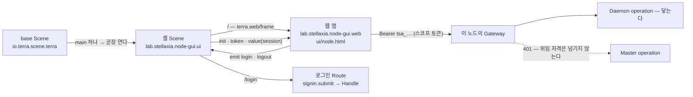

# Terra 노드 (`lab.stellaxia.node-gui`)

게임 GUI 형태의 Terra 노드 화면 — 육각 필드 맵 · 조타륜 · 오버헤드 패널 · 편집기 — 을 노드의 **main GUI**로 내는
모듈이다. base Scene(`io.terra.scene.terra`)은 main이 하나면 그것을 곧장 띄운다.

화면은 프로토타입 `terra-node-gui`를 그대로 옮긴 것이다. 모듈이 더한 것은 넷이다.

1. **얇은 셸 Scene** — `terra.web/frame` 하나와 로그인 Route 하나.
2. **frame 배선** — 웹이 Terra 셸 안에서 스코프 토큰으로 이 노드의 게이트웨이를 부른다.
3. **실데이터 층** — 프로토타입의 예시 데이터를 하나도 보이지 않게 지우고, 이 노드의 값으로만 채운다(`web/src/data/`).
4. **웹 빌드 단계** — 이 저장소가 `web/`을 `ui/`로 굽는다([저장소 README](../../README.md)의 "웹 화면을 가진 모듈" 절).

가능성 판정과 그 근거(실측 · 플랫폼 공백 · 남은 결정)는 Terra의
`docs/reports/terra-node-gui-main-module-feasibility-2026-10-01.md`([Terra#106](https://github.com/StellaxiaLab/Terra/pull/106))에 있다.
이 모듈은 그 판정서 §6의 순서 중 **1~3과 P-4**를 구현한 것이다.

## 구성

```text
common/lab.stellaxia.node-gui/
├─ module.json                 kind=scene · gui.scenes(branch: main) · gui.apps(embed: scene)
├─ scene/                      셸 Scene — frame 하나와 로그인 Route
│  ├─ scene.json
│  ├─ contract/
│  │  ├─ functions/            signin.field · signin.submit · signout · login.open · login.close
│  │  └─ stores/               credentials(secret) · signin(view) · session(memory)
│  └─ surface/
│     └─ fragments/            main(terra.web/frame) · login
├─ web/                        화면 소스 — 포장되지 않는다 (README · docs/ 는 이 웹의 개발 문서)
│  ├─ src/                     화면(screens) · 런타임(runtime) · 연동 층(api) · 실데이터 층(data) · 모델(model)
│  ├─ design/                  디자인 캔버스 원본 (*.dc.html) — 미리보기용 예시 데이터를 품고 있다
│  ├─ tools/gen-pages.py       design → 화면 페이지 (실데이터 층으로 마운트 · 템플릿의 예시 글자 패치)
│  └─ tests/*.test.mjs         연동 층 · 실데이터 층 시험 (node:test — 브라우저 없이 돈다)
└─ ui/                         web/ 의 빌드 결과 — 커밋하지 않는다 (.gitignore)
```

[`docs/layout.md`](../../docs/layout.md)의 L-10(Scene 두 층)을 따르고, `web/` · `ui/`는 L-6 · L-8의
**웹 모듈** 절을 따른다 — `ui/`는 `bin/`처럼 빌드 산출물이다.

## 어떻게 맞물리나



| 자리 | 하는 일 |
| --- | --- |
| `contributions.gui.scenes[0]` | `branch: "main"`, `role: "application"`. base Scene은 main 1 · dev 0이면 이것을 곧장 연다 |
| `contributions.gui.apps[0]` | `mode: static` · `embed: "scene"` · `entry: ui/node.html`. 게이트웨이가 앱별 origin(`app-….localhost`)에서 서빙한다. 권한 7개(`session.identity` · `node.read` · `node.control` · `file.read` · `file.write` · `process.execute` · `module.manage`) — 토큰에 실리는 것은 **사용자 권한 ∩ 이 목록**이다 |
| `node-gui.main` (`/`) | 루트가 `terra.web/frame` 하나다(Fragment 루트라 셸의 1120px 틀을 벗는다). `bind: session` → `terra.frame.value`, `on: login → node-gui.login.open · logout → node-gui.signout` |
| `node-gui.login` (`/login`) | 자격 로그인. **웹은 비밀번호를 보지 않는다.** 성공하면 `session`(memory)을 `signedIn`으로 쓰고 `/`로 돌아간다 — frame은 새 토큰과 값을 받는다 |
| `session` 스토어 | frame에 건네는 값(`state` · `principal`). 비밀번호를 든 `signin`(view)과 따로 둔 것은 그 값이 frame으로 나가지 않게 하려는 것이다 |

웹 쪽 배선(`frame-boot.js`가 첫 import로 `hello`를 보내는 이유, 보드를 `srcdoc`으로 여는 이유 등)은
[`web/docs/architecture.md`](web/docs/architecture.md) §7과 [`web/docs/api/frontend-api.md`](web/docs/api/frontend-api.md) §6.5.

## 무엇이 실데이터이고 무엇이 비어 있나

**예시 데이터는 화면 어디에도 나오지 않는다.** 디자인 원본(`web/design/*.dc.html`)은 미리보기를 위해 예시 세계를 품고 있지만,
페이지는 실데이터 층이 이어받은 화면 클래스를 마운트하고 그 클래스가 첫 렌더 전에 예시를 지운다. 자세한 것은
[`web/docs/api/real-data-layer.md`](web/docs/api/real-data-layer.md).

| 영역 | Terra 안에서 |
| --- | --- |
| 맵 | 처음 맵은 **이 노드**(`terra.daemon.node.get`)의 맵. 부모 tree 는 등록 정보의 Master 주소(`tree · 호스트:포트`), 그 아래 노드는 `GET /api/v1/agent/nodes` |
| 세션 띠 · 유틸 카드 · 창 요약 · 속성 창 | 로그인한 사람(frame 값) · 토큰 권한 · 모듈 · 터널 · WireGuard · 설정 키 수 · 장치 · 공유 폴더 개수 — 진짜 값, 없으면 `—` |
| 알림 | 이 노드의 Daemon 작업(`terra.daemon.tasks.get`)을 10초마다 — 새로 생기거나 상태가 바뀐 것 |
| 조타륜 앱 — I/O 장치 · 공유 폴더 · 파일 전송 · 서비스 터널 · WireGuard · 자원 선언 · 작업 · 모듈 | **실데이터와 실제 동작.** 작업은 Daemon 작업, 모듈 수명은 Daemon 경로(`node.control`) |
| 조타륜 앱 — SVI 자원 · 허가 | Master operation — `쓸 수 없다 · 이 노드의 게이트웨이에 없다` |
| 폴더 보관함 | Terra 저장소 = 이 노드의 공유 폴더(`io.terra.file`). 폴더 탐색기는 API가 없어 비어 있다. 메모는 화면 메모리(Q-3) |
| 네트워크 보드 | 로컬 WireGuard · 로컬 서비스 터널은 실데이터. 사설망 · 라우팅 · 조작 이력은 Master — "닿지 않음" |
| 설정 보드 | 로컬 노드 135키(값 · 소유 · 반영 · 설치값 차이)와 저장, 계정(whoami), 로컬 자원. 클러스터 · 서버 탭은 Master — "닿지 않음" |
| 다른 노드 · 다른 tree · 맵 배치 | 비어 있다 — 다른 노드의 operation 경로 · 연결 목록 · 배치 저장소가 없다 |
| 로그인 전 · 토큰을 잃었을 때 | **빈 세계**(`이 노드` 한 칸 · `로그인 전`). 띠가 *"Terra에 로그인하지 않았습니다 — 로그인하면 이 노드의 데이터가 보입니다"* 와 [로그인]을 보인다 |

Master가 닿지 않는 것은 **결함이 아니라 설계상 경계**다 — 앱 스코프 토큰은 Bearer를 싣지 않으므로 forward-auth인
Master는 401을 낸다. 그 401을 "로그인 필요"로 읽으면 사용자를 헛되이 로그인 화면으로 보내므로, 위임 자격으로 받은
Master 401은 "쓸 수 없다"로 바꾸고 그 뒤로 Master를 부르지 않는다. 어떻게 열지는 아래 Q-2다.

## 남은 결정 — 이번 구현이 고른 기본값

판정서 §7의 결정은 아직 사람이 내리지 않았다. 이 모듈은 **되돌리기 쉬운 쪽**을 골라 두었다.

| | 질문 | 이번 기본값 | 바꾸려면 |
| --- | --- | --- | --- |
| **Q-1** | 어떻게 나가나 (접두사) | **tree 레지스트리** — `lab.stellaxia.*`, `pack` → `publish`. 이 저장소의 규칙 그대로다 | 제품 동봉으로 가면 `io.terra.*`로 개명하고 코어 `bundled-modules.json`에 선언한다. **게시 전이라 개명 비용이 0이다** |
| **Q-2** | Master 데이터를 웹에 어떻게 건네나 | **(다) 이 화면은 Master 데이터를 갖지 않는다** — "쓸 수 없다"로 보인다 | (가) Scene 중계 — 셸 Scene의 Function이 사용자 자격으로 `call`하고 `bind`로 넘긴다 · (나) Core peer 중계를 넓힌다(ADR 감) |
| **Q-3** | 메모 · 설계도 · 맵 배치를 어디에 두나 | 정하지 않았다 — 메모는 화면 메모리(새로 고치면 사라진다), 맵은 늘 기본 배치. `kind`는 `scene` 그대로 | `kind: service`로 올려 모듈 백엔드가 `X-Terra-Subject`로 사람별로 저장한다 |
| **Q-4** | 보드를 어떻게 여나 | **`srcdoc`** — 판정서의 (가) · (나) · (다) 어느 것도 아닌 넷째 길. 프로토타입의 iframe 구조를 그대로 두고, 같은 앱의 페이지를 받아 `srcdoc`으로 넣는다. `srcdoc` 문서는 부모의 origin · CSP를 이어받아 `frame-ancestors` 검사를 타지 않는다 | (가) 한 문서 안에 마운트 · (다) 플랫폼 `frame-ancestors`에 `'self'`(P-3) |
| **Q-5** | 여러 tree 전환 | **(가) 뺀다** — tree 목록은 비어 있고, 다른 tree로 가려 하면 *"다른 tree로는 이 화면이 닿지 않는다"* | (나) 셸 수준의 기능으로 따로 설계한다 |
| **Q-6** | 폰트 | **(나) 시스템 글꼴** — Google Fonts를 뺐다(CSP `font-src 'self' data:`). 글꼴 스택의 `Noto Sans KR` → `system-ui` … 로 떨어진다 | (가) 서브셋을 `web/public/`에 넣어 번들 |

> [!NOTE] `branch`는 처음부터 `main`이다 — 판정서 §6과 다른 점
> 판정서 §6은 `branch: "dev"`로 시작해 마지막 단계에서 `main`으로 올리자고 적었다. 예시 데이터뿐인 화면이 설치만으로
> 노드의 main 자리를 차지하지 않게 하려는 순서였다. 이 모듈은 처음부터 `main`으로 간다.
>
> - 그 순서가 기다리던 것 중 1~3단계(frame · 로컬 실데이터)와 P-4(웹 빌드 단계)가 이 모듈과 함께 들어왔다. 남은 것은
>   Q-1이고, 기본값(tree 레지스트리)에서는 **설치 자체가 운영자의 선택**이다.
> - base는 main을 조용히 갈아치우지 않는다 — main이 이미 있으면 둘이 되어 고르는 화면(CHOOSE)이 뜬다. 그리고 오늘
>   코어는 main을 동봉하지 않아 새 노드가 `MAIN_NOT_FOUND`로 시작한다. `dev`로 두면 이 모듈은 그 오류 화면의 dev
>   버튼으로만 열린다(Terra `docs/modules/terra-gui/design/terra-base-scene-branch-design.md` §4의 표).
> - 시험 설치에서 main 자리를 비워 두고 싶으면 `contributions.gui.scenes[0].branch`를 `"dev"`로 바꾼다.

## 개발

```bash
# Linux — 이 모듈의 web/ 에서. Windows(PowerShell)·macOS 도 같은 명령이다
cd common/lab.stellaxia.node-gui/web
npm ci
npm run dev          # http://localhost:5173 — 단독 실행, 데이터 없음(빈 세계)
npm test             # 연동 층 · 실데이터 층 시험 (42개)
npm run build        # ../ui/ 를 새로 쓴다
```

```bash
# 저장소 루트에서 — CI 와 릴리스가 부르는 것과 같다
npm run build:web -- --module lab.stellaxia.node-gui
npm run test:web -- --module lab.stellaxia.node-gui
terra module pack common/lab.stellaxia.node-gui --out /tmp/node-gui.tmod
```

화면을 바꾸려면 `web/design/*.dc.html`을 고치고 `npm run gen`(python3) — `web/src/screens/*.js`는 생성물이라
덮어쓰인다. 생성기(`web/tools/gen-pages.py`)는 Google Fonts 링크를 빼고, 모듈 스크립트의 **첫 import**로
`frame-boot.js`를 넣고, 페이지를 **실데이터 층 클래스로 마운트**하고, 템플릿에 박힌 예시 글자(세션 띠의 `admin · 21:40`,
`예시 데이터` 배지, 보드의 "시연" 스위치)를 바인딩으로 바꾼다. 모두 Terra 안에서 필요한 것이라 손으로 고친 페이지가
생성으로 되돌아가지 않게 생성기에 들어 있다. 원본이 바뀌어 패치 대상이 사라지면 생성이 멈춘다.

> [!WARNING] `terra module pack` 은 `ui/` 를 보지 않는다
> `ui/`가 없어도, `terra module new --web`의 자리 표시자만 있어도 `VERIFIED true`로 포장되고 설치하면 빈 화면이
> 뜬다(실측 — 아래 표). 손으로 포장할 때는 `npm run build:web`을 먼저 돌린다. 저장소의 `npm run pack`(CI ·
> 릴리스 경로)은 이 경우를 막는다.

## 검증

### 실데이터 — 진짜 스택 (2026-10-03)

진짜 Master · Daemon(등록) · 게이트웨이 · `io.terra.file` · `io.terra.io-inventory` · leaf UI 셸(Vite) 위에 포장물을
`terra module install --dev --force`로 깔고 Chromium(Playwright)으로 돌렸다. 화면에 보이는 글자 전체(보드 iframe 포함)에서
예전 예시 표식 60여 개(노드 이름 · 장치 · 메모 · 알림 · IP · `21:40` · `예시 데이터` · `시연` …)를 찾았다.

| 단계 | 관찰 |
| --- | --- |
| 15개 상태 — 로그인 전 · 로그인 · 조타륜 10앱 · 폴더 보관함 · tree 맵 · 네트워크 3묶음 · 설정 5탭 · 자재 편집기 · 로그아웃 | 예시 표식 **0건** |
| 로그인 | 맵 `stack-leaf-01` · 부모 `tree · 127.0.0.1:28080` · 자원 `I/O 장치 3 · 공유 폴더 1 · 모듈 4` · 띠 `admin@stack.local` + 토큰 권한 6개 |
| 동작 | 공유 폴더 만들기 → 디스크에 생김 · 지우기 → 사라짐 · I/O 승인 → Daemon `approved` · 모듈 상태 확인 · 작업 보기 |
| 알림 | 다른 길로 Daemon 작업을 하나 만들면 12초 안에 알림 + 책갈피 |
| 보드 | 네트워크: WireGuard `terra0` 꺼짐 + 데몬이 준 설치 계획 · Master 묶음 "닿지 않음". 설정: `daemon.device_name = stack-leaf-01` 등 실제 값 · 계정 = whoami |
| `npm test` · `npm run test:smoke` | 42개 통과 · 연기 시험 통과 |

실측에서 드러난 플랫폼 사실(whoami 를 invoke 로 부르면 `anonymous`, leaf 게이트웨이의 모듈 로그 미지원 등)은
[`web/docs/api/real-data-layer.md`](web/docs/api/real-data-layer.md) §5.1.

### 포장 · frame (2026-10-01)

| 명령 · 환경 | 결과 |
| --- | --- |
| `npm run validate` | 오류 0 · 이 모듈의 경고 0. `ui/`가 없는 소스 트리에서도 통과 — 웹 모듈의 앱 entry는 모양만 본다 |
| `npm run build:web` | `ui/` 26개 파일 · 931,070 bytes. 앱 entry 검사 통과 |
| `npm run test:web` | 13개 통과 |
| `npm run pack -- --cli … --terra … --tag …` | 저장소 13개 모듈 · 자산 33개 · 디스크와 목록의 수 일치. 이 모듈은 `FILES 37` · `VERIFIED true` · 323,401 bytes |
| 같은 명령, `ui/` 없이 | exit 1 — `앱 lab.stellaxia.node-gui.web 의 entry ui/node.html 가 없다`. `modules.json`을 쓰지 않는다 |
| 같은 명령, `ui/node.html`이 스캐폴드 자리 표시자 | exit 1 — `… 가 아직 자리 표시자다`. `modules.json`을 쓰지 않는다 |
| `terra module pack` 단독, `ui/` 없이 · 자리 표시자 | 둘 다 `VERIFIED true` (`FILES 11` · `12`) — 위 두 줄이 있는 이유 |

브라우저 끝까지(E2E) — 진짜 `terra-gateway`(Master introspection 모드, Master는 forward-auth · Daemon은 auth-file)와
진짜 leaf UI 셸(Vite) 위에서, 포장물을 풀어 Scene 루트로 주고 Chromium(Playwright)으로 돌렸다. Master와
Daemon만 가짜다.

| 단계 | 관찰 |
| --- | --- |
| 셸이 main을 연다 | frame 안에 노드 화면. 띠 *"Terra에 로그인하지 않았습니다"* (`NO_SESSION`) — 그때는 예시 데이터가 보였다. 지금은 빈 세계(위 2026-10-03) |
| [로그인] → `/login` → 자격 로그인 | `POST /api/v1/auth/credentials` 200 → 앱 토큰 발급 200 → frame 토큰의 권한 7개, 값 `{ state: 'signedIn', principal: 'alice@example' }` |
| 조타륜 I/O 장치 | 가짜 Daemon의 장치 목록이 보인다 (`terra.daemon.io.devices.get` 200) |
| 조타륜 공유 자원 (Master) | `쓸 수 없다 · Master를 거치는 기능은 이 화면에 아직 열리지 않았다`. Master 호출은 2번(frame 클라이언트의 토큰 재발급 재시도 포함)에서 멈추고, 10초 폴링 뒤에도 2번이다 |
| 전체 화면 → 건물 편집기 | `about:srcdoc` · 제목 *"Terra · 건물 편집기"* · 보드 안에서 화면이 마운트된다. 보드의 돌아가기 링크 → 전체 화면이 닫힌다 |
| [로그아웃] | `DELETE /api/v1/auth/credentials` · 앱 토큰 회수 → 띠가 돌아온다(지금은 빈 세계로 돌아간다) |
| 콘솔 | CSP 위반 0 · handshake 경고 0. 오류는 둘 — 셸의 `/api/product/session` 404(이 모듈과 무관)와 위의 Master 401(의도) |

## 관련 문서

- [저장소 README](../../README.md) — 접두사(Q-1), 웹 화면을 가진 모듈의 빌드 · 포장
- [`docs/layout.md`](../../docs/layout.md) — L-6 · L-8 웹 모듈 절, L-10 Scene 두 층
- [`web/README.md`](web/README.md) — 웹 프로젝트 소개 · [`web/docs/README.md`](web/docs/README.md) — 웹 개발 문서 MOC
- [`web/docs/api/real-data-layer.md`](web/docs/api/real-data-layer.md) — 예시 데이터를 지운 방법 · 출처 · 빈 자리 · 실측
- Terra `docs/reports/terra-node-gui-main-module-feasibility-2026-10-01.md` — 가능성 판정 · 플랫폼 공백 P-1~P-5 · 결정 Q-1~Q-6
- Terra `docs/modules/terra-gui/design/terra-base-scene-branch-design.md` — base Scene이 main을 고르는 규칙
- Terra `products/common/apps/terra-cli/internal/app/webscaffold/` — `terra-frame-client.js`의 원본(`web/src/api/`에 그대로 사본)

## 관련 모듈

- `io.terra.scene.terra` (Terra 코어) — 이 main을 띄우는 base Scene
- [`io.terra.file`](../../leaf/io.terra.file) · [`io.terra.io-inventory`](../../leaf/io.terra.io-inventory) — 공유 폴더 · I/O 장치 데이터의 출처
- [`lab.stellaxia.scene.hello`](../lab.stellaxia.scene.hello/README.md) — 같은 tree 레지스트리 경로의 가장 작은 Scene 모듈

## 관련 흐름

- 위 "어떻게 맞물리나" 그림 — base Scene → 셸 Scene → frame → 웹 → Gateway
- 로그인 → 이 노드 · 부모 tree · 자원 읽기(`loadWorld`) → 조타륜 앱 연결 → 알림 · 네트워크 폴링 · 로그아웃 → 빈 세계
- 빌드 · 출하 — `npm run build:web` → `npm run pack`(앱 entry 검사) → 릴리스 자산 → `publish`
