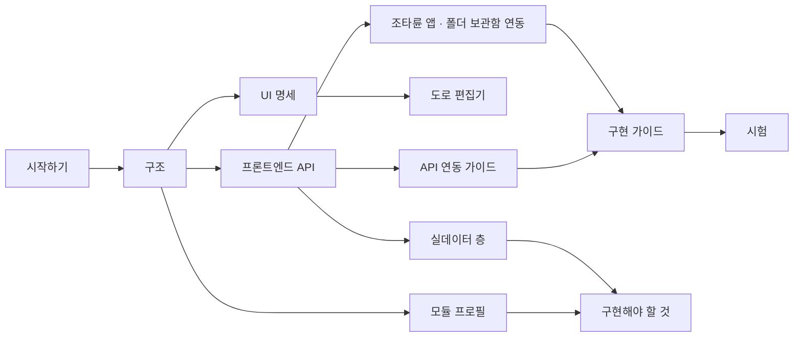

# Terra 노드 GUI 개발 문서 MOC

이 프로젝트(`terra-node-gui`)는 디자인 캔버스의 **노드 화면**(시작 화면 · 육각 필드 맵 · 조타륜 · 노드 자원 · 연결 · 도로)과 편집기 보드를
그대로 돌리는 웹 프로젝트에, 실데이터로 옮기기 위한 **연동 층**(`src/api` · `src/model`), 예시 데이터를 지우는 **실데이터 층**(`src/data`),
변형별 **부트 프로필**(`src/boot`)과 이 문서들을 더한 것이다. GUI 원본 저장소 [`StellaxiaLab/maingui`](https://github.com/StellaxiaLab/maingui) `f24c3bc`(service 판)를 바탕으로 한 **module 변형**이다 — [[module-profile|모듈 프로필]].
디자인 원본의 예시 세계는 화면에 나오지 않는다 — 단독으로 돌리면 데이터가 없는 빈 세계다.

출하는 Terra 모듈 `lab.stellaxia.node-gui`의 웹 앱으로 한다. 노드에서 셸 Scene의 `terra.web/frame` 안에 뜨면 이 노드의
값(노드 · 부모 tree · 자원 · 알림 · 폴더 · 네트워크 · 설정)으로 채워진다 — [[real-data-layer|실데이터 층]] · [[architecture#7. Terra 안에서 — frame|구조 §7]].

## 읽는 순서

| 하려는 일 | 문서 |
| --- | --- |
| 띄워 보기 · 폴더 구조 · 다시 생성 | [[getting-started\|시작하기]] |
| 화면이 어떻게 돌아가는지 (런타임 · 구역 · 층 · 렌더 밖 루프) | [[architecture\|구조]] |
| Terra 안에서 — frame · 로그인 · 무엇이 실데이터인가 | [[architecture#7. Terra 안에서 — frame\|구조 §7]] · [[frontend-api\|프론트엔드 API]] §6.5 |
| 예시 데이터를 어떻게 지웠나 · 무엇을 어디서 읽나 · 무엇이 왜 비어 있나 | [[real-data-layer\|실데이터 층]] |
| 변형(demo · service · module) · 시작 화면 · LayoutStore · 원본(maingui)과 맞추기 | [[module-profile\|모듈 프로필]] |
| 자원 추가 · 수정 · 삭제 — 앱마다 실제 본문 · 지어내지 않기 · 상태 화면 · 모듈 GUI 창 | [[real-data-layer\|실데이터 층]] §2.4 · §2.5 |
| **남은 일** — 플랫폼 · 이 모듈 · GUI 원본 · 결정 | [[implementation-backlog\|구현해야 할 것]] |
| 도로 편집기 · 건물 타입 도로 | [[road-editor-spec\|도로 편집기]] |
| 화면 모양 · 동작 · 시간 | [[node-screen-ui-spec\|노드 화면 UI 명세]] |
| 화면 객체의 메서드 · 상태 · seam · 연동 층 API | [[frontend-api\|프론트엔드 API]] |
| 조타륜 앱 10개 · 폴더 보관함 · 메모장의 operation · 권한 · 응답 | [[helm-apps-integration\|조타륜 앱 · 폴더 보관함 연동]] |
| 세션 · 호출 규칙 · 맵 · 관리 노드 창 · 갱신 | [[node-screen-api-integration\|노드 화면 API 연동 가이드]] |
| 상태 필드의 출처 · 저장 위치 | [[node-screen-data-model\|노드 화면 데이터 모델]] |
| 실데이터로 옮기는 순서 · 기능 더하기 · 결정 필요 | [[implementation-guide\|구현 가이드]] |
| 이식 방식 · 성능 함정 | [[node-screen-code-structure\|코드 구조와 이식 가이드]] |
| 연기 시험 · 연동 시험 | [[testing\|시험]] |

## 폴더

| 폴더 | 문서 |
| --- | --- |
| `docs/` | 이 MOC · [[architecture\|구조]] |
| `docs/screens/` | [[node-screen-ui-spec\|UI 명세]] · [[road-editor-spec\|도로 편집기]] |
| `docs/api/` | [[frontend-api\|프론트엔드 API]] · [[helm-apps-integration\|조타륜 앱 연동]] · [[node-screen-api-integration\|API 연동 가이드]] · [[real-data-layer\|실데이터 층]] |
| `docs/data/` | [[node-screen-data-model\|데이터 모델]] |
| `docs/guides/` | [[getting-started\|시작하기]] · [[module-profile\|모듈 프로필]] · [[implementation-backlog\|구현해야 할 것]] · [[implementation-guide\|구현 가이드]] · [[node-screen-code-structure\|이식 가이드]] · [[testing\|시험]] |

## 화면과 원본

| 페이지 | 원본 (`design/`) | 화면 로직 |
| --- | --- | --- |
| `index.html` — 시작 화면 (앱 entry) | `Intro.dc.html` | `src/screens/index.js` + `src/data/intro-live.js` |
| `node.html` | `Artboard-qcfu.dc.html` | `src/screens/node.js` + `src/data/node-live.js` |
| `building.html` · `road.html` · `material.html` · `field.html` · `ground.html` | `BuildingEditor` · `RoadEditor` · `MaterialEditor` · `FieldEditor` · `GroundEditor` | `src/screens/*.js` |
| `network.html` · `settings.html` | `Network` · `Settings` | 〃 + `src/data/network-live.js` · `settings-live.js` |
| (만들지 않음) 디자인 노트 | `Components` · `Helm` · `HelmApps` | 원본만 `design/`에 — demo 변형에서 본다 |

## 바깥 문서 (Terra 저장소)

- [[docs/modules/terra-gui/design/unified-gui-ux/terra-gui-api-priority|GUI API 우선순위]] — operation 목록 · 등급의 원본
- [[docs/modules/terra-gui/design/unified-gui-ux/terra-gui-resource-inventory|GUI 자원 목록]] — 조타륜 앱의 자원 · 상태 · 권한 원본
- [[docs/modules/terra-gui/design/unified-gui-ux/terra-gui-session-model|세션 모델]]
- [[docs/reports/terra-node-gui-main-module-feasibility-2026-10-01|노드 GUI main 모듈 가능성 판정]] — 이 화면을 모듈로 내는 근거 · 플랫폼 공백 · 남은 결정
- [[docs/modules/terra-gui/design/terra-base-scene-branch-design|base Scene 분기 설계]] — base가 main을 고르는 규칙

## 바깥 문서 (modules 저장소)

- 모듈 README(`common/lab.stellaxia.node-gui/README.md`) — 모듈 모양 · 빌드 · 포장 · 검증 기록 · 결정 기본값
