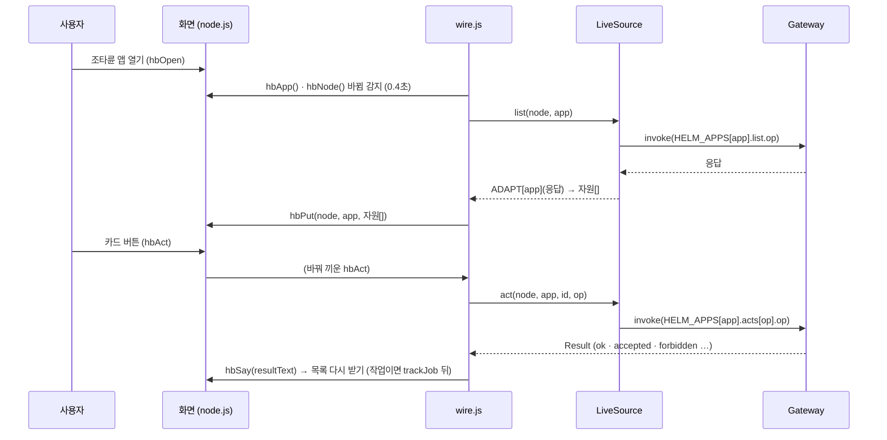
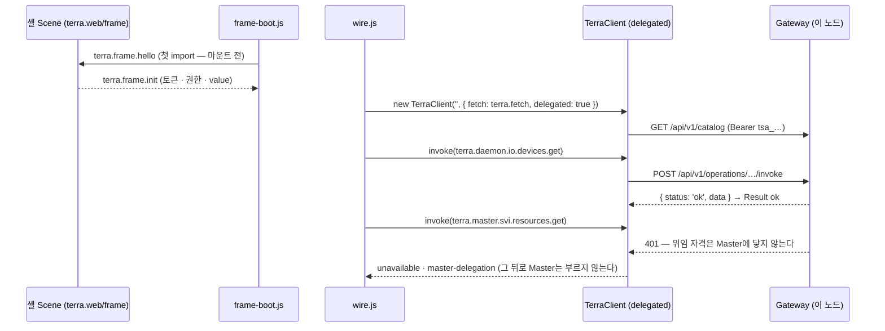

# 노드 화면 프론트엔드 API

이 문서의 "API"는 두 가지다.

1. **화면 API** — 노드 화면 객체(`src/screens/node.js`의 `Component`)가 내놓는 메서드와 상태. 화면 안의 버튼도, 연동 코드도, 시험 코드도 이것을 부른다.
2. **연동 층 API** — `src/api` · `src/model`. 화면과 Gateway 사이에서 호출 · 응답 변환 · 권한 · 배지를 맡는다.

Gateway 쪽 operation 목록과 세션 흐름은 [[node-screen-api-integration|API 연동 가이드]], 앱별 대응은 [[helm-apps-integration|조타륜 앱 · 폴더 보관함 연동]].

## 1. 화면 객체 얻기

```js
import { mount } from './src/runtime/dc.js';
import Screen from './src/screens/node.js';

const screen = mount(Screen, { template, target: document.getElementById('stage'), props: { skin: 'grass' } });
// node.html 은 window.__screen 에 넣어 둔다 — 개발자 도구 · 시험에서 바로 쓴다
window.__screen.goMap('nas-01');
```

| 규칙 | 이유 |
| --- | --- |
| 상태는 `screen.state`로 **읽기만**, 바꾸기는 메서드나 `setState` | `setState`가 다시 그리기를 건다 |
| `renderVals()`는 부르지 않는다 | 런타임이 부른다. 템플릿에 줄 값을 계산하는 곳일 뿐 |
| `_`로 시작하는 필드(`_hx` · `_mapGoal` …)는 내부 | 렌더 밖 루프의 상태 |
| 노드는 지금 **이름**이 키다 | 연동 때 id로 바꾼다([[node-screen-data-model\|데이터 모델]] §2.1) |

## 2. 상태 키

| 영역 | 키 | 모양 |
| --- | --- | --- |
| 맵 | `map` | 지금 맵의 주인 노드 이름 |
| | `maps` | `{ [노드]: 맵 스냅숏 }` 다녀온 맵 |
| | `nodes` · `fields` · `mat` · `placed` · `grounds` · `gmat` | 지금 맵의 칸 · 재질 · 건물 |
| | `looks` | `{ [노드]: { skin, bid, rot } }` 노드 모습(한 벌) |
| | `sel` | 고른 칸 `'c-r'` |
| | `editMode` · `view` | 편집 모드 · 확대/이동 |
| 세션 | `localNode` | `{ name, role, local: true }` 이 GUI가 도는 노드 |
| | `curTree` · `trees` · `shown` · `auth` · `login` | 로그인한 tree · 고를 수 있는 tree · 프사 |
| 조타륜 앱 | `hb` | 열린 앱 키(`svi` · `decl` · `grant` · `io` · `folder` · `xfer` · `tunnel` · `wg` · `job` · `mod`) 또는 `null` |
| | `hbd` | `{ ['노드\|앱']: 자원[] }` — 동작 · 연동이 넣은 목록. 없으면 `hbSeed` |
| | `io` | 로컬 노드 I/O 장치 원장 — 원본은 예시, 실데이터 층은 빈 목록으로 시작해 `io.devices.get` 으로 채운다 |
| | `hbMsg` · `hbBusy` · `hbArm` · `hbPath` | 글줄 · 도는 중인 카드 · 두 번 누르기 대기 · 공유 폴더 경로 |
| 전체 화면 | `fs` | 전체 화면 id(창 키 또는 `'hb:<앱>'`) 또는 `null` |
| | `fsHist` | 전체 화면으로 한 번 연 id들 — 전체 창 리스트 |
| | `fsList` | 리스트 펼침 |
| 폴더 보관함 | `fb` | `{ open, mode: 'repo'\|'local'\|'memo'\|null, path }` |
| | `fbMsg` · `fbArm` | 알림 띠 · 지우기 확인 대기 |
| 메모장 | `memos` | `Memo[]` (`{ id, parent, name, dir?, text?, size?, info? }`) |
| | `memoCur` · `memoDraft` · `memoNote` | 연 메모 id · 고치는 중인 `{ name, text, dir, dirty }` · 저장 알림 |
| 창 | `wins` · `winOpen` · `winZ` · `drawer` | 창 자리 · 열림 · 앞뒤 순서 · 서랍 |
| | `utilItems` | 유틸 서랍 칸 순서 |
| 알림 | `alarms` · `notif` | 알림 목록 · 기능별 안 읽은 수 |

모양의 정식 정의는 `src/model/types.js`(JSDoc), 출처는 [[node-screen-data-model|데이터 모델]].

## 3. 메서드 레퍼런스

표기: `→` 바뀌는 상태, **seam** = 연동 때 바꿔 끼우는 지점(§5).

### 3.1 맵

| 메서드 | 하는 일 |
| --- | --- |
| `goMap(name, note?)` | 그 노드의 맵으로 미끄러져 간다(아래로 · 위로 · 점프). 지금 맵을 `maps`에 저장. 전환 중(`mt`)이면 무시 → `map` · `maps` · 칸 상태 |
| `enterNode(nd)` | 노드 칸 두 번 누르기. tree면 로그인(`beginSwitch`) 뒤 그 맵, leaf면 바로 `goMap` |
| `onLocalMap()` | 지금(가는) 맵이 로컬 노드 맵인가 |
| `helmDest()` | 조타륜을 홀드해 내렸을 때 갈 곳 — 로컬이 아니면 `{ name: 로컬, local: true }`, 로컬이면 로컬의 부모 tree |
| `parentOfNode(name)` · `pathOf(name)` | 관계 — **seam**(`NET`) |
| `lookOf(name)` · `setLook(name, patch)` | 노드 모습 읽기 · 바꾸기 (부모 맵 · 자기 맵 · 프사가 함께 바뀐다) |
| `viewSet(V, commit)` · `zoomBy(f, px, py)` · `viewReset()` | 맵 보기 이동 · 확대 |

### 3.2 관리 노드 창 · 세션

| 메서드 | 하는 일 |
| --- | --- |
| `mgToggle(v?)` | 펼치기 · 접기 (클릭) |
| `tlOpen(mode)` · `tlClose(commit)` | tree 목록(나침반 부채) 열기 · 닫기 (Ctrl · 프사 홀드) |
| `beginSwitch(tree)` | tree 전환 시작 — 저장된 로그인이면 바로, 아니면 로그인 창 |
| `startLogin(target, password, auto)` | **seam** — 지금은 가짜 성공/실패. `auth.credentials.post`로 바꾼다 |
| `flipTo(tree, dir, done)` | 프사 교체 애니메이션 |
| `hxAvatar()` | 프사를 지금 맵 쪽(로컬/tree)에 맞춘다 |

### 3.3 조타륜 앱 바

| 메서드 | 하는 일 |
| --- | --- |
| `hbOpen(app)` · `hbClose()` | 앱 바 열기 · 닫기 → `hb` |
| `hbNode()` | 바가 다루는 노드 = **지금(가는) 맵의 노드** |
| `hbApp()` | 지금 보이는 앱 (바 또는 앱 전체 화면) |
| `hbPerm(node)` | **seam** — `{ role, has[], why? }` 내 자리와 권한 |
| `HBAPP()` | 앱별 보여 줄 권한 칸 · 목록에 필요한 권한(`see`) |
| `hbSeed(node, app)` | **seam** — 원본은 예시 자원 목록(같은 노드면 늘 같은 목록). 실데이터 층은 늘 빈 목록 |
| `hbItems(node, app)` | 지금 목록 = `hbd['노드\|앱']` 또는 `hbSeed` |
| `hbPut(node, app, list)` | 목록 바꾸기 → `hbd` (로컬 I/O는 `io`) |
| `hbAct(app, id, op, node?)` | **seam** — 동작 하나. 0.35초 돌고 목록을 바꾼 뒤 `hbSay`. `node`를 주면 그 노드의 자원(상태 화면은 지금 맵이 아닌 노드도 다룬다) |
| `HBCRUD()` · `hbFields(app, item)` · `hbCan(app, node)` | 앱마다 추가 · 수정 폼의 칸 · 열쇠 칸(`key`) · 필요한 권한(`need`) · API 줄(`api`) · 원본의 지어 넣기(`make`) |
| `hbFormOpen(app, mode, id, node, where)` · `hbFormSet(k, v)` | 폼 열기(`mode` `add` · `edit`, `where` `fs` 앱 전체 화면 · `rst` 상태 화면) · 칸 바꾸기 → `hbForm` |
| `hbFormSave()` | **seam** — 폼 저장. 원본은 자기 목록에 항목을 지어 넣는다 |
| `hbDel(app, id, node)` | **seam** — 두 번 누르는 삭제(첫 누름 `hbArm = 'del:'+id`). 두 번째에 목록 · 맵 자리 · 연결을 걷는다 |
| `rstOpen(spec)` · `rstVals()` | 상태 화면(창 `rst`) — `{ kind: 'res', node, app, id }` · `{ kind: 'node', key }` · `{ kind: 'road', key }` |
| `mguiOpen(node, id)` · `mguiVals()` | 모듈 GUI 창(창 `mgui`) |
| `hbSay(text, color)` | 바 왼쪽 글줄에 2.6초 |
| `hbVals(app?)` | 바 · 앱 전체 화면이 그리는 값(카드 · 권한 칸 · 머리 버튼) |

`hbAct`의 `op` (앱별):

| 앱 | op |
| --- | --- |
| `svi` | `open` · `close` |
| `decl` | `add` · `undeclare` · `redeclare` · `forget` |
| `grant` | `add` · `revoke` · `unbind` |
| `io` | `approve` · `deny` · `enable` · `disable` · `forget` · `scan` |
| `folder` | `open`(폴더로 들어가기 — 화면만) · `get` · `del` · `mkdir` |
| `xfer` | `push` · `abort` · `resume` · `clear` |
| `tunnel` | `open` · `close` · `del` |
| `wg` | `sync` · `revoke`(두 번) |
| `job` | `run` · `rerun` · `cancel` · `out` |
| `mod` | `start` · `stop` · `restart` · `log` · `check` |

카드 하나의 값(`hbVals().cards[i]`): `id · name · sub · icon · chip · cbg · cfg · meta · prog · acts[] · busy · op · bstyle · bline · bg · raw`. 동작 버튼(`acts[i]`): `label · tip · go · bg · fg · line` — 잠긴 버튼은 `label`이 `🔒 …`, `go`는 이유를 글줄에 띄운다.

### 3.4 전체 화면 · 전체 창 리스트

| 메서드 | 하는 일 |
| --- | --- |
| `fsEnter(id)` | 창 키 또는 `'hb:<앱>'`을 전체 화면으로. 닫혀 있던 창은 연다. `fsHist`에 더한다 → `fs` · `fsHist` |
| `fsExit()` | 맵 화면으로 (파인 곳 · Esc · ⛶). 리스트에 보관된 창은 맵에서 **사라진 채** 남는다 |
| `fsDrop(id)` | 리스트에서 빼기 — 창이면 닫는다 |
| `fsName(id)` | 표시 이름 |
| `FS_TOP` | 전체 화면 위 끝(필드 y 56) |

### 3.5 폴더 보관함 · 메모장

| 메서드 | 하는 일 |
| --- | --- |
| `fbToggle(mode?)` | 사이드 바 열기 · 닫기. `mode`를 주면 그 바로가기로 바로 → `fb` |
| `FBMODES()` | 바로가기 셋 정의(이름 · 루트 · 읽기 전용 여부 · OS 경로) |
| `FBDATA()` | **seam** — 저장소 · 탐색기 트리. 원본은 예시, 실데이터 층은 공유 폴더(`io.terra.file`) · 탐색기는 로컬 최상위 루트(`local-fs`) |
| `fbList(mode)` | 그 모드의 항목들 (메모장은 `memos`) |
| `fbOpenItem(entry)` | 폴더면 들어가기, 읽기 전용 파일이면 로컬 프로그램으로 열기(**seam**), 메모면 메모장 칸 |
| `fbApp(name)` | 확장자 → 로컬 기본 프로그램 이름 |
| `fbOS()` | 지금 폴더를 OS 파일 관리자로 (**seam** — 실데이터 층은 `desktop.open {action: reveal}`, 그 컴퓨터에서 볼 때만) |
| `memoNew(dir?)` · `memoOpen(id)` | 메모장 칸 열기 (새 메모 · 그 메모) |
| `memoSave()` | 이름 · 본문 저장(같은 이름이면 막음) → `memos` (**seam**) |
| `memoDel(id)` | 두 번 눌러 지우기(폴더면 안까지) (**seam**) |
| `memoMkdir()` | 지금 폴더에 새 폴더 (**seam**) |

### 3.6 창 · 서랍 · 알림

| 메서드 | 하는 일 |
| --- | --- |
| `WDEF()` | 창 정의 `{ [키]: { title, emoji, color, pa, pb, ink, href? } }` — `href`가 있으면 전체 화면에서 그 보드를 통째로 띄운다 |
| `openWin(id, x, y)` · `winFront(id)` | 열기 · 앞으로 |
| `storeWin(id, instant?)` · `closeWin(id)` | 서랍에 넣기 · 닫기 (전체 화면이면 끝낸다) |
| `pushAlarm(glyph, color, text)` | 알림 하나 더하기 — 작업 추적 · SSE가 부른다 |
| `udOpen()` · `udClose()` | 유틸 서랍 |

## 4. 화면 → 연동 흐름



## 5. 연동 지점 (seam)

화면 코드를 고치지 않고 아래 메서드를 바꿔 끼우면 실데이터로 돈다. 실데이터 층(`src/data/node-live.js`의 `realNode`)이 클래스로 이어받아
바꾸고, `src/api/wire.js`의 `wireHelm`이 연결 동안 조타륜 앱의 seam을 바꿔 낀다 — [[real-data-layer|실데이터 층]].

| seam | 원본 | 실데이터 층 | 자리 |
| --- | --- | --- | --- |
| `hbSeed(node, app)` | 예시 목록 | 빈 목록 | `realNode` ✅ |
| `hbItems` · `hbPut` | `hbd` 저장소 | 그대로 — 받은 목록을 `hbPut`으로 넣는다 | `wireHelm` ✅ |
| `hbAct(app, id, op, node?)` | 예시로 목록을 바꿈 | 연결 전: "로그인해야 쓸 수 있다" · 연결 뒤: `source.act` → 글줄 → (작업이면 끝날 때까지) → 다시 받기. 값을 적어야 하는 동작(`acts.*.form`)은 앱 전체 화면의 폼을 연다 | `realNode` · `wireHelm` ✅ |
| `hbFormSave()` · `hbDel(app, id, node)` | 자기 목록에 지어 넣기 · 화면에서만 지우기 | 서버에 길이 없으면 폼 · 확인 대기를 열기 전에 말한다(`crudWhy`) · 연결 전 저장은 지어내지 않는다 · 연결 뒤: 값 다듬기 → `source.crud` → 받으면 목록 다시 받기(삭제는 그 뒤에 목록 · 맵 자리 걷기, 상태만 바뀌는 것은 남기기) | `realNode` · `wireHelm` ✅ |
| `HBCRUD()` · `rstVals()` · `mguiVals()` · `memoVals()` | 원본 설계의 API 글 · 예시 자리 표시자 · `auth` 없음 = 로그인됨 · "이 창 안에 뜬다" · `~/.terra/memos` | 실제 부르는 것(`CRUD_TEXT`, 없는 op 는 ⚠) · 중립 자리 표시자 · 이 화면의 세션 · 띄울 수 없다는 이유 · `메모/` | `realNode` ✅ |
| `hbTick()` | 전송 · 작업 진행 흉내 | 아무것도 안 한다 | `realNode` ✅ |
| `hbPerm(node)` | 예시 권한표 | 이 노드 = 토큰 권한(모듈 수명 · 작업 취소는 `node.control`), 다른 노드 = 노드 주소 호출로 닿으면 같은 권한(`관리자 · 중계`) · `node_id`를 모르거나 길이 없으면 닿지 않음, 로그인 전 = 로그인 필요 | `realNode` ✅ |
| `NET` · `parentOfNode` | 예시 관계 | 이 노드 · 부모 tree · `GET /api/v1/agent/nodes` | `loadWorld` ✅ |
| `startLogin` | 가짜 성공/실패 | 부르지 않는다 — **frame 안에서는 셸이 로그인한다**(§6.5) | — |
| `beginSwitch(pick)` | tree 전환 연출 | 다른 tree로 가지 않고 글만 — 다른 tree의 게이트웨이에는 이 화면이 닿지 않는다 | `realNode` ✅ |
| `FBDATA()` · `fbList('repo')` · `fbList('local')` | 예시 트리 | `io.terra.file.roots.list` · `entries.list` · 탐색기 `terra.daemon.local-fs.roots.get` · `entries.get` | `realNode` · `loadFolder` · `loadLocalFolder` ✅ |
| `fbOpenItem` · `fbOS` | 안내 글만 | 폴더는 들어가 읽고, 파일은 그 노드의 로컬 프로그램으로 · 파일 관리자로(`desktop.open` — 그 컴퓨터에서 볼 때만) | `realNode` · `deskOpen` ✅ |
| `utilInfo()` · `renderVals()` | 예시 수치 · 창 요약 · 세션 띠 | 진짜 값(없으면 `—`) · `who` 바인딩 | `realNode` ✅ |
| `memoSave` · `memoDel` · `memoMkdir` · `memos` | 메모리 | LayoutStore(브라우저 + 사용자 문서) | `bindLayout` · `DocStore` ✅ |
| `pushAlarm` | 그대로 | 작업 추적 · 사용자 문서 겹침 알림에서 부른다 | `trackJob` · `DocStore.onNote` |
| `_onStore` | 편집기 자산 받기(`storage` 이벤트) | 그대로 + 사용자 문서 `assets` 가 더 새로우면 받아 부른다 | `pullAssets` ✅ |
| `hbShowOut` | 출력 칸 | 모듈 로그 · 작업 기록 | `wireHelm` · `outText` ✅ |

## 6. 연동 층 API (`src/api`)

### 6.1 `TerraClient` (`client.js`)

```js
import { TerraClient, resultText, openEvents } from './src/api/index.js';
import { applySignal } from './src/data/node-live.js';

// 주소 지정 — 시험 · 도구용. 쿠키(credentials: 'include')로 부른다. 화면은 frame 길만 쓴다
const client = new TerraClient('http://127.0.0.1:8787');
// Terra frame 안 — 앱 origin 이 곧 이 노드의 게이트웨이다. 스코프 토큰은 terra.fetch 가 붙인다(§6.5)
const framed = new TerraClient('', { fetch: terra.fetch.bind(terra), delegated: true });

await client.refreshCatalog();                              // 로그인 · 토큰이 바뀐 뒤마다
const r = await client.invoke('terra.daemon.io.devices.get', {});
if (r.kind === 'ok') use(r.data); else showReason(resultText(r));
// 실시간 이벤트 — src/api/events.js. 신호 → 그 목록만 다시 받는다(applySignal)
const stop = openEvents(framed, (ev) => applySignal(screen, framed, ev), { onState: (s) => console.log('events', s) });
// 다른 노드 — 노드 주소 호출 (관계도의 node_id)
const remote = await framed.invoke('terra.daemon.io.devices.get', {}, { node: 'node_…' });
```

| 메서드 | 하는 일 |
| --- | --- |
| `new TerraClient(base, { fetch, delegated })` | `fetch` — 부르는 함수(frame 안에서는 `terra.fetch`, 없으면 쿠키를 싣는 `fetch`). `delegated` — 자격이 **위임**(앱 스코프 토큰)이다: Master의 401을 "로그인 필요"가 아니라 `unavailable · master-delegation`으로 읽고 그 뒤로 Master operation을 다시 부르지 않는다 |
| `refreshCatalog()` | `GET /api/v1/catalog` → 부를 수 있는 operation 집합 |
| `has(id)` · `entry(id)` | 카탈로그에 있나 · 항목(확인 모드 · 위험) |
| `invoke(id, input?, { signal, node })` | `POST /api/v1/operations/{id}/invoke`. 봉투를 벗겨 `Result`로 — Daemon `{ status, data }` · Master `{ ok, data }` · 오류 `{ error: { code } }`의 `code`가 `reason`이 된다. `node`(node_id)를 주면 `invokeAt` |
| `invokeAt(nodeId, id, input?)` | 노드 주소 호출 `POST /api/v1/nodes/{node_id}/operations/{id}/invoke`(Terra B-1) — 그 노드 카탈로그에 없으면 `unavailable · not-remote`, `allowed: false` 면 `forbidden · remote-denied`, 길이 없으면 `unavailable · remote-node`. 대상의 봉투가 그대로 온다 |
| `nodeCatalog(nodeId)` · `nodeCatalogNow(nodeId)` · `canRelay()` | 그 노드가 클러스터에 연 operation(60초 캐시 · 받으면 `onNodeCatalog`) · 받아 둔 것 · 노드 주소 호출 길이 있나 |
| `invokeModuleAt(nodeId, id, input?, fallback?)` · `binding(id)` | 다른 노드의 **모듈** op — 원격 모듈 경로 `/api/nodes/{node_id}/modules/…`(카탈로그 `bindings` → `fillRoute`) · 그 op 의 `{ method, path }` |
| `get(path)` · `request(method, path, body?)` | 게이트웨이 자신의 **경로**로 — `/api/v1/agent/whoami`(invoke 로 부르면 호출자가 중계에서 빠져 `anonymous`가 온다 — 실측 · Terra#118) · `/api/v1/agent/nodes` · `/api/v1/me/documents/…` |
| `openEvents(client, onEvent, opts)` (`events.js`) | leaf `terra.daemon.events.get` SSE를 **fetch 스트림**으로 읽는다(`Accept: text/event-stream`) — `EventSource`는 Authorization을 붙이지 못한다. 끊기면 1→2→4…30초 뒤 `last_event_id`로 이어 받고, 길이 없으면 끈다. 끄는 함수를 돌려준다. `opts.op` · `opts.input`으로 다른 SSE op(SVI 핸들 흐름 이벤트 `terra.master.svi.handles.by-handle-id.events.get {handle_id}`)도 연다 — `opts.raw`면 `data`를 벗기지 않는다(StreamMessage) |

`Result.kind`: `ok` · `accepted`(작업 번호) · `needs-confirm` · `unauthenticated` · `forbidden` · `unsupported`(501) · `down`(503) · `unreachable` · `unavailable` · `error`. `unavailable`은 `reason`이 가른다 — `not-in-catalog` · `remote-node` · `no-node-id` · `not-remote` · `master-delegation` · `no-operation`. 화면 처리는 [[node-screen-api-integration|연동 가이드]] §2.3.

> [!NOTE] 확인 신호는 보내지 않는다
> 게이트웨이에는 `X-Terra-Confirm` 같은 확인 규약이 없다. 그래서 `needs-confirm`은 지금 만들어지지 않고,
> 되돌릴 수 없는 동작의 확인은 화면이 맡는다(두 번 누르기 — `hbArm`).

`trackJob(client, jobOp, job, onTick, key = 'job_id')` — 접수된 작업을 1초 → 최대 5초 간격으로 끝날 때까지 본다. Daemon 작업은 `TRACK.L`(`tasks.by-task-id.get` · `task_id`), Master 작업은 `TRACK.T`.

### 6.2 `HELM_APPS` · `FOLDER_STORAGE` · `SESSION` (`operations.js`)

화면 기능 ↔ operation 대응표. 앱 하나의 모양:

```js
HELM_APPS.io = {
  name: 'I/O 장치', see: 'node.read',
  list: { op: 'terra.daemon.io.devices.get', where: 'L', perm: 'node.read', resp: 'now' },
  extra: [ /* 카드에 더 필요한 목록 */ ],
  acts: { approve: { op: 'terra.daemon.io.devices.by-device-id.approve.post', where: 'L', perm: 'node.control', resp: 'now' }, … }
};
```

`where`: `L` leaf(Daemon) · `T` tree(Master) · `∀` Gateway 양쪽 · `M` 모듈 namespace. `verify: true`는 operationId 표기를 원본에서 확인하지 못한 것 — 카탈로그로 확인한다.

| 칸 | 뜻 |
| --- | --- |
| `in(id, item, ctx)` | 입력을 만든다. 없으면 op 이름의 `by-…` 자리만 채운다(`pathInput`) — 모듈 op · Daemon 본문 해석기는 모르는 키를 거절한다 |
| `none` | 부르지 않고 그 이유(`client.js` `REASON`)를 낸다 — 다시 실행처럼 화면이 아직 하지 않는 것 |
| `upload` · `download` · `resume` | `act`로 부르지 않는다(`no-upload` · `no-download`) — 파일을 고르거나 저장할 곳이 있어야 해서 `wire.js`가 맡는다: 올리기 = 파일 고르기 → `source.upload`, 받기 = `source.download` → 브라우저 저장, 이어서 = 멈춘 전송의 카드(올리기는 파일 고르기 → `upload {resume}` · 받기는 다시 받기) |
| `form` | 부르지 않고 앱 전체 화면의 추가(`add`) · 수정(`edit`) 폼을 연다 — `+ 선언` · `+ 허가` · `+ 즉석 열기`(`preset: { type: 'tun' }`) · `+ 실행` · `다시 선언` |
| `say(data, item)` | 성공 글줄을 응답으로 만든다(모듈 상태 확인 · 작업 보기 · 로그) |
| `local` | 이 노드에서 볼 때만 쓰는 대응 — 작업 앱은 Master 작업 대신 Daemon 작업(`tasks.*`) |
| `guard` | 목록을 부르기 전에 볼 상태 — WireGuard 가 꺼져 있으면 피어를 부르지 않는다 |

`HELM_CRUD[app]`은 추가(`create`) · 수정(`update`) · 삭제(`del`)의 실제 호출이다 — 앱마다 본문은 [[real-data-layer|실데이터 층]] §2.4의 표.

| 모양 | 뜻 |
| --- | --- |
| `{ op, where, body(v, item, ctx) }` | 한 번 부른다. `ctx = { path, nodeId, nodeIdOf }` |
| `{ where, steps(v, item, ctx) }` | 여러 번 차례로(장치 고치기 — 별명 · 승인 · 켜기 가운데 바뀐 것만). 하나가 실패하면 멈춘다 |
| `{ none }` · `{ screen: true }` · `keep` · `verb` · `scan` · `say(data, item)` · `id` | 부르지 않고 이유 · 서버에 지울 것이 없다(화면에서만) · 삭제해도 목록에 남는다 · 글줄 낱말 · 결과를 스캔 글줄로 · 성공 글줄(모듈 설정 저장 — revision · 재시작) · 바뀐 칸 id |
| `(v, item, ctx) => spec` | 값 · 항목에 따라 길이 다르다(파일/폴더 · 선언 · 즉석 터널 · 바인딩) |
| `null` | 서버에 길이 없다 — 화면은 지어내지 않는다. 이유 글은 `CRUD_TEXT[app]`의 ⚠ 줄 |
| `local` | 이 노드에서 볼 때의 대응(작업 — Daemon `commands.execute.post` · `tasks.by-task-id.cancel.post`) |

`CRUD_TEXT[app]` = `{ list, add, edit, del }` — 폼 · 상태 화면의 API 줄. `GUI_APPS.path` = `/api/v1/gui/apps`(공개 — 모듈 앱의 GUI 표시).

### 6.3 `ADAPT` (`adapters.js`)

`ADAPT[app](응답, ctx) → 화면 모양[]`. `ctx`는 `{ local, grants, bindings, declarations }`(앱의 `extra` 결과). 필드 이름은 실제 응답(Daemon local API · `io.terra.file` 계약)으로 맞췄다.
상태는 화면의 낱말로 옮긴다(`modState` · `jobState` · `xferState` · `tunnelState` · `sviState` · `declState`) — 화면의 상태 표(`ST`)에 없는 값이 오면 렌더 전체가 멈추기 때문이다.
`withGui(items, apps)` — 모듈 목록에 게이트웨이의 설치된 GUI 앱을 붙인다(`gui` · `ui` = 앱 `route` · `apps[]`). 앱 목록을 못 읽었으면 그대로 둔다.

### 6.4 데이터 소스 · 연결 (`source.js` · `wire.js`)

| 이름 | 하는 일 |
| --- | --- |
| `MockSource(screen)` | 화면의 `hbSeed` 그대로 (실데이터 층에서는 빈 목록) |
| `LiveSource(client, { localNode, localId, idOf, nameOf, parts })` | `list(node, app, { path })` · `act(node, app, id, op, item, { path })` · `crud(node, app, mode, vals, item, { path, nodeIdOf })` · `lockFor(app, op, node)`(누르기 전 자물쇠) · `upload(node, file, dir, onProgress, { resume })` · `download(node, id, onProgress, { old })`. 끊긴 뒤 이어서(MD-21): 올리기는 같은 자리 · 같은 파일의 멈춘 전송을 `resume_id`로 다시 열고(`stalledPush`), 받기는 `parts`(받기 조각 보관 — `src/store/parts.js`의 `openParts()`)에 둔 조각부터 받는다. 전송 앱 목록은 `markStalled`가 멈춘 전송을 `어긋남` 칸에 둔다. `modConfig(node, id)` — 모듈 설정 스키마 · 값 → 폼 모양(`cfgForm`) · 설정을 선언하지 않은 모듈이면 `cfg: null`. L · M op을 다른 노드에 부르면 노드 주소 호출(`idOf` — 관계도의 node_id, 모르면 `no-node-id`). T op은 읽기 · 지우기(GET · DELETE)만 `node_id`(진짜 id)를 query로 싣는다 — Master의 본문 해석기는 모르는 키를 거절한다. 폴더 앱은 경로 여럿(보고 있는 곳 + 설치한 칸들의 위 칸)까지 단계마다 항목을 읽는다(겹치는 단계는 한 번). 모듈 앱은 `/api/v1/gui/apps`로 GUI 표시를 붙인다. SVI 자원 앱은 허가 · 열린 핸들 · 바인딩을 함께 받아 흐름도(`flow`)를 채운다 — 상대 노드는 `nameOf`(node_id → 화면 이름)로 |
| `appFor(app, local)` · `pathInput(op, id, item)` | Daemon 쪽이면(이 노드 · 노드 주소 호출로 닿는 노드 — `source.daemonView`) `local` 대응으로 · op 이름의 `by-…` 자리만 입력으로 |
| `fillNode(input, node)` | 대응표 `input`의 `'<노드>'` 자리를 실제 노드 이름으로 채운다 — 자리 표시자가 `node_id`를 덮어쓰지 않게 |
| `wireHelm(screen, source, { pollMs, live })` | seam 바꿔 끼우기(`hbSeed` · `hbAct` · `hbFormSave` · `hbDel` · `hbOpLock`) · 올리기(파일 고르기) · 받기(`saveBlob`) · 멈춘 전송의 이어서 · 모듈 로그 · 작업 기록 → 출력 칸 · 실시간 신호(`_hbRefresh` — 받아 둔 목록만, `live()`면 폴링 여섯 배 느리게) · 앱/노드(폴더는 경로까지)가 바뀌면 받기 · 열려 있는 동안 `pollSec`(기본 10초) 폴링 · **맵에 설치한 노드 자원(`state.rsrc`) · 상태 화면이 보는 자원의 앱도 닫혀 있어도 같은 간격으로** 받기 · 볼 권한이 없으면 부르지 않기. **되돌리는 함수**를 돌려준다(바꿔 낀 seam을 원래대로, 받은 목록 · 폼은 비운다) |
| `formValues(screen, form, item)` | 폼 값 다듬기 — 원본 저장과 같은 규칙(글 앞뒤 빈칸 · 수 · 열쇠 칸이 비면 `{ err }`) |
| `wireFromUrl(screen)` | 부트 프로필 `boot('node')`가 부른다. frame 안(또는 시작 화면이 미리 읽은 보드 자리 — 시작 화면의 연결을 빌린다)이면 frame 토큰으로 위를 건다(§6.5): 카탈로그 → `loadWorld`(+ LayoutStore) → `wireHelm` → 알림 · 네트워크 폴링. 밖(단독 실행)에서는 데이터 없이 전체 화면 보드만 연다(`src`) |

### 6.5 Terra frame 안에서 (`frame-boot.js` · `frame-session.js` · `frame-boards.js`)

이 웹은 Terra 모듈 `lab.stellaxia.node-gui`의 앱으로 출하되고, 셸 Scene의 `terra.web/frame`이 감싼다.
구조와 이유는 [[architecture#7. Terra 안에서 — frame|구조 §7]].

| 이름 | 하는 일 |
| --- | --- |
| `role` · `frameRole(win?)` | `'frame'`(다른 origin의 부모 = Terra 셸) · `'board'`(같은 origin의 부모 = 시작 화면이 미리 읽은 노드 화면 · 노드 화면이 연 보드) · `'standalone'` |
| `frameReady` | frame이면 **첫 import에서** `connectTerra()`를 시작한 약속. init을 못 받으면 `null`로 풀린다(데이터 없이 연다). 보드 자리면 부모가 내놓은 약속(`window.__terraFrameReady`)을 빌린다 — `hello`는 한 번만 |
| `borrowFrame(win?)` | 같은 origin 부모의 `__terraFrameReady`(없으면 `null`) |
| `terra-frame-client.js` | Terra 웹 스캐폴드(`terra module new --web`)의 frame 클라이언트 **사본 그대로** — `token()` · `permissions()` · `session()` · `onToken()` · `onValue()` · `fetch()` · `emit()` |
| `wireFrameSession(screen, terra)` | 세션 띠 — 로그인 전 안내 + [로그인](`emit('login')`), 권한 없음, 로그인 뒤 principal + [로그아웃](`emit('logout')`) |
| `liveHub(win)` · `connectLive(onChange)` (`src/data/live-host.js`) | 노드 화면이 쥔 클라이언트를 같은 창의 보드(네트워크 · 설정)에 나눠 준다. 보드가 frame에 직접 열렸으면 스스로 토큰을 받는다 |
| `wireFrameBoards(screen, { direct? })` | 보드(편집기 · 네트워크 · 설정)를 **`srcdoc`**으로 연다 — 템플릿은 `src` 대신 `data-board`를 쓴다(막힐 탐색 · CSP 거절이 없다). `direct`(단독)면 `src`로. 보드 안의 링크를 가로채 `fsEnter` · `fsExit`로 바꾼다 |
| `realIntro(Screen)` · `bootIntro(screen)` · `watchMapFrame(screen)` (`src/data/intro-live.js`) | 시작 화면 — 비밀번호 없이 frame 세션을 보이고 [Terra 로그인] = `emit('login')`, 토큰이 있으면 내려간다. 미리 읽는 노드 화면 창(`[data-in-map]`)에 Terra 안은 srcdoc · 밖은 src — [[module-profile\|모듈 프로필]] §3 |
| `prep(name, Screen)` · `boot(name, screen)` (`src/boot/module.js`) | 부트 프로필 — 페이지가 마운트 전 · 후에 부른다 |
| `pageOf(href, base?)` | 보드 링크에서 페이지 이름(`building.html` …)을 꺼낸다 |



## 7. 모델 (`src/model`)

| 파일 | 내보내는 것 |
| --- | --- |
| `types.js` | JSDoc 타입 — `NetNode` · `NodePerm` · `Badge` · 앱별 자원(`SviResource` · `IoDevice` · `Transfer` · `Job` · `ModuleInfo` …) · `FolderEntry` · `Memo` |
| `permissions.js` | `nodePerm(node, ctx)` · `lockReason(perm, need, other)` · `sviOpenLock(r)` · `delegationLock(…)` · `PERM_LABEL` · `STAR` |
| `badges.js` | `badge(area, state)` · `ioBadge(d)` · `BADGE_COLORS` — 배지 다섯(정상 · 진행 중 · 꺼짐·대기 · 문제 · 끝남) |

```js
import { nodePerm, lockReason } from './src/model/permissions.js';
const perm = nodePerm('nas-01', { localNode: 'edge-01', whoami: ['node.read', 'file.read', 'file.write'], loggedIn: () => true, treeOf: (n) => screen.parentOfNode(n) });
lockReason(perm, ['node.control']);   // → 'node.control 권한 없음'
```

## 관련 문서

- [[docs/README|개발 문서 MOC]]
- [[architecture|구조]]
- [[helm-apps-integration|조타륜 앱 · 폴더 보관함 연동]]
- [[node-screen-api-integration|노드 화면 API 연동 가이드]]
- [[node-screen-data-model|노드 화면 데이터 모델]]
- [[implementation-guide|구현 가이드]]
- [[architecture#7. Terra 안에서 — frame|구조 §7 — Terra 안에서]]

## 관련 모듈

- `src/screens/node.js` · `src/api/*` · `src/data/*` · `src/model/*`
- `src/api/frame-boot.js` · `src/api/frame-session.js` · `src/api/frame-boards.js` · `src/api/terra-frame-client.js`
- Terra 모듈 `lab.stellaxia.node-gui` — 이 웹을 감싸는 셸 Scene (`common/lab.stellaxia.node-gui/scene/`)

## 관련 흐름

- §4 화면 → 연동 흐름 · §6.5 frame 안의 흐름 · [[node-screen-api-integration|연동 가이드]] §3 세션 · §5 갱신
