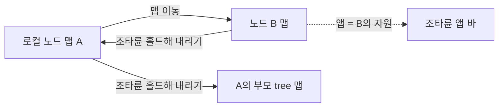

# 조타륜 앱 · 폴더 보관함 연동

조타륜 앱 10개와 오버헤드 패널의 폴더 보관함 · 메모장이 **어떤 데이터를 어디서 받고, 동작을 어디로 보내고, 권한을 어떻게 보는지**를 정한다.
코드로는 `src/api/operations.js`(대응표) · `src/api/adapters.js`(응답 변환) · `src/model/*`(권한 · 배지)에 같은 내용이 있다.

> [!IMPORTANT] ⚠ 표시
> 원본 문서에서 operationId 표기나 응답 필드를 확인하지 못한 것이다. 코드 세션은 `catalog.get`과 실제 응답으로 확인하고 `operations.js` · `adapters.js`를 고친다.
> 이 노드(leaf)에서 쓰는 것은 2026-10-03 진짜 스택의 카탈로그와 응답으로 확인했다 — 이 노드에서 무엇을 부르는지는 [[real-data-layer|실데이터 층]] §2.2가 기준이다.

## 1. 공통 규칙

### 1.1 대상 노드

조타륜 앱이 다루는 자원은 **지금(가는) 맵의 노드**의 것이다(`hbNode()`). 로컬 노드 A에서 노드 B의 맵으로 가면 앱은 B의 자원을 다룬다.

| 대상 | 부르는 길 |
| --- | --- |
| 로컬 노드 (A) | leaf Gateway에 그대로 (`terra.daemon.*`) |
| 다른 노드의 Daemon op (L) | **노드 주소 호출**(Terra B-1) — `client.invoke(op, input, { node: node_id })` → `POST /api/v1/nodes/{node_id}/operations/{id}/invoke`. Master가 중계하고 대상 Daemon이 자기 계약으로 다시 판정한다. 그 노드 카탈로그(`GET /api/v1/nodes/{node_id}/catalog`, 60초)에 있는 것만 부르고 누르기 전에 잠근다. 로컬 전용(명령 실행 · `local-fs` · `desktop.open` · 재시작 · 이벤트)은 그 카탈로그에 없다 — [[real-data-layer\|실데이터 층]] §2.7 |
| 다른 노드의 모듈 op (M) | `io.terra.file`은 scopes `local` · `node`라 그 노드 카탈로그에 없다 — **원격 모듈 경로** `/api/nodes/{node_id}/modules/io.terra.file/v1/…`(Master 중계)로 부른다. 경로는 카탈로그 `bindings`(없으면 대응표), `{transfer_id}`를 채우고 GET · DELETE 는 query(`client.invokeModuleAt` · `fillRoute`) |
| Master op (T) | tree Gateway에 `node_id`를 본문에 실어서. **Terra frame 안에서는 닿지 않는다** — 앱 스코프 토큰은 Master로 넘어가지 않아 `unavailable · master-delegation`이 된다([[architecture#7. Terra 안에서 — frame\|구조 §7]]) |

### 1.2 권한

| 층 | 무엇 | 어디서 |
| --- | --- | --- |
| 노드 권한 | `node.read` · `node.control` · `node.config`★ · `process.execute` · `process.cancel`★ · `file.read` · `file.write` · `module.manage`★ | `agent.whoami.get`의 permissions + 노드를 관리하는 tree에 로그인했는지 |
| SVI 자원별 허가 | 자원 하나에 `read` · `subscribe` · `write` | `terra.master.svi.grants.get` — **핸들 라우트는 `node.read`지만 진짜 문은 허가** |
| 그 밖의 잠금 | 설정 파일 선언 · io 백엔드 없음 · 위임 필요(직계 자식만) | 화면 규칙 (`src/model/permissions.js`) |

- 잠긴 동작은 **숨기지 않는다** — 🔒 + 이유(`lockReason`). 바 머리 칸에 내 자리(소유자 · 관리자 · 읽기 전용 · 권한 없음)와 앱에 필요한 권한 칸(✓ · 🔒).
- 목록을 볼 권한(`see`)이 없으면 카드 대신 "볼 권한이 없다 — ○○ 필요 · △△ 로그인 필요".
- 응답이 403이면 권한 칸을 다시 계산한다(서버가 더 정확하다).

### 1.3 응답 → 화면

| Result | 바 글줄 | 카드 |
| --- | --- | --- |
| `ok` | "완료" (동작별 문구) | 목록 다시 받기 |
| `accepted` | "접수됨 — 진행 중" | 그 카드에 도는 표시 → `trackJob` 끝나면 다시 받기 · `pushAlarm` |
| `forbidden` | "권한 없음" | 권한 칸 다시 계산 |
| `unsupported` (501) | "이 노드는 지원하지 않는다" | 빈 상태 (예: macOS 스캔, tree의 모듈 수명 제어) |
| `down` (503) | "지금은 볼 수 없다 (모듈 멈춤)" | 빈 상태 + 다시 시도 |
| `unreachable` | "노드에 닿지 않는다" | 마지막 목록을 흐리게 유지 |

배지는 다섯 색만 — `src/model/badges.js`의 `badge(area, state)`.

### 1.4 갱신

| 상황 | 방식 |
| --- | --- |
| 앱 · 대상 노드가 바뀜 | 바로 받기 (`wireHelm`이 0.4초마다 살핀다) |
| 바 · 앱 전체 화면이 열려 있음 | 10초 폴링 — 실시간 이벤트가 열려 있으면 60초(바닥) |
| 동작 뒤 | 바로 다시 받기, 작업이면 끝난 뒤 |
| leaf 자신 | `terra.daemon.events.get` SSE(invoke + `Accept: text/event-stream`)의 신호가 오면 받아 둔 그 앱 목록만 다시 받기(`src/api/events.js` `SIGNAL_APPS` · `_hbRefresh`) |
| 맵 전환 중 | 받은 목록을 넣어도 된다 — 바는 노드별(`'노드\|앱'`)로 저장한다 |

## 2. 앱별 대응

`L` leaf · `T` tree · `∀` 양쪽 · `M` 모듈 namespace. 권한 ★ = 기본 권한 밖.

### 2.1 SVI 자원 (`svi`)

| | operation | 권한 |
| --- | --- | --- |
| 목록 | `terra.master.svi.resources.get` (T, `node_id` 필터) + 허가 `svi.grants.get` + 열린 핸들 `svi.handles.get` + 바인딩 `svi.bindings.get` | `node.read` |
| 열기 | `terra.master.svi.handles.post` (T, 작업) | 자원별 허가 `read` · io.* 는 잠금(백엔드 없음) |
| 닫기 | `terra.master.svi.handles.by-handle-id.delete` | `node.read` |
| 흐름 이벤트 | `…handles.by-handle-id.events.get` — invoke + `Accept: text/event-stream` · `event: status \| frame`(StreamMessage) | `node.read` |
| 흐름(데이터) | `…handles.by-handle-id.stream.get` — Gateway invoke로 닿지 않는다 → 직접 WebSocket | |

창은 **흐름도**다(maingui A-28 · 모듈 MD-23) — 제공 노드 → 자원 → 엔드포인트 → 쓰는 쪽(열린 핸들 · 바인딩 · 허가), 흐르는 핸들 · 바인딩은 선이 움직인다.
머리 단추로 카드 보기와 바꾼다. 자원을 누르면 오른쪽에 자세히 · 동작 · 흐름 이벤트(`state.sviEv` — 고른 자원의 열린 핸들 SSE). 상태 화면에도 자원 하나의 흐름도.
흐름도의 모양은 `ADAPT.svi` 의 `flow { eps, handles, binds, grants }` 다 — 늘 채운다(없으면 화면이 카메라에 `frames` · `snapshot` 엔드포인트를 지어낸다).

카드: 이름(`display_name`) · `kind · endpoint · direction · interaction` · 배지(`status`) · 한 줄 "허가 · read · subscribe" / "🔒 허가 없음".

> [!NOTE] 앱 토큰으로는 빈 흐름도
> 이 앱의 op 는 모두 Master 의 것이라 이 모듈의 앱 토큰에는 보이지 않는다(PF-1). 흐름도는 비어 있고, 머리 줄에 `쓸 수 없다 · 이 노드의 게이트웨이에 없다` 가 남는다.
> 디자인의 예시 흐름 이벤트(0.5초 박자)는 돌리지 않는다 — [[real-data-layer|실데이터 층]] §5.6.

### 2.2 자원 선언 (`decl`)

| | operation | 권한 |
| --- | --- | --- |
| 목록 | `terra.daemon.svi.declarations.get` (L) — 선언 · 퇴역 원장 · 울타리 요약 | `node.read` |
| + 선언 | `svi.declarations.post` | `node.config`★ |
| 철회 | `svi.declarations.by-family.by-name.undeclare.post` | `node.config`★ |
| 다시 선언 · 잊기 | `svi.declarations.post {reuse_name}` · `…retired.by-family.by-name.forget.post` | `node.config`★ |

설정 파일 출처(`origin: file`)는 잠금 "파일 편집으로만". 일괄 적용(`apply`)은 하나라도 `refused`면 아무것도 안 바뀐다 — `dry_run`으로 먼저 보여 준다.

### 2.3 허가 · 연결 (`grant`)

| | operation | 권한 |
| --- | --- | --- |
| 목록 | `terra.master.svi.grants.get` + `svi.bindings.get` (T) | `node.read` |
| + 허가 · 철회 | `svi.grants.post` · `svi.grants.by-grant-id.delete` | `node.control` (자원 소유자 · 관리자) |
| 바인딩 끊기 | `svi.bindings.by-binding-id.delete` | `node.read` |

만료된 허가는 지워지지 않고 조회에서 걸러진다 → "끝남" 점선 카드.
답 모양 — 허가 `{items[{grant_id, subject{type, id}, resource_id, operations, expires_at?}]}`(기한이 없으면 `expires_at` 이 없다 → `기한 없음`),
바인딩 `{items[{binding_id, source{resource_id, endpoint_id}, target{resource_id}, source_node_id, target_node_id, desired_state, observed_state}]}` — 상태는 `active` 아니면 `failed`(이유: 원하는 상태와 지금 상태).

### 2.4 I/O 장치 (`io`)

| | operation | 권한 |
| --- | --- | --- |
| 목록 | `terra.daemon.io.devices.get` (L) | `node.read` |
| 승인 · 거부 · 켜기 · 끄기 · 잊기 | `io.devices.by-device-id.{approve,deny,enable,disable,forget}.post` | `node.control` |
| 스캔 | `io.scan.post` → `{added, updated, missing}` | `node.control` · macOS 501 |
| 손 등록(`＋ 추가` — 이름 · 주소) | `io.devices.post {kind: camera, name, adapter_id, address}` — `rtsp` · `rtsps` → `manual.rtsp`, `http` · `https` → `manual.http-camera`(io-inventory 0.2.0 수동 원천). 주소를 비우면 스캔 | `node.control` |

배지 = presence × approval × enabled 합치기(`ioBadge`). 승인은 켜지 않는다(두 단계).

### 2.5 공유 폴더 (`folder`) · 파일 전송 (`xfer`)

| | operation | 권한 |
| --- | --- | --- |
| 루트 · 항목 | `terra.daemon.files.list.get` (L) · 들어가면 `io.terra.file.entries.list` (M) | `file.read` |
| 받기 | `io.terra.file.transfers.pulls.create {root, path}` → `transfers.chunks.get {transfer_id, offset}`(eof까지 · 조각마다 SHA-256) → 전체 SHA-256 → `transfers.pulls.complete` → 브라우저 저장. 어긋나면 `transfers.pulls.abort` — 모듈이 지었다(`source.download`). 받은 조각은 이 브라우저 IndexedDB에 두어 다시 받으면 거기서부터(SHA-256 · 크기가 같을 때) | `file.read` |
| 지우기 · 새 폴더 | `entries.remove` · `entries.mkdir` (M ⚠) | `file.write` — 모듈 op가 계약에 선언한다(io.terra.file 0.2.0) |
| 전송 목록 · 올리기 | `transfers.list` · `transfers.create {push}` → `transfers.chunks.put`(409면 서버 `offset`부터) → `transfers.complete` | `file.read` / `file.write` |
| 중단 | `transfers.abort {keep_partial: true}` — 부분 파일 · 기록을 남긴다(io.terra.file 0.2.1부터 — 0.2.0은 invoke 본문의 `keep_partial`을 듣지 않아 늘 포기) | `file.write` |
| 이어서 | 멈춘 전송(보내던 · 받던 화면이 닫혔다)의 카드. 올리기 — 파일 고르기 → 크기 · SHA-256이 같으면 `transfers.create {…, resume_id}` → 서버 `offset`부터. 받기 — 다시 받기(이 브라우저에 둔 조각부터) · 멈춘 받기는 `transfers.pulls.abort` | `file.write` / `file.read` |
| 치우기 · 삭제 | 중단해 둔 것 — `transfers.abort {keep_partial: false}`(부분 파일도 지운다). 도는 것의 삭제도 같다(포기) | `file.write` |

완료된 전송은 서버에서 지워진다 — 목록에 남는 것은 도는 것 · 멈춘 것 · 중단해 둔 것뿐이다.
같은 파일을 같은 자리에 다시 `↑ 올리기` 하면 카드를 누르지 않아도 멈춘 · 중단해 둔 전송을 잇는다 — 부분 파일 때문에 새로 만들기가 `FILE_TARGET_EXISTS`가 될 때 전송 목록에서 찾는다.
멈춘 전송은 디자인에 칸이 없어 `어긋남` 칸에 이유 줄과 함께 둔다(구현해야 할 것 UP-22).

### 2.6 서비스 터널 (`tunnel`)

| | operation | 권한 |
| --- | --- | --- |
| 터널 · 선언 | `terra.daemon.service-tunnels.get` (L) + `terra.master.service-tunnels.declarations.get` (T) | `node.read` |
| 즉석 열기 | `terra.master.service-tunnels.open.post` (작업, 저장 안 됨) | `node.control` |
| 닫기 · 선언 지우기 | `service-tunnels.by-tunnel-id.close.post` (L) · `declarations.by-declaration-id.delete` (T) | `node.control` |

선언은 고치는 API가 없다 — 지우고 다시 만든다. plan · open 응답의 티켓 · TURN 자격은 화면에 보이지 않는다.

### 2.7 WireGuard 피어 (`wg`)

| | operation | 권한 |
| --- | --- | --- |
| 피어 · 상태 | `terra.daemon.wireguard.peers.get` · `wireguard.status.get` (L) | `node.read` |
| 동기화 | `wireguard.sync.post` (작업) | `node.control` |
| 회수 | `terra.master.network.mesh.wireguard.peers.revoke.post` (T) — **두 번 눌러야** | `node.control` |

"계획(plan)"은 되돌릴 수 없는 쓰기라 바에 두지 않는다(네트워크 화면 몫).

### 2.8 명령 · 작업 (`job`)

| | operation | 권한 |
| --- | --- | --- |
| 목록 · 출력 | `terra.master.jobs.get` · `jobs.by-job-id.get` (T ⚠) / **이 노드 자신은 `terra.daemon.tasks.get` · `tasks.by-task-id.get`**(대응표 `local`) — 종류(type)와 상태만 온다. 명령 · 출력은 오지 않는다 | `node.read` |
| 실행 · 다시 | `terra.master.commands.post {type: process.execute.request}` (작업) | `process.execute` + **직계 자식만**(아니면 `DELEGATION_REQUIRED`) |
| 취소 | `commands.post {type: process.cancel.request}` / 이 노드 자신은 `terra.daemon.tasks.by-task-id.cancel.post` | + `process.cancel`★ / `node.control` |

이 노드에는 `terra.daemon.commands.execute.post`(`process.execute`)도 있지만, 명령을 적을 칸이 화면에 없어 실행 · 다시는 부르지 않는다(`none: 'no-command'`).

Master는 canceled · timed_out을 `failed`로 접는다 — 이유는 `result.state` · `exit_code`. 출력은 폴링(64 KiB).

### 2.9 모듈 (`mod`)

| | operation | 권한 |
| --- | --- | --- |
| 목록 | `terra.daemon.modules.get` (L) · tree에서 볼 때 `terra.master.nodes.by-node-id.modules.get` | `node.read` |
| 시작 · 멈춤 · 재시작 | **이 노드는 `terra.daemon.modules.by-module-id.{start,stop,restart}.post`**(`node.control`, 작업으로 접수 → `tasks.by-task-id.get`으로 끝까지 본다). 게이트웨이 쪽 이름은 `terra.gateway.modules.by-id.{start,stop}.post` — 재시작이 없다 | `node.control` |
| 로그 | 이 노드 `terra.gateway.modules.by-id.logs.get { logs: [글] }` · 다른 노드 `terra.daemon.modules.by-module-id.logs.get { lines: [{at, stream, text}] }`(노드 주소 호출) → 상태 화면의 출력 칸. 예전 leaf 게이트웨이의 500 `MODULE_MANAGEMENT_FAILED`는 Terra G0~G6(B-14)에서 풀렸다 | `node.read` |
| 수정 = 설정 | `✎` → `terra.daemon.modules.by-module-id.config.schema.get` · `config.get`으로 칸 · 값(폼을 열기 전에) → 저장 `config.patch {values, unset, base_revision}` — 바뀐 키만. 거절은 키(`detail.keys`) · 409 겹침 · 설정을 선언하지 않은 모듈은 폼을 열지 않는다. 다른 노드는 노드 주소 호출(셋 다 scopes cluster) | 보기 `node.read` · 저장 `module.manage`★ |

자물쇠가 둘이다(Gateway `module.manage`★ / Daemon `node.control`). 이 노드의 모듈은 Daemon 길로 가므로 실데이터 층은 화면의 `모듈 관리★` 자물쇠를 `node.control`로 푼다.
설정 저장만은 Daemon도 `module.manage`★를 본다 — 그래서 저장할 수 있는지는 토큰이 실제로 쥔 권한으로 가린다(없으면 값은 볼 수만 있다 — [[implementation-backlog\|구현해야 할 것]] Q-16).

## 3. 새 앱을 더할 때

1. `RES`(조타륜 드럼)에 `{ name, sub, px }` · 픽셀 로고(`PX`) · 앱 로고(`HBICON().app`)
2. `HBAPP()`에 권한 칸 · `see`
3. `hbAct`에 `case '앱:op'` · `hbVals`에 카드 분기 (`hbSeed`의 예시 목록은 디자인 미리보기용 — 실데이터 층은 쓰지 않는다)
4. `src/api/operations.js`에 `list` · `acts` · `src/api/adapters.js`에 `ADAPT[앱]`
5. 이 문서 §2와 [[node-screen-ui-spec|UI 명세]] §5.3 표에 한 줄

자세한 순서는 [[implementation-guide|구현 가이드]] §4.

## 4. 폴더 보관함 · 메모장

### 4.1 바로가기 셋

| 바로가기 | 보이는 것 | 받는 곳 | 권한 |
| --- | --- | --- | --- |
| Terra 저장소 | Terra가 관리하는 폴더 — 공유 폴더(`storage.shared_dirs`) · 백업 · 모듈 데이터 | `terra.daemon.files.list.get` (루트 → 항목) | `file.read` · **읽기만** |
| 폴더 탐색기 | 권한 안의 로컬 최상위 루트(`/` — Linux 먼저, Windows는 드라이브 목록, macOS는 `/Volumes` 포함) | `terra.daemon.local-fs.roots.get` → `local-fs.entries.get {root, path?, limit}`(Terra B-11 · 로컬 전용). 루트는 Daemon 설정 `local_fs.roots` · 닫을 폴더는 `local_fs.deny` + Daemon 자기 폴더 | `file.read` · **읽기만** · 닫힌 폴더는 🔒 + 이유 |
| 메모장 | 메모 | LayoutStore — 이 브라우저 + 사용자 문서(`layout/<node_id>` — [[real-data-layer\|실데이터 층]] §2.8). 원본(maingui)은 `memos` 루트 · `share-0/memos/` 파일 | `file.read` · `file.write` |

### 4.2 로컬 프로그램 · OS 파일 관리자로 열기

읽기 전용 파일은 **로컬에서 지원하는 프로그램**으로 연다(Linux `xdg-open` · Windows 기본 앱 · macOS `open`). 폴더는 OS 파일 관리자로.
브라우저는 로컬 프로그램을 띄울 수 없으므로 Daemon이 연다 — `terra.daemon.desktop.open.post {root, path?, action: open | reveal}`(Terra B-12 · `node.control` · 로컬 전용).
`root`는 폴더 탐색기의 로컬 루트 이름, 공유 폴더는 `shared:<이름>`. 화면은 **그 컴퓨터에서 볼 때만**(앱 origin이 `*.localhost`) 부른다 — Daemon이 그 노드의 바탕화면에 연다.

| 답 | 화면 |
| --- | --- |
| 200 | `↗ 열었다` · `📂 파일 관리자로 열었다` |
| 409 `DESKTOP_OPEN_EXECUTABLE` | 실행 파일은 열지 않는다 — 파일 관리자로만 |
| 503 `DESKTOP_SESSION_UNAVAILABLE` · `DESKTOP_LAUNCHER_UNAVAILABLE` | 바탕화면 세션이 없다 · 여는 프로그램이 없다(서버 · 컨테이너) |

원격 노드의 파일은 먼저 받기(§2.5) 뒤 로컬에서 연다.

### 4.3 메모장 동작

| 동작 | 화면 | 연동 |
| --- | --- | --- |
| 탐색 | 사이드 바 메모장 (폴더 들어가기 · 경로 조각) | `entries.list` |
| 새 메모 · 고치기 | 메모장 기능칸(서브 창 `memo`) — 이름 · 본문 · 저장 | `entries.write` (전체 쓰기) · 이름 바꿈은 `entries.rename` |
| 지우기 | 두 번 눌러 확인 | `entries.remove` (폴더면 `recursive`) |
| 새 폴더 | `+ 폴더` | `entries.mkdir {parents}` |

같은 이름 저장은 화면이 막는다(서버 409 `FILE_TARGET_EXISTS`와 같은 규칙).

## 관련 문서

- [[docs/README|개발 문서 MOC]]
- [[frontend-api|프론트엔드 API]] — seam · 연동 층
- [[node-screen-api-integration|노드 화면 API 연동 가이드]] — 세션 · 호출 규칙 · 갱신
- [[node-screen-ui-spec|노드 화면 UI 명세]] — §5.3 앱 바 · §5.4 오버헤드 패널 · §5.5 전체 화면
- [[docs/modules/terra-gui/design/unified-gui-ux/terra-gui-resource-inventory|GUI 자원 목록]] — 원본

## 관련 모듈

- `src/api/operations.js` · `src/api/adapters.js` · `src/api/source.js` · `src/model/permissions.js` · `src/model/badges.js`
- `src/api/wire.js`(목록 받기 · 동작 · SVI 흐름 이벤트) · `src/api/events.js`(SSE — 노드 이벤트 · 핸들 흐름 이벤트)

## 관련 흐름

- 앱 바 · 앱 전체 화면을 연다 → `wireHelm` 이 그 앱의 목록을 받는다(받지 못하면 그 이유를 남긴다) → 카드 · 흐름도
- SVI 흐름도에서 자원을 고른다 → 열린 핸들의 흐름 이벤트 SSE → `state.sviEv` → 오른쪽 흐름 이벤트 칸([[real-data-layer|실데이터 층]] §5.6)
- 폼 저장 · 두 번째 누름 → `crud` → 서버 → 목록 다시 받기([[real-data-layer|실데이터 층]] §2.4)
