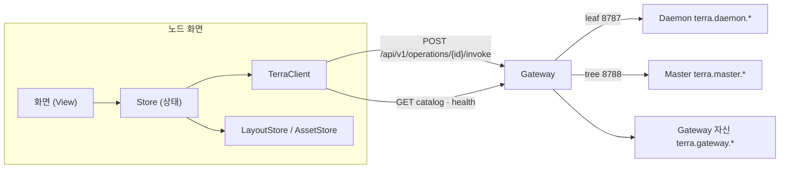
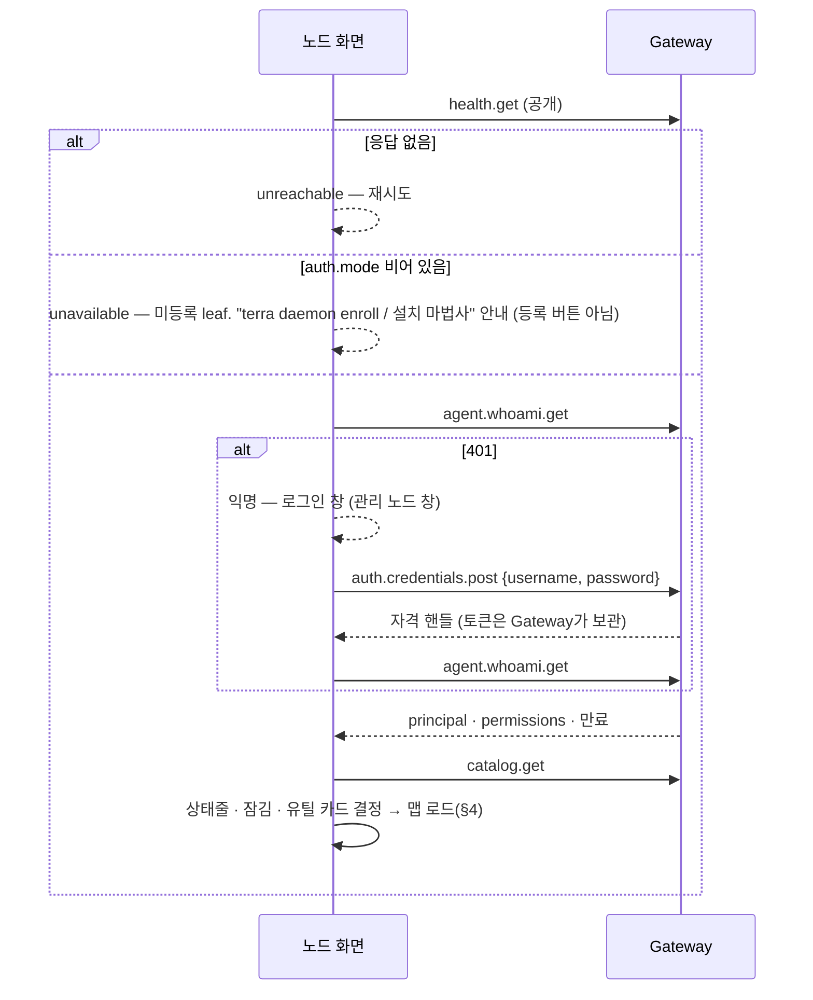
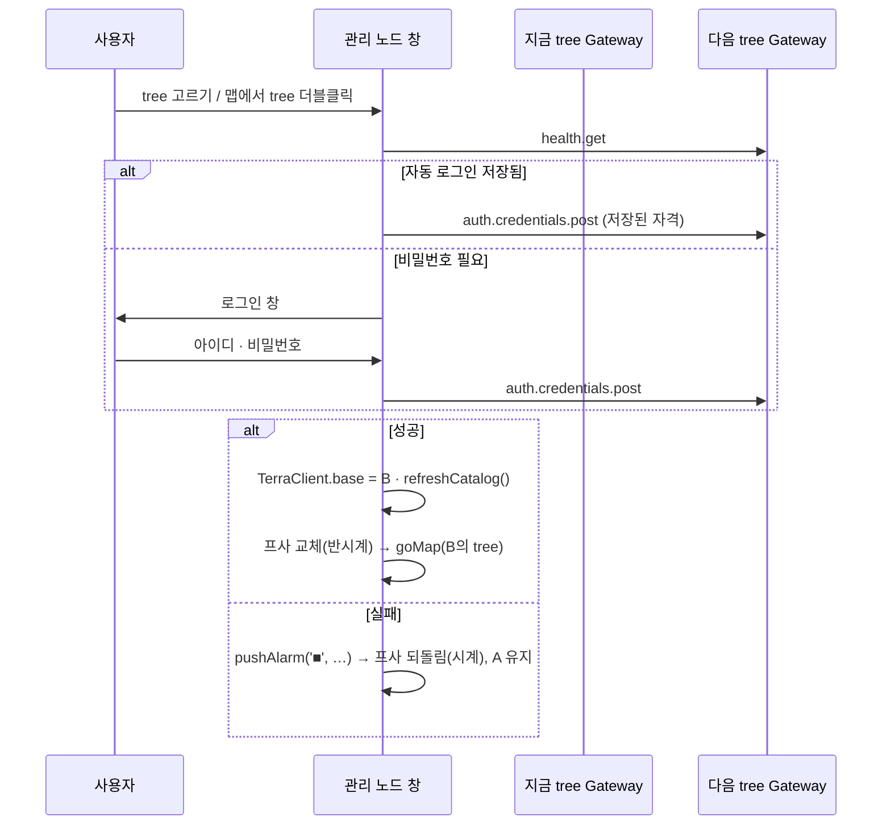

# 노드 화면 API 연동 가이드

노드 화면이 **데이터를 정상적으로 주고받으려면 어떻게 연결해야 하는가**를 정리한다.
operation 목록 · 등급의 원본은 [[docs/modules/terra-gui/design/unified-gui-ux/terra-gui-api-priority|GUI API 우선순위]]다.
이 문서는 그중 노드 화면이 쓰는 것만 골라 **화면 요소에 붙인다**.

> [!IMPORTANT] 확인이 필요한 부분은 표시했다
> ⚠ 표시는 이 문서가 소스에서 확인하지 못한 것이다(요청 본문 형식 · 자격 핸들 전달 방식 등).
> 코드 세션은 `products/common/packages/terra-scene-runtime/src/contract/gateway.ts`와 Gateway
> 소스를 먼저 읽고 채운다.

## 1. 연결 구조



- 화면 코드는 **HTTP를 직접 부르지 않는다.** 모든 호출은 `TerraClient` 한 곳을 지난다.
- 화면은 **operationId만 안다.** provider의 경로(`/api/v1/nodes` 등)는 적지 않는다.

## 2. 호출 경로

### 2.1 규칙

| 규칙 | 이유 |
| --- | --- |
| 호출은 `POST /api/v1/operations/{operationId}/invoke` 하나 | Gateway가 provider를 찾아 대신 부른다 |
| 부르기 전에 `catalog.get`에 그 id가 있는지 본다 | 카탈로그는 **역할(tree/leaf)과 호출자 권한으로 좁혀져** 온다. 없으면 버튼을 잠그거나 숨긴다 |
| leaf에서 `terra.master.*`, tree에서 `terra.daemon.*`는 부를 수 없다 | 카탈로그에 없다. leaf의 `/api/upstream/…` 패스스루는 operationId가 없어 쓰지 않는다 |
| 스트림은 leaf `terra.daemon.events.get`(SSE) 하나만 된다 | tree 실시간은 **폴링이 기본** |
| Scene으로 배포한다면 `requiredOperations`에는 `terra.gateway.*`만 | 제품별 op를 적으면 반대 제품에서 적합성 검사 실패 |

### 2.2 TerraClient 뼈대

> 이 프로젝트에는 JavaScript 판이 `src/api/client.js`로 들어 있다 — [[frontend-api|프론트엔드 API]] §6.1.

```ts
type OpId = string;                           // 예: 'terra.gateway.health.get'

class TerraClient {
  constructor(private base: string) {}        // 'http://127.0.0.1:8787' (leaf) · ':8788' (tree)
  private catalog = new Map<OpId, CatalogEntry>();

  async refreshCatalog() {                    // 로그인 · 로그아웃 · tree 전환 뒤마다
    const res = await fetch(`${this.base}/api/v1/catalog`, { credentials: 'include' });
    const body = await res.json();            // ⚠ 응답 형태 확인
    this.catalog = new Map(body.operations.map((o: CatalogEntry) => [o.id, o]));
  }
  has(id: OpId) { return this.catalog.has(id); }
  entry(id: OpId) { return this.catalog.get(id); }   // confirmationMode · 위험 · 응답 종류

  async invoke<T>(id: OpId, input?: unknown, opts: { confirm?: boolean; signal?: AbortSignal } = {}): Promise<Result<T>> {
    if (!this.has(id)) return { kind: 'unavailable', reason: 'not-in-catalog' };
    const res = await fetch(`${this.base}/api/v1/operations/${encodeURIComponent(id)}/invoke`, {
      method: 'POST',
      credentials: 'include',                 // ⚠ 자격 핸들 전달 방식(쿠키/헤더) 확인
      headers: { 'Content-Type': 'application/json' },
      body: JSON.stringify(input ?? {}),      // ⚠ 본문 봉투 형식 확인 (path 파라미터 · query · body 구분)
      signal: opts.signal,
    });
    return toResult<T>(res);                  // §2.3
  }
}
```

> [!NOTE] JS 판(`src/api/client.js`)이 이 뼈대와 다른 점 — 실제 게이트웨이에 대 보고 바꿨다 (2026-10-01)
> - **부르는 함수를 주입받는다** — `new TerraClient(base, { fetch, delegated })`. Terra frame 안에서는 `terra.fetch`가
>   스코프 토큰을 붙인다. 쿠키는 앱 origin을 지나지 않으므로 `credentials: 'include'`는 단독 실행에서만 쓴다.
> - **`confirm`이 없다** — 게이트웨이에 확인 신호의 규약이 없다. 되돌릴 수 없는 동작의 확인은 화면이 맡는다(두 번 누르기).
> - **봉투를 벗긴다** — Daemon `{ status, data }` · Master `{ ok, data }`. 오류 봉투의 `error.code`가 `reason`이 된다.
> - **`node`를 주면 부르지 않는다** — 다른 노드의 operation 경로가 없어 `unavailable · remote-node`.
> - 자세한 것은 [[frontend-api|프론트엔드 API]] §6.1 · §6.5.

### 2.3 응답을 화면 상태로 바꾸기

| HTTP / 상황 | `Result.kind` | 화면 |
| --- | --- | --- |
| 200 · 즉시 결과 | `ok` | 값 반영 |
| job/task 번호가 담긴 응답 ⚠ 상태 코드 확인 | `accepted` | 작업 링 시작(§5) — **접수를 완료로 그리지 않는다** |
| 401 | `unauthenticated` | 세션 재판정(§3) → 로그인 창 |
| 403 | `forbidden` | 잠김 부품(★ 권한 이름 표시) |
| 확인 요구 ⚠ 상태 코드 · 신호 형식 확인 | `needs-confirm` | 위험 확인 대화상자 → `confirm: true`로 재호출 |
| 501 | `unsupported` | 빈 상태 "이 노드는 지원하지 않음" (예: 파일 경계 없는 노드, tree Gateway의 모듈 수명 제어) |
| 503 | `down` | 빈 상태 "지금은 볼 수 없음" (예: 의존 모듈이 내려감) |
| 네트워크 실패 | `unreachable` | 상태줄 · 관리 노드 창 프사 회색, 재시도 backoff |
| 카탈로그에 없음 | `unavailable` | 호출하지 않고 숨김/잠김 |

frame 안(위임 자격)에서 Master operation이 401이면 `unauthenticated`가 아니라 `unavailable · master-delegation`이다 —
로그인으로 풀리는 문제가 아니므로 로그인 창으로 보내지 않는다. `needs-confirm`은 지금 만들어지지 않는다(§2.2 노트).

## 3. 세션 흐름



- 로그인 전에 부를 수 있는 것은 Gateway 공개 operation(`health` · `catalog` · `gui.apps` · `gui.scenes` 등)뿐이다.
  **로그인은 관문이 아니라 단계**다 — 익명에서도 화면은 선다.
- 로그아웃: `auth.credentials.delete` → 카탈로그 다시 받기 → 익명 상태로 그리기.
- 만료 시각은 `whoami`에서 받아 상태줄에 표시하고, 만료 직전에 재판정한다.
- 세션 상태의 정의는 [[docs/modules/terra-gui/design/unified-gui-ux/terra-gui-session-model|세션 모델]]을 따른다.

## 4. 화면 요소 ↔ operation 대응표

`∀` = Gateway(양쪽) · `T` = tree Gateway에서만 · `L` = leaf Gateway에서만. 접두사는 생략하지 않았다.

### 4.1 필드 · 맵

| 화면 요소 | 데이터 | operation | 어디 | 비고 |
| --- | --- | --- | :---: | --- |
| 맵의 노드(이름 · 역할) | `NET[*].role`, `kids` | `terra.master.nodes.get` | T | 부모 Tree로 `kids`를 역산. 필터·역할·capability 포함 |
| 〃 (제품 중립 대체) | 이름 · 상태만 | `terra.gateway.gui.remote.nodes.get` | ∀ | Master 연결 필요. 관계(부모)는 없다 → 평면 맵만 가능 |
| 노드 상세(속성 창) | 역할 · capability · 태그 | `terra.master.nodes.by-node-id.get` | T | |
| 노드 이름 · 부모 바꾸기 | | `terra.master.nodes.by-node-id.patch` | T | `node.control` |
| 노드 삭제 | | `terra.master.nodes.by-node-id.delete` | T | 계약상 write지만 **되돌릴 수 없다 → 반드시 확인** |
| leaf 맵의 "관리하는 자원" (tree에서 볼 때) | `res` | `terra.master.nodes.by-node-id.modules.get` | T | 모듈만 나온다 |
| leaf 맵의 자원 (leaf 자신) | `res` | `terra.daemon.capabilities.get` · `terra.daemon.modules.get` | L | 파일·장치는 P2(`files.list.get` · `io.*`, 모듈 의존 → 503 가능) |
| 새 노드(`pending`) | | `nodes.get` 결과 − 배치된 노드 | T | 계산 |
| 노드 모습 · 맵 배치 | `looks` · `maps` | **없음** | — | `LayoutStore` ([[node-screen-data-model#3. 저장 위치가 정해지지 않은 데이터\|데이터 모델 §3]]) |

### 4.2 관리 노드 창 · 상태줄

| 화면 요소 | operation | 어디 |
| --- | --- | :---: |
| 상태줄 사용자 · 만료 · 권한 | `terra.gateway.agent.whoami.get` | ∀ |
| 로그인 창 제출 | `terra.gateway.auth.credentials.post` | ∀ |
| 로그아웃 | `terra.gateway.auth.credentials.delete` | ∀ |
| 다른 tree의 응답 여부(프사 회색/오프라인) | 그 tree Gateway의 `terra.gateway.health.get` | ∀ |
| leaf 현재 장치 요약 | `terra.daemon.status.get` · `node.get` · `health.get` · `ready.get` · `enrollment.status.get` | L |

### 4.3 유틸 서랍 카드 → 창

| 카드 | 창 내용 | operation | 등급 |
| --- | --- | --- | :---: |
| ⚙️ 속성 | 선택 칸 · 노드 상세 | §4.1 | P1 |
| ✏️ 편집 | 편집 모드 · 건물 · 재질 · 필드 추가/삭제 · 새 노드 배치 | `LayoutStore` (노드 부모 변경 시 `nodes.by-node-id.patch`) | — |
| 🔔 알림 | 작업 완료/실패 · 이벤트 | §5 · leaf `terra.daemon.events.get` | P1 |
| 🔗 네트워크 | 터널 · WireGuard · 라우트 | `terra.master.service-tunnels.*` · `network.*` · `terra.daemon.wireguard.*` … | P2 |
| 🏗️ 🟩 🧱 편집기 3종 | 건물 · 필드 스킨 · 자재 | `AssetStore` | — |
| 🧩 모듈 | 목록 · 시작/정지 · 로그 | `terra.gateway.modules.*` (∀, 수명 제어 `module.manage`★, tree에선 501) · `terra.daemon.modules.*` (L, `node.control`) · `terra.gateway.gui.modules.get` | P1 |
| 👤 사용자 | 계정 · 권한 부여 | `terra.master.admin.*` (`master.admin`★) | P2 |
| (추가 예정) 실행 | 명령 실행 · 작업 목록 | `terra.master.commands.post` · `jobs.*` (T) / `terra.daemon.commands.execute.post` · `tasks.*` (L) | P1 |
| (추가 예정) 설정 | Daemon 설정 폼 | `terra.daemon.config.schema.get` → 자동 폼 → `validate` → `patch` → `save` → `apply` (쓰기 `node.config`★) | P1 |

- 카드는 **카탈로그에 해당 operation이 하나도 없으면 숨기고**, 있지만 권한이 없으면 잠김 부품을 단다.
- 모듈 수명 제어는 자물쇠가 둘이다(Gateway `module.manage`★ / Daemon `node.control`). 어느 경로를 쓸지는
  설계 결정 — leaf에서는 Daemon 경로가 기본 권한으로 열린다.

### 4.4 조타륜 앱 · 오버헤드 패널

조타륜 앱 10개(SVI 자원 · 자원 선언 · 허가·연결 · I/O 장치 · 공유 폴더 · 파일 전송 · 서비스 터널 · WireGuard 피어 · 명령·작업 · 모듈)와 폴더 보관함 · 메모장의 operation · 권한 · 응답 처리는
[[helm-apps-integration|조타륜 앱 · 폴더 보관함 연동]]에 따로 정리했다. 코드는 `src/api/operations.js`.

## 5. 갱신 — 폴링과 SSE

| 대상 | 방식 | 주기(권장 시작값) |
| --- | --- | --- |
| tree 노드 목록 | 폴링 `terra.master.nodes.get` | 10초, 창이 숨겨지면 멈춤 |
| tree 작업 | 폴링 `terra.master.jobs.by-job-id.get` | 접수 직후 1초 → 최대 5초 backoff |
| leaf 이벤트 | SSE — invoke를 `Accept: text/event-stream`으로 연다(`terra.daemon.events.get`) | 끊기면 1 → 2 → 4 … 30초 재연결 |
| leaf 작업 | SSE 이벤트 + 보조 폴링 `terra.daemon.tasks.by-task-id.get` | |
| 다른 tree 생존 | `health.get` | 관리 노드 창을 펼쳤을 때만 |

- tree 화면은 **폴링이 예외가 아니라 기본**이다. 마지막 성공 시각 · 다음 갱신 · backoff를 화면에 보여 준다.
- 맵 전환 애니메이션 중(`mt != null`)에 온 갱신은 **큐에 모았다가 전환이 끝난 뒤** 반영한다.
  전환 중 `nodes`가 바뀌면 남는 필드 계산이 어긋난다.

## 6. 위험 확인 · 작업 · 잠김 · 빈 상태

| 계약이 주는 것 | 화면 | 공통 부품(`Components.dc.html`) |
| --- | --- | --- |
| 카탈로그 `execution.confirmationMode` (`conditional` 등) | 호출 전 확인 대화상자 | 위험 확인 |
| 위험인데 확인 선언이 없는 8건(노드 삭제 · 모듈 rollback 등) | **화면이 직접 확인을 건다** | 위험 확인 |
| 응답이 job/task 번호 (`accepted-job`) | 접수 → 진행 → 완료/실패, 완료 시 `pushAlarm` | 작업 링 |
| 권한 ★ 없음 (403 또는 whoami permissions에 없음) | 버튼 잠김 + 필요한 권한 이름 | 잠김 |
| 503 · 501 · 연결 없음 · 빈 목록 | 이유를 적은 빈 상태 | 빈 상태 |
| `config.schema.get` · `catalog.operations.by-id.get`의 입력 스키마 | 폼 자동 생성 | 자동 폼 |

기본 권한(새 사용자): `node.read · node.control · process.execute · file.read · file.write · relay.use ·
module.publish · agent.use · agent.grant`. 그 밖(`node.config` · `module.manage` · `master.admin` …)은 ★ 잠김으로 시작한다.

## 7. tree 전환

프로토타입의 tree 전환(관리 노드 창 프사 교체)을 실제로 옮기면:



> [!WARNING] 결정 필요 — 다른 tree의 Gateway에 어떻게 닿는가
> 각 Gateway는 `127.0.0.1`(로컬)에서 연다. 다른 기계의 tree로 로그인하는 경로는 코어 목록에서 확인되지 않았다.
> 후보: ① 그 tree의 Gateway 주소를 사용자가 등록 ② `terra.gateway.gui.remote.*`(원격 노드 GUI, P2) 경유
> ③ 같은 기계의 여러 Gateway만 지원. **코드 세션 시작 전에 정한다.**
> 자동 로그인 저장(`auth: 'saved'`)의 보관 위치도 같은 결정에 묶인다(비밀번호를 화면이 저장하지 않는다).

## 8. 연동 순서 (체크리스트)

1. [x] `TerraClient` 뼈대 — `src/api/client.js` (`invoke` · `refreshCatalog` · `Result` 변환 · SSE · 작업 추적). ⚠ 표시는 Gateway 소스로 확인
1. [x] 조타륜 앱 연결 — `src/api/wire.js` · 이 노드에서 쓰는 대응표는 진짜 스택으로 확인([[real-data-layer|실데이터 층]] §2.2)
2. [x] 세션 흐름 · 상태줄 실데이터(§3) — "예시 데이터" 표식 제거. 로그인은 셸이 한다(frame)
3. [ ] `LayoutStore`(IndexedDB) — `looks` · `maps` 저장/복원
4. [~] tree 노드 목록 → `NET` — 이 노드 · 부모 tree · `GET /api/v1/agent/nodes`(평평한 목록). 계층 · 폴링은 Master 위임 뒤(§4.1 · §5)
5. [ ] 속성 창 노드 상세 · 이름/부모 수정 · 삭제(확인)
6. [x] 알림: Daemon 작업 폴링(10초) → 알림 목록. leaf 이벤트(`/events`)는 WebSocket 이라 frame 토큰으로 열 수 없다
7. [ ] 모듈 창 · 실행 창(작업 링) · 설정 창(자동 폼)
8. [ ] `AssetStore` — 편집기 3종 연결
9. [ ] tree 전환(§7 결정 후)

## 관련 문서

- [[docs/README|노드 화면 개발 문서 MOC]]
- [[node-screen-data-model|노드 화면 데이터 모델]]
- [[node-screen-ui-spec|노드 화면 UI 명세]]
- [[node-screen-code-structure|코드 구조와 이식 가이드]]
- [[docs/modules/terra-gui/design/unified-gui-ux/terra-gui-api-priority|GUI API 우선순위]] — §2 제약 · §4 우선순위 · §8 불일치
- [[docs/modules/terra-gui/design/unified-gui-ux/terra-gui-session-model|세션 모델]]
- [[docs/modules/terra-gui/design/unified-gui-ux/terra-gui-vocabulary-gaps|어휘 공백]]
- [[docs/implementation/local-gateway-single-entry-plan|로컬 Gateway 단일 진입점]]

## 관련 모듈

- `terra-scene-runtime` — `src/contract/gateway.ts` (invoke 계약)
- Gateway — `adapter.go`(route 게시) · `management.go`(`module.manage`) · `upstream.go`
- Master — `auth/service.go`(`DefaultPermissions`)

## 관련 흐름

- §3 세션 흐름 · §5 갱신 · §7 tree 전환
