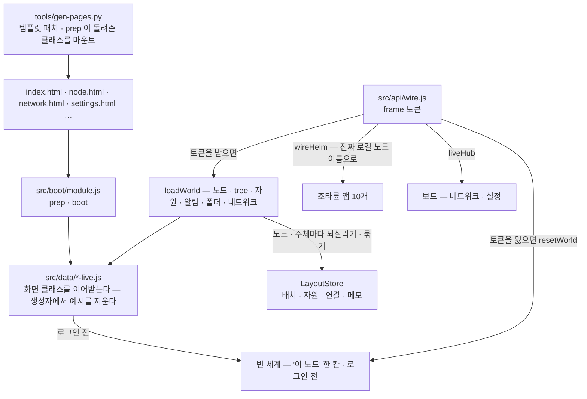
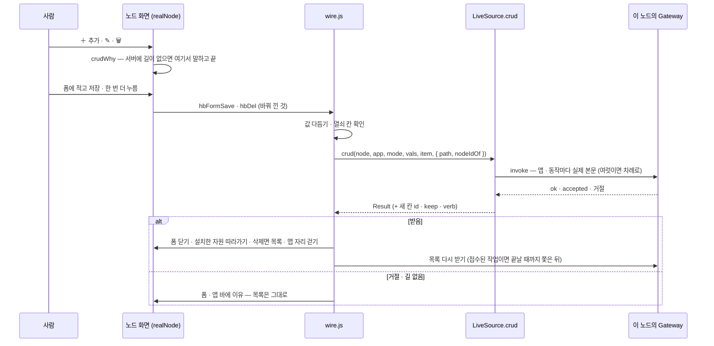

# 실데이터 층 — 예시 데이터를 지우고 이 노드의 값으로

프로토타입의 화면은 디자인 캔버스 원본(`design/*.dc.html`)에서 생성되고, 그 원본은 미리보기를 위해 **예시 세계**를 품고 있다 —
가짜 노드 29개(`edge-01` · `nas-01` · `tree-home` …), tree 6개, 알림 · 메모 · I/O 장치, 세션 띠의 `admin · 만료 21:40`,
네트워크 · 설정 보드의 가짜 mesh · 피어 · 계정 · 클러스터 사용자.

**출하되는 화면(모듈 `lab.stellaxia.node-gui`)에서는 예시가 한 번도 보이지 않는다.** 실데이터 층(`src/data/`)이 화면 클래스를
이어받아 첫 렌더 전에 예시 상태를 지우고, Terra 에서 읽은 이 노드의 값으로만 채운다. 진짜 출처가 없는 것은 **비워 두고 이유를 말한다** —
예시로 채우지 않는다.

> [!IMPORTANT] 원본은 그대로 둔다
> `design/*.dc.html` 과 생성물 `src/screens/*.js` 는 고치지 않았다. 디자인 캔버스 미리보기에는 예시가 필요하고, 생성물은
> 다시 생성되면 덮어쓰이기 때문이다. 그래서 예시 상수는 번들 코드에 **문자열로 남아 있지만** 생성자에서 덮어쓰여 화면에도,
> 요청에도 나가지 않는다(시험이 그것을 지킨다 — §7). 코드에서까지 지우려면 원본 미리보기와 따로 가야 한다(§8).

## 1. 세 겹



| 겹 | 자리 | 하는 일 |
| --- | --- | --- |
| 생성기 | `tools/gen-pages.py` `MODULE_TPL` · `MODULE_BETWEEN` | 페이지가 부트 프로필의 `prep(이름, Screen)`이 돌려준 클래스를 마운트한다. 템플릿에 박힌 예시 글자를 바인딩으로 바꾸거나 뺀다 — 세션 띠 `admin` · `만료 21:40 · 권한: …` → `{{who.*}}`, `예시 데이터` 배지 · `· 예시` 삭제, 보드의 "시연" 스위치 · 상태 시연 선택 · `재시작함 (시연)` 정리, 시작 화면의 아이디 · 비밀번호 판 → 세션 줄 + [Terra 로그인]. 대상이 정확히 한 번 있어야 하고, 아니면 생성이 멈춘다 |
| 부트 프로필 | `src/boot/module.js` · `src/boot/fixes.js` | 화면 이름 → 이어받은 클래스(`prep`), 띄운 직후의 배선(`boot` — 노드 화면 `wireFromUrl` · 시작 화면 `bootIntro`). 공통 보정(빈 맵 해안선 · leaf 맵 자기 칸) — [[module-profile\|모듈 프로필]] |
| 이어받은 클래스 | `src/data/node-live.js` · `network-live.js` · `settings-live.js` · `editors-live.js` | 생성자에서 예시 상태를 비우고, 예시를 돌려주던 메서드(`hbSeed` · `hbTick` · `hbPerm` · `FBDATA` · `utilInfo` · `renderVals` …)를 바꾼다 |
| 배선 | `src/api/wire.js` · `src/data/live-host.js` | 토큰을 받으면 카탈로그 → `loadWorld`(+ LayoutStore 되살리기) → `wireHelm`(진짜 로컬 노드 이름) → 알림 · 설치한 노드 자원의 앱 목록 `pollSec`(기본 10초) · 네트워크 그 3배 폴링. 보드는 같은 창의 클라이언트를 `liveHub` 로 빌린다. 시작 화면이 미리 읽은 노드 화면은 시작 화면의 frame 연결을 빌린다(`frame-boot.js` `borrowFrame`) |

## 2. 무엇을 어디서 읽나

### 2.1 노드 화면

| 영역 | 출처 | 로그인 전 |
| --- | --- | --- |
| 이 노드(로컬 노드) | `terra.daemon.node.get` — `device_name` · `node_id` | `이 노드` (화면 글) |
| 부모 tree | `terra.daemon.enrollment.status.get` 의 `master_url` → `tree · 호스트:포트` | 없음 |
| 맵의 노드 | `GET /api/v1/agent/nodes`(Master 세션) — 평평한 목록이라 **전부 tree 의 자식**으로 둔다. 둘레 두 겹(18칸)을 넘으면 바깥 겹, 그래도 넘치면 편집 창의 "새 노드" | — |
| 처음 맵 | **이 노드의 맵**(leaf GUI) — 조타륜이 곧장 이 노드의 자원을 다룬다. 조타륜을 내리면 부모 tree 맵 | 같다 |
| 시작 화면 | frame 세션 — 토큰 · `session` 값, 주체는 `GET /api/v1/agent/whoami`. 토큰이 있으면 곧장 내려간다 | 판에 [Terra 로그인] |
| 맵 배치 · 꾸미기 · 노드 모습 | LayoutStore(이 브라우저 · 노드 · 주체마다) — 처음엔 화면의 기본 맵(육각 61칸 · 꾸미기 없음) | 기본 맵 |
| 설치한 노드 자원 · 연결 · 도로 | 자리 · 연결은 LayoutStore. 상태 점 · 이벤트 · 자원 설정 창의 모니터링 값은 **원본 앱 목록**(조타륜 앱과 같은 operation) — 그 앱이 닫혀 있어도 `pollSec`마다 | 없음 |
| 노드 필드의 이벤트(동작 · 정지) | Master 의 노드 `status` — `offline` 이면 `auth: offline` → 건물에 정지 이벤트 | — |
| 세션 띠 | frame 값의 `principal` · 토큰 권한(`terra.permissions()`) | `로그인 전` |
| 관리하는 자원(속성 창) | `io.devices.get` · `files.list.get` · `modules.get` 의 개수 | 없음 |
| 알림 | `terra.daemon.tasks.get` 을 10초마다 — 새로 생기거나 상태가 바뀐 작업 | 없음 |
| 유틸 카드 · 창 요약 | 위 값 + `config.schema.get`(키 수) · `wireguard.status.get` · `service-tunnels.get` · 화면 자산 수(설계도 · 스킨 · 자재) | `—` |
| 폴더 보관함 › Terra 저장소 | `io.terra.file.roots.list` → 들어가면 `io.terra.file.entries.list` | 비어 있음 |
| 폴더 보관함 › 폴더 탐색기 | **API 없음** — 비어 있다 | 같다 |
| 폴더 보관함 › 메모장 | LayoutStore(이 브라우저) — 서버 저장 위치는 Q-3 미정 | 화면 메모리(로그인하면 저장본으로) |
| tree 목록(관리 노드 창) | 없음 — 사용자가 등록한 연결 목록을 둘 곳이 없다. 다른 tree 로 가는 길도 없다(`beginSwitch` 가 막는다) | 같다 |

### 2.2 조타륜 앱 — 이 노드에서

| 앱 | 목록 | 동작 |
| --- | --- | --- |
| I/O 장치 | `terra.daemon.io.devices.get` | 승인 · 거부 · 켜기 · 끄기 · 잊기 · 스캔(결과를 `스캔 — 장치 n · 새 · 바뀜 · 사라짐`으로) (`node.control`). 고치기 · 삭제는 §2.4 |
| 공유 폴더 | `files.list.get` + 들어간 경로 · **맵에 설치한 칸 · 상태 화면이 보는 칸의 위 칸**까지 단계마다 `io.terra.file.entries.list`(겹치는 단계는 한 번) | 들어가기 · `+ 폴더`. 추가(폴더 · 빈 파일) · 이름 바꾸기 · 지우기는 §2.4. **받기는 없다** — 청크를 끝까지 당겨 저장하는 일이 화면에 없다 |
| 파일 전송 | `io.terra.file.transfers.list` | 중단(`transfers.abort` · 부분 파일 남김). 올리기 · 이어서는 **없다** — 보낼 파일을 고를 칸이 없다 |
| 서비스 터널 | `service-tunnels.get` | 닫기(`by-tunnel-id.close.post`). `+ 즉석 열기`는 폼을 연다 — 여는 것 · 선언은 Master(§2.4) |
| WireGuard 피어 | `wireguard.status.get` 이 꺼져 있으면 부르지 않는다, 켜져 있으면 `wireguard.peers.get` | 동기화. 회수는 Master — 본문은 두 끝(`source_node_id` · `target_node_id`) |
| 자원 선언 | `svi.declarations.get` — 요약 줄은 울타리(`envelope.process` · `max_declarations`) | `+ 선언` · `다시 선언`은 폼을 연다. 선언 · 철회는 `node.config`★ — 앱이 선언하지 않은 권한이라 잠기고, 그 op 들이 게이트웨이 카탈로그에도 없다(§5.1) |
| 명령 · 작업 | `terra.daemon.tasks.get` (Master 작업 대신) | `+ 실행` → 폼에 명령 → `terra.daemon.commands.execute.post`(202 · `task_id`를 끝까지 쫓는다) · 취소(`tasks.by-task-id.cancel.post`) · 보기(`tasks.by-task-id.get`). 다시는 **없다** — Daemon 작업 목록은 명령 · 출력을 돌려주지 않는다 |
| 모듈 | `modules.get` + 게이트웨이의 설치된 GUI 앱(`GET /api/v1/gui/apps`, 공개) — 앱이 있는 모듈은 `GUI 제공` · 주소(`route`). Scene 모듈은 프로세스가 없어 `멈춤` + "화면만 기여한다" | 시작 · 멈춤 · 재시작(`terra.daemon.modules.by-module-id.*`, `node.control`) · 로그(`terra.gateway.modules.by-id.logs.get`) · GUI 창(§2.5) |
| SVI 자원 · 허가 | Master — `쓸 수 없다 · 이 노드의 게이트웨이에 없다` | — |

이 노드의 권한은 토큰이 실제로 쥔 것(사용자 ∩ 앱)이다. 모듈 수명과 작업 취소는 Daemon 경로라 `node.control` 이 문이다 — 화면의
`모듈 관리★` · `취소` 자물쇠를 `node.control` 로 푼다. 다른 노드는 `닿지 않음`이다.

### 2.3 보드

| 보드 | 진짜 값 | 닿지 않음(이유를 보인다) |
| --- | --- | --- |
| 네트워크 | 로컬 WireGuard(상태 · 설치 계획 · 피어 · 동기화 · 보고 · 올리기/내리기 · 관리형 키 교체), 로컬 서비스 터널(닫기) — 10초 폴링 | 사설망 · 연결 진단 · 라우팅 · 조작 이력 — Master operation. 역할(tree · leaf)은 시연 전환이 아니라 **카탈로그**로 정한다 |
| 설정 | 로컬 노드 135키(`config.get` 값 · `config.schema.get` 소유 · 반영 · `deviations[]`), 저장은 `config.patch {set, save: true}` 키 하나씩(켜기 키는 마지막), 계정(`GET /api/v1/agent/whoami`), 로컬 자원(공유 폴더 · SVI 선언 · I/O 장치 승인 · 모듈 동의) | 클러스터 · 서버 탭 — Master. 위임 자격 목록 — list operation 이 없다 |
| 편집기 | 기본 라이브러리(자재 m1–m22 · 필드 스킨 · 설계도)는 자산이라 남긴다 | 사용자 작품 예시(커스텀 자재 `나무 울타리` · `삽` · `횃불`, 금속 판의 예시 전용 부모 디자인)를 뺀다 |

설정의 키 표(`GROUPS`)는 문서에서 옮긴 자산인데, 실제 `terra.daemon.config.schema.get` 과 **135키 · 소유 · 반영 · 타입이 모두 같다**(2026-10-03 대조).
읽을 때마다 스키마 값으로 소유 · 반영을 다시 맞춘다. 객체 목록 키(`storage.shared_dirs` = `[{name, path}]`)는 입력 칸 하나로 고칠 수 없어 읽기만 한다.

### 2.4 추가 · 수정 · 삭제 — 조타륜 앱 창 · 상태 화면

원본(maingui)은 앱 전체 화면에 `＋ 추가` · 카드마다 `✎` · `🗑`(두 번 누름) · 상태 화면의 수정 · 삭제를 더했다. 원본의 저장은
자기 목록에 항목을 **지어 넣는다**(디자인 시연 · 서버에 길이 없을 때도). 이 층은 지어내지 않는다:

- 폼 저장(`hbFormSave`) · 두 번째 누름(`hbDel`)을 `wire.js`가 **실제 호출**(`source.crud` → `operations.js` `HELM_CRUD`)로 바꿔 끼운다.
  값은 원본 저장과 같은 규칙으로 다듬는다(글 앞뒤 빈칸 · 수 · 열쇠 칸이 비면 부르지 않는다).
- 서버가 받으면 폼을 닫고 **목록을 다시 받아** 보인다. 받지 않으면 폼에 이유를 적는다 — 목록은 그대로다.
- 서버에 길이 없는 것(아래 `—`)은 폼 · 확인 대기를 **열기 전에** 그렇다고 말한다(`node-live.js` `crudWhy`). 연결 전(로그인 전)의 저장은 `Terra에 연결되지 않았다`.
- 삭제가 항목을 없애면 화면의 두 번째 누름 처리로 목록 · 맵 자리 · 연결을 걷는다. 상태만 바뀌는 것(작업 취소 · 선언 철회 · 전송 중단)은 그대로 두고 다시 받는다.
- 고치면 맵에 설치한 자원 · 상태 화면이 새 이름(장치 별명) · 새 칸 id(폴더 이름 바꾸기)를 따라간다.
- 값을 적어야 하는 앱 바 동작(`+ 선언` · `+ 허가` · `+ 즉석 열기` · `+ 실행` · `다시 선언`)은 앱 전체 화면의 폼을 연다(`acts.*.form`).

| 앱 | 추가 | 수정 | 삭제 |
| --- | --- | --- | --- |
| I/O 장치 | `terra.daemon.io.scan.post` `{}` — 손으로 등록하는 op 는 없다, 스캔이 찾는다 | 바뀐 것만 차례로: `io.devices.by-device-id.alias.post {device_id, alias}` · `approve` · `deny` · `enable` · `disable`(`{device_id}`). 종류는 못 바꾼다 · 승인 대기로 되돌리는 op 는 없다 · 하나가 실패하면 거기서 멈춘다 | `io.devices.by-device-id.forget.post` (잊음) |
| 공유 폴더 | 폴더 `io.terra.file.entries.mkdir {root, path}` · 파일 `entries.write {root, path, data: '', exclusive: true}`(빈 파일 — 있으면 거절). 공유 폴더(맨 위 칸) 자리에는 만들지 않는다 | `entries.rename {root, path, to}` — 같은 공유 폴더 안. 이름에 `/` 는 안 된다 | `entries.remove {root, path, recursive}` — 폴더면 recursive. 공유 폴더 자신은 지우지 않는다 |
| 파일 전송 | — 올리기 · 받기는 청크를 주고받아야 한다(PF-6) | — | 도는 전송은 포기 `transfers.abort {transfer_id, keep_partial: false}`, 끝난 전송은 화면에서만 치운다 |
| 서비스 터널 | Master — 선언 `terra.master.service-tunnels.declarations.post` · 즉석 `service-tunnels.open.post`, 본문 `{source_node_id, target_node_id, target_port, local_bind_host, local_port}`(대상은 맵의 노드 이름 → `node_id` · loopback 만) | — 지우고 다시 | 즉석 `terra.daemon.service-tunnels.by-tunnel-id.close.post` · 선언은 Master `declarations.by-declaration-id.delete` |
| WireGuard 피어 | — mesh 가입으로 생긴다 | — | Master `network.mesh.wireguard.peers.revoke.post {source_node_id, target_node_id}` — 공개 키뿐인 피어는 못 한다 |
| 명령 · 작업 | 이 노드 `terra.daemon.commands.execute.post {command, args}` · 다른 노드 Master `commands.post {target_node_id, type: process.execute.request, payload}` | — 다시 실행 | 이 노드 `tasks.by-task-id.cancel.post {task_id}` · 다른 노드 `commands.post {process.cancel.request}` — 목록에 남는다 |
| 자원 선언 | `terra.daemon.svi.declarations.post` — 평평한 선언 `{family, name, direction, command · args / path / address}` | 같은 op + `replace`(퇴역한 이름은 `reuse_name`). 계열 · 이름은 못 바꾼다 | `svi.declarations.by-family.by-name.undeclare.post {family, name}` — 퇴역 원장에 남는다 |
| 허가 · 연결 | Master `svi.grants.post {subject_id, resource_id, operations[], ttl_seconds}` | — 철회 뒤 다시 | Master `svi.grants.by-grant-id.delete` · 바인딩 `svi.bindings.by-binding-id.delete` |
| SVI 자원 · 모듈 | — 선언에서 생긴다 · 모듈 설치 · 설정 · 제거 op 가 없다(제안) | — | — |

본문은 서버 코드에서 확인했다 — Daemon local API(`DisallowUnknownFields`) · Master 라우트(`decodeJSON` — 모르는 키 거절) · `io.terra.file` 계약
(`additionalProperties: false`). 게이트웨이 invoke 는 경로 자리(`{device_id}` …)를 채우고 본문에서 뺀다(`resolvePathParameters`).
그래서 Master 의 **본문이 있는 호출(POST)에는 `node_id` 를 싣지 않는다** — 읽기 · 지우기(GET · DELETE)만 query 로 싣는다.

폼 · 상태 화면의 `API` 줄은 이 모듈이 실제로 부르는 것(`CRUD_TEXT`)이고, 이 노드의 게이트웨이 카탈로그에 없는 op 는 `⚠ 이 노드의 게이트웨이에 없다`
(일부만 없으면 `⚠ 없음: …`)로 적는다. 원본의 자리 표시자에 있던 예시 이름(`nas-01` · `100.80.0.12` …)은 중립 글로 바꿨다.



### 2.5 상태 화면 · 모듈 GUI 창

| 창 | 진짜 값 | 바꾼 것 |
| --- | --- | --- |
| 상태 화면(`ⓘ` · 노드 칸 · 도로 칸) | 자원 = 원본 앱 목록의 그 항목(흐름 단계 · 키 · 카드 동작) — 맵에 없어도 그 앱 목록을 `pollSec`마다 다시 받는다. 노드 = 관계도 · 이 노드의 권한 · 공유 목록(맵 연결로 계산) | 노드 칸의 **로그인** 줄 — 원본은 `auth` 가 없으면 `로그인됨`이라 로그인 전에도 그렇게 그린다. 이 층은 `로그인 전` · `로그인됨 — 이 화면의 세션` · `오프라인` · `이 화면은 닿지 않는다`. 조회 API 는 게이트웨이 경로(`/api/v1/agent/whoami` · `/api/v1/agent/nodes`) |
| 모듈 GUI 창(`🖥`) | `/api/v1/gui/apps` 의 앱(`moduleId` · `route`) — 이 노드에 실제로 설치된 GUI | 원본은 "모듈이 제공하는 화면이 이 창 안에 뜬다 (iframe)"라고 그린다. 다른 모듈의 앱은 이 창에 **띄울 수 없다** — 앱마다 origin · 스코프 토큰이 따로고 `terra.web/frame` 은 자기 모듈의 앱만 감싼다. 그래서 창은 주소와 함께 "셸의 앱 목록에서 연다"를 적는다. 이 모듈 자신이면 "지금 보고 있는 이 화면", Scene 모듈은 `멈춤` 대신 `화면 모듈` |
| 메모장 | LayoutStore(이 브라우저) | 원본의 경로 글 `~/.terra/memos/` → `메모/` |

## 3. 비어 있는 것과 그 이유

| 비어 있는 것 | 이유 | 채우려면 |
| --- | --- | --- |
| Master 데이터(SVI · 허가 · mesh · 라우트 · 클러스터 · 다른 노드의 작업) | 앱 스코프 토큰은 Master 에 닿지 않는다 — 설계상 위임 경계 | 세션 중계를 Master operation 전체로 넓히는 ADR(모듈 README Q-2) |
| 다른 노드의 자원 | 다른 노드의 operation 을 부르는 게이트웨이 경로가 없다(원격은 모듈 경로뿐) | 원격 operation 경로 |
| tree 계층(손자 노드) | `agent/nodes` 에 부모 관계가 없다 | `terra.master.nodes.get` (위의 ADR) |
| 다른 tree 목록 | 사용자가 등록한 연결 목록을 둘 곳이 없다 | Q-3 — `kind: service` 로 올려 사람별 저장 |
| 다른 기기에서의 맵 배치 · 노드 모습 · 자원 · 연결 · 메모 | 지금은 이 브라우저(LayoutStore `localStorage`)에만 있다 | Q-3 — 서버 LayoutStore(`loadLayout` · `saveLayout`만 바꾼다) |
| 도로 · 건물 · 자재 설계(편집기에서 내보낸 것) | `localStorage` `terra.gui.roads` · `terra.gui.buildings` — 이 브라우저에만 | AssetStore |
| 입출력 연결의 실제 데이터 흐름 | 연결(`links`)은 화면의 선이다 — 무엇을 주고받는지는 디자인 · 데이터 모양이 없다 | 설정 화면 디자인 + SVI 바인딩 |
| 폴더 탐색기 · 파일 열기 · 파일 관리자로 열기 | Daemon 로컬 op 이 없다 | 제안 `terra.daemon.local-fs.list.get` · `terra.daemon.desktop.open.post` |
| 받기 · 올리기 · 이어서 | 청크 전송을 화면이 하지 않는다 | `io.terra.file.transfers.*` 청크 루프 + 파일 고르기 |
| 작업 출력 · 다시 실행 | 실행은 추가 폼으로 된다(§2.4). Daemon 작업 목록 · 기록은 명령 · 출력을 주지 않는다 | 출력 API |
| 자원 선언 추가 · 철회 | Daemon local API 에 경로(`POST /svi/declarations` …)는 있지만 게이트웨이 카탈로그에 그 op 들이 없다 — `쓸 수 없다 · 이 노드의 게이트웨이에 없다` | 계약에 올린다(PF-13) |
| 모듈 설치 · 설정 · 제거 | op 가 없다 | 제안 `terra.gateway.modules.post` · `by-module-id.config.put` · `by-module-id.delete`(PF-14) |
| 다른 모듈의 GUI 열기 | frame 은 자기 모듈의 앱만 감싼다 — 앱 안에서 다른 앱을 띄울 길이 없다 | 셸에 "앱 열기" 요청(PF-15) |

## 4. 로그인 · 로그아웃

- **로그인 전** — 빈 세계: `이 노드` 한 칸의 맵, 세션 띠 `로그인 전`, 조타륜 앱은 `로그인 필요` 자물쇠, 동작은 `Terra에 로그인해야 쓸 수 있다`.
  frame 의 띠는 *"Terra에 로그인하지 않았습니다 — 로그인하면 이 노드의 데이터가 보입니다"*.
- **토큰을 받으면** — 위 §2 를 읽는다. 권한이 달라질 때만 다시 붙는다(정기 갱신은 토큰 문자열만 바뀐다).
- **토큰을 잃으면** — 받아 둔 것을 다 지우고 빈 세계로 돌아간다. 예시로 돌아가지 않는다.
- **Terra 밖(npm run dev)** — 닿을 Terra 가 없다. 빈 세계 그대로다. 예전의 `?live=1` · 가짜 Gateway(`tools/mock-gateway.mjs`)는 예시 장치를 들고 있어 함께 뺐다.
- **시작 화면** — 로그인 전이면 판에 [Terra 로그인]이 선다 → 셸의 `/login` 카드 → 로그인하면 셸이 frame 을 처음부터 다시 띄우고, 토큰이 있으니 곧장 내려간다.
  셸을 새로 고치면 Scene 의 세션(memory Store)이 비어 다시 로그인한다 — 저장한 배치 · 자원 · 연결 · 메모는 LayoutStore 에 남아 되살아난다.
- **로그아웃** — LayoutStore 저장을 끊은 뒤 빈 세계로 돌아간다. 저장본은 지우지 않는다(다시 로그인하면 되살린다).

## 5. 실측 — 진짜 스택 위에서

2026-10-03. 진짜 Master · Daemon(등록) · 게이트웨이 · `io.terra.file` · `io.terra.io-inventory` 와 leaf UI 셸(Vite) 위에
포장물을 `terra module install --dev --force` 로 깔고 Chromium(Playwright)으로 돌렸다. 화면에 **보이는 글자 전체**(보드 iframe 포함)에서
예전 예시 표식(노드 이름 · 장치 · 메모 · 알림 · IP · `21:40` · `예시 데이터` · `시연` … 60여 개)을 찾았다.

| 단계 | 관찰 |
| --- | --- |
| 15개 상태(로그인 전 · 로그인 · 조타륜 10앱 · 폴더 보관함 · tree 맵 · 네트워크 3묶음 · 설정 5탭 · 자재 편집기 · 로그아웃) | 예시 표식 **0건** |
| 로그인 | 맵 `stack-leaf-01`, 부모 `tree · 127.0.0.1:28080`, 자원 `I/O 장치 3 · 공유 폴더 1 · 모듈 4`, 세션 띠 `admin@stack.local` · 토큰 권한 6개 |
| 조타륜 | I/O 장치 3(실제 승인 상태) · 공유 폴더 `share-0` → `docs/` · `hello.txt 12 B` · 모듈 4(Scene 2는 "화면만 기여") · WireGuard `terra0 · 꺼짐 · 피어 0` · 선언 `울타리 process off · 0/256` |
| 동작 | 폴더 만들기 → 디스크에 `새 폴더` 생김, 지우기 → 사라짐 · I/O 승인 → Daemon 이 `approved` · 모듈 상태 확인 · 작업 보기 |
| 알림 | 다른 길로 Daemon 작업을 하나 만들면 12초 안에 `process.execute.request · 완료` 알림 + 책갈피 1 |
| tree 맵 | 가운데 tree, 둘레에 `stack-leaf-01` |
| 네트워크 | `stack-leaf-01 · leaf GUI`, WireGuard 꺼짐 + 데몬이 준 설치 계획 4단계, Master 묶음은 "닿지 않음" |
| 설정 | `daemon.device_name = stack-leaf-01` 등 실제 값, `node.config★ 없음`이라 운영자 키는 잠김, 계정 = whoami(위임 앱 · 토큰 만료) |
| 로그아웃 | 빈 세계로 — `이 노드` · 예시 0건 |
| 콘솔 | 남은 오류는 셸의 `/api/product/session` 404(이 모듈과 무관)와 모듈 로그 500(아래) |

### 5.0 새 GUI(시작 화면 · 노드 자원 · 연결 · 도로) — 2026-10-04

같은 스택에 모듈 0.2.0(앱 entry = 시작 화면)을 깔고 Chromium으로 돌렸다. 화면의 모든 frame(시작 화면 · 노드 화면 srcdoc · 보드 srcdoc) 글자에서 예시 표식을 찾았다.

| 단계 | 관찰 |
| --- | --- |
| 로그인 전 시작 화면 | "Terra에 로그인하지 않았다" · [Terra 로그인] · 비밀번호 칸 **없음** · Gateway 줄 노랑(로그인 전) |
| [Terra 로그인] | 셸의 `/login` 카드 → 로그인 → frame 다시 띄움 → "admin@stack.local(으)로 들어가는 중…" → 구름 → 노드 화면(srcdoc · `mapFail` 없음) |
| 노드 화면 | 맵 `stack-leaf-01` · 부모 `tree · 127.0.0.1:28080` · 권한 6개 · 세션 띠 = 주체 |
| 노드 자원 설치 | I/O 카드 `Default camera` · `Default microphone`의 [📍 설치] → 빈 필드 → 자원 설정 창. 조타륜을 닫고 12초 뒤에도 모니터링 값이 원본 목록과 이어져 있다(`kind=microphone · presence=unknown · approval=pending · enabled=false`) |
| 연결하기 | 카메라 → 마이크, 길 찾기가 빈 필드 한 칸에 돌길을 깔았다 — 노드 자신의 칸(가운데)은 지나지 않는다 · 자원 설정 창 `입출력 연결 1` |
| 도로 편집기 | 보드(srcdoc)로 뜬다 · [노드 화면으로 내보내기] → 노드 화면 「도로 편집기에서 도로를 받았습니다」 |
| 네트워크 · 설정 · 건물 편집기 | 보드로 뜨고 실데이터 — CSP 거절 없음(`data-board`) |
| 새로 고침 | 다시 로그인 → 자원 2 · 연결 1 · 도로 1 · 메모 · 표지(`flat`)가 그대로 되살아난다 |
| 창 크기 1800×1050 | 화면이 창을 꽉 채운다(`scr` 1800×1050) — 잘림 없음 |
| 로그아웃 | 빈 세계 · 표시 설정 기본 · 저장본은 그대로 |
| 예시 표식 · 콘솔 | 모든 단계에서 **0건** · 남은 콘솔 오류는 셸의 `/api/product/session` 404(이 모듈과 무관) |

### 5.1 실측에서 드러난 플랫폼 사실

| 사실 | 이 층이 한 일 |
| --- | --- |
| `terra.gateway.agent.whoami.get` 을 **invoke 로** 부르면 호출자가 중계에서 빠져 `principal: anonymous` · 권한 0 이 온다. 경로 `GET /api/v1/agent/whoami` 는 맞게 답한다 | `TerraClient.get(path)` 로 경로를 부른다 |
| leaf 게이트웨이의 모듈 로그(`terra.gateway.modules.by-id.logs.get`)는 500 `MODULE_MANAGEMENT_FAILED — management action is not supported by the daemon local API` | 그대로 보인다(실제 응답) |
| `config.get` 의 `storage.shared_dirs` 는 객체 목록인데 스키마 타입은 `string_list` 다 | 읽기만으로 둔다 |
| WireGuard 통합이 꺼져 있으면 `wireguard.peers.get` 은 422 | 상태를 먼저 보고 꺼져 있으면 부르지 않는다 |
| 작업 기록(`tasks.by-task-id.get`)도 `job_id` 를 싣는다 | 상태(`state` · `status`)가 있으면 접수가 아니라 기록으로 읽는다 |
| 대응표의 게이트웨이 모듈 op 이름이 틀렸다(`modules.by-module-id.*` → 실제 `modules.by-id.*`, 재시작은 없다) | 이 노드의 모듈은 Daemon 경로로 |
| Master 의 본문 해석기(`decodeJSON`)는 모르는 키를 거절한다 — 원본 연동 층처럼 Master op 마다 `node_id` 를 본문에 실으면 POST 가 400 | 읽기 · 지우기만 `node_id` 를 query 로 |
| 게이트웨이 invoke 는 경로 자리(`{device_id}` …)를 입력에서 채우고 **본문에서 뺀다** | 경로 자리 키를 그대로 싣는다(`alias.post {device_id, alias}`) |
| Daemon 의 `POST /service-tunnels` 는 Master 가 발급한 경로 표(`decision` · `ticket`)를 받는 쪽이다 — 화면이 직접 열 수 없다 | 터널 열기 · 선언은 Master op |
| `GET /api/v1/gui/apps` 는 공개이고 앱마다 `moduleId` · `route` · `origin` · `embed` 를 준다 | 모듈 앱의 GUI 표시 |
| `terra.web/frame` 은 자기 모듈의 앱만 감싼다(`다른 모듈의 앱입니다`) | 모듈 GUI 창은 띄우지 않고 이유를 적는다 |
| `svi.declarations` 의 POST 계열(선언 · 철회 · 잊기)은 Daemon local API 에 있지만 게이트웨이 카탈로그에 없다 | `이 노드의 게이트웨이에 없다` |
| `terra.daemon.commands.execute.post` 는 `{command, args, working_dir, timeout_sec, env, capture_output}`만 받고 `202 {task_id}` | 이 노드의 실행은 Master 를 거치지 않는다 |

### 5.2 maingui 기준 — 추가 · 수정 · 삭제 · 상태 화면 · 모듈 GUI 창 — 2026-10-04

GUI 원본 저장소 `StellaxiaLab/maingui`(`f24c3bc`)에 맞춘 모듈을 같은 스택에 깔고, 화면을 사람처럼 눌러(`＋ 추가` · `✎` · `🗑` · 폼 칸 · 저장) 돌린 뒤
관리자 토큰으로 서버에 직접 물어 견줬다.

| 단계 | 관찰 |
| --- | --- |
| 공유 폴더 | `share-0` 안에서 `＋ 추가` → 폴더 `e2e-crud` · 빈 파일 `e2e-note.txt` — 디스크에 생겼다(`entries.list`). `✎` → `e2e-crud-2`로 이름이 바뀌었다. `🗑` 첫 누름은 확인 대기(`del:share-0/e2e-note.txt`), 두 번째에 지워졌다 — 서버 목록이 처음과 같아졌다 |
| 공유 폴더 맨 위 칸 | `＋ 추가` 저장 → 부르지 않고 `공유 폴더(맨 위 칸)는 Daemon 설정이 정한다` |
| I/O 장치 | `Default microphone`의 `✎` → 이름 `E2E 마이크` · 승인 `approved` → Daemon 이 별명 · 승인을 그대로 가졌다. 종류를 바꾸면 부르지 않고 이유 · `＋ 추가` = 스캔(`200`) |
| 명령 · 작업 | 앱 바 `+ 실행` → 앱 전체 화면 폼 → `echo e2e-crud` → `202` → 새 Daemon 작업 `process.execute.request · succeeded` |
| 서비스 터널 | 폼의 API 줄이 `⚠ 이 노드의 게이트웨이에 없다`(leaf 게이트웨이에는 Master op 가 없다) · 저장하면 `쓸 수 없다 · 이 노드의 게이트웨이에 없다` |
| 모듈 | `＋ 추가`는 폼을 열지 않고 `⚠ 모듈 설치 op 없음`. `/api/v1/gui/apps`로 이 모듈만 `GUI 제공`. 이 모듈의 `🖥` → "지금 보고 있는 이 화면이 이 모듈의 GUI다" |
| 상태 화면 | `Terra File` — 흐름 `설치 → 실행` · 키 · API 줄(⚠ 표시). 노드 칸 — `로그인됨 — 이 화면의 세션` · 자원 `I/O 장치 3 · 공유 폴더 1 · 모듈 4` · 권한 `관리자` |
| 오버헤드 패널 접기 | 접으면 LayoutStore 에 `ovhHide: true` → 새로 고침 · 다시 로그인 뒤에도 접혀 있다 → 다시 편다 |
| 예시 표식 · 콘솔 | 모든 단계 **0건** · 남은 콘솔 오류는 셸의 `/api/product/session` 404(이 모듈과 무관) |

처음 돌렸을 때 **폼의 저장 단추가 눌리지 않았다** — 시작 화면의 아래 두 알약(게이트웨이 · 꼬리말)이 내려간 뒤 opacity 0으로 남아(z-index 3 > 노드 화면 iframe 1)
노드 화면의 왼쪽 · 오른쪽 아래 누름을 가로챘다. 원본에도 같은 구조가 있다(UP-15). 생성기에서 그 둘에 `pointer-events`를 묶어 고쳤다.

## 6. 코드 지도

| 파일 | 내용 |
| --- | --- |
| `src/boot/module.js` | 부트 프로필 — `prep`(화면 이름 → 이어받은 클래스) · `boot`(노드 화면 배선 · 시작 화면 세션) |
| `src/boot/fixes.js` | 공통 보정 — 빈 맵 해안선 · leaf 맵 자기 칸(노드 칸으로) |
| `src/data/intro-live.js` | `realIntro(Screen)` · `bootIntro` · `watchMapFrame` — 비밀번호 없는 시작 화면 · 노드 화면 미리 읽기 |
| `src/store/layout.js` | LayoutStore — `layoutKey` · `bindLayout`(끊을 수 있는 자동 저장) · `reviveMaps` · `reviveWins` |
| `src/data/node-live.js` | `realNode(Screen)` · `loadWorld` · `loadAlarms` · `loadFolder` · `loadNet` · `resetWorld` · `wgLine` |
| `src/data/world.js` | 노드 목록 → 이름(겹치면 node_id 끝 4자) · 관계도(NET) · 자원 요약 |
| `src/data/alarms.js` | Daemon 작업 → 알림 한 줄(색이 곧 종류 — 화면의 `KIND` 표) |
| `src/data/files.js` | 공유 폴더 · 항목 → 보관함 칸(`share` · `rel`) |
| `src/data/network-live.js` | `realNetwork(Screen)` · `roleOf` · `tunnelRows` · `peerRows` |
| `src/data/settings-live.js` | `realSettings(Screen)` · `flatten` · `toWire` |
| `src/data/editors-live.js` | `realMaterial` · `realField` |
| `src/data/live-host.js` | `liveHub`(노드 화면 → 보드) · `connectLive`(보드) · `absenceText` |
| `src/api/source.js` | `appFor`(로컬 노드면 `local` 대응) · `pathInput`(op 이름의 `by-…` 자리만) · 폴더 단계 읽기(경로 여럿 · 겹치는 단계는 한 번) · `guard` · `crud`(추가 · 수정 · 삭제) · `guiApps` |
| `src/api/operations.js` | `HELM_APPS`(목록 · 동작 · `form`) · `HELM_CRUD`(실제 본문) · `CRUD_TEXT`(API 줄) · `GUI_APPS` · `scanLine` |
| `src/api/wire.js` | `wireHelm` — 목록 · 동작 · 폼 저장 · 두 번째 누름 · 값을 적어야 하는 동작의 폼 열기 · 폴링(설치한 자원 · 상태 화면) · `formValues` |
| `src/api/adapters.js` | 상태를 화면 낱말로(`modState` · `jobState` · `xferState` · `tunnelState` …) — 표에 없는 값이 오면 렌더 전체가 멈추기 때문. `withGui`(모듈 ← GUI 앱) |

## 7. 시험

| 시험 | 지키는 것 |
| --- | --- |
| `tests/live.test.mjs` | 노드 화면 · 보드(모든 묶음 · 탭) · 편집기를 브라우저 없이 만들어 **상태와 렌더 값 전체에 예시 표식이 없는지**. 실제 응답 모양 → 화면 모양, 모듈 · Daemon 이 모르는 키를 싣지 않기, WireGuard 꺼짐, 18칸을 넘는 자식, 권한 |
| `tests/data.test.mjs` | 노드 이름 · 관계도 · 알림 · 보관함 칸의 순수 함수 |
| `tests/module.test.mjs` | 부트 프로필 `prep` · 공통 보정(자기 칸) · LayoutStore 되살리기(`ovhHide` 포함) · 묶기/끊기 · `loadWorld`가 저장본을 되살리고 로그아웃이 지우지 않기 · 시작 화면(비밀번호 없음 · 로그인 카드 · 자동으로 내려가기 · 내려간 뒤 아래 알약이 누름을 받지 않기) · frame 연결 빌리기 · 설치한 자원 · 상태 화면의 앱 다시 받기(폴더는 위 칸까지) |
| `tests/crud.test.mjs` | 앱마다 추가 · 수정 · 삭제의 **본문이 실제 서버의 입력과 같은지**(폴더 · 장치 · 작업 · 터널 · 피어 · 허가 · 선언 · 전송), Master POST 에 `node_id` 를 싣지 않기, 길이 없는 것은 `null`, 카탈로그에 없는 op 는 부르지 않기, GUI 앱 붙이기. 화면과 함께: 폼 저장이 지어내지 않기 · 삭제의 두 번 누름 · 맵 자리 걷기 · 취소는 남기기 · 이름 · 칸 id 따라가기 · 폼 여는 동작 · 끊으면 되돌리기 · API 줄 ⚠ · 자리 표시자에 예시 없음 · 모듈 GUI 창 · 상태 화면 로그인 줄 |
| `tests/smoke.mjs` | 페이지가 오류 없이 뜨고 예시가 없다 · 시작 화면 → 노드 화면 · 조타륜 · 전체 화면 · 메모 · 오버헤드 패널 접기 · 상태 화면(로그인 전) · 도로 편집기 보드 · 창 크기 |

```bash
# Linux — web/ 에서. Windows(PowerShell) · macOS 도 같은 명령이다
npm test
```

## 8. 남은 선택

- **코드에서까지 지우기** — 지금은 예시 상수가 번들에 문자열로 남는다(보이지 않는다). 지우려면 생성기에 JS 패치를 두거나,
  디자인 원본의 미리보기 데이터를 별도 파일로 떼어 미리보기에만 싣는다. 원본 작업 방식과 맞춰 정한다.
- **위 §3 의 빈 자리** — 대부분 플랫폼 쪽 결정이 먼저다(Master 위임 · 저장소 · 로컬 op).

## 관련 문서

- [[architecture|구조]] — §7 Terra 안에서
- [[frontend-api|프론트엔드 API]] — §5 연동 지점 · §6 연동 층
- [[helm-apps-integration|조타륜 앱 · 폴더 보관함 연동]] — 앱별 operation
- [[node-screen-data-model|노드 화면 데이터 모델]] — §2.8 예시로만 존재하는 것
- [[testing|시험]]
- [[module-profile|모듈 프로필]] — 시작 화면 · LayoutStore · 생성 때 바꾸는 것

## 관련 모듈

- `lab.stellaxia.node-gui` — 이 웹을 `ui/` 로 싣는 모듈(모듈 README "무엇이 실데이터인가")
- `io.terra.file` · `io.terra.io-inventory` — 폴더 · 장치 데이터의 출처

## 관련 흐름

- 위 §1 그림 — 생성기 → 이어받은 클래스 → 배선
- 로그인 → `loadWorld` → `wireHelm` → 폴링 · 로그아웃 → `resetWorld`
- §2.4 그림 — 폼 저장 · 두 번째 누름 → `crud` → 서버 → 목록 다시 받기
