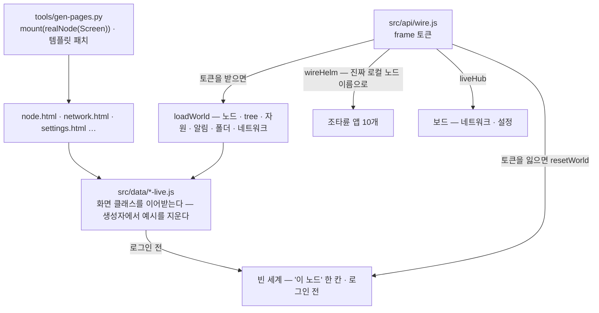

# 실데이터 층 — 예시 데이터를 지우고 이 노드의 값으로

프로토타입의 화면은 디자인 캔버스 원본(`design/*.dc.html`)에서 생성되고, 그 원본은 미리보기를 위해 **예시 세계**를 품고 있다 —
가짜 노드 29개(`edge-01` · `nas-01` · `tree-home` …), tree 6개, 알림 · 메모 · I/O 장치, 세션 띠의 `admin · 만료 21:40`,
네트워크 · 설정 보드의 가짜 mesh · 피어 · 계정 · 클러스터 사용자.

**출하되는 화면(모듈 `lab.stellaxia.node-gui`)에서는 예시가 한 번도 보이지 않는다.** 실데이터 층(`src/data/`)이 화면 클래스를
이어받아 첫 렌더 전에 예시 상태를 지우고, Terra 에서 읽은 이 노드의 값으로만 채운다. 진짜 출처가 없는 것은 **비워 두고 이유를 말한다** —
예시로 채우지 않는다.

> [!IMPORTANT] 원본은 그대로 둔다
> `design/*.dc.html` 과 생성물 `src/screens/*.js` 는 고치지 않았다. 디자인 캔버스 미리보기에는 예시가 필요하고, 생성물은
> 다시 생성되면 덮어쓰이기 때문이다. 그래서 예시 상수는 번들 코드에 **문자열로 남아 있지만** 생성자에서 덮어쓰여 화면에도,
> 요청에도 나가지 않는다(시험이 그것을 지킨다 — §7). 코드에서까지 지우려면 원본 미리보기와 따로 가야 한다(§8).

## 1. 세 겹



| 겹 | 자리 | 하는 일 |
| --- | --- | --- |
| 생성기 | `tools/gen-pages.py` `REAL` · `TEMPLATE_PATCHES` | 페이지가 `mount(realX(Screen))` 으로 마운트한다. 템플릿에 박힌 예시 글자를 바인딩으로 바꾸거나 뺀다 — 세션 띠 `admin` · `만료 21:40 · 권한: …` → `{{who.*}}`, `예시 데이터` 배지 · `· 예시` 삭제, 보드의 "시연" 스위치 · 상태 시연 선택 · `재시작함 (시연)` 정리. 대상이 정확히 한 번 있어야 하고, 아니면 생성이 멈춘다 |
| 이어받은 클래스 | `src/data/node-live.js` · `network-live.js` · `settings-live.js` · `editors-live.js` | 생성자에서 예시 상태를 비우고, 예시를 돌려주던 메서드(`hbSeed` · `hbTick` · `hbPerm` · `FBDATA` · `utilInfo` · `renderVals` …)를 바꾼다 |
| 배선 | `src/api/wire.js` · `src/data/live-host.js` | 토큰을 받으면 카탈로그 → `loadWorld` → `wireHelm`(진짜 로컬 노드 이름) → 알림 10초 · 네트워크 30초 폴링. 보드는 같은 창의 클라이언트를 `liveHub` 로 빌린다 |

## 2. 무엇을 어디서 읽나

### 2.1 노드 화면

| 영역 | 출처 | 로그인 전 |
| --- | --- | --- |
| 이 노드(로컬 노드) | `terra.daemon.node.get` — `device_name` · `node_id` | `이 노드` (화면 글) |
| 부모 tree | `terra.daemon.enrollment.status.get` 의 `master_url` → `tree · 호스트:포트` | 없음 |
| 맵의 노드 | `GET /api/v1/agent/nodes`(Master 세션) — 평평한 목록이라 **전부 tree 의 자식**으로 둔다. 둘레 두 겹(18칸)을 넘으면 바깥 겹, 그래도 넘치면 편집 창의 "새 노드" | — |
| 처음 맵 | **이 노드의 맵**(leaf GUI) — 조타륜이 곧장 이 노드의 자원을 다룬다. 조타륜을 내리면 부모 tree 맵 | 같다 |
| 맵 배치 · 꾸미기 | 저장소가 없다 → 화면의 기본 맵(육각 61칸 · 꾸미기 없음) | 같다 |
| 세션 띠 | frame 값의 `principal` · 토큰 권한(`terra.permissions()`) | `로그인 전` |
| 관리하는 자원(속성 창) | `io.devices.get` · `files.list.get` · `modules.get` 의 개수 | 없음 |
| 알림 | `terra.daemon.tasks.get` 을 10초마다 — 새로 생기거나 상태가 바뀐 작업 | 없음 |
| 유틸 카드 · 창 요약 | 위 값 + `config.schema.get`(키 수) · `wireguard.status.get` · `service-tunnels.get` · 화면 자산 수(설계도 · 스킨 · 자재) | `—` |
| 폴더 보관함 › Terra 저장소 | `io.terra.file.roots.list` → 들어가면 `io.terra.file.entries.list` | 비어 있음 |
| 폴더 보관함 › 폴더 탐색기 | **API 없음** — 비어 있다 | 같다 |
| 폴더 보관함 › 메모장 | 화면 메모리 — 새로 고치면 사라진다(Q-3 미정) | 같다 |
| tree 목록(관리 노드 창) | 없음 — 사용자가 등록한 연결 목록을 둘 곳이 없다. 다른 tree 로 가는 길도 없다(`beginSwitch` 가 막는다) | 같다 |

### 2.2 조타륜 앱 — 이 노드에서

| 앱 | 목록 | 동작 |
| --- | --- | --- |
| I/O 장치 | `terra.daemon.io.devices.get` | 승인 · 거부 · 켜기 · 끄기 · 잊기 · 스캔 (`node.control`) |
| 공유 폴더 | `files.list.get` + 들어간 경로까지 단계마다 `io.terra.file.entries.list` | 폴더 만들기 · 지우기(`io.terra.file.entries.mkdir` · `remove`). **받기는 없다** — 청크를 끝까지 당겨 저장하는 일이 화면에 없다 |
| 파일 전송 | `io.terra.file.transfers.list` | 중단(`transfers.abort`). 올리기 · 이어서는 **없다** — 보낼 파일을 고를 칸이 없다 |
| 서비스 터널 | `service-tunnels.get` | 닫기(`by-tunnel-id.close.post`). 즉석 열기 · 선언 지우기는 Master — 닿지 않음 |
| WireGuard 피어 | `wireguard.status.get` 이 꺼져 있으면 부르지 않는다, 켜져 있으면 `wireguard.peers.get` | 동기화. 회수는 Master — 닿지 않음 |
| 자원 선언 | `svi.declarations.get` — 요약 줄은 울타리(`envelope.process` · `max_declarations`) | 선언 · 철회는 `node.config`★ — 앱이 선언하지 않은 권한이라 잠긴다 |
| 명령 · 작업 | `terra.daemon.tasks.get` (Master 작업 대신) | 취소(`tasks.by-task-id.cancel.post`) · 보기(`tasks.by-task-id.get`). 실행 · 다시는 **없다** — 명령을 적을 칸이 없고 Daemon 작업 목록은 명령 · 출력을 돌려주지 않는다 |
| 모듈 | `modules.get` — Scene 모듈은 프로세스가 없어 `멈춤` + "화면만 기여한다" | 시작 · 멈춤 · 재시작(`terra.daemon.modules.by-module-id.*`, `node.control`) · 로그(`terra.gateway.modules.by-id.logs.get`) |
| SVI 자원 · 허가 | Master — `쓸 수 없다 · 이 노드의 게이트웨이에 없다` | — |

이 노드의 권한은 토큰이 실제로 쥔 것(사용자 ∩ 앱)이다. 모듈 수명과 작업 취소는 Daemon 경로라 `node.control` 이 문이다 — 화면의
`모듈 관리★` · `취소` 자물쇠를 `node.control` 로 푼다. 다른 노드는 `닿지 않음`이다.

### 2.3 보드

| 보드 | 진짜 값 | 닿지 않음(이유를 보인다) |
| --- | --- | --- |
| 네트워크 | 로컬 WireGuard(상태 · 설치 계획 · 피어 · 동기화 · 보고 · 올리기/내리기 · 관리형 키 교체), 로컬 서비스 터널(닫기) — 10초 폴링 | 사설망 · 연결 진단 · 라우팅 · 조작 이력 — Master operation. 역할(tree · leaf)은 시연 전환이 아니라 **카탈로그**로 정한다 |
| 설정 | 로컬 노드 135키(`config.get` 값 · `config.schema.get` 소유 · 반영 · `deviations[]`), 저장은 `config.patch {set, save: true}` 키 하나씩(켜기 키는 마지막), 계정(`GET /api/v1/agent/whoami`), 로컬 자원(공유 폴더 · SVI 선언 · I/O 장치 승인 · 모듈 동의) | 클러스터 · 서버 탭 — Master. 위임 자격 목록 — list operation 이 없다 |
| 편집기 | 기본 라이브러리(자재 m1–m22 · 필드 스킨 · 설계도)는 자산이라 남긴다 | 사용자 작품 예시(커스텀 자재 `나무 울타리` · `삽` · `횃불`, 금속 판의 예시 전용 부모 디자인)를 뺀다 |

설정의 키 표(`GROUPS`)는 문서에서 옮긴 자산인데, 실제 `terra.daemon.config.schema.get` 과 **135키 · 소유 · 반영 · 타입이 모두 같다**(2026-10-03 대조).
읽을 때마다 스키마 값으로 소유 · 반영을 다시 맞춘다. 객체 목록 키(`storage.shared_dirs` = `[{name, path}]`)는 입력 칸 하나로 고칠 수 없어 읽기만 한다.

## 3. 비어 있는 것과 그 이유

| 비어 있는 것 | 이유 | 채우려면 |
| --- | --- | --- |
| Master 데이터(SVI · 허가 · mesh · 라우트 · 클러스터 · 다른 노드의 작업) | 앱 스코프 토큰은 Master 에 닿지 않는다 — 설계상 위임 경계 | 세션 중계를 Master operation 전체로 넓히는 ADR(모듈 README Q-2) |
| 다른 노드의 자원 | 다른 노드의 operation 을 부르는 게이트웨이 경로가 없다(원격은 모듈 경로뿐) | 원격 operation 경로 |
| tree 계층(손자 노드) | `agent/nodes` 에 부모 관계가 없다 | `terra.master.nodes.get` (위의 ADR) |
| 다른 tree 목록 · 맵 배치 · 노드 모습 | 저장소(LayoutStore · 연결 목록)가 없다 | Q-3 — `kind: service` 로 올려 사람별 저장 |
| 메모 | 저장 위치 미정 — 화면 메모리 | Q-3 |
| 폴더 탐색기 · 파일 열기 · 파일 관리자로 열기 | Daemon 로컬 op 이 없다 | 제안 `terra.daemon.local-fs.list.get` · `terra.daemon.desktop.open.post` |
| 받기 · 올리기 · 이어서 | 청크 전송을 화면이 하지 않는다 | `io.terra.file.transfers.*` 청크 루프 + 파일 고르기 |
| 작업 실행 · 출력 | 명령 입력 칸이 없다. Daemon 작업 목록은 명령 · 출력을 주지 않는다 | 입력 칸 + 출력 API |

## 4. 로그인 · 로그아웃

- **로그인 전** — 빈 세계: `이 노드` 한 칸의 맵, 세션 띠 `로그인 전`, 조타륜 앱은 `로그인 필요` 자물쇠, 동작은 `Terra에 로그인해야 쓸 수 있다`.
  frame 의 띠는 *"Terra에 로그인하지 않았습니다 — 로그인하면 이 노드의 데이터가 보입니다"*.
- **토큰을 받으면** — 위 §2 를 읽는다. 권한이 달라질 때만 다시 붙는다(정기 갱신은 토큰 문자열만 바뀐다).
- **토큰을 잃으면** — 받아 둔 것을 다 지우고 빈 세계로 돌아간다. 예시로 돌아가지 않는다.
- **Terra 밖(npm run dev)** — 닿을 Terra 가 없다. 빈 세계 그대로다. 예전의 `?live=1` · 가짜 Gateway(`tools/mock-gateway.mjs`)는 예시 장치를 들고 있어 함께 뺐다.

## 5. 실측 — 진짜 스택 위에서

2026-10-03. 진짜 Master · Daemon(등록) · 게이트웨이 · `io.terra.file` · `io.terra.io-inventory` 와 leaf UI 셸(Vite) 위에
포장물을 `terra module install --dev --force` 로 깔고 Chromium(Playwright)으로 돌렸다. 화면에 **보이는 글자 전체**(보드 iframe 포함)에서
예전 예시 표식(노드 이름 · 장치 · 메모 · 알림 · IP · `21:40` · `예시 데이터` · `시연` … 60여 개)을 찾았다.

| 단계 | 관찰 |
| --- | --- |
| 15개 상태(로그인 전 · 로그인 · 조타륜 10앱 · 폴더 보관함 · tree 맵 · 네트워크 3묶음 · 설정 5탭 · 자재 편집기 · 로그아웃) | 예시 표식 **0건** |
| 로그인 | 맵 `stack-leaf-01`, 부모 `tree · 127.0.0.1:28080`, 자원 `I/O 장치 3 · 공유 폴더 1 · 모듈 4`, 세션 띠 `admin@stack.local` · 토큰 권한 6개 |
| 조타륜 | I/O 장치 3(실제 승인 상태) · 공유 폴더 `share-0` → `docs/` · `hello.txt 12 B` · 모듈 4(Scene 2는 "화면만 기여") · WireGuard `terra0 · 꺼짐 · 피어 0` · 선언 `울타리 process off · 0/256` |
| 동작 | 폴더 만들기 → 디스크에 `새 폴더` 생김, 지우기 → 사라짐 · I/O 승인 → Daemon 이 `approved` · 모듈 상태 확인 · 작업 보기 |
| 알림 | 다른 길로 Daemon 작업을 하나 만들면 12초 안에 `process.execute.request · 완료` 알림 + 책갈피 1 |
| tree 맵 | 가운데 tree, 둘레에 `stack-leaf-01` |
| 네트워크 | `stack-leaf-01 · leaf GUI`, WireGuard 꺼짐 + 데몬이 준 설치 계획 4단계, Master 묶음은 "닿지 않음" |
| 설정 | `daemon.device_name = stack-leaf-01` 등 실제 값, `node.config★ 없음`이라 운영자 키는 잠김, 계정 = whoami(위임 앱 · 토큰 만료) |
| 로그아웃 | 빈 세계로 — `이 노드` · 예시 0건 |
| 콘솔 | 남은 오류는 셸의 `/api/product/session` 404(이 모듈과 무관)와 모듈 로그 500(아래) |

### 5.1 실측에서 드러난 플랫폼 사실

| 사실 | 이 층이 한 일 |
| --- | --- |
| `terra.gateway.agent.whoami.get` 을 **invoke 로** 부르면 호출자가 중계에서 빠져 `principal: anonymous` · 권한 0 이 온다. 경로 `GET /api/v1/agent/whoami` 는 맞게 답한다 | `TerraClient.get(path)` 로 경로를 부른다 |
| leaf 게이트웨이의 모듈 로그(`terra.gateway.modules.by-id.logs.get`)는 500 `MODULE_MANAGEMENT_FAILED — management action is not supported by the daemon local API` | 그대로 보인다(실제 응답) |
| `config.get` 의 `storage.shared_dirs` 는 객체 목록인데 스키마 타입은 `string_list` 다 | 읽기만으로 둔다 |
| WireGuard 통합이 꺼져 있으면 `wireguard.peers.get` 은 422 | 상태를 먼저 보고 꺼져 있으면 부르지 않는다 |
| 작업 기록(`tasks.by-task-id.get`)도 `job_id` 를 싣는다 | 상태(`state` · `status`)가 있으면 접수가 아니라 기록으로 읽는다 |
| 대응표의 게이트웨이 모듈 op 이름이 틀렸다(`modules.by-module-id.*` → 실제 `modules.by-id.*`, 재시작은 없다) | 이 노드의 모듈은 Daemon 경로로 |

## 6. 코드 지도

| 파일 | 내용 |
| --- | --- |
| `src/data/node-live.js` | `realNode(Screen)` · `loadWorld` · `loadAlarms` · `loadFolder` · `loadNet` · `resetWorld` · `wgLine` |
| `src/data/world.js` | 노드 목록 → 이름(겹치면 node_id 끝 4자) · 관계도(NET) · 자원 요약 |
| `src/data/alarms.js` | Daemon 작업 → 알림 한 줄(색이 곧 종류 — 화면의 `KIND` 표) |
| `src/data/files.js` | 공유 폴더 · 항목 → 보관함 칸(`share` · `rel`) |
| `src/data/network-live.js` | `realNetwork(Screen)` · `roleOf` · `tunnelRows` · `peerRows` |
| `src/data/settings-live.js` | `realSettings(Screen)` · `flatten` · `toWire` |
| `src/data/editors-live.js` | `realMaterial` · `realField` |
| `src/data/live-host.js` | `liveHub`(노드 화면 → 보드) · `connectLive`(보드) · `absenceText` |
| `src/api/source.js` | `appFor`(로컬 노드면 `local` 대응) · `pathInput`(op 이름의 `by-…` 자리만) · 폴더 단계 읽기 · `guard` |
| `src/api/adapters.js` | 상태를 화면 낱말로(`modState` · `jobState` · `xferState` · `tunnelState` …) — 표에 없는 값이 오면 렌더 전체가 멈추기 때문 |

## 7. 시험

| 시험 | 지키는 것 |
| --- | --- |
| `tests/live.test.mjs` | 노드 화면 · 보드(모든 묶음 · 탭) · 편집기를 브라우저 없이 만들어 **상태와 렌더 값 전체에 예시 표식이 없는지**. 실제 응답 모양 → 화면 모양, 모듈 · Daemon 이 모르는 키를 싣지 않기, WireGuard 꺼짐, 18칸을 넘는 자식, 권한 |
| `tests/data.test.mjs` | 노드 이름 · 관계도 · 알림 · 보관함 칸의 순수 함수 |
| `tests/smoke.mjs` | 페이지가 오류 없이 뜨고 조타륜 · 전체 화면 · 메모가 돈다(빈 세계에서도) |

```bash
# Linux — web/ 에서. Windows(PowerShell) · macOS 도 같은 명령이다
npm test
```

## 8. 남은 선택

- **코드에서까지 지우기** — 지금은 예시 상수가 번들에 문자열로 남는다(보이지 않는다). 지우려면 생성기에 JS 패치를 두거나,
  디자인 원본의 미리보기 데이터를 별도 파일로 떼어 미리보기에만 싣는다. 원본 작업 방식과 맞춰 정한다.
- **위 §3 의 빈 자리** — 대부분 플랫폼 쪽 결정이 먼저다(Master 위임 · 저장소 · 로컬 op).

## 관련 문서

- [[architecture|구조]] — §7 Terra 안에서
- [[frontend-api|프론트엔드 API]] — §5 연동 지점 · §6 연동 층
- [[helm-apps-integration|조타륜 앱 · 폴더 보관함 연동]] — 앱별 operation
- [[node-screen-data-model|노드 화면 데이터 모델]] — §2.8 예시로만 존재하는 것
- [[testing|시험]]

## 관련 모듈

- `lab.stellaxia.node-gui` — 이 웹을 `ui/` 로 싣는 모듈(모듈 README "무엇이 실데이터인가")
- `io.terra.file` · `io.terra.io-inventory` — 폴더 · 장치 데이터의 출처

## 관련 흐름

- 위 §1 그림 — 생성기 → 이어받은 클래스 → 배선
- 로그인 → `loadWorld` → `wireHelm` → 폴링 · 로그아웃 → `resetWorld`
