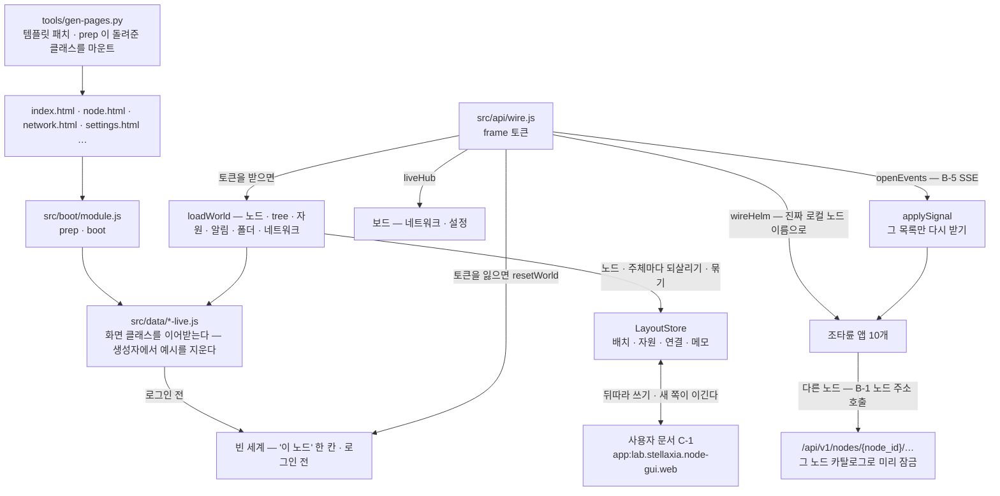
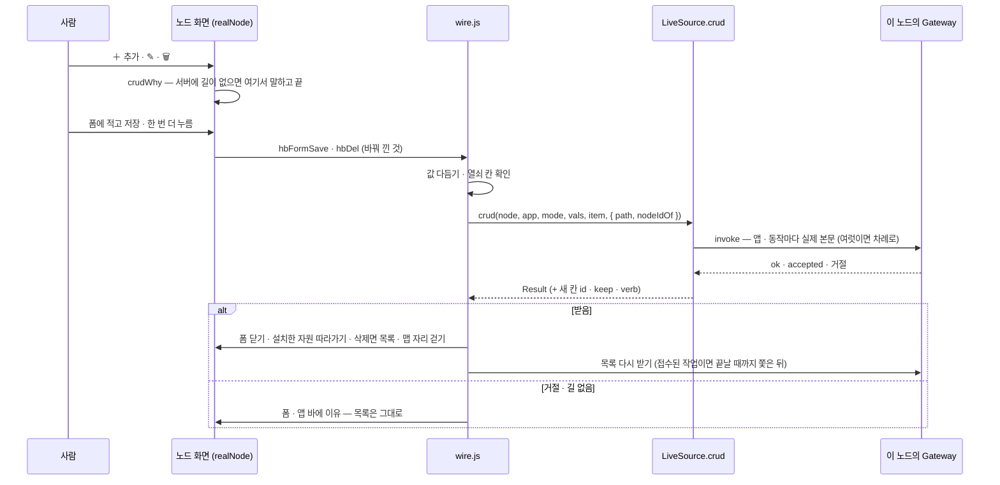
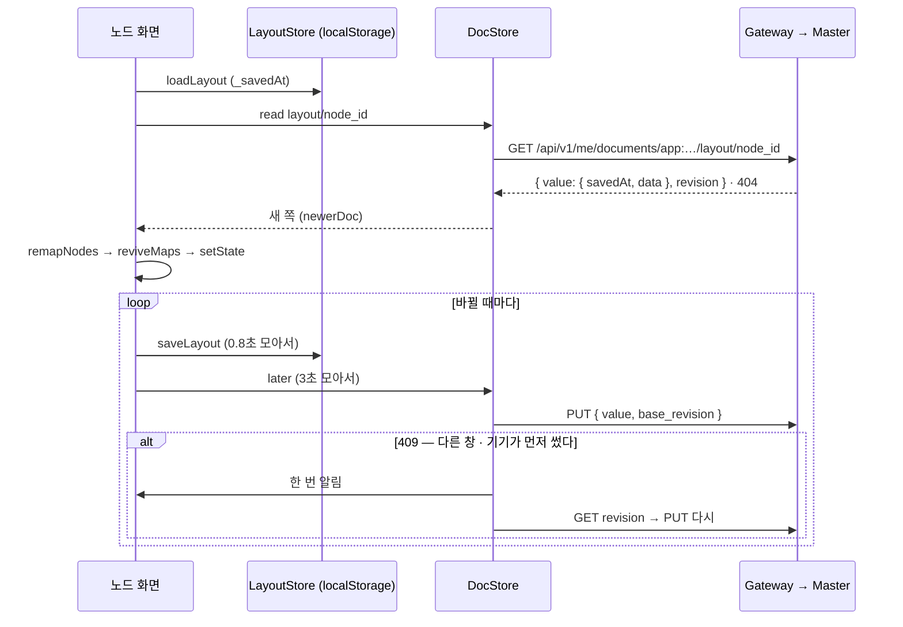
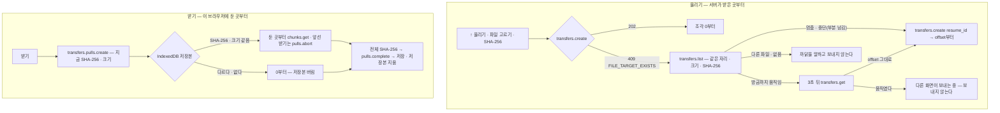

# 실데이터 층 — 예시 데이터를 지우고 이 노드의 값으로

프로토타입의 화면은 디자인 캔버스 원본(`design/*.dc.html`)에서 생성되고, 그 원본은 미리보기를 위해 **예시 세계**를 품고 있다 —
가짜 노드 29개(`edge-01` · `nas-01` · `tree-home` …), tree 6개, 알림 · 메모 · I/O 장치, 세션 띠의 `admin · 만료 21:40`,
네트워크 · 설정 보드의 가짜 mesh · 피어 · 계정 · 클러스터 사용자.

**출하되는 화면(모듈 `lab.stellaxia.node-gui`)에서는 예시가 한 번도 보이지 않는다.** 실데이터 층(`src/data/`)이 화면 클래스를
이어받아 첫 렌더 전에 예시 상태를 지우고, Terra 에서 읽은 이 노드의 값으로만 채운다. 진짜 출처가 없는 것은 **비워 두고 이유를 말한다** —
예시로 채우지 않는다.

> [!IMPORTANT] 원본은 그대로 둔다
> `design/*.dc.html` 과 생성물 `src/screens/*.js` 는 고치지 않았다. 디자인 캔버스 미리보기에는 예시가 필요하고, 생성물은
> 다시 생성되면 덮어쓰이기 때문이다. 그래서 예시 상수는 번들 코드에 **문자열로 남아 있지만** 생성자에서 덮어쓰여 화면에도,
> 요청에도 나가지 않는다(시험이 그것을 지킨다 — §7). 코드에서까지 지우려면 원본 미리보기와 따로 가야 한다(§8).

## 1. 세 겹



| 겹 | 자리 | 하는 일 |
| --- | --- | --- |
| 생성기 | `tools/gen-pages.py` `MODULE_TPL` · `MODULE_BETWEEN` | 페이지가 부트 프로필의 `prep(이름, Screen)`이 돌려준 클래스를 마운트한다. 템플릿에 박힌 예시 글자를 바인딩으로 바꾸거나 뺀다 — 세션 띠 `admin` · `만료 21:40 · 권한: …` → `{{who.*}}`, `예시 데이터` 배지 · `· 예시` 삭제, 보드의 "시연" 스위치 · 상태 시연 선택 · `재시작함 (시연)` 정리, 시작 화면의 아이디 · 비밀번호 판 → 세션 줄 + [Terra 로그인]. 대상이 정확히 한 번 있어야 하고, 아니면 생성이 멈춘다 |
| 부트 프로필 | `src/boot/module.js` · `src/boot/fixes.js` | 화면 이름 → 이어받은 클래스(`prep`), 띄운 직후의 배선(`boot` — 노드 화면 `wireFromUrl` · 시작 화면 `bootIntro`). 공통 보정(빈 맵 해안선 · leaf 맵 자기 칸) — [[module-profile\|모듈 프로필]] |
| 이어받은 클래스 | `src/data/node-live.js` · `network-live.js` · `settings-live.js` · `editors-live.js` | 생성자에서 예시 상태를 비우고, 예시를 돌려주던 메서드(`hbSeed` · `hbTick` · `hbPerm` · `FBDATA` · `utilInfo` · `renderVals` …)를 바꾼다 |
| 배선 | `src/api/wire.js` · `src/api/events.js` · `src/data/live-host.js` | 토큰을 받으면 카탈로그 → `loadWorld`(+ LayoutStore 되살리기 · 사용자 문서) → `wireHelm`(진짜 로컬 노드 이름) → 실시간 이벤트(B-5 SSE — §2.6). 이벤트가 열려 있으면 신호가 다시 받기를 맡고, 폴링(알림 · 설치한 노드 자원의 앱 목록 `pollSec` · 네트워크 그 3배)은 여섯 배 느린 바닥으로 남는다. 보드는 같은 창의 클라이언트를 `liveHub` 로 빌린다. 시작 화면이 미리 읽은 노드 화면은 시작 화면의 frame 연결을 빌린다(`frame-boot.js` `borrowFrame`) |

## 2. 무엇을 어디서 읽나

### 2.1 노드 화면

| 영역 | 출처 | 로그인 전 |
| --- | --- | --- |
| 이 노드(로컬 노드) | `terra.daemon.node.get` — `device_name` · `node_id` | `이 노드` (화면 글) |
| 부모 tree | `terra.daemon.enrollment.status.get` 의 `master_url` → `tree · 호스트:포트` | 없음 |
| 맵의 노드 | `GET /api/v1/agent/nodes`(Master 세션) — 평평한 목록이라 **전부 tree 의 자식**으로 둔다. 둘레 두 겹(18칸)을 넘으면 바깥 겹, 그래도 넘치면 편집 창의 "새 노드" | — |
| 처음 맵 | **이 노드의 맵**(leaf GUI) — 조타륜이 곧장 이 노드의 자원을 다룬다. 조타륜을 내리면 부모 tree 맵 | 같다 |
| 시작 화면 | frame 세션 — 토큰 · `session` 값, 주체는 `GET /api/v1/agent/whoami`. 토큰이 있으면 곧장 내려간다 | 판에 [Terra 로그인] |
| 맵 배치 · 꾸미기 · 노드 모습 | LayoutStore — 이 브라우저(노드 · 주체마다) + 사용자 문서 `layout/<node_id>`(§2.8, 새 쪽이 이긴다). 처음엔 화면의 기본 맵(육각 61칸 · 꾸미기 없음) | 기본 맵 |
| 설치한 노드 자원 · 연결 · 도로 | 자리 · 연결은 LayoutStore. 상태 점 · 이벤트 · 자원 설정 창의 모니터링 값은 **원본 앱 목록**(조타륜 앱과 같은 operation) — 그 앱이 닫혀 있어도 `pollSec`마다 | 없음 |
| 노드 필드의 이벤트(동작 · 정지) | Master 의 노드 `status` — `offline` 이면 `auth: offline` → 건물에 정지 이벤트 | — |
| 세션 띠 | frame 값의 `principal` · 토큰 권한(`terra.permissions()`) | `로그인 전` |
| 관리하는 자원(속성 창) | `io.devices.get` · `files.list.get` · `modules.get` 의 개수 | 없음 |
| 알림 | `terra.daemon.tasks.get` — 신호 `terra.tasks.changed`(§2.6)마다, 이벤트가 없으면 10초마다. 새로 생기거나 상태가 바뀐 작업 | 없음 |
| 유틸 카드 · 창 요약 | 위 값 + `config.schema.get`(키 수) · `wireguard.status.get` · `service-tunnels.get` · 화면 자산 수(설계도 · 스킨 · 자재) | `—` |
| 폴더 보관함 › Terra 저장소 | `io.terra.file.roots.list` → 들어가면 `io.terra.file.entries.list` | 비어 있음 |
| 폴더 보관함 › 폴더 탐색기 | `terra.daemon.local-fs.roots.get` → 들어가면 `local-fs.entries.get {root, path?, limit: 500}`(B-11, `file.read`). Daemon 이 닫은 폴더(`readable: false` — 자기 데이터 폴더 등)는 🔒 + 이유. 파일 = 그 노드의 로컬 프로그램으로(`desktop.open.post {action: open}`), `파일 관리자로` = 지금 폴더(`reveal`) — B-12 · `node.control` · 그 컴퓨터에서 이 화면을 볼 때만(앱 origin 이 `*.localhost`) | 비어 있음 |
| 폴더 보관함 › 메모장 | LayoutStore — 이 브라우저 + 사용자 문서(§2.8) | 화면 메모리(로그인하면 저장본으로) |
| tree 목록(관리 노드 창) | 없음 — 사용자가 등록한 연결 목록을 둘 곳이 없다. 다른 tree 로 가는 길도 없다(`beginSwitch` 가 막는다) | 같다 |

### 2.2 조타륜 앱 — 이 노드에서

| 앱 | 목록 | 동작 |
| --- | --- | --- |
| I/O 장치 | `terra.daemon.io.devices.get` | 승인 · 거부 · 켜기 · 끄기 · 잊기 · 스캔(결과를 `스캔 — 장치 n · 새 · 바뀜 · 사라짐`으로) (`node.control`). `＋ 추가` = 카메라 주소로 손 등록(§2.4). 고치기 · 삭제는 §2.4 |
| 공유 폴더 | `files.list.get` + 들어간 경로 · **맵에 설치한 칸 · 상태 화면이 보는 칸의 위 칸**까지 단계마다 `io.terra.file.entries.list`(겹치는 단계는 한 번) | 들어가기 · `+ 폴더`. 추가(폴더 · 빈 파일) · 이름 바꾸기 · 지우기는 §2.4. 파일 카드의 `받기` = §2.9 |
| 파일 전송 | `io.terra.file.transfers.list` | `↑ 올리기` = 파일 고르기 → 조각 전송(§2.9) · 중단(`transfers.abort` · 부분 파일 남김) |
| 서비스 터널 | `service-tunnels.get` | 닫기(`by-tunnel-id.close.post`). `+ 즉석 열기`는 폼을 연다 — 여는 것 · 선언은 Master(§2.4) |
| WireGuard 피어 | `wireguard.status.get` 이 꺼져 있으면 부르지 않는다, 켜져 있으면 `wireguard.peers.get` | 동기화. 회수는 Master — 본문은 두 끝(`source_node_id` · `target_node_id`) |
| 자원 선언 | `svi.declarations.get` — 요약 줄은 울타리(`envelope.process` · `max_declarations`) | `+ 선언` · `다시 선언`은 폼을 연다. 선언 · 철회는 `node.config`★ — 앱이 선언하지 않은 권한이라 잠기고, 그 op 들이 게이트웨이 카탈로그에도 없다(§5.1) |
| 명령 · 작업 | `terra.daemon.tasks.get` (Master 작업 대신) — 카드의 `exit` 은 `result.exit_code` | `+ 실행` → 폼에 명령 → `terra.daemon.commands.execute.post`(202 · `task_id`를 끝까지 쫓는다) · 취소(`tasks.by-task-id.cancel.post`) · **출력**(§2.10 — 실행 중에도) · **다시**(두 번 누른다 → `tasks.by-task-id.rerun.post {task_id, confirmed: true}` — 이 노드에서 시작한 끝난 작업만) |
| 모듈 | `modules.get` + 게이트웨이의 설치된 GUI 앱(`GET /api/v1/gui/apps`, 공개) — 앱이 있는 모듈은 `GUI 제공` · 주소(`route`). Scene 모듈은 프로세스가 없어 `멈춤` + "화면만 기여한다" | 시작 · 멈춤 · 재시작(`terra.daemon.modules.by-module-id.*`, `node.control`) · 로그 → **상태 화면의 출력 칸**(이 노드 `terra.gateway.modules.by-id.logs.get { logs }` · 다른 노드 `terra.daemon.modules.by-module-id.logs.get { lines: [{at, stream, text}] }` — 두 흐름이 섞이면 stderr 줄에 `! `. Go 모듈은 다 stderr 라 표시하지 않는다) · GUI 창(§2.5) |
| SVI 자원 · 허가 | Master — `쓸 수 없다 · 이 노드의 게이트웨이에 없다`. 그 앱을 보는 동안 이 글이 남는다(원본 글줄은 2.6초 뒤 지워진다 — UP-24). SVI 자원 앱 창은 **흐름도**(maingui A-28 — 카드 보기와 바꾼다) — 앱 토큰으로는 빈 흐름도 + 이 글이고, 예시 흐름 이벤트는 돌지 않는다 | Master 에 닿으면(PF-1): 흐름도 = 자원 → 엔드포인트 → 열린 핸들 · 바인딩 · 허가(`svi.handles.get` · `svi.bindings.get` · `svi.grants.get`), 상태 화면이 보는 자원 · 맵에서 연결된 자원의 핸들 흐름(SSE `svi.handles.by-handle-id.events.get` → 흐름 칸 `state.sviStream` · 맵 도로 `state.sviFlow` — `svi-live.js`, MD-24) |

이 노드의 권한은 토큰이 실제로 쥔 것(사용자 ∩ 앱)이다. 모듈 수명과 작업 취소는 Daemon 경로라 `node.control` 이 문이다 — 화면의
`모듈 관리★` · `취소` 자물쇠를 `node.control` 로 푼다. 다른 노드는 노드 주소 호출(§2.7)로 그 Daemon 에 닿을 때 같은 권한(`관리자 · 중계`)이고,
`node_id` 를 모르는 이름(부모 tree 등)이나 그 길이 없는 게이트웨이면 `닿지 않음`이다.

### 2.3 보드

| 보드 | 진짜 값 | 닿지 않음(이유를 보인다) |
| --- | --- | --- |
| 네트워크 | 로컬 WireGuard(상태 · 설치 계획 · 피어 · 동기화 · 보고 · 올리기/내리기 · 관리형 키 교체), 로컬 서비스 터널(닫기) — 10초 폴링 | 사설망 · 연결 진단 · 라우팅 · 조작 이력 — Master operation. 역할(tree · leaf)은 시연 전환이 아니라 **카탈로그**로 정한다 |
| 설정 | 로컬 노드 135키(`config.get` 값 · `config.schema.get` 소유 · 반영 · `deviations[]`), 저장은 `config.patch {set, save: true}` 키 하나씩(켜기 키는 마지막), 계정(`GET /api/v1/agent/whoami`), 로컬 자원(공유 폴더 · SVI 선언 · I/O 장치 승인 · 모듈 동의) | 클러스터 · 서버 탭 — Master. 위임 자격 목록 — list operation 이 없다 |
| 편집기 | 기본 라이브러리(자재 m1–m22 · 필드 스킨 · 설계도)는 자산이라 남긴다 | 사용자 작품 예시(커스텀 자재 `나무 울타리` · `삽` · `횃불`, 금속 판의 예시 전용 부모 디자인)를 뺀다 |

설정의 키 표(`GROUPS`)는 문서에서 옮긴 자산인데, 실제 `terra.daemon.config.schema.get` 과 **135키 · 소유 · 반영 · 타입이 모두 같다**(2026-10-03 대조).
읽을 때마다 스키마 값으로 소유 · 반영을 다시 맞춘다. 객체 목록 키(`storage.shared_dirs` = `[{name, path}]`)는 입력 칸 하나로 고칠 수 없어 읽기만 한다.

### 2.4 추가 · 수정 · 삭제 — 조타륜 앱 창 · 상태 화면

원본(maingui)은 앱 전체 화면에 `＋ 추가` · 카드마다 `✎` · `🗑`(두 번 누름) · 상태 화면의 수정 · 삭제를 더했다. 원본의 저장은
자기 목록에 항목을 **지어 넣는다**(디자인 시연 · 서버에 길이 없을 때도). 이 층은 지어내지 않는다:

- 폼 저장(`hbFormSave`) · 두 번째 누름(`hbDel`)을 `wire.js`가 **실제 호출**(`source.crud` → `operations.js` `HELM_CRUD`)로 바꿔 끼운다.
  값은 원본 저장과 같은 규칙으로 다듬는다(글 앞뒤 빈칸 · 수 · 열쇠 칸이 비면 부르지 않는다).
- 서버가 받으면 폼을 닫고 **목록을 다시 받아** 보인다. 받지 않으면 폼에 이유를 적는다 — 목록은 그대로다.
- 서버에 길이 없는 것(아래 `—`)은 폼 · 확인 대기를 **열기 전에** 그렇다고 말한다(`node-live.js` `crudWhy`). 연결 전(로그인 전)의 저장은 `Terra에 연결되지 않았다`.
- 삭제가 항목을 없애면 화면의 두 번째 누름 처리로 목록 · 맵 자리 · 연결을 걷는다. 상태만 바뀌는 것(작업 취소 · 선언 철회 · 전송 중단)은 그대로 두고 다시 받는다.
- 고치면 맵에 설치한 자원 · 상태 화면이 새 이름(장치 별명) · 새 칸 id(폴더 이름 바꾸기)를 따라간다.
- 값을 적어야 하는 앱 바 동작(`+ 선언` · `+ 허가` · `+ 즉석 열기` · `+ 실행` · `다시 선언`)은 앱 전체 화면의 폼을 연다(`acts.*.form`).

| 앱 | 추가 | 수정 | 삭제 |
| --- | --- | --- | --- |
| I/O 장치 | 손 등록 `terra.daemon.io.devices.post {kind: camera, name, adapter_id, address}` — 주소의 scheme 이 어댑터를 고른다(`rtsp` · `rtsps` → `manual.rtsp`, `http` · `https` → `manual.http-camera` — io-inventory 수동 원천). 주소를 비우면 `io.scan.post {}`(스캔이 찾는다), 모르는 scheme 은 부르지 않는다 | 바뀐 것만 차례로: `io.devices.by-device-id.alias.post {device_id, alias}` · `approve` · `deny` · `enable` · `disable`(`{device_id}`). 종류는 못 바꾼다 · 승인 대기로 되돌리는 op 는 없다 · 하나가 실패하면 거기서 멈춘다 | `io.devices.by-device-id.forget.post` (잊음) |
| 공유 폴더 | 폴더 `io.terra.file.entries.mkdir {root, path}` · 파일 `entries.write {root, path, data: '', exclusive: true}`(빈 파일 — 있으면 거절). 공유 폴더(맨 위 칸) 자리에는 만들지 않는다 | `entries.rename {root, path, to}` — 같은 공유 폴더 안. 이름에 `/` 는 안 된다 | `entries.remove {root, path, recursive}` — 폴더면 recursive. 공유 폴더 자신은 지우지 않는다 |
| 파일 전송 | — 폼이 아니다: 올리기는 머리의 `↑ 올리기`, 받기는 공유 폴더 파일 카드의 `받기`(§2.9) | — | 도는 전송 · 중단해 둔 전송은 포기 `transfers.abort {transfer_id, keep_partial: false}`, 끝난 전송은 화면에서만 치운다 |
| 서비스 터널 | Master — 선언 `terra.master.service-tunnels.declarations.post` · 즉석 `service-tunnels.open.post`, 본문 `{source_node_id, target_node_id, target_port, local_bind_host, local_port}`(대상은 맵의 노드 이름 → `node_id` · loopback 만) | — 지우고 다시 | 즉석 `terra.daemon.service-tunnels.by-tunnel-id.close.post` · 선언은 Master `declarations.by-declaration-id.delete` |
| WireGuard 피어 | — mesh 가입으로 생긴다 | — | Master `network.mesh.wireguard.peers.revoke.post {source_node_id, target_node_id}` — 공개 키뿐인 피어는 못 한다 |
| 명령 · 작업 | 이 노드 `terra.daemon.commands.execute.post {command, args}` · 다른 노드 Master `commands.post {target_node_id, type: process.execute.request, payload}` — 명령 실행은 Daemon 이 원격으로 열지 않는다(`localOnly`) | — 고치기가 아니라 다시 실행(§2.10) · 바뀐 명령은 `+ 실행` | `tasks.by-task-id.cancel.post {task_id}` — 다른 노드도 노드 주소 호출로 그 Daemon 의 작업을(§2.7). 길이 없으면 Master `commands.post {process.cancel.request}`. 목록에 남는다 |
| 자원 선언 | `terra.daemon.svi.declarations.post` — 평평한 선언 `{family, name, direction, command · args / path / address}` | 같은 op + `replace`(퇴역한 이름은 `reuse_name`). 계열 · 이름은 못 바꾼다 | `svi.declarations.by-family.by-name.undeclare.post {family, name}` — 퇴역 원장에 남는다 |
| 허가 · 연결 | Master `svi.grants.post {subject_id, resource_id, operations[], ttl_seconds}` | — 철회 뒤 다시 | Master `svi.grants.by-grant-id.delete` · 바인딩 `svi.bindings.by-binding-id.delete` · 맵의 연결을 적용하면 `svi.bindings.post`(일곱 키) · 공유는 `svi.grants.post {subject_type: node}` — `src/api/link-apply.js`(MD-28 · 설계 [[io-link-svi-binding-design\|입출력 연결 설계]]) |
| 모듈 | — 설치 op 가 없다(노드 지정은 Master — PF-14) | **모듈 설정**(B-6 설정 · maingui A-29) — 폼을 열기 전에 `terra.daemon.modules.by-module-id.config.schema.get` · `config.get`(`node.read`)으로 칸 · 값을 받아 항목에 붙인다(`item.cfg` — `cfgForm`: 수 · 고르기 · 예/아니오 · 글 · 비밀). 저장은 `config.patch {module_id, values, unset, base_revision}`(`module.manage`★) — 바뀐 키만(`cfgPatch`), 비운 칸은 `unset`(기본값으로), 비밀은 적었을 때만. 거절은 키를 적는다(`error.detail.keys`) · 겹치면 409 · 설정을 선언하지 않은 모듈은 폼을 열지 않고 그렇다고. 다른 노드는 노드 주소 호출 | — 제거 op 가 없다 |
| SVI 자원 | — 선언에서 생긴다 | — | — |

본문은 서버 코드에서 확인했다 — Daemon local API(`DisallowUnknownFields`) · Master 라우트(`decodeJSON` — 모르는 키 거절) · `io.terra.file` 계약
(`additionalProperties: false`). 게이트웨이 invoke 는 경로 자리(`{device_id}` …)를 채우고 본문에서 뺀다(`resolvePathParameters`).
그래서 Master 의 **본문이 있는 호출(POST)에는 `node_id` 를 싣지 않는다** — 읽기 · 지우기(GET · DELETE)만 query 로 싣는다.

폼 · 상태 화면의 `API` 줄은 이 모듈이 실제로 부르는 것(`CRUD_TEXT`)이고, 이 노드의 게이트웨이 카탈로그에 없는 op 는 `⚠ 이 노드의 게이트웨이에 없다`
(일부만 없으면 `⚠ 없음: …`)로 적는다. 원본의 자리 표시자에 있던 예시 이름(`nas-01` · `100.80.0.12` …)은 중립 글로 바꿨다.



### 2.5 상태 화면 · 모듈 GUI 창

| 창 | 진짜 값 | 바꾼 것 |
| --- | --- | --- |
| 상태 화면(`ⓘ` · 노드 칸 · 도로 칸) | 자원 = 원본 앱 목록의 그 항목(흐름 단계 · 키 · 카드 동작) — 맵에 없어도 그 앱 목록을 `pollSec`마다 다시 받는다. 노드 = 관계도 · 이 노드의 권한 · 공유 목록(맵 연결로 계산) | 노드 칸의 **로그인** 줄 — 원본은 `auth` 가 없으면 `로그인됨`이라 로그인 전에도 그렇게 그린다. 이 층은 `로그인 전` · `로그인됨 — 이 화면의 세션` · `오프라인` · `이 화면은 닿지 않는다`. 조회 API 는 게이트웨이 경로(`/api/v1/agent/whoami` · `/api/v1/agent/nodes`) |
| 모듈 GUI 창(`🖥`) | `/api/v1/gui/apps` 의 앱(`moduleId` · `route`) — 이 노드에 실제로 설치된 GUI | 원본은 "모듈이 제공하는 화면이 이 창 안에 뜬다 (iframe)"라고 그린다. 다른 모듈의 앱은 이 창에 **띄울 수 없다** — 앱마다 origin · 스코프 토큰이 따로고 `terra.web/frame` 은 자기 모듈의 앱만 감싼다. 그래서 창은 주소와 함께 "셸의 앱 목록에서 연다"를 적는다. 이 모듈 자신이면 "지금 보고 있는 이 화면", Scene 모듈은 `멈춤` 대신 `화면 모듈` |
| 메모장 | LayoutStore(이 브라우저 + 사용자 문서 §2.8) | 원본의 경로 글 `~/.terra/memos/` → `메모/` · 설명 글이 어디에 저장되는지 말한다 |

### 2.6 실시간 이벤트 — B-5 SSE (`src/api/events.js`)

이 노드 Daemon 의 `terra.daemon.events.get` 을 게이트웨이 invoke + `Accept: text/event-stream` 으로 연다. EventSource 는 Authorization 을 싣지 못해
fetch 스트림으로 읽는다(frame 의 `terra.fetch` 가 앱 토큰을 싣는다). 신호는 알림뿐이다(무엇이 바뀌었는지 id 만) — 받으면 그 목록을 다시 읽는다.

| 신호 | 다시 읽는 것 |
| --- | --- |
| `terra.tasks.changed` | 알림(`tasks.get`) · 명령 · 작업 앱 |
| `terra.io.devices.changed` | 자원 요약 · I/O 장치 앱 |
| `terra.modules.changed` | 자원 요약 · 모듈 앱 |
| `terra.svi.declarations.changed` | 자원 선언 · SVI 자원 앱 |
| `terra.service-tunnels.changed` · `terra.wireguard.changed` | 네트워크 요약 · 서비스 터널 · WireGuard 앱 |
| `terra.config.changed` | 설정 키 수 |
| `reset`(이어 받을 자리를 놓쳤다) | 다 |

- 0.25초 모아서 한 번 읽는다(`applySignal`). 조타륜 앱은 **받아 둔 목록만** 다시 받는다(`_hbRefresh`) — 열지 않은 앱을 신호가 열지 않는다.
- 끊기면 1 → 2 → 4 … 30초 뒤 `last_event_id` 로 이어 받는다(게이트웨이는 입력을 질의 문자열로 넘긴다 — 머리글은 넘기지 않는다). 401 · 403 · 404 · 406 · 501 이나 여섯 번 실패면 끄고 폴링만 쓴다.
- 열려 있는 동안 폴링은 여섯 배 느린 바닥으로 남는다. 네트워크 유틸 카드의 `확인` 칸이 `실시간 · 이벤트`가 된다.

### 2.7 다른 노드 — B-1 노드 주소 호출

다른 노드 맵에 설치한 자원 · 상태 화면 · 조타륜 앱이 그 노드의 Daemon 을 부른다 — `POST /api/v1/nodes/{node_id}/operations/{id}/invoke`(Master 가 중계하고 대상 Daemon 이 자기 계약으로 다시 판정한다).

- `node_id` 는 관계도(`NET[이름].id`)에서 — 모르는 이름(부모 tree 등)은 부르지 않는다(`no-node-id`).
- 그 노드의 카탈로그(`GET /api/v1/nodes/{node_id}/catalog` — 60초 캐시)에 있는 것만 부른다. 누르기 전에 잠근다(`lockFor` — `그 노드가 이 기능을 원격으로 열지 않았다` · `allowed: false` 면 `권한이 없다`). 카탈로그가 오면 자물쇠를 다시 그린다.
- 원격으로 열린 것(`availability.scopes` 에 `cluster` — Daemon 계약 70개 중 47개): I/O 장치 · 모듈(로그 포함) · 작업 목록 · 기록 · 취소 · 자원 선언 · 서비스 터널 목록 · 닫기 · WireGuard. 열리지 않은 것: 명령 실행 · `local-fs` · `desktop.open` · 재시작 · 이벤트 · 설정 쓰기.
- **모듈 op**(`io.terra.file` — scopes `local` · `node`)는 노드 카탈로그에 없다 — 원격 모듈 경로 `/api/nodes/{node_id}/modules/io.terra.file/v1/…`로 부른다(`client.invokeModuleAt` — Master 중계). 경로는 카탈로그의 `bindings`(이 노드에 io.terra.file 이 없으면 대응표 `fileBinding`), `{transfer_id}` 자리는 채우고 GET · DELETE 는 나머지를 query 로(`fillRoute`). 그래서 다른 노드의 공유 폴더 안 · 전송 · 올리기 · 받기 · 지우기도 된다.
- 게이트웨이 op 는 그 노드 카탈로그에 없다 — 모듈 로그는 다른 노드면 그 Daemon 의 `modules.by-module-id.logs.get` 으로(`remote`).
- 앱 토큰은 Master 에 닿지 않는다(PF-1) — 다른 노드의 작업도 그 Daemon 의 작업 목록으로 본다(`daemonView`). Master 의 길 오류(`NODE_OFFLINE` · `RELAY_NOT_CONNECTED` · `DELEGATION_REQUIRED` · `NODE_NOT_FOUND`)는 화면 글로 옮긴다.

### 2.8 사용자 문서 저장소 — C-1 (`src/store/docs.js`)

`config.json` 의 `layoutStore: server`(기본)면 LayoutStore 를 브라우저에는 지금처럼 바로, 사용자 문서 저장소에는 뒤따라(3초 모아서) 쓴다.

| 항목 | 내용 |
| --- | --- |
| 이름공간 | `app:lab.stellaxia.node-gui.web` — whoami 의 `delegate`(앱 id). 앱 토큰이면 게이트웨이가 이 이름공간으로 고정한다(다른 이름공간은 403) |
| 키 | `layout/<node_id>` — 맵 배치 · 모습 · 노드 자원 · 연결 · 메모 · 표시 설정 · 창 자리(노드마다) · `assets` — 건물 · 도로 설계(`terra.gui.buildings` · `terra.gui.roads`) |
| 값 | `{ version: 1, savedAt, data }` — 읽을 때 `savedAt` 이 새 쪽이 이긴다(브라우저 저장본은 `_savedAt`). 서버 것을 받으면 브라우저 저장본도 그 시각으로 적는다 — 같은 것을 다시 올리지 않는다 |
| 쓰기 | 바뀐 것이 있을 때만(`bindLayout` 이 견준다). 쓰기마다 `base_revision` — 다른 창 · 기기가 먼저 썼으면 409 → 한 번 알리고 지금 판 위에 다시 쓴다(마지막에 고친 화면이 이긴다) |
| 자산 | 편집기가 내보내면(다른 문서의 `storage` 이벤트) 2초 모아 `assets` 로. 로그인하면 서버 것이 새로우면 받아 노드 화면이 다시 굽는다(`_onStore`) |
| 없으면 | 없음(404)은 저장소가 있다는 뜻 — 처음 쓰기가 만든다. 그 밖의 실패(Master 연결 없음 501 · 403 …)면 이 세션은 브라우저에만 둔다 · 쓰기 실패는 한 번 알린다 |
| 경로로 | `GET · PUT /api/v1/me/documents/{namespace}/{key}` — 게이트웨이 자기 op 를 invoke 로 부르면 앱 토큰의 호출자가 빠진다(PF-10 · Terra#118). 병합되면 operationId 로 바꿔도 된다 |
| 끄기 | `layoutStore: local`(브라우저에만) · `none`(저장 안 함) |



### 2.9 파일 올리기 · 받기 (`source.upload` · `source.download`)

| | 순서 | 검사 |
| --- | --- | --- |
| 올리기 | 파일 전송 앱 `↑ 올리기` → 파일 고르기 → `transfers.create {direction: push, path, size_bytes, checksum_sha256, mode: create}` → `transfers.chunks.put {transfer_id, offset, data}`(조각마다 base64 · 최대 512 KiB) → `transfers.complete` | 전체 SHA-256 은 화면이 계산해 싣고 모듈이 끝에서 견준다. 조각이 어긋나면(409) `transfers.get` 의 `offset` 부터 다시(다섯 번까지) |
| 받기 | 공유 폴더 파일 카드 `받기` → `transfers.pulls.create {root, path}` → `transfers.chunks.get {transfer_id, offset}`(eof 까지) → `transfers.pulls.complete` → 브라우저 저장(`a[download]` — frame 은 `allow-downloads`) | 조각마다 SHA-256 · 끝에서 전체 SHA-256 을 서버의 것과 견준다. 어긋나면 `transfers.pulls.abort` 로 닫고 저장하지 않는다 |

SHA-256 은 직접 계산한다(`sha256.js` — maingui 와 같은 코드). `crypto.subtle` 은 한 번에 다 넣어야 하고 https 가 아닌 사설망 주소에서는 아예 없다.
받기는 io.terra.file 0.2.0(modules #24 — `transfers.pulls.*`)이 있어야 한다. 그 op 가 카탈로그에 없으면 누르기 전에 잠근다.

**끊긴 뒤 이어서(MD-21)** — 페이지를 닫았다 다시 열어도(다른 브라우저여도) 올리기 · 받기를 잇는다.

| | 무엇이 남나 | 어떻게 잇나 |
| --- | --- | --- |
| 올리기 | 서버에 부분 파일과 전송 기록(checkpoint — `offset`). 같은 파일을 다시 올리면 새로 만들기가 `FILE_TARGET_EXISTS` 다 | 그 자리(`root` · `path`)에 크기 · SHA-256 이 같은 전송을 `transfers.list` 에서 찾아 `transfers.create {…, resume_id}` 로 다시 연다 — 서버가 받은 곳부터. 방금까지 움직인 것은 3초 뒤 `transfers.get` 으로 다시 보고 `offset` 이 그대로면 잇는다(닫고 곧바로 다시 올릴 때). 보내는 사이 기한이 지나도(`TRANSFER_EXPIRED`) 같은 전송을 다시 연다 |
| 받기 | 이 브라우저의 IndexedDB `terra.gui.parts`(`src/store/parts.js`) — 조각마다 SHA-256 을 견준 뒤에만 둔다. 키 = `<node_id>\|<공유 폴더>/<경로>` | 다시 받으면 새로 연 받기의 SHA-256 · 크기가 저장본과 같을 때 둔 곳부터 `chunks.get`. 다르면 그 사이 파일이 바뀌었다 — 저장본을 버리고 처음부터. 앞서 받다 만 전송은 `pulls.abort` 로 닫고, 다 받으면 저장본을 지운다. 이레 넘게 손대지 않은 저장본은 지운다 |
| 전송 앱 카드 | 서버 상태가 `prepared` · `transferring` 인데 보내는 쪽이 없으면(기한이 지났다 · 기록이 60초 넘게 그대로 · 이 화면이 15초 넘게 지켜봤는데 `offset` 이 그대로) **멈춤** — 디자인의 `어긋남` 칸에 두고 이유를 적는다(`멈췄다 · 31%에서 보내던 화면이 닫혔다 — …`) | 카드의 `이어서` — 올리기는 파일을 고르게 해 크기 · SHA-256 이 그 전송의 것일 때만 잇는다(이름은 달라도 된다), 받기는 다시 받는다. `중단` = 부분을 남기고 멈춘다(`중단됨` · `중단 · 31% 남겨 둠 — 같은 파일을 다시 올리면 거기서부터`), `치우기` = 남겨 둔 부분 파일과 기록을 버린다 |



부분을 남기는 중단은 io.terra.file **0.2.1**부터다 — 0.2.0은 `keep_partial` 을 query 에서만 읽어, 게이트웨이 invoke(POST 입력은 본문으로 간다)로 보낸 중단이 늘 포기(부분 파일 삭제 · 기록 잊음)였다(§5.1).

### 2.10 작업 출력 · 다시 실행 — Terra PF-7 (`src/api/task-output.js`)

Daemon 이 명령 작업마다 출력의 꼬리(256 KiB — 노드 전체 32 MiB)와 원래 명세를 보관한다(Terra [`terra-node-task-output-design`](https://github.com/StellaxiaLab/Terra/blob/main/docs/modules/terra-gui/design/terra-node-task-output-design.md) · Terra#140 · Terra#144).
비밀처럼 보이는 값(`--password=…` · `TOKEN=…` · `Bearer …`)은 Daemon 이 보관하기 전에 가린다 — 화면은 받은 그대로 보인다.

| 동작 | op · 입력 | 권한 · 범위 | 화면 |
| --- | --- | --- | --- |
| 출력 | `terra.daemon.tasks.by-task-id.output.get {task_id, max_bytes: 262144}` → `{state, captured, chunks[{seq, stream, text}], last_seq, complete, dropped, more, result}` | `process.execute` · scopes local · cluster — 다른 노드는 노드 주소 호출(§2.7) | 상태 화면의 출력 칸. 두 흐름이 섞이면 stderr 줄에 `! ` · 노드가 버린 앞부분 · 끝 상태(`— 완료 · exit 0`) · 출력을 받지 않은 작업(`capture_output false`) |
| 따라가기 | 이 노드에서 실행 중이면 `…output.events.get {task_id, last_event_id: <읽은 last_seq>}` — SSE `output` · `gap` · `state` · `end` · `overflow` | `process.execute` · scopes local(이 노드만) | 받은 줄을 칸에 잇는다(초당 여섯 번까지 · 끝은 곧장). `end` 에 닫고 목록을 다시 받는다. 끊기면 받은 순번부터(`openEvents` 의 `last`). 칸이 다른 것을 보이거나 화면을 끊으면 닫는다 · 칸에는 끝 512 K 글자만 |
| 다시 | 두 번 누른다(`hbArm` — `정말 다시`) → `…rerun.post {task_id, confirmed: true}` → 202 `{task_id(새), rerun_of}` → 새 작업을 끝까지 쫓는다 | `process.execute` · scopes local — 다른 노드는 🔒(그 노드가 원격으로 열지 않았다) | Master 가 보낸 작업(`origin.kind: master`)은 부르지 않고 첫 누름에 이유. `TASK_STILL_RUNNING` · `TASK_SPEC_EXPIRED` · `TASK_NOT_RERUNNABLE` 은 화면 글(`client.js` `REASON`) |

카드는 실행 중에도 `출력` 을 둔다(생성기 `MODULE_JS` — UP-32). 이 노드의 출력 단추는 `process.execute` 가 없으면 잠긴다.

## 3. 비어 있는 것과 그 이유

| 비어 있는 것 | 이유 | 채우려면 |
| --- | --- | --- |
| Master 데이터(SVI · 허가 · SVI 흐름도 · 흐름 이벤트 · mesh · 사설망 · 진단 · 라우트 · 경로 정책 · 세션 · 연결 그룹 · 클러스터 · 다른 노드의 작업) | 앱 스코프 토큰은 Master 에 닿지 않는다 — 설계상 위임 경계. maingui 가 tree Gateway 로 읽게 된 것(A-20 네트워크 읽기 · A-28 흐름도)도 Master op 다 | 세션 중계를 Master operation 전체로 넓히는 ADR(모듈 README Q-2) |
| 다른 노드의 명령 실행 | Daemon 이 명령 실행을 원격으로 열지 않는다 · Master `commands.post` 는 PF-1 | PF-1 |
| tree 계층(손자 노드) | `agent/nodes` 에 부모 관계가 없다 | `terra.master.nodes.get` (위의 ADR) |
| 다른 tree 목록 | 사용자가 등록한 연결 목록을 둘 곳이 없다 | Q-3 — `kind: service` 로 올려 사람별 저장 |
| 다른 창 · 기기가 바꾼 배치를 곧장 받기 | 사용자 문서의 변경 신호(`terra.documents.changed`)는 Master 이벤트다 — 앱 토큰의 이벤트(이 노드 Daemon)에는 오지 않는다. 다음 쓰기의 409 알림 · 새로 고침에 받는다 | PF-17 |
| 입출력 연결의 실제 데이터 흐름 | 연결(`links`)은 화면의 선이다 — 무엇을 주고받는지는 디자인 · 데이터 모양이 없다 | 설정 화면 디자인 + SVI 바인딩 — 설계: [[io-link-svi-binding-design\|입출력 연결 ↔ SVI 바인딩 설계]] |
| 파일 열기 · 파일 관리자로 열기 — 다른 기계에서 볼 때 | Daemon 이 **그 노드의** 바탕화면에 연다 — 다른 기계의 브라우저에서는 뜻이 없어 누르지 않는다. 바탕화면 세션이 없는 노드(서버 · 컨테이너)는 `DESKTOP_SESSION_UNAVAILABLE` | — (설계대로) |
| Master 가 보낸 작업의 다시 실행 · 다른 노드의 출력 따라가기 | 출력 · 다시 실행은 열렸다(§2.10). Master 가 보낸 작업은 Daemon 이 다시 실행하지 않는다(409 `TASK_RERUN_VIA_MASTER` — Master 의 정책 검사 · 감사를 거쳐야 한다) — 앱 토큰은 Master 에 닿지 않는다. 출력 SSE 는 scopes local 이라 다른 노드는 한 번 읽기만 | PF-1 |
| 자원 선언 추가 · 철회 | op 셋(`svi.declarations.post` · `undeclare` · `forget`)은 계약에 있다. 카탈로그가 호출자 권한으로 거르는데 `node.config`★는 기본 권한 밖이라 앱 토큰에 안 보인다 — `쓸 수 없다 · 이 노드의 게이트웨이에 없다` | 앱 권한 · 사용자 권한에 `node.config`(Q-10 — PF-13 진단 정정) |
| 모듈 설치 · 제거 | 노드 지정(B-6 `nodes.by-node-id.modules.assignments.*`)은 Master op라 앱 토큰이 닿지 않는다(PF-1). 설정은 열렸다 — §2.4(MD-22) | PF-1 · PF-14 |
| 다른 모듈의 GUI 열기 | frame 은 자기 모듈의 앱만 감싼다 — 앱 안에서 다른 앱을 띄울 길이 없다 | 셸에 "앱 열기" 요청(PF-15) |

## 4. 로그인 · 로그아웃

- **로그인 전** — 빈 세계: `이 노드` 한 칸의 맵, 세션 띠 `로그인 전`, 조타륜 앱은 `로그인 필요` 자물쇠, 동작은 `Terra에 로그인해야 쓸 수 있다`.
  frame 의 띠는 *"Terra에 로그인하지 않았습니다 — 로그인하면 이 노드의 데이터가 보입니다"*.
- **토큰을 받으면** — 위 §2 를 읽는다. 권한이 달라질 때만 다시 붙는다(정기 갱신은 토큰 문자열만 바뀐다).
- **토큰을 잃으면** — 받아 둔 것을 다 지우고 빈 세계로 돌아간다. 예시로 돌아가지 않는다.
- **Terra 밖(npm run dev)** — 닿을 Terra 가 없다. 빈 세계 그대로다. 예전의 `?live=1` · 가짜 Gateway(`tools/mock-gateway.mjs`)는 예시 장치를 들고 있어 함께 뺐다.
- **시작 화면** — 로그인 전이면 판에 [Terra 로그인]이 선다 → 셸의 `/login` 카드 → 로그인하면 셸이 frame 을 처음부터 다시 띄우고, 토큰이 있으니 곧장 내려간다.
  셸을 새로 고치면 Scene 의 세션(memory Store)이 비어 다시 로그인한다 — 저장한 배치 · 자원 · 연결 · 메모는 LayoutStore 에 남아 되살아난다.
- **로그아웃** — LayoutStore 저장을 끊은 뒤 빈 세계로 돌아간다. 저장본은 지우지 않는다(다시 로그인하면 되살린다).
  서버(사용자 문서)로 모아 둔 쓰기 · 실시간 이벤트도 끊는다 — 브라우저 저장본이 더 새로우니 다음 로그인에 한 번 올린다.
  시작 화면도 노드 화면을 걷고 판(하늘 · 바다 · [Terra 로그인])으로 돌아온다 — 다시 로그인하면 다시 내려간다.

## 5. 실측 — 진짜 스택 위에서

2026-10-03. 진짜 Master · Daemon(등록) · 게이트웨이 · `io.terra.file` · `io.terra.io-inventory` 와 leaf UI 셸(Vite) 위에
포장물을 `terra module install --dev --force` 로 깔고 Chromium(Playwright)으로 돌렸다. 화면에 **보이는 글자 전체**(보드 iframe 포함)에서
예전 예시 표식(노드 이름 · 장치 · 메모 · 알림 · IP · `21:40` · `예시 데이터` · `시연` … 60여 개)을 찾았다.

| 단계 | 관찰 |
| --- | --- |
| 15개 상태(로그인 전 · 로그인 · 조타륜 10앱 · 폴더 보관함 · tree 맵 · 네트워크 3묶음 · 설정 5탭 · 자재 편집기 · 로그아웃) | 예시 표식 **0건** |
| 로그인 | 맵 `stack-leaf-01`, 부모 `tree · 127.0.0.1:28080`, 자원 `I/O 장치 3 · 공유 폴더 1 · 모듈 4`, 세션 띠 `admin@stack.local` · 토큰 권한 6개 |
| 조타륜 | I/O 장치 3(실제 승인 상태) · 공유 폴더 `share-0` → `docs/` · `hello.txt 12 B` · 모듈 4(Scene 2는 "화면만 기여") · WireGuard `terra0 · 꺼짐 · 피어 0` · 선언 `울타리 process off · 0/256` |
| 동작 | 폴더 만들기 → 디스크에 `새 폴더` 생김, 지우기 → 사라짐 · I/O 승인 → Daemon 이 `approved` · 모듈 상태 확인 · 작업 보기 |
| 알림 | 다른 길로 Daemon 작업을 하나 만들면 12초 안에 `process.execute.request · 완료` 알림 + 책갈피 1 |
| tree 맵 | 가운데 tree, 둘레에 `stack-leaf-01` |
| 네트워크 | `stack-leaf-01 · leaf GUI`, WireGuard 꺼짐 + 데몬이 준 설치 계획 4단계, Master 묶음은 "닿지 않음" |
| 설정 | `daemon.device_name = stack-leaf-01` 등 실제 값, `node.config★ 없음`이라 운영자 키는 잠김, 계정 = whoami(위임 앱 · 토큰 만료) |
| 로그아웃 | 빈 세계로 — `이 노드` · 예시 0건 |
| 콘솔 | 남은 오류는 셸의 `/api/product/session` 404(이 모듈과 무관)와 모듈 로그 500(아래) |

### 5.0 새 GUI(시작 화면 · 노드 자원 · 연결 · 도로) — 2026-10-04

같은 스택에 모듈 0.2.0(앱 entry = 시작 화면)을 깔고 Chromium으로 돌렸다. 화면의 모든 frame(시작 화면 · 노드 화면 srcdoc · 보드 srcdoc) 글자에서 예시 표식을 찾았다.

| 단계 | 관찰 |
| --- | --- |
| 로그인 전 시작 화면 | "Terra에 로그인하지 않았다" · [Terra 로그인] · 비밀번호 칸 **없음** · Gateway 줄 노랑(로그인 전) |
| [Terra 로그인] | 셸의 `/login` 카드 → 로그인 → frame 다시 띄움 → "admin@stack.local(으)로 들어가는 중…" → 구름 → 노드 화면(srcdoc · `mapFail` 없음) |
| 노드 화면 | 맵 `stack-leaf-01` · 부모 `tree · 127.0.0.1:28080` · 권한 6개 · 세션 띠 = 주체 |
| 노드 자원 설치 | I/O 카드 `Default camera` · `Default microphone`의 [📍 설치] → 빈 필드 → 자원 설정 창. 조타륜을 닫고 12초 뒤에도 모니터링 값이 원본 목록과 이어져 있다(`kind=microphone · presence=unknown · approval=pending · enabled=false`) |
| 연결하기 | 카메라 → 마이크, 길 찾기가 빈 필드 한 칸에 돌길을 깔았다 — 노드 자신의 칸(가운데)은 지나지 않는다 · 자원 설정 창 `입출력 연결 1` |
| 도로 편집기 | 보드(srcdoc)로 뜬다 · [노드 화면으로 내보내기] → 노드 화면 「도로 편집기에서 도로를 받았습니다」 |
| 네트워크 · 설정 · 건물 편집기 | 보드로 뜨고 실데이터 — CSP 거절 없음(`data-board`) |
| 새로 고침 | 다시 로그인 → 자원 2 · 연결 1 · 도로 1 · 메모 · 표지(`flat`)가 그대로 되살아난다 |
| 창 크기 1800×1050 | 화면이 창을 꽉 채운다(`scr` 1800×1050) — 잘림 없음 |
| 로그아웃 | 빈 세계 · 표시 설정 기본 · 저장본은 그대로 |
| 예시 표식 · 콘솔 | 모든 단계에서 **0건** · 남은 콘솔 오류는 셸의 `/api/product/session` 404(이 모듈과 무관) |

### 5.1 실측에서 드러난 플랫폼 사실

| 사실 | 이 층이 한 일 |
| --- | --- |
| `terra.gateway.agent.whoami.get` 을 **invoke 로** 부르면 호출자가 중계에서 빠져 `principal: anonymous` · 권한 0 이 온다. 경로 `GET /api/v1/agent/whoami` 는 맞게 답한다 | `TerraClient.get(path)` 로 경로를 부른다 |
| leaf 게이트웨이의 모듈 로그(`terra.gateway.modules.by-id.logs.get`)는 500 `MODULE_MANAGEMENT_FAILED — management action is not supported by the daemon local API` (2026-10-03) — Terra G0~G6(B-14) 뒤로는 200 | 상태 화면의 출력 칸에 보인다(§2.2) |
| `config.get` 의 `storage.shared_dirs` 는 객체 목록인데 스키마 타입은 `string_list` 다 | 읽기만으로 둔다 |
| WireGuard 통합이 꺼져 있으면 `wireguard.peers.get` 은 422 | 상태를 먼저 보고 꺼져 있으면 부르지 않는다 |
| 작업 기록(`tasks.by-task-id.get`)도 `job_id` 를 싣는다 | 상태(`state` · `status`)가 있으면 접수가 아니라 기록으로 읽는다 |
| 대응표의 게이트웨이 모듈 op 이름이 틀렸다(`modules.by-module-id.*` → 실제 `modules.by-id.*`, 재시작은 없다) | 이 노드의 모듈은 Daemon 경로로 |
| Master 의 본문 해석기(`decodeJSON`)는 모르는 키를 거절한다 — 원본 연동 층처럼 Master op 마다 `node_id` 를 본문에 실으면 POST 가 400 | 읽기 · 지우기만 `node_id` 를 query 로 |
| 게이트웨이 invoke 는 경로 자리(`{device_id}` …)를 입력에서 채우고 **본문에서 뺀다** | 경로 자리 키를 그대로 싣는다(`alias.post {device_id, alias}`) |
| Daemon 의 `POST /service-tunnels` 는 Master 가 발급한 경로 표(`decision` · `ticket`)를 받는 쪽이다 — 화면이 직접 열 수 없다 | 터널 열기 · 선언은 Master op |
| `GET /api/v1/gui/apps` 는 공개이고 앱마다 `moduleId` · `route` · `origin` · `embed` 를 준다 | 모듈 앱의 GUI 표시 |
| `terra.web/frame` 은 자기 모듈의 앱만 감싼다(`다른 모듈의 앱입니다`) | 모듈 GUI 창은 띄우지 않고 이유를 적는다 |
| `svi.declarations` 의 POST 계열(선언 · 철회 · 잊기)은 Daemon local API 에 있지만 게이트웨이 카탈로그에 없다 | `이 노드의 게이트웨이에 없다` |
| `terra.daemon.commands.execute.post` 는 `{command, args, working_dir, timeout_sec, env, capture_output}`만 받고 `202 {task_id}` | 이 노드의 실행은 Master 를 거치지 않는다 |
| (G0~G6 뒤) 사용자 문서 GET 은 없으면 404 `DOCUMENT_NOT_FOUND`, PUT 은 `base_revision` 없이 있는 문서를 쓰면 · 어긋나면 409 `DOCUMENT_REVISION_CONFLICT {current_revision}` | 없음은 "저장소가 있다"로 읽고 처음 쓰기가 만든다 · 409 는 한 번 알리고 지금 판 위에 다시 쓴다 |
| 노드 카탈로그는 Daemon 계약의 `availability.scopes` 에 `cluster` 가 있는 것만 — 이 스택에서 49개(Daemon 47 + 모듈). `io.terra.file` 은 scopes `local` · `node` 라 없다 | 그 노드 카탈로그로 누르기 전에 잠근다(§2.7) |
| Daemon 모듈 로그(`modules.by-module-id.logs.get`)의 줄은 글이 아니라 `{at, stream, text}` 다 — 게이트웨이 것은 글(`logs`) | 둘 다 글로 옮긴다(`logLines`) |
| `local-fs.roots.get` 은 Daemon 자기 폴더(데이터 · 설정 디렉터리)를 품은 루트를 `readable: false` · `reason: denied` 로 준다 | 🔒 + 이유, 누르면 들어가지 않고 그렇다고 말한다 |
| `desktop.open.post` 의 실행 파일 거절은 409 `DESKTOP_OPEN_EXECUTABLE`, 바탕화면 세션이 없으면 503 `DESKTOP_SESSION_UNAVAILABLE`, 여는 프로그램이 없으면 503 `DESKTOP_LAUNCHER_UNAVAILABLE` | 코드마다 화면 글(머리말 없이) |
| 손 등록(`io.devices.post`)은 주소로 장치 id 를 짓는다(`camera-manual-…` — 같은 주소면 같은 id) · 등록하면 `terra.io.devices.changed` 신호가 온다 | 신호로 I/O 앱 목록을 다시 받는다 |
| (Terra main `3195421`) 모듈 설정 op 셋은 Daemon 의 것이다 — 읽기 둘은 `node.read`, 쓰기(`config.patch`)는 `module.manage`★. `module.manage` 는 "어느 코드가 그 노드에서 도는지 바꾸는" 권한이라 **기본 권한 밖**이다 — 관리자에게도 없어 카탈로그가 `config.patch` 를 거르고, 관리자 토큰으로 바로 불러도 403 이다 | 앱 권한에는 이미 있다. 사용자에게 따로 주어야 저장이 열린다(Q-16). 없으면 폼은 열려 값을 보이고, 저장은 `🔒 저장 — module.manage★ 권한 없음(…) · 값은 볼 수만 있다`로 막는다 |
| (Terra main `3195421`) SVI 자원 · 허가 · 핸들 · 바인딩 · 흐름 이벤트는 모두 Master op(`terra.master.svi.*`)다 — Daemon 에는 선언(`svi.declarations.*`)뿐이다. 허가 목록은 `{items[{grant_id, subject{type, id}, resource_id, operations, created_at, expires_at?}]}`(기한이 없으면 `expires_at` 이 없다 — `routes_svi_grants.go` `sviGrantView`), 바인딩 목록은 `{items[{binding_id, source{resource_id, endpoint_id}, target{…}, source_node_id, target_node_id, desired_state, observed_state, reason, qos_profile}]}`(`BindingView`) | 허가 · 바인딩 어댑터를 그 모양으로 고쳤다 — 예전 키(`grants` · `subject_id` · `source_resource_id`)는 없는 키였다(MD-23). 앱 토큰으로는 빈 흐름도 + 이유 |
| maingui A-20 의 네트워크 읽기 다섯(`network.networks.get` · `network.probes.get` · `route.policies.get` · `route.sessions.get` · `connection-groups.get`)도 Master op 다 — tree Gateway 가 중계한다 | 네트워크 보드의 Master 묶음은 그대로 `Master operation — 이 화면에서 닿지 않음` |
| 설정 스키마는 Daemon 이 키를 정렬해 준다(Go map) — 폼 칸은 키 이름 순서다. 기본값은 값에 채우지 않는다(`values` 는 저장된 것만) | 기본값은 자리 표시자(`기본 50`)로 보인다 |
| io.terra.file 0.2.0 의 중단(`transfers.abort` · `pulls.abort`)은 `keep_partial` · `reason` 을 **query 에서만** 읽었다. 게이트웨이 invoke 는 POST 입력을 본문으로 보내므로(`BuildOperationTarget`) 앱이 보낸 `keep_partial: true` 가 들리지 않아 늘 포기였다 — 실측 `kept_partial: false` · 기록 404 · 부분 파일 없음 | io.terra.file 0.2.1이 본문도 읽는다(본문이 이긴다 · query 도 그대로) — 같은 실측이 `kept_partial: true` · 기록 200 · 부분 파일 262144 B |
| 받기 전용 문(`pulls.complete` · `pulls.abort`)은 기한이 지난 받기를 닫지 못했다(`TRANSFER_EXPIRED`) — 받던 화면이 닫히면 그 받기가 목록에 계속 남는다 | 0.2.1 — 방향만 보고 닫는다 |
| 전송 기록은 끝나면(완료 · 포기) 지워진다 — 목록에 남는 것은 도는 것과 부분을 남기고 중단한 것뿐이다. 기한(1시간)은 조각마다 늘지 않는다 | 멈춘 것 · 중단한 것만 이어서 · 치우기를 붙인다 · 기한이 지나면 `resume_id` 로 다시 연다 |

### 5.2 maingui 기준 — 추가 · 수정 · 삭제 · 상태 화면 · 모듈 GUI 창 — 2026-10-04

GUI 원본 저장소 `StellaxiaLab/maingui`(`f24c3bc`)에 맞춘 모듈을 같은 스택에 깔고, 화면을 사람처럼 눌러(`＋ 추가` · `✎` · `🗑` · 폼 칸 · 저장) 돌린 뒤
관리자 토큰으로 서버에 직접 물어 견줬다.

| 단계 | 관찰 |
| --- | --- |
| 공유 폴더 | `share-0` 안에서 `＋ 추가` → 폴더 `e2e-crud` · 빈 파일 `e2e-note.txt` — 디스크에 생겼다(`entries.list`). `✎` → `e2e-crud-2`로 이름이 바뀌었다. `🗑` 첫 누름은 확인 대기(`del:share-0/e2e-note.txt`), 두 번째에 지워졌다 — 서버 목록이 처음과 같아졌다 |
| 공유 폴더 맨 위 칸 | `＋ 추가` 저장 → 부르지 않고 `공유 폴더(맨 위 칸)는 Daemon 설정이 정한다` |
| I/O 장치 | `Default microphone`의 `✎` → 이름 `E2E 마이크` · 승인 `approved` → Daemon 이 별명 · 승인을 그대로 가졌다. 종류를 바꾸면 부르지 않고 이유 · `＋ 추가` = 스캔(`200`) |
| 명령 · 작업 | 앱 바 `+ 실행` → 앱 전체 화면 폼 → `echo e2e-crud` → `202` → 새 Daemon 작업 `process.execute.request · succeeded` |
| 서비스 터널 | 폼의 API 줄이 `⚠ 이 노드의 게이트웨이에 없다`(leaf 게이트웨이에는 Master op 가 없다) · 저장하면 `쓸 수 없다 · 이 노드의 게이트웨이에 없다` |
| 모듈 | `＋ 추가`는 폼을 열지 않고 `⚠ 모듈 설치 op 없음`. `/api/v1/gui/apps`로 이 모듈만 `GUI 제공`. 이 모듈의 `🖥` → "지금 보고 있는 이 화면이 이 모듈의 GUI다" |
| 상태 화면 | `Terra File` — 흐름 `설치 → 실행` · 키 · API 줄(⚠ 표시). 노드 칸 — `로그인됨 — 이 화면의 세션` · 자원 `I/O 장치 3 · 공유 폴더 1 · 모듈 4` · 권한 `관리자` |
| 오버헤드 패널 접기 | 접으면 LayoutStore 에 `ovhHide: true` → 새로 고침 · 다시 로그인 뒤에도 접혀 있다 → 다시 편다 |
| 예시 표식 · 콘솔 | 모든 단계 **0건** · 남은 콘솔 오류는 셸의 `/api/product/session` 404(이 모듈과 무관) |

처음 돌렸을 때 **폼의 저장 단추가 눌리지 않았다** — 시작 화면의 아래 두 알약(게이트웨이 · 꼬리말)이 내려간 뒤 opacity 0으로 남아(z-index 3 > 노드 화면 iframe 1)
노드 화면의 왼쪽 · 오른쪽 아래 누름을 가로챘다. 원본에도 같은 구조가 있다(UP-15). 생성기에서 그 둘에 `pointer-events`를 묶어 고쳤다.

### 5.3 Terra G0~G6 연동 — 이벤트 · 다른 노드 · 사용자 문서 · 로그 · 탐색기 · 올리기 · 받기 · 손 등록 — 2026-10-05

Terra(`ccr-e8e58f18-5qjmgy` = main + Terra#118)로 빌드한 스택에 modules main(#24 io.terra.file 0.2.0 · #26 io-inventory 수동 원천)을 깔고,
이 모듈 앱 토큰으로 Chromium(Playwright)에서 돌렸다(`e2e-v5`). 결과는 관리자 토큰으로 서버에 직접 물어 견줬다.

| 단계 | 관찰 |
| --- | --- |
| 실시간 이벤트(MD-11) | 로그인 뒤 이벤트 `open` · 네트워크 카드 `실시간 · 이벤트`. 아래 손 등록 뒤 신호 `terra.io.devices.changed` → I/O 앱만 다시 받았다(`io@stack-leaf-01`) |
| 손 등록(MD-18) | I/O 앱 폼(`이름` · `주소 (비우면 스캔)`)에 `rtsp://127.0.0.1:8554/e2e` → Daemon 에 `adapter_id: manual.rtsp` · `kind: camera` 로 생겼다 → 목록에 보였다(뒤에 잊었다) |
| 노드 주소 호출(MD-12) | 앱 토큰으로 그 노드 카탈로그 200 · 49개. `io.devices.get` 중계 200(장치 3) · 모듈 로그 중계 200. `local-fs.roots.get` 은 카탈로그에 없어 부르지 않았다(`not-remote`). 클러스터에 노드가 하나라 이 노드를 원격처럼 불렀다 |
| 모듈 로그(MD-16) | 모듈 앱 `로그` → 상태 화면 출력 칸 `Terra File 로그` |
| 폴더 탐색기(MD-16) | 루트 `root` · `home🔒`(Daemon 자기 폴더를 품어 닫힘) → `root` 아래 `bin · boot · dev · etc …` → `etc` 153개. `home` 을 누르면 `🔒 home — denied`. `파일 관리자로` · 파일 열기 → `Daemon 이 그 컴퓨터의 바탕화면 세션에 닿지 않는다`(이 컨테이너에 바탕화면이 없다 — 503) |
| 올리기 · 받기(MD-17) | 전송 앱 `↑ 올리기` **단추를 눌러** 파일 고르기 → 300 KB(조각 둘) → `올림 — 검사 통과 (share-0)` · 서버 `entries.stat` 300031 B. 폴더 앱 `받기` → 브라우저 다운로드 300031 B · 내용이 같다 · `받음 — 검사 통과` |
| 다른 노드의 공유 폴더(MD-20) | 모듈 코드(`TerraClient` · `LiveSource`)를 Node에서 그대로, 앱 토큰(`tsa_`)으로 진짜 게이트웨이에 붙여 이 노드를 다른 이름으로 불렀다. 루트 = 노드 주소 호출 `files.list.get` · 올리기 400 KB(`POST …/transfers` → `PUT …/transfers/{tr}/chunks` → `complete`) · 목록 · 받기(`…/transfers/pulls` → `chunks` → `pulls/{tr}/complete` — 내용이 같다) · 지우기(`DELETE …/entries`)가 모두 `/api/nodes/{node}/modules/io.terra.file/v1/…`로 갔다 |
| 사용자 문서(MD-15) | 이름공간 `app:lab.stellaxia.node-gui.web`. 표지 `flat` · 메모를 바꾸자 문서 `layout/<node_id>` 에 들어갔다. **새 브라우저**(빈 저장소)로 로그인하자 같은 표지 · 메모. 그 브라우저에서 되돌린 뒤 첫 브라우저가 쓰자 409 → `다른 창 · 기기에서 … 바뀌었다` 한 번 → 덮었다 |
| 콘솔 | 페이지 오류 0. 남은 응답 오류는 예상한 것 — 셸의 `/api/product/session` 404 · 아직 없는 `assets` 문서 404 · 바탕화면 503 · 일부러 낸 409 |

### 5.4 끊긴 뒤 이어서(MD-21) — 2026-10-05

같은 스택에 io.terra.file 0.2.1과 이 모듈을 깔고, leaf UI 셸 안에서 Chromium(Playwright)으로 4 MB 파일(조각 16개)을 주고받다가
**페이지를 떠나(닫은 것과 같다)** 끊었다(`e2e-md21`). 다시 로그인해 이었다. 내용은 디스크의 파일 · 내려받은 파일의 SHA-256 으로 견줬다.
스택을 Terra main `3195421` 로 다시 빌드한 뒤(§5.5)에도 같은 결과였다 — 다시 보낸 · 받은 조각 수까지 같다.

| 단계 | 관찰 |
| --- | --- |
| 올리기 → 끊김 → 같은 파일 다시 | 31%(조각 5)에서 끊김 · 서버 `transferring · offset 1310720` → 다시 `↑ 올리기` → `올림 — 검사 통과 (share-0 · 31%부터 이어서)` · 조각 11개만 더 보냈다 · 내용이 같다 · 남은 전송 기록 없음 |
| 받기 → 끊김 → 다시 받기 | 31%에서 끊김 · 이 브라우저 IndexedDB 에 1310720 B → 다시 `받기` → `받음 — 검사 통과 (4096 KB · 31%부터 이어서)` · 조각 11개만 더 받았다(끊길 때 오가던 하나는 버려졌다) · 내용이 같다 · 앞선 받기는 닫혔다 |
| 멈춘 카드의 이어서 | 끊긴 올리기가 15초 뒤 `어긋남` · `멈췄다 · 31%에서 보내던 화면이 닫혔다 — …` · [이어서 · 중단] → `이어서` → **이름이 다른** 같은 내용의 파일을 골랐다 → `share-0/md21-card.bin · 31%부터 이어서` · 내용이 같다 |
| 중단 → 다시 올리기 | 멈춘 카드의 `중단` → `중단됨` · `중단 · 31% 남겨 둠 — 같은 파일을 다시 올리면 거기서부터` · 서버 `aborted` · 부분 파일 1310720 B → 같은 파일을 `↑ 올리기` → `31%부터 이어서` · 내용이 같다 |
| 치우기 | 중단해 둔 카드의 `치우기` → `md21-clear.bin 치움 — 남겨 둔 부분 파일도 지웠다` · 카드 · 서버 기록 · 부분 파일 모두 없다 |
| 셸 세션 | 다시 들어올 때마다 로그인 카드가 섰다 — Scene 로그인의 Handle 은 새로 고침에 사라진다(PF-8). 이어서는 서버 기록 · 브라우저 저장본으로 하므로 상관없다 |
| 콘솔 | 페이지 오류 0 |

### 5.5 maingui e669c03 따라가기 — 모듈 설정 폼(MD-22) — 2026-10-05

스택을 Terra main(`3195421` — 모듈 설정 op 셋이 있다)으로 다시 빌드하고, 설정을 선언한 시험 모듈(`lab.stellaxia.cfgtest` — Scene 모듈에 `configuration.schema` 다섯 칸, 저장소에 담지 않는다)을 깔았다.
관리자에게 `module.manage` 를 따로 준 뒤(§5.1 — 기본 권한 밖) 앱 전체 화면에서 그 모듈의 `✎` 를 눌렀다(`e2e-md22`). 결과는 관리자 토큰으로 `config.get` 을 물어 견줬다.

| 단계 | 관찰 |
| --- | --- |
| 폼 열기 | `⚙ 설정 · 모듈` · 칸 다섯(`label` 글 · `mode` 고르기 · `poll_ms` 수 `기본 50` · `relay_token` 비밀 · `share_cursor` 예/아니오) · API 줄 초록(`config.patch` 가 카탈로그에 있다) |
| 거절 | `poll_ms` = 5 → `오류 · 설정 값이 스키마를 어긴다 — poll_ms — must be at least 10` · 폼은 열린 채 · 서버 revision 0 그대로 |
| 저장 | `poll_ms` 120 · `label` 현관 · `mode` absolute · 토큰 → `⚙ 설정 시험 설정 저장 — revision 1` · 서버 `values {label, mode, poll_ms: 120}` · 비밀은 `set: true`(값은 돌아오지 않는다) |
| 다시 열기 | 저장된 값이 칸에 · 비밀 칸은 `설정됨 — 비워 두면 그대로` |
| 겹침 | 폼이 열린 사이 다른 쪽이 먼저 고쳤다(revision 2) → 이 화면의 저장 → `다른 화면이 먼저 설정을 바꿨다 — 폼을 다시 열어 지금 값에서 고친다` · 서버는 다른 쪽 값 |
| 비우기 | 다시 열어 `poll_ms` 를 비우고 저장 → revision 3 · `poll_ms` 가 값에서 빠졌다(기본값으로) |
| 설정 없는 모듈 | `Terra File` 의 `✎` → `설정을 선언하지 않은 모듈이다 (매니페스트 configuration.schema 없음)` · 폼을 열지 않았다 |
| `module.manage` 없음 | (주기 전) 저장이 `쓸 수 없다 · 이 노드의 게이트웨이에 없다` — 카탈로그가 걸렀다. 관리자 토큰의 직접 호출도 403 |
| 콘솔 | 페이지 오류 0 |

### 5.6 maingui 1aa6340 따라가기 — SVI 흐름도(MD-23) — 2026-10-05

같은 스택(Terra main `3195421`)에 이 모듈을 다시 깔고, 앱 전체 화면에서 SVI 자원 앱과 네트워크 화면을 열었다(`e2e-md23`). 화면이 부른 operation 을 모두 적어 견줬다.

| 단계 | 관찰 |
| --- | --- |
| SVI 자원 앱 = 흐름도 | 열 머리(제공 · 자원 · 엔드포인트 · 쓰는 쪽 — 핸들 · 바인딩 · 허가) · 빈 흐름도 · `▦ 카드로` · 흐름 이벤트 칸 `열린 핸들이 없다 — 자원을 열면 흐름이 여기에 보인다` |
| 이유 | 머리 줄에 `쓸 수 없다 · 이 노드의 게이트웨이에 없다` — 4초 · 10초 뒤에도 남았다(고치기 전에는 2.6초 뒤 지워져 이유 없는 빈 흐름도만 남았다 — UP-24) |
| 예시 흐름 이벤트 | 10초 동안 `state.sviEv` 가 비어 있다 — 디자인의 0.5초 박자(`sviDemoTick`)가 돌지 않는다 |
| 부른 것 | `svi` 가 들어간 operation 0 — 카탈로그에 없는 Master op 는 부르지 않고, 흐름 이벤트 SSE 도 열지 않았다 |
| 카드 보기 | `🕸️ 흐름도로` · 같은 이유 글 · 빈 목록 |
| 네트워크 화면 | 보드의 사설망 · 진단 · mesh 묶음이 `Master operation — 이 화면에서 닿지 않음`(셋) · Master 네트워크 읽기 0 |
| 예시 · 콘솔 | 예시 표식 없음 · 페이지 오류 0 |

흐름도가 진짜 데이터로 그려지는 것(엔드포인트 · 열린 핸들 · 바인딩 · 허가 · 흐름 이벤트 SSE)은 Master 계약 모양의 가짜 서버로 시험한다(`tests/sviflow.test.mjs`) — 앱 토큰은 Master 에 닿지 않는다(PF-1).

## 6. 코드 지도

| 파일 | 내용 |
| --- | --- |
| `src/boot/module.js` | 부트 프로필 — `prep`(화면 이름 → 이어받은 클래스) · `boot`(노드 화면 배선 · 시작 화면 세션) |
| `src/boot/fixes.js` | 공통 보정 — 빈 맵 해안선 · leaf 맵 자기 칸(노드 칸으로) |
| `src/data/intro-live.js` | `realIntro(Screen)` · `bootIntro` · `watchMapFrame` — 비밀번호 없는 시작 화면 · 노드 화면 미리 읽기 |
| `src/store/layout.js` | LayoutStore — `layoutKey` · `bindLayout`(끊을 수 있는 자동 저장 · 바뀐 것만 · 서버로 뒤따라 `onSave`) · `saveLayout`(`_savedAt`) · `reviveMaps` · `reviveWins` · `reviveMemos` · `remapNodes` |
| `src/store/docs.js` | 사용자 문서(C-1) — `DocStore`(읽기 · 모아서 쓰기 · `base_revision` · 409) · `newerDoc` · `pullAssets` · `watchAssets` |
| `src/store/parts.js` | 받기 조각 보관(MD-21) — `openParts`(IndexedDB `terra.gui.parts` — `open` 은 SHA-256 · 크기가 같을 때만 0부터 이어진 조각 · `add` · `drop` · 이레 지난 것 치우기). 없거나 막히면 `null` — 메모리로만 받는다 |
| `src/data/node-live.js` | `realNode(Screen)` · `loadWorld`(+ 사용자 문서) · `loadAlarms` · `loadFolder` · `loadLocalFolder` · `deskOpen` · `onThisMachine` · `loadNet` · `applySignal` · `masterWhy` · `resetWorld` · `wgLine` |
| `src/data/world.js` | 노드 목록 → 이름(겹치면 node_id 끝 4자) · 관계도(NET) · 자원 요약 |
| `src/data/alarms.js` | Daemon 작업 → 알림 한 줄(색이 곧 종류 — 화면의 `KIND` 표) |
| `src/data/files.js` | 공유 폴더 · 항목 → 보관함 칸(`share` · `rel`) · 로컬 루트 · 항목(`localRootItems` · `localEntryItems` — 닫힌 것은 🔒) |
| `src/data/network-live.js` | `realNetwork(Screen)` · `roleOf` · `tunnelRows` · `peerRows` |
| `src/data/settings-live.js` | `realSettings(Screen)` · `flatten` · `toWire` |
| `src/data/editors-live.js` | `realMaterial` · `realField` |
| `src/data/live-host.js` | `liveHub`(노드 화면 → 보드) · `connectLive`(보드) · `absenceText` |
| `src/api/source.js` | `appFor`(Daemon 쪽이면 `local` 대응) · `daemonView` · `pathInput`(op 이름의 `by-…` 자리만) · 다른 노드는 노드 주소 호출(`idOf`) · `lockFor`(누르기 전 자물쇠 — 그 노드 카탈로그) · 폴더 단계 읽기 · `guard` · `crud` · `upload`(이어서 — `resume_id`) · `stalledPush` · `download`(이어서 — `parts`) · `markStalled`(멈춘 전송) · `modConfig`(모듈 설정 스키마 · 값) · `guiApps` |
| `src/api/client.js` | `TerraClient` — `invoke` · `invokeAt`(노드 주소 호출) · `invokeModuleAt`(원격 모듈 경로) · `binding` · `nodeCatalog`(60초) · `canRelay` · `request` · `get` · `fillRoute` · `toResult` · `resultText` · `reasonText` |
| `src/api/events.js` | 실시간 이벤트(B-5) — `openEvents`(fetch 스트림 · 이어 받기 · 끄기 · 다른 SSE op `op` · `input` · `raw` · 처음부터 이어 받을 자리 `last`) · `sseFrames` · `frameEvent`(`raw` — SVI 핸들 StreamMessage 는 벗기지 않는다) · `SIGNAL_APPS` |
| `src/api/sha256.js` | SHA-256(조각씩) · base64 — 올리기 · 받기 검사(maingui 와 같은 코드) |
| `src/api/operations.js` | `HELM_APPS`(목록 · 동작 · `form` · `upload` · `download` · `remote`) · `HELM_CRUD`(실제 본문 · `localOnly` · 모듈 수정 = 설정) · `CRUD_TEXT`(API 줄) · `GUI_APPS` · `fileBinding`(io.terra.file 경로 대응표) · `manualAdapter` · `scanLine` · `logLines` · `cfgForm` · `cfgPatch` · `cfgErrorKeys`(모듈 설정) |
| `src/api/task-output.js` | 작업 출력(PF-7 · §2.10) — `OutputView`(읽은 쪽 · 따라온 조각 → 칸의 글 · 겹친 순번 버리기 · 끝 512 K 글자) · `followOutput`(이 노드의 출력 SSE · `end` 에 닫기) · `OUTPUT_OP` · `OUTPUT_EVENTS_OP` |
| `src/api/wire.js` | `wireHelm` — 목록 · 동작 · 폼 저장 · 두 번째 누름 · 값을 적어야 하는 동작의 폼 열기 · 올리기(파일 고르기) · 받기(`saveBlob`) · 멈춘 전송의 이어서 · 모듈 설정 폼(열기 전에 받기 · 다시 받아도 칸 유지 · 거절한 키) · SVI 흐름 칸 · 맵 도로(`wireSviStreams` — `src/api/svi-live.js`) · SVI 열기 직후 붙기(`_sviPrime`) · 보고 있는 앱의 목록 실패 이유 남기기(`hbMsg.sticky`) · 출력 칸(`outText`) · 작업 출력 따라가기(`showOutput` — 칸이 다른 것을 보이면 닫기) · 확인이 필요한 동작의 두 번 누름(`confirm` — 작업 다시 실행) · 폴링(이벤트가 열려 있으면 느리게) · `_hbRefresh` · `formValues`. `wireFrame` — 토큰 → 세계 · 조타륜(받기 조각 보관 `openParts`) · 이벤트 |
| `src/api/adapters.js` | 상태를 화면 낱말로(`modState` · `jobState` · `xferState` · `tunnelState` …) — 표에 없는 값이 오면 렌더 전체가 멈추기 때문. `withGui`(모듈 ← GUI 앱). `ADAPT.svi` 의 `flow`(흐름도 — 늘 채운다) · `handle`, `ADAPT.grant`(Master 의 답 모양 — `items` · `subject` · `source{resource_id}`) |

## 7. 시험

| 시험 | 지키는 것 |
| --- | --- |
| `tests/live.test.mjs` | 노드 화면 · 보드(모든 묶음 · 탭) · 편집기를 브라우저 없이 만들어 **상태와 렌더 값 전체에 예시 표식이 없는지**. 실제 응답 모양 → 화면 모양, 모듈 · Daemon 이 모르는 키를 싣지 않기, WireGuard 꺼짐, 18칸을 넘는 자식, 권한 |
| `tests/data.test.mjs` | 노드 이름 · 관계도 · 알림 · 보관함 칸의 순수 함수 |
| `tests/module.test.mjs` | 부트 프로필 `prep` · 공통 보정(자기 칸) · LayoutStore 되살리기(`ovhHide` · 메모 모양 포함) · 묶기/끊기 · 바뀐 것만 저장 · `loadWorld`가 저장본을 되살리고 로그아웃이 지우지 않기 · **사용자 문서**(앱 이름공간 경로 · 404 와 501 · `base_revision` · 409 한 번 알림 · 모아서 쓰기 · 끊기 · 새 쪽이 이긴다 · 자산 받기 · 내보내기 · 서버 것이 새로우면 그 배치 · 브라우저 것이 새로우면 한 번 올리기) · 시작 화면 · frame 연결 빌리기 · 설치한 자원 · 상태 화면의 앱 다시 받기 |
| `tests/events.test.mjs` | SSE 프레임(주석 · 덜 온 프레임 · `\r\n`) · 이어 받기(`last_event_id` · `Last-Event-ID`) · 길이 없으면 끄기 · 신호 → 0.25초 모아 그 목록만 · `reset` 은 다 · 로그인 전 신호 버리기 · 이벤트가 열려 있으면 폴링이 느려진다 |
| `tests/taskout.test.mjs` | 작업 출력 · 다시 실행(PF-7 · MD-34) — 출력 쪽 → 칸의 글(섞인 흐름 · 버린 앞부분 · 끝 상태 · 받지 않은 출력) · 겹친 순번 버리기 · 칸의 글 끝만 · SSE 따라가기(읽은 `last_seq` 뒤부터 · 끊기면 이어서 · `end` 에 닫기) · 대응표(`output.get` · `rerun.post {confirmed}`) · Master 가 보낸 작업은 부르지 않기 · 화면과 함께: 실행 중인 작업의 출력을 따라가 칸에 잇기 · 다시는 두 번 눌러야 부르기 |
| `tests/node-ops.test.mjs` | SHA-256 · base64 · 올리기(만들기 → 조각 → 409 면 서버 offset → 완료 · 다섯 번에서 멈춤) · 받기(조각 · 전체 검사 · 어긋나면 `pulls.abort`) · 손 등록(scheme → 어댑터 · 비우면 스캔 · 모르는 scheme) · 출력 칸 글 · 로컬 탐색(루트 · 항목 · 🔒 · 한 번만 읽기 · 실패하면 다시) · 바탕화면에서 열기(그 컴퓨터에서만 · `shared:<이름>` · 실행 파일 409) · Master 에 닿지 않는 노드 관리 |
| `tests/resume.test.mjs` | 끊긴 뒤 이어서(MD-21) — 멈춘 전송 가리기(기한 · 기록 60초 · 지켜본 15초 · 이 화면이 하는 것 · 노드마다) · 올리기(`FILE_TARGET_EXISTS` → 목록 → `resume_id` · 다른 화면이 보내는 중 · 다른 파일 · 잠깐 지켜본 뒤 잇기 · 카드의 이어서 · 기한이 지나면 다시 열기 · 중단되면 멈추기) · 받기(둔 조각부터 · 앞선 받기 닫기 · 바뀐 파일은 처음부터 · 전체가 어긋나면 버리기 · 기한) · 카드의 이어서 · 중단 · 치우기 |
| `tests/modcfg.test.mjs` | 모듈 설정(MD-22) — `cfgForm`(칸 다섯 가지 · 저장된 값 · 기본값 · 비밀은 설정됐는지만) · `cfgPatch`(바뀐 키만 · 비우면 unset · 비밀은 적었을 때만 · 수 · JSON 모양 · base_revision) · `modConfig`(스키마 → 값 · 다른 노드는 노드 주소 호출 · 선언 없음) · 화면과 함께 폼 열기 → 거절한 키 · 겹침 · 저장 · 다시 받아도 칸 유지 · 선언 없는 모듈 · 끊기 · I/O 고칠 때 주소 칸 빼기 |
| `tests/sviflow.test.mjs` | SVI 흐름도(MD-23) · 흐름 칸(MD-24 — 상태 화면이 보는 자원의 SSE → `state.sviStream` · 열기/닫기 본문 · `StreamView`) — `ADAPT.svi` 의 `flow`(엔드포인트 전부 · 열린 핸들 · 이 자원의 바인딩 · 허가 · 상대 노드 이름) · `ADAPT.grant`(Master 의 답 모양) · `frameEvent` `raw` · `source.list(svi)` 가 허가 · 핸들 · 바인딩을 함께 받기 · 흐름 이벤트 SSE → `state.sviEv`(끝나면 목록 다시 · 끊으면 지움) · 카탈로그에 없으면 열지 않기 · `RealNode` 는 예시 흐름 이벤트를 만들지 않기 · 보고 있는 앱의 목록 실패 이유를 남기기. 여덟 모두 고치기 전 코드로는 실패한다 |
| `tests/crud.test.mjs` | 앱마다 추가 · 수정 · 삭제의 **본문이 실제 서버의 입력과 같은지**(폴더 · 장치 · 작업 · 터널 · 피어 · 허가 · 선언 · 전송), Master POST 에 `node_id` 를 싣지 않기, 길이 없는 것은 `null`, 카탈로그에 없는 op 는 부르지 않기, GUI 앱 붙이기. 화면과 함께: 폼 저장이 지어내지 않기 · 삭제의 두 번 누름 · 맵 자리 걷기 · 취소는 남기기 · 이름 · 칸 id 따라가기 · 폼 여는 동작 · 끊으면 되돌리기 · API 줄 ⚠ · 자리 표시자에 예시 없음 · 모듈 GUI 창 · 상태 화면 로그인 줄 |
| `tests/api.test.mjs` | 봉투 벗기기 · 위임 자격의 Master 401 · `<노드>` 자리 표시자 · **노드 주소 호출**(그 노드 카탈로그 60초 · 연 것만 · `allowed: false` · 길이 없는 게이트웨이 · `no-node-id` · Master 길 오류 → 화면 글 · 모듈 로그 `remote`) · **원격 모듈 경로**(`fillRoute` · 다른 노드 폴더 항목 · 올리기 조각 PUT · 경로 자리는 본문에서 뺀다 · 노드 주소 호출로 부르지 않는다) · frame 판별 · 보드 페이지 |
| `tests/smoke.mjs` | 페이지가 오류 없이 뜨고 예시가 없다 · 시작 화면 → 노드 화면 · 조타륜 · 전체 화면 · SVI 자원 앱(로그인 전 잠김 · 빈 흐름도 · 카드 보기 — 예시 흐름 이벤트 없음) · 메모 · 오버헤드 패널 접기 · 상태 화면(로그인 전) · 도로 편집기 보드 · 창 크기 · 받기 조각 보관(진짜 IndexedDB) |

```bash
# Linux — web/ 에서. Windows(PowerShell) · macOS 도 같은 명령이다
npm test
```

## 8. 남은 선택

- **코드에서까지 지우기** — 지금은 예시 상수가 번들에 문자열로 남는다(보이지 않는다). 지우려면 생성기에 JS 패치를 두거나,
  디자인 원본의 미리보기 데이터를 별도 파일로 떼어 미리보기에만 싣는다. 원본 작업 방식과 맞춰 정한다.
- **위 §3 의 빈 자리** — 대부분 플랫폼 쪽 결정이 먼저다(Master 위임 · 저장소 · 로컬 op).

## 관련 문서

- [[architecture|구조]] — §7 Terra 안에서
- [[frontend-api|프론트엔드 API]] — §5 연동 지점 · §6 연동 층
- [[helm-apps-integration|조타륜 앱 · 폴더 보관함 연동]] — 앱별 operation
- [[node-screen-data-model|노드 화면 데이터 모델]] — §2.8 예시로만 존재하는 것
- [[testing|시험]]
- [[module-profile|모듈 프로필]] — 시작 화면 · LayoutStore · 생성 때 바꾸는 것
- [[implementation-backlog|구현해야 할 것]] — MD-11 · MD-12 · MD-15~MD-23(끝냄) · 남은 PF · UP
- [[io-link-svi-binding-design|입출력 연결 ↔ SVI 바인딩 설계]] — 맵의 연결 → bind → 허가 → 도로 이벤트(MD-1 · PF-1 가정)

## 관련 모듈

- `lab.stellaxia.node-gui` — 이 웹을 `ui/` 로 싣는 모듈(모듈 README "무엇이 실데이터인가")
- `io.terra.file` · `io.terra.io-inventory` — 폴더 · 전송(0.2.0 받기 · 0.2.1 부분을 남기는 중단) · 장치(0.2.0 손 등록) 데이터의 출처
- Terra 게이트웨이 — 노드 주소 호출(B-1) · 사용자 문서(C-1) · 이벤트 중계(B-5)

## 관련 흐름

- 위 §1 그림 — 생성기 → 이어받은 클래스 → 배선
- 로그인 → `loadWorld`(+ 사용자 문서) → `wireHelm` → 이벤트(폴링은 바닥) · 로그아웃 → `resetWorld`
- §2.8 그림 — LayoutStore ↔ 사용자 문서(새 쪽이 이긴다 · 409)
- §2.4 그림 — 폼 저장 · 두 번째 누름 → `crud` → 서버 → 목록 다시 받기
- §2.9 그림 — 올리기 · 받기 → 끊김 → 이어서(서버 checkpoint · 이 브라우저의 조각)
- SVI 자원 상태 화면 · 맵의 연결 → 열린 핸들 → 흐름 SSE(`svi-live.js`) → 흐름 칸 `state.sviStream` · 도로 `state.sviFlow` — 앱 토큰으로는 빈 흐름도 + 이유(§5.6 · PF-1)
