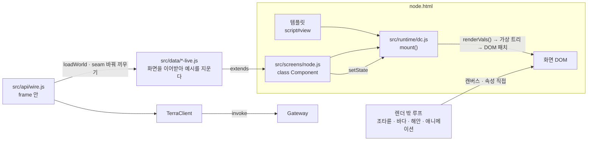
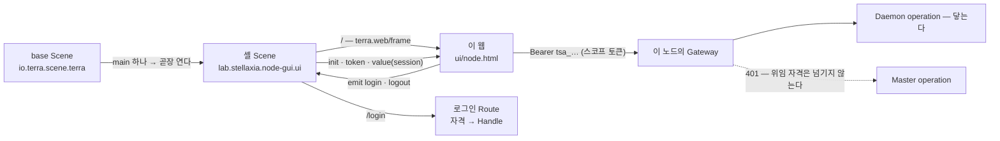

# Terra 노드 GUI 구조

화면이 어떻게 뜨고, 상태가 어디 있고, 무엇이 렌더 밖에서 도는지를 정리한다.
메서드 하나하나는 [[frontend-api|프론트엔드 API]], 화면의 모양 · 시간은 [[node-screen-ui-spec|UI 명세]].

## 1. 큰 그림

- 페이지 하나 = 템플릿 + 화면 클래스 하나. `tools/gen-pages.py`가 `design/*.dc.html`(디자인 캔버스 원본)에서 둘을 떼어 만든다.
- 페이지는 화면 클래스를 그대로 마운트하지 않고 **실데이터 층이 이어받은 클래스**(`realNode(Screen)` …)를 마운트한다 — 원본의 예시 세계는 첫 렌더 전에 지워진다([[real-data-layer|실데이터 층]]).
- 화면 클래스는 React 컴포넌트와 비슷한 모양(`state` · `setState` · `componentDidMount` · `renderVals`)이지만 React가 아니다 — 작은 런타임(§2)이 돌린다.
- 데이터 연동은 화면 코드를 고치지 않고 **연동 지점(seam)** 메서드를 바꿔 끼운다(§6, [[frontend-api|프론트엔드 API]] §5).
- 출하는 Terra 모듈 `lab.stellaxia.node-gui`의 웹 앱으로 한다 — 셸 Scene의 `terra.web/frame`이 감싼다(§7).

## 2. 런타임 (`src/runtime/dc.js`)

| 문법 | 뜻 |
| --- | --- |
| `{{a.b.c}}` | 텍스트 · 속성 안의 값 (점 경로만 — 식은 안 된다. 계산은 `renderVals()`에서) |
| `onClick="{{f}}"` | 이벤트 핸들러. `onPointerDown` · `onPointerMove` · `onPointerUp` · `onPointerCancel` · `onPointerEnter/Leave` · `onWheel` · `onKeyDown` · `onContextMenu` · `onChange` |
| `<sc-for list="{{목록}}" as="x">` | 반복 |
| `<sc-if value="{{조건}}">` | 조건 |
| `hint-*` 속성 | 디자인 캔버스용 — 무시 |

- `setState` → 마이크로태스크에서 `renderVals()` **전체**를 다시 계산하고 DOM을 순서대로 비교 패치한다(키 없음). 그래서 매 프레임 움직이는 것은 렌더 밖에서 한다(§5).
- 입력칸 · 글상자의 `onChange`는 `input` 이벤트로 붙는다(React처럼 글자마다). `value`는 속성이 아니라 값으로 넣어 커서가 튀지 않는다.
- 같은 요소에 같은 종류 리스너는 한 번만 붙는다(핸들러가 잠시 비었다 다시 생겨도 — 두 번 불리던 버그를 막는다).
- 원본 캔버스는 React 런타임으로 돈다. 이 런타임은 그 문법의 부분집합만 흉내 낸다 — 새 문법을 쓰면 여기서도 되는지 확인한다.

## 3. 노드 화면 구역

| 구역 | 화면 위치 | 상태 키 | 주요 메서드 |
| --- | --- | --- | --- |
| 오버헤드 패널 | 맨 위 (선체 + 양옆 계기판) | `fsList` · `fb` · `ovhZ` | `renderVals().ovh` · `fbVals()` |
| ├ 선택 상태 (왼쪽) | 왼쪽 계기판 | `sel` · `fs` | `ovh.lamps` · 맵 화면이 아니면 꺼짐 |
| ├ 전체 창 리스트 박스 (가운데) | 가운데 흰 박스 | `fsList` · `fsHist` | `fsEnter` · `fsExit` · `fsDrop` |
| └ 폴더 보관함 (오른쪽) | 오른쪽 계기판 + 사이드 바 | `fb` · `fbMsg` · `fbArm` · `memos` | `fbToggle` · `fbOpenItem` · `fbOS` · `memo*` |
| 필드 맵 | 가운데 | `map` · `nodes` · `fields` · `mat` · `placed` · `looks` · `sel` · `view` | `goMap` · `enterNode` · `snapshotMap` · `mapSlide` |
| 관리 노드 창 | 왼쪽 아래 좌석 | `curTree` · `trees` · `shown` · `tl` · `login` · `auth` | `mgToggle` · `tlOpen` · `beginSwitch` · `flipTo` · `startLogin` · `hxAvatar` |
| 조타륜 | 가운데 아래 (테이블 뒤) | (렌더 밖 `this._hx`) | `hxStart` · `helmDest` · `onLocalMap` |
| 조타륜 앱 바 | 조타륜 위 | `hb` · `hbMsg` · `hbBusy` · `hbd` · `io` · `hbPath` · `hbArm` | `hbOpen` · `hbAct` · `hbVals` · `hbSeed` · `hbItems` · `hbPut` · `hbPerm` |
| 유틸 서랍 | 테이블 오른쪽 위 | `utilItems` · `ud` | `udOpen` · `udClose` · `udGrab` · `udWheel` |
| 서브 창 · 서랍창 | 떠 있음 · 오른쪽 아래 | `wins` · `winOpen` · `winZ` · `drawer` · `wdrag` · `winDrop` | `openWin` · `winFront` · `storeWin` · `closeWin` · `startWinDrag` |
| 전체 화면 | 계기판 아래 ~ 화면 끝 | `fs` · `fsHist` | `fsEnter` · `fsExit` · `FS_TOP` |
| 메모장 기능칸 | 서브 창 `memo` | `memoCur` · `memoDraft` · `memoNote` · `memos` | `memoNew` · `memoOpen` · `memoSave` · `memoDel` · `memoVals` |

## 4. 층과 좌표

화면은 **1447 × 945** 고정이고 창 크기에 맞춰 통째로 줄인다(`fitScreen`). 위 44px은 오버헤드 패널 띠, 아래 **1447 × 901**이 필드 영역(창 · 서랍 좌표의 기준).

| 층 (z-index) | 무엇 |
| --- | --- |
| 0 | 맵 SVG · 바다 캔버스 · 전체 창 리스트 · 폴더 사이드 바(오버헤드 패널 안에서 선체 뒤) |
| 1 | 조타륜 배경 원판 · 조타륜 · 유틸 서랍 / 오버헤드 패널 선체 |
| 2 | 테이블 / 오버헤드 패널 계기판 내용 |
| 3 | 테이블 네임 박스 |
| 5 · 6 · 7 | 조타륜 앱 바 · 관리 노드 창 · 프사 고리 |
| 8 (펼침 80) | 오버헤드 패널 전체 — 리스트나 사이드 바가 펼쳐지면 떠 있는 창보다 위 |
| 9 | 서랍창 |
| 10 + 순서 | 서브 창 (`winZ`) · 끌기 중 40 · 원형 메뉴 20 · 끌리는 카드 60 |
| 70 · 71 | 전체 화면 · 파인 곳(맵으로 돌아가기) |

| 좌표 | 값 |
| --- | --- |
| 오버헤드 계기판 가장 낮은 선 | 화면 y 100 = 필드 y 56 (`FS_TOP`) |
| 가운데 띠 아래 | 화면 y 46 |
| 테이블 | 화면 아래 180px (좌석 · 계기판) |
| 조타륜 캔버스 | 600 × 285, 왼쪽 423 |

## 5. 렌더 밖에서 도는 것

`setState`는 화면 전체를 다시 계산하므로, 매 프레임 바뀌는 것은 캔버스나 DOM 속성을 직접 만진다.

| 루프 | 시작 | 하는 일 |
| --- | --- | --- |
| `hxStart` | `componentDidMount` | 조타륜 캔버스(눈금 · 로고 드럼 · 곡률), 끌기 · 관성 · 내리기. 상태는 `this._hx` |
| `seaStart` · `coastStart` | 〃 | 바다 · 해안 거품 캔버스. 수심 띠는 0.3초마다 따로 구워 둔다 |
| `mgBeachStart` | 〃 | 관리 노드 창 배경 해변 |
| `animTick` | 31ms 간격 | 애니메이션 자재 · 건물 이미지의 `href`만 바꾼다(`data-anim`) |
| `hbTick` | 앱 바 · 앱 전체 화면을 열 때 | 전송 진행 · 실행 중 작업을 0.5초마다 흉내 낸다 — 실데이터 층에서는 아무것도 안 한다(진짜 목록은 폴링) |
| `fsBind` | `componentDidMount` | 바깥 누르기 · Esc — 리스트 · 사이드 바 접기, 전체 화면 끝 |

## 6. 상태 소유

| 어디 | 무엇 | 비고 |
| --- | --- | --- |
| `this.state` | 화면에 보이는 모든 값 | `setState`로만 바꾼다 |
| `this.NET` | 노드 관계 — 원본은 예시, 실데이터 층은 이 노드 · 부모 tree · `agent/nodes` | 상태 밖 — 바꾼 뒤 `setState({})`([[node-screen-data-model\|데이터 모델]] §2.1) |
| `this._hx` · `this._hxRes` | 조타륜 내부 · 앱 목록 | 렌더 밖 루프 전용 |
| `this._mapGoal` | 가는 중인 맵 | 맵 전환 중 판단(`onLocalMap` · `hbNode`)에 쓴다 |
| `this.FBDATA()` | 폴더 보관함 트리 — 원본은 예시, 실데이터 층은 `io.terra.file` 의 공유 폴더 | [[helm-apps-integration\|조타륜 앱 연동]] §4 · [[real-data-layer\|실데이터 층]] §2.1 |

## 7. Terra 안에서 — frame

이 웹은 단독 페이지로도 돌지만, **출하되는 모양은 Terra 모듈**이다. 모듈 `lab.stellaxia.node-gui`가
`web/`(이 프로젝트)을 구워 `ui/`에 싣고, 얇은 셸 Scene이 그것을 `terra.web/frame`으로 감싼다.
base Scene은 main이 하나면 그것을 곧장 띄운다.

### 7.1 무엇이 frame 때문에 바뀌었나

| 바뀐 것 | 이유 |
| --- | --- |
| `frame-boot.js`를 **첫 import**로 | 셸의 handshake는 10초다. 노드 화면은 마운트가 무거워서 그 뒤에 `hello`를 보내면 늦는다(실측 약 11초 → `HANDSHAKE_TIMEOUT`). 그래서 모듈 그래프의 맨 앞에서 보낸다 |
| 로그인은 셸이 한다 | 웹은 비밀번호를 보지 않는다. [로그인]은 `emit('login')` → 셸의 `/login` Route → 자격 로그인 → 셸이 새 토큰과 `session` 값을 frame에 보낸다 |
| `TerraClient`가 `terra.fetch`로 부른다 | 쿠키는 게이트웨이의 앱 origin을 지나지 않는다. 스코프 토큰(사용자 권한 ∩ 앱 권한)이 유일한 자격이다 |
| Master는 "쓸 수 없다"로 | 스코프 토큰은 Bearer를 싣지 않으므로 forward-auth인 Master는 401이다 — **설계상 경계**다. 401을 "로그인 필요"로 읽으면 사용자를 헛되이 로그인 화면으로 보낸다 |
| 다른 노드도 "쓸 수 없다"로 | 다른 노드의 operation을 부르는 게이트웨이 경로가 없다. 원격은 모듈 경로(`/api/nodes/{node}/modules/…`)뿐이다 |
| 보드를 `srcdoc`으로 | 게이트웨이 CSP의 `frame-ancestors`가 루프백 호스트(`127.0.0.1` · `localhost`)만 적고 앱 자신의 origin(`app-….localhost`)을 빼고 있다 — 같은 앱의 페이지를 `src`로 끼우면 막힌다. `srcdoc` 문서는 부모의 origin · CSP · 기준 URL을 이어받아 그 검사를 타지 않는다 |
| Google Fonts를 뺐다 | CSP가 `style-src 'self'` · `font-src 'self' data:`라 외부 글꼴은 막힌다. 글꼴 스택의 시스템 글꼴로 떨어진다 |
| SSE를 fetch 스트림으로 | `EventSource`는 Authorization 헤더를 붙이지 못한다 |

### 7.2 무엇이 실데이터인가

예시 데이터는 하나도 보이지 않는다. 영역마다의 출처와 비어 있는 이유는 [[real-data-layer|실데이터 층]] §2 · §3에 있다. 요약:

| 영역 | frame 안에서 |
| --- | --- |
| 맵 · 세션 띠 · 속성 창 · 유틸 카드 · 알림 | 이 노드(`terra.daemon.node.get`) · 부모 tree(등록 정보의 Master 주소) · `agent/nodes` · 자원 개수 · Daemon 작업 폴링 |
| 조타륜 앱 중 **Daemon operation**(L) — I/O 장치 · 선언 · 폴더 · 터널 · WireGuard · 작업 · 모듈 | 실데이터 — 처음 맵이 이 노드의 맵이고, 조타륜은 진짜 로컬 노드 이름으로 붙는다 |
| 모듈 namespace operation(M) — 폴더 항목 · 전송 | 실데이터(`io.terra.file`) |
| **Master operation**(T) — SVI 자원 · 허가 · mesh · 라우트 · 클러스터 | `쓸 수 없다` · "닿지 않음" — 첫 401 뒤로 다시 부르지 않는다 |
| 다른 노드 · 다른 tree · 맵 배치 · 메모 · 로컬 파일 탐색 | 비어 있다 — 출처가 없다(메모는 화면 메모리) |

로그인하지 않았거나 토큰을 잃으면 받아 둔 것을 지우고 **빈 세계로 돌아간다** — 예시로 돌아가지 않는다.

## 관련 문서

- [[docs/README|개발 문서 MOC]]
- [[frontend-api|프론트엔드 API]] — §6.5 frame 안의 연동 층
- [[node-screen-code-structure|코드 구조와 이식 가이드]] — 성능 함정 · 분할안
- [[node-screen-ui-spec|노드 화면 UI 명세]]
- [[getting-started|시작하기]] — §4 Terra 안에서 띄워 보기
- [[real-data-layer|실데이터 층]] — 예시를 지운 방법 · 출처 · 빈 자리 · 실측

## 관련 모듈

- `src/runtime/dc.js` · `src/screens/node.js` · `src/api/wire.js`
- `src/api/frame-boot.js` · `src/api/frame-session.js` · `src/api/frame-boards.js`
- Terra 모듈 `lab.stellaxia.node-gui` — 셸 Scene · 매니페스트 · 모듈 README (modules 저장소 `common/lab.stellaxia.node-gui/`의 `scene/` · `module.json` · `README.md`)

## 관련 흐름

- §7 그림 — base Scene → 셸 Scene → frame → 이 웹 → Gateway
- [[frontend-api|프론트엔드 API]] §6.5 — frame handshake와 Master 경계
