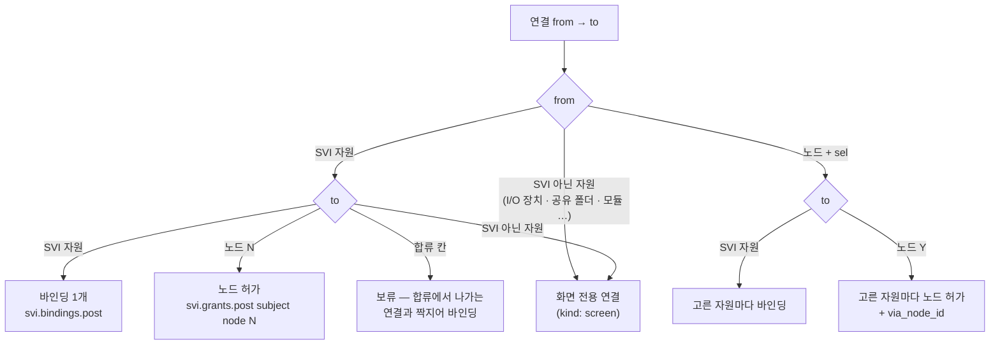
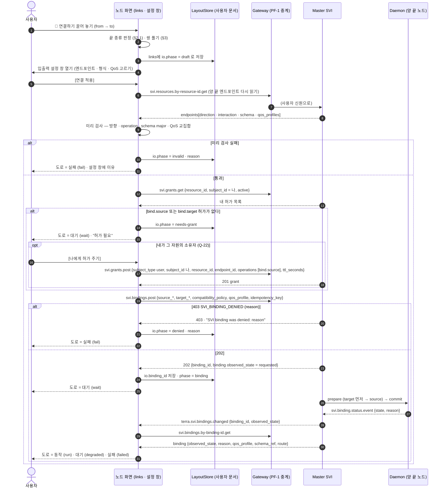
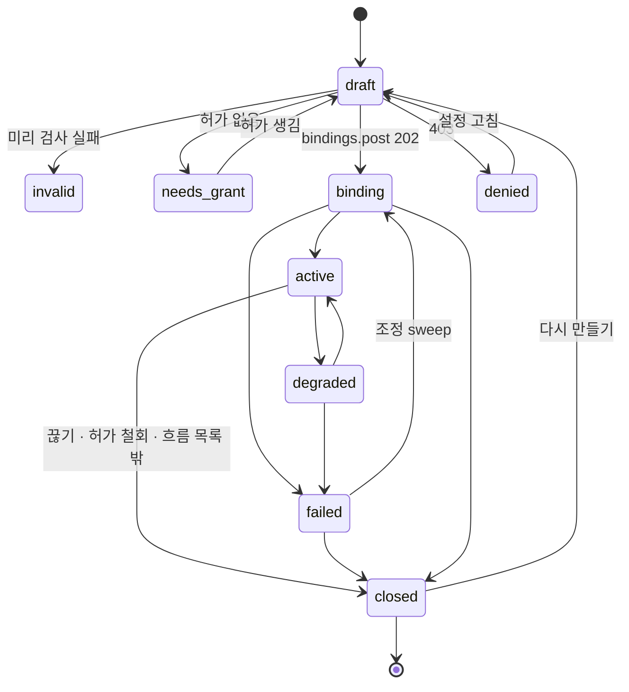
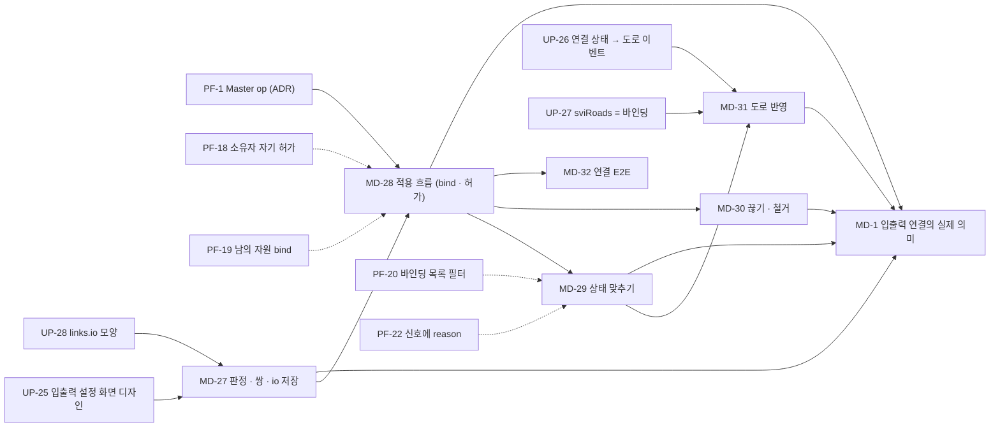

# 입출력 연결 ↔ SVI 바인딩 · 허가 설계

맵의 **연결**(`links`, 화면에는 도로로 보인다)을 실제 데이터 흐름인 **SVI 바인딩 · 허가**로 잇는 설계다. 백로그 [[implementation-backlog|구현해야 할 것]] **MD-1**을 풀기 위한 문서다.
지금 연결은 화면의 선이고 저장만 된다([[node-screen-data-model|데이터 모델]] §2.14).
SVI 흐름도(MD-23 · maingui A-28)는 엔드포인트 · 핸들 · 바인딩 · 허가를 그리지만 맵의 연결과는 따로 돈다.

이 문서는 **설계와 요구사항까지만** 다룬다. 소스 코드는 바꾸지 않았다. 입출력 설정 화면의 디자인(배치 · 모양)도 하지 않는다. §6은 화면이 갖춰야 할 요소와 상태만 적는다.

> [!WARNING] 가정 — PF-1이 열렸다
> 이 설계는 **PF-1(앱 스코프 토큰으로 Master operation에 닿는 길)이 열렸다고 가정한다.** PF-1은 다른 세션의 ADR에서 따로 정한다.
> 지금은 이 모듈의 앱 토큰이 `terra.master.svi.*`에 닿지 않는다. SVI 자원 · 허가 앱은 `쓸 수 없다 · 이 노드의 게이트웨이에 없다`를 보인다([[real-data-layer|실데이터 층]] §2.2 · §5.6).
> 이 문서는 PF-1에 대해 아래 **두 가지를 더 가정한다.** ADR이 다르게 정하면 §4 · §5를 다시 봐야 한다(Q-17).
>
> 1. **Master가 보는 호출자는 그 사람(사용자)이다.** 바인딩의 허가 검사는 바인딩을 만든 사람(`CreatorUserID`)이 가진 `user` 주체 허가만 본다(`binding_service.go:1062-1078`). 앱이나 서비스 계정 같은 다른 주체로 중계되면 이 검사가 늘 실패한다.
> 2. **Master 이벤트(`terra.svi.bindings.changed` 등)도 앱에 온다.** PF-17과 같은 경계다. 이벤트가 오지 않으면 폴링으로 대신한다(§4.3).

근거는 `파일:줄`로 적는다. 저장소 표기는 다음과 같다.

- 모듈: `modules/common/lab.stellaxia.node-gui/web/…` `667fb53`
- maingui: `maingui/…` `9128754`
- Terra: `Terra/…` `9459f0f`
  - `M/` = `Terra/products/tree/master/src/terra_master/`
  - `core/` = `Terra/products/common/packages/terra-svi/`

확인하지 못한 것은 **(추측)**으로 표시하고 §9에 모았다.

## 1. 지금 모양

### 1.1 연결(`links`) — 모듈 · maingui 공통

연결 하나는 `{ id, from, to, start, path[], road, sel? }`이다(`web/src/screens/node.js:61`, 만드는 곳 `node.js:2164`).
`from` · `to` · `start` · `path`의 값은 모두 **칸 키**(`"c-r"`)다. 자원 id도 노드 id도 아니다.

| 필드 | 뜻 | 근거 |
| --- | --- | --- |
| `id` | `'ln' + 시각(36진수)` | `node.js:2164` |
| `from` | 출발 칸. 노드 칸이나 자원 칸 | `node.js:61` |
| `to` | 도착 칸. 노드 칸, 자원 칸, 또는 **합류 도로 칸**(입력 더하기) | [[node-screen-ui-spec#2.10 연결하기 — 도로 배치\|UI 명세 §2.10]] |
| `start` | 실제 출발 칸. 합류에서 출력을 더할 때는 도로 칸이다 | `node.js:61` |
| `path[]` | 거친 칸(도로) | `node.js:61` |
| `road` | 도로 설계 id | `node.js:2163-2164` |
| `sel[]` | `from`이 노드일 때만 있다. 내보낼 자원 `{ key: 'node\|app\|id', name, emoji }` | `node.js:2164`, `web/src/store/layout.js:36` |

연결 끝 칸의 자원은 `rsrc[칸] = { app, id, name, node, emoji, type, io, at }`이다.

- `io`는 늘 `null`이다. `null`은 "모니터링 전용"이라는 뜻이다([[node-screen-data-model|데이터 모델]] §2.14).
- 연결에는 형식 · QoS · 방향 · 서버 id가 없다. 자원 설정 창은 입력 · 출력을 `links`에서 거꾸로 읽기만 한다(`node.js:2171-2181`, `rcfgVals`).
- 저장은 LayoutStore(사용자 문서) 안 맵 스냅숏의 `maps[이름].links`다. 서버 operation은 부르지 않는다.
- 화면의 API 줄은 이미 `terra.master.svi.bindings.post ⚠ (입력 · 출력 쌍마다)`라고 적어 둔다(`node.js:2793`, 내보내기는 `node.js:2755`). 앞으로 쓸 자리를 표시해 둔 글일 뿐이고, 실제로 부르지는 않는다.

### 1.2 SVI 쪽 — 화면이 이미 읽는 것

| 화면 쪽 | 모양 | 근거 |
| --- | --- | --- |
| `ADAPT.svi` 항목 | `{ id, node, status, epId, epInter, epOps, handle, handleOp, handleQos, flow{eps, handles, binds, grants} }`. `ep*`는 **첫 엔드포인트만** 본다 | `web/src/api/adapters.js:56-75` |
| `ADAPT.grant` 항목 | 허가 `{ id, type: 'grant', who, res, ops, ttl, alive }`와 바인딩 `{ id, type: 'bind', from, to, state: active\|failed, qos, reason }` | `adapters.js:86-95` |
| `허가 · 연결` 앱 동작 | `add`(허가) · `revoke` · `unbind`만 있다. **bind(만들기)가 없다** | `web/src/api/operations.js:60-69` |
| 허가 만들기 본문 | `{ subject_id, resource_id, operations[], ttl_seconds }`. maingui는 `subject_type: 'user'`와 `ttl_seconds: 3600`을 고정해 싣는다 | `operations.js:265`, `maingui/src/api/operations.js:228` |
| 흐름 → 도로 | 연결 끝의 SVI 자원에 열린 핸들이 있으면 `state.sviFlow[자원] = { fps, live, state }`가 생긴다. 도로는 그것으로 점선 애니메이션을 그린다 | `web/src/api/svi-live.js:38-57`, `node.js:5085` |
| 도로 이벤트 | 연결 끝들 가운데 가장 나쁜 상태를 쓴다. SVI 자원이면 `status` 글자를 정규식으로 가른다. **바인딩 상태는 보지 않는다** | `node.js:4871-4885` |

> [!NOTE] 지금 도로와 SVI가 이어지는 유일한 조건
> 연결 끝 칸에 SVI 자원이 있고, 그 자원에 **열린 핸들**(이 사람이 연 읽기 · 구독)이 있으면 도로가 흐른다(`node.js:5085-5097`).
> 이 조건에는 바인딩 id도 방향도 없다. 연결의 반대쪽 끝이 실제 바인딩의 target인지도 견주지 않는다.

### 1.3 Terra 쪽 — 바인딩 · 허가 모델

| 개념 | 요점 | 근거 |
| --- | --- | --- |
| Resource | `resource_id`, `node_id`, `kind`, 소유자, `status`, `endpoints[]` | `core/types.go:95-109` |
| Endpoint | `endpoint_id`, `direction`(`source` · `sink` · `duplex`), `interaction`(snapshot · stream · collection · blob · command · duplex), `operations[]`, `input_schema` · `output_schema`, `encodings[]`, `qos_profiles[]`, `exclusive`, `resumable`, `max_consumers`, `status` | `core/types.go:31-93` |
| `schema_ref` | `terra.<도메인>.<이름>@<major>` 형식이다. major가 다르면 호환되지 않는다 | `core/schema_ref.go:7`, `Terra/docs/architecture/svi/svi-core-contract-decisions.md` §6 |
| QoS | **프로필 이름 하나**: `realtime_latest` · `realtime_ordered` · `reliable_ordered` · `bulk_resumable`. 신뢰도 · 속도 · 깊이 같은 세부 필드는 없다 | `core/types.go:65-72` |
| Binding | 엔드포인트 → 엔드포인트의 연결 의도. `desired_state`(`active` · `closed`)는 Master가 저장한다. `observed_state`는 Daemon 보고를 모아 정한다 | `svi-core-contract-decisions.md` §4 · §7, `M/svi/binding_service.go:37-58` |
| Grant | `subject{type, id}` · `resource_id` · `endpoint_id?` · `operations[]` · `expires_at?` · `via_node_id?` | `M/api/routes_svi_grants.go:16-50` |
| 노드 주체 허가 | **흐름 허용 목록**이다(C-3). 자원 R에 살아 있는 노드 허가가 하나라도 있으면, R을 source로 하는 바인딩의 target 노드는 그 목록 안이어야 한다 | `svi-core-contract-decisions.md:784-812` |

바인딩을 만드는 입력(`POST /api/v1/svi/bindings`, `terra.master.svi.bindings.post`)은 **평평한** 본문이다. SVI 상세 설계서(§24.3)의 중첩 본문과 다르니, 계약은 코드를 따른다.

```go
// M/api/routes_svi_bindings.go:13-21
type sviBindingCreateBody struct {
	SourceResourceID    string `json:"source_resource_id"`
	SourceEndpointID    string `json:"source_endpoint_id"`
	TargetResourceID    string `json:"target_resource_id"`
	TargetEndpointID    string `json:"target_endpoint_id"`
	CompatibilityPolicy string `json:"compatibility_policy"`
	QoSProfile          string `json:"qos_profile"`
	IdempotencyKey      string `json:"idempotency_key"`
}
```

- `compatibility_policy`를 비우면 `exact`가 된다(`routes_svi_bindings.go:41-44`).
- `qos_profile`을 비우면 **비운 채로** 두고, Master가 두 끝이 함께 내는 프로필로 정한다. 순서는 `reliable_ordered`(source가 resumable일 때만) → `realtime_ordered` → `realtime_latest`다(`routes_svi_bindings.go:45-49`, `binding_service.go:1088-1103`).
- 권한은 `node.read`다. 실제 문턱은 서비스 안의 허가 검사다(`M/api/http_server.go:432-437`).
- **bind는 허가를 만들지 않고 검사만 한다.** 만든 사람에게 두 허가가 모두 있어야 한다(`binding_service.go:1062-1078`, 만들 때 `:894`, 조정 sweep에서 `:501`).
  - source 엔드포인트에 대한 `bind.source`를 담은 `user` 주체 허가
  - target 엔드포인트에 대한 `bind.target`을 담은 `user` 주체 허가
- 허가 만들기는 `node.control`이 필요하고, 그 자원의 **소유자이거나 Master 관리자**여야 한다(`http_server.go:419-421`, `routes_svi_grants.go:69-75`).
- **관리자가 아니면 두 끝 자원 모두 바인딩을 만든 사람의 소유여야 한다.** `authorizeAndPlan`이 source · target을 `catalog.Get(…, CreatorUserID, administrator)`로 찾고(`binding_service.go:797-805`), 카탈로그는 관리자가 아니면 소유자가 아닌 자원을 숨긴다(`M/svi/catalog.go:493-504`). 남의 자원 쪽은 `source_resource_not_found` · `target_resource_not_found`로 거절된다. 허가를 받았어도 그렇다 — PF-19

## 2. 대응 표 — 연결 ↔ 바인딩 · 허가

| 연결(`links`) 쪽 | SVI 쪽 | 대응 규칙 | 비고 |
| --- | --- | --- | --- |
| 연결 하나 | 바인딩 **0~N개** | 끝 쌍(source 자원, sink 자원)마다 바인딩 하나. 합류가 끼면 N개가 된다(§3.2) | 1:1이 아니다 |
| `from`(자원 칸) | `source{resource_id, endpoint_id}` | `rsrc[from].id` → `resource_id`. 엔드포인트는 사람이 고른다(§5) | 지금 연결에는 엔드포인트가 없다 |
| `to`(자원 칸) | `target{resource_id, endpoint_id}` | `rsrc[to].id` → `resource_id` | |
| `to`(노드 칸) | **노드 주체 허가** `{subject_type: node, subject_id: N, resource_id, operations: [read, subscribe, bind.source]}` | 바인딩이 아니라 공유다. 바인딩 끝점에는 노드를 두지 않는다 | `Terra/docs/modules/terra-gui/design/terra-node-gui-platform-support-design.md:923-946` |
| `from`(노드 칸) + `sel[]` | 고른 자원마다 바인딩(대상이 자원일 때)이나 노드 허가 + `via_node_id: N`(대상이 노드일 때) | `sel[].key = 'node\|app\|id'`에서 `id` → `resource_id` | 같은 설계서 `:938-939` |
| `to`(합류 도로 칸) | 그 자체로는 바인딩이 없다 | 합류에서 나가는 연결의 sink와 짝을 지어 바인딩을 만든다(§3.2) | |
| `start` · `path[]` · `road` | 없음 | 화면 전용이다. `route`(relay · lan_direct)와는 상관없다 | 바인딩의 `route`는 정보로만 보인다 |
| 연결 방향 `from → to` | `source → target` | 엔드포인트 `direction`과 맞아야 한다. 맞지 않으면 만들지 않는다(§5.3) | |
| (없음) | `schema_ref` | 연결은 source의 `output_schema`를 **복사해 보여 준다.** 권위는 바인딩 답의 `schema_ref`다 | `binding_service.go:48` |
| (없음) | `qos_profile` | 사람이 고르거나 비운다(Master가 정함) | |
| (없음) | `compatibility_policy` | 기본 `exact`(Q-19) | |
| (없음) | `binding_id` · `desired_state` · `observed_state` · `reason` | 연결이 `binding_id`를 들고, 상태는 서버에서 읽는다 | §5.2 |
| 도로 이벤트 `run` · `wait` · `stop` · `fail` | `observed_state` + 거절 이유 | §4.4 표 | 지금은 끝 자원의 `status`만 본다 |
| `끊기`(자원 설정 창) | `svi.bindings.by-binding-id.delete` | 연결을 지우면 그 연결이 만든 바인딩을 닫는다 | 도로는 남는다(지금과 같다) |
| `경로 철거` · `칸 철거` · 자원 철거 | 지나던 연결 각각의 바인딩을 닫는다 | `node.js:2050` · `:2141-2150` 경로를 모두 거친다 | 닫기 실패 처리는 §4.2 |
| `sviFlow[자원]`(열린 핸들) | 핸들(바인딩과는 별개) | 바인딩이 active면 도로가 흐르는 것으로 그린다. 핸들 SSE는 흐름 칸용으로 남긴다(Q-21) | |

### 2.1 연결 끝의 종류 → 무엇을 만드나



- **SVI 아닌 자원**이 끝에 있는 연결은 바인딩으로 바꿀 수 없다. I/O 장치 · 공유 폴더 · 모듈 · 터널 · 작업 같은 것들이다. 지금처럼 화면 전용(`kind: 'screen'`)으로 남긴다. 연결하는 순간 막을지는 Q-18이 정한다.
- I/O 장치가 SVI 자원으로도 나오는지(`kind: io.*`)는 확인하지 못했다. 모듈 코드는 `io.*`를 "백엔드 없음"으로 적는다(`operations.js:42`). **(추측)** io-inventory가 장치를 SVI로 선언하면 그 SVI 자원 칸을 쓰면 된다.

## 3. 쌍 풀기

### 3.1 한 연결 → 한 쌍

`from`과 `to`가 둘 다 SVI 자원이면 쌍은 하나다. `(rsrc[from].id, rsrc[to].id)`.

### 3.2 합류(입력 더하기 · 출력 더하기)

UI 명세 §2.10의 합류 규칙은 "입력은 합류까지, 출력은 합류에서"다. 쌍은 다음처럼 푼다.

1. 합류 칸 J로 **들어오는** 연결(`to === J`)의 `from` 자원들이 source 집합이다.
2. J에서 **나가는** 연결(`start === J`)의 `to` 자원들이 sink 집합이다.
3. 바인딩 = source 집합 × sink 집합. 쌍마다 하나다.
4. 합류에서 나가는 연결에 `pillSrc`(고른 출발 자원)가 있으면 그 source만 쓴다. 지금 화면이 출발 자원을 고르게 하는 것과 같다.

> [!WARNING] 합류는 곱으로 커진다
> source 3 × sink 3이면 바인딩이 9개다. sink 엔드포인트가 `exclusive`이거나 `max_consumers`가 1이면 둘째부터 거절된다(`target_endpoint_exclusive` · `target_endpoint_consumer_limit` — `binding_service.go:927-960`).
> 설정 화면이 만들기 전에 몇 개를 만들지 미리 보이게 한다(§6.1 E-8). 그래도 곱이 기본인지는 Q-20이 정한다.

### 3.3 쌍의 키

쌍의 키는 `srcRes#srcEp>dstRes#dstEp`다. 같은 쌍을 다른 연결(다른 길)이 또 만들면 바인딩은 하나만 둔다. 연결 둘이 같은 `binding_id`를 가리키고, 둘 다 끊어야 닫는다.
`idempotency_key`도 쌍의 키에서 만든다(§5.1). 그래서 두 번 눌러도 Master에는 하나만 생긴다.

## 4. 흐름 — 연결 생성 → bind → 허가 확인 → 도로 이벤트

### 4.1 시퀀스



근거는 다음과 같다.

- 바인딩 생성은 202 `{binding_id, binding}`을 돌려준다(`routes_svi_bindings.go:70-73`). 거절은 403 `SVI_BINDING_DENIED`다(`:147-148`).
- 오케스트레이션 순서(validating → preparing → commit → active)는 `binding_service.go:538-638`에 있다.
- 신호 `terra.svi.bindings.changed {binding_id, observed_state}`는 `M/events/bus.go:41`과 `binding_service.go:1164-1171`에 있다.
- 모듈은 이미 이 신호를 받으면 `grant` 앱을 다시 받는다(`web/src/api/events.js:16`).

### 4.2 끊기 · 철거

1. 사람이 `끊기`, `칸 철거`, `경로 철거`, 자원 철거 가운데 하나를 누른다.
2. 화면은 그 연결이 든 `binding_id`마다 남은 참조 수를 센다(§3.3). 0이 되는 것만 `svi.bindings.by-binding-id.delete`를 부른다. 본문은 없고, Master는 `consumer_requested`로 닫는다(`binding_service.go:304-346`).
3. 닫기를 부르지 못하면 연결은 지우되, 그 `binding_id`를 `orphans[]`에 남긴다. 다음 동기화 때 다시 닫는다. "화면에서는 지웠는데 서버에는 흐르는" 상태를 사람에게 알린다(UP-14와 같은 원칙 — 지어내지 않기).
4. 연결이 만든 허가(나에게 준 bind 허가 · 노드 허가)는 **자동으로 철회하지 않는다.** 다른 연결이 쓸 수 있기 때문이다. 철회 여부는 Q-23이 정한다.

### 4.3 상태를 받아 오는 길

| 길 | 언제 | 비고 |
| --- | --- | --- |
| `terra.svi.bindings.changed` 신호 | PF-1 가정 2가 맞을 때 | 신호에는 `binding_id` · `observed_state`만 있다. `reason`은 `by-binding-id.get`으로 다시 읽는다 |
| `terra.svi.grants.changed` 신호 | 허가가 철회되거나 좁아지면 | Master가 바인딩을 `grant_revoked` · `authorization_lost`로 닫는다(`binding_service.go:379` · `:501`). 화면은 바인딩을 다시 읽는다 |
| `svi.bindings.get` 폴링 | 신호가 오지 않을 때의 바닥 | 필터가 없고, 관리자가 아니면 **내가 만든 것만** 준다(`binding_service.go:286-300`). 다른 사람이 만든 바인딩은 내 맵에서 읽히지 않는다(Q-24) |
| 화면을 열 때 맞추기 | 로그인 · 맵 들어가기 | `links[].io.binding_id`와 서버 목록을 견준다. 서버에 없으면 `phase: lost`. 서버에만 있으면 흐름도에만 보이고 맵에 지어 넣지 않는다 |

### 4.4 상태 → 도로 이벤트

도로 이벤트는 지금처럼 **지나는 연결 가운데 가장 나쁜 것**(실패 > 정지 > 대기 > 동작)을 쓴다(UI 명세 §2.11). 바뀌는 점은 연결의 상태가 끝 자원의 `status` 대신 아래 표에서 온다는 것이다. 화면 전용 연결(`kind: screen`)은 지금 규칙 그대로다.

| 연결 상태 `io.phase` | Master 근거 | 도로 이벤트 | 설정 창 글(예) |
| --- | --- | --- | --- |
| `draft` | 아직 부르지 않음 | `wait` | 설정 전 — 엔드포인트를 고른다 |
| `invalid` | 화면의 미리 검사 실패 | `fail` | 방향이 맞지 않는다 — 카메라(source) → 마이크(source) |
| `needs-grant` | 내 `bind.source` / `bind.target` 허가 없음 | `wait` | 허가 필요 — `<자원>`에 bind.source |
| `binding` | `requested` · `validating` · `planning` · `preparing` · `opening` | `wait` | 연결 중 |
| `active` | `observed_state = active` | `run` | 흐르는 중 · `qos_profile` · `schema_ref` · `route` |
| `degraded` | `degraded`(`participant_disconnected` 등) | `wait` | 한쪽 노드가 끊겼다 — 다시 이어지면 돌아온다 |
| `failed` | `failed`(`*_prepare_failed:` · `*_commit_failed`). 조정 sweep이 다시 시도한다 | `fail` | 준비 실패 — 다시 시도 중 |
| `denied` | 403 `SVI_BINDING_DENIED` + `reason` | `fail` | 거절 — `flow_not_allowed` … |
| `closed` | `closed` + `reason`(`grant_revoked` · `authorization_lost` · `flow_not_allowed` · `source_completed` · `resource_withdrawn` …) | `stop` | 닫혔다 — 이유 |
| `lost` | 서버에 그 `binding_id`가 없음(`SVI_BINDING_NOT_FOUND`) | `stop` | 서버에 없다 — 다시 만들기 |
| `shared` | 노드 허가가 살아 있음 | `run` | 노드 N에 공유됨 |
| `share-expired` | 노드 허가의 `expires_at`이 지났음 | `stop` | 공유 기한 끝 |

- `closing`은 `binding`과 같이 `wait`로 본다.
- `failed`는 핸들과 달리 **회복될 수 있다**(`core/binding_state.go:18`). 그래서 `fail`로 그리되, 설정 창은 "다시 시도 중"이라고 적는다.
- 거절 이유 글자는 `binding_service.go:797-993`의 목록을 화면 글로 옮긴다(MD-29). 코드에 없는 이름(`GRANT_REQUIRED` · `SCHEMA_MISMATCH`)을 쓰면 안 된다. Terra에는 그런 코드가 없고, 이유는 자유 글자다.
- 도로 흐름 애니메이션(`sviRoads`)은 바인딩이 `active`일 때 그린다. fps는 열린 핸들이 있을 때만 붙인다(Q-21).



## 5. 데이터 모양 제안

### 5.1 연결이 싣는 것 — `links[].io`

기존 필드는 그대로 둔다. 연결에 `io` 하나를 더한다. 없으면(예전 저장본) `kind: 'screen'`으로 읽는다.

```ts
// 제안 — LayoutStore 저장본 maps[이름].links[] 에 더한다 (🟩 로컬 · 사용자 문서)
interface LinkIO {
  v: 1;                                   // 모양 판
  kind: 'binding' | 'share' | 'screen';   // §2.1
  // 끝점 — 칸 키가 아니라 서버 id. 칸이 옮겨져도 따라간다
  source?: EndpointRef;                   // kind: binding · share
  target?: EndpointRef | { node_id: string };   // share 면 노드
  // 사람이 고른 설정 (입출력 설정 화면 §6)
  qos_profile: '' | 'realtime_latest' | 'realtime_ordered' | 'reliable_ordered' | 'bulk_resumable';   // '' = Master가 정함
  compatibility_policy: 'exact' | string; // 기본 exact (Q-19)
  share_ops?: Array<'read' | 'subscribe' | 'bind.source'>;   // share 만. 기본 셋 다
  share_ttl_seconds?: number;             // share 만. 0 = 기한 없음
  // 화면이 복사해 둔 것 — 보여 주기 · 미리 검사용. 권위는 서버 답
  schema_ref?: string;                    // source endpoint output_schema (예: terra.image.frame@1)
  encoding?: string;                      // 고른 encoding이 있으면
  direction: 'forward';                   // from → to 가 source → target. 거꾸로는 저장하지 않는다 (§5.3)
  // 서버가 준 id
  pairs: PairRef[];                       // 쌍마다 하나 (§3)
  grant_ids?: string[];                   // 이 연결 때문에 만든 허가 (나에게 준 bind 허가 · 노드 허가)
  // 마지막으로 본 상태 — 다시 열 때 첫 그림용. 열면 서버로 맞춘다 (§4.3)
  phase: Phase;
  reason?: string;                        // 서버 reason 또는 화면 검사 이유
  code?: string;                          // HTTP 오류 코드 (SVI_BINDING_DENIED · SVI_UNAVAILABLE …)
  checked_at?: string;                    // RFC 3339
}
interface EndpointRef { node_id: string; resource_id: string; endpoint_id: string }
interface PairRef {
  key: string;                            // srcRes#srcEp>dstRes#dstEp
  binding_id?: string;
  idempotency_key: string;                // 'gui-link-' + sha256(tree + key).slice(0, 32) — 두 번 눌러도 하나
  phase: Phase; reason?: string;
}
type Phase = 'draft' | 'invalid' | 'needs-grant' | 'binding' | 'active' | 'degraded'
           | 'failed' | 'denied' | 'closed' | 'lost' | 'shared' | 'share-expired';
```

예 — 카메라의 프레임을 다른 노드의 기록 sink로 보낸다.

```json
{
  "id": "ln1k9x2a",
  "from": "2-3", "to": "4-1", "start": "2-3", "path": ["3-2", "3-1"], "road": "stone",
  "io": {
    "v": 1,
    "kind": "binding",
    "source": { "node_id": "node-a", "resource_id": "svires_cam01", "endpoint_id": "sviep_frames" },
    "target": { "node_id": "node-b", "resource_id": "svires_rec01", "endpoint_id": "sviep_in" },
    "qos_profile": "",
    "compatibility_policy": "exact",
    "schema_ref": "terra.image.frame@1",
    "direction": "forward",
    "pairs": [
      { "key": "svires_cam01#sviep_frames>svires_rec01#sviep_in", "binding_id": "svib_7f3a…", "idempotency_key": "gui-link-3c1e…", "phase": "active" }
    ],
    "phase": "active",
    "checked_at": "2026-10-07T09:12:00Z"
  }
}
```

위 예의 id 값은 모양을 보이려고 지어낸 것이다. 접두사(`svires` · `sviep` · `svib`)만 `svi-core-contract-decisions.md` §5를 따랐다.

### 5.2 저장하는 것과 저장하지 않는 것

| 무엇 | 어디 | 이유 |
| --- | --- | --- |
| `kind` · 끝점 · `qos_profile` · `compatibility_policy` · `share_*` | 🟩 LayoutStore | 사람이 고른 것이다. 서버 바인딩에는 "어느 도로로"가 없다 |
| `binding_id` · `grant_ids` · `idempotency_key` | 🟩 LayoutStore | 서버 대상을 다시 찾는 열쇠다 |
| `phase` · `reason` · `checked_at` | 🟩 저장하되 **캐시로만** 쓴다 | 오프라인일 때 마지막 모습을 보인다. 열면 서버 값이 이긴다 |
| `observed_state` · `schema_ref`(서버) · `route` · `transform_id` | ⬜ 화면 | 늘 서버에서 읽는다 |

- 키는 칸 키가 아니라 `resource_id` · `node_id`다. 노드 이름이 바뀌어도 따라가는 MD-4 규칙과 같다.
- 자원이 사라지면(`resource_withdrawn` · 목록에서 빠짐) 지금처럼 연결을 남기고 "원본 목록에서 사라짐"으로 보인다(`layout.js:136`).

### 5.3 방향

- `from → to`는 언제나 `source → target`이다. 엔드포인트 `direction`이 맞아야 한다.
  - source 쪽 엔드포인트: `source`나 `duplex`이고, operations에 `bind.source`가 있다.
  - target 쪽 엔드포인트: `sink`나 `duplex`이고, operations에 `bind.target`이 있다.
  - Master의 호환 순서(존재 → 방향 → operation → interaction → schema major → encoding → QoS · 배타)를 화면이 앞서 흉내 낸다(`svi-core-contract-decisions.md` §12, `core/compatibility.go:33-104`). 미리 검사는 안내일 뿐이고, 최종 판정은 Master다.
- 사람이 sink → source로 끌었을 때 설정 창이 [방향 뒤집기]를 내놓을지는 Q-25가 정한다. 뒤집으면 `from` · `to`를 바꾸고 `path`를 거꾸로 한다.
- 도로 팔의 방향 이벤트(들어옴 · 나감 · 양방향 — UI 명세 §2.11)는 지금처럼 연결의 칸 차례에서 계산한다. `duplex` ↔ `duplex` 바인딩이어도 팔은 `from → to` 한 방향으로 그린다. **(추측)** duplex 바인딩을 양방향 팔로 그릴지는 디자인이 정한다.

### 5.4 오류 상태

| 단계 | 오류 | 연결에 남는 것 |
| --- | --- | --- |
| 미리 검사 | 방향 · operation · schema major · QoS 교집합 없음 · 엔드포인트 없음 | `phase: invalid`, `reason`은 화면 글 |
| 허가 확인 | `bind.source` / `bind.target` 없음 | `phase: needs-grant` |
| 허가 만들기 | 404 `SVI_RESOURCE_NOT_FOUND`(소유자도 관리자도 아님) · 403(권한 `node.control` 없음) | `phase: needs-grant`, `code` |
| bind | 400 `INVALID_REQUEST` | `phase: invalid`, `code` |
| bind | 403 `SVI_BINDING_DENIED` — `missing_bind_grant` · `flow_not_allowed: …` · `flow_allow_list_unavailable` · `compatibility_<결과>: …` · `no_common_qos_profile` · `*_endpoint_exclusive` · `*_consumer_limit` · `*_resource_not_found` · `<쪽>_<status>` | `phase: denied`, `reason` |
| bind | 503 `SVI_UNAVAILABLE` · 네트워크 | 바꾸지 않는다. 다시 시도를 안내한다 |
| 실행 중 | `failed` · `degraded` · `closed` + `reason` | 표 §4.4 |
| 끊기 | 닫기 실패 | `orphans[]`(맵 단위)에 `binding_id`를 남긴다 |

거절 이유 목록의 근거는 `binding_service.go:797-993`이고, HTTP 코드의 근거는 `routes_svi_bindings.go:143-154`다.

## 6. 입출력 설정 화면 — 요구사항

배치 · 모양은 디자인 몫이다. 아래는 화면이 **가져야 할 요소와 상태**만 적는다.
들어가는 곳은 두 군데를 가정한다. 하나는 자원 설정 창(`rcfg`)의 입력 · 출력 칸으로, 지금 `설정 화면은 추후 디자인` 자리다(`maingui/design/Artboard-qcfu.dc.html:1366`). 다른 하나는 연결을 놓은 직후다.

### 6.1 요소

| ID | 요소 | 내용 | 데이터 |
| --- | --- | --- | --- |
| E-1 | 연결 머리 | 출발 → 도착(자원 · 노드 · 합류), 노드 이름, 도로 칸 수, 연결 종류 배지(`바인딩` · `공유` · `화면 전용`) | `links[]` · `io.kind` |
| E-2 | 출발 엔드포인트 고르기 | 그 자원의 엔드포인트 목록. 항목마다 `direction` · `interaction` · `output_schema` · `encodings` · `qos_profiles` · `exclusive` · `resumable` · `status`를 보인다. 고를 수 없는 것은 이유와 함께 잠근다 | `svi.resources.by-resource-id.get` |
| E-3 | 도착 엔드포인트 고르기 | E-2와 같다. `input_schema`를 보이고, `max_consumers`와 지금 쓰는 수를 보인다(가능하면) | 〃 |
| E-4 | 형식 | `schema_ref` 두 개를 나란히 보이고 호환 판정(`exact` · `compatible` · `transform_required` · `incompatible`)을 보인다. `compatibility_policy` 고르기(Q-19) | 엔드포인트 · `core/compatibility.go` 규칙 |
| E-5 | QoS | `자동(Master가 정함)` + 두 끝이 함께 내는 프로필만. 프로필마다 한 줄 설명(최신만 · 순서 · 신뢰 · 대용량 이어받기). `reliable_ordered`는 source가 resumable일 때만 고를 수 있다 | `qos_profiles` · `resumable` |
| E-6 | 방향 | `source → target` 표시. 맞지 않으면 경고와 [방향 뒤집기](Q-25) | `direction` |
| E-7 | 허가 상태 | 내 `bind.source`(출발) · `bind.target`(도착) 허가가 있는지, 기한은 언제인지. 없으면 [나에게 허가 주기](소유자일 때 — Q-22)나 "소유자에게 요청" 안내. 출발 자원의 **노드 흐름 허용 목록**(C-3)과 도착 노드가 그 안인지 | `svi.grants.get` |
| E-8 | 합류 미리보기 | 합류가 끼면 만들어질 쌍 목록(N개)과 쌍마다 미리 검사 결과 | §3.2 |
| E-9 | 공유 설정(노드 끝) | 공유할 operation(`read` · `subscribe` · `bind.source`), 기한(`ttl_seconds`), `via_node_id` 표시(다시 공유일 때) | `svi.grants.post` |
| E-10 | 상태 줄 | `phase` · `observed_state` · `reason`(화면 글) · `qos_profile`(서버가 정한 값) · `schema_ref` · `route` · `transform_id` · 마지막 확인 시각 | `svi.bindings.by-binding-id.get` |
| E-11 | 동작 | [연결 적용] · [다시 시도] · [끊기](바인딩만 닫기) · [경로 철거로 가기] · [흐름도에서 보기](MD-23 흐름도로) · [흐름 열기](핸들 — 흐름 칸) | |
| E-12 | 권한 잠금 | 필요한 권한(`node.read` — bind, `node.control` — 허가)이 없으면 잠그고 이유를 보인다. PF-1이 닫혀 있으면 E-2~E-11 전체를 잠그고 `쓸 수 없다 · …` 이유를 남긴다(UP-24 원칙) | `hbCan` |
| E-13 | 화면 전용 안내 | SVI 아닌 자원 끝이면 "이 연결은 화면에만 있다 — 데이터는 흐르지 않는다" | `io.kind = screen` |

### 6.2 상태

| 화면 상태 | 언제 | 보여야 할 것 |
| --- | --- | --- |
| 닿지 않음 | PF-1 없음 · Master 503 | 잠금 + 이유. 저장된 `phase`는 "마지막으로 본 것"이라는 표시와 함께 |
| 불러오는 중 | 엔드포인트 · 허가 읽는 중 | 칸마다 자리 표시 |
| 설정 전 (`draft`) | 연결만 놓았다 | 고를 것 강조 · [연결 적용] 잠금(필수 미선택) |
| 검사 실패 (`invalid`) | 미리 검사 | 실패한 단계(방향 · 형식 · QoS …)를 가리킨다 |
| 허가 필요 (`needs-grant`) | 허가 없음 | E-7 강조 |
| 연결 중 (`binding`) | 202 뒤 | 진행 단계(requested → validating → preparing → active) |
| 흐르는 중 (`active`) | | 서버가 정한 QoS · schema · route |
| 저하 (`degraded`) | | 어느 쪽이 끊겼는지(reason) |
| 실패 · 재시도 (`failed`) | | reason · "Master가 다시 시도한다" |
| 거절 (`denied`) | 403 | reason을 화면 글로 + 고칠 길(허가 · 흐름 목록 · 엔드포인트) |
| 닫힘 (`closed`) | | reason(허가 철회 · 자원 철회 · 끝남) + [다시 만들기] |
| 서버에 없음 (`lost`) | | [다시 만들기] · [연결 지우기] |
| 공유됨 · 공유 기한 끝 | 노드 끝 | 공유 operation · 기한 |
| 화면 전용 | SVI 아닌 끝 | E-13 |
| 여럿(합류) | 쌍이 2개 이상 | 쌍마다 상태. 연결 전체는 가장 나쁜 것 |

## 7. 누가 무엇을

번호는 2026-10-07 이 브랜치의 [[implementation-backlog|구현해야 할 것]] 다음 번호다. 다른 브랜치(PF-1 ADR 등)가 같은 번호를 먼저 쓰면 병합할 때 다시 매긴다.

### 7.1 maingui에 올릴 것 (UP)

| ID | 무엇 | 왜 | 우선 |
| --- | --- | --- | --- |
| **UP-25** | 입출력 설정 화면 디자인 | §6의 요소 · 상태를 디자인으로. 지금 자리는 `Artboard-qcfu.dc.html:1350-1366`(`세부 입출력 설정 화면은 추후 디자인`). MD-1 · MD-2의 선행 | 높음 |
| **UP-26** | 연결 상태 → 도로 이벤트 | 지금 `evOf`는 끝 자원 `status`만 본다(`node.js:4871-4885`). §4.4 표대로 연결의 `phase`를 먼저 보게 한다. 화면 전용 연결은 그대로 | 중간 |
| **UP-27** | `sviRoads` 조건을 바인딩으로 | 지금은 "끝에 열린 핸들이 있는 SVI 자원"(`node.js:5085-5097`)이라, 바인딩 없이도 흐르는 것처럼 보인다. 바인딩 `active`면 흐름, 핸들 fps는 덧붙임(Q-21) | 중간 |
| **UP-28** | `links` 모양에 `io` 더하기 | §5.1. `snapshotMap` · LayoutStore 저장본 · `layout.js` 읽기(없으면 `kind: screen`) | 중간 |
| **UP-29** | `HELM_CRUD` 바인딩 고치기의 잘못된 경로 | 바인딩 항목을 고치면 바인딩 필드 셋이 열리는데(`maingui/src/screens/node.js:2343`), `update`는 늘 `svi.grants.by-grant-id.patch`를 `grant_id = binding_id`로 부른다(`maingui/src/api/operations.js:229`). 바인딩에는 고치는 op가 없다 — 고치기 = 닫고 다시 만들기로. **(추측 — 실행해 보지 않았다)** | 낮음 |
| **UP-30** | 허가 폼의 `ttl` 무시 | 폼에 기한 칸이 있는데 본문은 `ttl_seconds: 3600` 고정(`maingui/src/api/operations.js:228`). 모듈은 폼 값을 쓴다(`web/src/api/operations.js:265`) | 낮음 |
| **UP-31** | 바인딩 변경 신호로 SVI 앱도 다시 받기 | `terra.svi.bindings.changed` → `['grant']`뿐이라(`maingui/src/api/events.js:68-69`) 흐름도의 `binds`가 늦다. 모듈도 같다(`web/src/api/events.js:16`) — MD-31과 함께 | 낮음 |

### 7.2 이 모듈에서 할 것 (MD)

| ID | 무엇 | 선행 | 우선 |
| --- | --- | --- | --- |
| **MD-1** | (그대로) 입출력 연결의 실제 의미. 아래 MD-27~MD-32로 쪼갠다 | PF-1 · UP-25 | 높음 |
| **MD-27** | 연결 판정 · 쌍 풀기 · `links[].io` 저장 — §2.1 · §3 · §5. 예전 저장본은 `kind: screen`으로 읽는다. 단위 시험: 합류 곱 · 같은 쌍 하나 · 노드 끝 | UP-28(원본 모양과 맞춤) | 높음 |
| **MD-28** | 적용 흐름 — 엔드포인트 다시 읽기 → 미리 검사 → 허가 확인 → `svi.bindings.post`(`HELM_APPS.grant.acts`에 `bind` 추가 — 지금 없다, `web/src/api/operations.js:60-69`) → `binding_id` 저장. 노드 끝은 `svi.grants.post {subject_type: node}` | PF-1 · MD-27 | 높음 |
| **MD-29** | 상태 맞추기 — `terra.svi.bindings.changed` · `grants.changed` · 폴링 바닥 · 열 때 맞추기(§4.3) · 이유 글(`reasonText`에 바인딩 이유) · `orphans[]` 다시 닫기 | MD-28 | 높음 |
| **MD-30** | 끊기 · 철거 경로 모두에서 바인딩 닫기 — `끊기`(`node.js:2179`) · `칸 철거` · `경로 철거`(`:2141-2150`) · 자원 철거(`:2050`) · 원본에서 사라짐(`:2390`). 참조 수 세기(§3.3) | MD-28 | 중간 |
| **MD-31** | 모듈 쪽 UP-26 · UP-27 반영(원본이 받아들이면 따라가기, 아니면 `fixes.js` 패치) | UP-26 · UP-27 | 중간 |
| **MD-32** | 연결 E2E — 가짜 서버(`tests/sviflow.test.mjs`에 `bindings.post` · `grants.post` · 거절 이유 · 신호 더하기)와 tree 진짜 스택(MD-13과 함께) | MD-28 · MD-13 | 중간 |
| **MD-33** | `허가 · 연결` 앱 표의 "허가를 고치는 op 없음"을 고치기 — Terra에 `svi.grants.by-grant-id.patch`(B-9)가 있다(`web/src/api/operations.js:350`, `M/api/routes_svi_grants.go:357-361`). 문서 · 대응표 글만 | — | 낮음 |

### 7.3 Terra에서 할 것 (PF)

| ID | 무엇 | 왜 | 우선 |
| --- | --- | --- | --- |
| **PF-1** | (그대로) 앱 토큰 → Master op. 이 설계는 **사용자 신원으로 중계**되는 것을 전제한다 | 허가 검사가 `user` 주체만 본다(맨 앞 가정 1) | 높음 |
| **PF-18** | 소유자의 자기 허가 | 소유자도 자기 자원에 허가가 없으면 핸들 · 바인딩이 막힌다 — 시험이 소유자가 자기에게 허가를 준다(`M/svi/handle_service_test.go:90-100`). 연결 하나에 허가 둘이 먼저 있어야 한다. 소유자는 암묵 허가로 볼지, GUI가 자동으로 줄지 정해 달라 — Q-22와 짝. **(추측)** 의도된 설계일 수 있다 | 높음 |
| **PF-19** | 남의 자원과 잇는 bind | 코드로는 관리자가 아니면 **두 끝이 모두 내 소유여야** bind가 풀린다(`binding_service.go:797-805` → `M/svi/catalog.go:493-504`). 허가(`bind.source` · `bind.target`)를 받아도 남의 자원은 `*_resource_not_found`로 거절된다. 다른 사람 · 다른 노드 소유 자원과 잇는 연결이 막힌다 — 허가를 받은 사람은 카탈로그에서도 보이게 해 달라. 자원의 `OwnerID`가 노드 주인인지 선언한 사람인지는 **(추측 — 확인하지 못했다)**. 진짜 스택 시험으로 확인 | 높음 |
| **PF-20** | 바인딩 목록 필터 | `svi.bindings.get`은 필터가 없고, 관리자가 아니면 만든 사람 것만 준다(`binding_service.go:286-300`). 맵(노드)에 걸린 바인딩을 보려면 `node_id` · `resource_id` 필터와 "내 자원에 걸린 남의 바인딩" 보기가 필요하다 | 중간 |
| **PF-21** | 바인딩 거절 이유를 기계가 읽는 모양으로 | 지금 이유는 자유 글자다(`flow_not_allowed: target node … is not in …` — `binding_service.go:992`). `{reason_code, detail}`처럼 나누면 화면 글을 안정적으로 고를 수 있다 | 낮음 |
| **PF-22** | 바인딩 신호에 `reason` 싣기 | `terra.svi.bindings.changed`는 `{binding_id, observed_state}`뿐이다(`binding_service.go:1164-1171`). 실패마다 다시 읽어야 한다 | 낮음 |
| **PF-23** | 계약 글 고치기 | 계약의 `qos_profile` "기본 reliable_ordered"와 handles의 "P2: inspect · read · subscribe만"이 코드와 다르다(`routes_svi_bindings.go:45-49`, `handle_service.go:41-46`). 상세 설계서 §24.3의 중첩 본문 · `/runtime` · `/reconcile`도 없는 길이다 | 낮음 |

### 7.4 묶음 흐름



## 8. 사람이 정할 것 (Q)

| ID | 결정 | 이 설계의 기본값 | 다른 길 |
| --- | --- | --- | --- |
| **Q-17** | PF-1 ADR이 중계 주체를 무엇으로 정하나 | **사용자 신원**으로 중계. 바인딩 · 허가가 그 사람 이름으로 남는다 | 앱 · 서비스 계정 주체 — 그러면 Terra의 허가 검사(`user` 주체만)를 넓혀야 한다 |
| **Q-18** | SVI 아닌 자원 끝의 연결 | **허용하되 `화면 전용` 배지**(지금 저장본과 호환) | 연결하는 순간 막는다 · SVI 선언으로 안내한다 |
| **Q-19** | `compatibility_policy` 기본 | **`exact`**(Master 기본과 같다) | `compatible` 허용 — 변환(`transform_required`)은 묻고 켠다 |
| **Q-20** | 합류의 쌍 | **곱(source × sink)** + 만들기 전 미리보기 | 합류에서 나가는 연결마다 출발 자원 하나만(`pillSrc` 필수) |
| **Q-21** | 도로가 "흐른다"의 근거 | **바인딩 `active`** — 핸들 fps는 있을 때만 덧붙인다 | 지금처럼 열린 핸들(fps)만 — 바인딩이 있어도 핸들이 없으면 멈춰 보인다 |
| **Q-22** | 내 자원끼리 이을 때 허가 | **[나에게 허가 주기]를 한 번 묻고** 만든다 — `bind.source` / `bind.target`만, 그 엔드포인트만, 기한은 Q-23 | 묻지 않고 자동 · 소유자 암묵 허가(PF-18) |
| **Q-23** | 연결이 만든 허가의 수명 | 기한 없음(`ttl_seconds: 0`) · **연결을 끊어도 철회하지 않는다**(다른 연결이 쓸 수 있다). 설정 창에서 따로 철회 | 연결과 함께 철회 · 기한(예: 1시간 — maingui 고정값) |
| **Q-24** | 남이 만든 바인딩이 내 맵에 보이나 | **흐름도에만** — 맵 연결은 내가 그린 것만 | 내 자원에 걸린 바인딩을 맵에 자동으로 그린다(PF-20 필요 · 길 찾기 필요) |
| **Q-25** | 거꾸로 끈 연결(sink → source) | 설정 창이 [방향 뒤집기]를 제안 | 끄는 순간 막는다 · 자동으로 뒤집는다 |
| **Q-26** | 노드 끝(공유) 기본 operation | `read` · `subscribe` · `bind.source` 셋 다(Terra C-3 설계 예와 같다) | `read`만 · 사람이 매번 고른다 |
| **Q-27** | 여러 엔드포인트 자원의 기본 엔드포인트 | 하나뿐이면 자동, 둘 이상이면 **사람이 고른다** | 첫 엔드포인트(지금 `ADAPT.svi`가 `endpoints[0]`만 본다) |

## 9. 확인하지 못한 것

- 관리자가 아닌 사람이 남의 자원과 bind하면 거절된다는 것은 **코드를 읽어 얻은 결론**이다(`binding_service.go:797-805`, `catalog.go:493-504`). 실행해 보지는 않았다. 자원의 `OwnerID`가 누구로 채워지는지(노드 주인 · 선언한 사람)는 **(추측)** — PF-19.
- **(추측)** 관리자 우회. `grantsSatisfied` · 핸들 `covered`(`M/svi/handle_service.go:542-553`)에는 관리자 우회가 보이지 않았다. 다른 층에 있는지는 확인하지 못했다.
- **(추측)** I/O 장치가 SVI 자원(`io.*`)으로 나오는지, 그 엔드포인트 모양이 어떤지.
- **(추측)** 바인딩 `target`의 하위 필드. `EndpointReference`라 `resource_id` · `endpoint_id`로 보지만 화면 코드는 `resource_id`만 읽는다.
- **(추측)** PF-1이 열려도 Master 신호(`terra.svi.*.changed`)가 앱 SSE에 오는지. 오지 않으면 §4.3의 폴링 바닥만 남는다(PF-17과 같은 경계).
- 이 문서의 시퀀스 · 상태는 코드를 읽고 짠 것이다. 진짜 스택에서 바인딩을 만들어 보지 않았다 — 앱 토큰으로는 닿지 않는다(PF-1).

## 관련 문서

- [[implementation-backlog|구현해야 할 것]] — MD-1 · MD-23 · MD-24 · PF-1 · §5(이 설계에서 나온 항목)
- [[node-screen-data-model|노드 화면 데이터 모델]] — §2.14 노드 자원 · 표지 · 도로(`links`)
- [[real-data-layer|실데이터 층]] — §2.2 SVI 자원 · 허가 · §3 비어 있는 것 · §5.6 SVI 흐름도
- [[node-screen-ui-spec|노드 화면 UI 명세]] — §2.8 자원 설정 창 · §2.10 연결하기 · §2.11 이벤트
- [[helm-apps-integration|조타륜 앱 · 폴더 보관함 연동]] — SVI · 허가 앱의 operation
- [[road-editor-spec|도로 편집기]] — 도로 이벤트 디자인
- Terra `docs/architecture/svi/svi-core-contract-decisions.md` — §4 용어 · §6 schema · §7 상태 · §8 권한 · §12 호환 · §12.10 노드 허가 = 흐름 허용 목록
- Terra `docs/architecture/svi/svi-data-abstraction-and-program-integration-design.md` — §15 Binding · §19 Grant · §23 QoS(일부는 구현과 다르다)
- Terra `docs/modules/terra-gui/design/terra-node-gui-platform-support-design.md` — §12.3 C-3 노드 공유
- maingui `docs/design/decision-recommendations.md` — C-3(공유는 배치 파일 안 · 나중에 bindings)

## 관련 모듈

- `lab.stellaxia.node-gui` — 연결(`links`) · LayoutStore · 연동 층(`src/api`)의 주인
- maingui(GUI 원본) — 노드 화면 · `links` 모양 · 도로 이벤트 · 입출력 설정 화면 디자인(UP)
- Terra Master SVI — `svi.bindings.*` · `svi.grants.*` · 조정 sweep · 신호(PF)
- Terra Daemon — 바인딩 prepare · commit · rollback 실행(`svi/binding_executor.go`), 자원 선언(`svi.declarations.*`)

## 관련 흐름

- 연결 끌어 놓기 → 판정 · 쌍 풀기 → 입출력 설정 → 허가 확인 → `svi.bindings.post` → 신호 · 다시 읽기 → 도로 이벤트(§4.1)
- 끊기 · 철거 → 참조 수 → `svi.bindings.by-binding-id.delete` → 실패면 `orphans[]`(§4.2)
- 허가 철회 · 좁힘 · 노드 허가 변경 → Master가 바인딩을 닫음 → `grants.changed` · `bindings.changed` → 도로 `stop`(§4.3)
- 자원 → 노드 연결 → 노드 주체 허가(C-3 흐름 허용 목록) → 그 자원의 바인딩 target 제한
