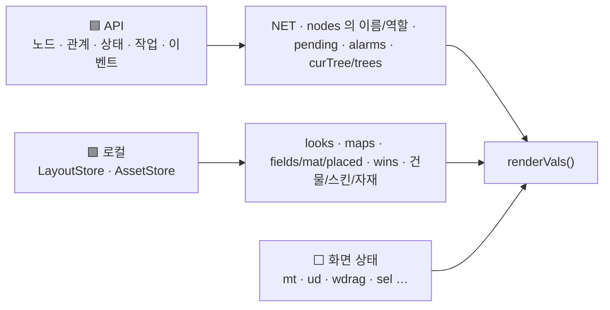

# 노드 화면 데이터 모델

프로토타입의 모든 데이터는 `constructor()`에 박힌 **예시값**이다. 이 문서는 상태 필드마다
**원래 어디서 와야 하는지**를 정한다. 호출 방법은 [[node-screen-api-integration|API 연동 가이드]].

## 1. 출처 분류

| 표시 | 뜻 | 저장 |
| --- | --- | --- |
| 🟦 **API** | Gateway invoke로 받아 온다. 화면은 캐시만 한다 | 없음 (새로고침마다 다시 받음) |
| 🟩 **로컬** | API에 자리가 없는 사용자 데이터. 화면이 만들고 저장한다 | `LayoutStore` · `AssetStore` (§3) |
| ⬜ **화면** | 애니메이션 · 선택 · 끌기 같은 순간 상태 | 메모리만 |



## 2. 상태 필드 전체

### 2.1 노드 관계 — `NET` 🟦

```js
NET = {
  'tree-home': { role: 'Tree · Leaf', kids: ['edge-01', 'nas-01', 'tree-lab'], bid: 'tower', auth: 'saved' },
  'edge-01':   { role: 'Leaf', kids: [], res: [['카메라 2대', '장치'], ['edge-agent', '모듈']] },
  …
}
```

| 필드 | 뜻 | 와야 할 곳 |
| --- | --- | --- |
| 키 | 노드 이름 | 노드 id를 키로 바꾸고 이름은 표시용으로 따로 둔다 (**이름은 겹칠 수 있다**) |
| `role` | `Tree` · `Leaf` · `Tree · Leaf` | tree: `terra.master.nodes.get`의 역할 · 중립: `gui.remote.nodes.get` |
| `kids` | 직속 자식 이름 | `terra.master.nodes.get` 결과의 **부모 Tree** 필드로 역산 (`nodes.by-node-id.patch`가 부모 Tree를 바꾼다) |
| `res` | leaf가 관리하는 자원 `[이름, 종류]` | leaf 자신: `terra.daemon.capabilities.get` · `modules.get` · (P2) `files.list.get` · `io.*`. tree에서 볼 때: `terra.master.nodes.by-node-id.modules.get` |
| `bid` | 프사로 쓸 건물 | 🟩 로컬 — `looks[이름].bid`로 옮긴다 |
| `auth` | `saved` · `password` · `offline` | ⚠ 화면 전용 예시. §2.8 참고 |

- 파생 함수: `isTree(role)`, `parentOfNode(name)`, `pathOf(name)`, `roleKey(label)` → `tree|leaf|both`.
- `NET`은 지금 `this.NET`(상태 밖)이다. 실제로는 **상태로 옮겨** 갱신 시 다시 그려지게 한다.

### 2.2 looks — 노드 모습 🟩

```js
looks = { 'tree-home': { skin: 'concrete', bid: 'tower', rot: 0 }, … }
```

- 노드마다 한 벌. 필드 · 자기 맵 · 프사 · 지도가 **모두 이것만 읽는다**([[node-screen-ui-spec#3. 노드 모습 한 벌|UI 명세 §3]]).
- 없으면 기본값: tree = `concrete` + 관계도의 `bid`, leaf = 기본 스킨(`grass`) + 건물 없음 (`lookOf`).
- 쓰기는 `setLook(name, patch)` 한 곳으로만.
- 키는 **노드 id**로 저장한다(이름 변경에 안전하도록).

### 2.3 맵 — 지금 맵과 다녀온 맵 🟩 + ⬜

| 필드 | 뜻 | 출처 |
| --- | --- | --- |
| `map` | 지금 보고 있는 맵의 주인 노드 | ⬜ |
| `fields` | 필드가 놓인 칸 키 목록 `['0-1', …]` | 🟩 |
| `mat` | 칸 → 스킨 id (노드 칸은 `looks`가 우선) | 🟩 |
| `placed` | 노드가 아닌 칸의 건물 `{ 칸: { bid, rot } }` | 🟩 |
| `nodes` | 칸 → `{ name, role, parent? }` — 이 맵에 배치된 노드 | 🟩 배치 + 🟦 이름·역할 검증 |
| `pending` | 새로 붙었지만 아직 칸이 없는 노드 | 🟦 에서 계산: `(API 자식) − (nodes에 배치된 것)` |
| `self` | leaf 맵에서 자기 칸 | 🟩 |
| `sel` | 선택한 칸 | ⬜ |
| `grounds` | 그라운드**만** 깔린 칸 키 목록 (필드 칸은 늘 그라운드가 있어 적지 않음) | 🟩 |
| `gmat` | 칸 → 그라운드 스킨 id (없으면 `meadow` 풀밭) — 필드 칸이면 그 아래 그라운드 | 🟩 |
| `grot` | 칸 → 그라운드 무늬 회전 (0~5, × 60°) | 🟩 |
| `frot` | 칸 → 필드 무늬(스킨) 회전 (0~5, × 60°) | 🟩 |
| `maps` | `{ 주인 이름: 위 필드들의 스냅숏 }` | 🟩 |

- 처음 가는 맵은 `defaultMap(name)`으로 만든다(반지름 5, 61칸).
- 맵을 떠날 때 `snapshotMap()`으로 `maps[지금]`에 넣고, 돌아올 때 꺼낸다.
- **동기화 규칙**: API 자식 목록이 바뀌면
  - 새 자식 → `pending`에 추가 (칸은 사용자가 편집 모드에서 지정)
  - 사라진 자식 → `nodes`에서 빼고 필드는 빈 필드로 남긴다
  - 역할이 바뀐 자식 → `nodes[칸].role`만 갱신

### 2.4 tree 세션 — `curTree` · `trees` 🟦 + 🟩

| 필드 | 뜻 | 출처 |
| --- | --- | --- |
| `curTree` | 로그인한 tree `{ name, role, bid, auth }` | 🟦 `agent.whoami.get` + 접속한 Gateway |
| `trees` | 관리 노드 창에서 고를 수 있는 다른 tree | 🟩 사용자가 등록한 접속 목록 + 🟦 각 tree `health.get` 결과 |
| `shown` · `swap` · `auth` · `login` | 프사 교체 · 로그인 진행 | ⬜ |

### 2.5 창 · 서랍 ⬜ + 🟩

| 필드 | 뜻 | 저장 |
| --- | --- | --- |
| `wins` | 창 id → `{ x, y, w }` | 🟩 창 배치 (선택) |
| `winOpen` | 창 id → 떠 있음 | 🟩 (선택) |
| `drawer` | 서랍창에 보관된 창 id 순서 | 🟩 (선택) |
| `winZ` | 앞뒤 순서 | ⬜ |
| `wdrag` · `winDrop` · `cardRise` · `drawerNear` · `drawerHover` | 끌기 · 애니메이션 | ⬜ |
| `WDEF()` | 창 정의(제목 · 이모지 · 색 · 파스텔 · 편집기 링크) | 상수 |

### 2.6 유틸 서랍 ⬜

| 필드 | 뜻 |
| --- | --- |
| `utilItems` | 카드 순서. 모듈이 기능을 더하면 늘어난다(🟦 `gui.modules.get` · `gui.scenes.get`의 기여) |
| `ud` | `{ mode: 'closed' \| 'cycle' \| 'list', s, scroll, anim }` — `list`는 코드에만 남아 있고 지금은 닿지 않는다 |

### 2.7 알림 🟦

| 필드 | 뜻 | 출처 |
| --- | --- | --- |
| `alarms` | `[{ t, g, c, m }]` 최근 30개 (시간 · 글리프 · 색 · 메시지) | 작업 완료/실패(§API 5), leaf `events` SSE, 로그인 실패, 맵 이동 |
| `notif` | 창 id → 안 읽은 수 | 화면에서 계산. 창을 열면 0 |

- 새 알림은 `pushAlarm(g, c, m)` 한 곳으로만 넣는다. 알림 창이 열려 있으면 `notif.alarm`을 올리지 않는다.
- 글리프 약속: `●` 초록 = 성공/새 노드 · `■` 빨강 = 실패 · `◇` 파랑/청록 = 접수·이동.

### 2.8 예시로만 존재하는 것 (반드시 교체)

> [!NOTE] 출하 화면에서는 교체됐다 (2026-10-03)
> 아래 예시는 디자인 원본(`design/*.dc.html`)과 생성물에 그대로 남아 있지만, 출하 화면은 실데이터 층이 첫 렌더 전에 지운다.
> 무엇으로 바뀌었고 무엇이 비어 있는지는 [[real-data-layer|실데이터 층]] §2 · §3.

| 예시 | 위치 | 교체 방법 |
| --- | --- | --- |
| 상태줄 `admin · 만료 21:40 · 권한: …` + "예시 데이터" 표식 | 템플릿 상단 | `agent.whoami.get`의 principal · 만료 · permissions. 표식 제거 |
| `NET` 전체 | constructor | §2.1 |
| `trees[].auth: 'offline'`이면 항상 실패, 비밀번호 `wrong`이면 실패 | `startLogin` | 실제 `auth.credentials.post` 결과 |
| 로그인 1.5초 지연 | `startLogin`의 `setTimeout(…, 1500)` | 실제 응답 대기 |
| `alarms` 3건 · `notif` 초기값 | constructor | 빈 배열 · 빈 객체 |
| `pending` 2건 | constructor | §2.3 계산 |
| 속성 창의 "관리하는 자원 · 예시" | 템플릿 | §2.1 `res` |
| 원형 메뉴 슬롯 8개(비어 있음) | `radialItems` | 모듈 기여 또는 고정 동작 — 설계 미정 |
| 편집기 창 본문 "○○ 화면이 이 창 안에 들어옵니다" | 템플릿 `w.isEd` | 편집기 화면을 창 안에 마운트 |

### 2.9 조타륜 앱 — `hb` · `hbd` · `io` 🟦 + ⬜

| 필드 | 뜻 | 와야 할 곳 |
| --- | --- | --- |
| `hb` | 열린 앱 키 ⬜ | — |
| `hbd['노드\|앱']` | 앱별 자원 목록(동작 · 연동이 넣은 것) 🟦 | 앱별 operation — [[helm-apps-integration\|조타륜 앱 연동]] §2. 없으면 `hbSeed`(예시) |
| `io` | 로컬 노드 I/O 장치(예시) 🟦 | `terra.daemon.io.devices.get` — 연동하면 `hbd`로 합친다 |
| `hbMsg` · `hbBusy` · `hbArm` · `hbPath` | 글줄 · 도는 카드 · 두 번 누르기 · 공유 폴더 경로 ⬜ | — |
| (`hbPerm(node)`) | 내 자리 · 권한 🟦 | `whoami.get` + tree 로그인 + 자원별 허가 — `src/model/permissions.js` |

자원 모양은 `src/model/types.js`(`SviResource` · `IoDevice` · `Transfer` · `Job` · `ModuleInfo` …).

### 2.10 전체 화면 — `fs` · `fsHist` · `fsList` ⬜ + 🟩

| 필드 | 뜻 | 저장 |
| --- | --- | --- |
| `fs` | 지금 전체 화면 id — 창 키 또는 `'hb:<앱>'` | 메모리 |
| `fsHist` | 전체 화면으로 한 번 연 id들(전체 창 리스트). 여기 든 창은 맵 화면에서 사라진다 | `LayoutStore` 권장 |
| `fsList` | 리스트 펼침 | 메모리 |

### 2.11 폴더 보관함 — `fb` ⬜ · 예시 트리 🟦

| 필드 | 뜻 | 와야 할 곳 |
| --- | --- | --- |
| `fb` | `{ open, mode, path }` 사이드 바 | 메모리 |
| `FBDATA().repo` | Terra 저장소 예시 트리 | `terra.daemon.files.list.get` |
| `FBDATA().local` | 로컬 루트 예시 트리 | `terra.daemon.local-fs.roots.get` · `entries.get`(Terra B-11) — [[helm-apps-integration\|앱 연동]] §4 |
| `fbMsg` · `fbArm` | 알림 띠 · 지우기 확인 | 메모리 |

### 2.12 메모장 — `memos` · `memoCur` · `memoDraft` 🟩

| 필드 | 뜻 | 와야 할 곳 |
| --- | --- | --- |
| `memos` | `{ id(경로), parent, name, dir?, text?, size?, info? }[]` | 지금(모듈): `LayoutStore`(이 브라우저 · 노드 · 주체마다). 서버 쪽 — 메모 루트(공유 폴더) 또는 서버 `LayoutStore` — 결정 필요 |
| `memoCur` · `memoDraft` · `memoNote` | 연 메모 · 고치는 중 `{ name, text, dir, dirty }` · 저장 알림 | 메모리 |

### 2.13 오버헤드 패널 (파생)

`renderVals().ovh` — 선택 상태 램프(`sel` · `nodes` · `NET` · `looks`에서 계산) · 전체 창 리스트(`fsHist`) · 맵 화면이 아니면 꺼짐(`fs`). 저장할 것이 없다.

### 2.14 노드 자원 · 표지 · 도로 🟩 + ⬜

| 상태 | 출처 | 모양 | 비고 |
| --- | --- | --- | --- |
| `rsrc` | 🟩 로컬 (맵마다 — `maps[이름].rsrc`) | `{ 칸: { app, id, name, node, emoji, type, io, at } }` | 필드에 설치한 노드 자원. `io = null` = 모니터링 전용. 모니터링 값은 원본 앱 목록(`hbItems(node, app)`)에서 그때그때 읽는다 — 모듈은 그 앱이 닫혀 있어도 `pollSec`마다 다시 받는다 · [[node-screen-ui-spec#2.8 노드 자원 설치\|UI 명세 §2.8]] |
| `place` · `placeMsg` | ⬜ 화면 | 설치하려고 고른 자원 · 안내 | 필드를 누르면 `rsrc`로 옮겨 가고 지워진다. Esc = 취소 |
| `rcfgKey` | ⬜ 화면 | 칸 키 | 자원 설정 창이 보여 주는 칸 |
| `markStyle` | 🟩 로컬 (사용자 설정) | `flag` · `flat` · `none` | 건물 없는 노드 · 자원 필드의 표지 — [[node-screen-ui-spec#2.9 건물 없는 필드의 표지 (편집 창에서 고름)\|UI 명세 §2.9]] |
| `evView` | ⬜ 화면 | `real` · `run` · `wait` · `stop` · `fail` | 이벤트 보기 (실제 상태 대신 한 이벤트로) — [[node-screen-ui-spec#2.11 이벤트 — 상태에 따라 다른 모습\|UI 명세 §2.11]]. 실제 상태: 노드 = `NET[이름].auth`(Master 가 오프라인으로 보면 `offline` → 정지) · 자원 = 원본 항목의 상태 |
| `roadsOn` | 🟩 로컬 (사용자 설정) | boolean | 도로 그림 표시 |
| `links` | 🟩 로컬 (맵마다 — `maps[이름].links`) | `[{ id, from, to, start, path[], road, io? }]` — `io`(MD-27)는 연결의 종류 · 끝점 · 쌍 · QoS · 상태([[io-link-svi-binding-design\|입출력 연결 설계]] §5). 없으면 화면 전용 | 연결하기로 만든 연결. 도로의 팔은 이것으로만 정해진다(`[start, …path, to]`의 이웃 칸 쌍). `to`는 합류 도로 칸일 수도 있다(입력 더하기) — [[node-screen-ui-spec#2.10 연결하기 — 도로 배치\|UI 명세 §2.10]] |
| `conn` · `pillOpen` · `pillSrc` · `roadPick` | ⬜ 화면 (`roadPick`은 🟩) | 끄는 중인 연결 · 펼친 설정 창 · 합류에서 고른 출발 자원 · 새로 깔 도로 종류 | |
| `linkOrphans` | 🟩 로컬 (`LayoutStore` — 사용자 문서) | `[{ binding_id, code, at }]` | 끊은 연결의 바인딩을 서버에서 못 닫은 것(MD-30) — 다음 맞추기에서 다시 닫고 비운다 |
| `roads` (`this.roads`) | 🟩 로컬 (`localStorage` `terra.gui.roads` → 나중에 `AssetStore`) | 도로 설계 목록 | [[road-editor-spec#4. 데이터\|도로 편집기 §4]]. 놓인 도로는 `placed[칸].bid = 'road:<id>'` |
| `scr` | ⬜ 화면 | `{ W, H }` | 화면 크기 — 창을 따라 바뀐다(`fitScreen` → `lay()`) |

> [!NOTE] 입출력 연결은 아직 데이터 모양이 없다
> 연결 자체는 `links`에 있다(자원 설정 창의 입력 · 출력이 여기서 나온다). 무엇을 어떤 형식으로 주고받는지(세부 입출력 설정)는 아직 모양이 없다 — 설정 화면 디자인이 나오면 SVI 바인딩(`허가 · 연결` 앱의 bind)과 맞춰 정한다.
> 제안(2026-10-07): [[io-link-svi-binding-design|입출력 연결 ↔ SVI 바인딩 설계]] §5 — 연결에 `io`(종류 · 끝점 · `schema_ref` · QoS · 방향 · `binding_id` · 상태)를 더한다. 지금 `허가 · 연결` 앱에는 bind 동작이 없다(같은 문서 §1.2).

## 3. 저장 위치가 정해지지 않은 데이터

> [!WARNING] API에 자리가 없다
> 노드가 **어떻게 생겼는지**(looks), **맵 배치**(maps · fields · mat · placed · nodes의 칸),
> **사용자 자산**(건물 설계도 · 필드 스킨 · 자재)은 코어 operation 274건 어디에도 저장할 곳이 없다.
> 코드 세션은 먼저 아래 인터페이스 뒤에 숨기고, 구현은 교체 가능하게 둔다.

```ts
interface LayoutStore {            // 노드 모습 · 맵 배치 · 창 배치
  loadLooks(treeId: string): Promise<Record<NodeId, Look>>;
  saveLook(treeId: string, nodeId: NodeId, look: Look): Promise<void>;
  loadMap(treeId: string, ownerId: NodeId): Promise<MapLayout | null>;  // null → defaultMap
  saveMap(treeId: string, ownerId: NodeId, map: MapLayout): Promise<void>;
  loadWindows(): Promise<WindowLayout>; saveWindows(w: WindowLayout): Promise<void>;
}
interface AssetStore {             // 편집기 3종이 만드는 것
  buildings(): Promise<Blueprint[]>;   saveBuilding(b: Blueprint): Promise<void>;
  fieldSkins(): Promise<FieldSkin[]>;  saveFieldSkin(s: FieldSkin): Promise<void>;
  parentDefault(): Promise<ParentDesign>; setParentDefault(p: ParentDesign): Promise<void>;
  materials(): Promise<Material[]>;    saveMaterial(m: Material): Promise<void>;
  subscribe(cb: () => void): () => void;   // 편집기에서 저장하면 노드 화면이 다시 굽는다
}
```

| 후보 | 장점 | 단점 |
| --- | --- | --- |
| ① 브라우저 저장(IndexedDB) | 바로 된다 | 기기마다 따로 · tree 간 공유 안 됨 |
| ② GUI 모듈의 자체 저장 API(모듈 API) | 노드와 함께 이동 | 모듈 API를 새로 정의해야 한다 |
| ③ Master 노드 **태그**(`nodes.by-node-id.patch`)에 `looks`만 | 코어만으로 가능 | 태그 크기 · 형식 제약 확인 필요, 맵 배치는 못 담는다 |

**권장:** 1차는 ①로 인터페이스를 세우고, ②를 설계 결정 사항으로 올린다. 키는 반드시
`treeId + nodeId`(이름 아님).

> [!NOTE] 지금 구현 (2026-10-04)
> ①을 `localStorage`로 세웠다 — `src/store/layout.js`(짝 프로젝트와 같은 모양). 모듈의 키는 `terra.gui.layout|<node_id>|<주체>`이고
> `looks` · `maps`(노드 자원 `rsrc` · 연결 `links` 포함) · 표시 설정 · `memos` · `wins`를 한 덩어리로 담는다. 맵 **안의** 노드는 화면 규칙대로 이름이 키지만, 저장본에 이름 → `node_id`(`nodeIds`)를 같이 적어 읽을 때 지금 이름으로 옮긴다(`remapNodes` — 이름이 바뀌어도 따라간다).
> 서버 저장으로 바꿀 때는 `loadLayout` · `saveLayout` 두 함수만 바꾼다 — [[module-profile|모듈 프로필]] §4.

### 3.1 편집기 ↔ 노드 화면 연결

> [!TIP] 도로 · 건물 편집기는 이미 이어져 있다
> 도로 편집기 · 건물 편집기는 내보내기 때 `localStorage['terra.gui.roads']` · `['terra.gui.buildings']`에 쓰고, 노드 화면은 `storage` 이벤트로 받아
> 다시 굽는다 — 다른 편집기를 `AssetStore`로 옮길 때 같은 모양(쓰기 → 구독 → 다시 굽기)을 따른다. [[road-editor-spec|도로 편집기]]

지금 편집기 3종은 각자 예시 데이터를 들고 따로 돈다(`BuildingEditor.state.bps`,
`FieldEditor.state.skins · parentDef`, `MaterialEditor.state.mats`). 노드 화면도 같은 데이터를
`samples()` · `fieldSkins()` · `makeMats()` · `parentDefault()`로 **자기 안에서 다시 만든다.**

연결 순서:
1. 네 곳의 생성 코드를 `AssetStore`의 초기 시드로 모은다.
2. 편집기는 `AssetStore`에서 읽고 저장한다.
3. 노드 화면은 `subscribe`로 바뀐 자산을 받아 `ensureBake()`(타일 굽기) · `exportModel()`(건물 2D 벡터)을 다시 돈다.
4. 부모 필드 디자인: 스킨의 `parent`가 `null`이면 `parentDefault`를 따른다 — 이 규칙은 편집기와 노드 화면이 **같은 함수**를 써야 한다.

### 3.2 애니메이션 자산의 모양

세 자산 모두 `frames` = **칸 배열**을 가진다. 1초 = 16칸 고정이고, `null`(빈 칸)은 앞 프레임을 그대로 보인다. 칸 0에는 늘 프레임이 있다. 기존 필드(`faces` · `blocks` · `top` …)는 **칸 0의 프레임**과 같게 둬서, 애니메이션을 모르는 코드도 그대로 돈다.

```js
// 자재 — 1초 고정 = 16칸
{ id: 'm21', name: '깃발 천 (펄럭)', type: 'anim', faces /* = frames[0] */, frames: [{ pz, nz, px, nx, py, ny }, null, { … }, null, …] /* 16 */ }
// 건물(설계도) — 1~4초 = 16~64칸. 블록 = [x, y, z, 자재 id, 방향]
{ id: 'windmill', name: '풍차', N: 16, period: 1, blocks /* = frames[0] */, frames: [[...블록], null, null, null, [...블록], …] /* 16 × period */ }
// 필드 스킨 — 1~4초 = 16~64칸. 부모 디자인 · lift · pattern은 프레임 밖(공통)
{ id: 'water', name: '물', top, band, side, fill, rim /* = frames[0] */, frames: [{ top, band, side, fill, rim: { leaf, tree, both } }, null, null, null, { … }, …] }
```

| 규칙 | 내용 |
| --- | --- |
| 시계 | 틱 = ⌊시각 / 62.5ms⌋ (초당 16). 모든 컴포넌트가 같은 틱을 쓴다 |
| 칸 선택 | 칸 t = 틱 mod 칸 수. 보이는 프레임 = `holdAt(frames, t)` = t부터 거꾸로 첫 프레임 |
| 자재 in 건물 | 자재 칸 = 틱 mod 16 — 건물 길이와 상관없이 1초마다 되풀이 |
| 일반 타입 | 칸 0에만 프레임이 있는 16칸 (`frames` 없이 저장해도 같게 읽는다) |
| 건물 굽기 | 한 주기의 틱마다 (건물 프레임, 쓰인 애니메이션 자재의 프레임) 조합을 모아 **다른 조합만** 굽는다. 풍차 = 8조합 × 4방향. 모든 프레임은 같은 테두리(합집합)로 굽는다 |
| 재생 표 | `_anims[키] = { urls, seq, T }` — `seq[틱 mod T]`번째 그림. 키: 건물 `b:<id>-<방향>`, 타일 `tile-<스킨>[-역할]` |
| 저장소 연동 | §3.1의 `AssetStore`에 `frames`(칸 배열) · `period`를 그대로 싣는다. 노드 화면은 자산이 바뀌면 그 자산의 프레임만 다시 굽는다 |

## 4. 파생 값 (renderVals에서 계산)

| 파생 | 계산 | 비고 |
| --- | --- | --- |
| 칸 스킨 | `mapSkin(m, map, key)` = 노드 칸이면 `lookOf(주인).skin`, 아니면 `mat[key]` | |
| 칸 높이 | `cellLift(m, sk, key)` — §UI 2.2 | |
| 칸 종류 | `cellKind(m, key)` = `parent` · `tree` · `leaf` · `both` · `false` | 테두리 선택 |
| 건물 | 노드 칸이면 `looks[주인].bid/rot`, 아니면 `placed[key]` | |
| 맞춤 변환 | `fx` — 타일보다 **먼저** 계산 | 늦게 계산하면 이전 값이 쓰인다 |

## 관련 문서

- [[docs/README|노드 화면 개발 문서 MOC]]
- [[node-screen-ui-spec|노드 화면 UI 명세]]
- [[node-screen-api-integration|노드 화면 API 연동 가이드]]
- [[node-screen-code-structure|코드 구조와 이식 가이드]]
- [[io-link-svi-binding-design|입출력 연결 ↔ SVI 바인딩 설계]] — §2.14 `links`를 SVI 바인딩 · 허가로

## 관련 모듈

- `terra-gui` — `LayoutStore` · `AssetStore`의 소유자 후보
