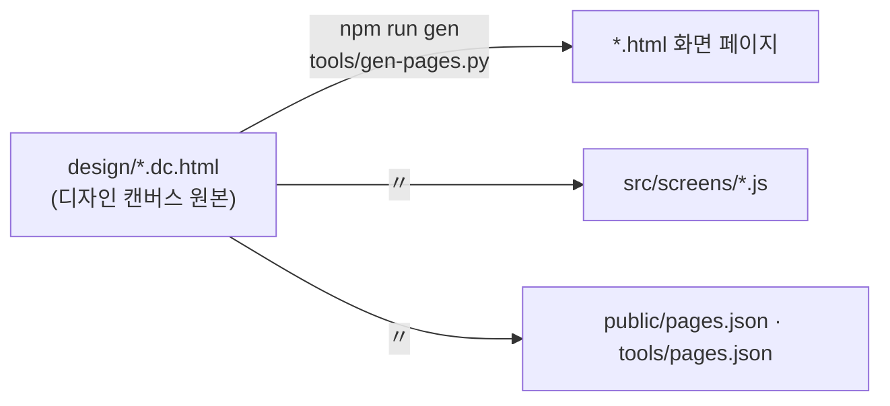

# 시작하기

## 1. 준비

| 도구 | 버전 | 쓰는 곳 |
| --- | --- | --- |
| Node.js | 18 이상 (CI는 24) | `npm run dev · build · test · test:smoke` · 가짜 Gateway |
| Python | 3.9 이상 | `npm run gen` (화면 페이지 다시 만들기) — 개발 서버만 쓸 거면 없어도 된다 |
| Playwright 브라우저 | `npx playwright install chromium` | 연기 시험 |

## 2. 실행

```bash
# Linux
npm install
npm run dev                         # http://localhost:5173
```

```powershell
# Windows (PowerShell) — 같은 명령
npm install
npm run dev
```

```bash
# macOS — 같은 명령
npm install && npm run dev
```

첫 화면(`index.html`)에서 노드 화면 · 편집기 · 디자인 노트로 간다. 노드 화면은 1447 × 945 고정이고 창에 맞춰 줄어든다.

| 해 볼 것 | 어떻게 |
| --- | --- |
| 조타륜 | 아래 가운데 흰 박스(테이블 네임 박스)를 누른다 → 가운데 로고를 누르면 앱 바 · 좌우로 끌기 · 휠로 돌리기 · 홀드해 아래로 내리면 로컬 노드 맵으로 |
| 전체 화면 | 창 · 앱 바의 ⛶ → 위쪽 파인 곳을 누르면 맵으로 · 가운데 흰 박스 = 전체 창 리스트 |
| 폴더 보관함 | 오른쪽 위 계기판 → 저장소 · 탐색기 · 메모장 |
| 맵 이동 | 노드 칸 두 번 누르기 · Space + 끌기로 맵 보기 이동 · 휠로 확대 |
| tree 전환 | 왼쪽 아래 프사를 누르고 있거나 Ctrl |

## 3. 디자인 원본과 생성



- 화면을 바꾸려면 원본을 고친 뒤 `npm run gen`. `src/screens/*.js`는 덮어쓰인다.
- 연동 코드는 `src/api`에 두고 seam을 바꿔 끼운다 — [[frontend-api|프론트엔드 API]] §5.

## 4. Gateway에 붙이기

### 4.1 단독 — 연습용 가짜 Gateway

```bash
node tools/mock-gateway.mjs 8790     # 가짜 Gateway — I/O 장치 · 모듈 몇 개만 답한다
# 브라우저: http://localhost:5173/node.html?live=1&gw=http://127.0.0.1:8790
```

`?live=1`이 없으면 예시 데이터 그대로다. 진짜 게이트웨이(leaf `:8787` · tree `:8788`)에는 이 길로 붙이지 않는다 —
앱은 게이트웨이가 정한 앱 origin에서만 서빙되고, 그 밖에서 부르면 CORS와 쿠키 정책에 막힌다. 진짜는 §4.2다.

### 4.2 Terra 안에서 — 모듈로

이 프로젝트는 Terra 모듈 `lab.stellaxia.node-gui`의 `web/`이다. 노드에서 띄우려면 모듈로 굽고 포장해 설치한다.
게이트웨이가 앱을 자기 origin에서 서빙하고, 셸 Scene의 `terra.web/frame`이 스코프 토큰을 건넨다.
무엇이 실데이터가 되는지는 [[architecture#7. Terra 안에서 — frame|구조 §7]].

```bash
# Linux — modules 저장소 루트에서
npm run build:web                                            # web/ → ui/
terra module pack common/lab.stellaxia.node-gui --out /tmp/node-gui.tmod
```

```powershell
# Windows (PowerShell) — 같은 명령, 출력 경로만 다르다
npm run build:web
terra module pack common/lab.stellaxia.node-gui --out $env:TEMP\node-gui.tmod
```

`ui/`가 없거나 스캐폴드의 자리 표시자인 채로 포장해도 `terra module pack`은 통과시킨다 — 저장소의
`npm run pack`(릴리스 경로)이 그 경우를 막는다. 자세한 것은 모듈 README(`common/lab.stellaxia.node-gui/README.md`).

## 5. 빌드 · 시험

```bash
npm run build      # ../ui/ — 모듈의 ui/ 를 새로 쓴다. 상대 경로라 어느 하위 경로에 올려도 된다
npm run preview
npm test           # 연동 층 시험 (node:test — 브라우저 없이 돈다)
```

`ui/`는 빌드 산출물이라 커밋하지 않는다(모듈의 `.gitignore`). 브라우저가 필요한 연기 시험은 `npm test`가 아니라
`npm run test:smoke`다 — CI 러너에는 브라우저가 없다.

## 관련 문서

- [[docs/README|개발 문서 MOC]]
- [[architecture|구조]]
- [[testing|시험]]
- [[implementation-guide|구현 가이드]]
- [[frontend-api|프론트엔드 API]] — §6.5 frame 안의 연동 층
