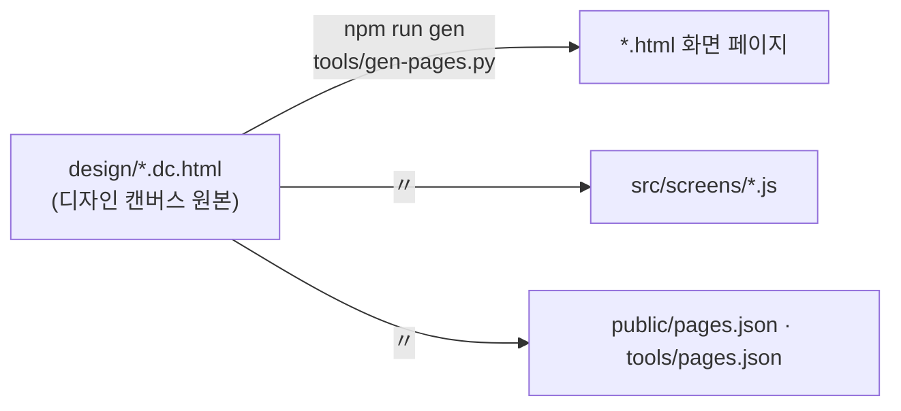

# 시작하기

## 1. 준비

| 도구 | 버전 | 쓰는 곳 |
| --- | --- | --- |
| Node.js | 18 이상 (CI는 24) | `npm run dev · build · test · test:smoke` |
| Python | 3.9 이상 | `npm run gen` (원본을 고친 뒤 화면 페이지 다시 만들기) — 개발 서버만 쓸 거면 없어도 된다 |
| Playwright 브라우저 | `npx playwright install chromium` | 연기 시험 |

## 2. 실행

```bash
# Linux
npm install
npm run dev                         # http://localhost:5173
```

```powershell
# Windows (PowerShell) — 같은 명령
npm install
npm run dev
```

```bash
# macOS — 같은 명령
npm install && npm run dev
```

첫 화면(`index.html`)은 **시작 화면**이다. Terra 밖이라 판에 `둘러보기 (데이터 없음)`이 서고, 누르면 구름을 지나 빈 세계의 노드 화면으로 내려간다.
화면 목록은 `screens.html`(개발용 — 빌드에 들어가지 않는다). 노드 화면은 창을 따라 늘고 준다(기준 1447 × 945 · 최소 1180 × 280).

| 해 볼 것 | 어떻게 |
| --- | --- |
| 시작 화면 | `index.html` → [둘러보기] → 구름 → 노드 화면. Terra 안에서는 [Terra 로그인]이다 — [[module-profile\|모듈 프로필]] §3 |
| 조타륜 | 아래 가운데 흰 박스(테이블 네임 박스)를 누른다 → 가운데 로고를 누르면 앱 바 · 좌우로 끌기 · 휠로 돌리기 · 홀드해 아래로 내리면 로컬 노드 맵으로 |
| 전체 화면 | 창 · 앱 바의 ⛶ → 위쪽 파인 곳을 누르면 맵으로 · 가운데 흰 박스 = 전체 창 리스트 |
| 폴더 보관함 | 오른쪽 위 계기판 → 저장소 · 탐색기 · 메모장 |
| 맵 이동 | 노드 칸 두 번 누르기 · Space + 끌기로 맵 보기 이동 · 휠로 확대 |
| tree 전환 | 왼쪽 아래 프사를 누르고 있거나 Ctrl |
| 노드 자원 설치 | 조타륜 앱 카드의 `📍 설치`(또는 카드를 끌어 맵에) → 빈 필드 → 자원 설정 창 — Terra 밖에서는 카드가 없다 |
| 연결하기 · 도로 | 노드 · 자원 칸을 고르고 상태 창 → 🔗 연결하기를 누른 채 끌기 · 왼쪽을 누른 채 우클릭 = 경유지 · 편집 창의 도로 목록을 끌어 놓기 |
| 도로 편집기 | 유틸 서랍의 `🛣️ 도로 편집기` (전체 화면이면 보드) · 단독으로는 `road.html` |

## 3. 디자인 원본과 생성



- 화면을 바꾸려면 원본을 고친 뒤 `npm run gen`. `src/screens/*.js`는 덮어쓰인다. 변형은 `public/config.json`의 `"variant": "module"` 하나다.
- 예시를 지우고 데이터를 채우는 것은 부트 프로필(`src/boot/module.js`)과 실데이터 층(`src/data/`)이다 — 화면 코드는 손대지 않는다. 연동 코드는 `src/api`에 두고 seam을 바꿔 끼운다 — [[frontend-api|프론트엔드 API]] §5.
- 원본을 GUI 원본 저장소 maingui(`StellaxiaLab/maingui`)에서 가져오는 순서 · 생성 때 바꾸는 글은 [[module-profile|모듈 프로필]] §6 · §8.

```text
web/
├── index.html · node.html · building.html · road.html …   # 화면 페이지 (tools/gen-pages.py가 만든다)
├── screens.html             # 화면 목록 (개발용)
├── public/
│   ├── config.json          # ★ 실행 설정 — variant · layoutStore · pollSec (빌드 결과 ui/config.json 만 고쳐도 된다)
│   └── pages.json           # 화면 목록
├── src/
│   ├── runtime/dc.js        # 작은 템플릿 런타임
│   ├── screens/*.js         # 화면 로직 (design/*.dc.html 에서 생성 — 손대지 않는다)
│   ├── boot/                # ★ 부트 프로필 module.js · 공통 보정 fixes.js
│   ├── data/                # 실데이터 층 — 예시를 지운 클래스 · 진짜 출처 · 시작 화면
│   ├── api/                 # 연동 층 — frame · client · operations · adapters · source · wire · config
│   ├── store/layout.js      # LayoutStore — 맵 배치 · 노드 자원 · 연결 · 메모 저장
│   └── model/               # 데이터 모양(JSDoc) · 권한 · 배지 규칙
├── design/                  # 디자인 캔버스 원본 (.dc.html · canvas.json · 로고)
├── docs/                    # 개발 문서 (docs/README.md 부터)
├── tools/                   # gen-pages.py · pages.json
└── tests/                   # node:test 시험 · 연기 시험(smoke)
```

## 4. Gateway에 붙이기

### 4.1 단독 — 데이터 없음

`npm run dev`로 띄운 화면은 Terra 밖이라 닿을 곳이 없다. 시작 화면은 `둘러보기`, 노드 화면은 **빈 세계**(`이 노드` 한 칸의 맵 · 로그인 전)로 뜬다 —
예시 데이터는 보이지 않는다([[real-data-layer|실데이터 층]]). 화면 모양 · 동작을 고칠 때는 이것으로 충분하다.

예전의 가짜 Gateway(`tools/mock-gateway.mjs` · `?live=1`)는 예시 장치를 들고 있어 함께 뺐다. 진짜 게이트웨이(leaf `:8787` · tree `:8788`)에
밖에서 붙이는 길은 없다 — 앱은 게이트웨이가 정한 앱 origin에서만 서빙되고, 그 밖에서 부르면 CORS와 쿠키 정책에 막힌다. 데이터는 §4.2다.

### 4.2 Terra 안에서 — 모듈로

이 프로젝트는 Terra 모듈 `lab.stellaxia.node-gui`의 `web/`이다. 노드에서 띄우려면 모듈로 굽고 포장해 설치한다.
게이트웨이가 앱을 자기 origin에서 서빙하고, 셸 Scene의 `terra.web/frame`이 앱 entry(`ui/index.html` — 시작 화면)를 띄우고 스코프 토큰을 건넨다.
무엇이 실데이터가 되는지는 [[architecture#7. Terra 안에서 — frame|구조 §7]].

```bash
# Linux — modules 저장소 루트에서
npm run build:web                                            # web/ → ui/
terra module pack common/lab.stellaxia.node-gui --out /tmp/node-gui.tmod
```

```powershell
# Windows (PowerShell) — 같은 명령, 출력 경로만 다르다
npm run build:web
terra module pack common/lab.stellaxia.node-gui --out $env:TEMP\node-gui.tmod
```

`ui/`가 없거나 스캐폴드의 자리 표시자인 채로 포장해도 `terra module pack`은 통과시킨다 — 저장소의
`npm run pack`(릴리스 경로)이 그 경우를 막는다. 자세한 것은 모듈 README(`common/lab.stellaxia.node-gui/README.md`).

## 5. 빌드 · 시험

```bash
npm run build      # ../ui/ — 모듈의 ui/ 를 새로 쓴다. 상대 경로라 어느 하위 경로에 올려도 된다
npm run preview
npm test           # 연동 층 시험 (node:test — 브라우저 없이 돈다)
```

`ui/`는 빌드 산출물이라 커밋하지 않는다(모듈의 `.gitignore`). 브라우저가 필요한 연기 시험은 `npm test`가 아니라
`npm run test:smoke`다 — CI 러너에는 브라우저가 없다.

## 관련 문서

- [[docs/README|개발 문서 MOC]]
- [[architecture|구조]]
- [[testing|시험]]
- [[implementation-guide|구현 가이드]]
- [[frontend-api|프론트엔드 API]] — §6.5 frame 안의 연동 층
- [[module-profile|모듈 프로필]] — 변형 · 시작 화면 · LayoutStore · 원본(maingui)과 맞추기
