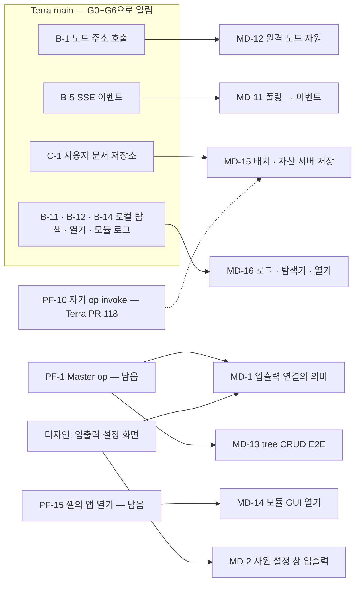

# 구현해야 할 것 — 새 GUI를 모듈로 올린 뒤

2026-10-04, GUI 원본 저장소 [`StellaxiaLab/maingui`](https://github.com/StellaxiaLab/maingui) `f24c3bc`(service 판 = 저장소 뿌리 — 예시 데이터를 뺀 판)를
바탕으로 모듈 `lab.stellaxia.node-gui` 0.2.0을 만들고 진짜 스택(Master · Daemon · 게이트웨이 · `io.terra.file` · `io.terra.io-inventory` · leaf UI 셸) 위에서
끝까지 돌린 뒤 남은 일이다. 예시 데이터 판(maingui `examples/` · demo)은 참고로만 썼다.

> [!NOTE] 처음 받은 압축 파일 → maingui 저장소
> 처음에는 압축 파일 두 개로 받았다 — 이름과 내용이 반대였다(`terra-node-gui-demo.zip` 안이 `variant: "service"` — 예시 없음, `terra-node-gui-service.zip` 안이 `variant: "demo"`).
> 그 뒤 원본 저장소 maingui를 받아 **모듈을 그 저장소 기준으로 다시 맞췄다**. maingui에는 압축 판에 없던 기능이 더 있다 — 자원 추가 · 수정 · 삭제 폼(`HELM_CRUD`) ·
> 상태 화면 · 모듈 GUI 창 · 노드 자원 공유(공유 목록 · 내보내기) · 오버헤드 패널 접기. 이 목록의 UP-12~UP-18이 그때 찾은 것이다.

| 묶음 | 누가 | 높음 | 중간 | 낮음 |
| --- | --- | --- | --- | --- |
| **PF** Terra 플랫폼 — 모듈만으로는 못 한다 | Terra 코어 | 1 | 3 | 4 |
| **MD** 이 모듈 | modules 저장소 | 1 | 9 | 5 |
| **UP** GUI 원본(maingui) · 디자인에 올릴 것 | GUI 원본 쪽 | — | 3 | 2 |
| **Q** 사람이 정할 것 | 소유자 | — | — | — |

남은 것만 센다(2026-10-05). Terra G0~G6이 닫은 PF는 §1.2, 원본이 고친 UP는 §3.0에 있다.

## 1. Terra 플랫폼 — 모듈만으로는 못 하는 것 (PF)

> [!NOTE] Terra G0~G6 뒤 다시 쟀다 (2026-10-05)
> Terra가 maingui 백로그의 B · C 표를 operation으로 열었다 — [노드 GUI 지원 구현 계획](https://github.com/StellaxiaLab/terra/blob/main/docs/implementation/node-gui-platform-support-plan.md) G0~G6.
> 진짜 스택을 Terra main `6e7858f`로 다시 빌드하고, 이 모듈 앱의 스코프 토큰(`tsa_`)으로 하나씩 불러 확인했다.
> 그 설계는 이 모듈(frame판)을 이렇게 적는다 — 스코프 토큰을 쓰므로 Master op가 401이고, 새로 내는 표면은 세션 id 중계를 쓴다.
> 그래서 새 표면(노드 주소 호출 · 사용자 문서 · SSE)은 닿고, Master op는 여전히 닿지 않는다.

### 1.1 남은 것

| ID | 무엇 | 지금 — Terra main 실측 | 막히는 화면 | 우선 |
| --- | --- | --- | --- | --- |
| **PF-1** | 앱 스코프 토큰으로 **Master operation**에 닿는 길 | leaf 게이트웨이 카탈로그에 `terra.master.*`가 0개고 `/api/upstream/…`은 404다(이 배치). tree 게이트웨이에서도 스코프 토큰은 Bearer를 싣지 않아 Master가 401이다 — Bearer는 발급자 밖으로 나가지 않는다는 설계상 경계. Terra는 새 표면만 세션 id 중계로 열었다 | 조타륜 SVI 자원 · 허가 · 연결, 작업 기록(Master jobs), 노드 관리, 모듈 노드 지정(B-6), 노드 공유 목록(C-3), 네트워크 보드, 설정의 클러스터 탭, 관리 노드 창의 tree 계층, **입출력 연결의 실제 의미(MD-1)** | 높음 |
| **PF-7** | 명령 출력 | `commands.execute.post` → 202. 그런데 `tasks.by-task-id.get`은 `id · kind · type · state · 시각`뿐이다(`echo`로 실측 — 출력 없음). 출력이 있는 Master 작업은 PF-1 | 조타륜 명령 · 작업 앱의 출력 · 다시 실행 | 중간 |
| **PF-8** | 셸을 새로 고쳐도 남는 세션 | 반쯤 열렸다. frame은 안쪽 Scene이 로그인했으면 그 Handle, 아니면 **셸의 Bearer**(`sessionStorage`)로 앱 토큰을 받는다(`web-frame-inner.ts`). 이 모듈의 Scene 로그인은 Handle을 `secret` Store에 두는데 그 Store는 새로 고침에 사라진다 — 다시 로그인한다(실측 `NO_SESSION`). 셸에서 로그인한 판은 남는다(코드 읽기 — 실측은 MD-6에서) | 시작 화면 → 매번 로그인 카드 | 중간 |
| **PF-9** | 앱 자산 CSP `frame-ancestors`에 앱 자신의 origin | 반쯤 — B-17 `--gui-frame-ancestors`(배치 설정)가 생겼다. 기본값은 그대로라 srcdoc 3겹 우회를 남긴다 | 우회로 돈다 | 낮음 |
| **PF-10** | `terra.gateway.*`을 invoke로 부르면 앱 토큰이 익명이 된다 | 원인을 찾았다 — 게이트웨이는 자기 op를 loopback으로 되돌리는데 앱 토큰은 싣지 않는다. whoami뿐 아니라 사용자 문서(`me.documents`)도 invoke로는 403이었다. **고쳐 올렸다 — [Terra#118](https://github.com/StellaxiaLab/Terra/pull/118)**(자기 op는 프로세스 안에서 답한다 · 진짜 스택 실측) | 경로 호출(`client.get`)로 우회 중. MD-15도 #118 전까지는 경로로 | 낮음 |
| **PF-14** | 모듈 설치 · 설정 · 제거 | 반쯤 — B-6 노드 지정(`nodes.by-node-id.modules.assignments.*`, `module.manage`★)이 생겼지만 Master op라 PF-1에 막힌다. 설정은 설계(proposed)다 | 모듈 앱의 `＋ 추가` · `✎` · `🗑` | 낮음 |
| **PF-15** | 앱 안에서 **다른 모듈의 GUI**를 여는 길 | 남았다 — 스코프 토큰으로는 앱 토큰을 발급받지 못한다(실측 `SCOPE_TOKEN_DENIED` "앱 스코프 토큰 발급에는 사용자 세션이 필요합니다" — 설계대로). 셸에 "앱 열기" 요청(예: `emit('open-app', { app })`)이 필요하다 | 모듈 GUI 창(`🖥`) | 중간 |
| **PF-16** | 노드의 공유 목록 | 반쯤 — C-3 노드 주체 허가 = 흐름 허용 목록(G6). 읽기가 Master `svi.grants.get {node_id …}`라 PF-1 | 상태 화면의 공유 목록 · 네트워크 창의 공유 그래프 | 낮음 |

### 1.2 Terra G0~G6이 닫은 것 — 앱 토큰 실측 (2026-10-05)

| ID | 무엇 | Terra | 실측 (이 모듈 앱 토큰) | 모듈에서 |
| --- | --- | --- | --- | --- |
| PF-2 | 다른 노드의 operation | B-1 노드 주소 호출 | `GET /api/v1/nodes/{node}/catalog` 200 · `POST /api/v1/nodes/{node}/operations/terra.daemon.io.devices.get/invoke` 200 | MD-12 |
| PF-3 | 사용자 데이터 서버 저장 | C-1 사용자 문서 저장소 | 이름공간이 `app:lab.stellaxia.node-gui.web`로 **고정**된다 — put · get · 목록 200(`revision`), 다른 이름공간은 403 | MD-15 |
| PF-4 | 로컬 최상위 루트 · 로컬 프로그램으로 열기 | B-11 · B-12 | `terra.daemon.local-fs.roots.get` 200(`file.read`). `desktop.open.post`는 `node.control` · 확인 필요 — 눌러 보지는 않았다 | MD-16 |
| PF-5 | 앱 토큰으로 받는 이벤트 | B-5 SSE | invoke + `Accept: text/event-stream` → 200 `text/event-stream`. 스캔하자 `terra.io.devices.changed`가 왔다 | MD-11 |
| PF-11 | leaf 게이트웨이의 모듈 로그 | B-14 | `terra.gateway.modules.by-id.logs.get` 200 · `terra.daemon.modules.by-module-id.logs.get` 200 | MD-16 |
| PF-12 | `storage.shared_dirs` 스키마 타입 | B-15 ① | `config.schema.get` → `object_list` | — |
| PF-6 | 파일 받기 · 올리기 | (Terra 몫이 아니었다) | `io.terra.file.transfers.*`는 원래 있다 — 조각 루프는 화면 일이다. maingui A-2가 지었다 | MD-17 |
| PF-13 | 선언 쓰기 op | **진단 정정** | 선언 op 셋(`svi.declarations.post` · `undeclare` · `forget`)은 Daemon 계약에 처음부터 있었다. 카탈로그는 호출자가 쥔 권한으로 거른다(`narrowList`). `node.config`★는 기본 권한 밖이라 **관리자 토큰에도** 안 보인다(관리자 143 · 앱 142 / 전체 156) | Q-10 |

## 2. 이 모듈에서 할 것 (MD)

| ID | 무엇 | 왜 · 지금 상태 | 선행 | 우선 |
| --- | --- | --- | --- | --- |
| **MD-1** | 입출력 연결의 **실제 의미** — `links`를 데이터 흐름(SVI 바인딩 · 허가)으로 | 지금 연결은 화면의 선(도로)이고 저장만 된다. 무엇을 어떤 형식으로 주고받는지 데이터 모양이 없다([[node-screen-data-model\|데이터 모델]] §2.14). 연결을 만들 때 `허가 · 연결` 앱의 bind를 부르고, 상태를 도로 이벤트(동작 · 대기 · 실패)로 돌려받는 것까지 | PF-1 · 입출력 설정 화면 디자인 | 높음 |
| **MD-2** | 자원 설정 창의 입력 · 출력 세부 설정 | 디자인이 "추후"다([[node-screen-ui-spec\|UI 명세]] §2.8) | 디자인 | 중간 |
| **MD-3** | 사용자 이벤트(건물 · 도로의 `+ 이벤트`)가 켜지는 규칙 | 편집기에서 만들 수 있지만 맵에서 켜지는 조건이 없다(UI 명세 §2.11 "상태 연동은 추후") | 규칙 결정 | 중간 |
| **MD-6** | 진짜 스택 E2E를 CI로 | 지금은 손으로 돈다([[testing\|시험]] §6) — Master · Daemon · 셸 · 브라우저가 필요하다. modules CI는 이미 Terra를 체크아웃한다(`test:scenes`) | — | 중간 |
| **MD-9** | Terra 세션 띠의 디자인 자리 | 로그인 · 로그아웃 띠는 모듈이 그린 흰 캡슐이다(`frame-session.js`) — 원본 디자인에 자리가 없다 | 디자인 | 낮음 |
| **MD-10** | 번들에 남은 예시 문자열 | 원본 미리보기의 예시 상수가 번들에 **문자열로** 남는다(화면 · 요청에는 나가지 않는다 — 시험이 지킨다). 지우려면 원본 미리보기 데이터를 따로 떼야 한다 | 원본 작업 방식 | 낮음 |
| **MD-11** | 폴링을 이벤트로 | 알림 · 설치한 자원 · 조타륜 앱을 `pollSec`마다 다시 받는다. 이제 길이 있다 — `terra.daemon.events.get`을 invoke + `Accept: text/event-stream`으로(B-5, §1.2 실측) · `Last-Event-ID`로 이어 받는다. maingui `src/api/events.js`가 본보기다 | — (PF-5 닫힘) | 중간 |
| **MD-12** | 원격 노드 자원 | 다른 노드 맵에 그 노드 자원을 설치해도 모니터링 값을 받을 길이 없었다("닿지 않음"). 이제 노드 주소 호출(B-1)로 그 노드의 Daemon op를 부른다 — 그 노드 카탈로그로 미리 잠근다(maingui A-17) | — (PF-2 닫힘) | 낮음 |
| **MD-13** | tree 게이트웨이에서 Master 쪽 추가 · 수정 · 삭제 E2E | 허가 · 바인딩 · 터널 열기 · 선언 · 피어 회수 · 다른 노드 작업의 본문은 Master 코드로 맞췄지만(`decodeJSON` 입력 구조) 시험 스택이 leaf라 실제로 부르지 못했다(`not-in-catalog`). tree 노드에 모듈을 깔고 돌린다 | PF-1(위임) | 중간 |
| **MD-14** | 모듈 GUI 창에서 그 모듈의 GUI 열기 | 지금은 `/api/v1/gui/apps`로 GUI가 있는지 · 주소만 보인다 | PF-15 | 낮음 |
| **MD-15** | 맵 배치 · 자산 서버 저장 | LayoutStore(배치 · 모습 · 노드 자원 · 연결 · 메모 · 창 자리)와 도로 · 건물 설계를 사용자 문서 저장소로 옮긴다. 이름공간은 `app:lab.stellaxia.node-gui.web`(앱 토큰이면 고정) · 키 `layout` · `assets`. 쓰기마다 `base_revision`을 싣고, 409면 알린 뒤 다시 쓴다. 브라우저에는 지금처럼 바로, 서버에는 뒤따라 — 다른 기기 · 다른 브라우저에서 같은 맵 | — (PF-3 닫힘). invoke는 PF-10(#118) 뒤, 그 전엔 경로 | 중간 |
| **MD-16** | 모듈 로그 · 폴더 탐색기 · 열기 | 모듈 앱 `로그` → 상태 화면 출력 칸(B-14). 폴더 보관함 `폴더 탐색기` → `local-fs.roots` · `entries`(B-11). `열기` → `desktop.open.post`(B-12 — 두 번 눌러). 다른 노드는 `scopes: ["local"]`이라 잠근다 | — | 중간 |
| **MD-17** | 파일 올리기 · 받기 | 공유 폴더 · 파일 전송 앱 — 파일 고르기 → `transfers.create`(크기 · SHA-256) → 조각 → 409면 서버 offset부터 → 완료 검사. maingui A-2(`source.upload` · `sha256.js`)를 옮긴다 | — | 중간 |
| **MD-18** | 장치 손 등록 | I/O 앱 `＋ 추가` → `terra.daemon.io.devices.post`(B-10, `node.control`), 없으면 지금처럼 스캔. io-inventory에 수동 원천이 있어야 한다 | modules #26 | 낮음 |
| **MD-19** | maingui `2ced429` 따라가기 | 이 모듈은 maingui `f24c3bc`에 맞췄다. 그 뒤 원본이 창 크기 정책(`7cf56da`) · 결정 C-1~C-6 · Terra G0~G6 연동(A-16~A-27)을 더했다. 화면(`design/`)은 Q-12대로 복사하고, 연동 층은 이 모듈 `src/api`에 필요한 것만 옮긴다 — 앱 토큰 판이라 Master op · 핸들 경로는 다르다 | — | 중간 |

### 끝낸 것

| ID | 무엇 | 어떻게 · 언제 |
| --- | --- | --- |
| **MD-4** | LayoutStore 안의 노드 키 — 이름이 바뀌어도 따라간다 | 저장할 때 이름 → `node_id`(`nodeIds`)를 같이 적고, 읽을 때 지금 관계도의 이름으로 옮긴다(`layout.js` `remapNodes`) — 맵 주인 · 노드 칸 · 새 노드 · 모습 · 노드 자원의 노드 · 연결이 고른 자원. 사라진 노드의 칸은 같은 이름을 얻은 **다른** 노드에게 넘기지 않는다. 예전 저장본(`nodeIds` 없음)은 그대로 읽는다. 저장 형식은 그대로 이름 키라 서버 저장(PF-3)으로 옮겨도 같다 · 2026-10-05 |
| **MD-5** | leaf 맵 자기 칸에서 연결 시작 · 상태 창 | maingui `f24c3bc`가 `nodeAt()`으로 자기 칸을 노드로 보게 됐다 — 캡슐이 뜨고, 자원 → 자기 칸은 공유가 되고, 자기 칸에서 나가는 연결은 원본 규칙대로 다른 맵에서 들어온 자원이 있어야 한다. `fixes.js`는 설치(`placeAt`)만 막는다 · 2026-10-05 |
| **MD-7** | 폴더 자원의 모니터링 경로 | 설치한 폴더 · 파일 자원과 상태 화면이 보는 칸의 **위 칸까지** 읽는다(`wire.js` `folderPaths` · `source.js` 경로 여럿) · 2026-10-04 |
| **MD-8** | 로그아웃 → 시작 화면으로 | 다 내려간 뒤(또는 내려가는 중) 토큰을 잃으면 시작 화면이 노드 화면을 걷고 판으로 돌아온다(`intro-live.js` `flyBack` — 하늘 다시 그리기 · 노드 화면 투명 · 누름 끄기 · "로그아웃했다"). 다시 로그인하면 다시 내려간다 · 2026-10-05 |

그 밖에 maingui 기준으로 다시 맞추며(2026-10-04) 자원 추가 · 수정 · 삭제를 실제 호출로(지어내지 않기) · 값을 적어야 하는 앱 바 동작의 폼 · 상태 화면 · 모듈 GUI 창 · `ovhHide` 저장 — [[real-data-layer|실데이터 층]] §2.4 · §2.5 · §5.2.

## 3. GUI 원본(maingui) · 디자인에 올릴 것 (UP)

모듈을 만들며 찾은 것이다. service 판은 같은 진짜 게이트웨이(`/gw` → `127.0.0.1:28787`)에 `tools/serve.mjs`로 붙여 확인했다.
UP-1~UP-11은 압축 판에서, UP-12~UP-18은 maingui `f24c3bc`에서 찾았다. 아래 §3.1 표는 그때 기준이다 — 지금 상태는 §3.0.

### 3.0 지금 상태 (2026-10-05, maingui `2ced429`)

| 상태 | ID | 어디서 |
| --- | --- | --- |
| 원본에 올렸다 | UP-1 · UP-2 · UP-3 · UP-10 · UP-12(나) · UP-15 · UP-18 | [maingui#1](https://github.com/StellaxiaLab/maingui/pull/1) — 고치기 전 코드에서 실패하는 시험과 함께 |
| 원본이 고쳤다 | UP-4 · UP-5 · UP-6 · UP-7 · UP-8 · UP-12(가 · 다 · 라 · 마) · UP-13 · UP-17 | maingui `19d2a70`(연동 층을 실제 Gateway에) · `2ced429`(G0~G6 연동) |
| 남았다 | UP-9 · UP-11 · UP-12(바 · 사) · UP-14 · UP-16 | 아래 — maingui `2ced429`에서 다시 봤다 |

- **UP-9** — `service.js` `hbPerm`이 로컬 노드를 여전히 `소유자` · 모든 권한으로 둔다. 원본의 선택일 수 있다(권한 없는 호출은 게이트웨이가 거절한다)
- **UP-11** — UI 명세 §2.9가 여전히 §2.13 뒤에 있다
- **UP-12(바 · 사)** — `＋ 추가`의 전송은 여전히 조각 없이 만든다(↑ 올리기 A-2는 따로 있다). 이 노드의 작업도 Master `commands.post`로 보낸다 — leaf 게이트웨이에는 그 op가 없다
- **UP-14** — 길이 없으면 `origSave()`로 화면에만 넣는다(`⚠ … 화면에만 반영했다`). A-5 잠금이 많은 경우를 앞에서 막는다
- **UP-16** — 상태 화면 노드 칸의 로그인 줄이 `auth`가 없으면 `로그인됨`이다

### 3.1 찾은 것 — 그때 표

| ID | 무엇 | 근거 (실측) | 모듈은 | 우선 |
| --- | --- | --- | --- | --- |
| **UP-1** | 화면 잘림 두 가지 | (가) 시작 화면은 `full` 맞춤(무대 1447×945를 창에 맞춰 키움)인데 루트가 이미 `100vw × 100vh`라 두 번 커진다 — 창 비율이 1447:945가 아니면 판이 한쪽으로 밀리고, **그 안에 미리 읽은 노드 화면이 잘린다**(1447×1000 → 아래 55px · 1800×1050 → 오른쪽 약 350px · 아래 105px). (나) 노드 페이지의 `#stage`가 1447×945 고정이고 `fitScreen`이 `html` · `body`에 `overflow: hidden`을 걸어, 창 높이가 945를 넘으면 body가 945에서 자른다 — 아래 테이블이 잘리고 회색 띠(**demo 판에서도 재현**) | 생성기에서 고쳤다 — 시작 화면 `viewport` 맞춤 · 노드 무대 `100vw × 100vh` | 높음 |
| **UP-2** | service 시작 화면의 `v0.2 · 예시 데이터` | 판 아래 오른쪽 글이 그대로 남는다 — `SERVICE_TPL`에 `index`가 없다 | `Terra 노드 · Terra 안/밖` | 낮음 |
| **UP-3** | leaf 맵의 자기 칸(`self`) — **설치** | 압축 판에서는 길 찾기가 그 칸을 빈 필드로 보고 노드 위에 도로를 깔았다(실측). maingui `f24c3bc`는 `nodeAt()`으로 길 찾기 · 대상 · 상태 창을 고쳤지만, 설치(`placeAt`)는 칸의 `nodes`만 봐서 **자원이 자기 칸에 놓인다** | `fixes.js`가 `placeAt`만 막는다 | 중간 |
| **UP-4** | service 로그인이 진짜 게이트웨이에서 **실패한다** | `terra.gateway.auth.credentials.post`에 `{ username, password, remember }`를 보내 `401 CREDENTIAL_REJECTED`(맞는 비밀번호로도). 그 op은 `{ email, password }`를 받고 **핸들(`tch_…`)**을 돌려준다 — 핸들은 셸이 앱 토큰을 받는 데 쓰는 것이라 Bearer로 내면 `anonymous`다. 쿠키도 주지 않는다. 독립 웹은 `terra.gateway.auth.login.post`(`{ email, password }`) → `access_token`(1시간) · `refresh_token` · `user` → 모든 호출에 `Authorization: Bearer` | 해당 없음 — 모듈은 웹이 로그인하지 않는다 | 높음 |
| **UP-5** | service가 로그인 없이 노드 화면을 연다 | `whoami`가 200 + `principal: "anonymous"` · 권한 0을 주는데 `ok`로 읽는다 → `node.html`이 로그인 화면으로 가지 않는다(실측). 또 `principal`은 문자열(사용자 id)인데 `{ name }` 객체로 추정했다 — 화면 이름은 로그인 응답의 `user.display_name` · `email` | 모듈은 frame 토큰 유무로 가른다 | 높음 |
| **UP-6** | service 알림 스트림 | `new EventSource('/gw/api/v1/operations/terra.daemon.events.get/invoke')` — invoke는 POST라 GET은 **405**, 끝없이 다시 붙는다. 실제 binding은 `GET /events`(WebSocket) | 작업 폴링(PF-5 전까지) | 중간 |
| **UP-7** | service 노드 목록 | leaf 게이트웨이에는 `terra.master.nodes.get` route가 없다(`MODULE_ROUTE_NOT_FOUND`) — `GET /api/v1/agent/nodes`(`node.read`)로 | 모듈은 `agent/nodes` | 중간 |
| **UP-8** | service 연동 층(`src/api`)이 실측 전 판 | 모듈이 진짜 스택에서 고친 것: 게이트웨이 모듈 op 이름(`modules.by-module-id.*` → 실제 `modules.by-id.*`, 이 노드는 Daemon 경로) · `pathInput`(op의 `by-…` 자리만, 모르는 키를 싣지 않기) · 폴더 단계 읽기 · WireGuard가 꺼져 있으면 피어를 부르지 않기(422) · 작업 기록과 접수 구분 · 상태 낱말 정규화(표에 없는 값이면 렌더가 멈춘다) · 경로 호출 `client.get` | 모듈의 `src/api`가 앞선다 — Q-9 | 중간 |
| **UP-9** | service의 로컬 노드 권한 | 로컬 노드를 "소유자 · 모든 권한"으로 가정한다 — 실제 계정 권한과 다르다 | 모듈은 토큰이 실제로 쥔 권한 | 중간 |
| **UP-10** | 연기 시험의 창 크기 | 1447×945 창에서만 돌아 UP-1을 잡지 못했다 — 다른 창 크기(1447×1000 · 1800×1050 · 1280×720)를 더한다 | 모듈 smoke는 1700×1000으로 바꿔 본다 | 중간 |
| **UP-11** | 문서 계보 | 짝 프로젝트 문서 일부가 예전 판 기준이다 — 데이터 모델 §2.9~2.13(조타륜 앱 · 전체 화면 · 폴더 보관함 · 메모장)이 빠졌고, API 연동 가이드의 체크리스트가 되돌아갔고, 표 안의 위키 링크에 `\|` 이스케이프가 빠져 Obsidian · GFM 표가 깨진다. UI 명세 §2.9가 §2.12 뒤에 있다 | 모듈 문서는 합쳐서 고쳤다 | 낮음 |
| **UP-12** | `HELM_CRUD` 본문이 실제 서버의 입력과 다르다 | 서버 코드와 견줬다 — 모두 모르는 키를 거절한다. (가) 폴더: 추가 `{path, parents}`에 `root`가 없고 `path`가 칸 id(공유 폴더 이름 포함)라 엉뚱한 경로, 이름 바꾸기 `{from, to}` — 계약은 `{root, path, to}`, 지우기 `{path: 칸 id}` (나) 선언: `{declaration: {…}, replace, reuse_name}` — Daemon은 **평평한** 선언 `{family, name, direction, command, args, …}` (다) 터널: `{target, local_bind}` — Master는 `{source_node_id, target_node_id, target_port, local_bind_host, local_port}` (라) 피어 회수: `{node_id}` — Master는 `{source_node_id, target_node_id}` (마) 장치 이름 바꾸기를 제안(`by-device-id.patch`)으로 뒀지만 `alias.post`가 이미 있다 (바) 전송 추가 `{direction, path, size_bytes, mode}` — 청크 없이 만들면 매달린 전송이 남는다 (사) 이 노드의 작업도 Master `commands.post`로 보낸다 — Daemon `commands.execute.post`가 있다 | 모듈은 실제 입력으로 맞췄다(`HELM_CRUD` · 시험 `tests/crud.test.mjs`) | 높음 |
| **UP-13** | `LiveSource.call`이 Master op마다 `node_id`를 본문에 싣는다 | Master `decodeJSON`은 모르는 키를 거절한다 — 허가 · 터널 · 피어 회수 · 명령 같은 POST가 400이 된다 | 읽기 · 지우기(GET · DELETE)만 query로 싣는다 | 높음 |
| **UP-14** | 서버에 길이 없는 추가 · 수정 · 삭제가 화면 목록에 항목을 **지어 넣는다** | `⚠ Gateway에 아직 이 동작의 길이 없다 — 화면에만 반영했다` — 다음 폴링이 지우고, 사람은 됐다고 믿는다. 지어 넣는 항목에 가짜 값(`listening` · `0 / 16` · `running` · `완료` …)이 들어간다 | 길이 없으면 폼 · 확인 대기를 **열기 전에** 말하고 아무것도 바꾸지 않는다 | 중간 |
| **UP-15** | 시작 화면의 아래 두 알약이 내려간 뒤에도 **누름을 가로챈다** | 게이트웨이 · 꼬리말 알약이 `opacity 0`으로만 사라진다(`pointer-events` 그대로 · z-index 3 > 노드 화면 iframe 1). 노드 화면의 왼쪽 · 오른쪽 아래 누름이 먹힌다 — 앱 전체 화면 폼의 저장 단추가 눌리지 않았다(실측) | 생성기에서 `pointer-events: {{v.chromePe}}` | 중간 |
| **UP-16** | 상태 화면 노드 칸의 "로그인" 줄 | `auth`가 없으면 `로그인됨` — 로그인 전에도 그렇게 그린다 | 이 화면의 세션으로 적는다 | 낮음 |
| **UP-17** | 모듈 GUI 창 | GUI 제공 여부를 제안 필드(`gui` · `ui`)로 읽는다 — 공개 경로 `GET /api/v1/gui/apps`가 `moduleId` · `route` · `origin`을 이미 준다. 창은 "이 창 안에 뜬다 (iframe)"라고 그리지만 다른 모듈의 앱은 띄울 수 없다(PF-15) | `/api/v1/gui/apps`로 알고, 띄울 수 없다고 적는다 | 중간 |
| **UP-18** | 메모장 경로 글 `~/.terra/memos/` | 실제 메모는 LayoutStore(이 브라우저)에 있다 — 경로가 사실과 다르다 | `메모/` | 낮음 |

## 4. 사람이 정할 것 (Q)

모듈 README의 Q-1~Q-6 다음 번호다. 열려 있는 앞 결정 — **Q-2**(Master 데이터를 웹에 어떻게 · PF-1) · **Q-3**(메모 · 설계도 · 맵 배치를 어디에 · PF-3) · **Q-5**(여러 tree 전환) — 은 그대로 남는다.

| ID | 결정 | 이번 기본값 | 다른 길 |
| --- | --- | --- | --- |
| **Q-7** | 앱 entry를 시작 화면으로 둘까 | **예** — `ui/index.html`. 열 때마다 시작 화면 → (토큰이 있으면 약 1.4초 뒤) 구름 → 노드 화면 | `module.json` entry를 `ui/node.html`로 되돌리면 노드 화면이 곧장 뜬다(시작 화면은 남는다) |
| **Q-8** | Terra 안의 로그인 모양 | **Scene의 로그인 카드** — 시작 화면은 [Terra 로그인]만 보낸다(웹이 비밀번호를 받지 않는다 — 웹 프로그램 감싸기 설계 §3.3.1) | 디자인된 판(하늘 · 바다 · 조타륜)을 **Scene의 로그인 Fragment**로 옮긴다 — 비밀번호를 받는 쪽이 Scene이면 안전하다 · PF-8(세션 지속)과 함께 |
| **Q-9** | 연동 층을 하나로 | 정하지 않았다 — 모듈 `src/api`가 실측으로 고친 판이고, 짝 프로젝트는 예전 판이다 | 모듈 판을 짝 프로젝트로 되돌린다(UP-8) · 공유 패키지로 뗀다 |
| **Q-10** | `node.config`★를 앱 권한에 넣을까 | 넣지 않았다 — 설정 화면의 운영자 키와 자원 선언 쓰기(`svi.declarations.post` · `undeclare` · `forget` — PF-13 정정)가 잠겨 보인다 | `module.json`의 `permissions`에 더한다. 사용자 권한과의 교집합이라 사용자에게도 있어야 한다 — `node.config`★는 기본 권한 밖이라 관리자 계정에도 따로 주어야 한다 |
| **Q-11** | 디자인 노트 페이지(`components` · `helm` · `helm-apps`) | 모듈에서 뺐다(service 판과 같다). 원본은 `design/`에 남겼다 | demo 판에서만 본다 |
| **Q-12** | maingui를 어떻게 따라갈까 | `design/`을 **복사**하고 맞춘 커밋(`f24c3bc`)을 문서에 적는다 — [[module-profile\|모듈 프로필]] §8. 모듈에서 찾은 원본 쪽 문제는 원본에 PR로 올린다(maingui#1) | git submodule · subtree로 묶는다 · 연동 층(`src/api`)을 공유 패키지로 뗀다(Q-9와 같이) |
| **Q-13** | "삭제"의 뜻 | 작업 = **취소**(기록은 남는다) · 선언 = **철회**(퇴역 원장에 남는다) · 전송 = **포기**(부분 파일도 지운다 — `keep_partial: false`) · 끝난 전송 = 화면에서만 치우기 | 전송 삭제를 `중단`(부분 파일 남김 — 카드의 `중단`과 같다)으로 |

## 관련 문서

- [[docs/README|개발 문서 MOC]]
- [[module-profile|모듈 프로필]] — 변형 · 시작 화면 · LayoutStore · 생성 때 바꾸는 것
- [[real-data-layer|실데이터 층]] — §3 비어 있는 것 · §5 실측
- [[implementation-guide|구현 가이드]] — 실데이터로 옮기는 순서 · 결정 필요
- [[node-screen-ui-spec|노드 화면 UI 명세]] §2.6~2.12 · [[road-editor-spec|도로 편집기]]
- 모듈 README(`common/lab.stellaxia.node-gui/README.md`) — 결정 Q-1~Q-6 · 검증 기록
- Terra [노드 GUI 지원 구현 계획](https://github.com/StellaxiaLab/terra/blob/main/docs/implementation/node-gui-platform-support-plan.md) — G0~G6 · B-1~B-18 · C-1~C-6 (PF §1.2의 근거)
- maingui [구현 백로그](https://github.com/StellaxiaLab/maingui/blob/main/docs/design/implementation-backlog.md) — A-1~A-29 · A.4(이 목록의 UP)

## 관련 모듈

- `lab.stellaxia.node-gui` — 이 목록의 주인
- Terra 게이트웨이 · Master · Daemon — PF 묶음의 주인
- GUI 원본 저장소 `StellaxiaLab/maingui`(service = 뿌리 · demo = `examples/`) — UP 묶음의 주인. 예전 이름 `terra-node-gui` · `terra-node-gui-demo`

## 관련 흐름

- PF-1 → MD-1: Master 위임이 열려야 연결이 실제 바인딩이 된다
- UP-4 · UP-5 · UP-12 · UP-13: 원본이 진짜 게이트웨이에 맞췄다(`19d2a70`) — 남은 UP-12(바 · 사)만 모듈 쪽 `HELM_CRUD`를 보면 된다
- B-5 → MD-11 · B-1 → MD-12 · C-1 → MD-15: Terra가 길을 열었고 모듈이 옮길 차례다
- PF-10(Terra#118) → MD-15: 병합되면 사용자 문서도 operationId(invoke)로 부른다
- PF-15 → MD-14: 셸이 "앱 열기"를 받아야 모듈 GUI 창이 실제로 연다
