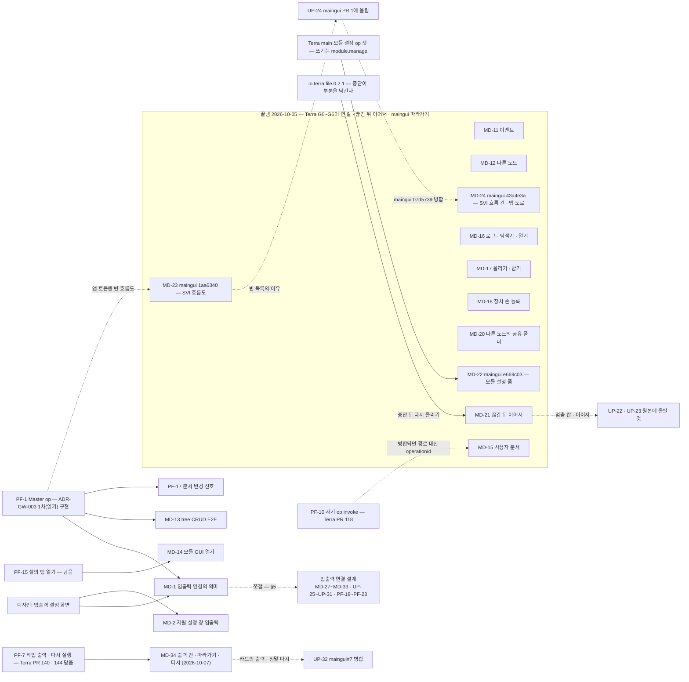

# 구현해야 할 것 — 새 GUI를 모듈로 올린 뒤

2026-10-04, GUI 원본 저장소 [`StellaxiaLab/maingui`](https://github.com/StellaxiaLab/maingui) `f24c3bc`(service 판 = 저장소 뿌리 — 예시 데이터를 뺀 판)를
바탕으로 모듈 `lab.stellaxia.node-gui` 0.2.0을 만들고 진짜 스택(Master · Daemon · 게이트웨이 · `io.terra.file` · `io.terra.io-inventory` · leaf UI 셸) 위에서
끝까지 돌린 뒤 남은 일이다. 예시 데이터 판(maingui `examples/` · demo)은 참고로만 썼다.

> [!NOTE] 처음 받은 압축 파일 → maingui 저장소
> 처음에는 압축 파일 두 개로 받았다 — 이름과 내용이 반대였다(`terra-node-gui-demo.zip` 안이 `variant: "service"` — 예시 없음, `terra-node-gui-service.zip` 안이 `variant: "demo"`).
> 그 뒤 원본 저장소 maingui를 받아 **모듈을 그 저장소 기준으로 다시 맞췄다**. maingui에는 압축 판에 없던 기능이 더 있다 — 자원 추가 · 수정 · 삭제 폼(`HELM_CRUD`) ·
> 상태 화면 · 모듈 GUI 창 · 노드 자원 공유(공유 목록 · 내보내기) · 오버헤드 패널 접기. 이 목록의 UP-12~UP-18이 그때 찾은 것이다.

| 묶음 | 누가 | 높음 | 중간 | 낮음 |
| --- | --- | --- | --- | --- |
| **PF** Terra 플랫폼 — 모듈만으로는 못 한다 | Terra 코어 | 4 | 3 | 8 |
| **MD** 이 모듈 | modules 저장소 | 4 | 7 | 5 |
| **UP** GUI 원본(maingui) · 디자인에 올릴 것 | GUI 원본 쪽 | 3 | 7 | 9 |
| **Q** 사람이 정할 것 | 소유자 | — | — | — |

남은 것만 센다(2026-10-05 저녁 · 2026-10-07에 §5 입출력 연결 설계의 PF-18~PF-23 · MD-27~MD-33 · UP-25~UP-31을 더했다). Terra G0~G6이 닫은 PF는 §1.2, 이 모듈이 끝낸 MD는 §2 "끝낸 것", 원본이 고친 UP는 §3.0에 있다.
2026-10-07 저녁 — Terra가 PF-7(작업 출력 · 다시 실행)을 닫았다([Terra#140](https://github.com/StellaxiaLab/Terra/pull/140) · [Terra#144](https://github.com/StellaxiaLab/Terra/pull/144)). 이 모듈이 따라갔다(MD-34) — 생성기 패치 하나가 원본에 올릴 것(UP-32)으로 남는다.
2026-10-08 — 레지스트리로 설치해 Terra 셸에서 열어 재 본 결과(맵 진입 20초+ · 지어낸 CPU · 메모리 · 디스크 값 · 빈 창)를 MD-35~MD-40 · UP-33~UP-36으로 올렸다. 측정과 근거는 [[performance-and-fidelity-recommendations|맵 진입 지연과 가짜 값 — 개선 권고안]] — 어느 것을 **디자인(maingui 원본)** 에서, 어느 것을 **코드(이 저장소)** 에서 하는지는 그 문서 §0 · §8.
Terra G0~G6이 연 길(B-1 · B-5 · C-1 · B-11 · B-12 · B-14)은 이 모듈이 모두 옮겼다 — MD-11 · MD-12 · MD-15~MD-20.
끊긴 뒤 이어서(MD-21)도 끝냈다 — 그 길에서 찾은 io.terra.file 문제(invoke로 보낸 중단이 늘 포기)를 0.2.1로 함께 고쳤다.
maingui `e669c03`(A-29 ~ A-33)도 따라갔다(MD-22) — 모듈 수정 폼이 모듈 설정이 됐다(Terra main의 설정 op 셋).
maingui `1aa6340`(A-20 · A-28)도 따라갔다(MD-23) — SVI 자원 앱이 흐름도가 됐다. SVI · 네트워크 읽기는 Master op다 — 위임 입구 1차(PF-1, 2026-10-09)로 SVI 목록은 닿고, 흐름 이벤트(SSE)는 2차라 예시 흐름 이벤트는 돌리지 않는다.
maingui `43a4e3a`(`07d5739` — maingui#1 병합 · `85e28ee` — A-28 흐름 칸 · 맵 도로)도 따라갔다(MD-24) — 상태 화면에 흐름 칸, 맵에 흐르는 도로. 앱 토큰으로는 열린 핸들이 없어 구독을 열지 않는다.

## 1. Terra 플랫폼 — 모듈만으로는 못 하는 것 (PF)

> [!NOTE] Terra G0~G6 뒤 다시 쟀다 (2026-10-05)
> Terra가 maingui 백로그의 B · C 표를 operation으로 열었다 — [노드 GUI 지원 구현 계획](https://github.com/StellaxiaLab/terra/blob/main/docs/implementation/node-gui-platform-support-plan.md) G0~G6.
> 진짜 스택을 Terra main `6e7858f`로 다시 빌드하고, 이 모듈 앱의 스코프 토큰(`tsa_`)으로 하나씩 불러 확인했다.
> 그 설계는 이 모듈(frame판)을 이렇게 적는다 — 스코프 토큰을 쓰므로 Master op가 401이고, 새로 내는 표면은 세션 id 중계를 쓴다.
> 그래서 새 표면(노드 주소 호출 · 사용자 문서 · SSE)은 닿고, Master op는 여전히 닿지 않는다.

### 1.1 남은 것

| ID | 무엇 | 지금 — Terra main 실측 | 막히는 화면 | 우선 |
| --- | --- | --- | --- | --- |
| **PF-1** | 앱 스코프 토큰으로 **Master operation**에 닿는 길 | **1차 구현됨(2026-10-09)** — Terra [Terra#143](https://github.com/StellaxiaLab/Terra/pull/143) · 모듈: tree 는 operation id, leaf 는 `/api/upstream` 경로(`src/api/master-delegated.js` — Terra 계약에서 만든 28 op 표, CI 대조). 결정은 [Terra ADR-GW-003](https://github.com/StellaxiaLab/Terra/blob/main/docs/architecture/ADR-GW-003-master-operation-access-for-app-tokens.md)([Terra#136](https://github.com/StellaxiaLab/Terra/pull/136)): 게이트웨이가 Core peer 자격 + 세션 id로 기존 Master 라우트를 부르는 위임 입구. 1차 = **읽기(GET)만 · 앱 토큰만 · 관리자 제외**, tree · leaf 둘 다. 2차 = 쓰기 · 관리자 · 에이전트 · Master SSE. 지금 실측: leaf 게이트웨이 카탈로그에 `terra.master.*`가 0개고 `/api/upstream/…`은 404다(이 배치 — ADR은 코드로는 501 또는 401이 나와야 한다고 읽었고 404의 원인은 확인하지 못했다). tree 게이트웨이에서도 스코프 토큰은 Bearer를 싣지 않아 Master가 401이다 — Bearer는 발급자 밖으로 나가지 않는다는 설계상 경계. Terra는 새 표면만 세션 id 중계로 열었다 | 열린 것(1차): 조타륜 SVI 자원 · 허가 · 핸들 · 바인딩 목록, 작업 기록(Master jobs), 노드 상세, 노드 공유 목록(C-3). 네트워크 보드의 사설망 · 진단 · 라우팅 · 조작 이력(2026-10-09, 실데이터 층 §5.8). **남은 것:** 진짜 leaf 스택에서 모듈 화면 실측(Terra 쪽 leaf 배치 e2e는 Terra#154). 설정의 클러스터 탭은 관리자 동작(`admin.clusters.*`)이라 1차에 들지 않는다. 2차를 기다릴 것: 연결(bind) · 허가 만들기, 모듈 노드 지정(B-6), 사용자 관리, 설정의 클러스터 탭, **입출력 연결의 실제 의미(MD-1)** — bind · 허가가 쓰기다. 관리 노드 창의 tree 계층은 어느 라우트인지 확인 전 | 높음 |
| **PF-8** | 셸을 새로 고쳐도 남는 세션 | 반쯤 열렸다. frame은 안쪽 Scene이 로그인했으면 그 Handle, 아니면 **셸의 Bearer**(`sessionStorage`)로 앱 토큰을 받는다(`web-frame-inner.ts`). 이 모듈의 Scene 로그인은 Handle을 `secret` Store에 두는데 그 Store는 새로 고침에 사라진다 — 다시 로그인한다(실측 `NO_SESSION`). 셸에서 로그인한 판은 남는다(코드 읽기 — 실측은 MD-6에서) | 시작 화면 → 매번 로그인 카드 | 중간 |
| **PF-9** | 앱 자산 CSP `frame-ancestors`에 앱 자신의 origin | 반쯤 — B-17 `--gui-frame-ancestors`(배치 설정)가 생겼다. 기본값은 그대로라 srcdoc 3겹 우회를 남긴다 | 우회로 돈다 | 낮음 |
| **PF-10** | `terra.gateway.*`을 invoke로 부르면 앱 토큰이 익명이 된다 | 원인을 찾았다 — 게이트웨이는 자기 op를 loopback으로 되돌리는데 앱 토큰은 싣지 않는다. whoami뿐 아니라 사용자 문서(`me.documents`)도 invoke로는 403이었다. **고쳐 올렸다 — [Terra#118](https://github.com/StellaxiaLab/Terra/pull/118)**(자기 op는 프로세스 안에서 답한다 · 진짜 스택 실측) | 없음 — 모듈은 경로로 부른다(whoami · `me/documents` — `client.get` · `client.request`). #118이 들어가면 operationId로 바꿔도 된다 | 낮음 |
| **PF-14** | 모듈 설치 · 제거 | 반쯤 — B-6 노드 지정(`nodes.by-node-id.modules.assignments.*`, `module.manage`★)이 생겼지만 Master op라 PF-1에 막힌다 — 쓰기라 ADR-GW-003의 2차다. **설정은 열렸다** — Daemon `modules.by-module-id.config.*`(Terra main `3195421`, 쓰기는 `module.manage`★) → MD-22 | 모듈 앱의 `＋ 추가` · `🗑` | 낮음 |
| **PF-15** | 앱 안에서 **다른 모듈의 GUI**를 여는 길 | 남았다 — 스코프 토큰으로는 앱 토큰을 발급받지 못한다(실측 `SCOPE_TOKEN_DENIED` "앱 스코프 토큰 발급에는 사용자 세션이 필요합니다" — 설계대로). 셸에 "앱 열기" 요청(예: `emit('open-app', { app })`)이 필요하다 | 모듈 GUI 창(`🖥`) | 중간 |
| **PF-16** | 노드의 공유 목록 | 반쯤 — C-3 노드 주체 허가 = 흐름 허용 목록(G6). 읽기가 Master `svi.grants.get {node_id …}` — ADR-GW-003 1차로 닿는다(2026-10-09) | 상태 화면의 공유 목록 · 네트워크 창의 공유 그래프 | 낮음 |
| **PF-17** | 앱 토큰으로 받는 **사용자 문서 변경 신호** | 새로 찾았다 — 문서를 쓰면 Master가 그 사람에게만 `terra.documents.changed`를 낸다(`announceDocument`). 앱 토큰의 이벤트는 이 노드 Daemon 것(`terra.daemon.events.get`)이라 그 신호가 오지 않는다. Master 이벤트는 PF-1 경계 — ADR-GW-003은 Master SSE를 2차로 미뤘다(필터 주체와 함께) | 다른 창 · 기기가 바꾼 배치를 곧장 받지 못한다 — 다음 쓰기의 409 알림 · 새로 고침에 받는다(MD-15). 길: 게이트웨이가 앱 이름공간(`app:<appId>`)의 문서 신호만 그 앱 토큰의 SSE에 실어 준다 | 낮음 |

### 1.2 Terra G0~G6이 닫은 것 — 앱 토큰 실측 (2026-10-05)

| ID | 무엇 | Terra | 실측 (이 모듈 앱 토큰) | 모듈에서 |
| --- | --- | --- | --- | --- |
| PF-2 | 다른 노드의 operation | B-1 노드 주소 호출 | `GET /api/v1/nodes/{node}/catalog` 200 · `POST /api/v1/nodes/{node}/operations/terra.daemon.io.devices.get/invoke` 200 | MD-12 |
| PF-3 | 사용자 데이터 서버 저장 | C-1 사용자 문서 저장소 | 이름공간이 `app:lab.stellaxia.node-gui.web`로 **고정**된다 — put · get · 목록 200(`revision`), 다른 이름공간은 403 | MD-15 |
| PF-4 | 로컬 최상위 루트 · 로컬 프로그램으로 열기 | B-11 · B-12 | `terra.daemon.local-fs.roots.get` 200(`file.read`) · `entries.get` 200. `desktop.open.post`(`node.control`)를 눌렀다 — 이 컨테이너엔 바탕화면이 없어 503 `DESKTOP_SESSION_UNAVAILABLE`(설계대로). 실행 파일은 409 `DESKTOP_OPEN_EXECUTABLE` | MD-16 |
| PF-5 | 앱 토큰으로 받는 이벤트 | B-5 SSE | invoke + `Accept: text/event-stream` → 200 `text/event-stream`. 스캔하자 `terra.io.devices.changed`가 왔다 | MD-11 |
| PF-11 | leaf 게이트웨이의 모듈 로그 | B-14 | `terra.gateway.modules.by-id.logs.get` 200 · `terra.daemon.modules.by-module-id.logs.get` 200 | MD-16 |
| PF-12 | `storage.shared_dirs` 스키마 타입 | B-15 ① | `config.schema.get` → `object_list` | — |
| PF-6 | 파일 받기 · 올리기 | (Terra 몫이 아니었다) | `io.terra.file.transfers.*`는 원래 있다 — 조각 루프는 화면 일이다. maingui A-2가 지었다 | MD-17 |
| PF-7 | 명령 출력 · 다시 실행 | Terra PF-7 — [Terra#140](https://github.com/StellaxiaLab/Terra/pull/140)(출력 쪽 읽기 `tasks.by-task-id.output.get` · 출력 SSE `output.events.get` · 다시 실행 `rerun.post` · 가리기 · 감사) · [Terra#144](https://github.com/StellaxiaLab/Terra/pull/144)(실행 중 등록 · Master 작업 env 가리기 · 확인 승인) | **앱 토큰 실측 (2026-10-09)** — Terra main `1e13d75` 스택에서 이 앱 토큰으로 실행 중 읽기 · SSE 따라가기 · 비밀 가림 · 다시 실행 · 노드 주소 호출 읽기 · Master가 보낸 작업의 409를 확인했다(`web/tools/live-taskout.mjs` 15개 — [[real-data-layer\|실데이터 층]] §5.7). Gateway를 지나는 SSE가 15초 넘게 사는 것은 Terra#144가 실측했다 | MD-34 |
| PF-13 | 선언 쓰기 op | **진단 정정** | 선언 op 셋(`svi.declarations.post` · `undeclare` · `forget`)은 Daemon 계약에 처음부터 있었다. 카탈로그는 호출자가 쥔 권한으로 거른다(`narrowList`). `node.config`★는 기본 권한 밖이라 **관리자 토큰에도** 안 보인다(관리자 143 · 앱 142 / 전체 156) | Q-10 |

## 2. 이 모듈에서 할 것 (MD)

| ID | 무엇 | 왜 · 지금 상태 | 선행 | 우선 |
| --- | --- | --- | --- | --- |
| **MD-1** | 입출력 연결의 **실제 의미** — `links`를 데이터 흐름(SVI 바인딩 · 허가)으로 | 지금 연결은 화면의 선(도로)이고 저장만 된다. 무엇을 어떤 형식으로 주고받는지 데이터 모양이 없다([[node-screen-data-model\|데이터 모델]] §2.14). 연결을 만들 때 `허가 · 연결` 앱의 bind를 부르고, 상태를 도로 이벤트(동작 · 대기 · 실패)로 돌려받는 것까지. 원본 A-28 흐름도(MD-23)가 SVI 쪽 흐름(엔드포인트 · 핸들 · 바인딩 · 허가)을 그리게 됐지만 맵의 연결과는 아직 따로다. **설계: [[io-link-svi-binding-design\|입출력 연결 ↔ SVI 바인딩 설계]]**(2026-10-07) — 대응 표 · 시퀀스 · `links[].io` 모양 · 설정 화면 요구사항, MD-27~MD-33으로 쪼갰다(§5) | PF-1 · 입출력 설정 화면 디자인(UP-25) | 높음 |
| **MD-2** | 자원 설정 창의 입력 · 출력 세부 설정 | 디자인이 "추후"다([[node-screen-ui-spec\|UI 명세]] §2.8) | 디자인 | 중간 |
| **MD-3** | 사용자 이벤트(건물 · 도로의 `+ 이벤트`)가 켜지는 규칙 | 편집기에서 만들 수 있지만 맵에서 켜지는 조건이 없다(UI 명세 §2.11 "상태 연동은 추후") | 규칙 결정 | 중간 |
| **MD-6** | 진짜 스택 E2E를 CI로 | 지금은 손으로 돈다([[testing\|시험]] §6) — Master · Daemon · 셸 · 브라우저가 필요하다. modules CI는 이미 Terra를 체크아웃한다(`test:scenes`) | — | 중간 |
| **MD-9** | Terra 세션 띠의 디자인 자리 | 로그인 · 로그아웃 띠는 모듈이 그린 흰 캡슐이다(`frame-session.js`) — 원본 디자인에 자리가 없다 | 디자인 | 낮음 |
| **MD-10** | 번들에 남은 예시 문자열 | 원본 미리보기의 예시 상수가 번들에 **문자열로** 남는다(화면 · 요청에는 나가지 않는다 — 시험이 지킨다). 지우려면 원본 미리보기 데이터를 따로 떼야 한다 | 원본 작업 방식 | 낮음 |
| **MD-13** | tree 게이트웨이에서 Master 쪽 추가 · 수정 · 삭제 E2E | 허가 · 바인딩 · 터널 열기 · 선언 · 피어 회수 · 다른 노드 작업의 본문은 Master 코드로 맞췄지만(`decodeJSON` 입력 구조) 시험 스택이 leaf라 실제로 부르지 못했다(`not-in-catalog`). tree 노드에 모듈을 깔고 돌린다 | PF-1(위임) | 중간 |
| **MD-14** | 모듈 GUI 창에서 그 모듈의 GUI 열기 | 지금은 `/api/v1/gui/apps`로 GUI가 있는지 · 주소만 보인다 | PF-15 | 낮음 |
| **MD-35** | 타일 · 도로 PNG를 **빌드 시점에** 굽기 | 맵 진입 20초+의 주원인 — 런타임에 `toDataURL` 318회 · 약 36MB · 메인 스레드 점유([[performance-and-fidelity-recommendations\|권고안]] §1). 굽는 함수는 생성 파일(원본)에 있어 모듈 빌드가 부를 방법을 UP-33과 맞춘다. 서비스 판 번들에도 같게 | UP-33 | 높음 |
| **MD-36** | 노드 카드 CPU · 메모리 · 디스크 — **지어낸 값 가리기** (임시) | 노드 이름 해시로 만든 값이다(`node.js:4393`) — 실제는 0~2% · 6% · 28%인데 24% · 48% · 87%(노랑)가 뜬다. 실데이터 operation이 있으면 잇고, 없으면 칸을 `—`로. 지금은 `src/boot/module.js` · `src/data/*.js`로 끼운다 — 원본이 고치면(UP-34) 걷는다. 시험: 이름만 다른 두 노드가 같은 값을 내지 않는다 | — | 높음 |
| **MD-37** | 데이터 요청을 굽기보다 **먼저** | `catalog` 서버 2ms인데 클라이언트에서 7.9초, 이후 요청이 14.7초에야 나간다. 부트에서 요청을 먼저 시작하고 첫 화면 밖(io 장치 · 파일 목록 · 와이어가드 · 설정 스키마)은 늦춘다. **재측정으로 이 추정이 맞는지 확인** — 틀리면 원인이 다른 것이다 | — | 높음 |
| **MD-40** | 모듈 · 사용자 · 설정 창 **본문** | "…화면이 이 창 안에 들어옵니다"와 숫자 한 줄뿐이다. 무엇을 기다리는지(아직 구현 안 됨 · 열 수 없음) 구분해 말하고 "보드에서 열기"를 눈에 띄게. 디자인 쪽은 UP-36 | UP-36 | 중간 |
| **MD-38** | 모듈 없음과 오류를 구분 | `io.devices.get` · `files.list.get` 503은 `io.terra.io-inventory` · `io.terra.file`이 없어서다 — 사유를 읽어 "이 노드에 입출력 모듈이 없다"로. 첫 호출 전에 `modules.get`로 건너뛴다 | — | 낮음 |
| **MD-39** | 굽기 결과 캐시 | MD-35를 하면 필요 없다 — 둘 중 하나만. 캐시는 `Cache Storage` · IndexedDB에 키(정의 해시 + 해상도 + 앱 버전) | MD-35 판단 | 낮음 |

### 끝낸 것

| ID | 무엇 | 어떻게 · 언제 |
| --- | --- | --- |
| **MD-41** | maingui `8af1b0c` 따라가기 — UP-32(실행 중 출력 · 두 번 누르는 다시) | `design/Artboard-qcfu.dc.html`에 그 커밋의 UP-32 네 줄을 받았다(나머지 디자인 파일은 같다). main이 디자인 원본에 직접 넣은 UP-22 · MD-35(입출력 설정 창)는 그대로 둔다. 생성기의 UP-32 패치를 걷고, 출력 단추 권한(이 노드는 Daemon `process.execute`)만 모듈 전용 패치로 남겼다 — 생성된 카드 줄은 전과 같다. 원본 화면이 `job:rerun`을 겨누지만, 연동 층(`wire.js` `confirm`)이 먼저 받으므로 동작은 같다. 단위 198 · 연기 통과 · 2026-10-09 |
| **MD-34** | 작업 출력 · 다시 실행 — Terra PF-7 · [[real-data-layer\|실데이터 층]] §2.10 | `src/api/task-output.js`(`OutputView` — 읽은 쪽 · 따라온 조각 → 출력 칸의 글: 섞인 흐름의 stderr `! ` · 노드가 버린 앞부분 · 끝 상태 · 받지 않은 출력 · 끝 512 K 글자 / `followOutput` — 이 노드의 출력 SSE를 읽은 `last_seq` 뒤부터, `end`에 닫는다). 대응표: 이 노드 · 다른 노드(노드 주소 호출)의 `출력` = `tasks.by-task-id.output.get`(`process.execute`), `다시` = `rerun.post {task_id, confirmed: true}`(이 노드 · 두 번 누름 `confirm` · Master가 보낸 작업은 부르지 않고 이유). 카드는 실행 중에도 `출력`(생성기 `MODULE_JS` 둘째 패치 — UP-32). `openEvents`에 처음 자리 `last` · Daemon 오류 코드 여덟을 화면 글로 · `no-rerun` 을 걷었다. 시험 `tests/taskout.test.mjs` 5개 · 전체 196 통과 · 2026-10-07. 앱 토큰 진짜 스택 실측 `web/tools/live-taskout.mjs` 15개 통과(실데이터 층 §5.7) · 2026-10-09 |
| **MD-4** | LayoutStore 안의 노드 키 — 이름이 바뀌어도 따라간다 | 저장할 때 이름 → `node_id`(`nodeIds`)를 같이 적고, 읽을 때 지금 관계도의 이름으로 옮긴다(`layout.js` `remapNodes`) — 맵 주인 · 노드 칸 · 새 노드 · 모습 · 노드 자원의 노드 · 연결이 고른 자원. 사라진 노드의 칸은 같은 이름을 얻은 **다른** 노드에게 넘기지 않는다. 예전 저장본(`nodeIds` 없음)은 그대로 읽는다. 저장 형식은 그대로 이름 키라 서버 저장(PF-3)으로 옮겨도 같다 · 2026-10-05 |
| **MD-5** | leaf 맵 자기 칸에서 연결 시작 · 상태 창 | maingui `f24c3bc`가 `nodeAt()`으로 자기 칸을 노드로 보게 됐다 — 캡슐이 뜨고, 자원 → 자기 칸은 공유가 되고, 자기 칸에서 나가는 연결은 원본 규칙대로 다른 맵에서 들어온 자원이 있어야 한다. `fixes.js`는 설치(`placeAt`)만 막는다 · 2026-10-05 |
| **MD-7** | 폴더 자원의 모니터링 경로 | 설치한 폴더 · 파일 자원과 상태 화면이 보는 칸의 **위 칸까지** 읽는다(`wire.js` `folderPaths` · `source.js` 경로 여럿) · 2026-10-04 |
| **MD-8** | 로그아웃 → 시작 화면으로 | 다 내려간 뒤(또는 내려가는 중) 토큰을 잃으면 시작 화면이 노드 화면을 걷고 판으로 돌아온다(`intro-live.js` `flyBack` — 하늘 다시 그리기 · 노드 화면 투명 · 누름 끄기 · "로그아웃했다"). 다시 로그인하면 다시 내려간다 · 2026-10-05 |
| **MD-11** | 폴링을 이벤트로 | `terra.daemon.events.get`을 invoke + `Accept: text/event-stream`으로 연다(`src/api/events.js` — fetch 스트림 · `last_event_id`로 이어 받기 · 길이 없으면 끄기). 신호를 0.25초 모아 그 목록만 다시 받는다(`applySignal` · 조타륜은 받아 둔 목록만 `_hbRefresh`). 열려 있으면 폴링은 여섯 배 느린 바닥 · 네트워크 카드 `실시간` · 2026-10-05 |
| **MD-12** | 다른 노드의 자원 | 노드 주소 호출 `/api/v1/nodes/{node_id}/operations/{id}/invoke`(`client.invokeAt`). 그 노드 카탈로그(60초)로 누르기 전에 잠그고(`lockFor`), 권한은 `관리자 · 중계`. 모듈 로그는 그 Daemon 것(`remote`), 다른 노드의 작업도 그 Daemon 목록(`daemonView` — 앱 토큰은 Master에 닿지 않는다), 명령 실행만 Master 경로(`localOnly`) · 2026-10-05 |
| **MD-15** | 맵 배치 · 자산 서버 저장 | `src/store/docs.js` — 이름공간 `app:<whoami delegate>` · 키 `layout/<node_id>` · `assets`. 브라우저에는 바로, 서버에는 3초 모아서. 새 쪽(`savedAt` · `_savedAt`)이 이기고, 쓰기마다 `base_revision` · 409면 한 번 알리고 다시 쓴다. 바뀐 것이 있을 때만 쓴다. 서버가 없거나 막히면 브라우저만. `config.json` `layoutStore: server`(기본) · `local` · `none` · 2026-10-05 |
| **MD-16** | 모듈 로그 · 폴더 탐색기 · 열기 | 로그 → 상태 화면 출력 칸(게이트웨이 `logs` · Daemon `lines` 둘 다). 폴더 탐색기 = `local-fs.roots` · `entries`(🔒 + 이유). 파일 = `desktop.open {open}`, `파일 관리자로` = 지금 폴더 `{reveal}` — 그 컴퓨터에서 볼 때만(`*.localhost`). Daemon 오류 코드는 화면 글로 · 2026-10-05 |
| **MD-17** | 파일 올리기 · 받기 | 올리기 — `↑ 올리기` → 파일 고르기 → `transfers.create`(SHA-256) → 조각 → 409면 서버 offset부터 → 완료 검사(maingui A-2를 옮겼다). **받기** — 폴더 앱 `받기` → `transfers.pulls.create` → `chunks.get`(조각마다 SHA-256) → 전체 검사 → `pulls.complete` → 브라우저 저장. 받기는 io.terra.file 0.2.0(#24)부터 — 원본에는 아직 없다(UP-20) · 2026-10-05 |
| **MD-41** | 입출력 설정 창 — UP-25 최소판(2026-10-08) | 자원 설정 창(`rcfg`)의 입력 · 출력 줄마다 **[설정]**이 생겼다 — 펼치면 종류 배지(바인딩 · 공유 · 화면 전용) · 보내는 · 받는 엔드포인트 고르기 · 형식 판정 · 호환 정책 · QoS(두 끝이 함께 내는 것만, `reliable_ordered`는 이어서 만들 수 있을 때만) · 허가 상태 + [나에게 허가 주기](기한 고르기, Q-23) · 상태 줄 · [연결 적용] · [바인딩 닫기] · 잠금 이유(E-12) · 화면 전용 안내(E-13). 연결 `io`(MD-27)를 읽고 쓰고, 적용은 `linkApply` · `linkGrantSelf`(MD-28 · `link-wire.js`)를 부른다. **디자인 원본**(`design/Artboard-qcfu.dc.html`)에 예시 구현이 있고 — 모듈은 엔드포인트를 그 자원의 실제 목록(`flow.eps`)으로 덮고(`fixes.js` `IOEPS`), 서버에 닿기 전에는 적용을 지어내지 않고 이유를 말한다(UP-14 원칙). 최소판 밖: E-6 · E-8 · E-9 · [다시 시도] · [경로 철거로 가기] · [흐름 열기] 시험은 `tests/smoke.mjs`(패널 · 고름 · 잠금 · 디자인 예시 흐름). |
| **MD-18** | 장치 손 등록 | I/O 앱 `＋ 추가` 폼 = 이름 · 주소. 주소 scheme → `manual.rtsp` · `manual.http-camera` → `terra.daemon.io.devices.post {kind: camera, name, adapter_id, address}`. 비우면 스캔 · 모르는 scheme은 부르지 않는다. io-inventory 0.2.0(#26) · 2026-10-05 |
| **MD-21** | 받기 · 올리기를 끊긴 뒤 이어서 | **올리기** — 같은 자리에 같은 파일(크기 · SHA-256)을 보내다 멈춘 전송을 `transfers.list`에서 찾아 `resume_id`로 다시 연다(새로 만들기가 부분 파일 때문에 `FILE_TARGET_EXISTS`일 때 · 방금까지 움직인 것은 3초 뒤 다시 본다 · 기한이 지나도). **받기** — 받은 조각을 이 브라우저 IndexedDB(`src/store/parts.js`)에 두고, SHA-256 · 크기가 같으면 둔 곳부터 · 앞선 받기는 닫는다. **전송 앱** — 멈춘 전송(보내던 화면이 닫혔다)은 `어긋남` 칸 + 이어서(파일 고르기 · 이름은 달라도 된다) · 중단(부분 남김) · 치우기(부분도 버림). **io.terra.file 0.2.1** — 중단의 `keep_partial` · `reason`을 invoke 본문에서도 읽는다(0.2.0은 query만 읽어 앱의 중단이 늘 포기였다) · 기한 지난 받기도 받기 전용 문으로 닫는다. 진짜 스택에서 4 MB 올리기 · 받기를 31%에서 끊고 이었다([[real-data-layer\|실데이터 층]] §5.4) · 2026-10-05 |
| **MD-22** | maingui `e669c03` 따라가기 — 모듈 설정 폼 | `design/Artboard-qcfu.dc.html`을 그 커밋 그대로 복사하고 다시 만들었다(나머지 디자인 파일은 같다). **모듈 수정 = 모듈 설정**(maingui A-29): 폼을 열기 전에 `config.schema.get` · `config.get`으로 칸 · 값을 받아 항목에 붙이고(`cfgForm`), 저장은 바뀐 키만 `config.patch {values, unset, base_revision}`(`cfgPatch`). 거절한 키(`detail.keys`) · 409 겹침 · 설정 없는 모듈을 글로. 다른 노드는 노드 주소 호출. I/O 장치를 고칠 때는 원본의 새 주소 칸을 뺀다(주소를 바꾸는 op 가 없다). 진짜 스택(Terra main)에서 시험 모듈로 거절 · 저장 · 다시 열기 · 겹침 · 비우기를 확인했다([[real-data-layer\|실데이터 층]] §5.5) · 2026-10-05 |
| **MD-23** | maingui `1aa6340` 따라가기 — SVI 흐름도 · 흐름 이벤트 | `design/Artboard-qcfu.dc.html`을 그 커밋 그대로 복사하고 다시 만들었다(나머지 디자인 파일은 같다). **SVI 자원 앱 창 = 흐름도**(maingui A-28 — 제공 노드 → 자원 → 엔드포인트 → 핸들 · 바인딩 · 허가, 카드 보기와 바꾼다). 연동 층: `ADAPT.svi`가 `flow` · `handle`을 채운다(없으면 화면이 카메라에 `frames` · `snapshot` 엔드포인트를 지어낸다), svi 앱이 `svi.handles.get` · `svi.bindings.get`도 받고, `wire.js`가 고른 자원의 열린 핸들 SSE(`svi.handles.by-handle-id.events.get`)를 `state.sviEv`에 넣는다. `ADAPT.grant`를 Master의 답 모양(`items` · `subject{type, id}` · `source{resource_id}`)으로 고쳤다. 예시 흐름 이벤트(`sviDemoTick`)는 끈다. 보고 있는 앱의 목록을 받지 못하면 그 이유를 남긴다(UP-24). 네트워크 읽기(A-20)는 Master라 보드는 그대로 "닿지 않음". SVI는 전부 Master op라 앱 토큰으로는 빈 흐름도 + 이유다(PF-1 · [[real-data-layer\|실데이터 층]] §5.6) · 2026-10-05 |
| **MD-26** | maingui `4ec0685` 따라가기 — 사용자 관리 · 등록 상태 · 온보딩 | `design/Intro` · `design/Settings`를 그 커밋 그대로 복사하고 다시 만들었다(치환 패치는 그대로 맞았다). 새 설정 디자인의 예시 사용자 · 예시 등록 상태를 비우고, 사용자 관리(Master op)는 "닿지 않는다"(Q-2) · 등록 상태(Daemon `enrollment.status.get`)는 진짜 값. 원본이 옮긴 알림 글자색을 모듈의 같은 자리에 적용. 시험: 단위 127 · 연기 36 통과 | 반영 |
| **MD-25** | maingui `a884226` 따라가기 — ver.2 다크 글래스 디자인 | `design/` 전체를 그 커밋 그대로 복사하고 다시 만들었다. `gen-pages.py`의 `MODULE_TPL` 치환 8건을 ver.2 마크업에 맞춰 다시 썼고(세션 띠 · 예시 배지 · 시연 스위치 · 상태 시연 select · 권한 줄 · v0.2 줄) 시작 화면 Terra 로그인 박스를 다크 색으로 바꿨다. 이모지 글꼴은 `public/fonts/`. 노드 등록 코드(A-19)는 싣지 않는다 — 등록 화면은 모듈 프로필이 로그인 박스를 갈아 끼워 빠지고, 발급은 Master op라 Q-2의 "쓸 수 없다". 시험: 단위 126 · 연기 36 통과 | 반영 |
| **MD-31**(도로 이벤트) | 연결 상태 → 도로 이벤트(UP-26) — [[io-link-svi-binding-design|입출력 연결 설계]] §4.4 | 화면 스크립트의 `evOf`가 도로 이벤트를 고를 때 연결도 함께 본다 — `tools/gen-pages.py`에 **`MODULE_JS`**(스크립트 패치, 정확히 한 번 찾지 못하면 멈춘다 — 그때 한 곳, MD-34가 둘째를 더했다)를 더해 `[l.from, l.to]` 자리에 연결 `l`을 더했고, `src/boot/fixes.js`의 `linkEv(l)`가 `phaseEvent(io.phase)`를 준다(화면 전용 · 예전 연결은 null — 그 도로는 그대로). 새 SVI ↔ SVI 연결은 적용 전까지 `wait`(숨 쉬듯 번짐)이다. 원본에 올라가면(UP-26) 이 패치를 걷는다 · 시험은 `linkEv`와 생성된 스크립트에 그 한 줄이 있는지(`tests/linkio.test.mjs`) — 도로 그림은 연기 시험이 필요하다(이 환경에는 브라우저가 없어 돌리지 못했다) · 2026-10-07 |
| **MD-33** | 허가 고치기 — `svi.grants.by-grant-id.patch`(B-9) | `HELM_CRUD.grant.update`: `{grant_id, operations[, ttl_seconds]}`(기한 칸이 비면 기한은 건드리지 않는다 — 받는 이 · 자원은 못 바꾼다). 바인딩 항목은 `bind-immutable`(고치는 op 가 없다 — 끊고 새로 연결). `CRUD_TEXT` 글도 맞췄다 · 시험 `tests/crud.test.mjs` · 2026-10-07 |
| **MD-29** | 연결 상태 맞추기 — [[io-link-svi-binding-design|입출력 연결 설계]] §4.3 · §4.4 | `src/api/link-sync.js`(`syncLinks` — 목록 한 번 + 없는 것만 하나씩 확인, 404일 때만 `lost` · 서버에 닿지 않으면 아무것도 바꾸지 않는다 · 공유 허가는 기한 · 철회) · `link-wire.js`의 `screen.linkSync()`(신호 `terra.svi.*.changed` → `_hbRefresh`에 얹어 0.3초 뒤 · 처음 1.5초 뒤 · 30초 바닥 폴링 · 읽는 사이 바뀐 연결은 덮지 않는다 · 동시에 둘 안 돈다) · `src/model/link-text.js`(`reasonLine` — 알려진 바인딩 이유만 풀어 쓴다 · `phaseLabel` · `phaseEvent` 도로 이벤트 대응) · 시험 `tests/linksync.test.mjs` 16개 · 2026-10-07 |
| **MD-30** | 끊기 · 철거에서 바인딩 닫기 — [[io-link-svi-binding-design|입출력 연결 설계]] §3.3 · §4.2 | 연결이 사라지는 `setState`를 `link-wire.js`가 본다(끊기 · 칸 철거 · 경로 철거 · 자원 철거 · 필드 삭제 — 한 곳씩 감싸지 않고 `links`가 줄어드는 것을 본다). **맵 이동 · 로그아웃 · 다른 기기의 배치는 `map` · `maps`가 같이 오므로 건드리지 않는다.** 같은 `binding_id`를 쓰는 다른 연결(이 맵 · 다른 맵)이 남아 있으면 닫지 않는다 · 이미 없으면(404) 닫힌 것 · 닫지 못하면 `state.linkOrphans`(저장본에 들어간다)에 남겨 다음 맞추기에서 다시. 허가(나에게 준 bind 허가 · 노드 허가)는 자동 철회하지 않는다(Q-23 기본값) · 2026-10-07 |
| **MD-28** | 연결 적용 — 엔드포인트 다시 읽기 → 미리 검사 → 내 허가 확인 → `svi.bindings.post` · 공유는 `svi.grants.post {subject_type: node}` — [[io-link-svi-binding-design|입출력 연결 설계]] §4.1 · §4.4 · §5.4 | `src/api/link-apply.js`(`applyLink` · `precheck` · `grantCovers` · `grantSelf` · `lacksOf`) · `src/api/link-wire.js`가 `screen.linkApply(연결 id)` · `screen.linkGrantSelf(연결 id)`를 단다(`wire.js`) · `source.principal`(whoami) · `link-io.js`에 사람이 고른 엔드포인트(`io.endpoints`)를 더했다. 호출은 `client.invoke` 직접(본문에 `node_id` 없음 — UP-13) · 이미 바인딩이 있는 쌍은 다시 만들지 않는다 · 서버에 닿지 않으면(카탈로그에 없음 · 401 · 503) 아무것도 바꾸지 않는다 · 단추는 UP-25(설정 화면)가 온 뒤 · 시험 `tests/linkapply.test.mjs` 23개(Master 계약 모양의 가짜 클라이언트) · 2026-10-07 |
| **MD-27** | 연결 판정 · 쌍 풀기 · `links[].io` 저장 — [[io-link-svi-binding-design\|입출력 연결 설계]] §2 · §3 · §5 | `src/model/link-io.js`(순수 — `classifyLink` · `pairsOf` · `buildIO` · `readLinkIO` · `sanitizeIO` · `reviveLinks` · `rebuildLinks`) · `src/boot/fixes.js`가 `connEnd`(새 연결) · `nodeSelToggle`(그 연결)에 `io`를 붙인다 · `src/store/layout.js` `reviveMaps`가 어긋난 `io`를 뗀다. 서버 호출 없음 · 예전 저장본은 그대로(화면 전용으로 읽힌다) · 시험 `tests/linkio.test.mjs` 24개 · 2026-10-07 |
| **MD-24** | maingui `43a4e3a` 따라가기 — SVI 흐름 칸 · 맵 도로 애니메이션 | `design/Artboard-qcfu.dc.html` · `design/Intro.dc.html`을 그 커밋 그대로 복사하고 다시 만들었다(나머지 디자인 파일은 같다). **흐름 칸**(maingui `85e28ee` A-28): 상태 화면(SVI 자원) 아래 — 상태 · QoS · seq · fps · 받은 양 · 버린 프레임, `schema_ref`별 본문(글자 꼬리 · hex · 그림 최신 1장 · 메타), 멈춤 · 지우기 · 닫기 · 저장. **맵 도로**: 흐르는 자원의 연결에 움직이는 점선 + fps. 연동 층: `src/api/svi-stream.js`(StreamView — 꼬리 500줄/1 MB · 끝 64 KiB만 디코딩 · 8 ms 조각)는 원본 그대로, `src/api/svi-live.js`는 이 모듈의 `openEvents`(op를 opts로) · `HELM_APPS.svi.events`에 맞춰 옮겼다 — 예전 `wire.js` §8의 `state.sviEv`를 걷었다. 열기 본문을 채웠다(`sviOpenOp` — stream 엔드포인트가 `subscribe`를 열면 subscribe, 아니면 read · 전에는 빈 본문), 닫기는 카드 id가 아니라 열린 핸들(`item.handle`)을, `ADAPT.svi`가 `epInter` · `epOps` · `handleOp` · `handleQos`를 채운다. 원본에 올라간 것(`07d5739` — maingui#1): 시작 화면 알약의 누름 끄기(UP-15) 생성기 패치를 걷었고, 메모 경로 글(UP-18 — 원본이 `memos/`)도 `메모/`로 바꾼다. SVI는 Master op라 앱 토큰으로는 구독을 열지 않는다(PF-1). 가짜 서버(`sviflow.test.mjs`) · 연기 시험으로만 확인했다 — 진짜 스택은 아직 · 2026-10-05 |
| **MD-20** | 다른 노드의 공유 폴더 안 · 전송 | `io.terra.file`(scopes local · node)은 노드 카탈로그에 없어 원격 모듈 경로 `/api/nodes/{node_id}/modules/io.terra.file/v1/…`로 부른다(`client.invokeModuleAt` · `fillRoute` · 카탈로그 `bindings`, 없으면 `fileBinding`). 앱 토큰으로 진짜 게이트웨이에서 목록 · 올리기 · 받기 · 지우기가 그 길로 갔다 · 2026-10-05 |
| **MD-19** | maingui `2ced429` 따라가기 | `design/`(Artboard · Settings)을 그 커밋 그대로 복사하고 다시 만들었다 — 파일 단위로 같다. 연동 층은 필요한 것만 옮겼다(이벤트 · 노드 주소 호출 · 사용자 문서 · local-fs · desktop.open · 올리기 · 노드 관리 폼은 Master에 닿지 않으니 잠금 · 설정 재시작 `doRestart`). 생성기의 낡은 설정 패치 둘을 뺐다 · 2026-10-05 |

그 밖에 maingui 기준으로 다시 맞추며(2026-10-04) 자원 추가 · 수정 · 삭제를 실제 호출로(지어내지 않기) · 값을 적어야 하는 앱 바 동작의 폼 · 상태 화면 · 모듈 GUI 창 · `ovhHide` 저장 — [[real-data-layer|실데이터 층]] §2.4 · §2.5 · §5.2.
MD-11 · MD-12 · MD-15~MD-20의 진짜 스택 실측은 [[real-data-layer|실데이터 층]] §5.3, MD-21은 §5.4, MD-22는 §5.5, MD-23은 §5.6, 단위 시험은 [[testing|시험]]. MD-24는 단위 · 연기 시험만 — 모듈 README의 검증 절.

## 3. GUI 원본(maingui) · 디자인에 올릴 것 (UP)

모듈을 만들며 찾은 것이다. service 판은 같은 진짜 게이트웨이(`/gw` → `127.0.0.1:28787`)에 `tools/serve.mjs`로 붙여 확인했다.
UP-1~UP-11은 압축 판에서, UP-12~UP-18은 maingui `f24c3bc`에서 찾았다. 아래 §3.1 표는 그때 기준이다 — 지금 상태는 §3.0.

### 3.0 지금 상태 (2026-10-05, maingui `43a4e3a`)

| 상태 | ID | 어디서 |
| --- | --- | --- |
| 원본에 올렸다 | UP-1 · UP-2 · UP-3 · UP-10 · UP-12(나) · UP-15 · UP-18 · UP-19 · UP-21 · UP-24 | [maingui#1](https://github.com/StellaxiaLab/maingui/pull/1) — 고치기 전 코드에서 실패하는 시험과 함께(UP-19 · UP-21은 둘째 커밋 `43d547a` — 가짜 Gateway도 실제 모양으로, UP-24는 셋째 커밋 `580c6e5` — 가짜 Gateway의 Daemon 재시작으로 재현). main `e669c03`을 합쳤다(`c4fce94`). main에 병합됐다(`07d5739`) — 모듈은 MD-24로 그 원본을 따라갔다 |
| 원본에 올렸다(2026-10-09) | UP-32 | [maingui#7](https://github.com/StellaxiaLab/maingui/pull/7) — 병합 `8af1b0c`. 원본은 화면이 겨눈 두 번째 누름을 확인된 것으로 보낸다(전에는 `commands.post` 의 `needs-confirm` 이 표시 없이 두 번째를 기다렸다). 모듈은 MD-41로 그 원본을 따라갔다 |
| 원본이 고쳤다 | UP-4 · UP-5 · UP-6 · UP-7 · UP-8 · UP-12(가 · 다 · 라 · 마) · UP-13 · UP-17 · UP-20 | maingui `19d2a70`(연동 층을 실제 Gateway에) · `2ced429`(G0~G6 연동) · `e669c03`(A-30 내려받기 — UP-20은 PR에서 뺐다) |
| 남았다 | UP-9 · UP-11 · UP-12(바 · 사) · UP-14 · UP-16 | 아래 — maingui `1aa6340`에서 다시 봤다(`43a4e3a`는 이 줄들을 건드리지 않았다)(로컬 노드 `소유자` · 작업 실행 `commands.post` · `화면에만 반영` · 노드 칸 `로그인됨`이 그대로다) |
| 디자인 원본(이 저장소 `web/design`)에 직접 반영했다 | UP-22 | 2026-10-08 — 전송 카드에 `stalled`(멈춤) 칩 · 이어서 · 중단. 모듈은 `markStalled`가 `failed` 대신 `stalled`를 준다 |
| 새로 찾았다 — 아직 올리지 않았다 | UP-23 · UP-33 · UP-34 · UP-35 · UP-36 | MD-21 · 2026-10-08 맵 진입 측정에서 — 아래 |

- **UP-9** — `service.js` `hbPerm`이 로컬 노드를 여전히 `소유자` · 모든 권한으로 둔다. 원본의 선택일 수 있다(권한 없는 호출은 게이트웨이가 거절한다)
- **UP-11** — UI 명세 §2.9가 여전히 §2.13 뒤에 있다
- **UP-12(바 · 사)** — `＋ 추가`의 전송은 여전히 조각 없이 만든다(↑ 올리기 A-2는 따로 있다). 이 노드의 작업도 Master `commands.post`로 보낸다 — leaf 게이트웨이에는 그 op가 없다
- **UP-14** — 길이 없으면 `origSave()`로 화면에만 넣는다(`⚠ … 화면에만 반영했다`). A-5 잠금이 많은 경우를 앞에서 막는다
- **UP-16** — 상태 화면 노드 칸의 로그인 줄이 `auth`가 없으면 `로그인됨`이다

새로 찾아 원본에 올린 것(MD-16 · MD-17을 진짜 스택에서 돌리며 — maingui#1 둘째 커밋 `43d547a`):

- **UP-19** — 모듈 로그의 두 모양. Daemon(`modules.by-module-id.logs.get` — 다른 노드 · 대체 경로)은 줄이 `{at, stream, text}` 객체라 원본 `wire.js`의 `d.lines.join('\n')`이 `[object Object]`를 찍는다. 게이트웨이(`modules.by-id.logs.get`)는 `{module, logs: [글]}`인데 원본은 `logs`를 보지 않아 JSON이 그대로 나온다. 원본의 가짜 Gateway가 둘 다 `lines: [글]`로 답해 가려졌다 — 모듈은 `logLines`로 둘 다 글로 옮긴다
- **UP-20** — 받기(내려받기). io.terra.file 0.2.0(modules #24)이 `transfers.pulls.*`를 냈다. 원본에 받기가 없었다 — 원본이 `e669c03`(A-30)으로 따로 지었다. maingui#1은 main을 합치며 이 줄을 뺐다
- **UP-21** — `desktop.open`의 실행 파일 거절 코드는 `DESKTOP_OPEN_EXECUTABLE`이다. 원본은 `r.code === 'DESKTOP_EXECUTABLE'`을 본다(409로도 견주어 글은 맞게 나온다). 그 밖의 코드(`DESKTOP_SESSION_UNAVAILABLE` 503 · `DESKTOP_LAUNCHER_UNAVAILABLE` 503 · `LOCAL_FS_DENIED` …)는 `지금은 볼 수 없다 (모듈 멈춤)` 같은 머리말로 나온다 — 모듈은 코드마다 화면 글(`reasonText`)

새로 찾은 것(MD-21 — 끊긴 뒤 이어서를 진짜 스택에서 돌리며 · 아직 원본에 올리지 않았다):

- **UP-22** — 디자인의 전송 상태에 **멈춤**(보내던 · 받던 화면이 닫혔다 — 이어서 할 수 있다)이 없다. 칸은 `transferring` · `verifying` · `completed` · `aborted` · 그 밖(`어긋남`)뿐이라
  모듈은 멈춘 전송을 `어긋남` 칸에 두고 이유 줄로 말한다(`멈췄다 · 31%에서 보내던 화면이 닫혔다 — …`). 멈춤 칩이 있으면 낫다
- **UP-23** — 원본에는 끊긴 뒤 이어서가 없다. 원본의 중단(`keep_partial: true`)은 io.terra.file 0.2.0에서 늘 포기였다 — 0.2.1이 고쳤으니 원본 코드는 그대로 둬도 된다.
  모듈의 `markStalled` · `stalledPush` · `upload {resume}` · `download` + `src/store/parts.js`를 옮길 수 있다

새로 찾은 것(MD-34 — 작업 출력 · 다시 실행 · 아직 원본에 올리지 않았다):

- **UP-32** — 명령 · 작업 카드: 실행 중인 작업에는 `취소`뿐이라 출력을 볼 수 없다. Terra PF-7로 Daemon이 출력을 주니 실행 중에도 `출력`이 있어야 하고,
  `다시`는 같은 명령을 다시 돌리므로 두 번 눌러야 한다(`정말 다시` — 회수와 같은 `hbArm`). 이 노드의 출력은 `process.execute`가 있어야 한다.
  모듈은 생성기 `MODULE_JS`로 그 한 줄을 바꿔 들고 있었다(`tools/gen-pages.py`) — **원본에 올라갔다**(maingui#7 · `8af1b0c`, 2026-10-09) · MD-41가 걷었다.
  출력 단추의 권한(이 노드는 `process.execute`)만 모듈 전용 패치로 남는다 — 원본은 Master 작업(`node.read`)을 읽으므로 올리지 않는다

새로 찾은 것(2026-10-08 — 레지스트리로 설치해 Terra 셸에서 맵 진입을 재 보며 · 아직 원본에 올리지 않았다 · 근거 [[performance-and-fidelity-recommendations|권고안]]):

- **UP-33** — 타일 · 도로를 런타임에 SVG → `canvas` → `toDataURL('image/png')`로 3배 해상도로 굽는다(`design/Artboard-qcfu.dc.html` `bakeImgs` · `roadImgOf`). 한 번 여는 데 `toDataURL` 318회 · 약 36MB · 3.4초 + `drawImage` 151회 · 1.0초 + SVG 디코드가
  메인 스레드를 거의 쉬지 못하게 한다(헤드리스 소프트웨어 렌더링 환경 — 실제 PC 값은 따로 잰다). 비동기(`toBlob` · `createImageBitmap`/`OffscreenCanvas`) · 보이는 것부터 · 화면 배율에 맞춘 해상도 · 중복 합치기로 · 높음
- **UP-34** — 노드 카드의 CPU · 메모리 · 디스크가 노드 이름 해시로 만든 예시 값이다(`design/Artboard-qcfu.dc.html` `meters:`). 실데이터가 없으면 값을 그리지 않는 상태(`—`)가 디자인에 있어야 한다. 모듈은 MD-36으로 가린다 · 높음
- **UP-35** — 시작 화면의 진입 연출(`autoMs` 1.4초 + 내려가는 모션)이 데이터 준비 **뒤에** 직렬로 시작한다. 로딩과 겹치는 연출이 필요하다 · 낮음
- **UP-36** — 유틸 서랍의 모듈 · 사용자 · 설정 창 본문이 "…화면이 이 창 안에 들어옵니다"(`design/Artboard-qcfu.dc.html` `{{w.title}} 화면이 이 창 안에 들어옵니다`)뿐이다. 기다리는 이유를 구분하는 문구 · "보드에서 열기"를 버튼으로 · 중간

새로 찾아 원본에 올린 것(MD-23 — SVI 흐름도를 진짜 스택에서 돌리며 — maingui#1 셋째 커밋 `580c6e5`):

- **UP-24** — 목록을 받지 못한 이유가 2.6초 뒤 사라진다. 원본 `wire.js`의 목록 받기는 실패를 `hbSay`로 알리고 `hbSay`는 2.6초 뒤 글줄을 지운다 —
  그 뒤엔 이유 없는 빈 목록 · 빈 흐름도만 남는다. leaf Gateway에 붙은 service 판의 SVI 자원 · 허가(Master op)가 그렇다. 모듈은 보고 있는 앱이면 이유를 남기고, 다시 받으면 지운다. 원본에도 같게 고쳤다(연기 시험 — Daemon 재시작 503 동안 앱을 다시 열어 2.6초 뒤에도 이유가 남는지)

### 3.1 찾은 것 — 그때 표

| ID | 무엇 | 근거 (실측) | 모듈은 | 우선 |
| --- | --- | --- | --- | --- |
| **UP-1** | 화면 잘림 두 가지 | (가) 시작 화면은 `full` 맞춤(무대 1447×945를 창에 맞춰 키움)인데 루트가 이미 `100vw × 100vh`라 두 번 커진다 — 창 비율이 1447:945가 아니면 판이 한쪽으로 밀리고, **그 안에 미리 읽은 노드 화면이 잘린다**(1447×1000 → 아래 55px · 1800×1050 → 오른쪽 약 350px · 아래 105px). (나) 노드 페이지의 `#stage`가 1447×945 고정이고 `fitScreen`이 `html` · `body`에 `overflow: hidden`을 걸어, 창 높이가 945를 넘으면 body가 945에서 자른다 — 아래 테이블이 잘리고 회색 띠(**demo 판에서도 재현**) | 생성기에서 고쳤다 — 시작 화면 `viewport` 맞춤 · 노드 무대 `100vw × 100vh` | 높음 |
| **UP-2** | service 시작 화면의 `v0.2 · 예시 데이터` | 판 아래 오른쪽 글이 그대로 남는다 — `SERVICE_TPL`에 `index`가 없다 | `Terra 노드 · Terra 안/밖` | 낮음 |
| **UP-3** | leaf 맵의 자기 칸(`self`) — **설치** | 압축 판에서는 길 찾기가 그 칸을 빈 필드로 보고 노드 위에 도로를 깔았다(실측). maingui `f24c3bc`는 `nodeAt()`으로 길 찾기 · 대상 · 상태 창을 고쳤지만, 설치(`placeAt`)는 칸의 `nodes`만 봐서 **자원이 자기 칸에 놓인다** | `fixes.js`가 `placeAt`만 막는다 | 중간 |
| **UP-4** | service 로그인이 진짜 게이트웨이에서 **실패한다** | `terra.gateway.auth.credentials.post`에 `{ username, password, remember }`를 보내 `401 CREDENTIAL_REJECTED`(맞는 비밀번호로도). 그 op은 `{ email, password }`를 받고 **핸들(`tch_…`)**을 돌려준다 — 핸들은 셸이 앱 토큰을 받는 데 쓰는 것이라 Bearer로 내면 `anonymous`다. 쿠키도 주지 않는다. 독립 웹은 `terra.gateway.auth.login.post`(`{ email, password }`) → `access_token`(1시간) · `refresh_token` · `user` → 모든 호출에 `Authorization: Bearer` | 해당 없음 — 모듈은 웹이 로그인하지 않는다 | 높음 |
| **UP-5** | service가 로그인 없이 노드 화면을 연다 | `whoami`가 200 + `principal: "anonymous"` · 권한 0을 주는데 `ok`로 읽는다 → `node.html`이 로그인 화면으로 가지 않는다(실측). 또 `principal`은 문자열(사용자 id)인데 `{ name }` 객체로 추정했다 — 화면 이름은 로그인 응답의 `user.display_name` · `email` | 모듈은 frame 토큰 유무로 가른다 | 높음 |
| **UP-6** | service 알림 스트림 | `new EventSource('/gw/api/v1/operations/terra.daemon.events.get/invoke')` — invoke는 POST라 GET은 **405**, 끝없이 다시 붙는다. 실제 binding은 `GET /events`(WebSocket) | 작업 폴링(PF-5 전까지) | 중간 |
| **UP-7** | service 노드 목록 | leaf 게이트웨이에는 `terra.master.nodes.get` route가 없다(`MODULE_ROUTE_NOT_FOUND`) — `GET /api/v1/agent/nodes`(`node.read`)로 | 모듈은 `agent/nodes` | 중간 |
| **UP-8** | service 연동 층(`src/api`)이 실측 전 판 | 모듈이 진짜 스택에서 고친 것: 게이트웨이 모듈 op 이름(`modules.by-module-id.*` → 실제 `modules.by-id.*`, 이 노드는 Daemon 경로) · `pathInput`(op의 `by-…` 자리만, 모르는 키를 싣지 않기) · 폴더 단계 읽기 · WireGuard가 꺼져 있으면 피어를 부르지 않기(422) · 작업 기록과 접수 구분 · 상태 낱말 정규화(표에 없는 값이면 렌더가 멈춘다) · 경로 호출 `client.get` | 모듈의 `src/api`가 앞선다 — Q-9 | 중간 |
| **UP-9** | service의 로컬 노드 권한 | 로컬 노드를 "소유자 · 모든 권한"으로 가정한다 — 실제 계정 권한과 다르다 | 모듈은 토큰이 실제로 쥔 권한 | 중간 |
| **UP-10** | 연기 시험의 창 크기 | 1447×945 창에서만 돌아 UP-1을 잡지 못했다 — 다른 창 크기(1447×1000 · 1800×1050 · 1280×720)를 더한다 | 모듈 smoke는 1700×1000으로 바꿔 본다 | 중간 |
| **UP-11** | 문서 계보 | 짝 프로젝트 문서 일부가 예전 판 기준이다 — 데이터 모델 §2.9~2.13(조타륜 앱 · 전체 화면 · 폴더 보관함 · 메모장)이 빠졌고, API 연동 가이드의 체크리스트가 되돌아갔고, 표 안의 위키 링크에 `\|` 이스케이프가 빠져 Obsidian · GFM 표가 깨진다. UI 명세 §2.9가 §2.12 뒤에 있다 | 모듈 문서는 합쳐서 고쳤다 | 낮음 |
| **UP-12** | `HELM_CRUD` 본문이 실제 서버의 입력과 다르다 | 서버 코드와 견줬다 — 모두 모르는 키를 거절한다. (가) 폴더: 추가 `{path, parents}`에 `root`가 없고 `path`가 칸 id(공유 폴더 이름 포함)라 엉뚱한 경로, 이름 바꾸기 `{from, to}` — 계약은 `{root, path, to}`, 지우기 `{path: 칸 id}` (나) 선언: `{declaration: {…}, replace, reuse_name}` — Daemon은 **평평한** 선언 `{family, name, direction, command, args, …}` (다) 터널: `{target, local_bind}` — Master는 `{source_node_id, target_node_id, target_port, local_bind_host, local_port}` (라) 피어 회수: `{node_id}` — Master는 `{source_node_id, target_node_id}` (마) 장치 이름 바꾸기를 제안(`by-device-id.patch`)으로 뒀지만 `alias.post`가 이미 있다 (바) 전송 추가 `{direction, path, size_bytes, mode}` — 청크 없이 만들면 매달린 전송이 남는다 (사) 이 노드의 작업도 Master `commands.post`로 보낸다 — Daemon `commands.execute.post`가 있다 | 모듈은 실제 입력으로 맞췄다(`HELM_CRUD` · 시험 `tests/crud.test.mjs`) | 높음 |
| **UP-13** | `LiveSource.call`이 Master op마다 `node_id`를 본문에 싣는다 | Master `decodeJSON`은 모르는 키를 거절한다 — 허가 · 터널 · 피어 회수 · 명령 같은 POST가 400이 된다 | 읽기 · 지우기(GET · DELETE)만 query로 싣는다 | 높음 |
| **UP-14** | 서버에 길이 없는 추가 · 수정 · 삭제가 화면 목록에 항목을 **지어 넣는다** | `⚠ Gateway에 아직 이 동작의 길이 없다 — 화면에만 반영했다` — 다음 폴링이 지우고, 사람은 됐다고 믿는다. 지어 넣는 항목에 가짜 값(`listening` · `0 / 16` · `running` · `완료` …)이 들어간다 | 길이 없으면 폼 · 확인 대기를 **열기 전에** 말하고 아무것도 바꾸지 않는다 | 중간 |
| **UP-15** | 시작 화면의 아래 두 알약이 내려간 뒤에도 **누름을 가로챈다** | 게이트웨이 · 꼬리말 알약이 `opacity 0`으로만 사라진다(`pointer-events` 그대로 · z-index 3 > 노드 화면 iframe 1). 노드 화면의 왼쪽 · 오른쪽 아래 누름이 먹힌다 — 앱 전체 화면 폼의 저장 단추가 눌리지 않았다(실측) | 생성기에서 `pointer-events: {{v.chromePe}}` | 중간 |
| **UP-16** | 상태 화면 노드 칸의 "로그인" 줄 | `auth`가 없으면 `로그인됨` — 로그인 전에도 그렇게 그린다 | 이 화면의 세션으로 적는다 | 낮음 |
| **UP-17** | 모듈 GUI 창 | GUI 제공 여부를 제안 필드(`gui` · `ui`)로 읽는다 — 공개 경로 `GET /api/v1/gui/apps`가 `moduleId` · `route` · `origin`을 이미 준다. 창은 "이 창 안에 뜬다 (iframe)"라고 그리지만 다른 모듈의 앱은 띄울 수 없다(PF-15) | `/api/v1/gui/apps`로 알고, 띄울 수 없다고 적는다 | 중간 |
| **UP-18** | 메모장 경로 글 `~/.terra/memos/` | 실제 메모는 LayoutStore(이 브라우저)에 있다 — 경로가 사실과 다르다 | `메모/` | 낮음 |
| **UP-19** | 모듈 로그 글 | Daemon 로그 줄 = `{at, stream, text}` → `[object Object]`. 게이트웨이 것은 `{module, logs: [글]}`인데 원본은 `lines`만 봐 JSON 그대로 찍힌다. 원본의 가짜 Gateway도 두 모양이 실제와 달라 가려졌다(계약 · 진짜 스택) | `logLines` — 두 모양 다 · 흐름이 섞이면 stderr에 `! ` | 중간 |
| **UP-20** | 받기가 없다 | io.terra.file 0.2.0 `transfers.pulls.create` → `chunks.get` → `pulls.complete`(modules #24) | `source.download` · `saveBlob` — 300 KB 받아 내용이 같다(실측) | 중간 |
| **UP-21** | 바탕화면 · 로컬 탐색 오류 글 | 실제 코드 `DESKTOP_OPEN_EXECUTABLE` · 503 두 가지 · `LOCAL_FS_*` | `reasonText` — 머리말 없이 | 낮음 |
| **UP-22** | 전송 카드에 멈춤 상태가 없다 | 페이지를 닫은 올리기는 서버에 `transferring`으로 남는다 — 보내는 쪽이 없다(실측 `offset 1310720` 그대로) | `어긋남` 칸 + 이유 줄 · 이어서 · 중단 | 낮음 |
| **UP-23** | 끊긴 뒤 이어서가 없다 | 다시 올리면 부분 파일 때문에 `FILE_TARGET_EXISTS` · 다시 받으면 처음부터 | `resume_id` · IndexedDB 조각 — 31%부터 이었다(실측) | 낮음 |
| **UP-24** | 목록을 받지 못한 이유가 사라진다 | 앱 토큰의 SVI 자원 앱 — `쓸 수 없다 · 이 노드의 게이트웨이에 없다`가 2.6초 뒤 지워지고 빈 흐름도만 남았다(실측) | 보고 있는 앱이면 이유를 남긴다(`hbMsg.sticky`) · 다시 받으면 지운다 | 낮음 |

## 4. 사람이 정할 것 (Q)

모듈 README의 Q-1~Q-6 다음 번호다. **Q-2**(Master 데이터를 웹에 어떻게 · PF-1)는 Terra가 정했다 — [Terra ADR-GW-003](https://github.com/StellaxiaLab/Terra/blob/main/docs/architecture/ADR-GW-003-master-operation-access-for-app-tokens.md)(1차 읽기만 · 구현 전). 열려 있는 앞 결정 **Q-5**(여러 tree 전환)는 그대로 남는다.
**Q-3**(메모 · 설계도 · 맵 배치를 어디에)은 Terra C-1이 답했다 — 사용자 문서 저장소(MD-15 · 기본값은 아래 Q-14).

| ID | 결정 | 이번 기본값 | 다른 길 |
| --- | --- | --- | --- |
| **Q-7** | 앱 entry를 시작 화면으로 둘까 | **예** — `ui/index.html`. 열 때마다 시작 화면 → (토큰이 있으면 약 1.4초 뒤) 구름 → 노드 화면 | `module.json` entry를 `ui/node.html`로 되돌리면 노드 화면이 곧장 뜬다(시작 화면은 남는다) |
| **Q-8** | Terra 안의 로그인 모양 | **Scene의 로그인 카드** — 시작 화면은 [Terra 로그인]만 보낸다(웹이 비밀번호를 받지 않는다 — 웹 프로그램 감싸기 설계 §3.3.1) | 디자인된 판(하늘 · 바다 · 조타륜)을 **Scene의 로그인 Fragment**로 옮긴다 — 비밀번호를 받는 쪽이 Scene이면 안전하다 · PF-8(세션 지속)과 함께 |
| **Q-9** | 연동 층을 하나로 | 정하지 않았다 — 모듈 `src/api`가 실측으로 고친 판이고, 짝 프로젝트는 예전 판이다 | 모듈 판을 짝 프로젝트로 되돌린다(UP-8) · 공유 패키지로 뗀다 |
| **Q-10** | `node.config`★를 앱 권한에 넣을까 | 넣지 않았다 — 설정 화면의 운영자 키와 자원 선언 쓰기(`svi.declarations.post` · `undeclare` · `forget` — PF-13 정정)가 잠겨 보인다 | `module.json`의 `permissions`에 더한다. 사용자 권한과의 교집합이라 사용자에게도 있어야 한다 — `node.config`★는 기본 권한 밖이라 관리자 계정에도 따로 주어야 한다 |
| **Q-11** | 디자인 노트 페이지(`components` · `helm` · `helm-apps`) | 모듈에서 뺐다(service 판과 같다). 원본은 `design/`에 남겼다 | demo 판에서만 본다 |
| **Q-12** | maingui를 어떻게 따라갈까 | `design/`을 **복사**하고 맞춘 커밋(`f24c3bc`)을 문서에 적는다 — [[module-profile\|모듈 프로필]] §8. 모듈에서 찾은 원본 쪽 문제는 원본에 PR로 올린다(maingui#1) | git submodule · subtree로 묶는다 · 연동 층(`src/api`)을 공유 패키지로 뗀다(Q-9와 같이) |
| **Q-13** | "삭제"의 뜻 | 작업 = **취소**(기록은 남는다) · 선언 = **철회**(퇴역 원장에 남는다) · 전송 = **포기**(부분 파일도 지운다 — `keep_partial: false`) · 중단해 둔 전송(부분 남김)의 치우기도 포기 · 끝난 전송 = 화면에서만 치우기. 카드의 `중단`은 부분을 남긴다 — 같은 파일을 다시 올리면 잇는다(MD-21) | 전송 삭제를 `중단`(부분 파일 남김 — 카드의 `중단`과 같다)으로 |
| **Q-14** | 사용자 데이터를 서버에도 둘까 | **예** — `layoutStore: server`(기본). 브라우저에 바로, 사용자 문서에 뒤따라. 두 곳이 다르면 새 쪽 · 겹쳐 쓰면 마지막에 고친 화면(409 한 번 알림) | `local`(이 브라우저에만 — 예전과 같다) · `none`(공용 화면) |
| **Q-15** | 다른 노드의 작업을 어디서 볼까 | **그 노드 Daemon의 작업 목록**(노드 주소 호출) — 앱 토큰은 Master 작업 기록(`jobs.get`)은 읽지만(PF-1 1차) 보내기 · 취소(`commands.post`)는 2차다. 실행만 Master `commands.post`(Daemon이 원격 실행을 열지 않는다) | Master 작업(`jobs.get`)을 다른 노드 화면에 함께 보일지. 출력은 PF-7로 그 Daemon이 준다(노드 주소 호출 — MD-34) |
| **Q-16** | `module.manage`★를 사용자에게 줄까 | 모듈 앱 권한에는 있다(`module.json`). 사용자 권한은 운영자가 정한다 — 기본 권한 밖이라 관리자에게도 따로 주어야 모듈 설정 저장이 열린다. 없으면 폼은 열려 값을 보이고, 저장은 `🔒 저장 — module.manage★ 권한 없음(…) · 값은 볼 수만 있다`로 막는다 | 설정 보기만 열기(읽기는 `node.read`) — 원본 디자인은 수정 폼 하나라 보기 전용 칸이 없다 |

## 5. 입출력 연결 설계에서 나온 것 (2026-10-07)

MD-1을 풀려고 쓴 [[io-link-svi-binding-design|입출력 연결 ↔ SVI 바인딩 설계]]에서 나온 항목이다. 내용 · 근거(`파일:줄`)는 그 문서 §7 · §8에 있다. 여기에는 목록만 둔다.
그 설계는 **PF-1이 열렸고, Master가 사용자 신원으로 중계받는다**고 가정한다. 그 ADR은 Terra ADR-GW-003으로 정해졌다 — 가정 1(사용자 신원)은 맞고, 가정 2(Master 이벤트가 앱에 온다)는 2차라 당분간 폴링 바닥이다. bind · 허가 만들기는 쓰기라 ADR의 2차를 기다린다. ADR-GW-003은 이 백로그의 번호를 쓰지 않아 다시 매길 것은 없다.

| 묶음 | ID | 무엇 | 우선 |
| --- | --- | --- | --- |
| PF | **PF-18** | 소유자의 자기 허가 — 소유자도 bind 전에 자기에게 `bind.source` · `bind.target` 허가가 있어야 한다 — 실행으로 확인(2026-10-07) | 높음 |
| PF | **PF-19** | 남의 자원과 잇는 bind — 관리자가 아니면 두 끝이 모두 내 소유여야 한다(카탈로그 소유자 검사) — 실행으로 확인(2026-10-07) | 높음 |
| PF | **PF-20** | `svi.bindings.get` 필터(`node_id` · `resource_id`) · 내 자원에 걸린 남의 바인딩 | 중간 |
| PF | **PF-21** | 바인딩 거절 이유를 `{reason_code, detail}`로 | 낮음 |
| PF | **PF-22** | `terra.svi.bindings.changed`에 `reason` 싣기 | 낮음 |
| PF | **PF-23** | 계약 글(기본 QoS · 핸들 operation) · 상세 설계서 §24.3을 코드에 맞추기 | 낮음 |
| PF | **PF-24** | ADR-GW-003 2차 쓰기 라우트를 **두 단계로** — 먼저 `svi.bindings.post` · `svi.bindings.by-binding-id.delete`, 그 다음 `svi.grants.post` · `.patch` · `.delete`(Q-28 결정 2026-10-07 — 설계 §8) — **Terra 제안 문서 작성함(Proposed): [ADR-GW-004](https://github.com/StellaxiaLab/Terra/pull/146)**(2026-10-07). 요점: 입구는 라우트를 권한이 아니라 **메서드**로 읽기·쓰기를 가른다(`bindings.post`가 쓰기인데 `node.read`) · `grants.post`는 받는 이를 본인 · 같은 클러스터 노드로, operation을 허용 목록으로 제한(받는 이의 존재를 검사하지 않아 침해된 앱이 임의의 사용자에게 읽기를 줄 수 있다) · 쓰기 한도 · 감사에 앱 id. 사람이 정할 것은 그 문서 §6 Q11~Q16 | 높음 |
| MD | **MD-27** | ~~연결 판정 · 쌍 풀기 · `links[].io` 저장~~ — **끝냄**(2026-10-07, 합류 규칙을 연결이 든 쌍 기준으로 고쳤다 — 설계 §3.2) | — |
| MD | **MD-28** | ~~적용 흐름~~ — **끝냄**(2026-10-07, 가짜 Master 시험만 — 진짜 스택은 PF-1 · MD-32) | — |
| MD | **MD-29** | ~~상태 맞추기~~ — **끝냄**(2026-10-07, 가짜 Master 시험만) | — |
| MD | **MD-30** | ~~끊기에서 바인딩 닫기~~ — **끝냄**(2026-10-07, 가짜 Master 시험만) | — |
| MD | **MD-31** | 도로 이벤트는 **끝냄**(아래 §2 끝낸 것) — 남은 것: 흐름 도로를 바인딩 `active`로 그리기(UP-27 — 도로 라벨이 fps라 바인딩만 있고 핸들이 없을 때의 모습이 디자인 몫) | 중간 |
| MD | **MD-32** | 연결 E2E — 가짜 서버 + tree 진짜 스택(MD-13과 함께) | 중간 |
| MD | **MD-33** | ~~"허가를 고치는 op 없음" 글~~ — **끝냄**(2026-10-07, 글만이 아니라 `update`를 실제로 달았다) | — |
| UP | **UP-25** | ~~입출력 설정 화면 디자인~~ — **최소판 끝냄**(2026-10-08 · MD-41). 남은 요소는 설계 §6.1 "나중으로 미룬다" | — |
| UP | **UP-26** | 연결 상태 → 도로 이벤트(`evOf`가 끝 자원 `status`만 본다) | 중간 |
| UP | **UP-27** | `sviRoads` 조건을 열린 핸들 대신 바인딩 `active`로 | 중간 |
| UP | **UP-28** | `links` 모양에 `io` 더하기 | 중간 |
| UP | **UP-29** | `HELM_CRUD` 바인딩 고치기가 허가 PATCH를 부른다 **(추측 — 실행해 보지 않았다)** | 낮음 |
| UP | **UP-30** | 허가 폼의 기한 칸이 무시된다(`ttl_seconds: 3600` 고정) | 낮음 |
| UP | **UP-31** | 바인딩 변경 신호로 SVI 앱(흐름도)도 다시 받기 | 낮음 |
| Q | **Q-17** ~ **Q-29** | 설계 §8 — **결정한 것(2026-10-07):** Q-17(ADR로 답함 — 사용자 신원) · Q-22(묻고 만든다) · Q-23(철회하지 않고 기한은 고른다 — 기본 30일, 임시) · Q-28(쓰기 라우트 두 단계) · Q-29(설정 화면 최소판부터). **기본값 그대로:** Q-18~Q-21 · Q-24~Q-27 | — |

## 관련 문서

- [[docs/README|개발 문서 MOC]]
- [[io-link-svi-binding-design|입출력 연결 ↔ SVI 바인딩 설계]] — MD-1 설계 · §5의 근거
- [[onboarding-gap-analysis|첫 실행 · 온보딩 · 관리 화면 공백 분석]] — O-1~O-8 · M-1~M-7 (maingui에서 옮김) · 안 한 것(O-8 · M-3~M-5 · O-3 노드 화면 알람)
- [[module-profile|모듈 프로필]] — 변형 · 시작 화면 · LayoutStore · 생성 때 바꾸는 것
- [[real-data-layer|실데이터 층]] — §3 비어 있는 것 · §5 실측
- [[implementation-guide|구현 가이드]] — 실데이터로 옮기는 순서 · 결정 필요
- [[node-screen-ui-spec|노드 화면 UI 명세]] §2.6~2.12 · [[road-editor-spec|도로 편집기]]
- 모듈 README(`common/lab.stellaxia.node-gui/README.md`) — 결정 Q-1~Q-6 · 검증 기록
- Terra [노드 GUI 지원 구현 계획](https://github.com/StellaxiaLab/terra/blob/main/docs/implementation/node-gui-platform-support-plan.md) — G0~G6 · B-1~B-18 · C-1~C-6 (PF §1.2의 근거)
- maingui [구현 백로그](https://github.com/StellaxiaLab/maingui/blob/main/docs/design/implementation-backlog.md) — A-1~A-29 · A.4(이 목록의 UP)

## 관련 모듈

- `lab.stellaxia.node-gui` — 이 목록의 주인
- Terra 게이트웨이 · Master · Daemon — PF 묶음의 주인
- GUI 원본 저장소 `StellaxiaLab/maingui`(service = 뿌리 · demo = `examples/`) — UP 묶음의 주인. 예전 이름 `terra-node-gui` · `terra-node-gui-demo`

## 관련 흐름

- PF-1 → MD-1: Master 위임이 열려야 연결이 실제 바인딩이 된다 — ADR-GW-003 1차(읽기)로는 흐름도만 채워지고, bind는 2차
- MD-1 → MD-27~MD-33: 연결 판정 · 적용(bind · 허가) · 상태 맞추기 · 끊기 · 도로 반영 · E2E로 쪼갰다 — UP-25(설정 화면 디자인) · PF-18 · PF-19(허가 · 소유)가 앞선다
- UP-4 · UP-5 · UP-12 · UP-13: 원본이 진짜 게이트웨이에 맞췄다(`19d2a70`) — 남은 UP-12(바 · 사)만 모듈 쪽 `HELM_CRUD`를 보면 된다
- B-5 → MD-11 · B-1 → MD-12 · C-1 → MD-15 · B-11 · B-12 · B-14 → MD-16: Terra가 연 길을 이 모듈이 옮겼다(2026-10-05)
- PF-10(Terra#118) → MD-15: 병합되면 사용자 문서도 operationId(invoke)로 부를 수 있다 — 지금은 경로
- MD-12 → MD-20: 다른 노드의 Daemon은 노드 주소 호출로, 공유 폴더(모듈 op)는 원격 모듈 경로로 닿는다
- PF-1 → PF-17: 문서 변경 신호는 Master 이벤트라 앱 토큰에 오지 않는다 — ADR-GW-003도 SSE를 2차로 미뤘다
- MD-16 · MD-17 → UP-19 · UP-20 · UP-21: 모듈이 진짜 스택에서 찾은 것을 원본에 올렸다(maingui#1)
- MD-17 → MD-21: 한 세션 안의 이어 보내기(409 → 서버 offset) → 페이지를 닫은 뒤에도(서버 checkpoint · 이 브라우저의 조각)
- io.terra.file 0.2.1 → MD-21: 중단이 부분을 남겨야 다시 올릴 때 잇는다 — 0.2.0은 invoke로 보낸 중단을 늘 포기로 들었다
- MD-21 → UP-22 · UP-23: 멈춤 칸과 이어서를 원본에도
- 2026-10-08 맵 진입 측정 → MD-35 · MD-36 · MD-37 · MD-38 · MD-39 · MD-40 · UP-33 · UP-34 · UP-35 · UP-36: 굽기(UP-33 → MD-35) · 지어낸 미터(UP-34 → MD-36) · 요청 순서(MD-37) · 연출(UP-35) · 빈 창(UP-36 → MD-40) — [[performance-and-fidelity-recommendations|개선 권고안]]
- maingui `e669c03` → MD-22: 원본이 모듈 수정 폼을 모듈 설정으로 바꿨다 — 모듈은 디자인을 복사하고 연동 층(받기 · 저장)을 지었다. 저장은 `module.manage`★(Q-16)
- maingui `1aa6340` → MD-23: 원본이 SVI 자원 앱을 흐름도로 바꿨다 — 모듈은 디자인을 복사하고 연동 층(흐름 · 흐름 이벤트)을 옮겼다. SVI는 Master op라 앱 토큰으로는 빈 흐름도(PF-1)
- MD-23 → UP-24: 목록을 받지 못한 이유를 남기는 것을 원본에도 올렸다(maingui#1 `580c6e5`)
- maingui `43a4e3a` → MD-24: 원본이 흐름 이벤트 칸을 흐름 칸 · 맵 도로로 바꿨다 — 모듈은 디자인을 복사하고 `svi-stream.js` · `svi-live.js`를 옮겼다. maingui#1이 병합돼 UP 패치 하나(UP-15)를 걷었다
- PF-15 → MD-14: 셸이 "앱 열기"를 받아야 모듈 GUI 창이 실제로 연다
