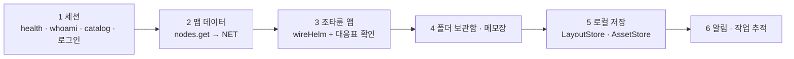

# 노드 화면 구현 가이드

예시 데이터로 도는 프로토타입을 **실데이터로 도는 GUI**로 만드는 순서와, 기능을 더하는 방법을 정리한다.

## 1. 원칙

| 원칙 | 왜 |
| --- | --- |
| `src/screens/*.js`는 **생성물**로 다룬다 — 연동 코드는 `src/api`에 두고 seam을 바꿔 끼운다 | 디자인 원본(`design/*.dc.html`)을 고치고 `npm run gen`하면 덮어쓰인다 |
| 화면은 operationId만 안다 · 호출은 `TerraClient` 한 곳 | provider 경로가 바뀌어도 화면은 그대로 |
| 잠긴 것은 숨기지 않는다 — 🔒 + 이유 | 남의 노드 자원이라 "왜 안 되는지"가 정보다 |
| 접수(202)를 완료로 그리지 않는다 | 작업 추적 → 끝난 뒤 반영 · 알림 |
| 노드는 이름이 아니라 id로 묶는다 | 이름은 겹칠 수 있다 — 연동하면서 바꾼다 |



## 2. 단계별 구현

### 2.1 세션

1. `new TerraClient(base)` → `health.get` → `whoami.get` → `refreshCatalog()` ([[node-screen-api-integration|연동 가이드]] §3).
2. seam `startLogin(target, password, auto)`를 바꿔 끼운다.

```js
// src/api/wire-session.js (만들 파일 — 예시)
export function wireSession(screen, client) {
  screen.startLogin = async (target, password) => {
    const username = (screen.state.login && screen.state.login.username) || 'admin';   // 로그인 창 상태: { target, username, password, auto, msg }
    screen.setState({ login: null, auth: { phase: 'loading', target } });
    screen.flipTo(target, 'ccw');
    const r = await client.invoke('terra.gateway.auth.credentials.post', { username, password });
    if (r.kind !== 'ok') { screen.flipTo(screen.state.curTree, 'cw'); screen.setState({ auth: { phase: 'done', target, ok: false } }); return; }
    await client.refreshCatalog();
    screen.setState({ curTree: target, shown: null, auth: { phase: 'done', target, ok: true } });
  };
}
```

3. 권한: seam `hbPerm(node)`을 `nodePerm(node, ctx)`(`src/model/permissions.js`)로. `ctx.whoami` = whoami의 permissions, `ctx.loggedIn(tree)` = 그 tree Gateway에 로그인했는지.
4. 오버헤드 패널 가운데 띠의 `admin · 만료 · 권한 · 예시 데이터`를 whoami 값으로 — ✅ 생성기의 템플릿 패치(`{{who.*}}`)와 실데이터 층의 `renderVals().who`가 한다([[real-data-layer|실데이터 층]]).

### 2.2 맵 데이터

1. `terra.master.nodes.get`(T) → 노드 · 부모 관계 → `NET`. 지금 `this.NET`은 상태 밖이므로 **상태로 옮긴다**(원본 수정).
2. 10초 폴링, 창이 숨겨지면 멈춤. 맵 전환 중(`mt`)에 온 결과는 큐에 모았다 끝난 뒤 반영.
3. 새 노드(`pending`) = 받은 노드 − 맵에 놓인 노드.
4. 노드 모습(`looks`) · 맵 배치(`maps`)는 API에 자리가 없다 → `LayoutStore`(§2.5).

### 2.3 조타륜 앱

`src/api/wire.js`의 `wireHelm`이 seam(`hbAct`)을 바꿔 끼우고 목록 받기 · 폴링 · 작업 추적을 한다. 이 노드(leaf)에서 쓰는 것은 끝났다:

1. ✅ 진짜 게이트웨이의 카탈로그로 이 노드에서 쓰는 operation을 확인했다 — 게이트웨이 모듈 op 이름을 바로잡고, 작업 · 모듈 수명은 Daemon 길로.
2. ✅ 실제 응답으로 `src/api/adapters.js`의 필드 이름을 맞추고, 상태를 화면 낱말로 옮긴다.
3. ✅ `LiveSource.act`는 op 이름의 `by-…` 자리만 싣는다(`pathInput`) — 모듈 op은 대응표의 `in`으로.
4. 남은 것: Master(T) 앱 — 위임 경계가 열린 뒤 `verify: true` 항목을 확인한다.
5. 위험 동작(피어 회수 · 선언 철회 · 노드 삭제)은 카탈로그 `confirmationMode`와 상관없이 화면이 확인을 건다 — `needs-confirm`이면 `invoke(…, { confirm: true })`로 다시.

### 2.4 폴더 보관함 · 메모장

결정이 먼저다([[helm-apps-integration|앱 연동]] §4): ① 로컬 루트 탐색 op ② 로컬 프로그램으로 열기 op ③ 메모 저장 위치.
정해지면 seam을 바꿔 끼운다.

```js
// src/api/wire-folder.js (만들 파일 — 예시)
export function wireFolder(screen, client) {
  const cache = { repo: [], local: [] };
  const load = async (mode) => {
    const op = mode === 'repo' ? 'terra.daemon.files.list.get' : 'terra.daemon.local-fs.list.get';   // 두 번째는 제안 op
    const r = await client.invoke(op, { path: screen.state.fb.path });
    if (r.kind === 'ok') { cache[mode] = toEntries(r.data); screen.forceUpdate(); } else screen.fbSay('🔒 ' + r.kind, '#d33d52');
  };
  screen.fbList = (mode) => (mode === 'memo' ? screen.state.memos : cache[mode]);
  screen.fbOS = () => client.invoke('terra.daemon.desktop.open.post', { path: currentPath(screen) });   // 제안 op
  // fb.mode · fb.path가 바뀌면 load(mode) — wireHelm처럼 짧은 간격으로 살핀다
}
```

메모장은 `memoSave` · `memoDel` · `memoMkdir`를 `entries.write` · `entries.remove` · `entries.mkdir`로 바꾼다. 실패하면 `memoNote`에 이유.

### 2.5 로컬 저장 (`LayoutStore` · `AssetStore`)

API에 자리가 없는 사용자 데이터 — IndexedDB 권장. 키는 노드 id.

| 무엇 | 상태 키 |
| --- | --- |
| 노드 모습 · 맵 배치 · 칸 재질 · 놓은 건물 | `looks` · `maps` · `fields` · `mat` · `placed` · `grounds` · `gmat` |
| 창 자리 · 서랍 · 전체 화면 리스트 | `wins` · `drawer` · `fsHist` |
| 편집기 자산 | 건물 설계도 · 필드/그라운드 스킨 · 자재 |
| 메모 (메모를 서버에 두지 않기로 하면) | `memos` |

### 2.6 알림 · 작업 추적

- 동작이 `accepted`면 `trackJob(client, 'terra.master.jobs.by-job-id.get', job)` → 끝나면 `pushAlarm('●'|'■', 색, 문구)`.
- leaf는 `client.events(onEvent)`(SSE) → 이벤트 종류별로 그 앱 목록을 다시 받고 알림을 더한다.

## 3. 디자인을 고친 뒤

```bash
# design/*.dc.html 을 디자인 캔버스에서 새로 받아 덮어쓴 뒤
npm run gen          # 페이지 · src/screens/*.js 다시 만들기 (Linux · Windows · macOS 동일, python3 필요)
npm run test:smoke   # 흐름 확인
```

`src/screens/*.js`를 손으로 고쳤다면 덮어쓰인다 — 그래서 연동은 seam 바꿔 끼우기로만 한다.

## 4. 기능 더하기

### 4.1 조타륜 앱 하나

원본(`design/Artboard-qcfu.dc.html`)에서:

1. `hxStart`의 `RES`에 `{ name, sub, px }`, 같은 함수의 `PX`에 14칸 픽셀 그림(`rows` · `pal`)
2. `HBICON().app[px]`에 14×14 PNG(data URL)
3. `HBAPP()`에 `{ perms: [...], see: '권한' }`
4. `hbSeed`에 예시 목록, `hbAct`의 `switch`에 `case '앱:op'`, `hbVals`에 카드 분기(`card(...)` · `B(label, op, id, primary, need, lock)` · `chip(label, tone)`)
5. `npm run gen` → 연동 층: `operations.js`의 `HELM_APPS[앱]` · `adapters.js`의 `ADAPT[앱]`
6. 문서: [[helm-apps-integration|앱 연동]] §2 · [[node-screen-ui-spec|UI 명세]] §5.3

드럼은 앱 수와 상관없이 되풀이되므로 다른 곳은 고칠 것이 없다. 전체 화면은 저절로 된다(`'hb:<앱>'`).

### 4.2 서브 창(기능칸) 하나

1. `WDEF()`에 `{ title, emoji, color, pa, pb, ink, href? }`
2. 상태 `wins`에 기본 자리 · `utilItems`에 칸 순서
3. `UDLOGO()`에 16×16 로고 · `utilInfo()`의 `INFO`에 카드 요약 · 창 목록 `ids` · `SUM`
4. 템플릿 창 안에 `<sc-if value="{{w.isX}}">` 블록, 창 값에 `isX: id === 'x'`
5. 전체 화면: `href`가 있으면 그 보드를 통째로 띄운다(iframe). 없으면 내용을 820px 폭으로

메모장 기능칸(`memo`)이 가장 최근 예시다.

### 4.3 새 화면(보드) 하나

1. 디자인 캔버스에서 `.dc.html` 보드 → `design/`에
2. `tools/gen-pages.py`의 `screens`에 `(원본, 페이지, 제목, 맞춤, 설명)`
3. 다른 보드에서 `원본.dc.html`로 건 링크는 생성 때 `페이지.html`로 바뀐다

## 5. 결정 필요

| 무엇 | 후보 | 묶인 것 |
| --- | --- | --- |
| 다른 tree의 Gateway에 닿는 길 | 주소 등록 · `gui.remote.*` 경유 · 같은 기계만 | tree 전환 · 자동 로그인 보관 |
| 로컬 루트 탐색 · 로컬 프로그램으로 열기 | Daemon 로컬 op 새로 (`local-fs.list.get` · `desktop.open.post` 제안) | 폴더 탐색기 · 읽기 전용 열기 · OS 파일 관리자 |
| 메모 저장 위치 | 메모 루트를 공유 폴더로 · `LayoutStore` | 메모장 · 다른 기기에서 보기 |
| 모듈 수명 제어 길 | Gateway `module.manage`★ · Daemon `node.control` | 모듈 앱 잠금 |
| 프사가 맵 노드를 따라갈지 | 지금은 로그인 tree · 로컬만 | 조타륜 앱 대상 표시 |

## 6. 완료 점검표

- [x] "예시 데이터" 표식이 사라졌다 · 익명에서도 화면이 선다 — [[real-data-layer|실데이터 층]]
- [ ] 다른 노드 맵에서 조타륜 앱이 그 노드의 자원을 보이고, 권한 없는 동작은 🔒 + 이유
- [ ] 동작 결과가 글줄 · 배지로 보이고, 접수형은 작업 추적 → 알림
- [ ] 카탈로그에 없는 기능은 숨기거나 잠긴다
- [ ] 폴더 보관함 세 곳이 실제 폴더를 보이고, 메모가 새로고침 뒤에도 남는다
- [ ] 노드 모습 · 맵 배치 · 전체 화면 리스트가 새로고침 뒤에도 남는다
- [ ] `npm run test:smoke` 통과 · [[node-screen-ui-spec|UI 명세]]의 시간 · 순서 그대로

## 관련 문서

- [[docs/README|개발 문서 MOC]]
- [[frontend-api|프론트엔드 API]]
- [[helm-apps-integration|조타륜 앱 · 폴더 보관함 연동]]
- [[node-screen-api-integration|노드 화면 API 연동 가이드]]
- [[node-screen-data-model|노드 화면 데이터 모델]]
- [[node-screen-code-structure|코드 구조와 이식 가이드]] — 이식 방식(A · B · C) · 성능 함정
- [[testing|시험]]

## 관련 모듈

- `src/api/wire.js` (조타륜 앱 연결 — 다른 연결의 본보기) · `src/data/*-live.js` (실데이터 층) · `tools/gen-pages.py`
