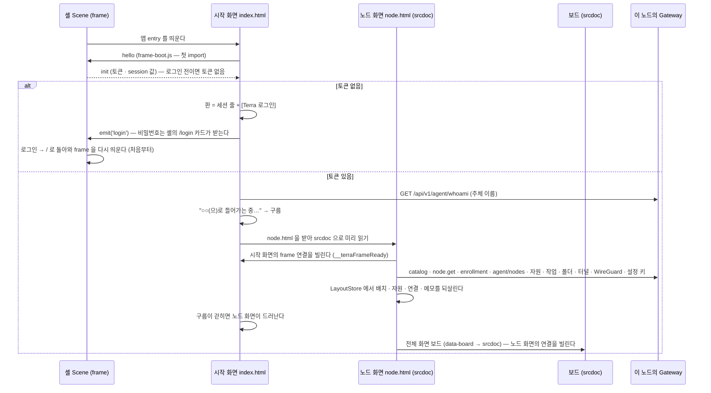

# 모듈 프로필 — Terra 안에서 도는 변형

디자인 캔버스 원본(`design/*.dc.html`) 하나에서 GUI 세 벌이 나온다. 차이는 `public/config.json`의 `variant`와
그 변형의 **부트 프로필**(`src/boot/<variant>.js`)뿐이다 — 화면 코드(`src/screens/*.js`)는 셋 다 생성된 그대로다.

원본은 **GUI 원본 저장소 [`StellaxiaLab/maingui`](https://github.com/StellaxiaLab/maingui)**다. 이 모듈의 `design/`은 그 `43a4e3a`(2026-10-05 — SVI 흐름 칸 · 맵 도로 A-28 · maingui#1 병합 · 그 앞 `1aa6340` SVI 흐름도 · `e669c03` 모듈 설정 폼 · 내려받기 · 카메라 손 등록)과 파일 단위로 같다.
처음에는 `f24c3bc`(2026-10-04)에 맞췄다 — [[implementation-backlog|구현해야 할 것]] MD-19.

- `demo` — maingui의 `examples/demo/`(예시 세계 그대로 · `examples/data/`). 예전 이름 `terra-node-gui-demo`.
- `service` — maingui 저장소 뿌리. 예시를 지우고, 자기 로그인 화면으로 Gateway(`/gw` 프록시)에 붙는 독립 배포판. 예전 이름 `terra-node-gui`.
- `module` — **이 저장소**. 예시를 지우고, Terra 셸의 `terra.web/frame` 안에서 이 노드의 게이트웨이에 붙는 모듈 웹 앱.

> [!NOTE] 처음 받은 압축 파일과의 관계
> 처음에는 압축 파일 두 개로 받았다(이름과 내용이 반대였다 — `…-demo.zip` 안이 service 판). 지금 기준은 maingui 저장소다 —
> 압축 판보다 새 기능(자원 추가 · 수정 · 삭제 폼 · 상태 화면 · 모듈 GUI 창 · 노드 자원 공유 · 오버헤드 패널 접기)이 더 있다.

## 1. 세 변형

| | 데모 `demo` | 서비스 `service` | 모듈 `module` (이 저장소) |
| --- | --- | --- | --- |
| 어디서 도나 | 정적 페이지 | 정적 페이지 + `/gw` 프록시(`tools/serve.mjs` · nginx · Docker) | Terra 모듈 `lab.stellaxia.node-gui`의 embed 앱 — 셸 Scene이 감싼다 |
| 로그인 | 예시 (비밀번호 4자 이상) | 시작 화면의 아이디 · 비밀번호 → `terra.gateway.auth.credentials.post` | **웹은 비밀번호를 받지 않는다** — [Terra 로그인] → 셸의 `/login` 카드(§3) |
| 게이트웨이 주소 | — | `config.json`의 `gateway` | frame이 건넨다 — 이 노드의 게이트웨이 하나 |
| 노드 · 맵 | 예시 `NET` · 예시 맵 | whoami + `terra.master.nodes.get` | 이 노드(`terra.daemon.node.get`) · 부모 tree(등록 정보) · `agent/nodes` — [[real-data-layer\|실데이터 층]] §2 |
| 조타륜 앱 10개 | 예시 (`?live=1`이면 Gateway) | Gateway (`LiveSource`) | 같은 `LiveSource` + 실측으로 고친 대응표 · 상태 정규화 — Master operation은 "닿지 않음" |
| 알림 | 예시 5건 | leaf 이벤트(SSE) · 새 노드 | Daemon 작업 폴링(`terra.daemon.tasks.get`) — 이벤트 경로는 WebSocket이라 쓰지 않는다 |
| 맵 배치 · 노드 모습 · 자원 · 연결 · 메모 | 예시 (저장 안 함) | LayoutStore — Gateway · 사용자마다 | LayoutStore — **노드 · 주체마다**(§4) |
| 설치한 노드 자원의 상태 | 예시 목록 | 조타륜에서 그 앱을 열 때만 | 그 앱이 닫혀 있어도 `pollSec`마다 다시 받는다 |
| 네트워크 · 설정 화면 | 예시 | 목록 비움 · 세션만 / `config.get` | 이 노드의 터널 · WireGuard · 설정(`config.get` · `schema.get` · `patch`) |
| 편집기 (건물 · 도로 · 자재 · 필드 · 그라운드) | 기본 라이브러리 = 자산 | 같음 | 같음 — 자재 편집기의 예시 커스텀 자재 · 필드 편집기의 예시 전용 부모 디자인만 뺀다 |
| 자원 추가 · 수정 · 삭제 (앱 전체 화면 `＋ 추가` · ✎ · 🗑 · 상태 화면) | 예시 목록에 지어 넣는다 | `HELM_CRUD` — 서버에 길이 없으면 화면 목록에 지어 넣는다 · 본문 일부가 실제 서버와 다르다([[implementation-backlog\|구현해야 할 것]] UP-12 · UP-14) | 실제 서버의 입력으로 맞춘 `HELM_CRUD` — **지어내지 않는다**: 길이 없으면 폼 · 확인 대기를 열기 전에 그렇다고 말하고, 받은 뒤 목록을 다시 받는다(§7 · [[real-data-layer\|실데이터 층]] §2.4) |
| 값을 적어야 하는 앱 바 동작 (`+ 선언` · `+ 허가` · `+ 즉석 열기` · `+ 실행` · `다시 선언`) | 예시 항목을 만든다 | 같은 동작을 부른다 | 앱 전체 화면의 추가 · 수정 폼을 연다 |
| 상태 화면 (`ⓘ` · 창 `rst`) | 예시 | 같은 화면 | 같은 화면 — 노드 칸의 "로그인" 줄은 이 화면의 세션, API 줄은 실제 부르는 것(⚠ = 이 게이트웨이에 없음) |
| 모듈 GUI 창 (`🖥` · 창 `mgui`) | 예시 주소 | 제안 필드 `ui` | `/api/v1/gui/apps`(공개)의 앱으로 GUI 제공을 안다. 다른 모듈의 앱은 이 창에 띄울 수 없다고 적는다(frame은 자기 모듈의 앱만) |
| 오버헤드 패널 접기 | 저장 안 함 | LayoutStore `ovhHide` | LayoutStore `ovhHide` — 노드 · 주체마다 |
| 디자인 노트 페이지 (`components` · `helm` · `helm-apps`) | 있음 | 없음 | 없음 (원본 `design/`에는 남긴다) |

## 2. 페이지가 뜨는 순서



- 미리 읽기가 실패하면(받지 못함 · 4.5초 넘게 준비 안 됨) 구름이 걷힌 뒤 `노드 화면으로 →` 길이 보인다. 그 길은 앱 frame 안의 이동이라 노드 화면이 스스로 `hello`를 보낸다(셸은 다시 온 `hello`에 새로 답한다).
- 셸을 새로 고치면 Scene의 `session` · `credentials` Store(memory)가 비어 다시 로그인해야 한다 — 저장한 배치는 LayoutStore에 남는다.

## 3. 시작 화면 — 비밀번호를 받지 않는다

짝 프로젝트(service)의 시작 화면은 아이디 · 비밀번호 판이다. 모듈에서 웹이 비밀번호를 받으면 모듈 JS가 사용자의 Terra 비밀번호를 보게 되고,
그 JS는 비밀번호를 들고 스코프 토큰(사용자 권한 ∩ 앱 권한)의 교집합을 우회할 수 있다(웹 프로그램 감싸기 설계 §3.3.1).
그래서 `tools/gen-pages.py`가 판의 입력 칸 구간을 통째로 바꾸고(`MODULE_BETWEEN`), `src/data/intro-live.js`가 그 자리를 채운다.

| 상태 | 판 | 단추 | 왼쪽 아래 Gateway 줄 |
| --- | --- | --- | --- |
| Terra 밖 (`npm run dev` · 정적 서버) | "Terra 밖에서 열었다" | `둘러보기 (데이터 없음)` → 빈 세계로 내려간다 | 빨강 · 닿을 게이트웨이가 없다 |
| 셸 연결 중 | "Terra 셸에 연결하는 중…" | `Terra 로그인` (누르면 잠시 뒤 다시) | 노랑 |
| 로그인 전 | "Terra에 로그인하지 않았다" | `Terra 로그인` → `emit('login')` | 노랑 · 로그인 전 |
| 토큰 있음 (셸 세션 · Scene 로그인) | 곧장 "○○(으)로 들어가는 중…" → 1.4초 뒤 내려간다. `취소 — 여기 머물기` | `들어가기` | 초록 · 연결됨 |
| 셸이 답하지 않음 | "Terra 셸이 답하지 않는다" | — | 빨강 |
| 로그아웃 (다 내려간 뒤) | 노드 화면을 걷고 판으로 돌아온다 · "로그아웃했다 — 다시 들어가려면 Terra 로그인" | `Terra 로그인` | 노랑 · 로그인 전 |
| 권한 없음 (`SCOPE_TOKEN_DENIED`) | "이 화면의 토큰을 받지 못했다" + 이유 | `Terra 로그인`(다른 계정) | 노랑 |

- 이 화면은 아무것도 기억하지 않는다 — 짝 프로젝트의 `terra.gui.autoLogin`(아이디 기억)을 쓰지 않는다. "자동 로그인"은 Terra가 쥔 세션이 있다는 뜻이다.
- 오른쪽 아래 판의 `v0.2 · 예시 데이터` 글은 `Terra 노드 · Terra 안/밖`으로 바꾼다(짝 프로젝트 service는 이 글을 그대로 둔다 — [[implementation-backlog|구현해야 할 것]] UP-2).

## 4. 저장 — LayoutStore (`src/store/layout.js` · `src/store/docs.js`)

API에 자리가 없는 사용자 데이터를 이 브라우저의 `localStorage`(앱 origin)에 바로, Terra 사용자 문서 저장소(C-1)에 뒤따라 둔다.

| 항목 | 내용 |
| --- | --- |
| 키 | `terra.gui.layout\|<node_id>\|<주체>` — 앱 origin이 게이트웨이마다 따로라 저장소가 이미 게이트웨이로 갈린다 |
| 담는 것 | `looks`(노드 모습) · `maps`(맵마다 필드 · 재질 · 건물 · 노드 칸 · **노드 자원 `rsrc`** · **연결 `links`**) · `roadsOn` · `markStyle` · `roadPick` · `memos` · `wins`(창 자리) · `utilItems` · `ovhHide`(오버헤드 패널 접힘) |
| 언제 | 로그인해 세계를 읽은 뒤에만 묶는다(`bindLayout`). `setState`를 0.8초 모아 한 번, 페이지를 떠날 때 한 번. 맵 전환 중에는 쓰지 않는다 |
| 되살리기 | 주인이 사라진 맵은 버리고, 사라진 노드는 칸에서 빼고, 칸이 없는 tree 자식은 `새 노드`로(`reviveMaps`). 새 창(도로 편집기 · 자원 설정)은 기본 자리(`reviveWins`). 처음 맵은 늘 이 노드의 맵이다 |
| 로그아웃 · 토큰을 잃음 | 저장을 **끊고**(`unbind`) 빈 세계로 돌아간다 — 빈 세계가 저장본을 덮지 않는다. 표시 설정 · 패널 접힘도 기본으로, 열려 있던 상태 화면 · 폼 · 모듈 GUI 창 · 그래프 고름은 비운다 |
| 서버(사용자 문서) | `layoutStore: server`(기본)면 같은 것을 `/api/v1/me/documents/app:lab.stellaxia.node-gui.web/layout/<node_id>`에 3초 모아서 쓴다 — 이름공간은 whoami의 `delegate`(앱 토큰이면 게이트웨이가 고정한다). 읽을 때 새 쪽(`savedAt` · 브라우저 `_savedAt`)이 이기고, 겹쳐 쓰면 409를 한 번 알린 뒤 덮는다. 저장소가 없거나 막히면 이 세션은 브라우저만 — [[real-data-layer\|실데이터 층]] §2.8 |
| 끄기 | `config.json`의 `"layoutStore": "local"`(이 브라우저에만) · `"none"`(저장 안 함 — 공용 화면 · 키오스크) |
| 노드 이름 | 맵 안의 노드는 화면 규칙대로 이름이 키다. 저장할 때 이름 → `node_id`(`nodeIds`)를 같이 적고, 읽을 때 지금 이름으로 옮긴다(`remapNodes`) — 이름이 바뀌어도 칸 · 모습 · 노드 자원 · 연결이 따라가고, 사라진 노드의 칸은 같은 이름을 얻은 다른 노드에게 넘어가지 않는다. tree 항목은 id가 없어 이름 그대로다 |
| 한계 | 다른 창 · 기기가 바꾼 것은 곧장 오지 않는다 — 다음 쓰기의 409 알림 · 새로 고침에 받는다(문서 변경 신호는 Master 이벤트 — [[implementation-backlog\|구현해야 할 것]] PF-17) |

도로 · 건물 설계(편집기에서 내보낸 것)는 LayoutStore가 아니라 `localStorage`의 `terra.gui.roads` · `terra.gui.buildings`다 — 노드 화면은 `storage` 이벤트로 받아 다시 굽는다([[road-editor-spec|도로 편집기]] §2).
`layoutStore: server`면 이 둘도 사용자 문서 `assets`로 뒤따라 가고, 로그인할 때 서버 것이 더 새로우면 받아 다시 굽는다.

받다 끊긴 파일의 조각은 이 브라우저의 IndexedDB `terra.gui.parts`(`src/store/parts.js`)에 둔다 — 같은 파일을 다시 받으면 거기서부터 잇고(서버의 SHA-256 · 크기가 같을 때),
다 받으면 지운다. 이레 넘게 손대지 않은 것은 치운다. 사용자 문서로는 보내지 않는다(파일 바이트다). 막힌 브라우저(사생활 창 등)에서는 메모리로만 받는다 — [[real-data-layer|실데이터 층]] §2.9.

## 5. 설정 — `public/config.json`

```json
{
  "variant": "module",
  "appTitle": "Terra",
  "layoutStore": "server",
  "pollSec": 10
}
```

| 키 | 뜻 |
| --- | --- |
| `variant` | `module` — `npm run gen`이 이 값으로 페이지를 만든다. 다른 값이면 멈춘다(service · demo는 짝 프로젝트에서) |
| `layoutStore` | `server`(기본) = 이 브라우저 + Terra 사용자 문서(다른 기기 · 브라우저에서 같은 맵) · `local` = 이 브라우저에만 · `none` = 저장 안 함. 모르는 값이면 `server` |
| `pollSec` | 조타륜 앱 · 설치한 노드 자원 · 알림을 다시 받는 간격(초, 최소 5). 네트워크 요약은 그 3배. 실시간 이벤트(B-5)가 열려 있으면 신호가 다시 받기를 맡고 이 간격은 여섯 배로 늘어난다(바닥) |

빌드 결과 `ui/config.json`만 고쳐도 된다(받을 때 `cache: 'no-store'`). 짝 프로젝트의 `gateway` 키는 없다.

## 6. 생성 때 바꾸는 것 (`tools/gen-pages.py`)

| 무엇 | 어디 | 왜 |
| --- | --- | --- |
| `import './src/api/frame-boot.js'`를 첫 import로 | 모든 페이지 | 마운트가 무거워 그 뒤에 `hello`를 보내면 셸의 10초 handshake를 넘긴다 |
| `prep`이 돌려준 클래스를 띄운다 | 모든 페이지 | `const View = Boot.prep(name, Screen) \|\| Screen` — 첫 렌더 전에 예시를 지운다 |
| 세션 띠의 `admin · 만료 21:40` → `{{who.*}}` · `예시 데이터` 표시 · `· 예시` 삭제 | 노드 화면 | 원본 템플릿에 박힌 예시 글 |
| `iframe.win-fs-full`의 `src` → `data-board` | 노드 화면 | Terra 안의 막힐 탐색 · CSP 거절을 없앤다 — `frame-boards.js`가 srcdoc(밖은 src)으로 연다 |
| 입력 판 구간(아이디 · 비밀번호 · 자동 로그인) → 세션 줄 + 단추 | 시작 화면 | §3 |
| `[data-in-map]`의 `src` → `data-src` · 판 아래 글 · 단추 글 | 시작 화면 | 미리 읽기를 boot가 정한다(srcdoc / src) |
| 시연 전환 · 상태 시연 · 권한 토글 · `재시작함 (시연)` | 네트워크 · 설정 | 예시 조작 |
| 구글 글꼴 `<link>` 삭제 | 모든 페이지 | 앱 자산 CSP(`style-src` · `font-src 'self'`)가 막는다 |
| 시작 화면 맞춤 `viewport` · 노드 화면 무대 `100vw × 100vh` | 시작 · 노드 | 짝 프로젝트의 생성 규칙 그대로면 창 비율 · 높이가 기준과 다를 때 화면이 잘린다([[implementation-backlog\|구현해야 할 것]] UP-1) |
| 아래 두 알약(게이트웨이 · 꼬리말)에 `pointer-events: {{v.chromePe}}` | 시작 화면 | 내려간 뒤 opacity 0으로 남아 그 아래 노드 화면의 왼쪽 · 오른쪽 아래 누름(폼 저장 단추 등)을 가로챈다 — 실측([[implementation-backlog\|구현해야 할 것]] UP-15) |

바꿀 글을 원본에서 **정확히 한 번** 찾지 못하면 `npm run gen`이 멈추고 그 글을 보인다 — 조용히 예시가 남지 않게.

## 7. 실행 때 바꾸는 것 (`src/boot/module.js` · `src/boot/fixes.js` · `src/data/*.js`)

| 무엇 | 어디 |
| --- | --- |
| 예시 상태 지우기 · 진짜 출처로 채우기 · 권한 · 요약 글 | `src/data/node-live.js` · `network-live.js` · `settings-live.js` · `editors-live.js` — [[real-data-layer\|실데이터 층]] |
| 시작 화면의 세션 · 로그인 · 미리 읽기 | `src/data/intro-live.js` |
| 빈 맵의 해안선 엔진 멈춤 | `fixes.js` (짝 프로젝트와 같다) |
| leaf 맵의 자기 칸(`self`)에 자원을 놓지 못한다 — 길 찾기 · 대상 · 상태 창은 원본이 `nodeAt()`으로 고쳤고 설치만 남았다 | `fixes.js` (모듈에서 더함 — 원본에 올릴 것, [[implementation-backlog\|구현해야 할 것]] UP-3) |
| 로그아웃하면 시작 화면이 노드 화면을 걷고 판으로 돌아온다 | `src/data/intro-live.js` `flyBack` |
| 자원 추가 · 수정 · 삭제 — 폼 저장(`hbFormSave`) · 두 번 누르는 삭제(`hbDel`)를 실제 호출로 바꿔 끼운다. 값을 적어야 하는 앱 바 동작은 폼을 연다 | `src/api/operations.js` `HELM_CRUD` · `src/api/source.js` `crud()` · `src/api/wire.js` |
| 서버에 길이 없는 추가 · 수정 · 삭제는 폼 · 확인 대기를 열기 전에 막는다 · 폼의 API 줄 · 자리 표시자 · 상태 화면의 로그인 줄 · 모듈 GUI 창 · 메모 경로 | `src/data/node-live.js` (`crudWhy` · `HBCRUD` · `hbFormOpen` · `hbFormSave` · `hbDel` · `rstVals` · `mguiVals` · `memoVals`) |
| 실시간 이벤트 — 신호마다 그 목록만 다시 받는다 · 폴링은 바닥 | `src/api/events.js` · `src/data/node-live.js` `applySignal` · `src/api/wire.js` `_hbRefresh` |
| 다른 노드 — 노드 주소 호출 · 그 노드 카탈로그로 미리 잠금 · 권한 `관리자 · 중계` | `src/api/client.js` `invokeAt` · `nodeCatalog` · `src/api/source.js` `lockFor` · `daemonView` · `node-live.js` `hbPerm` |
| 사용자 문서(서버 저장) — 배치 · 메모 · 편집기 자산 | `src/store/docs.js` · `node-live.js` `loadWorld` |
| 모듈 로그 → 상태 화면 출력 칸 · 폴더 탐색기(local-fs) · 바탕화면에서 열기(desktop.open) | `src/api/wire.js` `outText` · `node-live.js` `loadLocalFolder` · `deskOpen` · `FBMODES` · `fbOpenItem` · `fbOS` |
| 파일 올리기(↑ 올리기 → 파일 고르기) · 받기(폴더 앱 `받기` → 브라우저 저장) · 끊긴 뒤 이어서(멈춘 전송의 카드 · 같은 파일 다시 올리기 · 이 브라우저에 둔 조각) | `src/api/source.js` `upload` · `download` · `stalledPush` · `markStalled` · `src/store/parts.js` · `src/api/wire.js` `saveBlob` · `src/api/sha256.js` |
| I/O 장치 손 등록 폼(이름 · 주소) — 고칠 때는 원본의 주소 칸을 뺀다 | `node-live.js` `hbFields` · `src/api/operations.js` `manualAdapter` |
| 모듈 수정 = 모듈 설정 — 폼을 열기 전에 스키마 · 값을 받아 붙이고(`item.cfg`), 저장은 바뀐 키만 · 권한이 없으면 볼 수만 | `src/api/source.js` `modConfig` · `src/api/operations.js` `cfgForm` · `cfgPatch` · `src/api/wire.js` |
| SVI 자원 앱 = 흐름도 — 예시 흐름 이벤트(디자인의 0.5초 박자 `sviDemoTick`)를 끄고, 진짜 흐름 이벤트는 고른 자원의 열린 핸들 SSE 로 · 흐름도 모양은 어댑터가 늘 채운다 · 보고 있는 앱의 목록을 받지 못하면 그 이유를 남긴다 | `node-live.js` `sviDemoTick` · `src/api/wire.js`(SVI 흐름 이벤트 · `hbMsg.sticky`) · `src/api/adapters.js` `ADAPT.svi` `flow` |
| 노드 관리 폼(이름 · 부모 · 지우기)은 Master op라 잠그고 이유를 보인다 · 설정 재시작은 Daemon `restart.post` 뒤 health로 돌아올 때까지 | `node-live.js` `masterWhy` · `rstVals` · `src/data/settings-live.js` `doRestart` |

## 8. 원본(maingui)과 맞추기

디자인 캔버스에서 원본이 바뀌면 — maingui 저장소의 `design/`을 가져와 다시 만든다:

```bash
# 1) maingui 를 옆에 받는다 (처음 한 번) · 이후에는 pull
git clone https://github.com/StellaxiaLab/maingui ../maingui
git -C ../maingui pull
# 2) design/ 을 이 저장소의 web/design/ 으로 (Linux · Windows · macOS 같은 명령 — Windows는 PowerShell Copy-Item -Recurse)
cp -r ../maingui/design/. design/
# 3) 다시 만들기 — 바꿀 글을 못 찾으면 여기서 멈춘다
npm run gen
# 4) 시험
npm test && npm run test:smoke
# 5) 모듈 쪽 (저장소 뿌리에서)
npm run build:web && npm run validate && npm run test:web
```

- 맞춘 커밋을 이 문서 머리(지금 `43a4e3a`)와 모듈 README에 적는다.
- `src/runtime/dc.js` · `src/boot/fixes.js` · `src/store/layout.js`(`KEYS`)처럼 원본과 같은 파일은 그쪽이 바뀌었는지 함께 본다 — 이번에 `dc.js`(글 칸 `onChange` → `input`)와 `KEYS`(`ovhHide`)가 바뀌었다.
- 원본 화면에 **새 상태 키**가 생기면 `emptyWorld` · `loadWorld`(`src/data/node-live.js`)에서 로그아웃 · 다시 로그인 때 비울지 되살릴지 정한다 — 이번에는 `rst` · `hbForm` · `mgui` · `netSel`(비움) · `ovhHide`(되살림).
- `src/api/*`(연동 층)는 이 저장소가 실측으로 고친 판이 앞선다 — 원본의 것으로 덮지 않는다. 원본의 새 대응(이번에는 `HELM_CRUD`)은 실제 서버의 입력과 견준 뒤 옮긴다([[implementation-backlog\|구현해야 할 것]] UP-12 · UP-13).
- maingui의 `examples/`(예시 데이터 · demo 판)와 `?seed=examples`는 이 모듈에 가져오지 않는다.

## 관련 문서

- [[docs/README|개발 문서 MOC]] · [[architecture|구조]] §7 · §8
- [[real-data-layer|실데이터 층]] — 예시를 지운 방법 · 출처 · 빈 자리
- [[road-editor-spec|도로 편집기]] · [[node-screen-ui-spec|노드 화면 UI 명세]] §2.6~2.12
- [[testing|시험]] · [[implementation-backlog|구현해야 할 것]]

## 관련 모듈

- `src/boot/module.js` · `src/boot/fixes.js` · `src/data/intro-live.js` · `src/store/layout.js` · `src/store/docs.js` · `src/api/config.js`
- `src/api/events.js`(실시간 이벤트) · `src/api/client.js`(노드 주소 호출) · `src/api/sha256.js`(올리기 · 받기 검사)
- `src/api/frame-boot.js` · `src/api/frame-boards.js` · `src/api/wire.js`
- `src/api/operations.js`(`HELM_CRUD` · `CRUD_TEXT`) · `src/api/source.js`(`crud`) · `src/data/node-live.js`
- GUI 원본 저장소 `StellaxiaLab/maingui` — 원본 · service · demo(`examples/`)
- `tools/gen-pages.py` · `public/config.json`

## 관련 흐름

- §2 — 셸 → 시작 화면 → (로그인) → 노드 화면 미리 읽기 → 보드
- §4 — 로그인 → 세계 읽기 → LayoutStore 되살리기(브라우저 · 사용자 문서 중 새 쪽) → 묶기 → 로그아웃 때 끊기
- §7 — 폼 저장 · 두 번째 누름 → `source.crud` → 서버 → 목록 다시 받기(지어내지 않는다)
