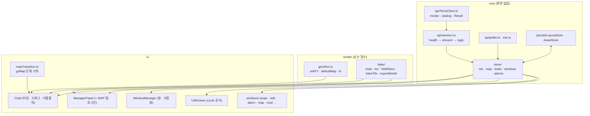

# 노드 화면 코드 구조와 이식 가이드

## 1. 지금 코드의 모양

`.dc.html` 한 파일 = **템플릿(HTML) + 스타일 + 클래스 하나**다.

> [!NOTE] 아래 줄 번호는 예전 판(약 2870줄) 기준이다
> 지금 `src/screens/node.js`는 약 5천 줄이고 조타륜 · 오버헤드 패널 · 전체 화면 · 폴더 보관함이 더해졌다. 메서드는 **이름으로** 찾고, 지금 구조는 [[architecture|구조]] §3을 본다.

| 부분 | 줄(대략) | 내용 |
| --- | --- | --- |
| 템플릿 | 1 ~ 600 | 내비 · 상태줄 · 필드 SVG · 관리 노드 창 · 창 · 서랍. `{{값}}` 구멍, `<sc-for>`, `<sc-if>`, `onClick="{{f}}"` |
| 스타일 | 템플릿 안 `<style>` | 애니메이션 keyframes · `.tile-lift` · `.fmap-node:hover` 등 |
| `constructor` | 623 ~ 730 | 상태 초기값(전부 예시) · `NET` · 건물 굽기 |
| 그리기 공용 | 730 ~ 1335 | 재질 · 텍스처 · 투시 · 건물 2D 벡터(`exportModel`) · 필드 스킨 · 타일 굽기(`bakeTile`) |
| 수명 | 1350 ~ 1416 | `fitScreen` · `componentDidMount`(키보드 · 휠 · blur 리스너) · `componentWillUnmount` |
| 관리 노드 창 | 1417 ~ 1496, 1810 ~ 1936 | 펼침(`tl*`) · tree 전환(`beginSwitch` · `flipTo` · `startLogin` · `lgClose`) |
| 노드 · 맵 | 1497 ~ 1624 | `lookOf` · `setLook` · `defaultMap` · `snapshotMap` · `goMap` · `enterNode` |
| 창 · 서랍창 | 1625 ~ 1727 | `WDEF` · `openWin` · `storeWin` · `closeWin` · `startWinDrag` · `centerSpot` · `pushAlarm` |
| 유틸 서랍 | 1728 ~ 1800 | `UD` · `udOpen` · `udClose` · `udAnimS` · `udGrab` · `udWheel` |
| 지도 | 1790 ~ 1809 | `forestLayout` · `goNode` |
| 칸 계산 | 1937 ~ 1958 | `nodeKind` · `nodeLift` · `cellKind` · `cellLift` · `radialItems` |
| `renderVals()` | 1959 ~ 끝 | **약 900줄.** 템플릿에 줄 값 전부 + 이벤트 핸들러 대부분(타일 끌기 · 편집 · 속성 창 동작)이 이 안의 클로저 |

### 1.1 DC 런타임

- `src/runtime/dc.js`(약 210줄)가 이 문법을 브라우저에서 돌린다.
  `DCLogic`(`setState` · `forceUpdate`) + `mount(Component, { template, target })`.
- 상태가 바뀌면 마이크로태스크에서 `renderVals()` 전체를 다시 계산하고 DOM을 순서대로 비교 패치한다(키 없음).
- 입력칸의 `onChange`는 `input` 이벤트로 붙는다(React와 같게).
- **그대로 쓰면** 캔버스 원본을 거의 손대지 않고 돌릴 수 있다. 대신 성능 여유가 적다(§4).

## 2. 이식 방식 선택

| 방식 | 할 일 | 장점 | 단점 |
| --- | --- | --- | --- |
| A. DC 런타임 유지 | `.dc.html` → 템플릿 문자열 + 클래스 파일로 떼기, 위에 `TerraClient`·Store만 붙이기 | 가장 빠르다 · 디자인과 1:1 | 900줄 `renderVals` · 전체 재계산 |
| B. 프레임워크로 옮기기 (React/Svelte 등) | 템플릿을 컴포넌트로, 상태를 Store로 | 부분 갱신 · 테스트 쉬움 | 애니메이션 타이밍을 다시 맞춰야 한다 |
| C. Terra Scene으로 | Scene 어휘로 다시 그리기 | Player · 적합성 검사에 올라탐 | 커스텀 SVG · 애니메이션은 `custom`/웹 프레임에 의존 |

**권장:** A로 먼저 연동(데이터 흐름 검증) → 화면별로 B로 옮긴다. 어느 쪽이든 §3의 분할은 같다.

## 3. 분할안



| 새 모듈 | 옮겨 올 코드 | 주의 |
| --- | --- | --- |
| `render/bake/*` | 730 ~ 1335 전부 | **편집기 3종과 공유**해야 한다 — 지금은 네 파일에 복사돼 있다 |
| `render/geo/hex.ts` | `cellXY` · `defaultMap`의 cube 좌표 · `fx` | 순수 함수. 먼저 단위 테스트 |
| `store/map.ts` | `snapshotMap` · `maps` · `selfKey` · `mapSkin` · `mapLift` · `cellKind` · `cellLift` | 노드 키를 이름 → id로 |
| `ui/mapTransition.ts` | `goMap` | 타이머 5종(`_mtT1~3` · `_liftTs`)을 한 곳에서 취소. 갱신 큐(§연동 5) |
| `ui/UtilDrawer` | `UD` · `ud*` · 템플릿 유틸 부분 | 공식은 [[node-screen-ui-spec#7.2 순환 공식\|UI 명세 §7.2]]. 휠 리스너는 `passive: false` |
| `ui/WindowManager` | `WDEF` · `openWin` · `storeWin` · `closeWin` · `startWinDrag` · `centerSpot` · `drawerZone` | 포인터 캡처 · `buttons === 0` 가드 · blur 시 끌기 취소 |
| `ui/ManagerPanel` | `tl*` · `flipTo` · `beginSwitch` · `startLogin` · `lgClose` | `startLogin`의 가짜 성공/실패를 `session.login()`으로 교체 |
| `store/alarms.ts` | `pushAlarm` · `notif` | 작업 추적 · SSE가 여기로 넣는다 |

## 4. 알아 둘 함정

| 함정 | 설명 |
| --- | --- |
| 전체 재계산 | 끌기 · 유틸 서랍 애니메이션 중 매 프레임 `renderVals()` 전체가 돈다. 타일이 61칸 넘으면 느려질 수 있다 → 타일 SVG를 메모이즈하거나 B 방식 |
| 건물 무늬는 템플릿 밖 | 블록 면 무늬(8×8)를 SVG 사각형으로 템플릿에 넣으면 건물 10종에서 사각형 약 4만 9천 개가 되고, 매 렌더마다 다시 만들고 비교해 한 번에 약 134ms가 걸렸다. 지금은 `mountBldgDefs()`가 무늬를 PNG로 한 번 구워(`bakePx`, 같은 무늬는 캐시) 문서에 숨은 `<svg data-bldg-defs>`로 **한 번만** 붙인다 → 화면 요소 5만 2천 → 4천, 렌더 약 8ms. 건물 설계도가 바뀌면 `mountBldgDefs()`를 다시 부른다. 숨은 svg에 `display: none`을 쓰면 무늬를 못 쓰는 브라우저가 있다 |
| SVG는 통째로 다시 그려진다 | SVG 안의 요소는 따로 합성되지 않아서, 타일 하나만 움직여도 필드 SVG 전체를 다시 래스터한다. 그래서 ① 끝없는 애니메이션(선택 점선 `.tile-ring`)은 **보일 때만** 클래스를 붙이고 ② 바닥 그림자는 블러 필터 대신 방사 그라데이션 ③ 건물은 방향별로 PNG 한 장으로 굽는다(`bakeBuildings`, 타일 굽기와 같은 방식). 누르기 판정은 그리지 않는 윤곽 경로 한 개(`bhit`, `pointer-events: fill`)가 맡는다 — 이미지의 투명한 사각 테두리가 뒤 타일을 가리지 않게. 결과: 가만히 있을 때 래스터 약 650ms/초 → 30ms/초, 맵 전환 중 래스터 약 1.9초 → 0.13초 |
| 정해진 움직임은 CSS로 | 유틸 서랍 열기는 예전엔 프레임마다 `setState`로 `s`를 올렸다(프레임당 화면 전체 재계산). 지금은 시작 자리를 한 번 그리고 다음 프레임에 도착 자리를 줘서 카드의 `transform`이 CSS로 움직인다(`udOpen`, `ud.css` · `ud.base`). 카드는 `top` 대신 `transform: translateY`로 옮겨 레이아웃을 다시 하지 않는다. 휠 · 홀드처럼 입력을 따라가는 움직임만 `setState`로 |
| 애니메이션은 렌더 밖에서 | 16fps 재생을 `setState`로 하면 초당 16번 화면 전체를 다시 계산한다. 지금은 `animTick()`(31ms 간격으로 살핌)이 `data-anim`이 붙은 `<image>`의 `href`만 바꾼다. `renderVals()`도 같은 시계로 지금 프레임을 고르므로(`animUrl`), 다시 그려져도 그림이 뒤로 튀지 않는다. 새로 이미지를 넣을 때 `data-anim`을 빠뜨리면 그 이미지만 멈춘다 |
| 정적인 것은 반응형 밖으로 | 위와 같은 원칙: 한 번 만들면 안 바뀌는 큰 덩어리(무늬 · 구운 타일 이미지)는 템플릿 상태에 두지 않는다 |
| `fx`는 타일보다 먼저 | 맞춤 변환을 늦게 계산하면 이전 프레임 값이 쓰인다 |
| 첫 로드 애니메이션 | `.tile-rise`는 첫 로드에서만. 맵이 바뀔 때 다시 붙으면 전환과 겹친다 |
| clip 높이 | `clip-ground` 높이 615 미만이면 타일 옆면이 잘린다 |
| 유틸 서랍이 혼자 움직임 | 버튼을 뗀 뒤 `pointermove`가 오면 움직였다 → `buttons === 0` 가드 · `blur`에서 해제 · 뗄 때 `anim false` |
| 관리 노드 창 ↔ 서랍창 겹침 | `mgHover` 동안 서랍창 `pointer-events: none` |
| 이름이 키 | 지금 `NET` · `looks` · `maps` · 창 제목이 전부 노드 **이름**으로 묶여 있다. 연동하면서 id로 바꾼다 |
| `NET`이 상태 밖 | `this.NET`은 `setState` 대상이 아니다. API로 갱신하려면 상태로 옮긴다 |
| 타이머 누수 | `goMap` · `storeWin` · `flipTo` · `startLogin`이 `setTimeout`을 여러 개 건다. 언마운트 · 로그아웃 때 전부 취소 |

## 5. 개발 환경

```bash
# Linux (Windows는 PowerShell에서 같은 명령, macOS 동일)
cd terra-node-gui
npm install
npm run dev          # Vite. index.html = 시작 화면 · node.html = 노드 화면 · screens.html = 화면 목록
npm run gen          # design/*.dc.html 을 고친 뒤 화면 페이지 · src/screens/*.js 를 다시 만든다
```

- 이 프로젝트의 `src/screens/*.js`는 `design/*.dc.html`(디자인 캔버스 원본)에서 **생성**된다 — [[getting-started|시작하기]] §3.
- Gateway에는 Terra 안(셸의 `terra.web/frame`)에서만 붙는다 — 모듈로 포장해 설치한다([[getting-started|시작하기]] §4.2). 단독 실행은 데이터가 없는 빈 세계다([[real-data-layer|실데이터 층]]).

## 6. 완료 점검표

- [x] 상태줄에서 "예시 데이터" 표식이 사라졌다 — 생성기 템플릿 패치 · [[real-data-layer|실데이터 층]]
- [ ] 로그인 전(익명)에도 화면이 선다 · 미등록 leaf는 등록 안내가 뜬다
- [ ] 카탈로그에 없는 기능 카드는 숨겨지고, 권한 없는 동작은 잠김으로 보인다
- [ ] 노드를 추가/삭제하면 폴링 뒤 `pending` · 맵에 반영된다(전환 중이면 끝난 뒤)
- [ ] 노드 모습을 바꾸면 부모 맵 · 자기 맵 · 프사 · 지도가 **함께** 바뀌고, 새로고침 뒤에도 남는다
- [ ] 위험 동작은 확인을 거치고, 접수형 응답은 작업 링 → 알림으로 끝난다
- [ ] 편집기에서 저장한 건물 · 스킨 · 자재가 노드 화면에 반영된다
- [ ] [[node-screen-ui-spec|UI 명세]]의 시간 · 순서가 그대로다(맵 전환 1300/840/1380/170/560ms, 서랍 460ms)

## 관련 문서

- [[docs/README|노드 화면 개발 문서 MOC]]
- [[node-screen-ui-spec|노드 화면 UI 명세]]
- [[node-screen-data-model|노드 화면 데이터 모델]]
- [[node-screen-api-integration|노드 화면 API 연동 가이드]]

## 관련 모듈

- `src/runtime/dc.js` — DC 런타임 (이 프로젝트)
- `src/api/*` · `src/model/*` — 연동 층 ([[frontend-api|프론트엔드 API]])
- `terra-gui` — 이식 대상
