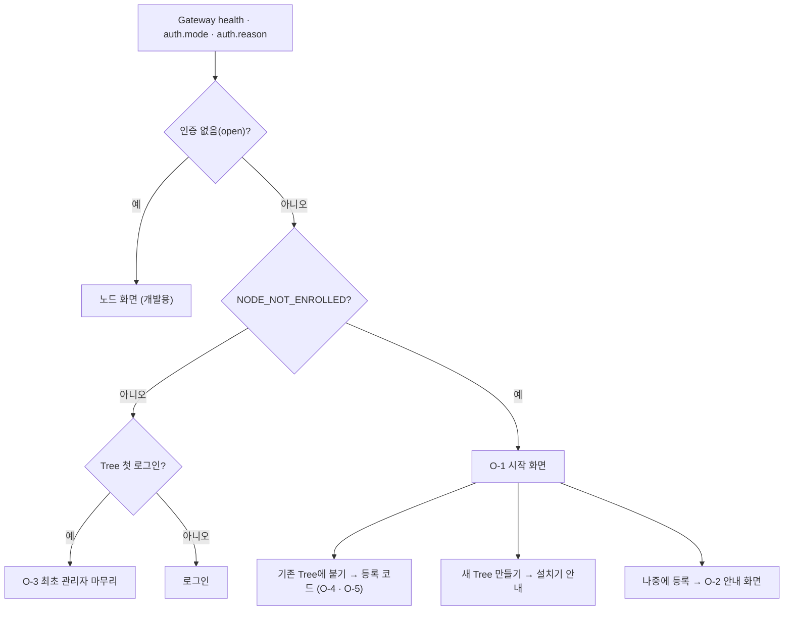

# 첫 실행 · 온보딩 · 관리 화면 공백 분석

> [!NOTE] 옮김 (2026-10-07)
> 이 문서는 maingui `docs/design/onboarding-gap-analysis.md`(`4ec0685`)에서 옮겼다. 디자인 원본이 이 저장소의 `web/design/`이 되었으므로([[module-profile|모듈 프로필]]) 이후 갱신은 여기서 한다. 본문의 "maingui"는 옮기기 전 원본을 가리키고, 표의 화면 · 파일 이름(`design/Intro` · `design/Settings` · `src/boot/service.js` 등)은 이 모듈에서는 `web/` 아래 같은 이름이다 — 다만 모듈은 `src/boot/module.js` 프로필로 돌아가므로 `service.js` 항목은 모듈의 부트 프로필로 읽는다. 구현 현황(§7)은 maingui 쪽 구현 기준이며, 모듈에 들어온 것은 [[implementation-backlog|구현 백로그]] MD-26이다.

Terra 저장소의 설치 · 등록 · 운영 문서와 maingui(main `a884226`)를 견주어, **maingui에 아직 없는 화면과 기능**을 모았다.
maingui [구현 백로그](https://github.com/StellaxiaLab/maingui/blob/main/docs/design/implementation-backlog.md)의 A.3("남은 것")은 비어 있지만, 그것은 *백로그에 올라온 것*이 비었다는 뜻이다. 이 문서는 Terra가 이미 갖고 있는데 백로그에 오른 적 없는 것을 본다.

> [!WARNING] 확인 범위
> 문서와 소스(`src/api/enroll.js` · `src/boot/service.js` · `src/api/operations.js`)를 읽어 판단했다. 화면을 직접 띄워 보지 않았고, 표의 **추론** 표시는 코드로 확인하지 못한 항목이다. 구현에 들어가기 전에 해당 항목을 먼저 확인한다.

## 1. 전제 — 설치 시점의 선택은 maingui 밖이다

maingui는 Gateway가 떠 있어야 열리는 웹 GUI이고, "Tree와 함께 설치할지 · 어떻게 등록할지"는 설치기(`terra-setup`)가 정한다.

| 영역 | 맡는 곳 | 현황 |
| --- | --- | --- |
| 설치 때의 선택 — 등록 방식 `account` · `token` · `auto` · `none`, WireGuard, 장치 이름 | **Terra 설치기** (Windows 마법사 · Linux 대화형 · 비대화형) | 있음 |
| 설치가 끝난 뒤 "지금 이 기계가 어떤 상태인가"를 알아보고 이어서 안내 | **maingui** | **비어 있음** — 아래 §2 |

따라서 "tree에 등록하면서 설치하느냐 아니냐" 같은 경우의 수는 maingui에서는 **설치 뒤 상태 분기**로 풀어야 한다.

## 2. 첫 실행 · 온보딩 공백

현재는 `health.auth.reason: NODE_NOT_ENROLLED` 하나로 분기한다(`bootIntro`). 이 분기에서 **등록 코드(`tnc_`) 폼 하나**만 나온다.

| ID | 상태 | 지금 | 필요한 것 |
| --- | --- | --- | --- |
| O-1 | 설치 직후, 이 기계가 무엇인지 모름 | 로그인 또는 등록 폼으로 곧장 감 | **시작 화면(상태 감지)** — `새 Tree를 만든다` · `기존 Tree에 붙는다` · `나중에 등록한다`(O-2 안내). Tree 설치 여부 · 등록 여부 · Gateway 인증 모드로 어느 칸을 먼저 보일지 정한다 |
| O-2 | 등록 안 함(`none`)으로 설치한 Leaf | 맵에 노드 1개 + "tree에 등록하라" 알람(A-12) | **"등록 전에는 이 브라우저에서 할 수 있는 일이 없다"를 말하는 화면**(§5 Q-3 — 로컬 Daemon 로그인은 Gateway에 없다). 등록 폼과 같은 자리에 두고, CLI로는 쓸 수 있음(`terra daemon …`)을 알린다 |
| O-3 | Tree 첫 실행 | 일반 로그인 | **최초 관리자(bootstrap) 마무리** — 첫 로그인 뒤 일상용 계정 만들기 · bootstrap 자격 파일 정리 안내. Terra 매뉴얼 "첫 실행과 관리자 계정"이 이 절차를 정해 두었다 |
| O-4 | 등록 방식 선택 | 코드 하나뿐 | ~~`account` · `token` 선택지~~ — **닫힘**. 비밀번호를 이 기계의 브라우저에 넣지 않는 것이 A-19의 요점이라 코드 방식을 유지한다(§5 Q-1) |
| O-5 | 등록 진행 중 | 한 줄 메시지 + 3분 대기 | **단계 표시** — 코드 확인 → Master 응답 → Daemon 재시작 → Gateway 복귀. 3분을 넘기면 원인(서비스가 아니라 직접 띄운 Daemon 등)별 안내 |
| O-6 | 등록이 끝난 뒤 | 없음 | **등록 상태 화면** — 어느 Tree에 속했는지, 장치 이름, 해제, 다른 Tree로 옮기는 "다시 등록" |
| O-7 | 루프백이 아니라 폼이 막힌 때 | 안내문만 | 안내문 안에 **복사할 수 있는 명령**(`terra daemon enroll` · 마법사)과 그 기계에서 여는 주소 |
| O-8 | Tree 쪽 코드 발급 | 있음(메모 · 수명 · 1회 표시 · 폐기) | 발급한 코드가 **쓰였을 때** 새 노드가 나타났다는 알림 · 코드 목록의 사용 여부(**추론** — 목록 필드는 확인하지 못함) |

### 상태 분기 제안

## 3. 관리 화면 공백

Terra에 있고 maingui의 `operations.js`에 연동이 없다. (`terra.master.*` 사용자 · Fleet · 코어 릴리스 op는 이 저장소에서 쓰는 곳을 찾지 못했다.)

| ID | 영역 | Terra에 있는 것 | maingui | 메모 |
| --- | --- | --- | --- | --- |
| M-1 | 사용자 · 권한 | 계정 생성 · 암호 재설정 · 비활성화 · 토큰 수명 | 화면 없음 | O-3과 같이 가면 자연스럽다 |
| M-2 | 모듈 카탈로그 · 배포 (**maingui 범위 밖**) | 카탈로그 · 게시 · 승인 봉투 · 롤아웃 · 미러 · 에어갭 | 노드에 깔기 · 풀기(A-22) · 설정(A-29)까지 | **모듈 몫으로 결정**(§5 Q-2) — maingui는 모듈 GUI 창으로 띄운다 |
| M-3 | 코어 업데이트 · 롤백 | Tree가 릴리스를 가지고 노드에 배포 | 화면 없음 | |
| M-4 | Fleet · Cell | 컨테이너 좌석 · 가입 코드(`tjc_`) | 등록 코드 입력에서 `tjc_`를 거절하는 문구만 | 노드 등록 코드와 다른 코드임을 이미 알고 있다 |
| M-5 | Tree의 Tree | 상하위 Tree pair · 지시 전달 | 노드 부모 바꾸기(A-11)만 | Tree 간 연결 발급 · 확인 화면 없음 |
| M-6 | 백업 · 복원 · 시크릿 · TLS | 운영 문서에 절차 | 화면 없음 | 우선순위 낮음 — 운영자는 CLI를 쓴다 |
| M-7 | 알림 임계값 | Terra도 미구현(판정 주체 미정) | 알림은 이벤트 신호 기준 | Terra 쪽 결정을 기다린다 |

## 4. 제안 순서

1. **O-1 시작 화면** — 상태 분기의 뼈대. 나머지 O 항목이 여기에 매달린다.
2. **O-3 + M-1** — Tree 첫 로그인 마무리와 사용자 관리. 같은 화면 묶음.
3. **O-5 · O-6 · O-7** — 등록 단계 표시 · 상태 화면 · 막힌 때의 명령 안내.
4. M-3 · M-4 · M-5 — 필요가 생기는 순서대로.

## 5. 결정 (2026-10-06)

Q-1 ~ Q-3은 권고대로 정했다.

| ID | 질문 | 결정 | 이 문서에 미치는 영향 |
| --- | --- | --- | --- |
| Q-1 | 등록 화면에 `account`(관리자 계정) 방식을 둘 것인가 | **두지 않는다.** A-19가 비밀번호를 이 기계에 넣지 않는 것을 요점으로 삼았다. `token`은 코드와 같은 성격이라 후보로만 남긴다 | O-4는 **닫힘** — 등록 방식은 코드 하나로 유지. `token`은 필요가 생길 때 다시 연다 |
| Q-2 | 모듈 카탈로그 · 심사 화면은 maingui인가, 모듈(`io.terra.registry`)인가 | **모듈.** Terra의 D-10 경계를 따른다. maingui는 그 모듈을 모듈 GUI 창으로 띄우는 쪽 | M-2는 maingui 몫에서 **빠짐** — 노드에 깔기 · 풀기(A-22) · 설정(A-29)까지가 maingui의 범위. §4 4번 항목 삭제 |
| Q-3 | "등록 없이 쓰기"는 로컬 Daemon 로그인까지 포함하는가 | **포함하지 않는다.** 확인 결과(아래)로 닫는다 | O-2는 **닫힘** — 로그인 칸을 늘리지 않고 "등록 전엔 할 수 없다"를 알리는 화면으로 줄인다 |

### Q-3 확인 결과 (Terra main 기준)

- Gateway의 인증 모드는 `master` · `seeded` · `open` · `none` 넷뿐이다(`server.go` `AuthInfo`, `cmd/terra-gateway/main.go`). **로컬 Daemon으로 로그인하는 모드는 없다.**
- 미등록 leaf의 Gateway는 모드 `none`(`reason: NODE_NOT_ENROLLED`)이다. 이때 "누구도 세션을 내밀 수 없어, 권한을 선언한 op는 전부 거절된다 — 곧 Daemon op 전부"(`pre_enrollment.go`). 루프백에서 통과하는 것은 등록 코드 op **하나**(ADR-GW-002 · 다섯 조건)뿐이다.
- 그래서 미등록 기계에서 브라우저가 할 수 있는 일은 등록뿐이다. Terra 매뉴얼의 "Master 또는 로컬 Daemon 대상 구분"은 maingui가 붙는 Gateway가 아니라 Terra 자체 Leaf GUI의 이야기로 보인다(**추론**).
- Daemon Local API는 토큰 파일 기반이라 CLI 몫이다(`terra daemon token …`). 브라우저에 그 토큰을 주는 길을 새로 만들면 등록 창의 "루프백 + 1회" 보장이 약해지므로 maingui가 요구할 일이 아니다.
- 로그인 없이 쓰는 길은 `--dev-open`(개발용)과 `seeded`(운영자가 토큰을 손으로 나눔)뿐이며, 둘 다 운영자 설정이지 최종 사용자의 선택지가 아니다.

## 6. 이 문서가 확인하지 못한 것

- 화면 실측 — 위 표의 "없음"은 문서 · 소스 기준이다.
- Windows에서의 등록 흐름. Terra의 Windows 설치 · 등록 E2E도 아직 유보 상태다.
- 다른 세션이 진행 중인 브랜치 · PR(이 문서를 쓸 때 열린 PR은 없었다).

## 7. 구현 현황 (2026-10-06)

디자인(`design/Intro.dc.html` · `design/Settings.dc.html`)을 먼저 만들고, 서비스(`src/boot/service.js`)가 같은 메서드를 실제 Gateway 호출로 덮는 순서로 구현했다. 가짜 Gateway(`tools/mock-gateway.mjs`)와 연기 시험(`tests/smoke.mjs`)에도 반영했다.

| ID | 상태 | 어디에 |
| --- | --- | --- |
| O-1 | 구현 | 시작 화면 — 새 Tree · 기존 Tree에 붙기 · 나중에 (`Intro`) |
| O-2 | 구현 | "등록 전에는 이 브라우저에서 할 수 있는 일이 없다" 안내 (`Intro` later) |
| O-3 | 부분 | 설정의 "첫 실행 마무리" 카드 · 일상용 계정 만들기. 노드 화면 알람은 아직 |
| O-5 | 구현 | 등록 단계 표시 · 3분 넘김 안내 (`enroll.js` `say(text, phase)`) |
| O-6 | 구현 | 설정의 등록 상태 카드 — `terra.daemon.enrollment.status.get`. 해제 · 다시 등록은 Daemon에 길이 없어 넣지 않았다 |
| O-7 | 구현 | 막힌 때 복사할 명령 (`terra daemon enroll …`) |
| M-1 | 구현 | 설정의 사용자 관리 — 만들기 · 끄기/켜기 · 암호 · 권한 (`terra.master.admin.users.*`, `master.admin` 필요) |
| O-8 · M-3 · M-4 · M-5 | 미구현 | 필요가 생기는 순서대로 |

> [!NOTE]
> 사용자 관리는 `master.admin` 권한이 있을 때만 열린다. 일반 사용자는 `denied`로 두고 말없이 가린다. 실제 Master와는 아직 붙여 보지 않았고, 가짜 Gateway의 `admin@…` 이메일만 관리자로 본다.

