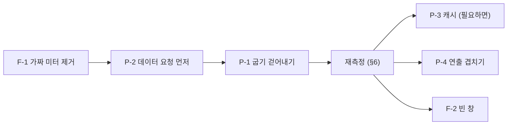

# 맵 진입 지연과 가짜 값 — 측정 결과와 개선 권고안

> [!IMPORTANT] 이 문서가 다루는 것
> 레지스트리로 설치한 `lab.stellaxia.node-gui` 0.4.1을 Terra 셸 안에서 열어 로그인했을 때 **맵이 뜨기까지 20초 넘게 걸린 이유**와,
> 그때 함께 드러난 **실데이터가 아닌 값** · **빈 창** · 환경 의존 오류에 대한 **측정 결과와 권고**다.
> 코드는 고치지 않았다. 권고마다 **확인한 것**과 **추정**을 나눠 적는다.

> [!NOTE] 측정 환경의 한계
> 헤드리스 Chromium(GPU 없음, 4코어)에서 쟀다. 절대 시간은 실제 PC보다 길 가능성이 크다. 다만 어느 단계가 지배적인지(굽기)는
> 환경과 무관하게 같은 코드 경로라서 비슷할 것으로 본다 — 이것은 **추정**이며 실제 데스크톱에서 같은 계측을 다시 돌려 확인해야 한다(§6).

---

## 0. 한눈에

| ID | 무엇 | 확인한 사실 | 권고 | 우선순위 | 크기 | 담당 | 백로그 |
| --- | --- | --- | --- | --- | --- | --- | --- |
| P-1 | 맵 진입에 20초 넘게 걸린다 | 타일 · 도로를 SVG → canvas → PNG로 **런타임에 메인 스레드에서 굽는다**(`toDataURL` 318회 · 약 36MB · 3.4초 + `drawImage` 151회 · 1.0초 + SVG 디코드) | 비동기 · 분할 굽기(원본), 빌드 시점 사전 굽기(모듈) | 높음 | 중간~큼 | **코드** (원본 `design/` 직접 수정) | MD-35 (UP-33 흡수) |
| P-2 | 데이터 요청이 굽기 뒤로 밀린다 | `/api/v1/catalog`가 서버 2ms인데 클라이언트에서 7.9초. 이후 요청은 14.7초에야 한꺼번에 나간다 | 굽기와 데이터 요청을 병렬로 — 데이터 요청을 먼저 | 높음 | 작음 | **코드** | MD-37 |
| P-3 | 같은 노드를 열 때마다 처음부터 다시 굽는다 | 캐시 없음(`_roadImg` · `tileImg`는 메모리뿐) | 굽기 결과를 키로 캐시 (P-1의 빌드 시점 굽기를 하면 필요 없다) | 낮음 | 중간 | **코드** | MD-39 |
| P-4 | 진입 연출이 데이터 준비 뒤에 시작된다 | `autoMs` 1.4초 + 내려가는 연출 약 4~5초가 데이터 뒤에 직렬 | 연출과 로딩을 겹치기 | 낮음 | 작음 | **코드** (원본 `design/`) | MD-43 (UP-35 흡수) |
| F-1 | 노드 카드의 CPU · 메모리 · 디스크가 **지어낸 값**이다 | 노드 이름 해시로 계산(`node.js:4393`). 실제는 0~2% · 6% · 28%인데 24% · 48% · 87%가 뜬다 | 실데이터로 잇거나 칸을 숨긴다 | **높음**(신뢰) | 작음 | **코드** (원본 `design/`) | MD-36 (UP-34 흡수) |
| F-2 | 모듈 · 사용자 · 설정 창의 본문이 빈 안내문이다 | "…화면이 이 창 안에 들어옵니다"만 보이고 숫자 한 줄이 전부 | 본문을 잇거나 "보드에서 열기"를 눈에 띄게 | 중간 | 중간 | **코드** (원본 `design/` + 연동 층) | MD-40 (UP-36 흡수) |
| E-1 | `io.devices.get` · `files.list.get`이 503이다 | 이 데몬에 `io.terra.io-inventory` · `io.terra.file`이 없는 환경 | 모듈 없음과 오류를 구분해 보인다 | 낮음 | 작음 | **코드** | MD-38 |

> [!NOTE] 2026-10-09 — 담당 구분이 없어졌다
> 처음에는 `src/screens/*.js`가 maingui 디자인 원본의 생성 파일이라 굽기 · 예시 미터 · 연출 · 빈 창은 **디자인(maingui)** 이, 요청 순서 · 오류 처리는 **코드(modules)** 가 맡는 것으로 나눴다.
> maingui를 더 이상 쓰지 않으므로 `web/design/*.dc.html`이 이 저장소의 원본이다 — 모두 **이 저장소의 한 세션**이 고친다(`design/`을 고친 뒤 `npm run gen`). 생성 파일을 손으로 고치지 않는 규칙은 그대로다.
> 진행은 [[work-order-map-entry-and-fidelity|작업 지시서]]를 따른다.

---

## 결과 (2026-10-09 구현 — [[work-order-map-entry-and-fidelity|작업 지시서]] §6 · §7 · §8)

| ID | 결과 | 백로그 |
| --- | --- | --- |
| P-1 굽기 | **쓰이는 것만 · 한 장씩(`requestIdleCallback`) · 비동기 PNG(`toBlob` + `FileReader`)** 로 바꿨다. 큰 `toDataURL` 318회(36.6MB) → 0회, 쓰이는 그림 6~11장. 로그인 → 맵 **평균 20.1초 → 7.3초(−64%)** | MD-35 완료 |
| P-2 요청 순서 | 요청을 굽기보다 먼저 시작해 봤으나 **효과가 없어 되돌렸다**(§1.3). 굽기를 걷어내자 `catalog`가 7.5~9.5초 → 0.2초로 줄었다 | MD-37 효과 없음 |
| P-3 캐시 | 런타임 굽기가 1~11장이 되어 **불필요** — 하지 않았다 | MD-39 하지 않음 |
| P-4 연출 | 연출은 이미 구름에서 맵을 기다리고 있었다(직렬이 아니었다). 고정 지연만 줄였다: 미리 읽기 1200 → 250ms · 준비 판정 load+900ms → 노드 화면 연결 확인 · `autoMs` 1400 → 900 | MD-43 완료 |
| F-1 지어낸 값 | 해시 계산을 지웠다. 받은 값만 그리고 없으면 "사용량 — 이 노드의 게이트웨이가 아직 알려 주지 않는다". leaf 게이트웨이에 사용량 op가 없어 PF-25로 올렸다 | MD-36 완료 · PF-25 |
| F-2 빈 창 | 보드가 있는 창은 [전체 화면으로 열기](누르면 진짜 보드가 열린다 — 설정은 140키를 실제 Daemon 값으로 보인다), 보드가 없는 창(모듈 · 사용자)은 "이 앱에 아직 없다". **"보드에서 열기 →" 링크는 srcdoc 안에서 누르면 화면이 CSP 오류 페이지로 바뀌어 노드 화면이 깨지는 버그라 제거했다** | MD-40 완료 |
| E-1 모듈 없음 | modules.get(15초 캐시)로 모듈이 없으면 `io.devices.get` · `files.list.get`을 부르지 않는다. 503 두 건 제거 | MD-38 완료 |

---

## 1. 측정 — 로그인 클릭부터 맵까지

로그인 클릭(0초) 기준이다.

| 시각 | 일어나는 일 | 비고 |
| --- | --- | --- |
| 0.0–0.2초 | `POST /auth/credentials` 76ms · 앱 토큰 발급 5ms | 서버 쪽은 빠르다 |
| 0.1–0.2초 | 앱 iframe(`index.html`) 로드 | |
| 1.4초 | 숨은 맵 화면(`node.html`)을 받아 `srcdoc`로 넣는다 | 시작 화면이 **미리 읽는** 길 |
| 1.4–6.4초 | 메인 스레드 약 5.2초 연속 점유(롱태스크) | 맵 화면 부팅 |
| 6.8–14.7초 | `GET /api/v1/catalog` **7.9초** | 서버 응답은 2ms(스코프 토큰으로도 1ms) |
| 14.7–15.4초 | `whoami` · operations 약 10건이 한꺼번에 나가 0.5초 안에 끝난다 | 서버는 빠르다 |
| 이후 | 진입 연출(`autoMs` 1.4초 + 내려가는 모션) 4~5초 | 맵이 보이는 것은 20초 안팎 |

서버 쪽은 어디에서도 병목이 아니다(앱 토큰 5ms · catalog 1~2ms · operations 수십 ms). 시간은 **iframe 안의 메인 스레드**에서 쓰인다.

### 1.1 메인 스레드에서 무엇을 하나

맵 화면(`srcdoc`) 안에서 한 번 여는 동안 쟀다.

| 항목 | 값 |
| --- | --- |
| `canvas.toDataURL('image/png')` 호출 | **318회** |
| 같은 호출의 누적 시간 | **약 3.4초** |
| 만들어진 base64 PNG 총량 | **약 36MB** |
| 캔버스 크기 | 최대 697×612 · 합계 약 3,500만 픽셀 |
| SVG `Image` → `drawImage` | 151회 · 약 1.0초 |
| 굽기가 일어나는 시점 | 페이지 시작 1.1초 ~ 12.8초 |

CPU 프로파일(iframe 타깃, 샘플 간격 1~2ms)로 보면 구간별 주 점유자가 다르다.

| 구간 | 주 점유 | 비고 |
| --- | --- | --- |
| 0–2초 | 부트 · 색 변환(`rgbHex` · `hexRgb`) | `(idle)` 약 37% |
| 2–6초 | `(program)` 약 62% | SVG 이미지 디코드 · 래스터 같은 네이티브 작업 |
| 6–10초 | `toDataURL` 약 31% + `drawImage` 약 24% | `(idle)` 약 8% |
| 10–15초 | `toDataURL` 약 37% + `drawImage` 약 19% | `(idle)` 약 10% |

### 1.2 굽는 코드는 어디인가

- `web/src/screens/node.js` `bakeImgs(list)` — 벡터 타일마다 SVG를 만들어 `Image`에 넣고, `onload`에서 `canvas`에 3배 해상도(`SCALE = 3`)로 그린 뒤 `toDataURL('image/png')`로 데이터 URL로 바꾼다. `Promise.all`로 전부 모은 다음에야 캐시에 넣는다.
- `web/src/screens/node.js` `roadImgOf(...)` — 도로도 같은 방식이다. 키가 같으면 메모리 캐시(`this._roadImg`)에서 쓰지만, **페이지를 다시 열면 비어 있다**.
- `field.js` · `ground.js` · `road.js` · `building.js` · `material.js`에도 같은 모양의 굽기 코드가 있다(`getImageData` · `drawImage` 사용 확인).

### 1.3 catalog가 7.9초 걸리는 이유 — 확인한 것

처음 측정(2026-10-08)에서 확인한 것:

- 서버는 마스터 토큰 · 스코프 토큰 모두 1~2ms로 응답한다(curl).
- 그 사이 iframe의 메인 스레드는 `(idle)` 6~12%뿐이다(위 표).
- `prefers-reduced-motion`으로 바다 애니메이션 루프를 꺼도 지연은 7.4초 그대로였다 → **애니메이션 루프는 원인이 아니다**.

**2026-10-09 구현에서 확인된 것** (이전엔 추정이었다):

1. **요청 순서가 원인이 아니다.** 시작 화면이 토큰을 받는 즉시 첫 요청(catalog · whoami · node.get · enrollment.status · nodes)을 시작하게 해 봤다. 요청은 0.2초에 끝났지만 그 응답을 쓰는 조타륜 앱 첫 요청(`modules.get`)은 여전히 14.0~15.7초(전: 14.2~14.9)에 돌았고 맵 표시도 18.3~19.5초(전: 18.1~23.0)로 그대로였다. → 응답이 와도 **돌릴 메인 스레드가 없었다.**
2. **굽기가 메인 스레드를 쥐고 있었다.** 굽기를 쓰이는 것만 · 한 장씩 · 비동기 PNG로 바꾸자 `catalog`가 7.5~9.5초 → **0.2초**, 로그인 → 맵이 평균 20.1 → 7.3초가 됐다. 요청 순서는 그대로 두고서다.
3. **비용은 세 군데였다**(개발 빌드 호출 위치 분류): 타일 `bakeImgs` 65장(toDataURL 1.8초 + drawImage 0.27초) · 건물 `bakeBuildings` 68장(1.6초 + 1.06초) · 도로 `roadImgOf` 18장(0.32초 + 0.26초). 작은 무늬 `bakePx` 166회는 합 18ms로 무시할 수준이다. 큰 그림 151장은 SVG 데이터 URI 합 38MB를 한 번에 `Image`로 디코드하던 것이다.
4. **굽는 그림은 거의 모두 서로 다르다**(318회 중 313 — 중복 제거로는 줄지 않는다). 줄인 것은 **중복이 아니라 안 쓰는 것**이다: 라이브러리 전체(스킨 6 × 변형 5 = 타일 30 + 애니메이션 프레임 35 · 건물 10 × 4방향(+프레임) · 도로 3)를 맵 진입 때 구웠는데, 갓 로그인한 노드는 자원이 하나도 없어 잔디와 바다 몇 장이면 된다.
5. **CSP가 `img-src 'self' data:`라 `blob:` URL은 못 쓴다.** `toBlob`으로 인코딩만 비동기로 하고 `FileReader`로 data URL로 바꿔 쓴다.

> [!NOTE] 아직 모르는 것
> 남은 7.3초 가운데 마운트 동기 작업 약 2초와 하늘 연출(카메라 1.7초 + 구름 2.8초 — 소프트웨어 렌더링에서는 프레임이 느려 `dt` 제한 때문에 더 길어진다)이 대부분이다. GPU 환경에서 같은 계측을 다시 해야 한다.

---

## 2. 권고 — 진입 지연

### P-1. 굽기를 메인 스레드와 런타임에서 걷어낸다

권고안은 아래 순서로 효과가 크고 위험이 작은 것부터다.

1. **빌드 시점 굽기** — 타일 · 도로 SVG는 같은 입력이면 같은 그림이다. 이 모듈의 `build:web` 단계(`tools/build-web.mjs`)에서 PNG(또는 스프라이트 아틀라스)로 구워 `ui/`에 싣고, 런타임은 URL만 쓴다. `.tmod`에 들어가 `pack`의 무결성 기록(`integrity`)에도 같이 잡힌다. 입력이 노드 데이터에 따라 달라지는 타일은 2번으로 간다.
2. **런타임 굽기가 필요하면 비동기 · 분할**
   - `toDataURL`(동기 · base64 인코딩) 대신 `canvas.toBlob`(비동기) + `URL.createObjectURL`을 쓴다. base64 36MB를 문자열로 들고 있지 않아도 된다.
   - `createImageBitmap` + `OffscreenCanvas`를 워커로 옮겨 메인 스레드 점유를 없앤다.
   - 보이는 칸 · 선택 · 근처부터 굽고 나머지는 `requestIdleCallback`으로 나눈다. 한 틱에 한 장씩이면 롱태스크가 생기지 않는다.
3. **해상도를 화면에 맞춘다** — `SCALE = 3` 고정을 `devicePixelRatio`(최소 1, 최대 2)와 실제 표시 크기에 맞춘다. 픽셀 수는 `(2/3)² ≈ 0.44`배로 준다.
4. **중복을 합친다** — 318번이 모두 서로 다른 그림인지는 확인하지 못했다. 같은 `topPat` · 같은 `paths`를 가진 타일이 있으면 키로 묶어 한 번만 굽는다(`bt.key`로 이미 구분하지만, 키 설계가 중복을 걸러내는지 점검한다).

완료 기준:

- 맵 진입 구간(로그인 → 맵 표시)에서 **50ms를 넘는 롱태스크가 없다**(또는 1건 이하).
- iframe 안 `toDataURL` 호출이 **0회**이거나 보이는 것에 한정된다.
- 로그인 클릭에서 맵 표시까지 **같은 환경에서 현재의 절반 이하**.

### P-2. 데이터 요청을 굽기보다 먼저

데이터 요청(`catalog` · `whoami` · `node.get` · `layout` 문서 · operations)은 굽기와 서로 독립이다. 지금은 굽기가 메인 스레드를 막아 요청이 14.7초에야 나간다.

- 부트에서 **요청을 먼저 시작**하고 굽기는 그 뒤에 예약한다(요청 시작은 거의 비용이 없다).
- 굽기를 P-1처럼 쪼개면 자연히 해결될 수 있다. 어느 쪽이든 §1.3의 추정을 확인하는 계기가 된다.
- 첫 화면에 필요한 것(노드 · 부모 · 자원 목록)과 나중에 되는 것(io 장치 · 파일 목록 · 와이어가드 · 설정 스키마 12.6KB)을 나눠 후자를 지연 요청한다.

### P-3. 굽기 결과를 캐시한다

지금은 페이지를 열 때마다 처음부터 굽는다. 키(타일 · 도로 정의 해시 + 해상도 + 앱 버전)로 `Cache Storage` 또는 IndexedDB에 Blob을 두면 두 번째 진입부터는 굽기가 없다. P-1의 1번(빌드 시점 굽기)을 하면 필요 없어진다 — 둘 중 하나를 고른다.

### P-4. 진입 연출을 로딩과 겹친다

`autoMs`(기본 1.4초) 대기와 내려가는 모션은 데이터와 굽기가 **끝난 뒤** 시작해 직렬로 더해진다(코드: `data/intro-live.js`의 `screen._autoT`). 로딩 중에 이미 하늘이 내려가는 모션을 시작하고, 준비되면 이어서 페이드하는 식으로 겹치면 체감이 줄어든다. 효과는 P-1 · P-2보다 작다.

---

## 3. 권고 — 실데이터가 아닌 값

### F-1. 노드 카드의 CPU · 메모리 · 디스크 (높음)

`web/src/screens/node.js` 4393행 부근에서 아래처럼 계산한다.

```js
const h = [...nd.name].reduce((a, ch) => (a * 31 + ch.charCodeAt(0)) >>> 0, 11), m = (s2) => 8 + ((h >>> s2) % 72);
meters: [['CPU', m(0)], ['메모리', m(7) + 12], ['디스크', m(13) + 18]]
```

노드 이름 문자열의 해시로 만든 값이라 **노드 이름이 같으면 항상 같은 값**이 나온다. 이 측정에서 `gui-test-node`는 24% · 48% · 87%로 떴지만, 실제 기계는 CPU 0~2% · 메모리 6% · 디스크 28%였다(`top` · `free` · `df`). 87%는 "주의(노랑)"로 표시되기까지 했다.

모듈 README와 [[real-data-layer|실데이터 층]]은 디자인 원본의 예시 데이터를 하나도 보이지 않게 지웠다고 적고 있어서, 이 부분이 **누락된 예시 값**으로 보인다.

권고(택일):

1. **실데이터로 잇는다.** Terra에 노드 자원 사용량을 주는 operation이 있는지 먼저 확인한다(없으면 Terra 쪽 요구사항으로 올린다 — [[implementation-backlog|구현해야 할 것]]에 항목을 만든다). 있으면 값 · 단위 · 갱신 주기를 명세한다.
2. **값이 없으면 칸을 숨긴다.** "—" 또는 "수집 안 함"으로 보이고 색 규칙(80% 초과 노랑)도 끈다. **지어낸 숫자를 상태처럼 보이게 두지 않는다.**

시험: `tests/`에 "노드 카드의 미터는 데이터가 없으면 값이 없다"를 더하고, 이름만 다른 두 노드가 같은 값을 내지 않는지 확인한다([[testing|시험]]).

> [!TIP] 같은 종류의 누락 점검
> `node.js` 2646행의 `cpu=… mem=… seq=…` 문자열도 `seq`로 계산한 값이다(진단 문구). 같은 해시 · 시퀀스 패턴이 다른 화면(`field.js` · `ground.js` 등)에 더 있는지 `grep`으로 훑는다.

### F-2. 빈 창 (중간)

조타륜 유틸 서랍의 **모듈 · 사용자 · 설정** 창이 본문 대신 "…화면이 이 창 안에 들어옵니다"라는 안내문과 숫자 한 줄(예: "설치 4 · 실행 0 · 실패 0", "admin@example.com · 권한 6", "Daemon 설정 140키")만 보인다. 상세는 "보드에서 열기 →"로 가는 구조로 보이는데, 이 측정에서는 그 링크를 눌러 보지 않았다.

권고:

- 창이 **무엇을 기다리는지**(모듈 GUI가 아직 안 들어옴 · 열 수 없음 · 아직 구현 안 됨)를 안내문이 구분해 말한다. 지금 문구는 곧 들어올 것처럼 읽힌다.
- "보드에서 열기"를 기본 동작으로 승격한다(버튼 모양).
- "실행 0"이 정상인지(Scene 모듈은 프로세스가 없다) 오류인지 구분해 보인다.

---

## 4. 권고 — 환경 의존 오류

### E-1. 모듈 없음과 오류를 구분한다 (낮음)

`terra.daemon.io.devices.get` · `terra.daemon.files.list.get`이 503이다. 이 환경의 데몬에는 `io.terra.io-inventory` · `io.terra.file`을 설치하지 않았다. 모듈이 없어서 닫혀 있는 것이므로 오류가 아니다.

- 응답 503의 사유(모듈 미설치)를 화면이 읽어 "이 노드에 입출력 모듈이 없다"로 보이게 한다.
- 콘솔의 오류 로그가 정상 흐름에서도 남지 않도록 첫 호출 전에 `modules.get` 결과로 건너뛴다.

같은 환경에서 `/api/v1/me/documents/.../layout/<node>` · `.../assets`가 404였다. 처음 쓰는 계정이라 저장된 맵 배치가 없는 것으로 **보이지만**, 문서를 열어 확인하지는 않았다 — 없음(404)을 빈 맵으로 자연스럽게 처리하는지 확인한다.

---

## 5. 실행 순서 제안



1. **F-1** — 작고 신뢰 문제라서 먼저.
2. **P-2** — 작은 변경으로 §1.3의 추정을 검증한다(굽기를 그대로 두고 요청만 앞당겨 봤을 때 catalog가 빨라지는지).
3. **P-1** — 가장 큰 효과. 빌드 시점 굽기가 가능한지부터 본다.
4. 재측정 뒤 P-3 · P-4 · F-2를 정한다.

---

## 6. 재현 · 재측정 방법

환경은 아래와 같이 맞춘다.

1. master(`terra-master`)를 띄우고 `lab.stellaxia` 접두사를 발급한 뒤, `.tmod`를 올리고 `available`로 publish한다.
2. leaf 데몬을 등록하고 `terra module consent lab.stellaxia.node-gui`로 설치한다.
3. 게이트웨이에 `gateway_service.master_service_credential`을 주어 `auth.mode: master`로 띄운다. base Scene(`io.terra.scene.terra`)과 player는 코어 모듈이므로 별도 모듈 디렉터리로 더한다.
4. leaf 셸(`products/leaf/ui`)을 `VITE_TERRA_GATEWAY_URL` · `VITE_TERRA_GATEWAY_PROXY_TARGET`을 주고 띄운다. 셸이 base Scene → node-gui main으로 자동 진입한다.

재측정 항목(Playwright + CDP):

| 항목 | 방법 |
| --- | --- |
| 클릭 → 맵 표시 시간 | 로그인 클릭 시각 기준으로 앱 iframe의 `[data-in-map]` 투명도가 1이 되는 시각 |
| 굽기 호출 수 · 시간 | `HTMLCanvasElement.prototype.toDataURL` · `CanvasRenderingContext2D.prototype.drawImage`를 init script로 감싸 횟수 · 누적 ms · 바이트 |
| 롱태스크 | `PerformanceObserver({entryTypes:['longtask']})` — 맵 진입 구간의 50ms 초과 작업 수와 최대 길이 |
| 요청 타임라인 | 페이지 `request` · `requestfinished` 이벤트(iframe 포함) — `catalog`의 시작과 끝 |
| CPU 프로파일 | iframe 프레임에 `ctx.newCDPSession(frame)` → `Profiler.start/stop`, 구간별 자기 시간 집계 |

> [!NOTE]
> 이 환경은 헤드리스 소프트웨어 렌더링이다. 개선 전후 비교는 **같은 환경에서** 한다. 실제 데스크톱(GPU)에서의 값은 별도로 한 번 잰다.

---

## 7. 이 문서가 확인하지 못한 것

2026-10-09 구현으로 확인된 것(앞서 못 한 것): catalog 지연의 원인(§1.3) · 318번의 서로 다른 그림 수(313) · "보드에서 열기" 동작(깨진다 — 제거) · 조타륜 "속성" 메뉴(정상).

아직 확인하지 못한 것:

- 실제 데스크톱 브라우저(GPU)에서의 절대 시간과 하늘 연출 길이.
- 마운트 동기 작업 약 2초가 무엇으로 이루어졌는지(프로파일로 쪼개지 않았다).
- 편집기 보드 페이지(건물 · 도로 · 필드 · 자재)를 전체 화면으로 열 때의 굽기 비용 — 같은 모양의 굽기 코드(`getImageData` 사용)가 있다.
- `me/documents/.../assets` 404 — 코드(`DocStore.read`)는 "저장된 것 없음"으로 처리하지만 서버 쪽 의미(문서가 없는 것인지 계정이 문서를 안 만든 것인지)는 읽지 않았다.
- 로그인 이후 자원 추가 · 수정 · 삭제 · 연결 · 도로 편집 같은 쓰기 기능.

## 8. 진행 방법

maingui가 중단되어 디자인 세션 · 코드 세션을 나눌 필요가 없다. 세션에는 아래 **한 줄**만 붙인다 — 순서 · 상세 · 완료 기준 · 기록표는 [[work-order-map-entry-and-fidelity|작업 지시서]]에 있다.

```text
common/lab.stellaxia.node-gui/web/docs/guides/work-order-map-entry-and-fidelity.md 를 읽고 §3 순서대로 끝까지 진행해라. 항목마다 전/후 숫자를 §6 기록표에 남기고, §7 진행 로그를 갱신하고, PR은 draft로 올려라.
```

## 관련 문서

- [[docs/README|개발 문서 MOC]]
- [[implementation-backlog|구현해야 할 것]]
- [[module-profile|모듈 프로필]]
- [[real-data-layer|실데이터 층]]
- [[architecture|구조]]
- [[node-screen-ui-spec|노드 화면 UI 명세]]
- [[testing|시험]]
