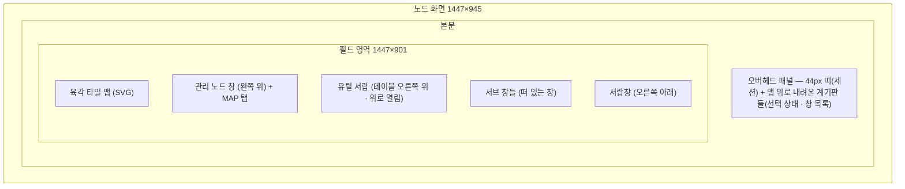
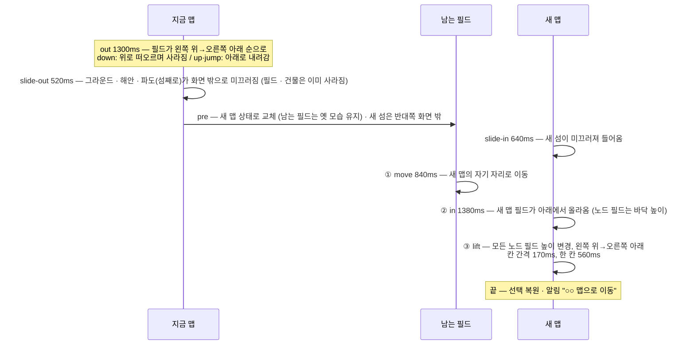
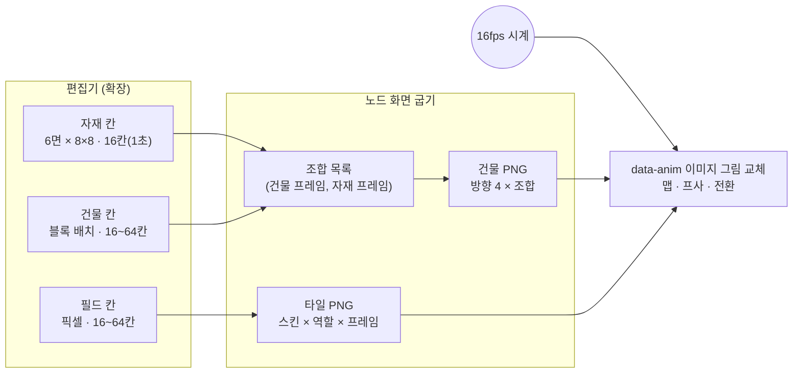

# 노드 화면 UI 명세

원본은 캔버스 보드 `Artboard-qcfu.dc.html`(1447×945)이다. 이 문서는 **보이는 것과 움직임**만
적는다. 각 값의 출처는 [[node-screen-data-model|데이터 모델]], 호출은
[[node-screen-api-integration|API 연동 가이드]]가 소유한다.

> [!NOTE] 예시 값은 원본 미리보기의 것이다
> 이 문서에 나오는 노드 이름(`edge-01` · `tree-home` …) · 시각 · 개수 · "예시 데이터" 표식 · 보드의 "시연" 스위치는 디자인 캔버스
> 미리보기의 값이다. 출하 화면에서는 실데이터 층이 지우고 이 노드의 값으로 채운다 — [[real-data-layer|실데이터 층]].

> [!NOTE] 좌표계
> 필드 영역은 **1447×901** 논리 좌표다(왼쪽 내비 232px · 위 오버헤드 패널 띠 44px 제외 — 패널 양옆 계기판은 필드 위로 56px 내려온다). 모든 창 · 서랍 좌표는
> 이 영역 기준이며, 화면 크기에 맞춰 통째로 축소한다(`fitScreen`). 숫자를 바꿀 때는 이 기준을 지킨다.

## 1. 화면 구성



왼쪽 주 메뉴(코어 · 경계 · 모듈이 더한 화면)는 없앴다 — 화면 이동은 유틸 서랍 카드와 서브 창의 "보드에서 열기"로 한다.

| 구역 | 역할 | 소스 위치(대략) |
| --- | --- | --- |
| 오버헤드 패널 | 조종실 천장. 가운데 세션 띠(전체 창 리스트 박스), 왼쪽 선택 상태, 오른쪽 폴더 보관함 ([[#5.4 오버헤드 패널 (화면 위)\|5.4]]) | 템플릿 `aria-label="오버헤드 패널"`, `renderVals()`의 `ovh`, `ovWin` |
| 필드 | 지금 보고 있는 맵(주인 노드 하나)의 타일 · 노드 · 건물 | 템플릿 `<svg … aria-label="필드 …">`, `renderVals()`의 `tiles` |
| 관리 노드 창 | 로그인한 tree의 프사(건물 그림) · tree 전환 · 로그인 창 | `tl*`, `flipTo`, `startLogin` |
| MAP 탭 | 관리 노드 창 뒤에 숨은 탭. 끌어서 지도 창을 연다 | `startWinDrag(…, 'pull')` |
| 유틸 서랍 | 전체 기능 카드(속성 · 편집 · 알림 · 네트워크 · 편집기 3종 · 모듈 · 사용자) | `ud*`, `UD()` |
| 서브 창 | 기능 하나씩 담는 끌 수 있는 창 | `WDEF`, `openWin`, `closeWin` |
| 서랍창 | 치워 둔 창을 파스텔 카드로 보관 | `storeWin`, `drawerZone` |

- 맵 왼쪽 위의 경로 · 맵 제목 · 모드 설명 · 범례는 없앴다(맵 화면에 글자를 두지 않는다).

## 2. 필드와 타일

### 2.1 타일 좌표

- 칸 키는 `"c-r"`(열-행) 문자열이다. 홀수 열은 반 칸(46px) 아래로 내려간다.
- 칸 중심: `cx = 183 + c·130`, `cy = 150 + r·92 + (c 홀수 ? 46 : 0)` (`cellXY`).
- 맵이 화면보다 크면 맞춤 변환 `fx = { s, tx, ty }`로 줄인다. **타일을 그리기 전에** 계산해야 한다.
- 타일 옆면이 잘리지 않도록 clipPath `clip-ground`는 타일 기준 `y −520`, 높이 `615`(= H + D)다.

### 2.2 필드 높이 3단계

| 단계 | 대상 | 높이 |
| ---: | --- | --- |
| 1 | 빈 필드 | 0 |
| 2 | 자식 노드 필드 | 스킨의 `lift` (기본 26) |
| 3 | 맵 주인 — tree 맵의 부모 필드, leaf 맵의 자기 칸 | 부모 디자인의 `lift` (기본값은 `parentDefault()`) |

- 노드 필드는 윗면 **테두리(rim)**로 역할을 구분한다: Leaf 파랑 · Tree 호박색 · Tree·Leaf 교대.
- 부모 필드는 전용 **띠(band)**와 테두리를 두른다. 스킨마다 `parent`가 `null`이면 기본 디자인을
  따르고, 값이 있으면 그 필드 전용이다(필드 편집기에서 "기본 따르기" · "기본으로 지정").
- 높이가 바뀔 때는 늘 애니메이션한다(§4).

### 2.3 타일 상호작용

| 입력 | 결과 |
| --- | --- |
| 클릭 | 타일 선택 → 속성 창에 표시 |
| 더블클릭(350ms 안에 두 번) | 노드 필드면 그 노드의 맵으로 진입(§4) |
| 편집 모드에서 끌기 | 필드 이동 · 교환, 건물 · 노드 배치 |
| 오른쪽 클릭 | 원형 메뉴(슬롯 8개, 지금은 빈 슬롯) |
| `R` | 선택한 건물 90° 회전 |
| 속성 창 `필드 무늬 ↻ 60°` · `그라운드 무늬 ↻ 60°` (편집 모드) | 선택한 칸의 필드 스킨 · 그라운드 무늬를 60°씩 돌린다 |


### 2.5 그라운드 — 높이 0인 바닥 필드

육각 칸 하나를 **리전**이라 한다. 필드는 리전 위에 서고, 그 바닥면 높이(리전 높이)에 **그라운드**가 깔린다.

| 항목 | 규칙 |
| --- | --- |
| 모양 | 리전 격자의 보로노이 칸 = 리전보다 사방으로 리전 사이 간격의 절반만큼 큰 육각. 이웃 그라운드와 틈 · 겹침 없이 맞붙는다 |
| 설치 | 빈 리전에 따로 깔 수 있다(`+ 그라운드`를 끌어 점선 칸에). **필드가 놓인 리전에는 늘 깔린다** — 따로 적지 않는다 |
| 건물 | 놓을 수 있다 (그라운드 바닥면에 선다) |
| 노드 | 둘 수 없다 — 놓으면 "필드 위에 놓으세요" 안내 |
| 꼭짓점 | 그 꼭짓점을 함께 쓰는 이웃 칸에 그라운드가 없을 때만 둥글게(반지름 18) 깎는다. 이음 패딩 · 두께 · 테두리 선은 없다 |
| 재질 · 회전 | 칸마다 그라운드 재질(`gmat`)과 무늬 회전(`grot`, 60° 단위). 편집 창 `그라운드` 탭 · 속성 창 버튼 |
| 애니메이션 | 필드와 같은 칸 모델(1초 16칸, 빈 칸은 앞 프레임). 예시: `물가 모래` 초당 8프레임 |
| 삭제 · 이동 | 그라운드만 깔린 칸을 끌어 삭제 칸 · 다른 빈 리전에. 그 위로 필드를 옮기거나 새 필드를 놓으면 필드가 올라선다(그라운드 재질 · 건물은 남음) |

- **배치 기준은 바닥면**이다. 필드 · 그라운드를 끄는 동안 보이는 점선 칸은 리전 높이(필드 바닥 = 필드 윗면 기준 +56)에 그린다.
- 그리기: `groundGeo(칸 목록)`가 칸마다 보로노이 칸 윤곽(외톨이 꼭짓점만 둥글게)을 만든다(칸 목록이 같으면 캐시). 재질 · 회전이 같은 칸끼리 윤곽을 경로 하나에 모아 칠한다 — 한 경로 안에서 맞닿은 변은 이음 선이 생기지 않는다.
- 무늬는 세계 좌표에 고정된 패턴(`gp-스킨-회전-프레임`)이라 이웃 칸과 이음매 없이 이어진다. 애니메이션은 `animTick`이 `[data-ganim]`의 `fill`만 바꾼다(렌더 밖).
- 필드 스킨 회전(`frot`)은 윗면 무늬를 세계 좌표에서 돌리고, 띠 · 옆면 · 테두리는 윤곽을 따라 1/6 바퀴씩 민다. 회전한 벌은 처음 쓰일 때 굽는다(`ensureRot` → `bakeImgs`).

#### 해안 그라운드 · 바다

- **해안 그라운드**(둘레 칸): 그라운드(필드가 서 있는 그라운드 포함)가 깔린 칸 바깥으로 **늘 한 칸씩 빙 두른** 파도 칸. 땅을 늘리는 칸이 아니라 **거의 늘 물에 덮여 있고**, 윗면은 파도가 빠질 때만 자연스럽게 드러난다. 데이터에 적지 않고 렌더 때 계산한다(`ringKeys`). 편집 · 선택 대상이 아니다.
- **윗면**: 붙어 있는 그라운드의 윗면(재질 · 회전)을 그대로 쓴다. 서로 다른 그라운드가 붙어 있으면 **칸 가운데를 중심으로 면 기준으로 나눠 가진다** — 칸을 반 변 12조각(가운데 → 반 변 쐐기)으로 보고, 조각마다 가장 가까운 '그라운드와 맞닿은 변'의 그라운드를 따른다. 같은 거리면 반씩 나뉘어 똑같이 나눠 가진다(`ringParts`).
- **해안선 · 파도 = beach-foam 엔진**: 관리 노드 창 해변과 같은 beach-foam 엔진(`assets` 아님, 코드에 그대로 옮김: `coastEngine` · `coastStart`)을 섬 해안선을 따라 감아 돌린다.
  엔진의 로컬 좌표 a(해안선 방향) · b(수직, +가 모래 쪽)를 해안 곡선(`coastLoop`, 차이킨으로 둥글린 그라운드 바깥 윤곽) 위에 놓는다 — 세계 점 = P(a·s) + 바깥 법선 × (δ − s·(b + 8)), s = 0.6, δ = 60(해안 그라운드 가운데 기준 3/4 자리).
  물가(E)는 엔진 그대로 여러 물결이 겹쳐 **불규칙하게 일렁이고**, 파도는 주기 8초로 밀려와 해안 그라운드 전체 길이의 1/4쯤 오른다(reach 66 → 세계 약 40). 엔진 물결 주파수는 고리 길이에 맞춰 반올림해 이음매가 없다.
  쓰는 것은 엔진의 물가(E) · 젖은 모래(E ~ W) · 거품 바깥 경계(Sh)뿐이다. **바깥 흰 거품 띠(리본) · 따로 칠한 얕은 물(D)은 쓰지 않는다.** **거품 구멍은 없다**(처리량 때문에 뺐다). 거품 띠는 물가(E)에 붙은 띠로, 폭은 이전(약 70 + 0.7·파도 위치, 엔진 단위)의 **1/2** — E를 따라 같이 출렁이고 폭만 따로 살짝 일렁인다(세계 약 18 ~ 42). **안쪽 절반은 옅어짐 없이 꽉 차고, 바깥 절반부터 바다 쪽으로 옅어진다**: 폭의 0.5 안쪽은 불투명, 1 · 0.83 · 0.66 경계를 반투명(0.45)으로 겹쳐 칠한다(처리량 때문에 3겹). **수심 층은 누적으로 내려간다**: 물가에서 i번째 층을 화면 약 10·i px 아래로(세계 10·i ÷ K, 바깥 12번째 = 120px) — 바다 쪽으로 갈수록 계단처럼 낮아져 입체적으로 보인다(거품 층은 그대로). **수심 띠는 미리 그려 둔다**: 띠(굵은 선 12겹)는 따로 둔 캔버스(세계 좌표, 해상도 0.6)에 해안선이 바뀔 때와 0.3초마다만 다시 그리고, 매 프레임엔 맵 변환을 걸어 그 그림을 한 번 붙인다(헤드리스 기준 33 → 58fps).
  수심은 바다 캔버스의 **한 줄기 색 계단**(12겹, 얕은 물 `#58cbd8` → `#4dc5d4` → 깊은 바다 `#2299ad`)이 거품 띠 안쪽부터 바깥으로 맡는다 — 경계는 해안 곡선을 따라 살짝만 출렁인다.
  그리기: 아래 층 svg(해변 = 해안 그라운드 윗면, 가림막 없음 · 그라운드) → **바다 캔버스**(`[data-sea-cv]`: 깊은 바다 · 수심 띠 · 잔물결 · 엔진 층, 마지막에 물가 E 안쪽을 지워 해변을 드러냄) → 위 층 svg(필드 · 건물). 그래서 물 · 거품은 늘 그라운드보다 위다.
  맵 svg는 아래 층(바다 · 그라운드)과 위 층(필드 · 건물 · 칸)으로 나뉘고 둘 다 같은 `[data-fx-g]` 변환을 쓴다. 색은 엔진 기본값(거품 `#d9f2f7`, 물 `#4dc5d4`, 깊은 바다 `#27b0c1`).
- 둘레 칸도 그라운드 윤곽 계산에 들어가므로, 안쪽 칸의 꼭짓점은 둥글지 않고 둘레 칸의 바깥 꼭짓점만 둥글다.
- **바다**: 맵 뒤 캔버스(`[data-sea-cv]`, `seaStart`)에 깊은 바다와 수심 띠를 그린다. 수심 띠는 해안 곡선(`coastLoop`)을 바깥으로 두껍게 칠한 **14겹 색 계단**이라 깊음 → 얕음이 부드럽게 이어지고, 겹마다 해안선 점을 법선 방향으로 서로 다른 물결만큼 밀어 **경계가 출렁인다**(바깥 겹일수록 크게). 30fps, 맵 이동 · 확대는 매 프레임 `[data-fx-g]`의 변환을 읽어 맞춘다. 잔물결 무늬는 SVG(세계 좌표)에 남아 있다.
- 편집기: [[#6.7 그라운드 편집기|그라운드 편집기]] (`GroundEditor.dc.html`).

### 2.4 맵 보기 — 이동 · 확대

| 입력 | 동작 | 한계 |
| --- | --- | --- |
| **Space를 누른 채** 맵 위에서 왼쪽 버튼 홀드 → 5px 넘게 움직임 | 맵 이동 (Space를 누르는 동안 커서가 손바닥). Space 없이 홀드해서 끄는 건 필드 · 그라운드 · 건물 작업용이라 맵을 움직이지 않는다. Space를 누른 채 움직이지 않고 떼도 누르기로 치지 않는다 | 맵 중심이 **지금 배율의 맵 경계 사각형 × 면적 2배**(각 변 √2배) 사각형 안에 머문다 |
| 휠 | 포인터를 중심으로 확대 · 축소 | 배율 **0.5 ~ 3** (맞춘 배치 기준) |
| 위쪽 가운데 배율 칩 `− 100% ⟲ +` · 키 `0` | 한 단계(1.25배) 확대 · 축소 · 처음 보기로 | 옮기거나 확대했을 때만 칩이 보인다 |

- 이동 중에는 **다른 반응을 모두 멈춘다** — 관리 노드 창 펼침 · 서랍창 카드 올라옴 · 호버. 포인터를 캡처하므로 창 · 서랍 위를 지나가도 반응하지 않는다. 이동 뒤의 뗌은 누르기로 치지 않는다(`justDragged`).
- 편집 모드에서 **필드를 누르고 끌면 필드 옮기기**다. Space를 누르고 있으면 필드 위에서도 맵 이동이 우선이다.
- 다른 맵으로 들어가면(맵 전환) 보기는 처음으로 돌아간다. 남는 필드는 **지금 보이는 자리**에서 새 자리로 옮겨 간다.
- 구현: 맞춘 배치 `fx` 위에 보기 `_view {k, x, y}`를 얹은 합성 변환이 `_fx`다(끌기 · 놓기 · 전환의 좌표 변환은 모두 `_fx`를 쓴다). 끄는 동안에는 렌더하지 않고 `[data-fx-g]`의 transform만 바꾼다(60fps). `viewSet` · `viewClamp` · `zoomBy` · `fieldWheel`.

## 3. 노드 모습 한 벌

노드마다 **모습 한 벌**(필드 재질 `skin` · 건물 `bid` · 회전 `rot`)만 둔다. 다음 네 곳이 모두 같은
한 벌을 참조한다. 한 곳을 바꾸면 전부 바뀐다.

1. 부모 맵에 놓인 그 노드의 필드
2. 그 노드 자기 맵의 자기 필드(주인 칸)
3. 관리 노드 창의 프사(건물 그림)
4. 지도 창의 노드 표시

자세한 구조는 [[node-screen-data-model#2.2 looks — 노드 모습 🟩|데이터 모델 §2.2]].

## 4. 맵 이동

### 4.1 들어가는 법

| 대상 | 동작 |
| --- | --- |
| tree 노드 더블클릭 | 이미 로그인한 tree면 바로 이동. 아니면 **프사 창이 tree 전환(로그인)** 을 하고, 성공하면 그 tree의 맵으로 |
| leaf 노드 더블클릭 | 바로 그 leaf의 맵으로 (권한이 있다는 전제) |
| 지도 창에서 노드 클릭 | 위와 같은 규칙(`goNode`) |
| 부모 필드 더블클릭 | 이동하지 않고 "지금 보고 있는 맵" 안내 |
| 조타륜 내리기 | 조타륜이 올라온 상태에서 누른 채 **아래로**(세로가 가로의 1.5배 넘게, 처음 10px에서 방향 판정) 내리면 조타륜이 **마우스를 따라 내려가고**, 40px 넘게 내렸다 놓으면 — 로컬 노드가 아닌 맵이면 **로컬 노드**(`localNode`, 예: edge-01) 맵으로, 로컬 노드 맵이면 **로컬 노드의 부모 tree**(`parentOfNode`, 예: tree-home) 맵으로 간다. 덜 내리고 놓으면 제자리로. 내리는 동안은 돌지 않고, 놓으면 앱 바를 닫고 조타륜도 내려간다(`hx.move` · `hx.release` · `helmDest`) |

### 4.2 기본 맵

처음 가는 맵은 `defaultMap(name)`으로 만든다.

- 반지름 5인 육각형(가운데 + 4겹 = **61칸**), 가운데 칸은 `4-4`.
- tree 맵: 가운데에 자신(부모 필드), 1겹 → 2겹 순서로 **위에서부터 시계 방향**에 자식 노드.
- leaf 맵: 노드를 둘 수 없다. 가운데 칸이 자기 칸(`self`)이고 높이 3단계.
- 배치: 맵은 늘 필드 영역 **가운데**에 둔다 — 가로는 1447 폭의 한가운데, 세로는 제목 아래(120) ~ 790 띠의 가운데. 띠보다 크면 줄여서 맞춘다. 바닥 그림자도 맵 폭에 맞춰 따라간다(`fx`).
- 한 번 다녀온 맵은 `maps[이름]`에 스냅숏으로 남아 다음에 그대로 복원된다.

### 4.3 전환 방향

| 방향 | 조건 | 남는 필드 | 섬(그라운드) 미끄러짐 |
| --- | --- | --- | --- |
| `down` | 가는 맵이 지금 맵 주인의 자식 | 들어갈 자식 필드 | 왼쪽으로 나가고 → 새 섬이 오른쪽에서 들어옴 |
| `up` | 가는 맵이 지금 맵 주인의 부모 | 지금 맵의 주인(자기) | 오른쪽으로 나가고 → 왼쪽에서 들어옴 |
| `jump` | 그 밖 | 없음 | 아래로 나가고 → 위에서 들어옴 |

### 4.4 순서와 시간



- 그라운드는 전환 중에도 사라지지 않는다(워프하듯 끊기지 않게). 아래 층 svg(`[data-field-low]`)에 CSS 이동, 바다 캔버스 변환에 같은 양을 더한다(`mapSlide` · `mapSlideSet` · `_slide`). 위 층(필드 · 건물 · 남는 필드)은 미끄러지지 않는다.
- 바다 캔버스는 평소 30fps지만 맵 변환(끌어 이동 · 확대 · 미끄러짐)이 바뀐 프레임은 바로 그린다 — 그라운드와 파도가 따로 놀지 않게.
- 순서는 **노드 이동 → 맵 생성 → 높이 변경**으로 고정이다(사용자 결정).
- 높이 변경 대상은 남는 필드만이 아니라 **모든 노드 필드**(+ leaf 맵의 자기 칸)다. 정렬 기준은 `cx + cy`.
- 주인 → 자식으로 **내려앉는** 칸은 옛 모습(테두리 · 높이)으로 먼저 내려앉고, 다 내려앉은 뒤 모습을 바꾼다.
- 전환 중(`mt != null`)에는 다른 맵 이동을 받지 않는다.

## 5. 관리 노드 창

- 테두리: 프사는 **검은색**(#16191f, 6px, tree 목록이 열려도 그대로), 확장 컴포넌트(창 본체)는 **흰색**(3px).
- 높이는 [[#5.2 테이블|테이블]] 왼쪽 검은 좌석(필드 y 749 ~ 877)에 맞춘다: 접힘 = 좌석 가운데(813)에 96px.
- 펼침 = 좌석을 **꽉 채운다** — 위아래 · 뒤(왼쪽)로도 늘어나, 흰 테두리가 좌석 외곽선 · 그림자 선과 겹친다(x 24 ~ 1024, y 747 ~ 880, 왼쪽 모서리 반경 20 · 16).
- **이름 · 설명은 프사 쪽 층**이다(노드 데이터라서): 배경(창 본체) 안이 아니라 배경 위 · 프사 아래 층에 두고, 배경과 같은 틀을 투명하게 따라가 움직임은 예전과 같다. 배경에 잘리지 않는다.
- 접힌 너비는 **고정**(247px) — 이름 길이에 맞추지 않는다. 접힘에선 이름이 9자를 넘으면 8자 + `…`, 펼침(· tree 목록 · 로그인 중)에선 전부 보인다(`tl.nameShow`).
- tree 목록(나침반 · 눈금 · 바늘)은 배경 위 층이다.
- 오른쪽 끝 모양은 접힘 · 펼침 모두 같다(반경 `8px 52px 8px 8px` — 위 오른쪽만 크게 둥글다).
- 펼침 애니메이션: ① 위아래로 높이(0.2초) → ② 좌우(오른쪽 · 뒤쪽)로 너비(0.32초) → 세부 · 이름 · 프사 · MAP 탭. 접을 땐 역순 — 프사 · 이름 · 세부 → 너비 → 높이.
- 이름의 움직임(펼침): 이벤트 뒤 **프사가 움직이기 시작할 때까지 대기** → 프사와 같은 거리(74px) · 같은 시간으로 옆으로 → **프사가 다 옮긴 뒤 높이만 올림**. 설명은 그 뒤에 나타난다. 접을 땐 프사와 함께 옆으로 옮기며 높이를 내린다. 이름은 화면 좌표에 따로 두어 배경 틀이 늘고 줄어도 흔들리지 않는다.
- **프사와 조타륜**: 프사는 지금 맵 쪽(로컬 맵이면 로컬 노드, 아니면 tree)만 보여 준다. 조타륜을 올려도 바뀌지 않고, 조타륜을 내려 로컬 노드 맵 · 로컬 노드의 부모 tree 맵으로 옮겨 갈 때만 바뀐다. 조타륜 앱이 다루는 자원은 지금 맵 노드의 것이다([[#5.3 조타륜 앱 바 — 지금 맵 노드의 자원|앱 바]])(`hxAvatar` · `onLocalMap`). 가는 중인 맵을 기준으로 판단한다(`_mapGoal`).
- **프사 클릭**(목록이 나오기 전 0.18초 안에 뗌) = 프사가 보여 주는 노드의 맵으로 이동. 이미 그 맵이면 안내만. 누르고 있으면 예전처럼 tree 목록. **키보드는 Ctrl**(누르고 있는 동안 목록, 떼면 로그인, Ctrl+다른 키면 취소) — Space는 맵 이동용이다.
- 비확장 애니메이션은 부품이 동시에 움직이지 않고 **차례대로** 움직인다.
  - 비확장 상태로 들어갈 때: **텍스트 → 배경 컴포넌트 → 프사**
  - 비확장에서 돌아올 때: **프사 → 배경 컴포넌트 → 텍스트**
- tree 전환(프사 교체): 프사가 90%로 줄고(배경 회색) → 회전판 위에서 이전 프사가 나가고 새 프사가
  들어온다 → 원래 크기. 다음 tree로 갈 때 반시계, 실패로 돌아올 때 시계.
- 로그인이 필요한 tree(`auth: 'password'`)는 로그인 창을 띄운다. 창은 관리 노드 창 아래로 내려가며 닫힌다.
- 확장 상태에서는 **관리 노드 창이 서랍창보다 우선**한다. 겹친 영역에서 서랍창은 반응하지 않는다.
- **펼치기는 클릭으로**: 관리 노드 창(배경)을 누르면 펼치고, 다시 누르거나 창 · 프사 · MAP 탭 · 로그인 창 · tree 목록 밖을 누르면 접힌다(`mgToggle`). 마우스를 올리는 것만으로는 펼쳐지지 않는다. 프사 클릭은 맵 이동 그대로.
- **조타륜은 테이블 네임 박스로**: 테이블 가운데 흰 박스(**테이블 네임 박스**)를 누르면 조타륜이 올라오고, 다시 누르면 들어간다(앱 바가 열려 있으면 같이 닫는다 — `hx.toggle`). 조타륜 자체 · 밖을 누르거나 마우스를 올리는 것만으로는 오르내리지 않는다. 정면 로고의 이름은 네임 박스에만 보인다(내려가 있으면 옅게).
- **호버는 레이어를 따른다**: 포인터 바로 아래(가장 위 레이어)가 편집창 · 유틸 서랍 · 로그인 창이면, 그 아래에 깔린 관리 노드 창(펼침) · 서랍창(카드 올라옴)은 반응하지 않는다. 맵 타일 · 조타륜 · 서랍창 카드는 원래 요소 단위 호버라 위 레이어에 가려지면 반응하지 않는다.
- 배경 해변(`mgBeachStart`, beach-foam): 거품 구멍은 경계에서의 거리로 크기를 정해(멀수록 크게) 서로 겹치지 않게 무작위로 한 번 배치하고,
  **그 자리를 집으로 삼는다** — 파도에 밀리고(큰 구멍일수록 늦게) 서로 밀칠 수 있지만 용수철로 제자리(해안선 방향 a0, 경계와의 거리 d0)로
  돌아가려 한다. 밀칠 수 있는 짝은 배치 때 이웃끼리만 한 번 구해 두어 매 프레임 전체 비교를 하지 않는다. 지도 [[node-screen-ui-spec#해안 그라운드 · 바다|해안]]에는 구멍이 없다.

### 5.1 MAP 탭 · 지도 창

- 확장한 관리 노드 창 뒤에 같은 끝 모양으로 숨어 44px만 튀어나온다. 글자 "MAP"은 90° 회전.
- 탭을 끌면 작은 민트색 네모가 포인터를 따라오고, 놓은 자리에 지도 창이 열린다.
- 지도 창: 세로 트리. 연결되지 않은 트리는 옆에 나란히(`forestLayout`). 이름은 9자를 넘으면 `…`,
  마우스를 올리면 전체. 노드를 누르면 그 맵으로 이동. 서랍창에 넣을 수 있다.

### 5.2 테이블

- **테이블** = 프사(관리 노드 창) · 조타륜 · 서랍창 뒤에 깔린 아래 받침(맵보다 앞, 조작부보다 뒤). 요트 조종실 모양:
  흰 FRP(젤코트) 테두리 · 남색 줄무늬(**위쪽은 테두리보다 5px 아래로 내려 윗면 두께처럼 입체적으로, 아래쪽은 테두리와 일치**), 가운데 파인 자리는 조타륜이 서는 흰 계기판, 클리트.
- 맨 바깥 테두리: 짙은 남색 선(#1f2a37, 2.2px).
- 조타륜은 **테이블 뒤 층**이다(배경 원판 위). 보이는 영역은 배경 원판과 같다 — 두 좌석 사이 · 테이블 바닥(y 893) 위.
- 층(아래 → 위): 맵 · 바다 → **조타륜 배경 원판**(조타륜 바깥 고리보다 반지름 16px 큼, 조타륜과 함께 오르내리고 조타륜을 끌어 내릴 때도 같이 내려감. 표시 영역은 두 좌석 사이 x 288 ~ 1160 · 테이블 바닥(y 893) 위로 잘림 — `[data-hx-bg]` · `hxBg`) · **유틸 서랍** → 테이블 → 조타륜 · 관리 노드 창. [[#7. 유틸 서랍 (테이블 오른쪽 위)|유틸 서랍]]이 오른쪽 위에 붙어 있다.
- 좌우 좌석 면 재질은 **짙은 차콜 골덴(코듀로이) 벨벳** — 사선(/) 골, 골 마루는 밝고 골짜기는 어둡게, 골 방향으로 결이 난다.
  타일은 `bld/velvet_tex.py`가 만든 이음매 없는 96×96(표시 48×48), 테두리 선 #0f1114. (이전: 티크 갑판)

### 5.3 조타륜 앱 바 — 지금 맵 노드의 자원

- **다루는 자원 = 지금(가는) 맵의 노드의 것**(`hbNode` — `_mapGoal` 또는 `map`). 로컬 노드 A에서 맵 이동으로 노드 B에 가면 조타륜 로고로 여는 앱은 **B의 자원**을 다룬다. 조타륜을 홀드해 내리면 A(로컬)로 돌아오고, A에서 또 내리면 A의 부모 tree로 간다([[#4.1 들어가는 법|조타륜 내리기]]).
- 바(620×158, 조타륜 위)는 왼쪽 머리 칸 + 가로로 늘어선 자원 카드. 머리 칸: 앱 로고 · 이름 → **노드 줄**(`로컬` · `원격` 꼬리표 + 노드 이름) → **권한 줄**(내 자리 + 그 앱에 필요한 권한 칸 ✓ · 🔒) → 글줄(요약 · 방금 한 동작 · 잠긴 이유) → 머리 버튼(스캔 · + 선언 등).
- 카드: 아이콘 · 이름 · 종류 줄 → 배지 → (진행 막대) → 한 줄 정보 → 동작 버튼. 원래 값은 툴팁(`title`).

#### 권한 — 남의 노드 자원이라 늘 같이 본다

| 내 자리 | 조건 (예시 `hbPerm`) | 가진 권한 |
| --- | --- | --- |
| 소유자 | 로컬 노드 | 전부 (`node.config`★ · `process.cancel` · `module.manage`★ 포함) |
| 관리자 | `node.control`이 있는 노드 (tree-home · tree-lab) | 노드마다 다름 — tree-home: read · control · process.execute · file.read · write |
| 읽기 전용 | 그 밖에 로그인한 tree 아래 (nas-01은 + file.read · write, gpu-01은 + process.execute) | `node.read` |
| 권한 없음 | 로그인 안 된 tree(비밀번호 · 오프라인) 아래 | 없음 — 카드 대신 "🔒 볼 권한이 없다 — node.read 필요 · ○○ 로그인 필요" |

- **잠긴 동작은 숨기지 않는다**: 버튼에 🔒를 붙여 흐리게 두고, 툴팁 · 누를 때 글줄에 이유를 띄운다("node.control 권한 없음"). 권한이 아닌 이유(설정 파일 선언, 백엔드 없음, 위임 필요)도 같은 모양으로 잠근다.
- **SVI 자원은 노드 권한이 아니라 자원별 허가**로 연다(인벤토리 §2.5) — 카드마다 "허가 · read · subscribe" / "🔒 허가 없음", 권한 줄에 "허가 n/m".
- 배지는 다섯 색만 쓴다 — 정상(초록) · 진행 중(파랑) · 꺼짐 · 대기(회색 · 노랑) · 문제(빨강) · 끝남(옅은 회색, 점선 카드).

#### 앱별 카드와 동작 (필요 권한)

| 앱 | 카드 | 배지 | 동작 | 머리 버튼 |
| --- | --- | --- | --- | --- |
| SVI 자원 | 자원(process · filesystem · net · io.*) — 입출구, 허가 | 쓸 수 있음 · 흐르는 중 · 꺼짐 · 보고 끊김 | 열기(핸들, 허가 필요 · io.*는 "백엔드 없음"으로 잠김) · 닫기 | — |
| 자원 선언 | 선언 — family · direction · 출처(설정 파일 · 런타임) · 명령/경로 | 적용됨 · 가려짐 · 울타리 밖 · 퇴역 | 철회(`node.config`★, 설정 파일 선언은 잠김) · 퇴역 → 다시 선언 · 잊기 | + 선언 (`node.config`★) |
| 허가 · 연결 | 허가(누구 → 자원 · 동작 · 남은 시간) · 바인딩(source → target) | 유효 · 만료 · 흐르는 중 · 실패·재시도 | 허가 철회(`node.control`) · 바인딩 끊기(`node.read`) | + 허가 (`node.control`) |
| I/O 장치 | 장치(presence × approval × enabled) | 켜짐 · 꺼짐 · 승인 대기 · 거부됨 · 사라짐 | 승인 · 거부 · 켜기 · 끄기 · 잊기 (`node.control`) | ⟳ 스캔 (`node.control`) |
| 공유 폴더 | 루트 → 항목(폴더 · 파일). 원격 노드는 Gateway 경유 | 루트 · 폴더 · 파일 | 열기(`file.read`) · 받기(`file.read` → 파일 전송에 내려받기 추가) · 지우기(`file.write`, 루트는 못 지움) | ↑ 위로 · + 폴더 (`file.write`) |
| 파일 전송 | 전송(올리기 · 내려받기, 크기, 진행 막대) | n% · 검사 중 · 어긋남 · 중단됨 · 끝남 | 중단 · 이어서(어긋남 — retry_offset) — 올리기 `file.write` · 내려받기 `file.read` · 치우기 | ↑ 올리기 (`file.write`) |
| 서비스 터널 | 선언(늘 열기) · 터널(리스너 → 대상, 연결 수 · 바이트 · 마지막 오류) | 늘 열기 · 대기 중 · 연결 중 · 닫는 중 · 실패 | 선언 지우기(고치는 API 없음) · 터널 닫기 (`node.control`) | + 즉석 열기 (`node.control`, 저장 안 됨) |
| WireGuard 피어 | 피어 — 주소 · 끝점 · 마지막 핸드셰이크 | 정상 · 오래됨 · 본 적 없음 | 회수 (`node.control`, **두 번 눌러야** — 되돌릴 수 없음) | ⟳ 동기화 (`node.control`) |
| 명령 · 작업 | 작업 — 명령 · id · 경과 · exit | 대기 · 실행 중 · 성공 · 실패 | 취소(`process.execute` + `process.cancel` — 기본 권한 밖) · 출력(`node.read`) · 다시(`process.execute`) | + 실행 (`process.execute`) |
| 모듈 | 모듈 — 이름 · id · 버전 · 한 줄(기여한 SVI 자원 · 마지막 오류). 코어 모듈 넷(`io.terra.file` · `io-inventory` · `io-weave` · `virtual-device`) + 그 노드 고유 모듈 | 실행 중 · 저하 · 실패 · 멈춤 | 멈춤 · 재시작 · 시작 (`module.manage`★ — 기본 권한 밖, 로컬 소유자만) · 로그(`node.read`) | ⟳ 상태 확인 (`node.read`) |

- 명령 · 작업은 원격 노드면 **로그인한 tree의 직계 자식**이어야 한다 — 아니면 "직계 자식이 아니다 — 위임 필요 (DELEGATION_REQUIRED)"로 잠근다.
- WireGuard "계획(plan)"은 되돌릴 수 없는 쓰기라 바에 두지 않는다 — 네트워크 화면 몫.
- 동작은 한 박자(0.35초, 스캔 0.9초) 돌고 바뀐다. 전송 진행 · 실행 중 작업은 바를 보는 동안 0.5초마다 움직인다(`hbTick`). 예시 자원은 노드 이름으로 만들고(`hbSeed`), 동작으로 바뀐 것만 노드 · 앱별로 저장한다(`hbd`).

### 5.4 오버헤드 패널 (화면 위)

조종실 천장 패널(오버헤드 패널)을 본뜬 위쪽 바. [[#5.2 테이블|테이블]]을 위아래로 뒤집은 모양으로 짝을 맞춘다 — 같은 흰 FRP 선체(젤코트), 짙은 남색 바깥 선(2.2px), 남색 줄(**아래쪽을 5px 위로** — 테이블은 위쪽을 5px 아래로), 스테인리스 클리트.


- **모양**: 화면 위 끝에 붙은 선체. 가운데는 높이 46px 띠(상태줄 44px 자리 + 2px), 양옆은 맵 위로 y 100까지 내려온 계기판 자리(이전 128에서 줄임). 안쪽 가장자리는 테이블 좌석처럼 비스듬히 꺾인다. 계기판 판은 **무광 검은 판**(#2a3038 → #181c21, 모서리 나사 4개) — 좌석의 벨벳과 구분해 조종실 천장 느낌을 낸다.
- 층: 맵 위, 서브 창(z 10~) 아래(z 8). 선체를 누르면 맵으로 새지 않는다. 기본 창 자리(속성 · 편집)는 y 100으로 내려 패널을 가리지 않게 했다.
- **가운데 띠 = 전체 창 리스트 박스**: 테이블 네임 박스와 같은 흰 홈 — Terra 로고 · ● admin · 만료 · 권한 · `예시 데이터` 표식 + **지금 화면 이름**(`맵` 또는 전체 화면인 창) · ▾. 누르면 **전체 화면 리스트**가 상단 테이블(선체) **뒤에서** 내려와 가운데 파인 곳을 양옆 계기판 깊이(y 100)까지 다 메운다 — 아래 가장자리는 선체와 같은 남색 테두리 · 줄. 리스트에는 **전체 화면으로 한 번 연 화면만** 모인다(`fsHist`, 처음엔 빈 칸 — "비어 있음"). 항목 = 로고 · 대표 색 눈금 · 이름 · ×(리스트에서 빼기), 지금 화면은 검게. 누르면 그 화면(전체 화면)으로 바뀐다. 창을 닫으면 리스트에서도 빠진다. 박스 밖을 누르거나 Esc면 접힌다(`fsList`). 펼친 동안 패널은 떠 있는 창보다 위(z 80).

#### 왼쪽 — 선택 상태

| 부품 | 내용 |
| --- | --- |
| 표시창(초록 글자 LCD) | 1줄 종류 · 칸(`노드 · C4 · R3`, 없으면 `선택 없음`) · 2줄 이름(노드 이름 / 필드 재질 / 그라운드 이름) · 3줄 세부(노드: 역할 · 자식 수 또는 자원 수 · 건물 / 필드: 건물 · 무늬 회전 / 그라운드: 높이 0 · 무늬) |
| 램프 3×3 | `노드` `필드` `그라운드` (흰빛) · `TREE` `LEAF` (초록 — Tree · Leaf 노드는 둘 다) · `건물` (흰빛) · `부모` `자식` (호박색 — 이 맵의 주인 / 자식) · `로컬` (파랑 — 이 GUI가 도는 노드) |

켜진 램프는 그 색으로 글자가 빛나고(글로), 꺼진 램프는 검은 판에 어두운 글자. 노드 필드는 `필드`도 같이 켜진다.

**맵 화면이 아닐 때(전체 화면 중)는 불 꺼진 계기판**이 된다 — 램프가 모두 꺼지고, 표시창은 글자 없이 검게(`ovh.off`). (맵 경로 글줄은 없앴다)

#### 오른쪽 — 폴더 보관함

이전의 창 목록 버튼은 없앴다. 오른쪽 계기판은 **폴더 보관함** 앞판이다 — 서랍장 그림 · "폴더 보관함" · 열림/닫힘 램프 · 바로가기 램프 셋(`저장소` · `탐색기` · `메모 n`) · 스테인리스 손잡이.

- 계기판을 누르면 **사이드 바**가 상단 테이블(선체) **뒤에서 위 → 아래로** 내려온다(오른쪽, 화면 y 100 ~ 756, 폭 327). 다시 누르기 · × · Esc면 올라간다. 램프를 누르면 그 바로가기로 바로 연다(`fbToggle`).
- 첫 화면은 바로가기 셋:

| 바로가기 | 가리키는 곳 | 할 수 있는 것 |
| --- | --- | --- |
| Terra 저장소 | Terra가 관리하는 폴더 — 공유 폴더(share-0 `~/TerraShare` · share-1 백업) · 모듈 데이터 | **읽기만** — 폴더 탐색, 파일은 로컬에서 지원하는 프로그램으로 연다(확장자별: 문서 뷰어 · 텍스트 편집기 · 이미지 뷰어 · 압축 관리자 …) |
| 폴더 탐색기 | 권한 안에서 들어갈 수 있는 **로컬 최상위 루트**(`/` — home · mnt · tmp, 권한 밖 폴더는 🔒 흐리게) | **읽기만** — 위와 같음 |
| 메모장 | `~/.terra/memos` | **만들기 · 고치기 · 지우기 · 탐색** — `+ 메모` · `+ 폴더` · 줄마다 지우기(두 번 눌러 확인). 파일을 누르면 [[#메모장 기능칸\|메모장 칸]]이 열려 거기서 쓴다 |

- 탐색 화면: 뒤로 ← · 경로 조각(누르면 그 폴더로) · `⧉ 파일 관리자`(지금 폴더를 **로컬 OS 파일 관리자**로 연다 — Linux `xdg-open` · Windows 탐색기 · macOS Finder) · 목록(폴더 먼저) · 아래 안내 줄(읽기 전용 / 쓰기). 결과는 아래쪽 검은 알림 띠로(`fbSay`).
- 펼친 동안 패널은 떠 있는 창보다 위(z 80).

#### 메모장 기능칸

유틸 서랍에 **메모장** 칸(`memo`, 📝, 호박색)을 더했다 — 창으로 빼내 쓴다(480 폭). 위에 메모 칩(누르면 그 메모), 경로 + 이름 칸, 본문(고정폭 글꼴), 아래에 상태(새 메모 · 고침 — 저장 안 됨 · 저장됨) · `보관함`(사이드 바 메모장으로) · `새 메모` · `지우기`(두 번) · `저장`. 같은 이름이 있으면 저장을 막는다. 전체 화면도 된다.

### 5.5 전체 화면

- 전체 화면은 **기능창만이 아니다** — 서브 창 11개(제목 막대 ⛶)와 **조타륜 앱 10개**(앱 바의 ⛶, id `hb:<앱>`)가 모두 된다. 전체 화면 중엔 오른쪽 창 목록 · [[#5.4 오버헤드 패널 (화면 위)|전체 화면 리스트]]로 바로 옮겨 간다(`fsEnter`).
- 조타륜 앱 전체 화면: 머리 줄(로고 · 이름 · 노드 · 내 자리 · 권한 · 글줄 · 머리 버튼) 아래 자원 카드를 격자로 크게 늘어놓는다. 동작 · 잠금은 앱 바와 같다([[#5.3 조타륜 앱 바 — 지금 맵 노드의 자원|5.3]]).
- 범위: **오버헤드 패널은 남기고**, 계기판의 가장 낮은 선(화면 y 100 = 필드 y 56, `FS_TOP`)부터 화면 맨 아래까지. 테이블 · 관리 노드 창 · 조타륜 · 서랍창 위를 덮는다(z 70). 다른 떠 있는 창은 그동안 숨는다(끝나면 제자리).
- 가운데 **파인 곳**(두 계기판 사이)으로는 맵이 그대로 보인다. 그곳을 누르면 **맵 화면으로** 돌아온다(마우스를 올리면 "맵으로 돌아가기" 꼬리표 — `data-fs-notch`). Esc · ⛶ 다시 누르기도 같다(`fsExit`).
- 전체 화면 창은 모서리 없이 불투명. 편집기 · 네트워크 · 설정처럼 **보드가 따로 있는 창은 그 보드를 통째로 띄운다**(`iframe` — `BuildingEditor.dc.html` 등). 나머지(속성 · 편집 · 알림 · 지도 · 모듈 · 사용자)는 내용을 가운데 820px 폭으로.
- 전체 화면 창은 끌어 옮기지 않는다. 서랍에 넣기 · 닫기를 누르면 전체 화면도 끝난다.
- **전체 화면 리스트에 보관된 창은 맵 화면에서 사라진다** — 맵으로 돌아오면 떠 있는 창으로 남지 않고, 리스트(또는 창 ⛶)로만 다시 연다. 리스트에서 ×로 빼면 그 창은 닫힌다(유틸 서랍 제자리로).


## 6. 서브 창 · 서랍창

### 6.1 창

| 항목 | 값 |
| --- | --- |
| 종류 | `props` 속성 · `edit` 편집 · `alarm` 알림 · `map` 지도 · `bld` 건물 편집기 · `fld` 필드 편집기 · `mat` 자재 편집기 · `net` 네트워크 · `mod` 모듈 · `user` 사용자 |
| 끌기 | 제목 막대. 6px 넘게 움직여야 끌기. 버튼을 뗀 상태(`buttons === 0`)면 끌기 취소 |
| 앞뒤 | 누른 창이 맨 앞(`winZ`) |
| 새로 열기 | 화면 가운데. 이미 열린 창과 겹치면 **28px씩 오른쪽 아래**로 비켜서 연다(`centerSpot`) |
| 닫기 | × 버튼. 유틸 서랍의 빈칸이 다시 채워진다 |
| 서랍에 넣기 | 창을 서랍 구역에 놓거나 넣기 버튼 → 창이 **수직으로 화면 밖 아래로 내려간 뒤(460ms)** 카드가 서랍 아래에서 올라온다 |

### 6.2 서랍창 (오른쪽 아래)

- 구역: `x 887 ~ 1447`, `y 651 ~ 901` (560×250).
- 인식 범위(`drawerHit`): 오른쪽 아래 구석 **화면 가로 · 세로의 1/4** (`x 1085 ~ 1447`, `y 676 ~ 901`, 362×225). 포인터가 이 안에 오면 카드가 70%로 올라오고, 창을 끌어 이 안에 놓으면 서랍에 들어간다. 카드 자리(구역)와는 따로.
- 카드: 창마다 파스텔 두 색(`pa`, `pb`) + 이모지 + 글자색(`ink`).
- 평소 **30%**만 보이고, 포인터가 인식 범위에 들어오면 **70%**, 올린 카드는 **90%**이며 나머지는 옆으로 비켜난다.
- 레이어: **왼쪽 카드가 위**. 튀어나와도 레이어 순서는 바뀌지 않는다.
- 카드를 끌어내면 그 자리에 창으로 놓인다.

## 7. 유틸 서랍 (테이블 오른쪽 위)

- 서랍은 테이블 **뒤 층**이다(줄 아래 끝이 테이블 테두리 밑으로 들어간다). 서랍 줄이 [[#5.2 테이블|테이블]] 오른쪽 위 테두리에 붙어 있고(x 1137 · 너비 280 · 줄 아래 끝 y 733), **아래에서 위로** 열린다.
  예전 오른쪽 위에서 아래로 내려오던 서랍을 위아래로 뒤집은 것 — 아래 표의 위/아래도 그에 맞춰 바뀌었다.
- 서랍 줄에는 글자 · 로고 · 개수를 두지 않는다(빈 흰 줄, 도움말을 켜면 안내 한 줄만). 손잡이(반원)는 열린 칸들의 위쪽 끝에, 알림 표시 칸은 닫힌 줄 **위로** 비스듬히 삐져나온다.
- tree 목록 · 서랍창 카드보다 늘 아래 층이다.

전체 속성을 다루는 기능 카드 묶음. 순서: `props, edit, alarm, net, bld, fld, mat, mod, user`.

### 7.1 열고 닫기

| 입력 | 결과 |
| --- | --- |
| 손잡이 클릭 · 홀드 | 둘 다 같은 동작 — 한계 지점까지 연다(`udOpen`) |
| 줄 · 손잡이를 홀드한 채 위로 · 휠을 위로 | 열기 |
| 카드 · 빈칸을 누른 채 위아래로 | **스크롤처럼** 순환(위로 끌면 칸이 위로 나아간다) — 칸이 손가락을 따라 움직인다(끈 거리 ÷ (칸 높이 + 12px) = 칸 수). 떼면 그 자리에 정지 |
| 카드를 누른 채 옆으로 | 서랍 기둥 밖(왼쪽 40px · 오른쪽 16px 넘게)으로 나가는 순간 그 카드를 **빼낸다** → 놓은 자리에 창 (서랍창 구역이면 보관). 기둥 안에서의 옆 움직임은 무시 |
| 휠 | 순환 진행(위로 굴리면 앞으로). 휠이 멈추면 그 자리에 **정지** (초기화 없음) |
| 손잡이 클릭 · 홀드한 채 아래로 | 닫기 |
| 카드 누르기(움직이지 않고 뗌) | 그 창을 화면 가운데에 연다. 카드 자리는 **창을 닫을 때까지 빈칸** |
| 창(제목 막대) · 서랍창 카드를 제 칸으로 끌어 놓기 | 서랍이 열려 있으면 그 기능의 **빈칸** 위, 닫혀 있으면 **유틸 줄** 위에서 놓으면 창이 닫히고 칸으로 돌아간다. 올려 두는 동안 칸이 기능 색으로 밝아지고 창이 작아진다(`udSlotHit`) |

- 움직이는 것은 **홀드 중이거나 휠을 돌리는 동안뿐**이다.

### 7.2 순환 공식

`UD()` = `W 280 · X 1137 · SB 733(줄 아래 끝) · HC 500 · CH 150 · Q 5`. 아래 `y`는 줄에서 **위로** 떨어진 거리다(화면에는 `translateY(−y)`).
`n` = 카드 수, `s` = 진행값(연속), 카드 `i`에 대해:

```text
q    = (s − i) mod n                    // 카드가 나온 정도 (연속값)
D    = HC                                // 한계 지점
d1   = (901/4 − 40) + CH                 // 화면 1/4 지점까지는 직선
R    = D − d1
t1   = d1 / (d1 + R·π/2)
Qd   = (d1 / t1) / (CH + 12)             // 카드 간격 = 카드 높이 + 12px
t    = min(1, q / Qd)
dist = t ≤ t1 ? d1·t/t1
              : d1 + R·cos((1 − (t − t1)/(1 − t1))·π/2)
y    = −CH + dist
z    = round((n − q)·10)                 // 먼저 나온 카드가 맨 아래 레이어
```

- 모든 카드는 **한 줄로 이어져** 있고, `s`는 휠 · 드래그에 **선형**으로 변한다.
- 1/4 지점까지는 직선으로 나오고, 그 뒤는 cos 곡선을 따라 한계 지점에 **완전히 겹치며** 쌓인다
  (이름이 계속 보이면 안 된다).

### 7.3 기능 칸 디자인 (280×150, 요약 칸 너비 136)

| 부분 | 내용 |
| --- | --- |
| 바탕 | 흰 카드 · 테두리 `#d8dde5` · 반경 14 · 왼쪽 4px 기능 색 띠 · 위쪽 64px에 기능 파스텔(`pa`) 그라데이션 |
| 머리 | 38px 아이콘 칸(파스텔 바탕 + 아래 안쪽 그림자 — 아이템 슬롯 느낌) · 제목 13.5px · 한 줄 설명 11px |
| 상태 칩 | 기능의 **상태**만 (켜짐/꺼짐 · 연결 · 주의 · 실패 n). 알림 수는 책갈피가 맡으므로 칩에 넣지 않는다 |
| 수치 3칸 | 값(고정폭 14px, 상태 색) + 이름(10.5px) — 기능별 핵심 요약 |
| 바닥 줄 | 점선 위 최근 한 줄(글리프 + 문장, 넘치면 `…`) |
| 빈칸 | 창으로 나간 기능 자리: 점선 테두리 · 빗금 바탕 · 회색 아이콘 · "창으로 나가 있음 · 창을 닫으면 돌아옵니다" |

값은 지금 예시다. 연동 시 각 기능의 요약 operation으로 채운다([[node-screen-api-integration#4.3 유틸 서랍 카드 → 창|연동 가이드 §4.3]]).

### 7.4 알림 책갈피

| 상태 | 책갈피 위치 |
| --- | --- |
| 유틸 서랍 닫힘 | 줄 위로 비스듬히 삐져나옴 |
| 유틸 서랍 열림 | 해당 카드의 왼쪽 가장자리 |
| 창이 서랍창에 있음 | 그 카드의 윗가장자리 |

- 개수는 `notif[창 id]`. 창을 열면 읽은 것으로 보고 지운다.

### 6.3 네트워크 화면 (별도 보드 `Network.dc.html` · v2 · 예시 데이터)

입력: [[docs/modules/terra-gui/design/unified-gui-ux/terra-gui-network-requirements|네트워크 화면 필요 기능표]] (main `fc74e28`). 노드 화면의 🔗 창은 요약과 "보드에서 열기"만 둔다.

**구성** — 왼쪽 묶음 5개(제안 §3 넷 + 조작 이력) · 가운데 12칸 블록 격자 · 위험 확인 대화상자 · 결과 알림.

| 묶음 | 노드 | 블록 | 요구사항에서 온 규칙 |
| --- | :---: | --- | --- |
| 사설망 | T | degraded 배너 · mesh 자동 조정(결과 4값 + 실행 = 위험 확인) · 수동 계획 "적용"(미리보기 아님 경고) · CIDR 목록 · 노드 × 네트워크 표(desired · observed · generation · 배포 6상태 · 철회 = 위험) | §5.1-3 plan은 적용 · §6 desired ≠ observed · degraded |
| 연결 진단 · 라우팅 | T | 탭 3: 그래프 · 진단(route_type 색 그래프 · partial 배지 · 노드 쌍 폼 · probe 실행 → accepted → 목록 폴링 · 후보/거부 후보 · policy_source) / 정책(저장 ≠ 유효 배너 · 후보 확인 열) / 세션 · 연결 그룹(닫기 = Master 기록만 · 그룹 닫기는 세션도) | §5.1-1 job 아님 · §5.1-6·7·9 |
| 서비스 터널 | T+L | tree: 탭 3 — 열린 터널(세션 opening → active · 남은 흔적) / 고정 포트 선언 / 새 터널(계획 → 열기 = 위험, 비밀값 숨김). leaf: 이 노드 터널 목록(닫기 = 위험, 선언 터널은 60초 뒤 다시 열림) + "새 터널은 tree에서" | §2.4 · §5.1-4·12 |
| 로컬 WireGuard | L | 상태(enabled · installed · ready 배지 + 인터페이스 켜짐 **간접**) · 동작 목록(동기화 · 보고 · 올리기/내리기 · 키 교체 · 설정 기록 — 위험 넷은 확인, 실행 중 15초 막대) · peer 신선도 표 | §5.1-2·5·10·11 |
| 조작 이력 | T | "호출자 본인의 조작만" 배너 · 결과 거르기 탭 | §5.1-8 |

**역할 관측** — 머리의 "tree에서 연 GUI / leaf에서 연 GUI"는 시연용 전환이다. 실제로는 `health` · `catalog`로 관측한다. 카탈로그에 없는 묶음은 왼쪽에서 흐리게, 누르면 🔒 이유 화면.

**상태 시연**(머리 선택 상자) — 정상 · 처음 불러오는 중(loading) · Master/데몬 실패(offline, 마지막 값 시각) · WireGuard 꺼짐(empty — 오류 아님) · 도구 미설치(설치 계획 단계, 실행 API 없음) · 미등록(unavailable → `terra daemon enroll` 안내). 머리의 폴링 표시(몇 초 전 · 다음 몇 초)는 모든 묶음에 공통이다.

### 6.4 설정 화면 (별도 보드 `Settings.dc.html` · 예시 데이터)

입력: [[docs/modules/terra-gui/design/unified-gui-ux/terra-gui-settings|GUI 설정 목록]]. 노드 화면에서는 유틸 서랍의 🛠️ 설정 카드 → 창의 "보드에서 열기".

| 탭 (§8.1) | 노드 | 내용 | 규칙 |
| --- | :---: | --- | --- |
| 일반 | 로컬 기기 | **이너 도움말 (켬/끔)** · 시작 화면 · 새로 고침 주기 (바꿈) · 언어 = 셸 · 테마 = OS · 연결 대상 = 셸 (읽기) | 노드가 아니라 기기마다 따로 |
| 계정 | ∀ | whoami(유형 · 권한 · reach · 만료) · 로그아웃 · 위임 자격 발급(위험) · 회수 · 비밀번호 변경 없음 | 관리자는 권한이 아니라 사용자 유형 |
| 로컬 노드 | L | 6분류 목록(분류 안에 섹션) + 찾기 · 거르기(모두 · 편집 가능 · 변경된 값) · 키 한 줄 · 저장 막대 · 재시작 대기 배너 | 아래 |
| 로컬 자원 | L | 공유 폴더 · SVI 선언(dry_run · 재시작 없이) · I/O 장치 · 모듈 동의 | io 모듈 없으면 503 |
| 클러스터 | T | 사용자 · 권한 · 클러스터 + 네트워크 화면이 소유하는 정책으로 가는 길 | master_admin · ★ |
| 서버 | T | "API 없음 — tree에서 terra master config" 안내와 명령 | 값을 읽지도 못한다 |

**키 한 줄** — 뜻(라벨) · 키 · 배지(즉시/재시작 후 · 설치기 · 파생 · 비밀 · 설치값과 다름 · 수정됨 · 재시작 대기 · 접속 경로) · 규칙 한 줄 · 오른쪽 컨트롤(토글 · 선택 · 입력 · 다중 선택 · 읽기 전용 + 이유 · *** · 🔒). 설치 때와 다른 값은 "설치값 복원" 버튼. 주소 · 포트 키(생성 엔드포인트 표)는 읽기 전용 + "그래도 편집".

**저장** — 초안은 GUI가 들고, 조합 규칙(§2.6)으로 먼저 검사한다(빨간 줄). 저장 막대가 **보내는 순서**(선행 값 → `*.enabled`)를 보여 주고 `save: true`로 보낸다. "적용" 버튼은 없다(§9-2). 저장 뒤 재시작 키는 **재시작 대기 배너**(키 목록 · `terra daemon restart` 안내 · 환경 변수 경고)와 키마다 "실행 중 → 파일" 값으로 남는다. 발판을 끊는 키(`gateway_service.enabled` 끔 · `local_api.enabled` 끔 · `dev_open` 켬 · 주소/포트)는 위험 확인을 거친다.

**분류** — Daemon 설정 135키를 6분류로 묶고, 분류 안은 섹션 머리 줄로 나눈다. 왼쪽 목록에서 고른 분류 밑에 섹션 목록이 펼쳐지고, 누르면 그 섹션으로 스크롤한다. 찾기 · 거르기 결과는 "분류 › 섹션" 머리로 나온다.

| 분류 | 섹션 (키 수) | 키 접두 |
| --- | --- | --- |
| 노드 | 노드 식별 7 · 저장소 4 · 로그 6 | `daemon.*` · `storage.*` · `logging.*` |
| Master 연결 | Master 세션 7 · 노드 등록 5 · 동일 호스트 Master 3 | `master.*` · `heartbeat.*` · `enrollment.*` · `daemon.co_located_master.*` |
| 네트워크 | WireGuard 23 · Mesh VPN 9 · 직접 TCP 5 · gRPC 전송 5 · WebRTC 3 · 서비스 터널 2 | `wireguard.*` · `mesh_vpn.*` · `direct_tcp.*` · `grpc_transport.*` · `webrtc.*` · `service_tunnels.*` |
| 보안·API | 보안 자격 4 · 로컬 API 7 · Gateway 6 | `security.*` · `local_api.*` · `gateway_service.*` |
| 모듈·업데이트 | 모듈 13 · 모듈 배포 4 · 코어 업데이트 8 · Fleet 호스트 4 | `modules.*` · `module_distribution.*` · `core_distribution.*` · `fleet_host.*` |
| 런타임 | 작업 큐 4 · 기능 플래그 6 | `task_queue.*` · `feature.*` |

**용어** — 화면 라벨은 명사형 용어로 쓴다: "이 노드" → **로컬 노드**, "이 기기" → **로컬 기기**, "이 GUI" → **현재 GUI**, "내 조작 기록" → **조작 이력**, "발판" → **접속 경로**. 키 라벨도 명사형(예: `service_tunnels.enabled` = "선언 터널 자동 열기")이고, 문서의 뜻 문장은 설명 줄 · ⓘ에 남는다. 명사형 라벨 표는 빌드 입력 `settings_labels.json`에 있다.

**접기** — `prefix.enabled`가 꺼진 묶음(direct_tcp · grpc_transport …)은 나머지 키를 접는다.

**시연** — tree/leaf GUI 전환 · `node.config★` 있음/없음(없으면 운영자 키가 🔒) · 상태(정상 · Gateway 미연결 · 로그인 전 · 미등록 leaf).

### 6.5 이너 도움말 (켬/끔)

화면 곳곳의 회색 설명 글("…입니다", 규칙, 연동할 operation 이름)을 한 번에 켜고 끈다. 스위치는 [[#6.4 설정 화면 (별도 보드 `Settings.dc.html` · 예시 데이터)|설정 › 일반]]의 첫 줄이다.

- **저장**: 이 브라우저의 `localStorage["terra.gui.innerHelp"]` (`"1"` 켬 · `"0"` 끔). 노드가 아니라 기기마다 따로. **기본은 끔**. 저장소를 못 쓰면 이 화면에서만 바뀐다.
- **바로 적용**: 세 보드(노드 화면 · 네트워크 · 설정)가 생성 때 읽고 `storage` 이벤트로 따라온다. 다시 열 필요가 없다.
- **끄면 숨는 것 / 남는 것**:

| 보드 | 끄면 숨김 | 늘 남김 |
| --- | --- | --- |
| 노드 화면 | 제목 아래 모드 설명 · 관리 패널의 대기 힌트(프사 누르기) · 필드 · 건물 끌기 안내 · leaf 맵 안내 · 새 노드 안내 · 보기 모드 설명 · 유틸 서랍 힌트 | 끄는 중(드래그) 안내 · 알림(note) · 빈 상태 · 새 노드 대기 수 |
| 네트워크 | 페이지 부제 · 블록 부제 · 꼬리말 · 왼쪽 묶음 설명 · 버튼 없는 안내(info) 배너 · 입력 힌트 · 세션 상자 설명 | 경고 · 오류 배너 · 잠긴 묶음의 이유 · 기다림(⟳) 꼬리말 · 입력 오류 |
| 설정 | 페이지 · 카드 부제 · 탭 설명 · "설정은 여섯 곳에 산다" · 키 설명 · 읽기 전용 이유 · 행 설명 · 재시작 배너의 환경 변수 문장 | 오류(⚠) · 재시작 대기 · 수정됨 상태 · 쓸 수 없는 탭의 이유 · 상태 카드 |

끈 상태의 설정 키는 라벨 옆 **ⓘ**에 설명과 이유를 모은다(마우스를 올리면 보임).

### 6.6 애니메이션 — 자재 · 건물 · 필드

**모든 애니메이션의 단위는 1초 = 16칸(프레임) 고정이다.** 서로 다른 컴포넌트의 프레임을 맞추려는 것 — 모든 것이 같은 틱(1/16초)에 바뀐다.

- 기본으로 1초의 16칸이 전부 열려 있다. 빠른 움직임은 16칸을 다 채우고, 느린 움직임은 4칸에 하나만 넣는다.
- **빈 칸은 앞 프레임이 그대로 보인다.** 칸 1(맨 앞)에는 늘 프레임이 있다.
- 모든 컴포넌트는 같은 모양(칸 배열)이다. 애니메이션이 없는 컴포넌트 = 칸 1에만 프레임이 있는 16칸. 그래서 "일반 ↔ 애니메이션"은 **타입 변경**이다.

| 컴포넌트 | 프레임을 만드는 방법 | 길이 | 칸 | 구워 두는 것 |
| --- | --- | --- | --- | --- |
| 자재 | 칸마다 6면 × 8×8 픽셀을 그린다 (이미지 애니메이션) | **1초 고정** | 16 | — (건물이 자재 프레임을 함께 굽는다) |
| 건물 | 칸마다 **블록 배치**를 바꾼다. 애니메이션 자재도 쓸 수 있다 | 1 ~ 4초 | 16 ~ 64 | 방향(4) × (건물 프레임, 자재 프레임) 조합마다 PNG 한 장 |
| 필드 | 칸마다 윗면 · 띠 · 옆면 · 확장면 · 테두리 픽셀을 그린다 | 1 ~ 4초 | 16 ~ 64 | 스킨 × 역할(5) × 프레임마다 PNG 한 장 |

- 건물 안의 애니메이션 자재는 자기 16칸을 **1초마다 되풀이**한다. 건물이 4초여도 자재 칸은 틱에 맞춰 돈다.
- **편집기 확장** — 세 편집기가 같은 모양의 확장을 가진다.
  - 머리의 타입 전환 `일반 | 애니메이션`. 애니메이션으로 바꾸면 칸 띠가 펼쳐진다. 프레임이 2개 이상이거나 1초보다 길 때 일반으로 바꾸면 "지금 보이는 프레임만 남기고 지웁니다" 확인을 거친다.
  - 칸 띠: **한 줄 = 1초(16칸)**, 길이만큼 줄이 늘어난다(최대 4줄). 프레임이 있는 칸은 채워진 칸(자재 · 필드는 작은 그림), 빈 칸은 앞 프레임이 이어진다는 가는 선.
  - 칸을 누르면 그 칸으로 간다. 빈 칸을 고르면 앞 프레임이 보이고, **그리면 그 칸에 새 프레임이 생긴다.**
  - `+ 복제 → N칸 뒤` — 지금 보이는 프레임을 복제 간격(1칸 · 2칸 · 4칸)만큼 뒤에 넣고 그 칸으로. `이 칸에 프레임 넣기` / `빈 칸으로`, `◀` `▶`(프레임을 한 칸 옮기기).
  - `길이` — 건물 · 필드만(1 ~ 4초). 뒤쪽 칸에 프레임이 있으면 그만큼 줄일 수 없다. 자재는 "길이 1초 고정 (16칸)".
  - `▶` 재생: 미리보기만 틱(1/16초)마다 움직이고, 재생 칸을 초록 테두리로 짚는다. 편집 중인 칸은 그대로.
  - 필드의 부모 디자인 · 높이 · 윗면 패턴은 모든 프레임이 같이 쓴다(프레임에 들지 않음).
- **폴더 표시** — 프레임이 2개 이상인 컴포넌트는 목록 · 폴더에서 이름 옆에 ▶️가 붙는다: 건물 편집기의 설계도 트리 · 자재 트리, 자재 편집기 · 필드 편집기의 선택 목록, 노드 화면 편집 창의 건물 카드 · 타일 재질.
- **노드 화면 재생** — 구운 이미지(`data-anim`이 붙은 `<image>`)의 그림만 바꾼다. 모든 것이 한 시계(초당 16틱)를 같이 써서 맵 · 프사 · 맵 전환 · 끌기 중에도 끊기지 않는다.
- **예시** — 모두 2칸마다 한 프레임 = **초당 8프레임**(편집기의 기본 복제 간격도 2칸).
  - 자재 `깃발 천 (펄럭)`: 한 폭(8픽셀)짜리 물결이 한 프레임에 한 픽셀씩 흐르고, 비탈의 명암 · 접힌 선이 같이 움직인다. `경광등`: 불빛이 한 바퀴 돌며 옆면을 차례로 비추고, 윗면 전구는 두 번 깜박인다.
  - 건물 `풍차`: 날개(나무 살 + 한쪽 돛천)를 11.25°씩 돌린 배치 8장 — 날개가 넷이라 90°마다 같은 모양이 되어 1초 16칸이 끊김 없이 이어진다. 지붕 깃발은 애니메이션 자재, 몸통에 난간 · 2단 기단.
  - 필드 `물`: 엇갈린 두 물결과 반짝임 · 띠의 거품 · 옆면의 기포가 한 프레임에 2픽셀씩(16픽셀 무늬가 1초에 한 바퀴) 흐른다.
  - 노드 화면 예시 맵의 `4-4`에 풍차, `5-3` · `6-3`이 물.



### 6.7 그라운드 편집기

별도 보드 `GroundEditor.dc.html`. 그라운드 스킨 = 윗면 16×16 무늬.

- 미리보기: 노드 화면과 같은 `groundGeo`로 붙은 그라운드 몇 칸(뭉치 · 한 줄 · 고리)을 합쳐 보여 준다. 점선 = 리전, 초록 기둥 = 필드. `무늬 ↻ 60°`로 회전을 확인한다.
- 도구: 펜 · 채우기 · 스포이드 · 되돌리기 · 한 칸 밀기(이음매 확인).
- 애니메이션: 자재 · 건물 · 필드 편집기와 같은 칸 띠(1초 16칸, 4초까지, 복제 간격 1 · 2 · 4칸).
- 노드 화면과 **미연결**(예시 스킨은 두 곳에 같은 코드 `groundSkins()`).

### 6.8 자재 편집기 — 커스텀 자재 (`MaterialEditor.dc.html`)

블럭보다 작은 물건(울타리 · 작은 도구 등)을 만드는 자재. 일반(큐브) 자재가 6면에 8 × 8 픽셀을 그린다면, 커스텀 자재는
**8 × 8 × 8 칸에 색 블럭을 쌓아** 건축하듯 만든다(블럭 하나 = 자재 한 칸의 1/8). 일반 · 애니메이션 두 타입(애니메이션 칸 기능은 큐브 자재와 같다 — 1초 16칸 고정).

화면은 **건물 편집기(`BuildingEditor.dc.html`)와 같은 모양**이다.

| 자리 | 내용 |
| --- | --- |
| 왼쪽 | 자재 리스트(셋 → 자재, 작은 그림 · `8³ · 블럭 n · 프레임 n`) · 「+ 새 커스텀 자재」. 큐브 자재를 고르면 큐브 자재 화면(전개도)으로 돌아간다 |
| 가운데 | 설계 화면 — 8 × 8 판 · 높이 8, 건물 편집기와 같은 투시. 왼쪽 위 정보(크기 · 블럭 수 · 놓을 색), 그 아래 애니메이션 칸, 왼쪽 아래 조작 안내 |
| 오른쪽 | 시점 큐브(면을 누르면 그 방향) · 방위 · 기울기 · 「필드 시점으로」, 색(= 자재) 팔레트 · 직접 고르기 · 최근 쓴 색 |

| 조작 | 결과 |
| --- | --- |
| 좌클릭 끌기 | 회전 |
| 색 클릭 | 놓을 색 |
| 우클릭 누르고 있기 → 떼기 | 설치 준비(파란 미리보기) → 설치 |
| 블록 좌클릭 | 제거 |
| Ctrl+Z · Esc | 되돌리기 · 설치 준비 취소 |

- 데이터: `{ kind: 'custom', vox: 512칸, frames }` — 칸 번호 `x + y·8 + z·64`(x 오른쪽 · y 앞 · z 위), 값 = 색 또는 `null`. 프레임 = `{ vox }`.
- 머리 줄 「새 커스텀 자재」로도 만든다. 이름 옆 배지가 `큐브 · 6면` / `커스텀 · 8³`.
- 예시: 나무 울타리 · 삽 · 횃불(불꽃 4프레임, 4칸마다).
- 아직 건물 편집기 · 노드 화면에는 연결하지 않았다(편집기 안에서만 만들고 저장).

## 8. 공통 부품

`Components.dc.html` 보드의 부품을 창 안에서 그대로 쓴다: 잠김(★ 권한) · 위험 확인 대화상자 ·
작업 링(접수 → 진행 → 완료/실패) · 빈 상태(503/501/권한 없음/연결 없음) · 자동 폼(스키마 → 폼).
어떤 API 상태가 어떤 부품이 되는지는 [[node-screen-api-integration#6. 위험 확인 · 작업 · 잠김 · 빈 상태|연동 가이드 §6]].

## 관련 문서

- [[docs/README|노드 화면 개발 문서 MOC]]
- [[node-screen-data-model|노드 화면 데이터 모델]]
- [[node-screen-api-integration|노드 화면 API 연동 가이드]]
- [[node-screen-code-structure|코드 구조와 이식 가이드]]
- [[docs/modules/terra-gui/design/unified-gui-ux/terra-gui-visual-design-brief|시각 디자인 브리프]]

## 관련 흐름

- 맵 이동: §4 · tree 전환: §5 · 창 열기/서랍 넣기: §6 · 유틸 서랍: §7
