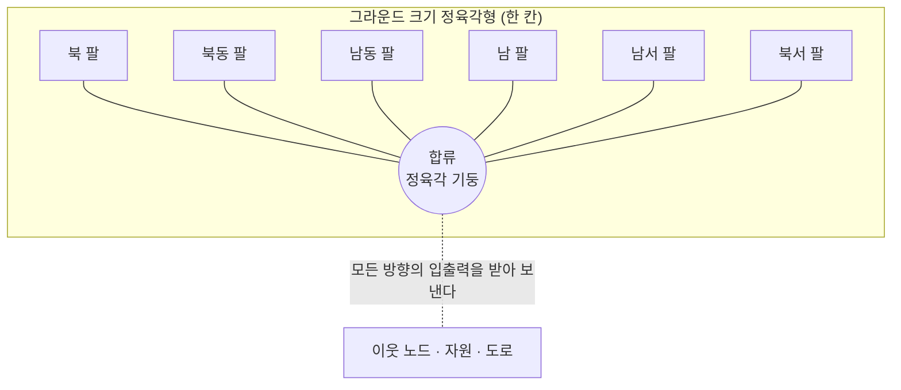
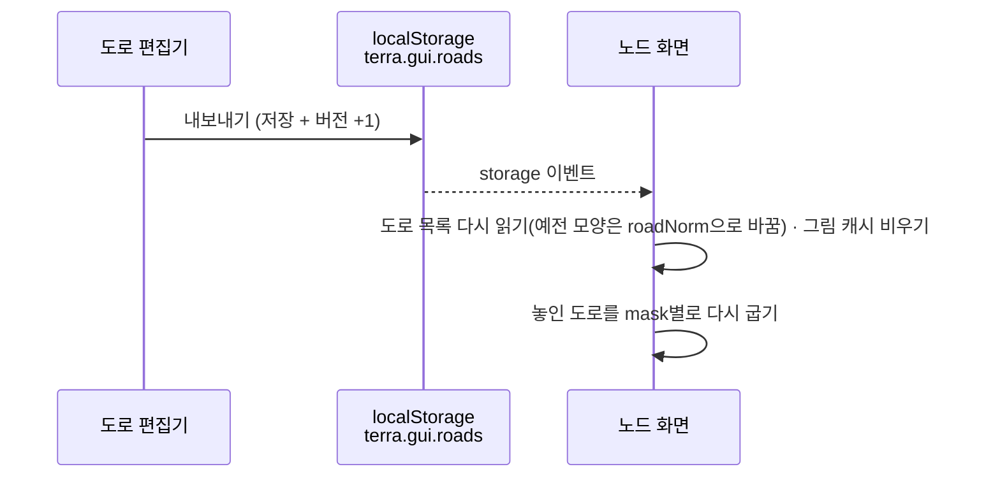

# 도로 편집기 · 건물 타입 도로

도로는 **건물 타입** 중 하나다. 건물처럼 블록을 쌓아 디자인하고 애니메이션을 넣을 수 있다.
건물과 다른 점은 **인접한 노드 · 노드 자원 · 다른 도로와 자연스럽게 이어진 모습**을 보이는 것이다.
그래서 설치 범위가 건물보다 넓고(그라운드 크기), 모양이 방향에 따라 바뀐다. 이 규칙이 복잡해서
별도의 편집 보드 `RoadEditor.dc.html`(캔버스 제목 「도로 편집기」)에서 만든다.

## 1. 구조 — 팔 여섯 + 합류 하나



| 부분 | 범위 | 디자인 |
| --- | --- | --- |
| 팔 | 중심과 육각형 한 변이 이루는 **정삼각형**(정육각형의 1/6). 반지름 = 그라운드 크기(중심 → 변 80) | 블록(정육면체) 쌓기 · 8층 · 키프레임 애니메이션 |
| 합류 | 가운데 **작은 정육각 기둥**. 한 변 기본 40(필드 한 변의 1/2), **12~70에서 조절** | 크기(한 변) · 높이(블록 단) · 윗면 자재 · 옆면 자재 |

### 왜 합류가 필요한가

모든 구조는 정육면체가 바탕이라 6방향을 한 격자에 맞출 수 없다. 그래서

1. 팔은 **자기 방향으로 돌린 격자**를 쓴다 (팔 하나를 설계하면 그 설계가 여섯 방향으로 돌아가 놓인다).
2. 격자들이 어긋나는 가운데는 합류가 덮는다. 합류에 덮이는 칸(칸 가운데가 합류 안)은 그리지 않는다.
3. 입출력 관점에서 합류는 **모든 방향에서 데이터를 받아 보내는 합류 컴포넌트**다.

## 2. 맵에서 — 연결이 지나는 방향으로만 팔

- 도로는 주로 **연결하기**로 깔린다([[node-screen-ui-spec#2.10 연결하기 — 도로 배치|UI 명세 §2.10]]). 팔은 연결의 칸 차례 `[출발, …길, 도착]`에서 이웃한 두 칸 사이에만 생긴다 — 옆에 도로 · 자원 · 노드가 있다고 잇지 않는다.
- 다른 연결의 길을 지나는 칸은 두 연결의 팔이 만나는 **합류**가 된다.
- 편집 창에서 손으로 놓은 도로(연결 없음)는 손으로 놓은 이웃 도로와만 잇는다. 노드 · 자원 필드에는 놓지 않는다.
- 팔 길이는 그 방향 이웃 칸까지 거리의 절반으로 맞춘다(세로 이웃 83.9 · 비스듬한 이웃 77.4, 세계 좌표) — 두 칸의 팔이 경계에서 정확히 만난다.
- 방향 조합(6비트 mask)마다 PNG 한 장으로 굽고 캐시한다 (`이름|mask|버전`). 굽는 동안은 단색 벡터로 그린다.
- 회전(`R`)은 쓰지 않는다 — 방향은 연결이 정한다.



> [!NOTE] Terra 안에서 (모듈)
> 도로 편집기는 노드 화면의 전체 화면 보드로 뜬다 — 유틸 서랍의 `🛣️ 도로 편집기` 칸을 전체 화면으로 열면 `road.html`을 srcdoc으로 넣는다([[module-profile|모듈 프로필]] §6).
> 보드와 노드 화면은 같은 origin이라 `localStorage`를 같이 쓰고, 내보내기의 `storage` 이벤트가 노드 화면에 닿는다
> (실측: 내보내기 → 노드 화면에 「도로 편집기에서 도로를 받았습니다」, 2026-10-04). 내보낸 도로는 이 브라우저에만 있다 — 서버 저장(AssetStore)은 아직 없다.

## 3. 편집기 화면 (1440×900) — 건물 편집기와 같은 3D 편집

`BuildingEditor.dc.html`과 같은 화면 · 조작이다. 바닥판이 **팔 삼각형**이고, 가운데에 합류 기둥이 서 있다.

| 구역 | 내용 |
| --- | --- |
| 왼쪽 | 도로 설계 트리(기본 도로: 돌길 · 정원길 · 데이터 레일 / 내 도로) · 새 폴더 · 삭제 · `+ 새 도로`. 다른 도로를 끌어 놓으면 지금 팔에 합쳐진다 |
| 가운데 | 3D 편집 화면. 바닥판 = 팔 삼각형(회색 칸 = 합류에 덮이는 칸), 점선 = 그라운드 육각형. **다른 팔**을 켜면 나머지 다섯 팔이 흐리게 보인다 |
| 왼쪽 위 판 | **가로 · 세로(화소 수) N = 4~64, 기본 48** — 바꾸면 팔 모양(실제 크기)을 그대로 두고 새 격자로 다시 뽑는다(16 → 32면 블록 하나가 2×2×2). 합류 높이도 같은 실제 높이로 |
| 애니메이션 | 건물과 같은 칸 배열(1초 = 16칸, 1~4초) · 복제 간격 · 재생 |
| 오른쪽 위 판 | **미리보기**(맵 투시, 방향 버튼으로 팔을 켜고 끔) · **합류** 높이 −/+ (단) · 크기 −/+ (한 변, 4씩) · 윗면 · 옆면 ← 활성 자재 · 내보내기 결과 |
| 아래 이벤트 막대 | `기본 · 동작 · 대기 · 정지 · 실패` · **방향**(`→◎ 들어옴 · ◎→ 나감 · ⇄ 양방향`) · 사용자 이벤트 · `+ 이벤트`. 고르면 그 이벤트의 디자인을 편집한다. 점선 칩 = 아직 디자인 없음(기본을 복사해 보여 줌 · 고치면 생김). `디자인 지우기` · `이벤트 삭제` |
| 오른쪽 | 시점 큐브 · 자재 트리 |
| 머리 | 일반 / 애니메이션 도로 · 저장 · **노드 화면으로 내보내기** |

조작은 건물 편집기와 같다: 좌클릭 끌기 = 회전 · 자재 클릭 = 활성 · 우클릭 누르고 있기 = 설치 준비(R · T로 방향) · 떼기 = 설치 · 좌클릭 = 블록 제거.

## 4. 데이터

```json
{
  "id": "rail",
  "name": "데이터 레일",
  "N": 32,
  "blocks": [[15, 17, 0, "m7", 0]],
  "frames": [[[15, 17, 0, "m7", 0]], null, null, null, [[15, 18, 0, "m7", 0]]],
  "period": 2,
  "hub": { "h": 6, "top": "m22", "side": "m12", "r": 40 },
  "events": { "fail": { "blocks": [], "frames": null, "period": 1, "hub": { "top": "m2" } }, "dir-in": { "blocks": [] } },
  "customEvents": [{ "id": "c-…", "name": "점검 중" }],
  "v": 3
}
```

| 필드 | 뜻 |
| --- | --- |
| `N` | 격자 칸 수 (그라운드 폭 160 = N칸, 칸 한 변 160 / N). 가운데 c = N / 2 |
| `blocks` | 팔 블록 `[x, y, z, 자재, 방향]` (= 칸 0의 프레임). 칸 가운데 u = (x + 0.5 − c)·S, v = (y + 0.5 − c)·S. v > 0 · \|u\| ≤ v·tan30° · v ≤ 80 인 칸만 |
| `frames` · `period` | 건물과 같은 칸 배열(16 × 초, `null` = 앞 프레임). 움직이지 않으면 `null` |
| `hub` | 합류 높이(블록 단) · 윗면 · 옆면 자재 · `r` = 한 변(기본 40) — 이 안에 가운데가 든 팔 칸은 덮여 그리지 않는다 |
| `events` | 이벤트별 디자인 `{ blocks, frames, period, hub? }`. 키 = `run · wait · stop · fail · dir-in · dir-out · dir-both · c-<id>`. 방향 이벤트는 팔에만 쓴다 |
| `customEvents` | 사용자 이벤트 이름 목록 |
| `v` | 내보낼 때마다 +1 — 노드 화면의 그림 캐시 키 |

예전 모양(가로 10 × 세로 8 격자 · 키프레임 + `fps`)은 `roadNorm`이 읽을 때 바꾼다(16칸 격자로 x + 3 · y + 8, 키프레임 → 칸 배열).
맵에 놓인 도로는 건물과 같은 `placed[칸] = { bid: 'road:<id>', rot: 0 }`, 연결은 `links`.

## 5. 코드

두 보드가 **같은 코드**를 쓴다(`ROAD(N)` · `roadCells(N)` · `roadUnderHub` · `roadDirs` · `roadNorm` · `roadSamples` · `roadFrames` · `voxFaces` · `roadModel` · `roadSvg` · `roadSeq`). 도로 편집기는 건물 편집기 코드에 `region(N)`(팔 삼각형) · 합류 기둥 · 다른 팔 · 미리보기를 더한 것이다.
노드 화면에만 있는 것: `roadLoad` · `isRoad` · `roadOf` · `roadBldg` · `roadImgOf`(굽기 · 애니메이션 등록 `r:<키>`).

> [!NOTE] 그리는 차례
> 팔의 면은 높이(층) → 깊이 순으로, 합류 뒤의 팔 → 합류(옆면 → 윗면) → 합류 앞의 팔 순서로 그린다.
> 납작한 길 위에 올린 블록(예: 데이터 레일의 패킷)이 길 윗면에 가려지지 않게 하려는 것이다.

## 관련 문서

- [[node-screen-ui-spec|노드 화면 UI 명세]] — §2.6~2.9 선택 강조 · 상태 창 · 노드 자원 · 표지, §7.5 도로
- [[docs/README|개발 문서 MOC]]
- [[module-profile|모듈 프로필]] — Terra 안에서 보드로 뜨는 길 · 저장

## 관련 모듈

- `src/screens/road.js` · `road.html` — 도로 편집기 (원본 `design/RoadEditor.dc.html`에서 생성)
- `src/screens/node.js` — `roadLoad` · `roadOf` · `roadBldg` · `roadImgOf` · `connSeg` · `routeRemove`
- `src/api/frame-boards.js` — Terra 안에서 전체 화면 보드(srcdoc)로 띄운다

## 관련 흐름

- 편집 창 건물 탭 → 도로 끌기 → 빈 필드/그라운드에 놓기 → 이웃 쪽 팔 연결
- 도로 편집기 → 내보내기 → 노드 화면이 바로 다시 굽기
