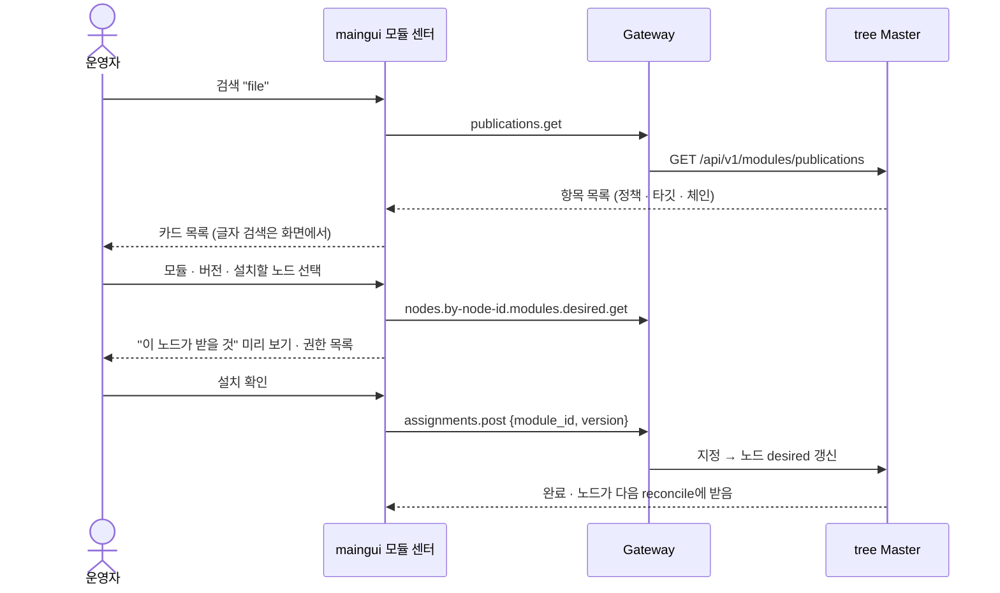

# 모듈 배포 GUI 설계 — 가져오기 · tree 배포 · tree 검색 설치

> **한 줄 요약** — Terra tree에는 모듈 배포 백엔드(레지스트리 · 승격 · 미러)가 **이미 구현**되어 있고 CLI로 전부 쓸 수 있다. 그러나 `modules` 저장소에 `io.terra.registry` 모듈은 **없고**, maingui에도 화면이 없다. 이 문서는 그 빈 곳을 GUI로 메우는 설계다.

## 1. 확인 결과 — `io.terra.registry`는 어디에 있는가

### 1.1 `modules` 저장소 (2026-10-06 확인)

| 구분 | 모듈 |
| --- | --- |
| `common/` | `dev.terrallo` · `io.terra.agent` · `io.terra.nodetalk` · `io.terra.sample.window` · `io.terra.scene.login-demo` · `io.terra.webapp-host` · `lab.stellaxia.node-gui` · `lab.stellaxia.scene.hello` · `lab.stellaxia.scene.main-test` |
| `leaf/` | `io.terra.file` · `io.terra.io-inventory` · `io.terra.io-weave` |
| `tree/` | `io.terra.fleet` · `io.terra.treebench` |

- **`io.terra.registry`는 없다.** 디렉터리도, 매니페스트도, 소스도 없다. 저장소에서 `registry`가 나오는 곳은 `io.terra.io-inventory`의 *장치 레지스트리*와 `io.terra.agent`의 *MCP 레지스트리*뿐이고, 모듈 배포와 무관하다.
- 이름은 Terra 문서에만 있다 — "계획 §M1 잔여"(`docs/reference/implemented-features.md`), "모듈 배포 §M4 유보"(`ws5-data-ui-contribution-status.md`), "카탈로그·심사 화면 없음 ⛔"(`known-limitations.md`).

### 1.2 Terra 저장소 — 백엔드는 완성되어 있다

| 층 | 구현 | 위치 |
| --- | --- | --- |
| tree 레지스트리 서비스 | 업로드 · 게시 · 카탈로그 · 철회 · 접두사 · 승격 수신/전진 · 미러 · 보존 sweep · desired 계산 | `products/tree/master/src/terra_master/moduleregistry/` (약 7,400줄) |
| tree HTTP API | `/api/v1/modules/*` · `/api/v1/nodes/{id}/modules/{desired,pins,assignments}` | `…/api/http_server.go` · `routes_module_*.go` |
| Gateway operation | `terra.master.modules.*` 20개 | `terra-api-contract` |
| 노드 로컬 Daemon | `/modules/offers` · `consent` · `withdraw` · `scan` · `catalog` | `products/leaf/daemon/src/terra_daemon/local_api/module_consent_routes.go` |
| CLI | `terra module <pack · acquire · install · installed · rollback · uninstall · publish · catalog · fetch · revoke · prefix · mirror · envelope · ceiling · pin · unpin · rollout · desired · explain · promote · outbox · promotions · approve · reject · export · import · offers · consent · withdraw>` | `terra-cli/internal/app/module_*.go` |

**빠진 것은 GUI 하나다.** 그래서 이 설계의 핵심은 새 백엔드를 만드는 것이 아니라 **있는 Gateway op를 화면에 붙이는 것**이다.

## 2. 지금 maingui에 있는 것 · 없는 것

| 하고 싶은 일 | 현재 | 근거 |
| --- | --- | --- |
| 노드에 모듈 깔기 · 풀기 (모듈 id + 버전을 **알고 있을 때**) | ✅ | A-22 · `assignments.post/delete` |
| 모듈 설정 · 수명 · 로그 · 모듈 GUI | ✅ | A-1 · A-17 · A-29 |
| tree가 제안한 모듈에 동의 · 철회 | ⚠ 설정 화면의 카드가 **목업** (`settings.js` "모듈 설치 동의") | `modules.offers.*` 미연결 |
| **① 외부 모듈 가져와 설치** (`.tmod` 파일 · URL · 에어갭 `.tbundle`) | ❌ | 화면 없음 |
| **② tree로 모듈 배포** (업로드 → 게시 → 정책 → 롤아웃 → 승격 · 심사 · 철회) | ❌ | "모듈 배포 정책" 행이 **글자뿐** |
| **③ tree 카탈로그에서 모듈 검색해 설치** | ❌ | 카탈로그 목록 화면 없음 |
| 핀 · desired 확인 · 왜 안 깔렸는가(explain) | ❌ | CLI 전용 |

## 3. 범위 결정 — 누가 이 화면을 만드는가

[[onboarding-gap-analysis|온보딩 공백 분석]] Q-2는 *"카탈로그·심사 화면은 maingui가 아니라 모듈(`io.terra.registry`)의 몫"*으로 닫혀 있다. Terra의 D-10(레지스트리 GUI는 코어 밖)을 따른 결정이다. 그런데 그 모듈이 **존재하지 않으므로**, 지금 이 결정은 "아무도 안 만든다"로 굳어 있다.

| 안 | 내용 | 장점 | 단점 |
| --- | --- | --- | --- |
| **A. `io.terra.registry` 모듈을 `modules`에 만든다** | tree에 얹는 웹앱 모듈. maingui는 모듈 GUI 창으로 띄운다 | Terra D-10 · Q-2와 그대로 맞는다. 모듈이므로 스스로 배포 · 갱신된다 | maingui와 **디자인 · 로그인 · 권한이 이중**이 된다. 모듈이 깔리기 전엔 모듈을 깔 화면이 없는 **닭-달걀** 문제 |
| **B. maingui에 내장한다** (화면 `modules.html`) | Gateway op만 호출. 데이터는 Gateway에서만 | 한 로그인 · 한 테마. 모듈이 없어도 열린다. 이미 있는 A-22 · 설정 · 권한 잠금 코드를 재사용 | Q-2와 어긋난다 → **결정을 바꿔야 한다** |
| **C. 둘 다** | maingui가 화면을 만들고, 나중에 모듈로 옮길 수 있게 Gateway op 층만 쓴다 | 위험이 가장 작다 | 일이 는다 |

> [!TIP] 권고 — **B(maingui 내장)**
> D-10의 취지는 "레지스트리 **서버 로직**을 코어에 넣지 않는다"이다. maingui는 Gateway의 클라이언트이고 서버 로직이 아니므로 취지를 어기지 않는다. 또 이 화면은 *모듈이 하나도 없는 새 tree*에서 가장 먼저 필요하다(닭-달걀). 서버 로직은 이미 Terra에 있으니 이 설계는 **op 호출 · 화면 · 잠금**만 만든다. 이 권고를 받으면 Q-2를 다시 열어 "maingui 내장"으로 고친다 (§9 D-1).

이후 문서는 B를 전제로 쓴다. A로 정해도 §4 · §5의 **화면 구성과 op 매핑은 그대로 재사용**된다.

## 4. 기능과 Gateway operation 매핑

권한 이름은 코드에서 확인한 값이다. 요청 본문 중 이 문서에 적지 않은 필드는 구현 때 계약(`terra-api-contract`)으로 확인한다.

### 4.1 ③ tree 카탈로그 검색 → 설치

| 단계 | operation | 권한 | 비고 |
| --- | --- | --- | --- |
| 카탈로그 읽기 | `terra.master.modules.publications.get` (`?module_id=`) | `node.read` | 항목 = `{publication, targets{target→digest}, chain[]}`. **서버 검색은 `module_id` 정확 일치뿐** → 글자 검색 · 정렬 · 필터는 **화면이 한다** |
| 접두사(발행 권한) 목록 | `terra.master.modules.prefixes.get` | `node.read` | 신뢰 표시용 |
| 이 노드에 깔기 (지정) | `terra.master.nodes.by-node-id.modules.assignments.post {module_id, version}` | `module.manage` | **이미 있음(A-22)**. 이 노드에만 `required`가 된다 |
| 풀기 | `…assignments.by-module-id.delete` | `module.manage` | 지정을 풀면 retire |
| 노드가 받을 것 미리 보기 | `terra.master.nodes.by-node-id.modules.desired.get` | `node.read` | 정책 사다리 적용 결과 |
| 핀 · 핀 풀기 | `…modules.pins.post` · `…pins.by-module-id.delete` | `node.control` | 이 노드는 이 버전에 고정 |
| 노드 주인이 받기 | `terra.daemon.modules.offers.get` → `…offers.by-module-id.consent.post` | 로컬 노드 | `recommended` · `available`은 **주인이 동의해야** 깔린다 |
| 동의 철회 | `…offers.by-module-id.withdraw.post` | 로컬 노드 | 중지 · 제거 |

### 4.2 ② tree 배포 (게시자 · 심사자)

| 단계 | operation | 권한 | 비고 |
| --- | --- | --- | --- |
| 패키지 올리기 | `terra.master.modules.packages.by-digest.put` | `module.publish` | 경로의 digest = `.tmod`의 sha256. 본문은 **바이트 스트림** (상한 2 GiB). 서버가 스트리밍 중 digest · 매니페스트 · 접두사를 검증한다 |
| 올린 패키지 정보 | `…packages.by-digest.get` | `node.read` | 다운로드(Range 지원) |
| 게시 | `terra.master.modules.publications.post {digest, policy}` | `module.publish` | policy = `available` · `recommended` · `required`. 접두사를 못 받았으면 거절 |
| 롤아웃 | `…publications.by-publication-id.rollout.post {stage, canary_node_id?}` | `module.publish` | 단계 1 · 10 · 50 · 100 (%) · 카나리 노드 |
| 철회 | `…publications.by-publication-id.revoke.post {reason, security}` | `module.publish` | `security: true`면 노드가 payload를 **즉시 삭제**, 아니면 중지 후 보관 |
| 위로 승격 요청 | `…publications.by-publication-id.promote.post {up, note}` | `module.publish` | `up` = 올라갈 tree 홉 수 |
| 보낸 승격함 | `terra.master.modules.promotions.outbox.get` | `node.read` | 요청 상태 추적 |
| 받은 승격 심사 목록 | `terra.master.modules.promotions.get` | `node.read` | 권한 차이(permission diff) 포함 |
| 승인 · 반려 | `…promotions.by-promotion-id.approve.post {policy?, acknowledge_permissions?}` · `…reject.post` | `module.approve` | 권한이 **늘어나는** 승격은 `acknowledge_permissions`(보여 준 diff의 digest)가 필수 → **diff를 화면에 보여 주고 확인해야** 호출된다 |
| 접두사 부여 | `terra.master.modules.prefixes.post {prefix}` | `master_admin` | 신뢰의 뿌리 |
| 접두사 봉투 | `…prefixes.by-prefix.envelope.post` | `master_admin` | available · recommended · required 상한 |
| 승인 상한 | `terra.master.modules.approval-ceiling.get/post` | get `node.read` · post `master_admin` | |
| 미러 차단 | `terra.master.modules.mirror-blocks.get/post` · `…by-pattern.delete` | get `node.read` · 쓰기 `module.publish` | 패턴 + 사유 |
| 신뢰 앵커 | `terra.master.modules.trust-anchor.get` | `node.read` | 서명 검증 정보 표시 |

### 4.3 ① 외부 모듈 가져오기

| 방식 | 지금 가능한 길 | GUI 가능 여부 |
| --- | --- | --- |
| `.tmod`를 **tree에 올려 배포** | `packages.put` → `publications.post` (§4.2) | ✅ **가능** — 브라우저가 파일을 읽어 digest를 계산(`src/api/sha256.js`가 이미 있다)하고 올린다 |
| `.tmod`를 **한 노드에만 직접 설치** | CLI `terra module install <file.tmod>`(로컬 파일 전제) | ❌ **Gateway op 없음** — 대안: 위 경로로 tree에 올린 뒤 그 노드에 지정(assignments) |
| 에어갭 `.tbundle` 가져오기 · 내보내기 | CLI `terra module import/export` | ❌ **op 없음** — Terra에 op가 필요하다 (§7 G-2) |
| 다른 tree에서 가져오기 | 승격(위로) · 미러(아래로 자동) | ✅ 승격은 §4.2 · 미러는 자동 |

> [!WARNING]
> 외부에서 가져온 `.tmod`는 **서명 · 접두사 · 신뢰 체인 검사를 통과해야** 게시된다. 화면은 이 검사를 우회하는 길(예: `--dev` 미서명 설치)을 **만들지 않는다**. 검사에 실패하면 서버의 거절 코드를 그대로 이유와 함께 보여 준다.

## 5. 화면 설계 — "모듈 센터" (`modules.html`)

기존 화면(`node` · `field` · `settings` …)과 같은 방식으로 `design/Modules.dc.html`(이미 시안이 있다)에서 생성한다. **어두운 유리 HUD 테마**([[gui-theme-v2|GUI 테마]])를 따른다.

### 5.1 구성 — 탭 5개

| 탭 | 보이는 사람 | 내용 |
| --- | --- | --- |
| **카탈로그** | 로그인한 모두 (`node.read`) | 모듈 카드 목록 · 글자 검색 · 필터(정책 · 상태 · 타깃 · 접두사) · 버전 목록 · 서명 체인 · "설치" |
| **올리기 · 게시** | `module.publish` | `.tmod` 끌어놓기 → 매니페스트 미리 보기 → 정책 선택 → 게시 → 롤아웃 단계 · 철회 |
| **승격 · 심사** | `module.publish` (보낸함) · `module.approve` (받은함) | 상태 추적 · 권한 diff 확인 후 승인 · 반려 |
| **정책** | `node.read`(읽기) · `master_admin`(쓰기) | 접두사 · 봉투 · 승인 상한 · 미러 차단 |
| **내 노드** | 로컬 노드 주인 | tree의 제안 · 동의 · 철회 · desired · 핀 · "왜 안 깔렸나" |

권한이 없는 탭은 **숨기지 않고 잠근다** — 기존 규칙(A-5 · C-6: 누르기 전에 🔒 + 이유)을 그대로 쓴다.

### 5.2 ③ 카탈로그 → 설치 흐름

카드에 보이는 것: 모듈 id · 최신 버전 · 정책 배지(`required` / `recommended` / `available`) · 발행 tree · 서명 체인 깊이 · **지원 타깃**(`linux-amd64` …) · 요청 권한.

- **타깃이 맞지 않는 노드**는 설치 버튼을 잠그고 "이 노드(`windows-amd64`)용 빌드가 게시되지 않았다"고 말한다(D-2b 단일 타깃 게시).
- **철회된 게시**는 흐리게 보이고 설치할 수 없다. 보안 철회(`security_revoked`)는 빨간 배지.

### 5.3 ② 올리기 → 게시 → 롤아웃 흐름

1. `.tmod`를 끌어놓는다. 브라우저가 sha256을 **스트리밍으로** 계산한다(큰 파일이므로 한 번에 메모리에 올리지 않는다).
2. 매니페스트를 읽어 id · 버전 · 권한 · 접두사 소유 여부를 **업로드 전에** 보여 준다(접두사가 없으면 여기서 막는다).
3. `packages.put` — 진행률 · 취소. 서버가 digest 불일치 · 압축 폭탄 · 접두사 위반을 거절하면 그 코드를 한국어 문장으로 풀어 보여 준다.
4. 정책 고르기 — **접두사 봉투가 허용하는 정책만** 활성. `required`는 "subtree 전체에 자동 설치된다"를 경고로 확인받는다.
5. 게시 → 롤아웃 단계(1 → 10 → 50 → 100) 슬라이더 + 카나리 노드 지정.
6. 철회 — `reason` 필수. **보안 철회**는 "노드의 payload가 즉시 삭제된다"를 확인받는다.

### 5.4 ① 가져오기 진입점

| 진입점 | 동작 |
| --- | --- |
| 카탈로그의 "+ 가져오기" · 올리기 탭의 끌어놓기 | `.tmod` 업로드(§5.3) |
| URL 입력 | **브라우저가 받지 않는다.** 서버 쪽 fetch op가 없어 CORS · 신뢰 문제가 있다 → G-3으로 미룬다 |
| `.tbundle`(에어갭) | Gateway op가 생기면 같은 끌어놓기 칸에서 받는다(§7 G-2). 그 전에는 "CLI `terra module import`로 가져오세요" 안내 카드 |

## 6. 코드 위치 · 재사용

| 일 | 위치 | 재사용 |
| --- | --- | --- |
| operation 이름 · 권한 | `src/api/operations.js` | `HELM_CRUD` · `G()` 패턴 |
| 업로드 | `src/api/files.js` · `src/api/sha256.js` | 파일 전송 · digest 계산 |
| 권한 잠금 · 이유 | `src/model/permissions.js` · `source.lockFor` | A-5 · C-6 그대로 |
| 노드 지정(깔기) | `node.js`의 `HBCRUD().mod` | 카드의 "설치"가 같은 op를 부른다 |
| 동의 카드 | `settings.js` "모듈 설치 동의" (목업) | **진짜 op에 연결**해 이 화면으로 옮기고, 설정 화면에는 링크만 남긴다 |
| 화면 등록 | `tools/pages.json` · `tools/gen-pages.py` · `src/screens/index.js` | 새 화면 `modules` 추가 |
| 시안 | `design/Modules.dc.html` · `ModulesDark.dc.html` | 기존 시안을 확장 |

가짜 Gateway(`tools/mock-gateway.mjs`)에 `publications` · `promotions` · `packages` · `offers` 응답을 더해 Gateway 없이도 시험한다([[testing|시험]]).

## 7. Terra 쪽에 필요한 것 (Gateway 공백)

maingui가 만들 수 없는 것이다. Terra에 요청하고, 오기 전까지는 화면에 "CLI로 하세요" 안내를 둔다.

| ID | 필요한 것 | 이유 | 대안 |
| --- | --- | --- | --- |
| **G-1** | 브라우저 → Gateway로 **큰 바이너리 PUT**(`packages.by-digest.put`)이 통과하는지 확인 | 2 GiB 스트림 · 본문 한도 · 프록시(`/gw`) 한도. 이 문서는 **미검증** | 안 되면 청크 업로드 op 요청 |
| **G-2** | 에어갭 `export`/`import`(`.tbundle`)의 op | 지금은 CLI 전용 | CLI 안내 |
| **G-3** | 한 노드에 `.tmod`를 직접 설치하는 op · URL fetch op | CLI `install`은 로컬 파일 전제 | tree에 올린 뒤 지정(§4.3) |
| **G-4** | 카탈로그 **서버 검색**(이름 부분 일치 · 페이지) | 지금 `module_id` 정확 일치뿐 | 전체를 받아 화면에서 거름 — **수백 모듈 이상이면 부족** |
| **G-5** | `explain`(왜 안 깔렸나)의 op | CLI가 desired + observed를 합성한다 | 화면이 `desired.get`과 노드 보고로 **같은 판정을 합성**(D-2b · D-11 · 핀 · 철회 · 보고된 `install_failed`) |
| **G-6** | `observed` 보고 조회 | 노드별 설치 결과 · 실패 사유 표시 | `nodes.by-node-id.modules.get`(이미 있음)으로 대체 |
| **G-7** | 로컬 Daemon의 제안(`offers`)이 **원격 노드**에도 열리는지 | 동의는 노드 주인의 진술이라 로컬 전용이 설계 | `terra.daemon.modules.offers.*`가 catalog에 보이는 노드만 지원 |

## 8. 보안 · 안전 규칙

- **서명 검사를 우회하는 길을 만들지 않는다** — 미서명(`allow_dev_install`) 설치 스위치를 화면에 두지 않는다.
- **동의는 노드 주인의 것**이다. tree 운영자 화면에 "대신 동의"를 만들지 않는다. `required`는 동의를 묻지 않고 **보이기만** 한다(`managed` 배지).
- **권한이 늘어나는 승격**은 diff를 화면에 **보여 준 뒤에만** `acknowledge_permissions`를 보낸다. 값을 화면이 임의로 만들지 않는다.
- **위험 동작 확인** — `required` 게시 · 보안 철회 · 롤아웃 100% · 승격 승인은 한 번 더 확인한다(catalog의 `execution.risk`와 별개로 화면이 묻는다).
- **감사** — 서버가 모든 쓰기를 감사 기록으로 남기므로 화면은 호출 결과(`publication_id` · 사유)를 토스트와 이력 칸에 보여 준다.
- 모듈이 들고 온 매니페스트 · 이름 · 설명은 **신뢰하지 않는 텍스트**다. HTML로 넣지 않고 `textContent`로만 쓴다.

## 9. 구현 단계

| 단계 | 내용 | 선행 | 규모 |
| --- | --- | --- | --- |
| **G-1** | `modules.html` 뼈대 + 카탈로그 읽기 · 검색 · 필터 + 노드에 설치(기존 A-22 연결) | 없음 | 중 |
| **G-2** | 내 노드 탭 — `offers` 실연결(설정 화면의 목업 제거) · 동의 · 철회 · desired · 핀 | G-7 확인 | 소 |
| **G-3** | 올리기 · 게시 — 업로드 · 매니페스트 미리 보기 · 정책 · 롤아웃 · 철회 | Terra G-1 확인 | 대 |
| **G-4** | 승격 · 심사 — 보낸함 · 받은함 · 권한 diff 확인 · 승인 · 반려 | G-3 | 중 |
| **G-5** | 정책 탭 — 접두사 · 봉투 · 상한 · 미러 차단 · 신뢰 앵커 표시 | G-3 | 중 |
| **G-6** | explain 합성 · 에어갭 · URL 가져오기 | Terra G-2 · G-3 · G-5 | 중 |

각 단계는 그 자체로 쓸모 있게 끝낸다. 단계마다 가짜 Gateway 시험 + `tests/smoke.mjs` 항목을 더하고, 실 Gateway가 있으면 `tests/live-api.mjs`로 맞춰 본다.

## 10. 결정이 필요한 것

| ID | 질문 | 권고 |
| --- | --- | --- |
| **D-1** | 누가 만드는가 — A(`io.terra.registry` 모듈) · B(maingui 내장) · C(둘 다) | **B.** Q-2를 "maingui 내장"으로 고친다 (§3) |
| **D-2** | 첫 단계는 읽기 전용(카탈로그 · 설치 · 동의)만 먼저 내보낼까 | **예.** G-1 · G-2는 권한이 가볍고 위험이 작다. 게시 · 심사(G-3~)는 확인 규칙을 굳힌 뒤 |
| **D-3** | 카탈로그 검색을 서버에 요청할까(Terra G-4), 화면에서 거를까 | 먼저 화면에서. 모듈 수가 늘면 서버 검색 요청 |
| **D-4** | 설정 화면의 "모듈 설치 동의" 목업을 옮길까 | **예.** 모듈 센터 "내 노드"로 옮기고 설정에는 링크 |

## 11. 이 문서가 확인하지 않은 것

- Gateway를 통한 큰 바이너리 업로드 · 각 op의 **요청 본문 전체 필드**(봉투 · 승인 상한 · 미러 차단의 일부) — 구현 때 계약으로 확인한다.
- 실 tree에 띄워 본 동작. 이 문서는 **소스와 문서 읽기**로 쓴 것이고, 실행해 본 것이 아니다.
- `modules` 저장소의 다른 브랜치나 `Terra`의 미병합 PR에 `io.terra.registry`가 있는지. 확인한 것은 클론된 기본 상태뿐이다.

## 관련 문서

- [[onboarding-gap-analysis|온보딩 공백 분석]] — M-2 · Q-2 (이 설계가 바꾸려는 결정)
- [[implementation-backlog|구현 백로그]] — A-22 · B-6 (이미 있는 설치 · 풀기)
- [[terra-gateway-facts|Gateway 실제 동작]] — 호출 규칙 · 권한 · 봉투
- [[decision-recommendations|결정 권고안]] — 모듈 GUI 격리 · 모듈 자물쇠
- [[system-design|설계서]] · [[user-manual|사용 설명서]]
